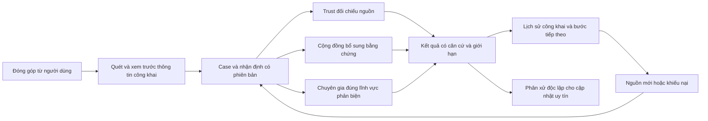

# StudentHub AI — Kế hoạch nâng cấp Community và Expert cho sản phẩm dự thi

Ngày lập: 09/09/2026 · Trạng thái: **Đã triển khai local trong worktree; migration/staging gates chờ môi trường**.

Phạm vi: hai nhánh trong ảnh người dùng cung cấp — Diễn đàn cộng đồng và Chuyên gia / Uy tín — kết nối với Trust hiện có. Đây là kế hoạch sản phẩm, kỹ thuật và kiểm chứng giá trị; không phải cam kết giải thưởng.

Ảnh được xem là phương án đầu vào để phản biện. Các quy tắc trong ảnh như “chuyên gia luôn đứng đầu”, “giữ 100 điểm để lên sao” và “quiz mỗi hai ngày” không được xem là chỉ thị bắt buộc triển khai.

## 1. Quyết định sản phẩm

**Xây một cộng đồng kiểm chứng thông tin, trong đó từng nhận định có bằng chứng, người phản biện đúng chuyên môn và lịch sử sửa sai.**

Người dùng cần trả lời được bốn câu hỏi: chuyện gì đang được khẳng định; bằng chứng nào liên quan; còn điểm nào chưa biết; bước tiếp theo phù hợp là gì. Like, điểm và huy hiệu hỗ trợ việc cộng tác, không quyết định tính đúng của thông tin.

Ba trụ cột hiện hữu giữ vai trò riêng:

| Trụ cột | Đóng góp chính | Giới hạn quyền |
| --- | --- | --- |
| Trust | Trích xuất nhận định, đối chiếu nguồn, trình bày bằng chứng và giới hạn | Không biến suy luận AI thành sự thật đã được xác nhận |
| Community | Trải nghiệm trực tiếp, phát hiện sớm, bằng chứng bổ sung, phản biện | Đồng thuận cộng đồng không thay thế chứng cứ hoặc văn bản có thẩm quyền đúng phạm vi |
| Expert | Phân tích chuyên môn, giải quyết mâu thuẫn, đánh giá trong phạm vi được xác minh | Không có đặc quyền luôn đúng; không được tự cấp quyền hoặc tự xử khiếu nại về mình |

**Giả thuyết giá trị cần chứng minh:** so với diễn đàn xếp theo lượt thích và công cụ AI hoạt động riêng lẻ, quy trình phối hợp giúp sinh viên chọn bước xử lý phù hợp hơn, tìm được bằng chứng liên quan nhanh hơn, đồng thời ít đưa ra kết luận chắc chắn khi dữ liệu chưa đủ.

Chọn một ca chủ lực về **thông báo học bổng có yêu cầu chuyển tiền**. Hai nhóm mở rộng là tuyển dụng/thực tập và nhà trọ. Chỉ mở rộng khi ca chủ lực đã chạy xuyên suốt. Không mở thêm trụ cột sản phẩm.

Giả định lịch: tám tuần, bốn thành viên đảm nhận product/UX, frontend, backend và AI/evaluation; có hai người phản biện chuyên môn bán thời gian. Đây là ước lượng để phân bổ việc, cần điều chỉnh theo nhân lực thực tế. Mục 12 có phương án 14 ngày.

Tên cuộc thi, bảng thi, hạn nộp và rubric chưa được xác nhận trong yêu cầu này. Tài liệu [Competition Fit trước đó](../frontend/national-experience-2026-09-08/COMPETITION-FIT.md) cũng giữ trạng thái chưa xác định duy nhất cuộc thi. Không lấy thể lệ hoặc deadline của một cuộc thi tương tự làm điều kiện đã xác nhận.

## 2. Những thay đổi cần thực hiện so với ảnh

| Phương án trong ảnh | Vấn đề khi đưa vào thực tế | Quyết định đề xuất |
| --- | --- | --- |
| Người dùng và chuyên gia cùng diễn đàn | Hợp lý, nhưng cần biết ai đang phát biểu với vai trò nào | Giữ diễn đàn chung; hiển thị chuyên môn và phạm vi áp dụng ngay cạnh nhận xét |
| Tự làm mờ thông tin cá nhân | Xóa tên tài khoản chưa xử lý PII trong nội dung, ảnh, QR hoặc metadata | Kiểm tra cả văn bản và tệp; có bản xem trước công khai để người đăng kiểm tra |
| Like và vote đáng tin / không đáng tin | Người dùng dễ nhầm thích nội dung với nội dung đúng | Tách “Hữu ích” khỏi “Bổ sung bằng chứng / Phản biện / Chưa đủ thông tin” |
| Nhân trọng số vote theo số sao | Tăng lợi thế tích lũy, sai chuyên môn vẫn có quyền lớn, dễ hình thành nhóm nâng điểm | Bỏ nhân theo sao; giới hạn ảnh hưởng theo chuyên môn, chất lượng chứng cứ và tính độc lập |
| Bài chuyên gia luôn xuất hiện đầu tiên | Có thể đẩy bài cũ hoặc ít liên quan lên trên bằng chứng mới | Tìm kiếm ưu tiên liên quan và bằng chứng; có giải thích lý do xếp hạng |
| Giữ 100 điểm một tuần để lên sao | Thưởng việc đứng yên; chưa nói ai xác định một lượt vote là đúng | Tăng mức đóng góp theo các ca đã được đánh giá độc lập; không tự lên cấp do thời gian |
| Đạt 5 sao được thành chuyên gia và duyệt bài | Trộn lẫn danh tiếng, năng lực và quyền kiểm duyệt | Ba cơ chế riêng; đủ điểm chỉ mở điều kiện ứng tuyển |
| Quiz thật/giả và ảnh AI mỗi hai ngày | Có thể đo khả năng đoán ảnh hoặc nhớ đáp án hơn năng lực kiểm chứng | Bài tập theo chuyên môn, đánh giá lý do và nguồn; lịch bổ sung theo năng lực còn yếu |

## 3. Hiện trạng đã đối chiếu trong mã nguồn

Đọc tĩnh ngày 09/09/2026 tại HEAD `4b8f9fd1`, cùng các thay đổi chưa commit trong workspace. Chưa chạy lại ứng dụng, test hoặc kiểm tra staging trong lượt lập kế hoạch này. Sự tồn tại của một module hoặc test không chứng minh người dùng đã đi được toàn bộ luồng đó.

| Nền tảng / phát hiện | Bằng chứng cục bộ | Hệ quả cho kế hoạch |
| --- | --- | --- |
| Qualification đã có kiểm tra danh tính, quiz phía server, domain review và human activation | `frontend/src/lib/server/expert/ExpertQualificationService.js`, đặc biệt các chặn tự duyệt và thiếu quiz ở dòng 465–496 | Tái sử dụng; bổ sung phân công ca, đánh giá thực hành, tái kiểm tra và nối với quyền thực tế |
| Có repository PostgreSQL cho bài, comment, vote và hồ sơ chuyên gia | `frontend/src/lib/server/database/CommunityRepository.js`, `ExpertRepository.js` | Hoàn thiện đường đi từ giao diện/API tới repository; không viết một hệ thống thứ ba |
| Community API hiện có một đường qua kho JSON cục bộ | `frontend/src/lib/api/community.ts` → `frontend/src/app/api/intelligence/community/posts/route.js` → `frontend/src/lib/intelligence/community/communityStore.js` | Cần hợp nhất đường ghi/đọc bền vững trước khi tuyên bố vận hành nhiều instance |
| Forum cũ có vote Map; đọc bài PostgreSQL dùng tổng vote dương trừ âm | `frontend/src/app/api/forum/vote/route.js:5`, `frontend/src/lib/forum/PostgresForumRepository.js:43` | Lập bản đồ endpoint đang được gọi, đóng đường ghi rời rạc; không suy diễn mọi màn hiện tại đều dùng endpoint cũ |
| `like_count` trong truy vấn forum dùng cùng vote dương | `frontend/src/lib/forum/PostgresForumRepository.js:46` | Tách dữ liệu phản ứng hữu ích và dữ liệu đánh giá nhận định |
| Redaction công khai của Community xóa một số field nhận diện | `frontend/src/lib/intelligence/community/communityIntelligenceModel.js:501` | Chưa đủ bằng chứng rằng PII trong body/ảnh đã được xử lý; cần kiểm tra luồng upload, OCR, preview và API đọc |
| Reliability tracker mặc định 0,90 khi chưa có lịch sử | `frontend/src/lib/intelligence/expert/ExpertReliabilityTracker.js:80` | Đổi sang “Chưa đủ dữ liệu”; không diễn giải prior thành accuracy đã đo |
| Repository chuyên gia ghi +1 khi gửi assessment | `frontend/src/lib/server/database/ExpertRepository.js:71` và `:101` | Tách ghi nhận hoạt động khỏi điểm chất lượng; bảo đảm retry không cộng lặp và kết quả cuối có căn cứ độc lập |
| Đã có consensus, provenance, correction và case/passport foundations | Các module `frontend/src/lib/intelligence/community/`, `expert/` và báo cáo core ngày 06/09 | Đánh giá giới hạn rồi tái sử dụng, đặc biệt việc “khác tài khoản” chưa chứng minh “độc lập” |

[Principal Release Audit 08/09](../reports/PRINCIPAL_RELEASE_AUDIT_2026-09-08.md) vẫn ghi backend/AI assurance chưa hoàn tất và Labbe staging bị chặn bởi môi trường. Đây là tình trạng được báo cáo, không phải kết quả vừa kiểm tra lại. Labbe không nằm trên đường quyết định tính đúng, cấp quyền chuyên gia hoặc kiểm duyệt của đề xuất này.

## 4. Nâng cấp nhánh Community

### 4.1. Một hồ sơ vụ việc, nhiều loại đóng góp

Một case có ID và revision dùng chung với Trust. Bài đăng, nhận định cần kiểm tra, bằng chứng và nhận xét chuyên gia được liên kết rõ; nội dung chưa gắn case vẫn được thảo luận nhưng không được hiển thị như đã kiểm chứng.

Người đăng chọn “Tôi trực tiếp gặp”, “Tôi tìm thấy nguồn”, “Tôi cần kiểm tra” hoặc “Tôi bổ sung/phản biện”. Hệ thống hỏi ngắn về thời điểm và bối cảnh, cho phép không công khai thông tin nhận diện. AI đề xuất tách các nhận định; người đăng xem lại trước khi công bố.

Không gán một nhãn đúng/sai chung cho một bài có nhiều nhận định. Ví dụ “chương trình học bổng có thật” có thể được nguồn trường hỗ trợ, trong khi “phải chuyển tiền vào tài khoản trong ảnh” chưa có căn cứ.

### 4.2. Đăng bài có bảo vệ thông tin riêng tư

Luồng: nhập nội dung/tệp → quét PII trong môi trường kiểm soát → tạo bản đã che → người dùng xem trước → kiểm tra phía server → công bố bản đã che.

Phạm vi PII tối thiểu: điện thoại, email, mã sinh viên, giấy tờ định danh, tài khoản ngân hàng, địa chỉ chi tiết, dữ liệu nhận diện trong ảnh/QR và metadata vị trí. Tách kiểm tra loại tệp, kích thước, nội dung thực của tệp và quyền truy cập.

Bản gốc ở kho riêng, quyền đọc theo từng ca và nhiệm vụ; không đẩy vào tìm kiếm, log, thông báo hoặc preview công khai. Nếu quét lỗi thì giữ nháp hoặc yêu cầu xử lý lại, không công bố bản gốc. Mọi thao tác sửa bài/tệp phải quét lại theo revision mới.

Chính sách lưu bản gốc cần được chốt trước pilot, theo mục đích xử lý và lựa chọn người gửi. Nhật ký giữ hành động và mã tham chiếu, tránh giữ vĩnh viễn PII để còn thực hiện việc xóa dữ liệu. Hash điện thoại hoặc mã sinh viên đơn thuần không được gọi là ẩn danh.

### 4.3. Phản biện dựa trên nguồn

Giữ comment và “Hữu ích”. Bổ sung biểu mẫu đánh giá gồm nhận định đang xét, quan điểm, nguồn liên quan, lý do và điều chưa chắc chắn. Báo cáo vi phạm là thao tác riêng.

Hiển thị ba chiều độc lập: trạng thái kiểm duyệt; bằng chứng ủng hộ/mâu thuẫn/chưa đủ; phân bố ý kiến cộng đồng. “Nhiều người đồng ý” không tự chuyển trạng thái bằng chứng thành đã xác minh.

Nguồn cùng xuất xứ, bài sao chép và ảnh được đăng lại cần được gom cụm. Tài khoản khác nhau, nguồn độc lập và góc nhìn khác nhau là ba khái niệm riêng; hệ thống chỉ mô tả mức độc lập quan sát được.

Community Notes sử dụng đánh giá hữu ích từ người có góc nhìn khác nhau làm một điều kiện hiển thị ghi chú. Đây là tham chiếu cho thiết kế cộng tác, không chứng minh thuật toán tương tự sẽ hiệu quả trên một cộng đồng sinh viên nhỏ. [Nguồn chính thức của X](https://help.x.com/en/using-x/community-notes).

Giai đoạn khởi đầu dùng phản biện độc lập thủ công và quy tắc gom nguồn minh bạch. Chưa đưa mô hình suy ra các nhóm góc nhìn vào sản phẩm khi chưa có đủ dữ liệu lịch sử hoặc chưa đánh giá sai lệch.

### 4.4. Chống thao túng nhưng giữ tiếng nói thiểu số

Một tài khoản có một đánh giá hiện hành cho mỗi nhận định/revision; đổi ý tạo lịch sử, không nhân phiếu. Giới hạn tốc độ và đóng góp trùng một chiến dịch. Phát hiện nguồn trùng, đánh giá qua lại bất thường và tăng đột biến để chuyển kiểm tra.

Tài khoản mới, dùng chung mạng trường hoặc có ý kiến thiểu số không tự bị coi là gian lận. Điểm nghi ngờ phối hợp là tín hiệu điều tra; mọi hạn chế có lý do, thời hạn và đường khiếu nại. Bằng chứng phản bác có chất lượng vẫn được đưa ra xem xét dù chỉ một người nêu.

### 4.5. Tìm kiếm giúp tìm bằng chứng

Lọc quyền và phạm vi trước truy xuất. Tìm theo từ khóa, địa điểm/bối cảnh, thời gian và ngữ nghĩa nếu đánh giá cho thấy có ích. Bài liên quan thấp không được đẩy lên chỉ vì tác giả nổi tiếng.

Công thức thử nghiệm ban đầu, mọi thành phần chuẩn hóa 0–1:

`rank = 0.45 * relevance + 0.30 * evidenceQuality + 0.10 * temporalValidity + 0.10 * independentHelpfulness + 0.05 * authorDomainReliability`

Đây là giả thuyết nội bộ cần so sánh trên tập validation, không phải công thức chuẩn quốc tế. `evidenceQuality` phải xét nguồn có thực sự hỗ trợ nhận định; số link và số file không đủ. `temporalValidity` đo tính còn hiệu lực, không thưởng bài mới một cách máy móc. `independentHelpfulness` có điều chỉnh độ chắc chắn khi mẫu ít. Tác giả thiếu lịch sử nhận prior trung lập, không bị gán bằng 0.

Có lựa chọn “Liên quan”, “Mới cập nhật” và “Cần phản biện”, cùng giải thích ngắn vì sao bài được xếp cao. Kiểm tra tình huống người mới đưa nguồn tốt phải có khả năng đứng trên chuyên gia đưa nguồn cũ.

## 5. Nâng cấp nhánh Expert và Uy tín

### 5.1. Tách các vai trò

| Vai trò | Cách đạt | Quyền sản phẩm |
| --- | --- | --- |
| Thành viên | Tài khoản hợp lệ | Đăng bài, bổ sung nguồn, phản biện, báo cáo |
| Người đóng góp đã được đánh giá | Lịch sử đóng góp có chất lượng đủ mẫu | Tham gia thêm nhiệm vụ cộng tác phù hợp |
| Người phản biện tập sự | Đào tạo và thực hành có giám sát | Nhận ca giới hạn, đánh giá cần người phụ trách xem lại |
| Chuyên gia đã xác minh lĩnh vực | Kiểm tra danh tính, năng lực, hồ sơ và đánh giá thực hành | Được phân công phản biện trong phạm vi đã được xác minh |
| Điều phối viên / người xử lý khiếu nại | Bổ nhiệm riêng với trách nhiệm và phạm vi quyền rõ | Điều phối, thực thi quy tắc, xử lý kháng nghị theo phân quyền |

Huy hiệu phải nói rõ “Đã xác minh chuyên môn: an toàn thông tin” hoặc “Người đóng góp về nhà trọ”. Xác minh email chỉ chứng minh quyền kiểm soát email theo phương thức đang dùng; không tự chứng minh nghề nghiệp hoặc năng lực.

Không để 100 điểm/5 sao tự cấp vai trò. Nếu giữ sao, dùng như mức ghi nhận đóng góp kèm điều kiện công khai; không nhân quyền quyết định theo số sao. Chuyên gia lĩnh vực khác vẫn được đóng góp chứng cứ, nhưng không được ghi nhận là người thẩm định chuyên môn của ca đó.

### 5.2. Tuyển chọn và duy trì năng lực

Kế thừa qualification hiện có, hoàn thiện chuỗi: hồ sơ → kiểm tra danh tính → quiz theo lĩnh vực → ca thực hành có nguồn → phản biện thử có giám sát → người có thẩm quyền kích hoạt lĩnh vực → tái đánh giá / tạm dừng / khiếu nại khi cần.

Quiz đo cách kiểm chứng, đọc nguồn, nhận ra thiếu dữ liệu và khai báo xung đột lợi ích. Chấm phần lý giải theo rubric có đáp án/căn cứ được quản lý phiên bản. Không dùng duy nhất mô hình AI đang được đánh giá để chấm người phản biện của nó.

Thay chu kỳ bắt buộc hai ngày bằng bài luyện ngắn theo phần năng lực còn yếu và kiểm tra lại khi nguồn/quy tắc thay đổi, có sai sót đáng kể hoặc xác minh hết hiệu lực. Người bận có thể tạm ngừng nhận ca mà không tự bị kết luận kém chính xác.

Đối với ảnh, tách “được tạo/chỉnh sửa thế nào”, “được dùng đúng bối cảnh không” và “nhận định kèm ảnh có đúng không”. C2PA hỗ trợ kiểm tra xuất xứ và lịch sử nội dung; provenance riêng lẻ không chứng minh nội dung là sự thật. Thiếu Content Credentials cũng không đủ để kết luận ảnh giả. [C2PA Explainer, mục 7.2](https://spec.c2pa.org/specifications/specifications/2.2/explainer/Explainer.html#_provenance).

### 5.3. Quy trình xử lý một ca

Phân công theo chuyên môn đã xác minh, xung đột lợi ích, mức độ khó, tải công việc và hạn cần phản hồi. Hai người đọc nguồn độc lập cho ca có tác động cao; trước khi gửi đánh giá đầu tiên, hạn chế lộ đáp án của người còn lại để giảm hiệu ứng làm theo.

Mỗi assessment gắn claim ID, case revision, evidence revisions, kết luận trong phạm vi, lý do và điểm chưa biết. Thay đổi dữ liệu nền làm assessment cũ cần xem lại. Không âm thầm gắn nhận xét cũ sang revision mới.

Nếu bất đồng, hiển thị đúng điểm bất đồng và nguồn đang thiếu; chuyển người phản biện độc lập thứ ba khi đủ nguồn lực. Số người đồng ý không thay được bằng chứng. Nếu không thể phân xử, giữ trạng thái chưa đủ bằng chứng/mâu thuẫn.

Chuyên gia có lợi ích liên quan phải khai báo và rút khỏi vai trò phân xử. Người dùng luôn có thể yêu cầu xem lại và gửi nguồn mới; người xử lý khiếu nại không phải người ra quyết định bị khiếu nại.

### 5.4. Thang 100 điểm có căn cứ

Hồ sơ hiển thị riêng: chất lượng đánh giá theo lĩnh vực, số ca độc lập đã được đối chiếu, đóng góp hữu ích, cách phản hồi/sửa sai và trạng thái xác minh chuyên môn. Điểm không phải xác suất bài tiếp theo chắc chắn đúng.

Điểm chất lượng chỉ cập nhật từ kết quả đã được đánh giá độc lập và có evidence revision. Lượt thích, số lần gửi hoặc kết quả vote của chính người đó không tự làm nhãn đúng để cộng điểm.

Mô hình thử nghiệm đơn giản cho các nhận định có kết quả nhị phân đủ căn cứ:

`alpha_d = 2 + sum(w_i * y_i)`

`beta_d = 2 + sum(w_i * (1 - y_i))`

`quality_d = 100 * alpha_d / (alpha_d + beta_d)`

Trong đó `d` là lĩnh vực, `y_i` là kết quả 0/1 theo rubric độc lập, `w_i` nằm trong 0–1 để hạn chế nhiều nhận định tương quan cùng một ca. Tổng trọng số của một cụm vụ việc không vượt một đơn vị. Prior 2/2 và ngưỡng thử nghiệm 20 đơn vị độc lập trước khi xếp hạng công khai là tham số đề xuất, phải kiểm tra trên dữ liệu thực.

Hiển thị mức bất định và kích thước mẫu cùng điểm. Chưa đủ mẫu thì ghi “Chưa đủ dữ liệu để xếp hạng”. Không nhét ý kiến chủ quan, nhận định chưa phân xử hoặc khác biệt bối cảnh vào nhãn sai. Phiên bản thông tin mới không làm một đánh giá đúng tại thời điểm cũ tự trở thành sai.

Nhật ký điểm có event ID, người nhận, lĩnh vực, case/revision, căn cứ, policy version và người/phương thức phân xử. Retry không tạo event thứ hai. Khi kết quả bị đảo ngược, ghi sự kiện bù và tính lại phần liên quan; giữ lịch sử có thể giải thích.

Phân biệt sai sót thiện chí, sửa sai chủ động và gian lận đã được xác nhận. Ghi nhận hành vi sửa sai ở chỉ số trách nhiệm riêng; không thưởng vô hạn chu kỳ tự tạo lỗi rồi tự sửa. Hệ thống không phạt một người chỉ vì họ trái số đông.

## 6. Trạng thái và điều kiện biên phải đặc tả trước khi code

Publication state, evidence state, review state và qualification state là các chiều riêng, tránh một trường `verified` chứa mọi ý nghĩa.

| Trạng thái / kích hoạt | Phản ứng hệ thống | Điều người dùng thấy | Lỗi / biên cần xử lý |
| --- | --- | --- | --- |
| Nháp → tải tệp | Kiểm tra kiểu, kích thước, quyền; cách ly tệp | Tiến độ và khả năng hủy | Tệp quá lớn, định dạng giả, timeout; chưa có URL công khai |
| Nháp → quét thông tin riêng tư | Tạo phiên bản đã che, giữ liên kết revision | Vùng đã che và bản preview | Quét lỗi thì giữ nháp; bản gốc không được công bố |
| Preview → đăng | Revalidate phía server, ghi transaction | Chỉ báo thành công sau commit | Retry cùng nội dung trả cùng kết quả; cùng key khác nội dung báo conflict |
| Bài đã đăng → sửa nội dung/ảnh | Tạo revision mới, quét lại | Lịch sử sửa đổi | Chặn ghi đè từ tab dùng revision cũ |
| Người dùng → đánh giá nhận định | Ghi trạng thái đánh giá mong muốn | Có thể đổi ý, thấy lý do cần nguồn | Một user/claim/revision; không toggle lặp do retry |
| Ca thiếu nguồn → nhờ chuyên gia | Kiểm tra scope, COI, tải; tạo assignment | Người phụ trách hoặc trạng thái đang chờ | Hết chuyên gia thì chờ/chuyển tuyến; không giả đánh giá đã hoàn tất |
| Chuyên gia → gửi assessment | Kiểm tra quyền còn hiệu lực và revision trong cùng giao dịch | Nhận xét theo chuyên môn, nguồn, giới hạn | Quyền vừa bị thu hồi, không được phân công hoặc ca đã đổi thì reject |
| Hai assessment bất đồng | Ghi mâu thuẫn; yêu cầu bằng chứng hoặc reviewer khác | Các điểm đang tranh luận | Không mặc định đa số là nhãn chuẩn |
| Phân xử có căn cứ → cập nhật điểm | Commit outcome, score events và outbox nhất quán | Điểm thay đổi có lý do | Worker chạy lại không cộng lặp; DB lỗi không báo thành công |
| Có nguồn mới / khiếu nại | Mở review revision mới; giữ bản cũ | Trạng thái xem lại và tiến độ | Người bị khiếu nại không tự đóng vụ việc |
| Nguồn thay đổi / assessment hết hiệu lực | Đánh dấu cần cập nhật và thông báo có chọn lọc | “Cần kiểm tra lại” theo phạm vi | Không xóa lịch sử hoặc tự phạt đánh giá từng đúng |
| Provider/DB/realtime lỗi | Phân biệt chưa có dữ liệu với dịch vụ không sẵn sàng | Retry, giữ nháp hoặc đọc snapshot có thời điểm | Không chuyển demo/fallback thành kết quả live |

## 7. Kiến trúc và trải nghiệm triển khai

Ưu tiên kiến trúc module trong hệ thống hiện có: Next.js, lớp API/auth hiện hành, PostgreSQL, kho tệp riêng và worker cho việc bất đồng bộ. Chuẩn hóa đường dữ liệu trước khi cân nhắc thêm dịch vụ.

Hợp nhất API đang phục vụ `/community`, `/expert` và các endpoint tương thích về cùng nguồn dữ liệu. Tận dụng các repository, qualification, case/passport và realtime event log đã có. Kiểm tra schema trước khi bổ sung bảng cho claims, evidence versions, assessments, assignments, appeals và score events.

Migration có đối chiếu số lượng, mapping ID/revision và nguồn dữ liệu. Fixture cũ chỉ thuộc demo có nhãn; không nhập vào live như người dùng hoặc bằng chứng thật. Chuyển đường đọc/ghi theo từng lát cắt có thể hoàn tác, tránh giữ nhiều nơi đều có quyền ghi một dữ liệu.

Mọi quyền được kiểm tra phía server theo đối tượng, hành động, phạm vi và thời điểm. Việc kiểm tra expert scope và ghi assessment phải tránh khoảng hở khi quyền bị thu hồi đồng thời. Dùng unique constraint, idempotency và expected revision cho các thay đổi quan trọng.

Ghi dữ liệu nghiệp vụ cùng sự kiện outbox trong transaction; worker và projection xử lý idempotent. Realtime báo có cập nhật, còn bản ghi bền vững là căn cứ để đọc lại. Audit/telemetry không chứa tệp gốc hoặc dữ liệu cá nhân không cần thiết.

Sáu bề mặt UX, tái sử dụng shell và design system đã có: danh sách thảo luận; soạn bài/preview; chi tiết case và nguồn; hồ sơ chuyên gia; hàng đợi phản biện; lịch sử sửa sai/khiếu nại. Có thể triển khai bằng tab/drawer trong các route hiện hữu, không cần sáu trang điều hướng mới.

Màn đọc kết quả ưu tiên nhận định, trạng thái, nguồn liên quan và hành động. Mobile phải đọc được nguồn và thao tác bằng bàn phím/thiết bị hỗ trợ; nhãn không phụ thuộc riêng màu sắc. Tiếng Việt là bản chính, bổ sung tiếng Anh cho luồng trọng tâm và demo khi cần.

## 8. “Chất lượng quốc tế” được chứng minh bằng gì

| Tham chiếu | Áp dụng vào StudentHub | Bằng chứng cần lưu |
| --- | --- | --- |
| NIST AI RMF và Generative AI Profile | Có chủ sở hữu rủi ro, đánh giá trên dữ liệu độc lập, giám sát lỗi và quy trình sửa sai | Risk register, evaluation report, model/data card, incident/correction log |
| OWASP ASVS 5.0 | Chọn và kiểm tra các yêu cầu phù hợp về auth, quyền theo đối tượng, input/file, dữ liệu và logging | Requirement-to-test map có version; kết quả kiểm tra âm với user A/B và reviewer ngoài scope |
| WCAG 2.2 mức AA cho luồng chính | Đọc hiểu, keyboard/focus, reflow, trạng thái thao tác và thông báo lỗi | Kiểm tra tự động cộng kiểm tra thủ công, bàn phím và công nghệ hỗ trợ |
| C2PA khi nguồn có hỗ trợ | Trình bày xuất xứ nội dung như một thành phần bằng chứng | Kết quả xác minh manifest và giới hạn; không biến provenance thành nhãn thật/giả |

NIST mô tả AI RMF là khuôn khổ tự nguyện để đưa tính đáng tin cậy vào vòng đời AI. Việc lập kế hoạch đối chiếu không đồng nghĩa đã được chứng nhận. [NIST AI RMF](https://www.nist.gov/itl/ai-risk-management-framework), [NIST Generative AI Profile](https://www.nist.gov/publications/artificial-intelligence-risk-management-framework-generative-artificial-intelligence).

ASVS cung cấp yêu cầu để xác minh kiểm soát bảo mật ứng dụng; ghi phiên bản cho từng yêu cầu được dùng. [OWASP ASVS](https://owasp.org/www-project-application-security-verification-standard/). WCAG 2.2 có các tiêu chí có thể kiểm tra, và cần đánh giá cả quá trình hoàn chỉnh; một lần axe không có lỗi chưa chứng minh toàn bộ luồng đạt AA. [W3C WCAG 2.2](https://www.w3.org/TR/WCAG22/).

## 9. Bộ đánh giá để chứng minh lợi thế

Tất cả con số dưới đây là **mục tiêu thiết kế thử nghiệm**, chưa phải kết quả StudentHub đã đạt. Đóng protocol và tiêu chí trước khi mở tập test; nếu thiếu mẫu hoặc nguồn lực thì giảm phạm vi claim.

### 9.1. Dữ liệu và nhãn

Mục tiêu 360 ca có nguồn được phép dùng: 180 để phát triển phương pháp, 60 validation, 120 test giữ kín. Chia theo chiến dịch/vụ việc, nguồn và thời gian; kiểm tra trùng gần ở văn bản lẫn ảnh. Không để bản sao cùng một vụ lọt sang hai tập.

Bao gồm nguồn chính thức có thật, thông tin cũ, ảnh dùng sai ngữ cảnh, nội dung mâu thuẫn và trường hợp không đủ dữ liệu. Dữ liệu mô phỏng được gắn nhãn và báo cáo riêng; không dùng nguồn tự dựng để tuyên bố hiệu quả ngoài đời.

Mỗi ca có hai người đọc nguồn và ghi lý do độc lập; bất đồng được xử lý bởi người thứ ba hoặc giữ nhãn chưa phân xử. Người tạo đầu ra cần chấm không tự tạo nhãn chuẩn cho đầu ra đó. Ghi sự đồng thuận giữa annotator và lỗi còn tranh luận.

### 9.2. So sánh công bằng

So sánh ba cấu hình trên cùng ca, cùng nguồn được phép truy cập và cùng điều kiện thiết bị/kết nối: tìm kiếm + diễn đàn cơ bản; Trust/AI hiện tại; Trust + Community + Expert theo đề xuất.

Đo cả thời gian chờ phản biện và công người phản biện. Một kết quả dùng chuyên gia mất hai giờ không được quảng bá là nhanh hơn AI mười giây chỉ bằng cách bỏ thời gian chờ.

Thực hiện ablation lần lượt bỏ gom nguồn, giới hạn scope và cơ chế sửa sai để biết phần nào tạo cải thiện. Bộ so sánh được giữ riêng với dữ liệu dùng để tinh chỉnh thuật toán.

### 9.3. Các chỉ số và điều kiện nghiệm thu

| Nhóm | Cách đo | Mục tiêu thử nghiệm / điều kiện đóng |
| --- | --- | --- |
| Giá trị người dùng | Tỷ lệ chọn bước xử lý phù hợp và chỉ đúng ít nhất một bằng chứng liên quan theo rubric | Pilot 40–60 sinh viên; mục tiêu tăng ít nhất 15 điểm phần trăm so với baseline, kèm số mẫu và khoảng tin cậy |
| Thời gian | Thời gian hoàn thành đúng nhiệm vụ, bao gồm chờ nếu quy trình cần người duyệt | Mục tiêu giảm median 25%; báo riêng tác vụ đọc kết quả đã có và ca mới cần xử lý |
| Chất lượng kết luận | Nhãn theo từng claim, lỗi trấn an sai, lỗi buộc tội sai và tỷ lệ từ chối kết luận | So sánh tại mức coverage tương đương; mọi kết luận trọng yếu phải gắn nguồn/revision hoặc nêu thiếu bằng chứng |
| Truy xuất | NDCG@10 trên query có relevance judgments độc lập | Mục tiêu tăng tương đối 10% so với cách xếp hiện tại; không tối ưu chỉ cho tác giả nhiều điểm |
| Bảo vệ PII | Precision/recall theo loại PII trên ít nhất 1.000 mẫu kiểm tra có kiểm soát | Mục tiêu recall ≥98%, precision ≥95%; báo riêng từng loại và các ca thất bại; mọi rò rỉ nghiêm trọng quan sát được phải sửa trước pilot |
| Chống thao túng | Tài khoản giả/trùng nguồn ở nhiều mức, gồm 10%, 30%, 50% tương tác phối hợp | Riêng vote không được chuyển trạng thái bằng chứng; đo độ lệch xếp hạng và tỷ lệ chặn nhầm người hợp lệ |
| Uy tín | Retry, cùng ca nhiều lần, tự đánh giá, đảo quyết định, nguồn hết hiệu lực | Không cộng lặp; không dùng chính vote làm nhãn chuẩn; tính lại có lịch sử |
| Độ bền và quyền | DB restart, hai instance, worker retry, quyền thu hồi đồng thời, đọc chéo user A/B | Bản ghi đã báo thành công đọc lại được; private evidence không lộ; không vượt scope |
| Trải nghiệm | Hoàn thành luồng trên mobile, bàn phím và công nghệ hỗ trợ | Luồng chính đạt tiêu chí WCAG đã chọn qua đánh giá thủ công và tự động |
| Chi phí và vận hành | Token/OCR/storage/công người cho mỗi ca hoàn thành; tải hàng đợi | Có phân bố median/p95 và trần ngân sách; không tuyên bố rẻ khi bỏ qua công chuyên gia |

Pilot nên phân bổ/cân bằng thứ tự nhiệm vụ để tránh người dùng học đáp án từ lần trước. Báo khoảng tin cậy theo người tham gia hoặc cụm vụ việc phù hợp, không coi nhiều câu trả lời của cùng một người là các mẫu độc lập hoàn toàn.

Tập 120 ca và pilot 40–60 người cung cấp bằng chứng ban đầu, chưa đủ suy ra hiệu quả trên mọi sinh viên, mọi trường hoặc sự kiện hiếm. Không dùng số tiền thiệt hại “đã ngăn chặn” nếu chưa có phương pháp và chứng cứ theo dõi đáng tin cậy.

## 10. Lộ trình tám tuần

| Mốc | Người phụ trách theo vai trò | Việc ưu tiên | Sản phẩm bàn giao / điều kiện đóng |
| --- | --- | --- | --- |
| Tuần 1 | Product + BE + AI/data | Xác định cuộc thi; 10–15 phỏng vấn; chọn một ca chủ lực; map API/store; định nghĩa nhãn, quyền và state | Baseline, sơ đồ luồng đang chạy, threat model, prototype ca chủ lực, protocol đánh giá |
| Tuần 2 | BE + FE | Nối Community về PostgreSQL; public/private evidence; preview PII; idempotency và readback | Đăng → quét → công bố → đọc lại sau restart; auth A/B; thiếu dependency có trạng thái đúng |
| Tuần 3 | FE + BE + AI | Claim-level contribution; phân biệt hữu ích/vote/vi phạm; gom nguồn và tìm kiếm | Một nguồn đăng lại nhiều lần không thành nhiều nguồn độc lập; bài mới có bằng chứng tốt tìm được |
| Tuần 4 | BE + domain reviewers + FE | Qualification thực hành, assignment, COI, đánh giá theo revision | Ca được giao đúng scope; quyền thu hồi có hiệu lực; bất đồng được biểu diễn |
| Tuần 5 | BE + AI/evaluation | Ledger uy tín, chống cộng lặp, appeal và sửa sai; protocol anti-collusion | Kết quả bị đảo ngược cập nhật đúng các đánh giá liên quan và gửi thông báo sau commit |
| Tuần 6 | AI/evaluation + QA | Baseline/ablation trên test đã khóa; thử tải, lỗi, quyền và riêng tư | Báo cáo có cấu hình, số mẫu, khoảng tin cậy, latency/cost và lỗi chưa xử lý |
| Tuần 7 | Product/research + cả đội | Pilot có đồng thuận tham gia; đo hiệu quả; sửa vướng mắc mobile và khả năng tiếp cận | Kết quả so sánh và phản hồi; đánh giá khả năng đáp ứng hàng đợi chuyên gia |
| Tuần 8 | Product + cả đội | Đóng phạm vi; chuẩn hóa hồ sơ; diễn tập phản biện và sự cố demo | Video dự phòng có nhãn, bản demo ổn định, technical report, phần đóng góp và giới hạn rõ |

Dữ liệu và người phản biện được chuẩn bị từ tuần 1, song song với phát triển; không chờ đến tuần 6 mới đi tìm dataset. UX pilot nhỏ có thể bắt đầu bằng prototype, nhưng pilot với dữ liệu thật chỉ sau khi quyền và bảo vệ thông tin đã qua kiểm tra.

Đường phụ thuộc chính: thống nhất định nghĩa → bền vững dữ liệu/quyền → contribution/review → outcome/uy tín/appeal → đánh giá → pilot → hồ sơ. Cải thiện hình thức không được lấy thời gian của phần dữ liệu và thử nghiệm còn thiếu.

## 11. Tính bền vững và khả năng mở rộng

Khởi đầu ở một trường/nhóm đối tác, một số lĩnh vực có người phản biện thật và giới hạn số ca. Tiếp cận trường, câu lạc bộ hoặc chuyên gia là công việc tương lai của chủ dự án; kế hoạch này không gửi lời mời hay liên hệ thay người dùng.

Đặt lịch nhận ca và công khai kỳ vọng phản hồi theo năng lực thực tế. Ví dụ để lập ngân sách: 50 ca/tuần × 2 lượt đọc × 6 phút = 10 giờ đọc/tuần, chưa kể phân xử và khiếu nại. Phải đo thời gian thực trước khi đưa ra SLA; không nhận tải vô hạn từ cơ chế tình nguyện.

Động lực tham gia gồm hồ sơ đóng góp có căn cứ, phản hồi giúp học chuyên môn, ghi nhận từ đơn vị đối tác nếu được thỏa thuận và cơ chế thù lao minh bạch nếu có ngân sách. Không gắn thưởng vào việc kết luận đúng theo mong muốn của đơn vị trả tiền.

Giả thuyết mô hình duy trì: sinh viên dùng luồng kiểm chứng thiết yếu; đơn vị giáo dục có thể tài trợ vận hành, đào tạo người phản biện và báo cáo xu hướng ở mức tổng hợp. Kiểm chứng nhu cầu và khả năng chi trả trước khi đặt giá. Tài trợ không mua thứ hạng tìm kiếm, quyền chuyên gia hoặc quyền xóa kết luận.

Theo dõi hàng tuần: ca đến/ca hoàn thành, thời gian chờ, tỷ lệ chuyển chuyên gia, tỷ lệ có thể kết luận, appeal, lỗi PII, chi phí tự động và công người. Mở trường thứ hai khi nguồn, scope, ngôn ngữ và quy trình cập nhật đã hoạt động ở trường đầu; chưa cần hạ tầng phân tán phức tạp cho mục tiêu demo.

## 12. Nếu chỉ còn 14 ngày

| Ngày | Phạm vi thực hiện |
| --- | --- |
| 1–2 | Xác nhận thể lệ và phần prebuilt được dùng; khóa một ca; map luồng đang dùng và điều kiện bằng chứng |
| 3–5 | Sửa đường dữ liệu Community, quyền đọc evidence, preview PII và readback; giữ UI hiện hữu |
| 6–8 | Dùng qualification hiện có; phân công phản biện thủ công; nối assessment theo revision; giải thích scope |
| 9–10 | Chạy ca sửa sai, retry, quyền âm và thử chống kéo vote; đánh giá nhỏ trên dữ liệu giữ riêng |
| 11–12 | Usability test 8–12 người, xử lý lỗi trọng yếu; ghi rõ đây là thử nghiệm thăm dò |
| 13–14 | Khóa bản demo, báo cáo giới hạn, video dự phòng và diễn tập hỏi đáp |

Trong lịch này chưa làm mô hình suy ra nhóm góc nhìn, bảng xếp hạng quy mô lớn, hệ thống sao mới, fine-tuning hoặc giao diện 3D mới. Ghi nhận uy tín có thể chỉ là lịch sử đóng góp đã phân xử; không công bố score chất lượng khi chưa đủ mẫu. Ca live chưa qua quyền/bảo vệ dữ liệu thì dùng dữ liệu mô phỏng có nhãn rõ.

## 13. Kịch bản demo và hồ sơ dự thi

Kịch bản đề xuất 4 phút 30 giây; điều chỉnh theo thời lượng của ban tổ chức. Dùng tình huống học bổng mô phỏng hoặc dữ liệu có quyền trình bày, không công khai danh tính người thật để tạo kịch tính.

| Thời điểm | Điều ban giám khảo nhìn thấy | Giá trị được chứng minh |
| --- | --- | --- |
| 0:00–0:35 | Một ảnh thông báo học bổng có thông tin cá nhân và yêu cầu chuyển tiền; preview tự che thông tin | Vấn đề cụ thể và bảo vệ người đóng góp |
| 0:35–1:15 | AI tách hai nhận định: chương trình có thật / yêu cầu chuyển tiền có căn cứ không | Kết luận theo từng nhận định, nguồn và điều chưa biết |
| 1:15–2:00 | Các bài sao chép được gom về cùng xuất xứ; phản biện ít người nhưng có nguồn được giữ lại | Khác biệt giữa độ phổ biến và chứng cứ độc lập |
| 2:00–2:50 | Chuyên gia đúng lĩnh vực giải thích; người ngoài scope không thể gửi assessment có thẩm quyền | Phân quyền gắn năng lực và trách nhiệm |
| 2:50–3:40 | Có nguồn mới làm thay đổi một phần kết luận; lịch sử, điểm liên quan và người theo dõi được cập nhật | Hệ thống có thể sửa sai và giải thích vì sao |
| 3:40–4:30 | Biểu đồ so sánh baseline, công người, thời gian/chi phí và giới hạn mẫu | Giá trị đo được và khả năng vận hành |

Phần đã được chuyên gia đánh giá trước buổi demo phải ghi rõ là snapshot của ca đã xử lý, không giả thành chuyên gia đang phản hồi tức thì. Các lượt vote phối hợp dùng để thử độ bền phải được gắn nhãn mô phỏng. Khi mất mạng, chiếu bản ghi dự phòng có thời điểm và nhãn, không gọi là live.

Hồ sơ gồm one-page mô tả vấn đề/giải pháp, deck ngắn theo rubric thật, video theo thời lượng cho phép, báo cáo kỹ thuật, protocol/kết quả evaluation, model/data card, kê khai AI và phần mã nguồn kế thừa, đóng góp từng thành viên, và hướng dẫn tái lập kết quả. Quyền dùng API, dữ liệu ngoài và sản phẩm có sẵn phải đối chiếu đúng thể lệ.

Phần đóng góp tự xây có thể bảo vệ trước giám khảo: quy trình kiểm chứng tiếng Việt theo từng nhận định; gom bằng chứng trùng xuất xứ; giới hạn chuyên môn trong thẩm định; uy tín từ kết quả độc lập; cập nhật có phiên bản khi sửa sai; tích hợp riêng tư và đo hiệu quả người dùng. Đây là hướng đóng góp kỹ thuật/sản phẩm cần kiểm chứng, không tuyên bố là phát minh đầu tiên trên thế giới.

## 14. Ba ngày làm việc đầu tiên

1. Chốt tên/bảng thi, thời lượng demo, quyền dùng prebuilt và deadline từ thể lệ được xác nhận; đánh dấu các mục chưa rõ mà vẫn tiếp tục việc độc lập.
2. Vẽ một case xuyên suốt trên code hiện có, chỉ ra API/store nào đang phục vụ mỗi bước và chỗ nào chưa có đường ghi/đọc hoàn chỉnh.
3. Chốt ba định nghĩa riêng: bằng chứng, uy tín và quyền; thống nhất rubric phân xử để tránh vòng lặp “vote tạo sự thật rồi sự thật cộng điểm cho vote”.
4. Dựng prototype năm phút thao tác: đăng → preview che PII → mở nguồn → nhận xét đúng scope → sửa sai; thử với năm người để tìm điểm khó hiểu.
5. Chuẩn bị 20 ca nguồn hợp lệ đầu tiên, kiểm tra quy trình gán nhãn và ước lượng công chuyên gia; sau đó mới khóa quy mô dataset/pilot.

Kế hoạch hoàn tất khi có thể giao từng lát cắt cho người thực hiện và có điều kiện nghiệm thu rõ. Việc nâng cấp sản phẩm chỉ được đánh dấu hoàn tất sau triển khai và các bằng chứng tương ứng, không dựa vào sự tồn tại của tài liệu này.
