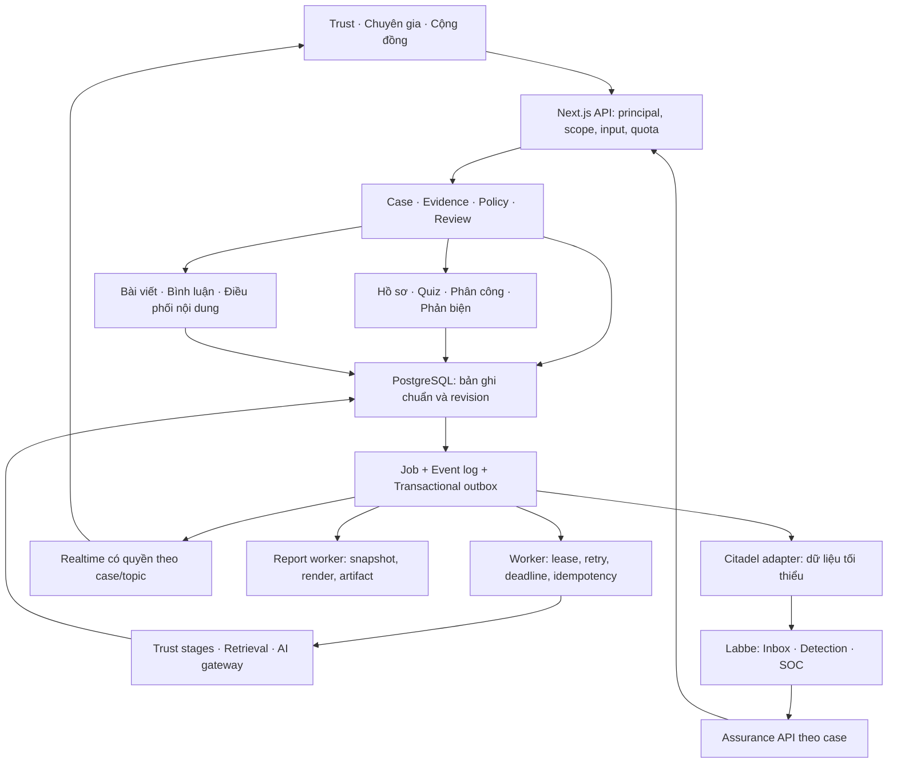

# Kiến trúc lõi StudentHub AI × Labbe

**Trạng thái: ARCHITECTURE TARGET — các phần đã triển khai được đối chiếu tại [báo cáo triển khai](C:/Users/Duy/Projects/MyProj/StudentHub-AI/docs/reports/CORE-SYSTEM-IMPLEMENTATION-2026-09-06.md); các gate production còn lại chưa được tuyên bố hoàn tất.** Ngày 06/09/2026. Cơ sở: [báo cáo kiểm tra source và runtime](C:/Users/Duy/Projects/MyProj/StudentHub-AI/docs/reports/CORE-SYSTEM-AUDIT-2026-09-06.md).

Ba trục sản phẩm là **Trust**, **chuyên gia**, **cộng đồng/diễn đàn**. Hồ sơ case, bằng chứng, định danh, sự kiện và báo cáo là nền dùng chung. Labbe/GOVSEC Citadel phụ trách quan sát an ninh và hỗ trợ vận hành. Học tập/học vụ cung cấp ngữ cảnh cho ba trục; không cần mở thêm một sản phẩm riêng để sửa lõi.

“Nâng cấp tối đa” được chuyển thành yêu cầu đo được: đúng quyền, truy vết nguồn, giữ được dữ liệu, giải thích đúng giới hạn, xử lý đồng thời có ngân sách, phục hồi lỗi, AI có đánh giá độc lập, và giao diện một trọng tâm tại một thời điểm. Không có thiết kế hữu hạn nào bao phủ tuyệt đối mọi tình huống; phải khai báo phạm vi, ngưỡng quá tải và hành vi khi thiếu bằng chứng.

## 1. Kiến trúc mục tiêu và quyền sở hữu dữ liệu

Giữ **modular monolith** cho nghiệp vụ trong StudentHub để tái sử dụng code hiện có, cùng worker riêng cho tác vụ lâu. Next.js xử lý giao diện/API, PostgreSQL lưu trạng thái chuẩn, Supabase cung cấp auth/storage/realtime theo capability được bật. Labbe vẫn là dịch vụ Python độc lập với DB và workload identity riêng.

| Thành phần | Sở hữu và quyết định | Không được tự coi là nguồn thẩm quyền |
|---|---|---|
| Trust core | Phiên kiểm tra, bằng chứng, phiên bản policy, kết luận rủi ro/sự thật/hành động | Output AI, số lượt thích hoặc trạng thái đồ họa |
| Expert service | Hồ sơ đã xét duyệt, phạm vi hành nghề trong sản phẩm, attempt, review assignment, assessment revision | Điểm quiz tự khai, danh hiệu tự điền, AI tự cấp quyền |
| Community service | Nội dung, tác giả, consent, moderation, correction, reaction | Đồng thuận cộng đồng không tự trở thành quy định chính thức |
| PostgreSQL | State chuẩn, uniqueness, transaction, quyền truy cập và lịch sử | Cache trình duyệt hoặc file JSON trong web process |
| AI/retrieval | Đề xuất claim, tìm nguồn, phân loại, giải thích có citation | AI không thay policy engine hoặc cấp quyền chuyên gia |
| Labbe | Quan sát an ninh, detection/correlation và quy trình xử lý trong Labbe | Không sửa verdict, cấp quyền hoặc khóa tài khoản StudentHub qua event quan sát |
| 3D/visualization | Chiếu read model có timestamp, freshness và scope | Không sinh số liệu, verdict, confidence hoặc tiến độ giả |

Nguồn chính thống là một loại evidence có phạm vi và thời hạn, không phải “trục sản phẩm thứ tư”. Luôn giữ riêng `security`, `truth`, `action`, `evidenceCoverage`, `decisionConfidence`; không gộp tất cả thành một phần trăm “an toàn”.

## 2. Trust workspace: chọn lớp để xem kết quả

Giữ nguyên ID kỹ thuật **L1 → L2A → L2B → L2C → L3 → L4 → L5** để bảo toàn contract và test. Giao diện có một thanh chọn stage gọn, một vùng kết quả đang xem và nút Trước/Tiếp. Tóm tắt case đặt ở phía trên. Bằng chứng mở theo lựa chọn; báo cáo đầy đủ, đồ thị và Passport chuyển thành các view riêng cùng case.

Luồng điển hình: người dùng gửi ảnh → xác nhận OCR → L1 mở khi chạy → L2A mở khi bắt đầu → tiếp tục tới L5. Nếu người dùng chọn quay lại L1, phần đang đọc giữ nguyên; thanh stage báo tiến độ mới và có nút **Theo dõi bước đang chạy**. Bấm đổi lớp chỉ thay read view, không gọi lại model, không thay verdict, không cuộn trang đến card khác.

| Vị trí | Nội dung mặc định | Mở thêm khi cần |
|---|---|---|
| Thanh case | Tên phiên, trạng thái xử lý/lưu, nguồn dữ liệu, thời điểm cập nhật | Lịch sử revision, chế độ ẩn danh/đã lưu |
| Thanh stage | Bảy nhãn, trạng thái chờ/chạy/xong/giảm chức năng/lỗi | Tooltip mục đích; không dựng nội dung stage tương lai |
| Vùng stage | Đang kiểm tra gì; kết quả 1–3 câu; bằng chứng quan trọng; điều chưa biết; bước tiếp theo | Nguồn, raw technical fields, audit, provider detail |
| Thanh cuối | Trước, Tiếp, Theo dõi đang chạy; yêu cầu chuyên gia nếu phù hợp | Retry được policy cho phép |
| View tổng kết | Rủi ro, căn cứ và hành động của case | Evidence, chuyên gia, cộng đồng, Passport, báo cáo |

**Một panel nội dung stage được hiển thị tại một thời điểm.** Stage chưa bắt đầu chỉ có nhãn trạng thái. Stage bị skip/block mở lý do thật. Nội dung dài có thể cần cuộn trong view đang đọc; không yêu cầu người dùng cuộn qua sáu lớp khác để tới lớp cần xem. Trên mobile dùng nhãn stage đang chọn và Trước/Tiếp cùng menu chọn các stage đã mở; không để trang tràn ngang.

Keyboard dùng `tablist`, `tab`, `tabpanel`, `aria-selected`, liên kết `aria-controls`, roving focus; mũi tên/Home/End điều hướng, Enter/Space kích hoạt nếu panel còn phải tải. Mở panel có dữ liệu sẵn có thể tự kích hoạt; không chuyển DOM focus khi backend phát tiến độ. Cách tổ chức này tham chiếu [WAI-ARIA Tabs Pattern](https://www.w3.org/WAI/ARIA/apg/patterns/tabs/).

| State | Trigger | Xử lý và UI | Boundary/error |
|---|---|---|---|
| IDLE | Vào workspace | Hiện input, mục đích bảy stage gọn | Không hiện kết quả hay số đo khi chưa chạy |
| VALIDATING | Gửi input | Kiểm tra loại, kích thước, consent; xác nhận OCR | Sai input trả lỗi gần trường; không tạo job |
| QUEUED | DB commit job thành công | Hiện đã nhận và định danh run | DB lỗi không báo đã nhận bền vững |
| FOLLOWING | Stage bắt đầu | Chọn panel stage đang chạy, cập nhật từ event có sequence | Không dùng timer để đoán stage |
| INSPECTING | Người dùng chọn stage đã mở | Khóa lựa chọn đọc; tiến độ cập nhật ở thanh stage | Event mới không giành focus hoặc đổi panel |
| DEGRADED | Provider timeout/quota/nguồn thiếu | Giữ finding đã có; hiển thị thiếu phần nào | Không biến provider fail thành “sạch” |
| RECONNECTING | Mất kết nối stream | Giữ snapshot và nhãn mất kết nối; đọc lại sau cursor | Không chạy phân tích lại chỉ vì mất mạng |
| COMPLETED | Worker đã commit terminal revision | Mở tổng kết nếu còn follow, hiển thị đã lưu | Completion tham chiếu revision/id đã commit |
| CANCEL_REQUESTED | Người dùng hủy | Server ghi yêu cầu; worker dừng tại boundary | Chưa được báo cancelled khi worker chưa xác nhận |
| CANCELLED / FAILED | Terminal event | Đọc lại lịch sử; retry theo rule | Late response không ghi đè run mới |

**Nghiệm thu UI:** chỉ một panel stage hiện, quay lại đọc không rerun, refresh khôi phục đúng run/revision, hỗ trợ keyboard/mobile/reduced motion; không tự scroll hoặc nhảy focus khi event tới; không hiện `12ms`, người dùng online hoặc provider active nếu chưa đo.

## 3. Nâng cấp từng lớp AI Trust

| Stage | Nhiệm vụ cụ thể | Backend/data cần bổ sung | Cách đánh giá |
|---|---|---|---|
| L1 — Sàng lọc cục bộ | Chuẩn hóa, detector URL/text/QR, input boundary, dấu hiệu nguy hiểm rõ | Parser có version; OCR quality, ảnh private và hash artifact; giới hạn xử lý trước provider | Unicode/URL ambiguity, file lỗi/quá lớn, OCR sai, nhầm cảnh báo thành lừa đảo |
| L2A — Threat intelligence | Tra reputation đúng URL được phép chia sẻ | Adapter cấu hình thật, freshness/cache TTL, SSRF/egress, quota chung, timeout | Match/no-match/unavailable tách biệt; secret/private URL không bị gửi ra ngoài |
| L2B — Ngữ nghĩa | Claim/entity/intent, giục chuyển tiền, yêu cầu bí mật, mạo danh | Provider chọn từ config server, JSON schema, prompt version, token budget | Extraction precision/recall, tiếng Việt không dấu/slang, injection, mâu thuẫn nội dung |
| L2C — Rủi ro sinh viên | Taxonomy học bổng, học phí, thực tập, nhà trọ, tài khoản | Baseline hiện tại cùng challenger model có artifact; không hard-code calibrated probability | Per-class PR/F1, false positive trên thông báo hợp lệ, campaign holdout, abstention |
| L3 — Bằng chứng | Retrieval → nguồn → claim alignment → freshness/independence/conflict | Source registry có chủ quản, snapshot bất biến, quyền thu thập, hybrid retrieval, reranker, citation spans; crawl/retrieve chạy worker giới hạn | Citation precision, evidence coverage, nguồn trùng/giả/cũ, đúng phạm vi trường/kỳ học |
| L4 — Policy | Kết hợp tín hiệu và evidence thành kết luận đa chiều | Rule/policy version pin theo run; review packet khi thiếu/mâu thuẫn | Deterministic replay, không mất hard negative, không cho AI đổi thẩm quyền |
| L5 — Kiểm tra lại | Audit kết luận, nguồn, confidence, bước bị thiếu | Rule audit + reviewer advisory có giới hạn; phân tích conflict; đường chuyển chuyên gia | Phát hiện overclaim, false-safe, model/provider disagreement; không tự nâng safety |

Các stage phụ thuộc dữ liệu vẫn theo DAG đã khai báo. Chỉ song song hóa retrieval/provider độc lập *bên trong* một stage với semaphore/budget; không dùng `Promise.all` cho cả bảy lớp đang phụ thuộc nhau. Agent giải thích đọc bằng chứng đã phân quyền, không thực thi instruction nằm trong bài đăng, URL hoặc tài liệu thu thập.

## 4. Hồ sơ, quiz và hệ chuyên gia

Một hồ sơ chuyên gia gắn với identity chuẩn và có: lĩnh vực, trường/tổ chức, bằng chứng xác minh, thời hạn xác minh, kinh nghiệm, ngôn ngữ, năng lực xử lý case, lịch sử correction và xung đột lợi ích. Hồ sơ công khai chỉ chứa trường được phép. Chứng chỉ/bằng cấp và kết quả quiz là hai nguồn đánh giá riêng.

**Quiz xác định năng lực trong phạm vi của sản phẩm.** Qua quiz không tự tạo bằng cấp, quyền xác nhận quy định của nhà trường hoặc quyền hành nghề. Quyền nhận/duyệt case cần cả xác minh phù hợp, kết quả đánh giá và phê duyệt domain theo policy.

| Giai đoạn | Cách vận hành | Dữ liệu/điều kiện |
|---|---|---|
| Hồ sơ ứng viên | Người dùng khai và gửi evidence; server đặt trạng thái PENDING | Không cho client tự ghi `VERIFIED`, domain grant hay level |
| Xác minh | Reviewer kiểm tra bằng chứng, lĩnh vực và COI | Người duyệt không tự duyệt mình; lưu thời điểm, phạm vi, expiry |
| Thi đầu vào | Chọn đề theo blueprint domain, ngân hàng có version; lưu attempt trên server | Câu hỏi/đáp án chuẩn và lời giải đã được chuyên gia duyệt; đáp án không gửi xuống trước khi nộp |
| Chấm | MCQ chấm tất định; tình huống tự luận theo rubric và người duyệt | AI gợi ý chấm kèm evidence; điểm cuối có reviewer/version; nộp trùng không tăng điểm |
| Cấp phạm vi | Policy đánh giá hồ sơ, rubric, số lượng câu đạt chất lượng và review thực hành | Ngưỡng phải được hiệu chuẩn trên pilot; chưa đóng đinh “80 điểm = chuyên gia” |
| Nhận case | Hàng đợi phân công theo scope, load, ngôn ngữ, SLA, COI | Claim/assignment có lease và version; truy cập theo case được giao |
| Phản hồi nhiều vòng | Nhận định → bổ sung bằng chứng → phản biện → kết luận/correction | Có due date và thông báo thay đổi quan trọng; lưu tất cả revision |
| Nâng cấp/duy trì | Reassessment, quiz mới khi policy đổi, audit sample, phản hồi có căn cứ | Level tách theo domain; dùng chất lượng outcome và độ bất định, không dùng số bài thuần túy |
| Khiếu nại/thu hồi | Reviewer độc lập xét lại; thu hồi domain hoặc hạn chế tạm thời | Có lý do, lịch sử, đường kháng nghị; thu hồi quyền có hiệu lực trên assignment đang mở |

Các trạng thái đề xuất: `DRAFT → SUBMITTED → IDENTITY_REVIEW → QUIZ_ELIGIBLE → DOMAIN_REVIEW → ACTIVE`; nhánh `NEEDS_EVIDENCE`, `REJECTED`, `SUSPENDED`, `REVOKED`, `EXPIRED`. Attempt riêng: `ISSUED → IN_PROGRESS → SUBMITTED → GRADING → FINALIZED`, có nhánh `EXPIRED`, `INVALIDATED`, `APPEALED`.

Quiz cần randomized order có seed server, thời hạn do server quyết định, attempt limit/cooldown, resume đúng attempt, chống nộp lặp, bảo vệ answer key. Không tự sửa điểm lịch sử khi đổi câu hỏi; tạo revision và quy trình regrade. Đánh giá người dùng tập trung vào đóng góp cụ thể: bằng chứng, đúng phạm vi, độ chính xác, hỗ trợ cộng đồng; không suy diễn phẩm chất cá nhân thành một điểm “đáng tin” toàn diện.

AI hỗ trợ soạn nháp câu hỏi, truy tìm nguồn, gợi ý reviewer, lập disagreement map và viết giải thích. Phản hồi người dùng đi vào hàng đợi gán nhãn sau consent/redaction/review; không lập tức thành training label. Case khó dùng hai đánh giá độc lập và reviewer phân xử khi bất đồng; số reviewer được điều chỉnh theo rủi ro và năng lực thực tế.

## 5. Cộng đồng và realtime nghiệp vụ

Hoàn thiện trước các luồng đăng bài, bình luận, phản hồi, sửa/xóa, report, moderation, follow case và nhận cập nhật. Tách bài viết gốc, trích xuất claim, nhận định AI, review chuyên gia và kết luận chính thức bằng provenance. Nội dung không có evidence vẫn có thể là trải nghiệm cá nhân; không gắn verified chỉ vì nhiều like.

| Sự kiện | Transaction phía server | Hành vi client |
|---|---|---|
| Post/comment tạo hoặc sửa | Kiểm tra principal/quyền/validation; ghi revision + event/outbox | Optimistic item có clientMutationId; đổi sang confirmed khi nhận bản ghi chuẩn |
| Vote | Unique user/post; update có idempotency và version | Retry không nhân số vote; realtime nhận aggregate/revision |
| Bài bị ẩn | Ghi moderation state, audit, cập nhật ACL | Ngừng phát nội dung tới subscriber không còn quyền; cập nhật tombstone |
| Evidence/đánh giá mới | Ghi revision, đánh dấu kết luận cũ cần tái xét | Thông báo thay đổi quan trọng; không đánh cắp focus hoặc đẩy người dùng khỏi đoạn đang đọc |
| Mất mạng | Event log vẫn giữ state; reconnect fetch snapshot + replay | Giữ draft, báo pending/offline rõ; không tự nhân bản nội dung |
| Nhiều người phản biện | Append revisions, concurrency control; conflict yêu cầu reconcile | Hiện ai/nguồn nào bất đồng và lý do; không last-write-wins cho kết luận |

Realtime đề xuất dùng **Supabase Broadcast với private channels và RLS theo membership** cho việc phát cập nhật. Supabase mô tả Broadcast là lựa chọn phù hợp hơn cho fan-out lớn; Postgres Changes xác thực từng thay đổi cho từng subscriber nên phải benchmark kỹ. Đây là lựa chọn kiến trúc cần đo trên workload của dự án, không phải cam kết về số người dùng. [Database changes](https://supabase.com/docs/guides/realtime/subscribing-to-database-changes), [scaling](https://supabase.com/docs/guides/realtime/postgres-changes).

Kênh dự kiến: `case:{id}`, `forum:{topicId}`, `user:{id}`, `expert-assignment:{id}`. Tên kênh không phải quyền truy cập. Server kiểm tra membership và classification; client chỉ được gửi presence/typing theo scope được cấp, không được giả stage-completed, verdict hay expert-verified.

Broadcast dùng làm thông báo; **PostgreSQL event log + snapshot là nguồn phục hồi**. Event có `eventId`, `aggregateId`, `aggregateVersion`, `sequence`, `occurredAt`, `recordedAt`, `type`, `schemaVersion`, `payload` đã tối thiểu hóa. Không hứa exactly-once transport: chấp nhận ít nhất một lần giao, consumer deduplicate để hiệu ứng nghiệp vụ chỉ ghi một lần.

ACL của Supabase Realtime được cache theo connection và cập nhật khi join hoặc nhận JWT mới. Vì vậy thu hồi quyền cần token ngắn hạn, tái xác thực/đóng kết nối hoặc đổi membership epoch/topic, không chờ dữ liệu nhạy cảm tự biến mất. [Realtime Authorization](https://supabase.com/docs/guides/realtime/authorization).

## 6. Database và consistency

Tái sử dụng bảng hiện có sau khi audit migration/role. Các bảng Trust run/revision, expert qualification và Labbe outbox đã có migration trong `database/migrations/202609060001–202609060003`; các nhóm còn lại dưới đây là mô hình đích và cần migration/gate riêng.

| Nhóm | Bảng hiện có có thể tái sử dụng | Bổ sung cần thiết |
|---|---|---|
| Identity/access | profiles, server_sessions, user_roles | domain grant revision, role expiry, case_memberships, scope revocation |
| Trust | trust_cases, case_inputs, evidence, claims, claim_sources | trust_runs, trust_stage_runs, case_revisions, immutable source_snapshots, model_invocations |
| Expert | expert_profiles, expert_verifications, expert_domains, expert_assessments | question_banks, question_versions, quiz_blueprints, quiz_attempts, quiz_answers, grading_revisions, review_assignments, assessment_revisions, appeals |
| Community | posts, comments, votes | post/comment revisions, moderation_cases, case_links, material notifications |
| Reliability | audit_events | jobs, job_attempts, domain_events, event_outbox, consumer_inbox, idempotency_records |
| AI data | model artifacts hiện tại | datasets, dataset_versions, label_tasks, annotation_revisions, training_runs, evaluation_runs, model_releases |
| Report | Passport/revisions; Trust report slice trong migration `202609060004_reports.sql` | report_requests, report_runs, report_snapshots, report_access_audit, Expert/Community/AI/Ops report projections |
| Labbe bridge | Chưa thấy caller StudentHub | integration_deliveries, assurance_snapshots, schema compatibility registry |

Các invariant cần khóa bằng schema và transaction:

1. Một lệnh nghiệp vụ có uniqueness `(actor, operation, idempotencyKey)`. Cùng key + cùng digest trả cùng kết quả; cùng key + payload khác trả 409. Hash phải tôn trọng case-sensitive path/query và metadata; không lower-case toàn URL.
2. Bản ghi nghiệp vụ, audit thiết yếu và outbox commit cùng transaction. Không phát completion trước commit. Passport/reports có thể cập nhật bất đồng bộ nhưng phải có job và state riêng.
3. Run lưu input digest, schema/policy/model/source snapshot version và immutable revision. Người dùng sửa input tạo run mới; event từ run cũ không cập nhật run mới.
4. Unique `(runId, stageId, attempt)` và `(aggregateId, sequence)`; worker dùng fencing token/version. Worker cũ mất lease không được ghi kết quả mới.
5. Assessment, grade và reputation event ghi nguyên tử. Reputation có khóa causation duy nhất; sửa assessment không được tự cộng điểm nữa. Không cho chuyên gia tự đánh giá mình hoặc nhận case ngoài scope.
6. Runtime role web, worker, migration và bridge tách quyền; web không mặc nhiên có BYPASSRLS. Context identity phải set trong transaction từ principal đã xác thực và được reset khi trả connection.
7. Query đọc case luôn có scope/owner/membership; hạn chế dữ liệu trước khi join/cache/report. Object storage dùng private object và link có TTL, không nhúng secret vào event.
8. Pagination dùng cursor `(createdAt,id)` hoặc projection rank ổn định. Index theo owner/time, case/sequence, job state/availableAt, assignment/domain/status và outbox pending; đo query plan trước khi thêm index rộng.

Quy trình migration: additive schema → backfill có cursor → kiểm tra count/checksum và quyền → bật read path mới theo cohort → bật write path mới → quan sát → bỏ path cũ sau gate. Tránh dual-write tự do; nếu cần giai đoạn chuyển tiếp, một writer chuẩn và outbox chiếu sang read model còn lại. Backup/restore và rollback migration phải có bằng chứng riêng.

## 7. Job, tải đồng thời và bottleneck

`POST /api/v2/trust/runs` đề xuất trả **202 sau khi job được lưu**, gồm runId, caseId, acceptedAt và URL đọc. Worker chạy phân tích; UI đọc tiến độ bằng stream/projection. Client ngắt kết nối không mặc nhiên hủy job đã nhận; hủy là lệnh có xác nhận. V1 tiếp tục facade tương thích cho tới khi client chuyển xong và test contract pass.

Worker claim một batch nhỏ bằng row locking/lease trong transaction ngắn, chạy provider ngoài transaction, rồi commit output bằng compare-and-set. PostgreSQL nêu `SKIP LOCKED` phù hợp cho nhiều consumer đọc queue, nhưng không dành cho một truy vấn nghiệp vụ cần snapshot đầy đủ. [PostgreSQL 17 SELECT](https://www.postgresql.org/docs/17/sql-select.html).

Các giới hạn phải cấu hình và đo: số job/tenant, backlog tối đa, runtime/stage deadline, provider concurrency, tokens/cost, response bytes, stream connections, subscriber fan-out, queue wait và tuổi event. Admission control trả 429/503 có Retry-After khi hết ngân sách; không nhận vô hạn rồi treo.

| Bottleneck | Dấu hiệu cần đo | Thiết kế giảm tải |
|---|---|---|
| AI/provider | In-flight cao, 429, timeout, token/cost vượt | Quota toàn hệ thống, cache có scope, circuit breaker, deadline, weighted queue theo loại job |
| CPU OCR/model | Event-loop lag hoặc worker CPU tăng | OCR/embedding/inference vào worker pool; giới hạn kích thước; giữ web request nhẹ |
| DB pool | pool wait, active/idle/waiting, lock wait | Pool bounded, transaction ngắn, cấp ngân sách connection giữa replicas/worker/realtime |
| Retrieval | Nguồn chậm, nhiều bản sao, cache miss | Snapshot/cache theo freshness, giới hạn fan-out, dedup nguồn, concurrency có kiểm soát |
| Realtime fan-out | event lag, bytes/s, memory theo connection | Broadcast payload nhỏ, coalescing tiến độ, cursor replay, ngắt slow consumer, ưu tiên event thiết yếu |
| Forum ranking | Scan/aggregate lớn, query chậm | Index, projection ranking theo event, keyset pagination; sửa lỗi query hiện tại trước |
| Expert queue | Case quá hạn, thiếu reviewer đúng scope | Capacity theo domain, giới hạn workload, escalation, minh bạch thời gian chờ |
| Báo cáo/3D | Tác vụ export nặng, bundle/CPU/GPU cao | Report worker riêng; 3D lazy, pause khi ẩn, graph aggregation và view 2D |

**Ví dụ tính công suất, hoàn toàn là giả định để lập kế hoạch:** 1.000 người cùng online, mỗi người tạo một scan mỗi 5 phút → khoảng 3,33 scan/s. Nếu một scan chiếm worker/provider trong 12 s thì theo cân bằng tải cần khoảng 40 run đang xử lý. Tại mục tiêu sử dụng 70%, cần khoảng 58 slot tương đương. Slot chưa phải số máy; số worker còn tùy CPU, RAM, I/O và quota của mỗi provider.

Burst 100 scan/s kéo dài 30 s, năng lực thực tế giả định 5 scan/s → backlog tăng khoảng 2.850 job. Nếu về 3,33 scan/s sau burst thì thời gian xả backlog xấp xỉ 2.850/(5−3,33) ≈ 28,4 phút. Muốn thời gian chờ thấp hơn phải tăng năng lực, giảm yêu cầu mỗi job hoặc chặn/đặt lịch có kiểm soát; UI đẹp không giải quyết được chênh lệch này.

Tổng DB connection phải thỏa `webReplicas × webPool + workerReplicas × workerPool + realtime/admin/maintenance reserve ≤ DB connection budget`. Bulkhead 10 trong từng process không phải quota toàn cluster. Cache/limiter dùng Redis hoặc dịch vụ tương đương khi cần ngân sách dùng chung; state chuẩn và delivery vẫn phải bền vững.

**Mục tiêu pilot đề xuất, chưa phải kết quả đã đạt:** 1.000 kết nối đồng thời; 200 API read/s; 5 Trust run/s bền vững; submit-to-accepted p95 ≤500 ms; DB-commit-to-visible p95 ≤1 s, p99 ≤3 s; first stage p95 ≤1,5 s; full analysis p95 ≤20 s trong profile nguồn được định nghĩa. Báo cáo riêng queue wait, execution time, completion, degraded và rejected; không loại failure khỏi mẫu để làm đẹp percentile. AI/provider timeout và quota có thể buộc điều chỉnh target trước pilot.

| Kịch bản phải thử | Bất biến mong đợi | Bằng chứng |
|---|---|---|
| Cùng idempotency key gửi đồng thời | Một job/kết quả nghiệp vụ; payload khác trả conflict | Test nhiều client + truy vấn unique/event |
| 1k rồi 5k kết nối, cùng topic nóng | Dữ liệu đúng scope; áp dụng admission khi vượt budget | p95/p99, memory, CPU, event lag, rejected; 5k là mức khám phá, không cam kết |
| 20% client rớt mạng rồi kết nối lại | Replay không trùng hiệu ứng, không mất terminal revision | Cursor/sequence đối chiếu DB |
| Worker chết trước/sau commit/ack | Lease phục hồi; duplicate không double-write | Kill/restart drill trên DB staging |
| DB/provider/Labbe không khả dụng | Không fake complete; trạng thái degraded/retry rõ | Failure injection, restore/catch-up time |
| Hai chuyên gia nộp và người thứ ba revoke scope | Không ghi assessment trái scope; conflict có revision | Race test với transaction thực |
| Source bị sửa/rút lại | Kết luận cũ giữ lịch sử; case phụ thuộc được yêu cầu recheck | Source revision và downstream event |
| Slow consumer hoặc payload lớn | Stream bounded, ngắt đúng client chậm; server tiếp tục phục vụ | Memory plateau và counter disconnect |
| Traffic kéo dài 2 giờ | Không tăng memory/connection/backlog vô hạn | Soak traces, pool/queue curve và error budget |

Chạy load trên staging có dữ liệu giả và quota đã định, không bắn burst vào provider/DB người dùng đang sử dụng. Đây là kế hoạch nghiệm thu, chưa chạy trong lượt báo cáo.

## 8. Kế hoạch train và đánh giá AI

Ưu tiên dữ liệu và đánh giá trước GPU/epochs. Phân biệt bốn loại nâng cấp: rules, retrieval, prompt/provider và model được huấn luyện. Mỗi loại có version, test và release gate riêng.

1. **Kiểm kê corpus:** provenance, quyền sử dụng, ngôn ngữ, thời gian, trường/domain, campaign/source lineage, loại PII, synthetic flag. Mẫu thiếu nguồn/nhãn vào quarantine.
2. **Khử trùng và phân tích nhãn:** exact/near-duplicate, cùng template/campaign, label conflict; không cho paraphrase cùng chiến dịch rơi vào cả train và test. Các tỷ lệ trùng ở audit chỉ là bước mở đầu.
3. **Gán nhãn:** rubric theo claim/intent/risk/citation; ít nhất hai reviewer cho tập khó/high-risk, có adjudication. Outcome chuyên gia được kiểm tra rồi mới vào training set.
4. **Khóa split:** train/validation/test theo nhóm campaign/source; thêm temporal holdout và unseen campaign; lưu ID/hash/seed. Tập benchmark không được dùng để sửa prompt/model rồi báo lại là test độc lập.
5. **Baseline tái lập:** đo rule L2C hiện tại, TF-IDF/MLP hiện có và retrieval riêng. Lưu predictions/confusion matrix và khả năng abstain, không hard-code metric.
6. **Challenger:** thử embedding/reranker hoặc model tiếng Việt phù hợp, sau đó mới fine-tune nếu dữ liệu cho thấy lợi ích. Chọn family/version và phần cứng sau benchmark chi phí, độ trễ và tài nguyên; không mặc định train mọi lớp bằng LLM.
7. **Hiệu chuẩn:** probability chỉ công bố sau calibration trên validation và kiểm tra test; báo ECE/Brier khi output thực sự là xác suất. Với model score chưa calibrated, hiển thị score đúng tên.
8. **Shadow và canary:** chạy cạnh baseline, đo disagreement/false-safe/cost/latency theo cohort; promote khi gate đạt và không phá policy invariant. Có rollback tới artifact/version trước.
9. **Vận hành:** theo dõi chất lượng theo domain/thời gian/OCR/ngôn ngữ; drift dẫn tới review/relabel/evaluate, không tự train và promote từ toàn bộ bài đăng mới.

| Task | Chỉ số chất lượng | Bộ kiểm tra cần có |
|---|---|---|
| Risk multi-label | Macro/micro F1, PR-AUC theo lớp, false negative/false positive, abstention | Benign thông báo học vụ, cảnh báo có chứa từ lừa đảo, slang, campaign mới |
| Claim/entity extraction | Precision/recall theo loại span và quan hệ | Tên trường giả, ngày/tiền/đơn vị, dấu/không dấu, OCR noise |
| Retrieval/citation | Recall@k, relevance, citation entailment, freshness và independence | Nguồn giống tên, nguồn hết hạn, nhiều site sao chép, link hỏng |
| AI narrative | Faithfulness, unsupported claims, actionable explanation, scope compliance | Model tự tin sai, injection từ nguồn, dữ liệu bị thiếu |
| Quiz/grading | Agreement với rubric/human adjudication, bias theo domain/ngôn ngữ, appeals | Câu hỏi mơ hồ, nhiều đáp án hợp lý, version thay đổi |

Artifact release gồm model hash, tokenizer/vectorizer, label taxonomy, preprocessing, dataset/split hash, seed/config/code commit, dependency/runtime, eval predictions, metric kèm khoảng bất định và approval record. Không công bố “đã train tối đa” khi chỉ có file weights hoặc một bảng metric.

## 9. Tích hợp Labbe theo contract sẵn có

Tái sử dụng `POST /api/v1/integrations/studenthub/events` và `GET /api/v1/integrations/studenthub/assurance/{case_id}` của Labbe. Tạo adapter phía StudentHub server cùng outbox relay; browser không giữ credential Labbe. Không chia sẻ trực tiếp DB user/session giữa hai dự án.

Envelope phải khớp DTO hiện có: event_id/type/schema_version, occurred_at/produced_at, producer/environment, correlation_id/causation_id, subject/classification, payload/payload_hash. CaseId phải qua rule binding của receiver. Không giả định một type mới tự được chấp nhận; thêm forum/expert/report event phải cập nhật catalog và contract test ở cả hai bên.

| Tình huống | Hành vi bắt buộc |
|---|---|
| Event Trust bình thường hoặc URL nguy hiểm | Gửi quan sát tối thiểu; không tạo sự cố hạ tầng chỉ vì verdict nghiệp vụ |
| Duplicate cùng eventId/hash | Receiver dedup; sender ghi ack một lần |
| Cùng eventId nhưng hash khác | Conflict/tamper; không ghi đè event cũ |
| Payload tiếng Việt/Unicode | Canonicalization hai ngôn ngữ cho đúng cùng byte sequence; golden vectors kiểm tra null, number, nested fields; hash không thay authentication |
| Token sai scope/classification | Deny; audit không chứa secret/payload riêng tư |
| Labbe down | Trust vẫn hoàn tất theo policy; outbox retry có deadline; assurance ghi unavailable/stale |
| Assurance được trả | Lưu snapshot với time/version; phân quyền trước khi chiếu lên case |
| Hành động response | Chỉ thực hiện theo workflow/phê duyệt riêng của Labbe; observer adapter không tự write-back vào StudentHub |

Trình tự bật: `DISABLED` để contract test → `SHADOW` với synthetic event qua transport thật → thử duplicate/replay/outage/scope → `STAGING_I5` trong môi trường đã cấu hình → đánh giá vận hành riêng trước môi trường người dùng. 28 test local hiện tại là đầu vào cho gate này, chưa thay thế network/OIDC/PostgreSQL integration test.

## 10. Hệ thống báo cáo cần tự xây

Mục tiêu là mỗi kết luận có thể mở lại từ snapshot, chỉ rõ **đã làm, chưa làm, thất bại, không áp dụng và chưa đủ bằng chứng**. Không tự gắn nhãn “100%” từ số test pass. Báo cáo phần mềm, chất lượng model và năng lực production là ba loại bằng chứng khác nhau.

| Báo cáo | Người xem | Nội dung phải có |
|---|---|---|
| Case Trust | Chủ case và reviewer được cấp quyền | Input đã che thông tin, stage findings, nguồn/time/limitations, policy/model version, kết luận đa chiều, lịch sử thay đổi và hành động |
| Chuyên gia | Chủ hồ sơ, reviewer/admin theo scope | Hồ sơ/xác minh, quiz blueprint/attempt, rubric/grade revision, chất lượng review, COI, appeals, lý do nâng/hạ phạm vi |
| Cộng đồng | Moderator; bản công khai đã lọc | Claims, evidence, correction, moderation reason, signal chất lượng; không lộ tác giả ẩn danh |
| AI evaluation | ML owner/reviewer | Corpus/split/model hash, predictions, per-class metrics, false-safe/hard-negative, cost/latency, champion/challenger decision |
| Vận hành và Labbe | Operator/security đúng quyền | Queue/DB/provider/realtime lag, workload profile, SLO/error budget, incidents/assurance và drill results |
| Tiến độ dự án | Nhóm dự án | Requirement ID → code path → test/evidence → trạng thái → dependency/blocker, không dùng checklist cũ như dữ liệu runtime |

Schema logic của một report: `reportId`, `type`, `scope`, `snapshotRevision`, `inputHashes`, `generatedAt`, `templateVersion`, `policyVersion`, `evidenceRefs`, `findings[{id,severity,status,claim,evidence,limitations}]`, `checks[{id,result,environment,observedAt,artifactHash}]`, `unknowns`, `nextActions`, `supersedes`, `artifactHash`, `accessPolicy`.

Report worker chụp một revision nhất quán → kiểm tra quyền → render HTML/JSON và PDF khi cần → lưu artifact private có hash → công bố link có TTL. Nếu DB/provider/report generator lỗi, báo `FAILED` hoặc `PARTIAL`, không phát tài liệu “hoàn thành” rỗng. AI chỉ viết diễn giải từ facts đã chốt; giữ dữ liệu structured làm nguồn chuẩn.

Trạng thái report: `REQUESTED → SNAPSHOTTING → GENERATING → VALIDATING → READY`, nhánh `PARTIAL`, `FAILED`, `SUPERSEDED`, `REVOKED`. Khi evidence/case đổi revision, báo cáo cũ giữ timestamp và liên kết báo cáo mới; không âm thầm thay PDF đã phát. Retention/redaction có chủ quản, và thu hồi quyền kiểm tra lại ở lượt tải artifact.

## 11. API và kế hoạch chuyển đổi

Các endpoint mục tiêu:

| API | Tác dụng | Điều kiện |
|---|---|---|
| `POST /api/v2/trust/runs` | Nhận job bền vững | Auth/anonymous mode tách rõ, idempotency, validation, quota |
| `GET /api/v2/trust/runs/{id}` | Snapshot run và revision | Owner hoặc membership |
| `GET /api/v2/trust/runs/{id}/events?after=...` | Replay/stream | Scope + bounded cursor/page; không replay dữ liệu đã bị thu hồi quyền |
| `POST /api/v2/trust/runs/{id}/cancel` | Hủy có xác nhận | Chủ run, CAS, trạng thái cho phép |
| `POST /api/v2/experts/applications` | Nộp hồ sơ | Principal server; evidence private |
| `POST /api/v2/experts/quiz-attempts` | Cấp attempt | Domain eligibility, hạn mức/thời gian |
| `PUT /api/v2/experts/quiz-attempts/{id}/answers` | Lưu/nộp bài | Owner, version, deadline server; key idempotency |
| `POST /api/v2/cases/{id}/review-requests` | Yêu cầu chuyên gia | Case access, phân công qua service |
| `POST /api/v2/review-assignments/{id}/assessments` | Nộp assessment revision | Assignment + domain + COI + quyền hiện tại |
| `POST /api/v2/forum/posts/{id}/comments` | Bình luận bền vững | Quyền xem/tham gia topic và moderation |
| `PUT /api/v2/forum/posts/{id}/vote` | Vote idempotent | Một principal/post; có cách bỏ vote |
| `POST /api/v2/reports` | Tạo report job | Quyền theo report scope, snapshot revision |
| `GET /api/v2/reports/{id}` | Trạng thái/artifact | Access policy khi đọc, không chỉ lúc tạo |

Trust report hiện có facade tương thích ở `POST/GET /api/v1/reports` và `GET /api/v1/reports/{reportId}`. Facade này tạo JSON snapshot đồng bộ từ revision đã commit; worker/PDF, TTL link, access audit và các loại report còn lại vẫn là phạm vi M7.

Response chuẩn gồm data hoặc typed error, requestId, contractVersion, observedAt, provenance, persistence state và retry policy. Hỗ trợ 400/401/403/404/409/413/422/429/503 rõ nghĩa; dùng 404 cho tài nguyên không nên tiết lộ sự tồn tại. Tài liệu API cũ được giữ tới khi client chuyển xong; không đổi ý nghĩa âm thầm dưới cùng version.

## 12. Thứ tự triển khai và gate

Không gán phần trăm hoàn thành cho công việc chưa chạy. Quy mô nhân sự, quota AI, địa điểm deployment và traffic thật chưa được chốt nên dùng milestone có phụ thuộc, chưa đưa thời hạn giả chính xác.

| Milestone | Công việc cụ thể | Gate để đi tiếp |
|---|---|---|
| M0 — Sự thật runtime | Khóa broadcast tùy ý; bỏ metric mô phỏng khỏi live; sửa query ranking; capability readiness | Anonymous không giả sự kiện; forum đọc đủ sort; metric có source/time; không còn P0 của audit |
| M1 — Trust một trọng tâm | Step navigation; một panel; follow/inspect; report view tách | Desktop/mobile/keyboard pass; click stage không rerun; event không làm mất chỗ đọc |
| M2 — Lưu và phục hồi | Job/event/outbox, atomic idempotency, case/revision, persistence ack, role/migration | DB sạch + write/read/restart + owner isolation; concurrent retry chỉ một hiệu ứng |
| M3 — Forum hoàn chỉnh | Comment/vote/edit/moderation vào PostgreSQL; realtime private/replay | Hai user/two replica thực; reconnect/cancel/revocation; không mất hoặc lộ sự kiện |
| M4 — Chuyên gia hoàn chỉnh | Application, quiz, grade, domain grants, assignment, review/appeal/reputation | End-to-end từ hồ sơ đến review; đáp án không lộ; không farm điểm; scope revoke có hiệu lực |
| M5 — AI có bằng chứng | Corpus cleanup, label/holdout, eval pipeline, provider live, challenger + canary | Metrics tái lập; no false-safe regression; cost/latency dưới budget; rollback được |
| M6 — Labbe bridge | Outbox relay, workload identity, hash contract, assurance read model | Network/DB/OIDC staging, duplicate/conflict/outage; shadow không tạo response |
| M7 — Báo cáo và vận hành | Report worker, requirement/evidence tracking, dashboards, backup/restore, load/soak | Artifact đọc lại đúng revision, scope đúng; SLO/DR test có output; kết luận release đúng profile |
| M8 — 3D của dữ liệu thật | Graph/topology từ read model, filtering, drill-down, fallback 2D | Không tăng chi phí đường submit; chức năng đầy đủ khi WebGL tắt; dữ liệu stale/unknown được hiển thị |

M1 có thể phát triển cùng sửa lỗi M0; thiết kế schema expert/AI bắt đầu sớm, nhưng mở tính năng ghi cần gate M2. Labbe contract có thể chuẩn bị song song, chỉ bật runtime bridge sau khi event/outbox và quyền đã được kiểm chứng. Báo cáo tiến độ dùng từ M0 bằng artifact có bằng chứng; subsystem báo cáo sản phẩm đầy đủ hoàn tất ở M7.

**Definition of done cho từng milestone:** yêu cầu và state matrix có ID; API/schema cụ thể; negative test đúng boundary; evidence từ môi trường đã ghi; quan sát được lỗi và phục hồi; không có fixture giả danh live; docs nêu rõ cái gì còn thiếu. Chỉ đánh dấu production-ready cho profile deployment và workload thực sự đã nghiệm thu.
