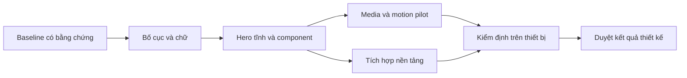

# Kế hoạch sản phẩm, frontend, backend và năng lực dự thi

Ngày: 08/09/2026 · Trạng thái: `PROPOSED_NOT_IMPLEMENTED` · Liên kết: [REPORT](REPORT.md) · [SPEC](SPEC.md) · [PROMPTS](PROMPTS.md).

## 1. Kết quả cần đạt

Người mới nhìn vào StudentHub phải hiểu được sản phẩm giúp kiểm tra thông tin trước khi quyết định; đọc dễ và tìm được hành động đầu tiên. Hero phải có chất lượng mỹ thuật khi đứng yên; chuyển động bổ sung chiều sâu. Trust, Community và Expert cùng hệ typography, cùng hồ sơ case nhưng giữ đúng authority riêng. Khóa học rời phạm vi sản phẩm đích theo [SCOPE-REDUCTION](SCOPE-REDUCTION.md).

Ba bằng chứng quan trọng nhất: một case có nguồn và giới hạn rõ; dữ liệu/quyền/commit/recovery được kiểm thử; giá trị AI được so sánh với baseline trên dữ liệu độc lập. Scope cuộc thi TP.HCM 2026 được quản lý ở [COMPETITION-FIT](COMPETITION-FIT.md).

Đề án phục vụ người dùng Việt Nam ở quy mô sử dụng rộng. Tập đối tượng đầu tiên vẫn là sinh viên và những người hỗ trợ họ. Không mở thêm nghiệp vụ cấp quốc gia, không đổi các trụ cột sản phẩm.

## 2. Phạm vi và đầu ra

| Trong đề án | Đầu ra tương lai |
| --- | --- |
| Hệ typography tiếng Việt | Bộ mẫu chữ có số đo, font map, weight/style thực, Unicode proof, fallback và font budget |
| Thứ bậc landing / shell | Wireframe desktop/mobile, copy deck, route mapping, priority CTA |
| Màu / surface / component | Semantic token specification, button/form/card/nav/source-row/state samples |
| Art direction | Một hero chủ đạo, bộ poster và ảnh theo chức năng, guideline crop/light/material |
| Motion / hero 3D / video | Storyboard, state contract, adaptive loading, pause và bản tĩnh tương đương |
| Kiểm định | Evidence theo commit, device, viewport, locale, media mode và kết quả người dùng |
| Backend / data / vận hành | Ma trận quyền, transaction/idempotency, job/realtime/outbox, retry/recovery, observability và runbook |
| AI / nghiên cứu ứng dụng | Corpus manifest, nhãn, split không rò rỉ, baseline/ablation, model card, lỗi và cost/latency |
| Hồ sơ dự thi | One-page, báo cáo kỹ thuật, demo có disclosure, phần tự xây dựng, kê khai AI/open source, rubric mapping |

Không thực hiện trong phiên lập tài liệu: code frontend, tạo hoặc mua asset, chạy dịch vụ tạo ảnh/video, đổi schema/API/auth/realtime/Trust/Labbe, tự writeback, commit/push/deploy. Các mốc duyệt dưới đây là quy trình của dự án tương lai; không phải yêu cầu xin phép cho việc viết tài liệu hiện tại.

## 3. Trình tự thực hiện

Ước lượng nội bộ: **4–6 tuần cho nhánh frontend**, **6–8 tuần cho chương trình tích hợp có pilot/AI evaluation** nếu có designer, FE, BE và người đánh giá dữ liệu làm song song. Môi trường còn thiếu có thể làm tăng lịch. Không phải cam kết. Font custom là nhánh riêng, không chặn việc cải thiện đọc hoặc chứng minh AI. Nếu deadline thực tế ngắn hơn, dùng phương án tối thiểu tại mục 11.

| Giai đoạn | Công việc / owner theo vai trò | Đầu ra review được | Phụ thuộc | Mốc hoàn tất |
| --- | --- | --- | --- | --- |
| P0 · 1–2 ngày | Designer + FE: đo hiện trạng đúng commit, computed fonts, ảnh viewport, requests/overlays | Baseline `/`, `/trust`, `/community`, `/expert`, case/report; inventory khóa học | Môi trường local đo được | G0: baseline có hạn chế ghi rõ |
| P1 · 2–3 ngày | Product designer: chốt câu chuyện, copy và IA; type designer/FE proof font | Wireframe 1440/390, type sheet 16/18/28/44/88px, hai phương án hero cùng copy | G0 | G1: chọn một bố cục và hệ chữ |
| P2 · 3–4 ngày | Art director + designer: palette, surface, component, hero tĩnh và crop mobile | 2 hero proof, 1 frame Trust, state sheet, palette có contrast | G1 | G2: hình tĩnh được duyệt ở cả hai viewport |
| P3 · 3–5 ngày | Motion/3D artist: tạo asset pilot, chuyển động và dự toán xuất file | Một loop + poster; 3D blockout; reduced/static proof; asset manifest | G2 | G3: motion/asset đạt budget và thẩm mỹ |
| P4 · 5–7 ngày | FE: áp dụng từng lát cắt, token alias rồi landing rồi màn trọng tâm | Preview cục bộ; changeset nhỏ; mapping giữa spec và component | G2; phần media phụ thuộc G3 | G4: luồng chính hoạt động, state không mất |
| P5 · 3–4 ngày | QA + researcher + FE: thiết bị thật, keyboard/AT, performance, thử người dùng | Issue list theo mức ảnh hưởng, before/after, evidence manifest | G4 | G5: đạt tiêu chí SPEC hoặc quay lại lát cắt tương ứng |
| P6 · 1 ngày | Product owner + team: quyết định scope hoàn thành và phần chưa đạt | Biên bản duyệt thiết kế, phần cần sửa, hướng dẫn handoff | G5 | Review hoàn tất; quyết định phát hành là việc riêng |

P3 có thể chạy cùng phần nền tảng P4 sau G2. Không song song ba art direction thành ba frontend khác nhau.

## 4. Backlog có thứ tự và điều kiện đóng

| Task | Ưu tiên / công sức dự kiến | Công việc cụ thể | Tiêu chí đóng / liên kết SPEC |
| --- | --- | --- | --- |
| FE-D01 | P0 / 1 ngày | Chụp baseline và kiểm kê alias, weight, text nhỏ | Mỗi phát hiện REPORT có evidence hoặc ghi chưa xác nhận; `TYP-01` |
| FE-D02 | P0 / 1–2 ngày | Proof tiếng Việt với font hiện có và một biến thể custom display concept | Không cắt dấu; bố cục có hierarchy; chọn font map; `TYP-02/03` |
| FE-D03 | P0 / 1–2 ngày | Sắp lại landing và copy theo nhiệm vụ | Một primary CTA, map tới route thực; `IA-01` |
| FE-D04 | P0 / 1–2 ngày | Định nghĩa palette và surface cho mọi state | Contrast report, dùng màu đúng vai trò; `COL-01`, `A11Y-01` |
| FE-D05 | P1 / 2–3 ngày | Hero tĩnh “Hiên tri thức” với crop riêng | Đẹp và hiểu được khi không motion; `HERO-01`, `ART-01` |
| FE-D06 | P1 / 2–3 ngày | Pilot video 8s, poster, manifest | Loop kiểm tra bằng frame; đúng budget; `MED-01/02` |
| FE-D07 | P1 / 2–4 ngày | 3D blockout + bản tối ưu, chỉ khi pilot chứng minh lợi ích | Một scene, fallback tương đương, không điều khiển Trust; `HERO-02` |
| FE-D08 | P0 / 2–3 ngày | Token mapping, chữ/surface/form/nav trước | Chứng minh actual fonts, focus, zoom, validation; `LAY-01/02` |
| FE-D09 | P0 / 2–3 ngày | Landing và Trust presentation | API/semantics giữ nguyên; toàn bộ state cần thiết hiện rõ; `STATE-01` |
| FE-D10 | P1 / 2–3 ngày | Community, Expert, case/report áp dụng hệ thống | Không ảnh/video sau vùng đọc; nội dung và next action giữ đủ |
| FE-D11 | P0 / 3–4 ngày | QA + usability + performance fixes | Các acceptance test bắt buộc trong SPEC đạt |
| FE-D12 | P2 / nhánh riêng | Chế tác StudentHub Display thật nếu được chọn | Source font, shaping/kerning proof, quyền sử dụng, WOFF2 và regression |

Ước lượng task và phase có phần chồng lấn; không cộng hai bảng thành tổng. Chủ dự án duyệt mỹ thuật; tên owner ở đây là vai trò, chưa phải giao việc cho người hoặc task khác.

## 5. Mẫu cần đem ra duyệt

G1 không duyệt bằng moodboard đơn lẻ. Bộ mẫu phải gồm cùng một copy deck, cùng viewport và các thành phần thật: navigation, H1, đoạn dẫn, CTA, source row, warning, unavailable, trường nhập liệu và tên người Việt dài.

G2 yêu cầu đúng **hai biến thể có kiểm soát**: A1 serif chỉ ở “Đi xa.”; A2 toàn sans với cùng palette/hero. So sánh chữ và bố cục trước. Hướng nền sáng B chỉ mở nếu hai mẫu A không giải quyết được việc đọc.

G3 chỉ sản xuất một hero loop thử nghiệm và poster desktop/mobile. Chưa đặt 8 phim hoặc dựng tất cả màn 3D. Duyệt được pilot mới mở bộ ảnh phụ; public landing dùng tối đa một vùng ambient đang phát.

## 6. Định nghĩa “đẹp và hiệu quả”

Thang duyệt nội bộ, mỗi tiêu chí 1–5 điểm: tính dễ đọc 30%, thứ bậc 25%, sự nhất quán 20%, chất lượng hình ảnh 15%, chuyển động 10%. Mốc đề xuất: trung bình có trọng số ≥4/5 và không mục nào <3. Đây là rubric để hội đồng nói cụ thể điều chưa ưng, không phải chứng nhận UX khoa học.

Các điều kiện chặn độc lập với điểm thẩm mỹ:

- Chữ bị cắt dấu, mất thông tin khi zoom hoặc CTA bị overlay che.
- Không phân biệt được Unknown/Unavailable/Conflict với thành công.
- Motion không dừng được hoặc vẫn phát ở chế độ giảm chuyển động.
- Vượt hard budget đã chốt mà chưa sửa; lỗi route/auth/domain do chỉnh presentation.

Thử người dùng theo hai vòng, mỗi vòng khoảng 5 người trưởng thành: có người ít quen công nghệ, người dùng Android phổ thông và người cần chữ lớn; mời người dùng công nghệ hỗ trợ khi có thể. Mục tiêu khám phá vấn đề, không suy rộng mẫu nhỏ thành thống kê toàn quốc.

Các bài thử: sau 10 giây mô tả đúng công dụng chính; trong 15 giây tìm điểm vào Trust; đọc nguồn và điểm chưa chắc chắn; thử quay lại sau lỗi; tắt motion. Mục tiêu định hướng: ít nhất 8/10 người hiểu nhiệm vụ và tìm được điểm vào ở vòng tổng hợp; mọi lỗi nghiêm trọng về hiểu trạng thái cần sửa dù điểm tổng cao. Không thu thập bằng chứng riêng tư thật để làm bài thử.

## 7. Tích hợp có thể kiểm tra và hoàn tác

1. Khi có yêu cầu triển khai, kiểm tra lại worktree; tạo nhánh cô lập theo quy ước project nếu cần. Không coi tài liệu này là lệnh chạy ngay.
2. Thực hiện typography/surface trước, đo regression. Giữ component và callback hiện có; không đổi endpoint.
3. Làm landing tĩnh, sau đó mới gắn media policy và enhancement. Nếu chưa có asset đạt chuẩn, bản tĩnh là candidate hoàn chỉnh.
4. Áp dụng hệ thống sang Trust/Community/Expert theo từng route; giữ trạng thái và dữ liệu từ adapters hiện hữu.
5. Hoàn tác theo changeset của lát cắt, không đụng dữ liệu/schema. Mốc rollback và commit được ghi khi triển khai thực sự.
6. Chưa merge/publish/production deploy chỉ vì visual review đạt. Quy trình release và các blocker hiện có được đánh giá riêng.

## 8. Tổ chức asset và chi phí

Manifest cần ghi asset ID, nguồn, prompt/revision, reference đã duyệt, quyền sử dụng, crop, size, hash, route, poster, alt/caption và reviewer. Chỉ upload asset do chủ dự án cho phép; không đưa screenshot riêng tư, OCR thật, token hoặc tài liệu cá nhân vào prompt.

Theo dõi công sức và chi phí theo bốn khoản: type/graphic design, ảnh và quyền sử dụng, video/3D, QA thiết bị. Chưa có báo giá hoặc ngân sách được duyệt. Đặt giới hạn số vòng ở mỗi pilot trước khi tạo bản tiếp theo: 2 vòng bố cục, 2 vòng hero tĩnh, 2 vòng motion. Nếu chưa đạt, quay lại brief cụ thể; tránh tạo thêm nhiều asset cùng lỗi.

Font riêng gồm thiết kế glyph, spacing/kerning, dấu tiếng Việt, kiểm tra shaping, xuất và đo trên browser; cần báo giá/thời lượng độc lập sau type proof. Nó thay vai trò display đã chọn, không thêm family thứ tư trên mọi trang.

## 9. Gói handoff cuối dự án tương lai

- Copy deck và design source có phiên bản; frame desktop/mobile, component/state sheet, token map.
- Fonts/assets có manifest, source, quyền sử dụng, posters và định dạng phân phối đạt budget.
- Evidence theo commit: viewport, thiết bị, browser, locale, network, font render, screenshot, performance và accessibility.
- Traceability task → requirement → test; issue chưa đóng có owner và tác động rõ.
- Không dùng từ “production ready” hoặc “đạt quy mô quốc gia” chỉ từ việc hoàn thành frontend.

## 10. Chương trình backend / AI / hồ sơ chạy song song

| Workstream | Owner theo vai trò / công sức dự kiến | Đầu ra | Phụ thuộc / gate |
| --- | --- | --- | --- |
| E00 Thể lệ và điều kiện tham gia | Product owner / 0,5–1 ngày | Đúng tên/bảng, deadline, rubric, phần prebuilt được dùng, khai báo AI, submission checklist | Không suy ra từ mô tả “Thành đoàn”; `G-EVENT` |
| E01 Cắt scope | Product + FE + BE / 2–4 ngày | CUT-1…3, inventory endpoint/data; không mất account hoặc hồ sơ | `SCOPE-01`, `G-SCOPE` |
| E02 Golden case | BE + FE / 3–5 ngày | Submit → run → commit → đọc lại → report revision; UI typed unavailable khi thiếu data | `BE-01/02/03`, `G-CORE` |
| E03 Identity / effective authorization | BE + QA / 2–4 ngày | A/B owner, guest, reviewer, admin; logout/revocation, RLS trên DB test sạch | Credentials/DB được cung cấp đúng nơi; `SEC-01/02` |
| E04 Job / realtime / outbox recovery | BE + QA / 3–5 ngày | Death/restart/reconnect/two-instance; exact IDs/hash/attempt/lease evidence | E02, DB test; `REL-01/02`, `LAB-01` |
| E05 Dataset và nhãn | AI/data owner + reviewer / 5–8 ngày | Provenance/license, exact/near dedupe, campaign/time split, adjudication | Bộ nguồn hợp lệ; `AI-01` |
| E06 Baseline / ablation / eval | AI owner + reviewer / 3–5 ngày | So sánh cùng holdout, CI, error taxonomy, cost/latency, model↔data↔code hashes | E05; `AI-02/03`, `G-AI` |
| E07 Scope Expert / Community | Domain owner + BE / 2–4 ngày | Review có assignment, COI, quyền, version; public projection không lộ private evidence | E03; `COM-01`, `EXP-01` |
| E08 Ops / load / recovery | BE + QA / 2–4 ngày | Load profile, throttling/queue/cost, logs redacted, restore/restart runbook | E02…04; `OPS-01`, `PERF-02` |
| E09 Pilot người dùng / đối chứng | Researcher + QA / 3–5 ngày | Task success, lỗi hiểu, paired time-to-evidence, source usage và feedback | Golden flow, consent; `G-USER` |
| E10 Hồ sơ và diễn tập | Product + cả đội / 2–3 ngày | Báo cáo, prompt/tool log thật, demo fallback có nhãn, phản biện | Gates tương ứng, `G-PACK` |

Không cộng cơ học các khoảng thời gian: có phần việc song song và phụ thuộc environment. Mỗi workstream giao cho vai trò đã nêu, chưa tự tạo task hoặc gửi việc cho người khác.

### Phân bổ nguồn lực ưu tiên

Định hướng effort: 30% core/backend/reliability, 25% dữ liệu/evaluation, 25% UX/frontend, 15% pilot/hồ sơ/demo, 5% cinematic polish. Điều chỉnh theo issue thực tế; không mua asset hay chạy paid generation trước khi có budget.

### Phụ thuộc và điều kiện dừng mở rộng

- Không nâng model khi holdout/split chưa đóng; không dùng test set để chọn prompt rồi gọi đó là test độc lập.
- Không thêm realtime feature khi subject isolation/replay chưa đạt.
- Không mở bài toán người dùng thứ tư khi ba case trọng tâm chưa có end-to-end proof.
- Không triển khai video/3D trên màn đọc kết quả; không dành lịch prototype cho font custom nếu deadline gần.
- Không dùng Labbe staging như điều kiện hoàn tất demo nếu bài thi không tuyên bố tích hợp live. Nếu có claim, gate staging trở thành bắt buộc.

## 11. Lịch rút gọn khi chỉ còn khoảng 12 ngày

Chỉ áp dụng sau khi xác nhận deadline thật; đây không phải xác nhận ngày nộp của cuộc thi người dùng nhắm tới.

| Ngày tương đối | Ưu tiên | Cắt bỏ để bảo đảm hoàn thành |
| --- | --- | --- |
| D1 | Chốt thể lệ, bài toán, baseline, một case, khai báo phần kế thừa/AI | Không thêm feature/route |
| D2–D3 | Gỡ quảng bá khóa học, sửa hierarchy chữ, Trust flow tĩnh rõ | Dùng Be Vietnam Pro/Lora hiện có; không chế tác font |
| D4–D6 | DB/auth/idempotency/readback; eval baseline trên tập độc lập vừa đủ, ghi giới hạn mẫu | Không fine-tune model lớn, không rearchitecture |
| D7–D8 | Failure/restart/private isolation, core mobile tests | Dùng poster, tắt cinematic nếu chưa đạt budget |
| D9–D10 | Pilot nhỏ, chốt bảng kết quả và lỗi, video demo có nhãn | Không gọi pilot nhỏ là chứng minh toàn quốc |
| D11 | Rehearsal trên đúng candidate, disclosure và package check | Chỉ sửa blocker |
| D12 | Buffer, hash gói nộp, kiểm tra hướng dẫn nộp | Nộp là hành động riêng khi được yêu cầu |

Nếu thiếu staging/database hợp lệ, giữ `BLOCKED_BY_ENV` và không nộp claim live tương ứng. Nếu thể lệ yêu cầu làm bài toán BTC tại chỗ, chuyển lịch sang luyện change-request và repro baseline; không mặc định StudentHub prebuilt là bài nộp được chấp nhận.

## 12. Risk register và quy tắc điều hành

| Risk | Dấu hiệu sớm | Xử lý / owner |
| --- | --- | --- |
| Sai cuộc thi hoặc bảng | Hai thông báo có thể lệ khác nhau | Chốt URL/PDF đúng cùng người đăng ký trước khi khóa hồ sơ; Product |
| Scope lại phình to | Đề xuất LMS/chatbot/map mới không phục vụ case | Ghi vào deferred, không làm trong critical path; Product |
| AI không hơn baseline | Ablation không cải thiện hoặc lỗi tăng | Giữ baseline, báo đúng đóng góp engineering; AI owner |
| Dữ liệu trùng/rò split | Campaign/source nằm ở nhiều tập | Group split, holdout mới trước khi eval; Data owner |
| Demo lộ private evidence | Screenshot/log/asset chứa thông tin cá nhân | Dùng public/consented/synthetic data có nhãn; Security + Product |
| Course gỡ làm hỏng shared function | Qualification/transcript bị ảnh hưởng | Import/caller map và rollback từng lát; FE + BE |
| Cạn quota / provider outage | 429, retry tăng, cost/run vượt cap | Circuit breaker, bounded retries, admission control, typed partial; BE |
| Chỉnh visual gây regressions | Font/overlay/state mất ở mobile | Static candidate, snapshot + keyboard/device gate; FE + QA |

Mỗi issue phải có requirement ID, evidence, severity, owner và next action. Daily review dựa trên gate đóng được và failure cần giải quyết, không dựa trên số component hoặc số test tổng. Bảng evidence không được đổi `BLOCKED` thành `PASS` vì gần deadline.

Đề án hiện tại là bộ tài liệu có thể review và giao việc. Việc thi công từng workstream, cấp môi trường, tạo asset hoặc phát hành sẽ theo yêu cầu triển khai riêng của chủ dự án.
