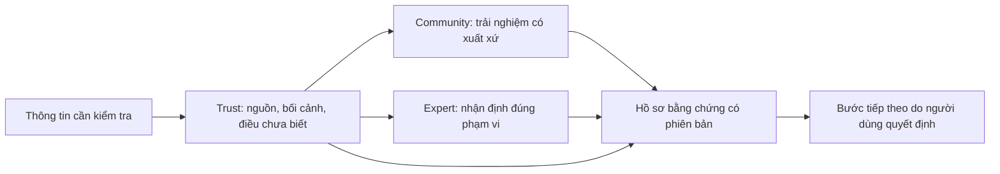

# StudentHub AI — Đề án sản phẩm và năng lực dự thi

Ngày: 08/09/2026 · Trạng thái: `PROPOSED_NOT_IMPLEMENTED` · Phạm vi: báo cáo, kế hoạch, đặc tả và prompt.

Đề xuất chủ đạo: **StudentHub AI — Kiểm chứng thông tin, hiểu rõ căn cứ, chọn bước tiếp theo.** Một sản phẩm tập trung vào Trust → Community → Expert, có hồ sơ bằng chứng theo phiên bản. Hướng mỹ thuật **Khai Minh — Hiểu đúng. Đi xa.** phục vụ câu chuyện này.

Theo yêu cầu mới nhất, **khóa học bị loại khỏi phạm vi sản phẩm đích**. Catalog, lesson player, lộ trình học lập trình, practice/quest và quảng bá khóa học không nằm trong đề án dự thi. Việc gỡ code chưa được thực hiện; [SCOPE-REDUCTION](SCOPE-REDUCTION.md) quy định đầy đủ bề mặt, dependency, dữ liệu và điều kiện nghiệm thu.

Đánh giá chuyên môn tạm thời: **6,3/10**, tính từ rubric nội bộ trong REPORT. Đây không phải điểm ban giám khảo, xác suất giải Nhất hoặc kết quả đo người dùng. Bối cảnh đã xác nhận: cuộc thi AI qua Thành đoàn TP.HCM, năm 2026; tên chính thức, bảng thi và rubric còn cần khớp với thông báo đội nhận được.

“Cho một quốc gia” được hiểu là thiết kế để phục vụ rộng rãi người dùng Việt Nam, gồm nhiều trình độ số, thiết bị và điều kiện kết nối. Đây không phải tuyên bố StudentHub là cổng thông tin nhà nước, có bảo trợ quốc gia hoặc đã đáp ứng tải toàn quốc.

| Tài liệu | Dùng để quyết định |
| --- | --- |
| [REPORT.md](REPORT.md) | Điểm /10, giới hạn dự báo giải thưởng, hiện trạng frontend/backend và điểm yếu cần ưu tiên |
| [PLAN.md](PLAN.md) | Kế hoạch tích hợp product, frontend, backend, AI evaluation, pilot và hồ sơ dự thi |
| [SPEC.md](SPEC.md) | Yêu cầu có ID, authority, dữ liệu, trạng thái, UI, font/màu/motion, hiệu năng và kiểm soát vận hành |
| [SCOPE-REDUCTION.md](SCOPE-REDUCTION.md) | Quyết định giữ/gỡ/đóng băng; bản đồ loại khóa học và bảo toàn dữ liệu |
| [ACCEPTANCE.md](ACCEPTANCE.md) | Traceability yêu cầu → phép thử → bằng chứng; demo, load/recovery và điều kiện đóng |
| [COMPETITION-FIT.md](COMPETITION-FIT.md) | Thông tin cuộc thi đã xác nhận, nguồn chính thức, khác biệt bảng thi và hồ sơ còn thiếu |
| [PROMPTS.md](PROMPTS.md) | Prompt cho quản lý dự án, frontend/backend, type design, ảnh, video, 3D và kiểm định |
| [DESIGN-HANDOFF.md](DESIGN-HANDOFF.md) | Handoff thiết kế chính thức VNext Khai Minh (70/20/10, typography, tokens, surfaces, states, accessibility) |

Thứ tự đọc: REPORT → COMPETITION-FIT → SCOPE-REDUCTION → PLAN → SPEC → ACCEPTANCE → PROMPTS → DESIGN-HANDOFF. Hai nhánh khởi động song song được đề xuất: xác nhận scope/rubric và chuẩn bị một tình huống Trust có bằng chứng; proof chữ/bố cục desktop/mobile. Chưa sản xuất hàng loạt video.

## Bản đồ sản phẩm đích

Luồng này mô tả trải nghiệm đích. Community và Expert cung cấp thêm căn cứ; không được ghi đè verdict. Việc tính lại phải qua pipeline có quyền, input và revision rõ. Labbe là quan sát/assurance phía sau, không phải trụ cột marketing hoặc người quyết định thay Trust.

## Trạng thái tài liệu và công việc

- `DOCUMENTED`: đề án, rubric nội bộ, yêu cầu, prompt và phép thử.
- `IMPLEMENTATION_NOT_STARTED_IN_THIS_PASS`: chưa gỡ khóa học, chưa thay frontend/backend, chưa tạo asset.
- `EVENT_ID_UNCONFIRMED`: TP.HCM 2026 đã xác nhận; tên/bảng thi chính thức chưa khớp duy nhất.
- Các kết quả test lịch sử có ngày và scope riêng; không được dùng làm PASS cho worktree mới.

Quy mô “toàn quốc” là tầm nhìn phục vụ, không phải điều kiện để thêm nhiều tính năng. Đợt đầu chứng minh ba loại thông tin cụ thể: học bổng nghi giả mạo, cơ hội thực tập có dấu hiệu rủi ro, và thông báo học vụ mâu thuẫn/hết hiệu lực.

Các file này không thay đổi frontend, backend, Trust, auth, realtime hoặc Labbe. Đề án không tự thay thế `.agents/DESIGN.md`; các khác biệt với design contract cũ được ghi rõ trong SPEC. Việc triển khai, tạo asset, chế tác font hay phát hành là các giai đoạn tương lai của đề án, chưa được thực hiện trong phiên lập tài liệu này.
