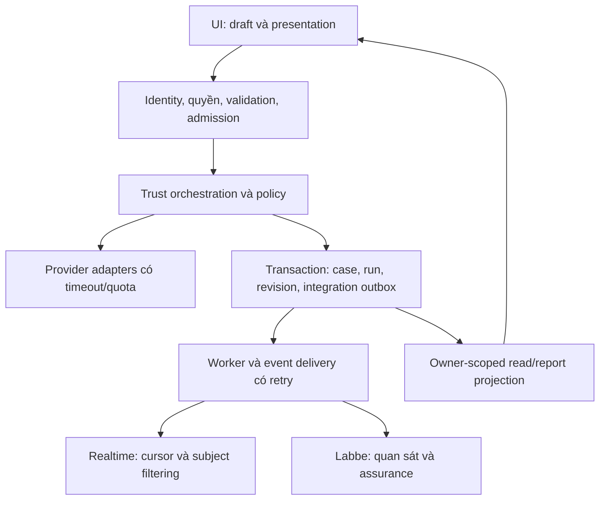

# StudentHub AI — Đặc tả sản phẩm, frontend và backend

Phiên bản đề xuất: 1.0 · Ngày: 08/09/2026 · Trạng thái: `PROPOSED_NOT_IMPLEMENTED`.

Đây là đặc tả để review và thi công theo [PLAN](PLAN.md), không phải tuyên bố hệ thống đã đáp ứng. Requirement có ID được kiểm chứng tại [ACCEPTANCE](ACCEPTANCE.md). Danh sách gỡ chức năng được quản lý tại [SCOPE-REDUCTION](SCOPE-REDUCTION.md).

## 1. Sản phẩm đích và người dùng

**JTBD:** Khi gặp một thông báo, đường dẫn hoặc lời mời chưa chắc chắn, người dùng cần biết thông tin dựa trên nguồn nào, còn thiếu gì và nên xác minh điều gì tiếp theo trước khi hành động.

Ba case trọng tâm: học bổng nghi giả mạo; cơ hội thực tập có dấu hiệu rủi ro; thông báo học vụ mâu thuẫn hoặc đã hết hiệu lực. Sản phẩm không thay người dùng thực hiện giao dịch hay quyết định có tính cưỡng chế.

| Persona / nhiệm vụ | Nhu cầu trong phạm vi |
| --- | --- |
| Sinh viên lần đầu dùng | Kiểm tra được một nội dung; hiểu kết quả mà không phải đọc thuật ngữ pipeline |
| Người cần chữ lớn / kết nối yếu | Đọc được đầy đủ, thao tác bằng keyboard/touch, dùng được khi media không tải |
| Người đóng góp cộng đồng | Gửi trải nghiệm trong quyền, hiểu việc hiển thị/cách dùng nguồn |
| Chuyên gia / reviewer | Thấy assignment, scope, evidence, COI; nhận định có version và người chịu trách nhiệm |
| Operator | Thấy lỗi/quota/queue/provider/cost; có quyền vận hành giới hạn, không giả lập business success |

`SCOPE-01`: không có khóa học, lesson player, course upsell hoặc nhóm học lập trình trong sản phẩm đích. Expert qualification và hồ sơ học vụ không bị xóa nhầm.

## 2. Bất biến authority và dữ liệu

| ID | Điều kiện bắt buộc |
| --- | --- |
| AUTH-01 | Actor/owner/role/scope lấy từ identity đã xác thực tại server; payload client không được tự cấp quyền |
| AUTH-02 | Chỉ Trust pipeline/policy được phép tạo verdict mới; UI, animation, Community, Expert và Labbe không ghi đè verdict |
| AUTH-03 | Community cung cấp context có xuất xứ; popularity/volume không phải truth. Expert có domain/scope/COI, không có quyền toàn tri |
| AUTH-04 | Demo, live, unavailable tách biệt. Provider hỏng không đổi sang fixture một cách ngầm định |
| DATA-01 | Case/run/revision/model/policy/source snapshot phải truy nguyên được; không gắn evidence của run cũ vào kết quả mới |
| DATA-02 | Raw screenshot, OCR, private evidence, credentials và token không đi ra Labbe hoặc prompt tạo asset |
| DATA-03 | Log mặc định chứa ID đã giảm nhạy cảm, code lỗi, timing và status; không chứa raw input, secret hoặc toàn bộ response provider |
| DATA-04 | Tính xong, lưu xong và gửi tích hợp xong là ba trạng thái riêng. Không có persisted ID thật thì không hiển thị “Đã lưu” |

## 3. Navigation và cấu trúc landing

`IA-01`: public header có brand, Kiểm chứng, Cộng đồng, Chuyên gia; ví dụ và đăng nhập là mục hỗ trợ. Label tiếng Việt ngắn, không quá một primary CTA trong cùng vùng. Root `/` là landing; giữ `/trust`, `/community`, `/expert`, `/cases` và các route account hiện hữu.

Desktop hero theo grid 12 cột: nội dung 5, cảnh 7; max-width 1280px, gutter 32px. Ở <1024px xếp theo thứ tự copy → CTA → poster, không bắt xem 3D mới đọc được lời hứa. Mobile gutter 20px; 320px dùng 16px. Khoảng cách section 72–112px desktop, 48–64px mobile. Không ép section cao 100vh hoặc khóa scroll.

Wireframe desktop đề xuất:

```text
Brand       Kiểm chứng   Cộng đồng   Chuyên gia       Đăng nhập
─────────────────────────────────────────────────────────────
Kiểm chứng thông tin cho sinh viên    [Hiên tri thức / poster]
Hiểu đúng.                           [cảnh có chiều sâu     ]
Đi xa.                               [vùng sáng phía phải   ]
Một đoạn dẫn ngắn về nguồn/bối cảnh.  [không có text baked-in]
[Kiểm tra thông tin]  Xem một ví dụ
─────────────────────────────────────────────────────────────
1. Một tình huống thực tế → Câu hỏi → Cách kiểm tra
2. Nguồn chính thức / cộng đồng / chuyên gia: vai trò khác nhau
3. Một hồ sơ kết quả: đã biết / chưa biết / cần làm gì
4. Dùng an tâm: privacy, giới hạn, quyền quyết định
5. CTA cuối + footer ngắn
```

Copy thử nghiệm: H1 “Hiểu đúng. Đi xa.”; mô tả “Kiểm tra nguồn tin, đối chiếu bối cảnh và xem điều còn thiếu trước khi bạn quyết định.” Primary “Kiểm tra thông tin” → `/trust`; secondary “Xem một ví dụ” → `/cases`. `/cases` phải hiển thị nhãn demo nếu dùng fixture. Không quảng bá số nguồn/người dùng/độ chính xác khi chưa có phép đo tương ứng.

`LAY-01`: template dùng một task chính, một heading rõ, một primary action; form không bị hero đẩy quá xa. Section case dùng nội dung đã được phép, không tự sinh testimonial hoặc bằng chứng “đã cứu người dùng”.

`LAY-02`: thứ tự overlay: content → sticky nav → popover → toast → dialog. Focus không bị toast/dock che. Operator console không gắn toàn site như widget người dùng. Không đổi backend realtime chỉ để ẩn console.

## 4. Typography tiếng Việt

`TYP-01`: một mapping canonical cho UI, display, numeric/code. Dọn alias theo dependency audit; kiểm tra computed style và font thực trên từng route. Không chỉ kiểm tra tên trong CSS.

Phương án nền: Be Vietnam Pro cho UI/body/headings; Lora cho tối đa một cụm display như “Đi xa.” hoặc một quote trong viewport; JetBrains Mono chỉ cho mã/ID/số đo cần thiết, lazy theo nhu cầu. A1 có một cụm serif, A2 toàn sans. So sánh cùng copy/layout rồi chọn một.

`TYP-02` — scale tại root mặc định 16px; dùng rem và co giãn theo viewport, không khóa người dùng tăng chữ:

| Vai trò | Mobile | Desktop | Weight / line-height / tracking |
| --- | --- | --- | --- |
| Hero H1 | 44–52px | 64–88px | Sans 600 hoặc serif 500; 1.18–1.22; −0.02em tối đa |
| Section H2 | 30–34px | 40–48px | 600; 1.25; −0.015em |
| Page title trong app | 28–32px | 32–40px | 600; 1.3; −0.01em |
| Card/group title | 20–24px | 22–28px | 600; 1.35; 0 |
| Lead | 17–18px | 19–20px | 400; 1.6; 0 |
| Body / result / input | 16–17px | 17–18px | 400; 1.6–1.75; 0 |
| Label / button / metadata cần đọc | 14–16px | 14–16px | 500/600; 1.45–1.6; 0 |
| Technical caption phụ | ≥13px | ≥13px | 400; 1.5; 0; không chứa cảnh báo quan trọng |

Đoạn văn 55–70ch desktop, chiều rộng available trên mobile. Không dùng all-caps cho đoạn dài; không dùng thin weight cho body; không cắt/clip dấu để đạt mask reveal. Không làm font-size chạy theo scroll. `text-wrap: balance` là enhancement, không thay việc kiểm tra wrap tiếng Việt.

`TYP-03`: dùng weight/style thật hoặc khai báo fallback có chủ đích. Không khẳng định weight 500/600 hiển thị đúng khi chỉ tải 400/700. Thử lazy/noncritical face trước khi tăng số file preload. Không tải toàn bộ family, mọi weight và mọi script mặc định.

Bộ proof bắt buộc:

```text
Hiểu đúng. Đi xa.
Kiểm chứng trước khi tin — nguồn nào, thời điểm nào, phạm vi nào?
Nguyễn Thị Thùy Dương · Đặng Hoàng Phúc · Trường Đại học Sư phạm Kỹ thuật
Ă Â Đ Ê Ô Ơ Ư · ă â đ ê ô ơ ư
Ắ Ằ Ẳ Ẵ Ặ · Ấ Ầ Ẩ Ẫ Ậ · Ế Ề Ể Ễ Ệ
Ố Ồ Ổ Ỗ Ộ · Ớ Ờ Ở Ỡ Ợ · Ứ Ừ Ử Ữ Ự
Chưa đủ bằng chứng. Cần xác minh thêm trước khi quyết định.
0O 1Il · 0123456789 · 1.234.567 ₫ · 08/09/2026 · 95,5%
```

Test cả Unicode NFC/NFD cho cùng câu, dấu stacked, inline bold/italic, fallback font, copy/paste/search và 200% text zoom. Không tự normalize/sửa dữ liệu nghiệp vụ trong component typography.

Font mới tùy chọn: **StudentHub Display** là brief chế tác, chưa có binary. Thiết kế proof → glyph source → mark positioning/kerning → full Vietnamese coverage → test browser → xuất WOFF2. Chỉ thay vai trò display, không thêm family thứ tư khắp app. Ảnh alphabet do AI sinh không được coi là một font hoạt động.

Nguồn đã đối chiếu: [Be Vietnam Pro metadata](https://github.com/google/fonts/blob/main/ofl/bevietnampro/METADATA.pb), [Lora metadata](https://github.com/google/fonts/blob/main/ofl/lora/METADATA.pb). Giữ giấy phép đi cùng artifact font thực tế.

## 5. Palette và surface

`COL-01`: palette đề xuất dùng dark canvas hiện có làm nền nhận diện, chữ ngà và jade làm accent chính. Màu trạng thái có nhiệm vụ riêng, luôn đi với label/icon; jade brand không có nghĩa verdict an toàn.

| Token đề xuất | Hex | Vai trò |
| --- | --- | --- |
| canvas | `#07090E` | Nền toàn trang |
| surface | `#0C131B` | Vùng đọc/form opaque |
| raised | `#14202B` | Popover/dialog/nhóm nâng cấp |
| text-primary | `#F3F1EA` | Tiêu đề/nội dung |
| text-secondary | `#B9C6CC` | Đoạn dẫn/giải thích |
| text-muted-readable | `#93A6B1` | Metadata cần đọc |
| brand | `#8BD9C3` | CTA/selection |
| on-brand | `#071812` | Chữ trên CTA |
| control-border | `#647787` | Viền cần nhận diện input/control |
| focus | `#C8E8FF` | Focus ring với offset rõ |
| decoration-border | `#29343F` | Vạch phân cách trang trí, không thay viền control |

Tính theo luminance sRGB trên cặp màu đặc, chưa phải audit browser: primary/surface 16.52:1; secondary/surface 10.68:1; muted/surface 7.41:1; muted/raised 6.55:1; on-brand/brand 11.16:1; control-border/raised 3.56:1.

State color pairs: success `#A7E5C6`/`#15382B` (8.98:1), warning `#F0C278`/`#3B2B14` (8.23:1), danger `#FFA59B`/`#3C2027` (7.78:1), info `#A9CBE6`/`#182E43` (8.19:1). Đây là foreground/background, không trộn opacity hoặc gradient rồi giữ nguyên claim tương phản.

Surface đọc có nền opaque; glass giới hạn ở nav/đồ trang trí không làm mất độ rõ. Radius đề xuất: input/button 10px, card 16px, dialog 20px; icon trong hệ hiện có, stroke nhất quán. Không cần thay thư viện icon để đạt “cao cấp”.

## 6. Art direction và hero 3D

`ART-01`: **Hiên tri thức** — kiến trúc học đường Việt Nam đương đại: bóng râm, lam chắn nắng, đá/giấy/gốm/gỗ và ánh sáng ban ngày tiết chế; hình ảnh làm rõ hoạt động tìm hiểu. Không giả danh trường thật, quốc huy, chứng nhận, đối tác, bản đồ lãnh thổ hoặc số liệu quốc gia.

Asset cần sản xuất: HERO-01 desktop poster; HERO-01M mobile composition; HERO-LOOP-01; SOURCE-01 static still; COMMUNITY-01 illustration/photo có quyền; EXPERT-01 still; OG-01 social crop. Không dùng ảnh người AI làm chân dung chuyên gia đã xác minh hoặc testimonial. Giấy/tài liệu trong ảnh không chứa thông tin cá nhân thật.

`HERO-01`: một cảnh kiến trúc với ba lớp vật liệu gợi nguồn, đối chiếu và hiểu biết; không ba robot hoặc mạng node IT đầy chữ. Text là HTML ngoài media. Desktop vùng bên trái yên tĩnh ≥45% frame nếu ảnh bleed; mobile compose lại, không crop khuôn mặt/chủ thể ngẫu nhiên.

`HERO-02`: 3D là progressive enhancement tự chọn trên thiết bị phù hợp. Poster/SVG truyền đạt cùng ý nghĩa. Canvas không chứa CTA duy nhất và không nắm business state. Tối đa một scene hoạt động; model/glow/camera không được phụ thuộc vào riêng provider response để trang tải được.

Ngân sách thử nghiệm 3D: initial asset pack ≤1.5MB compressed; desktop draw calls ≤60, triangles ≤80k, textures chính ≤1024px, DPR tối đa 1.5. Đây là budget nội bộ để prototype đo; không phải bảo đảm FPS. Dừng render khi offscreen/hidden; context lost chuyển poster. Không load đồng thời background video và WebGL cho cùng hero.

## 7. Motion và media state contract

`MED-01`: public landing có tối đa một vùng ambient đang phát; app core/Trust result/Community đọc/Expert review dùng nền tĩnh. Loại khả năng tải film toàn site khỏi critical path, không xóa asset gốc.

Motion token: feedback 120–180ms; component transition 180–240ms; panel/reveal 240–360ms; hero entrance ≤600ms, một lần. Easing `cubic-bezier(0.16,1,0.3,1)`; dịch chuyển reveal ≤12px; pointer parallax ≤8px desktop nếu bật. Scroll native, không scroll-jacking, auto audio hoặc custom cursor bắt buộc.

`MED-02`: trạng thái dưới đây là contract hành vi, không phải tên API mới.

| State | Trigger | Hành động | Boundary / lỗi |
| --- | --- | --- | --- |
| STATIC | SSR/first visit | Render copy, CTA, poster đủ chiều | Không chờ font/video để hiểu trang |
| ELIGIBLE | Visible + chính sách media cho phép + content đã usable | Chọn đúng một rendition | Network/hardware API chỉ là hint; không dựa vào fingerprint |
| LOADING | Tải enhancement đã được chọn | Giữ poster và size | Không spinner đè lên CTA; timeout 4s → STATIC |
| PLAYING | Media ready hoặc người dùng bật | Muted/playsInline; hiển thị Pause có tên | Autoplay rejection → STATIC; không lặp request vô hạn |
| PAUSED | Người dùng Pause | Dừng mọi motion/media của vùng, kể cả nhánh fallback | Ghi preference local nếu khả dụng; không mất focus |
| REDUCED | OS reduced-motion hoặc user chọn tắt | Poster tĩnh; không fetch video/3D mới | Thay đổi preference lúc đang phát phải dừng ngay |
| SUSPENDED | Tab hidden/offscreen | Pause video, ngừng render loop | Resume chỉ nếu user chưa pause và policy còn cho phép |
| UNAVAILABLE | Codec/error/context lost/Save-Data hoặc môi trường không phù hợp | Static poster hoặc surface tĩnh | Không dùng WebP/GIF động làm fallback “đã giảm chuyển động” |

Mobile mặc định static; nút “Xem chuyển động” là tùy chọn. Save-Data hoặc reduced-motion vẫn ưu tiên static; không tự ghi đè preference khi chuyển route. Storage unavailable vẫn hoạt động trong session.

Video delivery: master 8s/24fps/192 frames, crop 16:9 hoặc mobile riêng; kiểm tra seam bằng first/last frame và velocity. Master chất lượng cao tách khỏi file web. Web MP4 H.264 profile phù hợp, poster AVIF/WebP tĩnh; WebM là rendition tùy nhu cầu đo. Xác minh MIME/codec thực tế, không suy ra từ đuôi file. Web budget desktop ≤2.5MB, mobile opt-in ≤1.2MB. Không preload tất cả rendition.

## 8. Trạng thái nghiệp vụ và UI

`STATE-01`: UI có ít nhất ba trục độc lập: **analysis**, **persistence**, **provider/transport availability**. Adapter ánh xạ trạng thái server hiện có; không dựng một enum API thay thế trong redesign.

| State / trigger | UI / action | Điều bị cấm |
| --- | --- | --- |
| Idle / nội dung chưa gửi | Chọn text/URL/image, giới hạn và mục đích rõ | Tự gửi khi người dùng chưa yêu cầu |
| Invalid / validate fail | Lỗi cạnh field, giữ draft, focus hữu ích | Gửi payload sai rồi giả loading |
| Running / run thật đã bắt đầu | Một stage panel, status thật, cancel nếu contract cho phép | Animation timer tự nhảy tới thành công |
| Partial / thiếu provider hoặc nguồn | Phần đã biết + nguồn thiếu + hạn chế | Đổi thành safe/success toàn phần |
| Insufficient / chưa đủ căn cứ | “Chưa đủ bằng chứng”, bước xác minh khả thi | Confidence giả để lấp chỗ trống |
| Conflict / nguồn mâu thuẫn | Nêu mâu thuẫn, phạm vi/thời điểm, không ép hợp nhất | Lấy nhiều vote làm trọng tài truth |
| Analysis completed / save pending | Cho xem kết quả với “Đang lưu” nếu server thật sự còn lưu | Hiển thị saved/permalink khi chưa có commit |
| Save failed / storage error | “Phân tích đã xong, chưa lưu được”; giữ run/draft, retry theo idempotency | Biến lỗi lưu thành verdict mới |
| Persisted / server commit | Case ID/run/revision thật, đọc lại đúng owner | Tạo case ID phía UI để giả đã lưu |
| Auth required / forbidden | Đăng nhập hoặc thông báo quyền; giữ draft trong giới hạn privacy | Tự chuyển sang guest có quyền rộng hơn |
| Rate limited / outage / offline | Retry-After khi có, cách thử lại, kết quả cũ có timestamp | Retry tự động không giới hạn hoặc silent demo fallback |
| Cancelled / newer run | Dừng cập nhật run cũ; phản hồi trễ không ghi đè run mới | Xóa draft mới khi run cũ trả về |

Trust V5 hiện có bảy stage; giữ presenter contract hiện hữu, không biến “bốn lớp” trong marketing thành bốn stage runtime giả. Tóm tắt dễ hiểu ở đầu, giải thích kỹ thuật qua progressive disclosure; keyboard vẫn truy cập đủ nguồn/giới hạn.

## 9. Backend, transaction và delivery

Giữ stack/module hiện có: Next.js server routes, services/repositories, PostgreSQL/Supabase, provider adapters. Không mặc định thêm microservices, Kafka, Kubernetes hay vector DB mới. Chỉ thay kiến trúc khi profiling và một ADR chỉ ra giới hạn cần giải quyết.



Sơ đồ là boundary đích. Mức liên kết atomic của realtime publisher cần kiểm chứng/hoàn thiện; không suy ra đã có durable worker chỉ vì có một class publisher.

`BE-01` — Query/mutation boundary: body size, MIME, schema, Unicode/input normalization theo loại dữ liệu, URL/redirect/SSRF restrictions, rate limit và error envelope có correlation ID. Không cho client chỉ định owner, verified status, role, evidence authority hoặc model metrics.

`BE-02` — Commit: case/run/revision và integration event trong cùng transaction khi mode yêu cầu outbox. Chỉ ack persisted sau commit. Rollback không để half-case hoặc orphan event. Lỗi HTTP của Labbe không nằm trong transaction Trust. Nếu chính DB/outbox insert lỗi, đó là durability failure cần UI nói thật, không tự đổi kết luận phân tích.

`BE-03` — Idempotency: key có scope `(actor, operation, key)`; digest của request và policy/model/version cần thiết được xác định theo contract, không lowercase toàn bộ input tùy tiện. Cùng key/cùng digest trả kết quả đã có; cùng key/khác digest trả conflict. Concurrent requests không tạo hai hiệu ứng. Receiver event cùng ID/hash dedup, khác hash conflict; retry sau timeout-after-commit không tạo business effect lặp.

`BE-04` — Revision và readback: report/Passport đọc snapshot immutable theo owner và revision; tham chiếu nguồn giữ timestamp/content hash/classification. User sửa input tạo run/revision mới. Snapshot nguồn không đồng nghĩa được công khai raw document.

`REL-01` — Durable execution: với đường xử lý được quảng bá là chịu restart, job đã nhận phải có durable state trước ack nhận việc. Worker claim bằng lease/fencing, lease expiry/retry/backoff, concurrency giới hạn. Nếu đường hiện tại gắn request lifecycle chưa có job bền vững, phải ghi capability đó chưa đạt; không promise background recovery.

`REL-02` — Realtime: subscriber nhận projection theo quyền; sequence cursor, replay và gap policy rõ; at-least-once transport, client dedup. Subject-bound event vẫn private dù channel có tên public. Notification không là source of truth. Nếu append event thất bại sau commit, recovery phải dựa vào ledger/outbox bền vững hoặc reconciliation có bằng chứng; không để khoảng mất event bị che bởi toast.

## 10. Security, Community và Expert

`SEC-01`: ma trận guest/user A/user B/reviewer/expert/admin/service được kiểm tra trên API thật với synthetic identities; owner isolation cả read/list/download/mutation, session expiry/refresh/logout/revocation. Không dùng hide button làm authorization.

`SEC-02`: migration/admin role tách runtime role. Effective permissions được chứng minh bằng thử âm trên DB test, kể cả path BYPASSRLS. Chọn service-authorized access hay user-context RLS phải có ADR; không ghi “RLS bảo vệ tất cả” chỉ từ DDL policy.

`SEC-03`: private storage không public URL; validate upload, giới hạn loại/size/decompression, quét theo capability thật; không giả claim đã scan. Export/download kiểm tra scope; TTL và retention có owner/purpose. Không giữ raw screenshots/OCR vô hạn vì tiện debug.

`COM-01`: public projection tối thiểu, nguồn/thời điểm, moderation status thực, complaint/appeal có người chịu trách nhiệm. Rate limit, dedup và chống spam phục vụ phạm vi case; không mở social network đầy đủ.

`EXP-01`: qualification quiz không đủ để tự activate. Assignment/domain/COI/reviewer/version bắt buộc theo workflow; assessment idempotent, duplicate không tăng reputation; revoke/appeal có actor/lý do/audit. Labbe không activate/revoke expert.

## 11. AI evaluation và đóng góp mới

`AI-01`: corpus có provenance/quyền, version/hash, label schema, exact/near-duplicate audit, dữ liệu cá nhân được xử lý trước khi dùng. Split theo campaign/source/time để hạn chế leakage; test giữ kín trước tuning; hai reviewer cho mẫu khó/high-risk và adjudication khi bất đồng.

`AI-02`: so sánh trên cùng holdout tối thiểu ba cấu hình khi phù hợp: rule baseline; rule + retrieval; phương án đầy đủ. LLM API không mặc nhiên là đóng góp riêng của đội. Ablation tắt source freshness hoặc dedup chỉ chạy offline để đo giá trị, không hạ bảo vệ trong app dùng thật.

`AI-03`: báo cáo precision/recall/F1 theo task, false reassurance, abstention/coverage, citation correctness, latency p50/p95 và cost/run. Ghi denominator, confidence interval phù hợp, bất đồng nhãn và failure categories. Model hash/config/code/dataset split/prompt phải tái lập được. Không xuất metric cố định từ trainer hoặc lấy full training set làm test.

Đề xuất tập đánh giá pilot: khoảng 300 case được phân tầng, gồm ≥100 trường hợp rủi ro cao có nhãn được duyệt. Ngưỡng challenge nội bộ: không có false reassurance trong nhóm rủi ro cao đó; vẫn báo khoảng bất định, không gọi 0 lỗi quan sát là 0 rủi ro. Tập nhỏ hơn phải báo là exploratory, không thay denominator để qua gate. Claim “hơn baseline” chỉ được dùng nếu so sánh hỗ trợ, không đánh đổi safety để tăng coverage.

Đóng góp có thể chứng minh: phân tách source authority, nhận diện thông báo cũ/mâu thuẫn, abstention có lý do, case revision và next action có căn cứ. Nếu model riêng không cải thiện, giữ baseline và trình bày đúng phần engineering/UX tạo giá trị.

## 12. Labbe

`LAB-01`: giữ DISABLED/SHADOW/STAGING theo bridge hiện có. SHADOW không tạo production side effect; STAGING cần HTTPS, token, scope, classification và receiver test hợp lệ; CONTROLLED không bật trong đề án này. Không automatic writeback.

`LAB-02`: assurance chỉ đọc với permission `ADMIN.SECURITY`, freshness mặc định 5 phút theo projection hiện tại; CURRENT/STALE/UNAVAILABLE tách với Trust verdict. Không mở assurance cho mọi sinh viên chỉ để thêm badge. Labbe có thể observe/detect/correlate/assure; không moderate Community, ban người dùng hoặc đổi trạng thái expert qua bridge.

## 13. Performance, accessibility và vận hành

`PERF-01`: mục tiêu UI đề xuất: LCP ≤2.5s, INP ≤200ms, CLS ≤0.1 ở field p75 khi có đủ mẫu. Lab dùng ≥5 cold runs/profile, báo median và worst, không gọi TBT là INP. [Core Web Vitals](https://web.dev/articles/vitals).

Budget bổ sung của candidate: initial route JS mục tiêu ≤250,000 raw bytes, không vượt repository gate 500,000 bytes; font tải trước interaction ≤140KB WOFF2 tổng Latin/Vietnamese; mobile hero poster ≤180KB, desktop ≤320KB; initial media transfer mobile ≤300KB; video/3D không có initial request trên mobile mặc định. Các con số này là yêu cầu nội bộ, phải đo và xử lý scope nếu không đạt.

`A11Y-01`: thiết kế hướng WCAG 2.2 AA; text thường ≥4.5:1, text lớn ≥3:1; control/focus được kiểm tra riêng. Touch targets mục tiêu 44×44 CSS px của project; đây là mục tiêu cao hơn nhiều trường hợp minimum AA, không phải lời trích tiêu chuẩn. Đọc/nhập liệu dùng nền tĩnh để contrast không phụ thuộc frame. [Contrast Minimum](https://www.w3.org/WAI/WCAG22/Understanding/contrast-minimum.html), [Target Size Minimum](https://www.w3.org/WAI/WCAG22/Understanding/target-size-minimum.html).

`A11Y-02`: 320px reflow, 200% resize text, 400% browser zoom theo điều kiện phù hợp; không mất chức năng khi user đặt line-height 1.5, paragraph spacing 2em, letter-spacing .12em và word-spacing .16em. Keyboard/landmarks/dialog focus/screen reader/status live region có phép thử thật. Các spacing trên là điều kiện override, không phải bắt dùng làm style mặc định. [Text Spacing](https://www.w3.org/WAI/WCAG22/Understanding/text-spacing.html), [Reflow](https://www.w3.org/WAI/WCAG22/Understanding/reflow.html).

`A11Y-03`: pause/stop cho motion tự chạy kéo dài khi thuộc phạm vi tiêu chí; reduced-motion tắt decorative motion; alt rỗng cho trang trí, alt có ý nghĩa cho ảnh thông tin; clip có speech cần caption/transcript. Không dùng autoplay audio. [Pause, Stop, Hide](https://www.w3.org/WAI/WCAG22/Understanding/pause-stop-hide.html).

`PERF-02`: load envelope phải ghi số requests, concurrent connections, dataset/hardware, provider mode và queue/DB limits. Không dùng số “người dùng toàn quốc” suy ra từ tải local. Profile thử ban đầu và stop conditions ở ACCEPTANCE.

`OPS-01`: theo dõi request latency, error rate, queue age, lease expiry, dedup/conflict, event lag, auth denials, provider token/cost, pool saturation và correlation IDs đã redacted. Alert gắn owner/runbook; health tách liveness với capability readiness. Retention/cost cap/concurrency/global quota có quyết định đo được; không gửi token/raw input sang analytics.

## 14. ADR đề xuất và xử lý design contract cũ

| ADR | Quyết định | Đánh đổi / điều kiện xem lại |
| --- | --- | --- |
| ADR-01 | Trust/Community/Expert là core; bỏ course | Phạm vi hẹp hơn, dễ đánh giá hơn; không làm mất dữ liệu học vụ |
| ADR-02 | Giữ stack; hoàn thiện transaction/worker có sẵn | Tránh rearchitecture trước bằng chứng; đo bottleneck rồi mới thay |
| ADR-03 | Typography trước cinematic, poster trước enhancement | Có thể ít motion hơn nhưng còn đầy đủ nghĩa khi mạng/thiết bị yếu |
| ADR-04 | Background theo route purpose, vùng đọc opaque | Chủ động thay hướng “glass/video mọi nơi” của design contract cũ trong giai đoạn triển khai được duyệt |
| ADR-05 | Chất lượng AI qua baseline/holdout; model riêng không bắt buộc | Cần đóng góp mới có bằng chứng; không trang trí claim AI bằng metric giả |
| ADR-06 | Labbe quan sát tách authority | Tích hợp không được làm giảm tính độc lập của Trust |

Tài liệu này chưa ghi đè `.agents/DESIGN.md` hoặc Vault. Khi triển khai hướng đã chọn, cập nhật token contract và migration map trong cùng changeset, giữ compatibility cho surface chưa chuyển. Không áp dụng màu/alias mới global rồi để các màn cũ tự vỡ.
