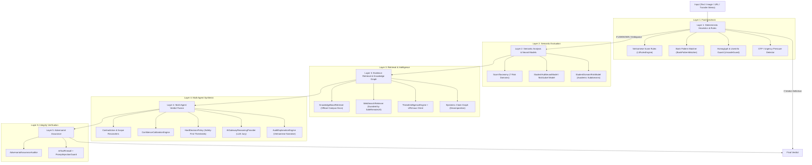
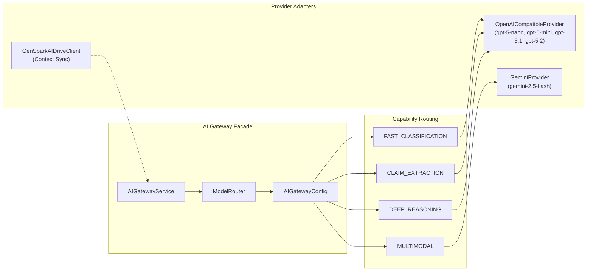

# StudentHub AI — Comprehensive Backend Handoff Manifest

**Reconnaissance Date:** September 1, 2026  
**Git Branch:** `codex/trust-engine-v5-sequential-assurance`  
**Git Commit:** `f96291ec` (docs(trust): record closure ci and preview evidence)  
**Target Repository:** `Duy2613/StudentHub-AI`  
**Reconnaissance Mode:** READ-ONLY (Zero mutations, zero installs, zero Supabase state changes)  
**Output Target:** `docs/handoff/BACKEND_HANDOFF_MANIFEST.md`

---

## 1. Executive Summary & Critical Discovery

### 1.1 The "Invisible Backend" Discovery
The most critical architectural finding of this reconnaissance is that **the root directory `/backend` is a placeholder containing only an empty README.md (2 bytes)**. 

The entire runtime backend for StudentHub AI is currently **embedded directly inside the `frontend/` Next.js application** across:
1. `frontend/src/app/api/**` (110 API route handler files / 137 HTTP methods)
2. `frontend/src/lib/security/**` (32 Zero-Trust Security Fabric, Identity, RBAC/ABAC/ReBAC, Session, and CSRF files)
3. `frontend/src/lib/ai-gateway/**` (8 LLM Model Routing, Fallback, and Provider files)
4. `frontend/src/lib/ai-trust/**` (122 Trust Engine Layer 1–5, Neural Models, MLOps, and Threat Intel files)
5. `frontend/src/lib/intelligence/**` (175 Academic, Community, Expert, Fusion, Passport, and Decision Twin domain files)
6. `frontend/src/lib/server/database/**`, `frontend/src/lib/db/**`, `frontend/src/lib/forum/**` (PostgreSQL connection pools, database adapters, repositories)
7. `database/migrations/**` (PostgreSQL 15+ schemas, RLS policies, triggers, and audit tables)

Additionally, a catch-all proxy at `frontend/src/app/api/[...path]/route.js` conditionally forwards 4 allowlisted authentication routes (`auth/login`, `auth/register`, `auth/sync`, `auth/me`) to an external collaborator ASP.NET Core backend hosted on Render (`https://studenthub-api-8fqp.onrender.com`).

### 1.2 Quantitative Reconnaissance Summary

| Metric | Count / Status | Notes |
| :--- | :--- | :--- |
| **Total Backend-Relevant Files** | **510 files** | Located across `frontend/src/`, `database/`, `scripts/`, and `ai/` |
| **API Route Files** | **110 files** | Grouped into 23 functional namespaces under `/api` |
| **API HTTP Handlers** | **137 handlers** | 70 Authenticated, 61 Public/Explicit Anonymous, 6 Admin/Service |
| **Database Migrations & Schemas** | **4 files** | 2 SQL migrations + 1 base schema in `database/` |
| **Security Fabric Core** | **32 files** | Zero-Trust, OIDC JWKS, Hashed Sessions, CSRF, SSRF guards |
| **AI Gateway & Providers** | **8 files** | ModelRouter, Gemini, OpenAI-compatible proxy, Fallback chains |
| **Trust Engine (Layers 1-5)** | **139 files** | Layer 1 Rules, Layer 2 Models, Layer 3 Retrieval, Layer 4 Fusion, Layer 5 Assurance |
| **Intelligence Domain Engines** | **175 files** | Academic 360, Community, Expert Graph, Fusion, Social Connectors, Passports |
| **Backend Unit & Domain Tests** | **285 test files** | Node.js native test runner (`node --test`) covering domain logic |
| **External Environment Variables** | **45 unique vars** | Categorized without exposing any secret values |
| **File Classifications** | **284 COPY, 213 ADAPT, 2 REBUILD, 1 KEEP, 10 SKIP** | Detailed classification breakdown below |

---

## 2. Master Classification Taxonomy

Every backend-relevant file has been classified under one of the six mandated categories:

- **`COPY` (284 files)**: High-quality, tested, production-grade business logic, algorithms, Security Fabric modules, database schemas, and mathematical engines that should be moved as-is into the independent backend.
- **`ADAPT` (213 files)**: Robust domain logic that currently has minor Next.js App Router coupling, in-memory store fallbacks, or path aliases (`@/`) that need adaptation for a standalone backend framework (e.g. Node/Express, Fastify, NestJS, or Go).
- **`REBUILD` (2 files)**: Unsafe or legacy components that MUST be rewritten from scratch (specifically: `DatabaseAdapter.js` due to atomic local JSON file fallback, and `[...path]/route.js` catch-all proxy to Render).
- **`KEEP` (1 file)**: Files that belong exclusively in the frontend client layer (e.g. `AuthContext.jsx`).
- **`SKIP` (10 files)**: Offline training datasets and offline model trainers in `ai/` that are not part of the active runtime backend.
- **`UNKNOWN` (0 files)**: Zero files left unclassified.

---

## 3. Complete File-by-File Backend Manifest

Below is the exhaustive inventory of all **510 backend-relevant files** across the repository, grouped by architectural subsystem.

### 3.1 API Route Handlers (frontend/src/app/api/**) (110 files)

#### `frontend/src/app/api/academic/command-center/route.js`
- **PURPOSE:** Academic planner, simulation, roadmap, command center, notifications, tasks
- **CLASSIFICATION:** `ADAPT`
- **SECURITY SENSITIVITY:** `HIGH`
- **IMPORTS:** `@/lib/intelligence/academic/academicCommandCenterDataLoader.js`, `@/lib/security/SecurityFabric.js`, `@/lib/security/authorization/ObjectAuthorizer.js`
- **CALLED BY:** _None (Entry/Root)_
- **DATABASE DEPENDENCY:** No
- **SUPABASE DEPENDENCY:** No
- **AUTH DEPENDENCY:** Yes (SecurityFabric / Session / OIDC)
- **EXTERNAL PROVIDER DEPENDENCY:** No
- **SECRET REQUIREMENTS:** _None_
- **FRONTEND DEPENDENCY:** No (Pure Server / Universal JS)
- **TEST COVERAGE:** _Indirect / Untested directly_

#### `frontend/src/app/api/academic/me/decision-studio/adopt/route.js`
- **PURPOSE:** Academic planner, simulation, roadmap, command center, notifications, tasks
- **CLASSIFICATION:** `ADAPT`
- **SECURITY SENSITIVITY:** `HIGH`
- **IMPORTS:** `next/server`, `@/lib/intelligence/academic/academicCommandCenterDataLoader`, `@/lib/intelligence/academic/academicDecisionEngine`, `@/lib/security/SecurityFabric.js`
- **CALLED BY:** _None (Entry/Root)_
- **DATABASE DEPENDENCY:** No
- **SUPABASE DEPENDENCY:** No
- **AUTH DEPENDENCY:** Yes (SecurityFabric / Session / OIDC)
- **EXTERNAL PROVIDER DEPENDENCY:** No
- **SECRET REQUIREMENTS:** _None_
- **FRONTEND DEPENDENCY:** No (Pure Server / Universal JS)
- **TEST COVERAGE:** _Indirect / Untested directly_

#### `frontend/src/app/api/academic/me/decision-studio/route.js`
- **PURPOSE:** Academic planner, simulation, roadmap, command center, notifications, tasks
- **CLASSIFICATION:** `ADAPT`
- **SECURITY SENSITIVITY:** `HIGH`
- **IMPORTS:** `next/server`, `@/lib/intelligence/academic/academicCommandCenterDataLoader`, `@/lib/intelligence/academic/academicDecisionEngine`, `@/lib/security/SecurityFabric.js`
- **CALLED BY:** _None (Entry/Root)_
- **DATABASE DEPENDENCY:** No
- **SUPABASE DEPENDENCY:** No
- **AUTH DEPENDENCY:** Yes (SecurityFabric / Session / OIDC)
- **EXTERNAL PROVIDER DEPENDENCY:** No
- **SECRET REQUIREMENTS:** _None_
- **FRONTEND DEPENDENCY:** No (Pure Server / Universal JS)
- **TEST COVERAGE:** _Indirect / Untested directly_

#### `frontend/src/app/api/academic/me/discrepancy-report/route.js`
- **PURPOSE:** Academic planner, simulation, roadmap, command center, notifications, tasks
- **CLASSIFICATION:** `ADAPT`
- **SECURITY SENSITIVITY:** `HIGH`
- **IMPORTS:** `next/server`, `@/lib/intelligence/academic/studentProfile360Service`, `@/lib/security/SecurityFabric.js`, `@/lib/security/authorization/ObjectAuthorizer.js`
- **CALLED BY:** _None (Entry/Root)_
- **DATABASE DEPENDENCY:** No
- **SUPABASE DEPENDENCY:** No
- **AUTH DEPENDENCY:** Yes (SecurityFabric / Session / OIDC)
- **EXTERNAL PROVIDER DEPENDENCY:** No
- **SECRET REQUIREMENTS:** _None_
- **FRONTEND DEPENDENCY:** No (Pure Server / Universal JS)
- **TEST COVERAGE:** _Indirect / Untested directly_

#### `frontend/src/app/api/academic/me/execution/reconcile/route.js`
- **PURPOSE:** Academic planner, simulation, roadmap, command center, notifications, tasks
- **CLASSIFICATION:** `ADAPT`
- **SECURITY SENSITIVITY:** `HIGH`
- **IMPORTS:** `next/server`, `@/lib/intelligence/academic/academicCommandCenterDataLoader`, `@/lib/intelligence/academic/academicPlanDriftEngine`, `@/lib/intelligence/academic/academicExecutionStore`, `@/lib/security/SecurityFabric.js`
- **CALLED BY:** _None (Entry/Root)_
- **DATABASE DEPENDENCY:** Yes (PostgreSQL / SQL queries)
- **SUPABASE DEPENDENCY:** No
- **AUTH DEPENDENCY:** Yes (SecurityFabric / Session / OIDC)
- **EXTERNAL PROVIDER DEPENDENCY:** No
- **SECRET REQUIREMENTS:** _None_
- **FRONTEND DEPENDENCY:** No (Pure Server / Universal JS)
- **TEST COVERAGE:** _Indirect / Untested directly_

#### `frontend/src/app/api/academic/me/execution/route.js`
- **PURPOSE:** Academic planner, simulation, roadmap, command center, notifications, tasks
- **CLASSIFICATION:** `ADAPT`
- **SECURITY SENSITIVITY:** `HIGH`
- **IMPORTS:** `next/server`, `@/lib/intelligence/academic/academicCommandCenterDataLoader`, `@/lib/intelligence/academic/academicPlanDriftEngine`, `@/lib/intelligence/academic/academicExecutionStore`, `@/lib/security/SecurityFabric.js`
- **CALLED BY:** _None (Entry/Root)_
- **DATABASE DEPENDENCY:** No
- **SUPABASE DEPENDENCY:** No
- **AUTH DEPENDENCY:** Yes (SecurityFabric / Session / OIDC)
- **EXTERNAL PROVIDER DEPENDENCY:** No
- **SECRET REQUIREMENTS:** _None_
- **FRONTEND DEPENDENCY:** No (Pure Server / Universal JS)
- **TEST COVERAGE:** _Indirect / Untested directly_

#### `frontend/src/app/api/academic/me/planner/route.js`
- **PURPOSE:** Academic planner, simulation, roadmap, command center, notifications, tasks
- **CLASSIFICATION:** `ADAPT`
- **SECURITY SENSITIVITY:** `HIGH`
- **IMPORTS:** `next/server`, `@/lib/intelligence/academic/academicCommandCenterDataLoader`, `@/lib/intelligence/academic/academicSemesterPlannerEngine`, `@/lib/intelligence/academic/academicPlannerModel`, `@/lib/security/SecurityFabric.js`
- **CALLED BY:** _None (Entry/Root)_
- **DATABASE DEPENDENCY:** No
- **SUPABASE DEPENDENCY:** No
- **AUTH DEPENDENCY:** Yes (SecurityFabric / Session / OIDC)
- **EXTERNAL PROVIDER DEPENDENCY:** No
- **SECRET REQUIREMENTS:** _None_
- **FRONTEND DEPENDENCY:** No (Pure Server / Universal JS)
- **TEST COVERAGE:** _Indirect / Untested directly_

#### `frontend/src/app/api/academic/me/profile-360/route.js`
- **PURPOSE:** Academic planner, simulation, roadmap, command center, notifications, tasks
- **CLASSIFICATION:** `ADAPT`
- **SECURITY SENSITIVITY:** `HIGH`
- **IMPORTS:** `../../../../../lib/intelligence/academic/studentProfile360Service.js`, `../../../../../lib/security/SecurityFabric.js`, `../../../../../lib/security/authorization/ObjectAuthorizer.js`
- **CALLED BY:** _None (Entry/Root)_
- **DATABASE DEPENDENCY:** No
- **SUPABASE DEPENDENCY:** No
- **AUTH DEPENDENCY:** Yes (SecurityFabric / Session / OIDC)
- **EXTERNAL PROVIDER DEPENDENCY:** No
- **SECRET REQUIREMENTS:** _None_
- **FRONTEND DEPENDENCY:** No (Pure Server / Universal JS)
- **TEST COVERAGE:** `frontend/tests/security/p0_bola_pii_regression.test.mjs`

#### `frontend/src/app/api/academic/me/roadmap/route.js`
- **PURPOSE:** Academic planner, simulation, roadmap, command center, notifications, tasks
- **CLASSIFICATION:** `ADAPT`
- **SECURITY SENSITIVITY:** `HIGH`
- **IMPORTS:** `next/server`, `@/lib/intelligence/academic/academicCommandCenterDataLoader`, `@/lib/security/SecurityFabric.js`
- **CALLED BY:** _None (Entry/Root)_
- **DATABASE DEPENDENCY:** No
- **SUPABASE DEPENDENCY:** No
- **AUTH DEPENDENCY:** Yes (SecurityFabric / Session / OIDC)
- **EXTERNAL PROVIDER DEPENDENCY:** No
- **SECRET REQUIREMENTS:** _None_
- **FRONTEND DEPENDENCY:** No (Pure Server / Universal JS)
- **TEST COVERAGE:** _Indirect / Untested directly_

#### `frontend/src/app/api/academic/me/simulate/route.js`
- **PURPOSE:** Academic planner, simulation, roadmap, command center, notifications, tasks
- **CLASSIFICATION:** `ADAPT`
- **SECURITY SENSITIVITY:** `HIGH`
- **IMPORTS:** `next/server`, `@/lib/intelligence/academic/academicCommandCenterDataLoader`, `@/lib/intelligence/academic/academicSimulationEngine`, `@/lib/intelligence/academic/academicSimulationModel`, `@/lib/security/SecurityFabric.js`
- **CALLED BY:** _None (Entry/Root)_
- **DATABASE DEPENDENCY:** No
- **SUPABASE DEPENDENCY:** No
- **AUTH DEPENDENCY:** Yes (SecurityFabric / Session / OIDC)
- **EXTERNAL PROVIDER DEPENDENCY:** No
- **SECRET REQUIREMENTS:** _None_
- **FRONTEND DEPENDENCY:** No (Pure Server / Universal JS)
- **TEST COVERAGE:** _Indirect / Untested directly_

#### `frontend/src/app/api/academic/notifications/route.js`
- **PURPOSE:** Academic planner, simulation, roadmap, command center, notifications, tasks
- **CLASSIFICATION:** `ADAPT`
- **SECURITY SENSITIVITY:** `HIGH`
- **IMPORTS:** `next/server`, `@/lib/intelligence/academic/academicNotificationStore.js`, `@/lib/intelligence/academic/academicNotificationOrchestrator.js`, `@/lib/security/SecurityFabric.js`, `@/lib/security/authorization/ObjectAuthorizer.js`
- **CALLED BY:** _None (Entry/Root)_
- **DATABASE DEPENDENCY:** Yes (PostgreSQL / SQL queries)
- **SUPABASE DEPENDENCY:** No
- **AUTH DEPENDENCY:** Yes (SecurityFabric / Session / OIDC)
- **EXTERNAL PROVIDER DEPENDENCY:** No
- **SECRET REQUIREMENTS:** _None_
- **FRONTEND DEPENDENCY:** No (Pure Server / Universal JS)
- **TEST COVERAGE:** _Indirect / Untested directly_

#### `frontend/src/app/api/academic/tasks/[taskId]/route.js`
- **PURPOSE:** Academic planner, simulation, roadmap, command center, notifications, tasks
- **CLASSIFICATION:** `ADAPT`
- **SECURITY SENSITIVITY:** `HIGH`
- **IMPORTS:** `next/server`, `@/lib/intelligence/academic/academicTaskStore.js`, `@/lib/intelligence/academic/academicWorkflowService.js`, `@/lib/security/SecurityFabric.js`, `@/lib/security/authorization/ObjectAuthorizer.js`
- **CALLED BY:** _None (Entry/Root)_
- **DATABASE DEPENDENCY:** Yes (PostgreSQL / SQL queries)
- **SUPABASE DEPENDENCY:** No
- **AUTH DEPENDENCY:** Yes (SecurityFabric / Session / OIDC)
- **EXTERNAL PROVIDER DEPENDENCY:** No
- **SECRET REQUIREMENTS:** _None_
- **FRONTEND DEPENDENCY:** No (Pure Server / Universal JS)
- **TEST COVERAGE:** _Indirect / Untested directly_

#### `frontend/src/app/api/ai/trust/audit/[answerId]/route.js`
- **PURPOSE:** AI Trust Engine evaluation, evidence, OCR, and reasoning endpoints
- **CLASSIFICATION:** `COPY`
- **SECURITY SENSITIVITY:** `HIGH`
- **IMPORTS:** `@/lib/security/SecurityFabric.js`, `@/lib/intelligence/trust/aiTrustStore.js`
- **CALLED BY:** _None (Entry/Root)_
- **DATABASE DEPENDENCY:** No
- **SUPABASE DEPENDENCY:** No
- **AUTH DEPENDENCY:** Yes (SecurityFabric / Session / OIDC)
- **EXTERNAL PROVIDER DEPENDENCY:** No
- **SECRET REQUIREMENTS:** _None_
- **FRONTEND DEPENDENCY:** No (Pure Server / Universal JS)
- **TEST COVERAGE:** _Indirect / Untested directly_

#### `frontend/src/app/api/ai/trust/claims/[claimId]/route.js`
- **PURPOSE:** AI Trust Engine evaluation, evidence, OCR, and reasoning endpoints
- **CLASSIFICATION:** `COPY`
- **SECURITY SENSITIVITY:** `HIGH`
- **IMPORTS:** `@/lib/security/SecurityFabric.js`, `@/lib/intelligence/trust/aiTrustStore.js`
- **CALLED BY:** _None (Entry/Root)_
- **DATABASE DEPENDENCY:** No
- **SUPABASE DEPENDENCY:** No
- **AUTH DEPENDENCY:** Yes (SecurityFabric / Session / OIDC)
- **EXTERNAL PROVIDER DEPENDENCY:** No
- **SECRET REQUIREMENTS:** _None_
- **FRONTEND DEPENDENCY:** No (Pure Server / Universal JS)
- **TEST COVERAGE:** _Indirect / Untested directly_

#### `frontend/src/app/api/ai/trust/evaluate/route.js`
- **PURPOSE:** AI Trust Engine evaluation, evidence, OCR, and reasoning endpoints
- **CLASSIFICATION:** `COPY`
- **SECURITY SENSITIVITY:** `HIGH`
- **IMPORTS:** `next/server`, `@/lib/security/SecurityFabric`
- **CALLED BY:** _None (Entry/Root)_
- **DATABASE DEPENDENCY:** No
- **SUPABASE DEPENDENCY:** No
- **AUTH DEPENDENCY:** Yes (SecurityFabric / Session / OIDC)
- **EXTERNAL PROVIDER DEPENDENCY:** No
- **SECRET REQUIREMENTS:** _None_
- **FRONTEND DEPENDENCY:** No (Pure Server / Universal JS)
- **TEST COVERAGE:** _Indirect / Untested directly_

#### `frontend/src/app/api/ai/trust/evaluations/[evaluationId]/route.js`
- **PURPOSE:** AI Trust Engine evaluation, evidence, OCR, and reasoning endpoints
- **CLASSIFICATION:** `COPY`
- **SECURITY SENSITIVITY:** `HIGH`
- **IMPORTS:** `@/lib/security/SecurityFabric.js`, `@/lib/intelligence/trust/aiTrustStore.js`
- **CALLED BY:** _None (Entry/Root)_
- **DATABASE DEPENDENCY:** No
- **SUPABASE DEPENDENCY:** No
- **AUTH DEPENDENCY:** Yes (SecurityFabric / Session / OIDC)
- **EXTERNAL PROVIDER DEPENDENCY:** No
- **SECRET REQUIREMENTS:** _None_
- **FRONTEND DEPENDENCY:** No (Pure Server / Universal JS)
- **TEST COVERAGE:** _Indirect / Untested directly_

#### `frontend/src/app/api/ai/trust/evidence/[evidenceId]/route.js`
- **PURPOSE:** AI Trust Engine evaluation, evidence, OCR, and reasoning endpoints
- **CLASSIFICATION:** `COPY`
- **SECURITY SENSITIVITY:** `HIGH`
- **IMPORTS:** `@/lib/security/SecurityFabric.js`, `@/lib/intelligence/trust/aiTrustStore.js`
- **CALLED BY:** _None (Entry/Root)_
- **DATABASE DEPENDENCY:** No
- **SUPABASE DEPENDENCY:** No
- **AUTH DEPENDENCY:** Yes (SecurityFabric / Session / OIDC)
- **EXTERNAL PROVIDER DEPENDENCY:** No
- **SECRET REQUIREMENTS:** _None_
- **FRONTEND DEPENDENCY:** Yes (React / Browser / Next.js Client API)
- **TEST COVERAGE:** _Indirect / Untested directly_

#### `frontend/src/app/api/ai/trust/verify-claim/route.js`
- **PURPOSE:** AI Trust Engine evaluation, evidence, OCR, and reasoning endpoints
- **CLASSIFICATION:** `COPY`
- **SECURITY SENSITIVITY:** `HIGH`
- **IMPORTS:** `next/server`, `@/lib/security/SecurityFabric`
- **CALLED BY:** _None (Entry/Root)_
- **DATABASE DEPENDENCY:** No
- **SUPABASE DEPENDENCY:** No
- **AUTH DEPENDENCY:** Yes (SecurityFabric / Session / OIDC)
- **EXTERNAL PROVIDER DEPENDENCY:** No
- **SECRET REQUIREMENTS:** _None_
- **FRONTEND DEPENDENCY:** No (Pure Server / Universal JS)
- **TEST COVERAGE:** _Indirect / Untested directly_

#### `frontend/src/app/api/ai-trust/evidence/route.js`
- **PURPOSE:** AI Trust Engine evaluation, evidence, OCR, and reasoning endpoints
- **CLASSIFICATION:** `COPY`
- **SECURITY SENSITIVITY:** `HIGH`
- **IMPORTS:** `next/server`, `@/lib/ai-trust/layer3/Layer3EvidenceService`, `@/lib/security/SecurityFabric`
- **CALLED BY:** _None (Entry/Root)_
- **DATABASE DEPENDENCY:** No
- **SUPABASE DEPENDENCY:** No
- **AUTH DEPENDENCY:** Yes (SecurityFabric / Session / OIDC)
- **EXTERNAL PROVIDER DEPENDENCY:** No
- **SECRET REQUIREMENTS:** _None_
- **FRONTEND DEPENDENCY:** No (Pure Server / Universal JS)
- **TEST COVERAGE:** _Indirect / Untested directly_

#### `frontend/src/app/api/ai-trust/observatory/route.js`
- **PURPOSE:** AI Trust Engine evaluation, evidence, OCR, and reasoning endpoints
- **CLASSIFICATION:** `COPY`
- **SECURITY SENSITIVITY:** `HIGH`
- **IMPORTS:** `@/lib/ai-trust/observatory/AIObservatoryEngine.js`, `@/lib/security/SecurityFabric.js`
- **CALLED BY:** _None (Entry/Root)_
- **DATABASE DEPENDENCY:** No
- **SUPABASE DEPENDENCY:** No
- **AUTH DEPENDENCY:** Yes (SecurityFabric / Session / OIDC)
- **EXTERNAL PROVIDER DEPENDENCY:** No
- **SECRET REQUIREMENTS:** _None_
- **FRONTEND DEPENDENCY:** No (Pure Server / Universal JS)
- **TEST COVERAGE:** _Indirect / Untested directly_

#### `frontend/src/app/api/ai-trust/ocr/route.js`
- **PURPOSE:** AI Trust Engine evaluation, evidence, OCR, and reasoning endpoints
- **CLASSIFICATION:** `COPY`
- **SECURITY SENSITIVITY:** `HIGH`
- **IMPORTS:** `next/server`, `@/lib/ai-trust/vision/DocumentClassifier`, `@/lib/security/SecurityFabric`
- **CALLED BY:** _None (Entry/Root)_
- **DATABASE DEPENDENCY:** Yes (PostgreSQL / SQL queries)
- **SUPABASE DEPENDENCY:** No
- **AUTH DEPENDENCY:** Yes (SecurityFabric / Session / OIDC)
- **EXTERNAL PROVIDER DEPENDENCY:** No
- **SECRET REQUIREMENTS:** _None_
- **FRONTEND DEPENDENCY:** Yes (React / Browser / Next.js Client API)
- **TEST COVERAGE:** _Indirect / Untested directly_

#### `frontend/src/app/api/ai-trust/reasoning/route.js`
- **PURPOSE:** AI Trust Engine evaluation, evidence, OCR, and reasoning endpoints
- **CLASSIFICATION:** `COPY`
- **SECURITY SENSITIVITY:** `HIGH`
- **IMPORTS:** `next/server`, `@/lib/security/SecurityFabric`
- **CALLED BY:** _None (Entry/Root)_
- **DATABASE DEPENDENCY:** No
- **SUPABASE DEPENDENCY:** No
- **AUTH DEPENDENCY:** Yes (SecurityFabric / Session / OIDC)
- **EXTERNAL PROVIDER DEPENDENCY:** No
- **SECRET REQUIREMENTS:** _None_
- **FRONTEND DEPENDENCY:** No (Pure Server / Universal JS)
- **TEST COVERAGE:** _Indirect / Untested directly_

#### `frontend/src/app/api/ai-trust/reputation/route.js`
- **PURPOSE:** AI Trust Engine evaluation, evidence, OCR, and reasoning endpoints
- **CLASSIFICATION:** `COPY`
- **SECURITY SENSITIVITY:** `HIGH`
- **IMPORTS:** `next/server`, `@/lib/ai-trust/layer2a/Layer2AReputationService.js`, `@/lib/security/SecurityFabric.js`
- **CALLED BY:** _None (Entry/Root)_
- **DATABASE DEPENDENCY:** No
- **SUPABASE DEPENDENCY:** No
- **AUTH DEPENDENCY:** Yes (SecurityFabric / Session / OIDC)
- **EXTERNAL PROVIDER DEPENDENCY:** No
- **SECRET REQUIREMENTS:** _None_
- **FRONTEND DEPENDENCY:** No (Pure Server / Universal JS)
- **TEST COVERAGE:** _Indirect / Untested directly_

#### `frontend/src/app/api/ai-trust/screen/route.js`
- **PURPOSE:** AI Trust Engine evaluation, evidence, OCR, and reasoning endpoints
- **CLASSIFICATION:** `COPY`
- **SECURITY SENSITIVITY:** `HIGH`
- **IMPORTS:** `next/server`, `@/lib/ai-trust/layer1/Layer1ScreenService`, `@/lib/security/SecurityFabric`, `@/lib/security/secureId.js`
- **CALLED BY:** _None (Entry/Root)_
- **DATABASE DEPENDENCY:** No
- **SUPABASE DEPENDENCY:** No
- **AUTH DEPENDENCY:** Yes (SecurityFabric / Session / OIDC)
- **EXTERNAL PROVIDER DEPENDENCY:** No
- **SECRET REQUIREMENTS:** _None_
- **FRONTEND DEPENDENCY:** No (Pure Server / Universal JS)
- **TEST COVERAGE:** _Indirect / Untested directly_

#### `frontend/src/app/api/ai-trust/semantic/route.js`
- **PURPOSE:** AI Trust Engine evaluation, evidence, OCR, and reasoning endpoints
- **CLASSIFICATION:** `COPY`
- **SECURITY SENSITIVITY:** `HIGH`
- **IMPORTS:** `next/server`, `@/lib/ai-trust/layer2/Layer2SemanticService`, `@/lib/security/SecurityFabric`
- **CALLED BY:** _None (Entry/Root)_
- **DATABASE DEPENDENCY:** No
- **SUPABASE DEPENDENCY:** No
- **AUTH DEPENDENCY:** Yes (SecurityFabric / Session / OIDC)
- **EXTERNAL PROVIDER DEPENDENCY:** No
- **SECRET REQUIREMENTS:** _None_
- **FRONTEND DEPENDENCY:** No (Pure Server / Universal JS)
- **TEST COVERAGE:** _Indirect / Untested directly_

#### `frontend/src/app/api/auth/session/exchange/route.js`
- **PURPOSE:** Durable OIDC session exchange, logout, and session reading
- **CLASSIFICATION:** `COPY`
- **SECURITY SENSITIVITY:** `HIGH`
- **IMPORTS:** `next/server`, `@/lib/security/identity/SessionExchangeService.js`, `@/lib/security/hardening/AuthRouteGuard.js`, `@/lib/security/core/SecurityErrorEnvelope.js`
- **CALLED BY:** _None (Entry/Root)_
- **DATABASE DEPENDENCY:** No
- **SUPABASE DEPENDENCY:** No
- **AUTH DEPENDENCY:** Yes (SecurityFabric / Session / OIDC)
- **EXTERNAL PROVIDER DEPENDENCY:** No
- **SECRET REQUIREMENTS:** _None_
- **FRONTEND DEPENDENCY:** No (Pure Server / Universal JS)
- **TEST COVERAGE:** _Indirect / Untested directly_

#### `frontend/src/app/api/auth/session/logout/route.js`
- **PURPOSE:** Durable OIDC session exchange, logout, and session reading
- **CLASSIFICATION:** `COPY`
- **SECURITY SENSITIVITY:** `HIGH`
- **IMPORTS:** `next/server`, `@/lib/security/identity/DurableSessionService.js`, `@/lib/security/hardening/AuthRouteGuard.js`, `@/lib/security/core/SecurityErrorEnvelope.js`
- **CALLED BY:** _None (Entry/Root)_
- **DATABASE DEPENDENCY:** No
- **SUPABASE DEPENDENCY:** No
- **AUTH DEPENDENCY:** Yes (SecurityFabric / Session / OIDC)
- **EXTERNAL PROVIDER DEPENDENCY:** No
- **SECRET REQUIREMENTS:** _None_
- **FRONTEND DEPENDENCY:** No (Pure Server / Universal JS)
- **TEST COVERAGE:** _Indirect / Untested directly_

#### `frontend/src/app/api/auth/session/route.js`
- **PURPOSE:** Durable OIDC session exchange, logout, and session reading
- **CLASSIFICATION:** `COPY`
- **SECURITY SENSITIVITY:** `HIGH`
- **IMPORTS:** `next/server`, `@/lib/security/identity/IdentityResolver.js`, `@/lib/security/hardening/AuthRouteGuard.js`
- **CALLED BY:** _None (Entry/Root)_
- **DATABASE DEPENDENCY:** No
- **SUPABASE DEPENDENCY:** No
- **AUTH DEPENDENCY:** Yes (SecurityFabric / Session / OIDC)
- **EXTERNAL PROVIDER DEPENDENCY:** No
- **SECRET REQUIREMENTS:** _None_
- **FRONTEND DEPENDENCY:** No (Pure Server / Universal JS)
- **TEST COVERAGE:** _Indirect / Untested directly_

#### `frontend/src/app/api/chat/route.js`
- **PURPOSE:** API route handler
- **CLASSIFICATION:** `ADAPT`
- **SECURITY SENSITIVITY:** `HIGH`
- **IMPORTS:** `next/server`, `@/lib/ai-gateway`, `@/lib/security/SecurityFabric`
- **CALLED BY:** _None (Entry/Root)_
- **DATABASE DEPENDENCY:** No
- **SUPABASE DEPENDENCY:** No
- **AUTH DEPENDENCY:** Yes (SecurityFabric / Session / OIDC)
- **EXTERNAL PROVIDER DEPENDENCY:** Yes (Gemini / OpenAI / URLhaus / OIDC JWKS)
- **SECRET REQUIREMENTS:** _None_
- **FRONTEND DEPENDENCY:** No (Pure Server / Universal JS)
- **TEST COVERAGE:** _Indirect / Untested directly_

#### `frontend/src/app/api/community/experience/evaluate/route.js`
- **PURPOSE:** API route handler
- **CLASSIFICATION:** `ADAPT`
- **SECURITY SENSITIVITY:** `HIGH`
- **IMPORTS:** `next/server`, `@/lib/intelligence/community/communityExperienceEngine`, `@/lib/intelligence/community/communityStore`, `@/lib/security/SecurityFabric`
- **CALLED BY:** _None (Entry/Root)_
- **DATABASE DEPENDENCY:** No
- **SUPABASE DEPENDENCY:** No
- **AUTH DEPENDENCY:** Yes (SecurityFabric / Session / OIDC)
- **EXTERNAL PROVIDER DEPENDENCY:** No
- **SECRET REQUIREMENTS:** _None_
- **FRONTEND DEPENDENCY:** No (Pure Server / Universal JS)
- **TEST COVERAGE:** _Indirect / Untested directly_

#### `frontend/src/app/api/community/experiences/route.js`
- **PURPOSE:** API route handler
- **CLASSIFICATION:** `ADAPT`
- **SECURITY SENSITIVITY:** `HIGH`
- **IMPORTS:** `@/lib/intelligence/community/communityStore.js`, `@/lib/security/SecurityFabric.js`
- **CALLED BY:** _None (Entry/Root)_
- **DATABASE DEPENDENCY:** No
- **SUPABASE DEPENDENCY:** No
- **AUTH DEPENDENCY:** Yes (SecurityFabric / Session / OIDC)
- **EXTERNAL PROVIDER DEPENDENCY:** No
- **SECRET REQUIREMENTS:** _None_
- **FRONTEND DEPENDENCY:** No (Pure Server / Universal JS)
- **TEST COVERAGE:** _Indirect / Untested directly_

#### `frontend/src/app/api/contract-check/analyze/route.js`
- **PURPOSE:** API route handler
- **CLASSIFICATION:** `ADAPT`
- **SECURITY SENSITIVITY:** `HIGH`
- **IMPORTS:** `next/server`, `@/lib/intelligence/contract/contractIntelligenceEngine`, `@/lib/intelligence/document/documentVersionDiffEngine`, `@/lib/security/SecurityFabric`
- **CALLED BY:** _None (Entry/Root)_
- **DATABASE DEPENDENCY:** No
- **SUPABASE DEPENDENCY:** No
- **AUTH DEPENDENCY:** Yes (SecurityFabric / Session / OIDC)
- **EXTERNAL PROVIDER DEPENDENCY:** No
- **SECRET REQUIREMENTS:** _None_
- **FRONTEND DEPENDENCY:** No (Pure Server / Universal JS)
- **TEST COVERAGE:** _Indirect / Untested directly_

#### `frontend/src/app/api/expert/evaluate/route.js`
- **PURPOSE:** API route handler
- **CLASSIFICATION:** `ADAPT`
- **SECURITY SENSITIVITY:** `HIGH`
- **IMPORTS:** `next/server`, `@/lib/intelligence/expert/expertScopeEngine`, `@/lib/intelligence/expert/expertStore`, `@/lib/security/SecurityFabric`
- **CALLED BY:** _None (Entry/Root)_
- **DATABASE DEPENDENCY:** No
- **SUPABASE DEPENDENCY:** No
- **AUTH DEPENDENCY:** Yes (SecurityFabric / Session / OIDC)
- **EXTERNAL PROVIDER DEPENDENCY:** No
- **SECRET REQUIREMENTS:** _None_
- **FRONTEND DEPENDENCY:** No (Pure Server / Universal JS)
- **TEST COVERAGE:** _Indirect / Untested directly_

#### `frontend/src/app/api/expert/graph/route.js`
- **PURPOSE:** API route handler
- **CLASSIFICATION:** `ADAPT`
- **SECURITY SENSITIVITY:** `HIGH`
- **IMPORTS:** `@/lib/intelligence/expert/expertStore.js`, `@/lib/intelligence/expert/ExpertPublicDTO.js`, `@/lib/security/SecurityFabric.js`
- **CALLED BY:** _None (Entry/Root)_
- **DATABASE DEPENDENCY:** No
- **SUPABASE DEPENDENCY:** No
- **AUTH DEPENDENCY:** Yes (SecurityFabric / Session / OIDC)
- **EXTERNAL PROVIDER DEPENDENCY:** No
- **SECRET REQUIREMENTS:** _None_
- **FRONTEND DEPENDENCY:** No (Pure Server / Universal JS)
- **TEST COVERAGE:** _Indirect / Untested directly_

#### `frontend/src/app/api/expert/profile/[expertId]/route.js`
- **PURPOSE:** API route handler
- **CLASSIFICATION:** `ADAPT`
- **SECURITY SENSITIVITY:** `HIGH`
- **IMPORTS:** `@/lib/security/SecurityFabric.js`, `@/lib/intelligence/expert/expertStore.js`, `@/lib/intelligence/expert/ExpertPublicDTO.js`
- **CALLED BY:** _None (Entry/Root)_
- **DATABASE DEPENDENCY:** No
- **SUPABASE DEPENDENCY:** No
- **AUTH DEPENDENCY:** Yes (SecurityFabric / Session / OIDC)
- **EXTERNAL PROVIDER DEPENDENCY:** No
- **SECRET REQUIREMENTS:** _None_
- **FRONTEND DEPENDENCY:** No (Pure Server / Universal JS)
- **TEST COVERAGE:** _Indirect / Untested directly_

#### `frontend/src/app/api/forum/posts/route.js`
- **PURPOSE:** Community forum posts, comments, voting endpoints
- **CLASSIFICATION:** `COPY`
- **SECURITY SENSITIVITY:** `HIGH`
- **IMPORTS:** `next/server`, `@/lib/security/SecurityFabric.js`, `@/lib/forum/PostgresForumRepository.js`, `@/lib/server/database/PostgresPool.js`, `@/lib/security/secureId.js`
- **CALLED BY:** _None (Entry/Root)_
- **DATABASE DEPENDENCY:** Yes (PostgreSQL / SQL queries)
- **SUPABASE DEPENDENCY:** No
- **AUTH DEPENDENCY:** Yes (SecurityFabric / Session / OIDC)
- **EXTERNAL PROVIDER DEPENDENCY:** No
- **SECRET REQUIREMENTS:** `NODE_ENV`, `STUDENTHUB_PERSISTENCE_ADAPTER`
- **FRONTEND DEPENDENCY:** No (Pure Server / Universal JS)
- **TEST COVERAGE:** _Indirect / Untested directly_

#### `frontend/src/app/api/forum/vote/route.js`
- **PURPOSE:** Community forum posts, comments, voting endpoints
- **CLASSIFICATION:** `COPY`
- **SECURITY SENSITIVITY:** `HIGH`
- **IMPORTS:** `next/server`, `@/lib/security/SecurityFabric.js`
- **CALLED BY:** _None (Entry/Root)_
- **DATABASE DEPENDENCY:** Yes (PostgreSQL / SQL queries)
- **SUPABASE DEPENDENCY:** No
- **AUTH DEPENDENCY:** Yes (SecurityFabric / Session / OIDC)
- **EXTERNAL PROVIDER DEPENDENCY:** No
- **SECRET REQUIREMENTS:** _None_
- **FRONTEND DEPENDENCY:** No (Pure Server / Universal JS)
- **TEST COVERAGE:** _Indirect / Untested directly_

#### `frontend/src/app/api/intelligence/claims/[claimId]/route.js`
- **PURPOSE:** Intelligence domain APIs (Community, Expert, Fusion, Social, Claims, Reputation)
- **CLASSIFICATION:** `COPY`
- **SECURITY SENSITIVITY:** `HIGH`
- **IMPORTS:** `@/lib/security/SecurityFabric.js`, `@/lib/intelligence/fabric/ProvenanceGraph.js`, `@/lib/intelligence/fusion/SnapshotReproducibilityStore.js`
- **CALLED BY:** _None (Entry/Root)_
- **DATABASE DEPENDENCY:** No
- **SUPABASE DEPENDENCY:** No
- **AUTH DEPENDENCY:** Yes (SecurityFabric / Session / OIDC)
- **EXTERNAL PROVIDER DEPENDENCY:** No
- **SECRET REQUIREMENTS:** _None_
- **FRONTEND DEPENDENCY:** No (Pure Server / Universal JS)
- **TEST COVERAGE:** _Indirect / Untested directly_

#### `frontend/src/app/api/intelligence/community/consensus/route.js`
- **PURPOSE:** Intelligence domain APIs (Community, Expert, Fusion, Social, Claims, Reputation)
- **CLASSIFICATION:** `COPY`
- **SECURITY SENSITIVITY:** `HIGH`
- **IMPORTS:** `@/lib/intelligence/community/communityStore`, `@/lib/security/SecurityFabric.js`
- **CALLED BY:** _None (Entry/Root)_
- **DATABASE DEPENDENCY:** No
- **SUPABASE DEPENDENCY:** No
- **AUTH DEPENDENCY:** Yes (SecurityFabric / Session / OIDC)
- **EXTERNAL PROVIDER DEPENDENCY:** No
- **SECRET REQUIREMENTS:** _None_
- **FRONTEND DEPENDENCY:** No (Pure Server / Universal JS)
- **TEST COVERAGE:** _Indirect / Untested directly_

#### `frontend/src/app/api/intelligence/community/evaluate/route.js`
- **PURPOSE:** Intelligence domain APIs (Community, Expert, Fusion, Social, Claims, Reputation)
- **CLASSIFICATION:** `COPY`
- **SECURITY SENSITIVITY:** `HIGH`
- **IMPORTS:** `next/server`, `@/lib/intelligence/community/communityExperienceEngine`, `@/lib/security/SecurityFabric`
- **CALLED BY:** _None (Entry/Root)_
- **DATABASE DEPENDENCY:** No
- **SUPABASE DEPENDENCY:** No
- **AUTH DEPENDENCY:** Yes (SecurityFabric / Session / OIDC)
- **EXTERNAL PROVIDER DEPENDENCY:** No
- **SECRET REQUIREMENTS:** _None_
- **FRONTEND DEPENDENCY:** No (Pure Server / Universal JS)
- **TEST COVERAGE:** _Indirect / Untested directly_

#### `frontend/src/app/api/intelligence/community/experiences/[experienceId]/route.js`
- **PURPOSE:** Intelligence domain APIs (Community, Expert, Fusion, Social, Claims, Reputation)
- **CLASSIFICATION:** `COPY`
- **SECURITY SENSITIVITY:** `HIGH`
- **IMPORTS:** `@/lib/intelligence/community/communityStore.js`, `@/lib/security/SecurityFabric.js`
- **CALLED BY:** _None (Entry/Root)_
- **DATABASE DEPENDENCY:** No
- **SUPABASE DEPENDENCY:** No
- **AUTH DEPENDENCY:** Yes (SecurityFabric / Session / OIDC)
- **EXTERNAL PROVIDER DEPENDENCY:** No
- **SECRET REQUIREMENTS:** _None_
- **FRONTEND DEPENDENCY:** No (Pure Server / Universal JS)
- **TEST COVERAGE:** _Indirect / Untested directly_

#### `frontend/src/app/api/intelligence/community/feedback/route.js`
- **PURPOSE:** Intelligence domain APIs (Community, Expert, Fusion, Social, Claims, Reputation)
- **CLASSIFICATION:** `COPY`
- **SECURITY SENSITIVITY:** `HIGH`
- **IMPORTS:** `next/server`, `@/lib/intelligence/community/communityStore.js`, `@/lib/security/SecurityFabric.js`
- **CALLED BY:** _None (Entry/Root)_
- **DATABASE DEPENDENCY:** No
- **SUPABASE DEPENDENCY:** No
- **AUTH DEPENDENCY:** Yes (SecurityFabric / Session / OIDC)
- **EXTERNAL PROVIDER DEPENDENCY:** No
- **SECRET REQUIREMENTS:** _None_
- **FRONTEND DEPENDENCY:** No (Pure Server / Universal JS)
- **TEST COVERAGE:** _Indirect / Untested directly_

#### `frontend/src/app/api/intelligence/community/friction/route.js`
- **PURPOSE:** Intelligence domain APIs (Community, Expert, Fusion, Social, Claims, Reputation)
- **CLASSIFICATION:** `COPY`
- **SECURITY SENSITIVITY:** `HIGH`
- **IMPORTS:** `@/lib/intelligence/community/communityStore.js`, `@/lib/intelligence/community/communityFrictionEngine.js`, `@/lib/security/SecurityFabric.js`
- **CALLED BY:** _None (Entry/Root)_
- **DATABASE DEPENDENCY:** No
- **SUPABASE DEPENDENCY:** No
- **AUTH DEPENDENCY:** Yes (SecurityFabric / Session / OIDC)
- **EXTERNAL PROVIDER DEPENDENCY:** No
- **SECRET REQUIREMENTS:** _None_
- **FRONTEND DEPENDENCY:** No (Pure Server / Universal JS)
- **TEST COVERAGE:** _Indirect / Untested directly_

#### `frontend/src/app/api/intelligence/community/posts/route.js`
- **PURPOSE:** Intelligence domain APIs (Community, Expert, Fusion, Social, Claims, Reputation)
- **CLASSIFICATION:** `COPY`
- **SECURITY SENSITIVITY:** `HIGH`
- **IMPORTS:** `next/server`, `@/lib/intelligence/community/communityStore`, `@/lib/security/SecurityFabric.js`, `@/lib/security/secureId.js`
- **CALLED BY:** _None (Entry/Root)_
- **DATABASE DEPENDENCY:** No
- **SUPABASE DEPENDENCY:** No
- **AUTH DEPENDENCY:** Yes (SecurityFabric / Session / OIDC)
- **EXTERNAL PROVIDER DEPENDENCY:** No
- **SECRET REQUIREMENTS:** _None_
- **FRONTEND DEPENDENCY:** No (Pure Server / Universal JS)
- **TEST COVERAGE:** _Indirect / Untested directly_

#### `frontend/src/app/api/intelligence/community/query/route.js`
- **PURPOSE:** Intelligence domain APIs (Community, Expert, Fusion, Social, Claims, Reputation)
- **CLASSIFICATION:** `COPY`
- **SECURITY SENSITIVITY:** `HIGH`
- **IMPORTS:** `next/server`, `@/lib/intelligence/community/communityQueryEngine.js`, `@/lib/security/SecurityFabric`
- **CALLED BY:** _None (Entry/Root)_
- **DATABASE DEPENDENCY:** No
- **SUPABASE DEPENDENCY:** No
- **AUTH DEPENDENCY:** Yes (SecurityFabric / Session / OIDC)
- **EXTERNAL PROVIDER DEPENDENCY:** No
- **SECRET REQUIREMENTS:** _None_
- **FRONTEND DEPENDENCY:** No (Pure Server / Universal JS)
- **TEST COVERAGE:** _Indirect / Untested directly_

#### `frontend/src/app/api/intelligence/community/reality-gaps/route.js`
- **PURPOSE:** Intelligence domain APIs (Community, Expert, Fusion, Social, Claims, Reputation)
- **CLASSIFICATION:** `COPY`
- **SECURITY SENSITIVITY:** `HIGH`
- **IMPORTS:** `@/lib/intelligence/community/communityStore.js`, `@/lib/security/SecurityFabric.js`
- **CALLED BY:** _None (Entry/Root)_
- **DATABASE DEPENDENCY:** No
- **SUPABASE DEPENDENCY:** No
- **AUTH DEPENDENCY:** Yes (SecurityFabric / Session / OIDC)
- **EXTERNAL PROVIDER DEPENDENCY:** No
- **SECRET REQUIREMENTS:** _None_
- **FRONTEND DEPENDENCY:** No (Pure Server / Universal JS)
- **TEST COVERAGE:** _Indirect / Untested directly_

#### `frontend/src/app/api/intelligence/community/search/route.js`
- **PURPOSE:** Intelligence domain APIs (Community, Expert, Fusion, Social, Claims, Reputation)
- **CLASSIFICATION:** `COPY`
- **SECURITY SENSITIVITY:** `HIGH`
- **IMPORTS:** `@/lib/intelligence/community/communityStore`, `@/lib/security/SecurityFabric.js`
- **CALLED BY:** _None (Entry/Root)_
- **DATABASE DEPENDENCY:** No
- **SUPABASE DEPENDENCY:** No
- **AUTH DEPENDENCY:** Yes (SecurityFabric / Session / OIDC)
- **EXTERNAL PROVIDER DEPENDENCY:** No
- **SECRET REQUIREMENTS:** _None_
- **FRONTEND DEPENDENCY:** No (Pure Server / Universal JS)
- **TEST COVERAGE:** _Indirect / Untested directly_

#### `frontend/src/app/api/intelligence/community/topics/[topicId]/route.js`
- **PURPOSE:** Intelligence domain APIs (Community, Expert, Fusion, Social, Claims, Reputation)
- **CLASSIFICATION:** `COPY`
- **SECURITY SENSITIVITY:** `HIGH`
- **IMPORTS:** `@/lib/intelligence/community/communityStore.js`, `@/lib/security/SecurityFabric.js`
- **CALLED BY:** _None (Entry/Root)_
- **DATABASE DEPENDENCY:** No
- **SUPABASE DEPENDENCY:** No
- **AUTH DEPENDENCY:** Yes (SecurityFabric / Session / OIDC)
- **EXTERNAL PROVIDER DEPENDENCY:** No
- **SECRET REQUIREMENTS:** _None_
- **FRONTEND DEPENDENCY:** No (Pure Server / Universal JS)
- **TEST COVERAGE:** _Indirect / Untested directly_

#### `frontend/src/app/api/intelligence/contradictions/[claimId]/route.js`
- **PURPOSE:** Intelligence domain APIs (Community, Expert, Fusion, Social, Claims, Reputation)
- **CLASSIFICATION:** `COPY`
- **SECURITY SENSITIVITY:** `HIGH`
- **IMPORTS:** `@/lib/security/SecurityFabric.js`, `@/lib/intelligence/fusion/ConflictResolutionEngine.js`, `@/lib/intelligence/fabric/ClaimEntity.js`
- **CALLED BY:** _None (Entry/Root)_
- **DATABASE DEPENDENCY:** No
- **SUPABASE DEPENDENCY:** No
- **AUTH DEPENDENCY:** Yes (SecurityFabric / Session / OIDC)
- **EXTERNAL PROVIDER DEPENDENCY:** No
- **SECRET REQUIREMENTS:** _None_
- **FRONTEND DEPENDENCY:** No (Pure Server / Universal JS)
- **TEST COVERAGE:** _Indirect / Untested directly_

#### `frontend/src/app/api/intelligence/experts/disagreements/route.js`
- **PURPOSE:** Intelligence domain APIs (Community, Expert, Fusion, Social, Claims, Reputation)
- **CLASSIFICATION:** `COPY`
- **SECURITY SENSITIVITY:** `HIGH`
- **IMPORTS:** `@/lib/intelligence/expert/expertStore`, `@/lib/intelligence/expert/expertDisagreementMap`, `@/lib/intelligence/expert/expertIntelligenceModel`, `@/lib/security/SecurityFabric.js`
- **CALLED BY:** _None (Entry/Root)_
- **DATABASE DEPENDENCY:** No
- **SUPABASE DEPENDENCY:** No
- **AUTH DEPENDENCY:** Yes (SecurityFabric / Session / OIDC)
- **EXTERNAL PROVIDER DEPENDENCY:** No
- **SECRET REQUIREMENTS:** _None_
- **FRONTEND DEPENDENCY:** No (Pure Server / Universal JS)
- **TEST COVERAGE:** _Indirect / Untested directly_

#### `frontend/src/app/api/intelligence/experts/resolve/route.js`
- **PURPOSE:** Intelligence domain APIs (Community, Expert, Fusion, Social, Claims, Reputation)
- **CLASSIFICATION:** `COPY`
- **SECURITY SENSITIVITY:** `HIGH`
- **IMPORTS:** `next/server`, `@/lib/intelligence/expert/expertStore`, `@/lib/security/SecurityFabric.js`
- **CALLED BY:** _None (Entry/Root)_
- **DATABASE DEPENDENCY:** No
- **SUPABASE DEPENDENCY:** No
- **AUTH DEPENDENCY:** Yes (SecurityFabric / Session / OIDC)
- **EXTERNAL PROVIDER DEPENDENCY:** No
- **SECRET REQUIREMENTS:** _None_
- **FRONTEND DEPENDENCY:** No (Pure Server / Universal JS)
- **TEST COVERAGE:** _Indirect / Untested directly_

#### `frontend/src/app/api/intelligence/experts/route.js`
- **PURPOSE:** Intelligence domain APIs (Community, Expert, Fusion, Social, Claims, Reputation)
- **CLASSIFICATION:** `COPY`
- **SECURITY SENSITIVITY:** `HIGH`
- **IMPORTS:** `../../../../lib/security/SecurityFabric.js`, `../../../../lib/intelligence/expert/ExpertDiscoveryEngine.js`, `../../../../lib/intelligence/expert/expertStore.js`, `../../../../lib/intelligence/expert/ExpertPublicDTO.js`
- **CALLED BY:** _None (Entry/Root)_
- **DATABASE DEPENDENCY:** No
- **SUPABASE DEPENDENCY:** No
- **AUTH DEPENDENCY:** Yes (SecurityFabric / Session / OIDC)
- **EXTERNAL PROVIDER DEPENDENCY:** No
- **SECRET REQUIREMENTS:** _None_
- **FRONTEND DEPENDENCY:** No (Pure Server / Universal JS)
- **TEST COVERAGE:** `frontend/tests/security/p0_bola_pii_regression.test.mjs`

#### `frontend/src/app/api/intelligence/experts/verify-claim/route.js`
- **PURPOSE:** Intelligence domain APIs (Community, Expert, Fusion, Social, Claims, Reputation)
- **CLASSIFICATION:** `COPY`
- **SECURITY SENSITIVITY:** `HIGH`
- **IMPORTS:** `next/server`, `@/lib/intelligence/expert/expertStore`, `@/lib/intelligence/expert/expertScopeEngine`, `@/lib/intelligence/expert/expertContextEngine`, `@/lib/security/SecurityFabric.js`
- **CALLED BY:** _None (Entry/Root)_
- **DATABASE DEPENDENCY:** No
- **SUPABASE DEPENDENCY:** No
- **AUTH DEPENDENCY:** Yes (SecurityFabric / Session / OIDC)
- **EXTERNAL PROVIDER DEPENDENCY:** No
- **SECRET REQUIREMENTS:** _None_
- **FRONTEND DEPENDENCY:** No (Pure Server / Universal JS)
- **TEST COVERAGE:** _Indirect / Untested directly_

#### `frontend/src/app/api/intelligence/experts/[expertId]/claims/route.js`
- **PURPOSE:** Intelligence domain APIs (Community, Expert, Fusion, Social, Claims, Reputation)
- **CLASSIFICATION:** `COPY`
- **SECURITY SENSITIVITY:** `HIGH`
- **IMPORTS:** `@/lib/intelligence/expert/expertStore`, `@/lib/intelligence/expert/expertScopeEngine`, `@/lib/security/SecurityFabric.js`, `@/lib/security/core/SecurityErrorEnvelope.js`
- **CALLED BY:** _None (Entry/Root)_
- **DATABASE DEPENDENCY:** No
- **SUPABASE DEPENDENCY:** No
- **AUTH DEPENDENCY:** Yes (SecurityFabric / Session / OIDC)
- **EXTERNAL PROVIDER DEPENDENCY:** No
- **SECRET REQUIREMENTS:** _None_
- **FRONTEND DEPENDENCY:** No (Pure Server / Universal JS)
- **TEST COVERAGE:** _Indirect / Untested directly_

#### `frontend/src/app/api/intelligence/experts/[expertId]/evidence/route.js`
- **PURPOSE:** Intelligence domain APIs (Community, Expert, Fusion, Social, Claims, Reputation)
- **CLASSIFICATION:** `COPY`
- **SECURITY SENSITIVITY:** `HIGH`
- **IMPORTS:** `@/lib/intelligence/expert/expertStore`, `@/lib/intelligence/expert/ExpertPublicDTO.js`, `@/lib/security/SecurityFabric.js`
- **CALLED BY:** _None (Entry/Root)_
- **DATABASE DEPENDENCY:** No
- **SUPABASE DEPENDENCY:** No
- **AUTH DEPENDENCY:** Yes (SecurityFabric / Session / OIDC)
- **EXTERNAL PROVIDER DEPENDENCY:** No
- **SECRET REQUIREMENTS:** _None_
- **FRONTEND DEPENDENCY:** No (Pure Server / Universal JS)
- **TEST COVERAGE:** _Indirect / Untested directly_

#### `frontend/src/app/api/intelligence/experts/[expertId]/route.js`
- **PURPOSE:** Intelligence domain APIs (Community, Expert, Fusion, Social, Claims, Reputation)
- **CLASSIFICATION:** `COPY`
- **SECURITY SENSITIVITY:** `HIGH`
- **IMPORTS:** `../../../../../lib/security/SecurityFabric.js`, `../../../../../lib/intelligence/expert/expertStore.js`, `../../../../../lib/intelligence/expert/ExpertReliabilityTracker.js`, `../../../../../lib/intelligence/expert/ExpertPublicDTO.js`
- **CALLED BY:** _None (Entry/Root)_
- **DATABASE DEPENDENCY:** No
- **SUPABASE DEPENDENCY:** No
- **AUTH DEPENDENCY:** Yes (SecurityFabric / Session / OIDC)
- **EXTERNAL PROVIDER DEPENDENCY:** No
- **SECRET REQUIREMENTS:** _None_
- **FRONTEND DEPENDENCY:** No (Pure Server / Universal JS)
- **TEST COVERAGE:** `frontend/tests/security/p0_bola_pii_regression.test.mjs`

#### `frontend/src/app/api/intelligence/fusion/evaluate/route.js`
- **PURPOSE:** Intelligence domain APIs (Community, Expert, Fusion, Social, Claims, Reputation)
- **CLASSIFICATION:** `COPY`
- **SECURITY SENSITIVITY:** `HIGH`
- **IMPORTS:** `@/lib/intelligence/fusion/evidenceFusionAdjudicator.js`, `@/lib/intelligence/fusion/evidenceFusionStore.js`, `@/lib/security/SecurityFabric`
- **CALLED BY:** _None (Entry/Root)_
- **DATABASE DEPENDENCY:** No
- **SUPABASE DEPENDENCY:** No
- **AUTH DEPENDENCY:** Yes (SecurityFabric / Session / OIDC)
- **EXTERNAL PROVIDER DEPENDENCY:** No
- **SECRET REQUIREMENTS:** _None_
- **FRONTEND DEPENDENCY:** No (Pure Server / Universal JS)
- **TEST COVERAGE:** _Indirect / Untested directly_

#### `frontend/src/app/api/intelligence/fusion/objects/[knowledgeObjectId]/conflicts/route.js`
- **PURPOSE:** Intelligence domain APIs (Community, Expert, Fusion, Social, Claims, Reputation)
- **CLASSIFICATION:** `COPY`
- **SECURITY SENSITIVITY:** `HIGH`
- **IMPORTS:** `@/lib/intelligence/fusion/evidenceFusionStore.js`, `@/lib/security/SecurityFabric.js`
- **CALLED BY:** _None (Entry/Root)_
- **DATABASE DEPENDENCY:** No
- **SUPABASE DEPENDENCY:** No
- **AUTH DEPENDENCY:** Yes (SecurityFabric / Session / OIDC)
- **EXTERNAL PROVIDER DEPENDENCY:** No
- **SECRET REQUIREMENTS:** _None_
- **FRONTEND DEPENDENCY:** No (Pure Server / Universal JS)
- **TEST COVERAGE:** _Indirect / Untested directly_

#### `frontend/src/app/api/intelligence/fusion/objects/[knowledgeObjectId]/evidence/route.js`
- **PURPOSE:** Intelligence domain APIs (Community, Expert, Fusion, Social, Claims, Reputation)
- **CLASSIFICATION:** `COPY`
- **SECURITY SENSITIVITY:** `HIGH`
- **IMPORTS:** `@/lib/intelligence/fusion/evidenceFusionStore.js`, `@/lib/intelligence/fusion/evidenceFusionGraph.js`, `@/lib/security/SecurityFabric.js`
- **CALLED BY:** _None (Entry/Root)_
- **DATABASE DEPENDENCY:** No
- **SUPABASE DEPENDENCY:** No
- **AUTH DEPENDENCY:** Yes (SecurityFabric / Session / OIDC)
- **EXTERNAL PROVIDER DEPENDENCY:** No
- **SECRET REQUIREMENTS:** _None_
- **FRONTEND DEPENDENCY:** No (Pure Server / Universal JS)
- **TEST COVERAGE:** _Indirect / Untested directly_

#### `frontend/src/app/api/intelligence/fusion/objects/[knowledgeObjectId]/history/route.js`
- **PURPOSE:** Intelligence domain APIs (Community, Expert, Fusion, Social, Claims, Reputation)
- **CLASSIFICATION:** `COPY`
- **SECURITY SENSITIVITY:** `HIGH`
- **IMPORTS:** `@/lib/intelligence/fusion/evidenceFusionStore.js`, `@/lib/security/SecurityFabric.js`
- **CALLED BY:** _None (Entry/Root)_
- **DATABASE DEPENDENCY:** No
- **SUPABASE DEPENDENCY:** No
- **AUTH DEPENDENCY:** Yes (SecurityFabric / Session / OIDC)
- **EXTERNAL PROVIDER DEPENDENCY:** No
- **SECRET REQUIREMENTS:** _None_
- **FRONTEND DEPENDENCY:** No (Pure Server / Universal JS)
- **TEST COVERAGE:** _Indirect / Untested directly_

#### `frontend/src/app/api/intelligence/fusion/objects/[knowledgeObjectId]/route.js`
- **PURPOSE:** Intelligence domain APIs (Community, Expert, Fusion, Social, Claims, Reputation)
- **CLASSIFICATION:** `COPY`
- **SECURITY SENSITIVITY:** `HIGH`
- **IMPORTS:** `@/lib/intelligence/fusion/evidenceFusionStore.js`, `@/lib/security/SecurityFabric.js`
- **CALLED BY:** _None (Entry/Root)_
- **DATABASE DEPENDENCY:** No
- **SUPABASE DEPENDENCY:** No
- **AUTH DEPENDENCY:** Yes (SecurityFabric / Session / OIDC)
- **EXTERNAL PROVIDER DEPENDENCY:** No
- **SECRET REQUIREMENTS:** _None_
- **FRONTEND DEPENDENCY:** No (Pure Server / Universal JS)
- **TEST COVERAGE:** _Indirect / Untested directly_

#### `frontend/src/app/api/intelligence/fusion/objects/[knowledgeObjectId]/unknowns/route.js`
- **PURPOSE:** Intelligence domain APIs (Community, Expert, Fusion, Social, Claims, Reputation)
- **CLASSIFICATION:** `COPY`
- **SECURITY SENSITIVITY:** `HIGH`
- **IMPORTS:** `@/lib/intelligence/fusion/evidenceFusionStore.js`, `@/lib/security/SecurityFabric.js`
- **CALLED BY:** _None (Entry/Root)_
- **DATABASE DEPENDENCY:** No
- **SUPABASE DEPENDENCY:** No
- **AUTH DEPENDENCY:** Yes (SecurityFabric / Session / OIDC)
- **EXTERNAL PROVIDER DEPENDENCY:** No
- **SECRET REQUIREMENTS:** _None_
- **FRONTEND DEPENDENCY:** No (Pure Server / Universal JS)
- **TEST COVERAGE:** _Indirect / Untested directly_

#### `frontend/src/app/api/intelligence/health/route.js`
- **PURPOSE:** Intelligence domain APIs (Community, Expert, Fusion, Social, Claims, Reputation)
- **CLASSIFICATION:** `COPY`
- **SECURITY SENSITIVITY:** `HIGH`
- **IMPORTS:** `@/lib/security/SecurityFabric.js`, `@/lib/intelligence/fusion/ConfidenceCalibrationEngine.js`, `@/lib/intelligence/expert/expertStore.js`
- **CALLED BY:** _None (Entry/Root)_
- **DATABASE DEPENDENCY:** No
- **SUPABASE DEPENDENCY:** No
- **AUTH DEPENDENCY:** Yes (SecurityFabric / Session / OIDC)
- **EXTERNAL PROVIDER DEPENDENCY:** No
- **SECRET REQUIREMENTS:** _None_
- **FRONTEND DEPENDENCY:** No (Pure Server / Universal JS)
- **TEST COVERAGE:** _Indirect / Untested directly_

#### `frontend/src/app/api/intelligence/recommendations/route.js`
- **PURPOSE:** Intelligence domain APIs (Community, Expert, Fusion, Social, Claims, Reputation)
- **CLASSIFICATION:** `COPY`
- **SECURITY SENSITIVITY:** `HIGH`
- **IMPORTS:** `@/lib/security/SecurityFabric.js`, `@/lib/intelligence/recommendation/AiRecommendationEngine.js`, `@/lib/intelligence/academic/studentProfile360Service.js`, `@/lib/security/authorization/ObjectAuthorizer.js`
- **CALLED BY:** _None (Entry/Root)_
- **DATABASE DEPENDENCY:** No
- **SUPABASE DEPENDENCY:** No
- **AUTH DEPENDENCY:** Yes (SecurityFabric / Session / OIDC)
- **EXTERNAL PROVIDER DEPENDENCY:** No
- **SECRET REQUIREMENTS:** _None_
- **FRONTEND DEPENDENCY:** No (Pure Server / Universal JS)
- **TEST COVERAGE:** _Indirect / Untested directly_

#### `frontend/src/app/api/intelligence/reputation/[subjectId]/route.js`
- **PURPOSE:** Intelligence domain APIs (Community, Expert, Fusion, Social, Claims, Reputation)
- **CLASSIFICATION:** `COPY`
- **SECURITY SENSITIVITY:** `HIGH`
- **IMPORTS:** `@/lib/security/SecurityFabric.js`, `@/lib/intelligence/fabric/ReputationGraph.js`
- **CALLED BY:** _None (Entry/Root)_
- **DATABASE DEPENDENCY:** No
- **SUPABASE DEPENDENCY:** No
- **AUTH DEPENDENCY:** Yes (SecurityFabric / Session / OIDC)
- **EXTERNAL PROVIDER DEPENDENCY:** No
- **SECRET REQUIREMENTS:** _None_
- **FRONTEND DEPENDENCY:** No (Pure Server / Universal JS)
- **TEST COVERAGE:** _Indirect / Untested directly_

#### `frontend/src/app/api/intelligence/social/early-warnings/route.js`
- **PURPOSE:** Intelligence domain APIs (Community, Expert, Fusion, Social, Claims, Reputation)
- **CLASSIFICATION:** `COPY`
- **SECURITY SENSITIVITY:** `HIGH`
- **IMPORTS:** `@/lib/security/SecurityFabric.js`, `@/lib/intelligence/social/EarlyWarningEngine.js`
- **CALLED BY:** _None (Entry/Root)_
- **DATABASE DEPENDENCY:** No
- **SUPABASE DEPENDENCY:** No
- **AUTH DEPENDENCY:** Yes (SecurityFabric / Session / OIDC)
- **EXTERNAL PROVIDER DEPENDENCY:** No
- **SECRET REQUIREMENTS:** _None_
- **FRONTEND DEPENDENCY:** No (Pure Server / Universal JS)
- **TEST COVERAGE:** _Indirect / Untested directly_

#### `frontend/src/app/api/intelligence/social/signals/route.js`
- **PURPOSE:** Intelligence domain APIs (Community, Expert, Fusion, Social, Claims, Reputation)
- **CLASSIFICATION:** `COPY`
- **SECURITY SENSITIVITY:** `HIGH`
- **IMPORTS:** `@/lib/security/SecurityFabric.js`, `@/lib/intelligence/social/ContentItemNormalizer.js`, `@/lib/intelligence/social/SocialClaimExtractor.js`, `@/lib/intelligence/social/SocialSignalQualityEngine.js`, `@/lib/intelligence/social/SocialDuplicationDetector.js`, `@/lib/intelligence/social/CoordinationDetector.js`
- **CALLED BY:** _None (Entry/Root)_
- **DATABASE DEPENDENCY:** No
- **SUPABASE DEPENDENCY:** No
- **AUTH DEPENDENCY:** Yes (SecurityFabric / Session / OIDC)
- **EXTERNAL PROVIDER DEPENDENCY:** No
- **SECRET REQUIREMENTS:** _None_
- **FRONTEND DEPENDENCY:** No (Pure Server / Universal JS)
- **TEST COVERAGE:** _Indirect / Untested directly_

#### `frontend/src/app/api/intelligence/social/sources/route.js`
- **PURPOSE:** Intelligence domain APIs (Community, Expert, Fusion, Social, Claims, Reputation)
- **CLASSIFICATION:** `COPY`
- **SECURITY SENSITIVITY:** `HIGH`
- **IMPORTS:** `@/lib/security/SecurityFabric.js`, `@/lib/intelligence/social/ConnectorRegistry.js`
- **CALLED BY:** _None (Entry/Root)_
- **DATABASE DEPENDENCY:** No
- **SUPABASE DEPENDENCY:** No
- **AUTH DEPENDENCY:** Yes (SecurityFabric / Session / OIDC)
- **EXTERNAL PROVIDER DEPENDENCY:** No
- **SECRET REQUIREMENTS:** _None_
- **FRONTEND DEPENDENCY:** No (Pure Server / Universal JS)
- **TEST COVERAGE:** _Indirect / Untested directly_

#### `frontend/src/app/api/intelligence/social/sync/route.js`
- **PURPOSE:** Intelligence domain APIs (Community, Expert, Fusion, Social, Claims, Reputation)
- **CLASSIFICATION:** `COPY`
- **SECURITY SENSITIVITY:** `HIGH`
- **IMPORTS:** `@/lib/security/SecurityFabric.js`, `@/lib/intelligence/social/IncrementalSyncEngine.js`
- **CALLED BY:** _None (Entry/Root)_
- **DATABASE DEPENDENCY:** No
- **SUPABASE DEPENDENCY:** No
- **AUTH DEPENDENCY:** Yes (SecurityFabric / Session / OIDC)
- **EXTERNAL PROVIDER DEPENDENCY:** No
- **SECRET REQUIREMENTS:** _None_
- **FRONTEND DEPENDENCY:** No (Pure Server / Universal JS)
- **TEST COVERAGE:** _Indirect / Untested directly_

#### `frontend/src/app/api/intelligence/trust/[subjectId]/route.js`
- **PURPOSE:** Intelligence domain APIs (Community, Expert, Fusion, Social, Claims, Reputation)
- **CLASSIFICATION:** `COPY`
- **SECURITY SENSITIVITY:** `HIGH`
- **IMPORTS:** `@/lib/security/SecurityFabric.js`, `@/lib/intelligence/trust/TrustIntelligenceEngine.js`, `@/lib/intelligence/trust/TrustExplanationEngine.js`, `@/lib/intelligence/academic/studentIdentityStore.js`
- **CALLED BY:** _None (Entry/Root)_
- **DATABASE DEPENDENCY:** No
- **SUPABASE DEPENDENCY:** No
- **AUTH DEPENDENCY:** Yes (SecurityFabric / Session / OIDC)
- **EXTERNAL PROVIDER DEPENDENCY:** No
- **SECRET REQUIREMENTS:** _None_
- **FRONTEND DEPENDENCY:** No (Pure Server / Universal JS)
- **TEST COVERAGE:** _Indirect / Untested directly_

#### `frontend/src/app/api/marketplace/items/route.js`
- **PURPOSE:** Legacy prototype supporting feature endpoints
- **CLASSIFICATION:** `ADAPT`
- **SECURITY SENSITIVITY:** `HIGH`
- **IMPORTS:** `next/server`, `@/lib/security/SecurityFabric`, `@/lib/security/secureId.js`
- **CALLED BY:** _None (Entry/Root)_
- **DATABASE DEPENDENCY:** Yes (PostgreSQL / SQL queries)
- **SUPABASE DEPENDENCY:** No
- **AUTH DEPENDENCY:** Yes (SecurityFabric / Session / OIDC)
- **EXTERNAL PROVIDER DEPENDENCY:** No
- **SECRET REQUIREMENTS:** _None_
- **FRONTEND DEPENDENCY:** No (Pure Server / Universal JS)
- **TEST COVERAGE:** _Indirect / Untested directly_

#### `frontend/src/app/api/personalization/briefing/route.js`
- **PURPOSE:** Personalization, briefing, digital twin, goals, memory, device sync
- **CLASSIFICATION:** `ADAPT`
- **SECURITY SENSITIVITY:** `HIGH`
- **IMPORTS:** `@/lib/security/SecurityFabric.js`, `@/lib/personalization/AcademicBriefingEngine.js`
- **CALLED BY:** _None (Entry/Root)_
- **DATABASE DEPENDENCY:** No
- **SUPABASE DEPENDENCY:** No
- **AUTH DEPENDENCY:** Yes (SecurityFabric / Session / OIDC)
- **EXTERNAL PROVIDER DEPENDENCY:** No
- **SECRET REQUIREMENTS:** _None_
- **FRONTEND DEPENDENCY:** No (Pure Server / Universal JS)
- **TEST COVERAGE:** _Indirect / Untested directly_

#### `frontend/src/app/api/personalization/command-center/route.js`
- **PURPOSE:** Personalization, briefing, digital twin, goals, memory, device sync
- **CLASSIFICATION:** `ADAPT`
- **SECURITY SENSITIVITY:** `HIGH`
- **IMPORTS:** `@/lib/security/SecurityFabric.js`, `@/lib/personalization/PersonalizationEngine.js`, `@/lib/security/authorization/ObjectAuthorizer.js`
- **CALLED BY:** _None (Entry/Root)_
- **DATABASE DEPENDENCY:** No
- **SUPABASE DEPENDENCY:** No
- **AUTH DEPENDENCY:** Yes (SecurityFabric / Session / OIDC)
- **EXTERNAL PROVIDER DEPENDENCY:** No
- **SECRET REQUIREMENTS:** _None_
- **FRONTEND DEPENDENCY:** No (Pure Server / Universal JS)
- **TEST COVERAGE:** _Indirect / Untested directly_

#### `frontend/src/app/api/personalization/devices/revoke/route.js`
- **PURPOSE:** Personalization, briefing, digital twin, goals, memory, device sync
- **CLASSIFICATION:** `ADAPT`
- **SECURITY SENSITIVITY:** `HIGH`
- **IMPORTS:** `@/lib/security/SecurityFabric.js`, `@/lib/personalization/DeviceSyncEngine.js`
- **CALLED BY:** _None (Entry/Root)_
- **DATABASE DEPENDENCY:** No
- **SUPABASE DEPENDENCY:** No
- **AUTH DEPENDENCY:** Yes (SecurityFabric / Session / OIDC)
- **EXTERNAL PROVIDER DEPENDENCY:** No
- **SECRET REQUIREMENTS:** _None_
- **FRONTEND DEPENDENCY:** No (Pure Server / Universal JS)
- **TEST COVERAGE:** _Indirect / Untested directly_

#### `frontend/src/app/api/personalization/devices/route.js`
- **PURPOSE:** Personalization, briefing, digital twin, goals, memory, device sync
- **CLASSIFICATION:** `ADAPT`
- **SECURITY SENSITIVITY:** `HIGH`
- **IMPORTS:** `@/lib/security/SecurityFabric.js`, `@/lib/personalization/DeviceSyncEngine.js`
- **CALLED BY:** _None (Entry/Root)_
- **DATABASE DEPENDENCY:** Yes (PostgreSQL / SQL queries)
- **SUPABASE DEPENDENCY:** No
- **AUTH DEPENDENCY:** Yes (SecurityFabric / Session / OIDC)
- **EXTERNAL PROVIDER DEPENDENCY:** No
- **SECRET REQUIREMENTS:** _None_
- **FRONTEND DEPENDENCY:** No (Pure Server / Universal JS)
- **TEST COVERAGE:** _Indirect / Untested directly_

#### `frontend/src/app/api/personalization/digital-twin/route.js`
- **PURPOSE:** Personalization, briefing, digital twin, goals, memory, device sync
- **CLASSIFICATION:** `ADAPT`
- **SECURITY SENSITIVITY:** `HIGH`
- **IMPORTS:** `@/lib/security/SecurityFabric.js`, `@/lib/personalization/PersonalDigitalTwin.js`, `@/lib/security/authorization/ObjectAuthorizer.js`
- **CALLED BY:** _None (Entry/Root)_
- **DATABASE DEPENDENCY:** No
- **SUPABASE DEPENDENCY:** No
- **AUTH DEPENDENCY:** Yes (SecurityFabric / Session / OIDC)
- **EXTERNAL PROVIDER DEPENDENCY:** No
- **SECRET REQUIREMENTS:** _None_
- **FRONTEND DEPENDENCY:** No (Pure Server / Universal JS)
- **TEST COVERAGE:** _Indirect / Untested directly_

#### `frontend/src/app/api/personalization/goals/route.js`
- **PURPOSE:** Personalization, briefing, digital twin, goals, memory, device sync
- **CLASSIFICATION:** `ADAPT`
- **SECURITY SENSITIVITY:** `HIGH`
- **IMPORTS:** `@/lib/security/SecurityFabric.js`, `@/lib/personalization/UserGoalEngine.js`
- **CALLED BY:** _None (Entry/Root)_
- **DATABASE DEPENDENCY:** No
- **SUPABASE DEPENDENCY:** No
- **AUTH DEPENDENCY:** Yes (SecurityFabric / Session / OIDC)
- **EXTERNAL PROVIDER DEPENDENCY:** No
- **SECRET REQUIREMENTS:** _None_
- **FRONTEND DEPENDENCY:** No (Pure Server / Universal JS)
- **TEST COVERAGE:** _Indirect / Untested directly_

#### `frontend/src/app/api/personalization/memory/route.js`
- **PURPOSE:** Personalization, briefing, digital twin, goals, memory, device sync
- **CLASSIFICATION:** `ADAPT`
- **SECURITY SENSITIVITY:** `HIGH`
- **IMPORTS:** `@/lib/security/SecurityFabric.js`, `@/lib/intelligence/safety/AiMemoryGuard.js`
- **CALLED BY:** _None (Entry/Root)_
- **DATABASE DEPENDENCY:** No
- **SUPABASE DEPENDENCY:** No
- **AUTH DEPENDENCY:** Yes (SecurityFabric / Session / OIDC)
- **EXTERNAL PROVIDER DEPENDENCY:** No
- **SECRET REQUIREMENTS:** _None_
- **FRONTEND DEPENDENCY:** No (Pure Server / Universal JS)
- **TEST COVERAGE:** _Indirect / Untested directly_

#### `frontend/src/app/api/personalization/preferences/route.js`
- **PURPOSE:** Personalization, briefing, digital twin, goals, memory, device sync
- **CLASSIFICATION:** `ADAPT`
- **SECURITY SENSITIVITY:** `HIGH`
- **IMPORTS:** `@/lib/security/SecurityFabric.js`, `@/lib/personalization/PersonalizationEngine.js`
- **CALLED BY:** _None (Entry/Root)_
- **DATABASE DEPENDENCY:** Yes (PostgreSQL / SQL queries)
- **SUPABASE DEPENDENCY:** No
- **AUTH DEPENDENCY:** Yes (SecurityFabric / Session / OIDC)
- **EXTERNAL PROVIDER DEPENDENCY:** No
- **SECRET REQUIREMENTS:** _None_
- **FRONTEND DEPENDENCY:** No (Pure Server / Universal JS)
- **TEST COVERAGE:** _Indirect / Untested directly_

#### `frontend/src/app/api/personalization/reset/route.js`
- **PURPOSE:** Personalization, briefing, digital twin, goals, memory, device sync
- **CLASSIFICATION:** `ADAPT`
- **SECURITY SENSITIVITY:** `HIGH`
- **IMPORTS:** `@/lib/security/SecurityFabric.js`, `@/lib/personalization/PersonalizationEngine.js`
- **CALLED BY:** _None (Entry/Root)_
- **DATABASE DEPENDENCY:** No
- **SUPABASE DEPENDENCY:** No
- **AUTH DEPENDENCY:** Yes (SecurityFabric / Session / OIDC)
- **EXTERNAL PROVIDER DEPENDENCY:** No
- **SECRET REQUIREMENTS:** _None_
- **FRONTEND DEPENDENCY:** No (Pure Server / Universal JS)
- **TEST COVERAGE:** _Indirect / Untested directly_

#### `frontend/src/app/api/personalization/search/route.js`
- **PURPOSE:** Personalization, briefing, digital twin, goals, memory, device sync
- **CLASSIFICATION:** `ADAPT`
- **SECURITY SENSITIVITY:** `HIGH`
- **IMPORTS:** `@/lib/security/SecurityFabric.js`, `@/lib/personalization/UniversalSearchEngine.js`
- **CALLED BY:** _None (Entry/Root)_
- **DATABASE DEPENDENCY:** No
- **SUPABASE DEPENDENCY:** No
- **AUTH DEPENDENCY:** Yes (SecurityFabric / Session / OIDC)
- **EXTERNAL PROVIDER DEPENDENCY:** No
- **SECRET REQUIREMENTS:** _None_
- **FRONTEND DEPENDENCY:** No (Pure Server / Universal JS)
- **TEST COVERAGE:** _Indirect / Untested directly_

#### `frontend/src/app/api/prof-rating/professors/route.js`
- **PURPOSE:** Legacy prototype supporting feature endpoints
- **CLASSIFICATION:** `ADAPT`
- **SECURITY SENSITIVITY:** `HIGH`
- **IMPORTS:** `@/lib/prof/profReviewRegistry`, `@/lib/security/SecurityFabric.js`
- **CALLED BY:** _None (Entry/Root)_
- **DATABASE DEPENDENCY:** No
- **SUPABASE DEPENDENCY:** No
- **AUTH DEPENDENCY:** Yes (SecurityFabric / Session / OIDC)
- **EXTERNAL PROVIDER DEPENDENCY:** No
- **SECRET REQUIREMENTS:** _None_
- **FRONTEND DEPENDENCY:** No (Pure Server / Universal JS)
- **TEST COVERAGE:** _Indirect / Untested directly_

#### `frontend/src/app/api/prof-rating/reviews/route.js`
- **PURPOSE:** Legacy prototype supporting feature endpoints
- **CLASSIFICATION:** `ADAPT`
- **SECURITY SENSITIVITY:** `HIGH`
- **IMPORTS:** `next/server`, `@/lib/security/SecurityFabric`, `@/lib/security/secureId.js`
- **CALLED BY:** _None (Entry/Root)_
- **DATABASE DEPENDENCY:** Yes (PostgreSQL / SQL queries)
- **SUPABASE DEPENDENCY:** No
- **AUTH DEPENDENCY:** Yes (SecurityFabric / Session / OIDC)
- **EXTERNAL PROVIDER DEPENDENCY:** No
- **SECRET REQUIREMENTS:** _None_
- **FRONTEND DEPENDENCY:** No (Pure Server / Universal JS)
- **TEST COVERAGE:** _Indirect / Untested directly_

#### `frontend/src/app/api/quests/daily/route.js`
- **PURPOSE:** Legacy prototype supporting feature endpoints
- **CLASSIFICATION:** `ADAPT`
- **SECURITY SENSITIVITY:** `HIGH`
- **IMPORTS:** `next/server`, `@/lib/security/SecurityFabric`
- **CALLED BY:** _None (Entry/Root)_
- **DATABASE DEPENDENCY:** No
- **SUPABASE DEPENDENCY:** No
- **AUTH DEPENDENCY:** Yes (SecurityFabric / Session / OIDC)
- **EXTERNAL PROVIDER DEPENDENCY:** No
- **SECRET REQUIREMENTS:** _None_
- **FRONTEND DEPENDENCY:** No (Pure Server / Universal JS)
- **TEST COVERAGE:** _Indirect / Untested directly_

#### `frontend/src/app/api/safety-map/reports/route.js`
- **PURPOSE:** Legacy prototype supporting feature endpoints
- **CLASSIFICATION:** `ADAPT`
- **SECURITY SENSITIVITY:** `HIGH`
- **IMPORTS:** `next/server`, `@/lib/security/SecurityFabric`, `@/lib/security/secureId.js`
- **CALLED BY:** _None (Entry/Root)_
- **DATABASE DEPENDENCY:** No
- **SUPABASE DEPENDENCY:** No
- **AUTH DEPENDENCY:** Yes (SecurityFabric / Session / OIDC)
- **EXTERNAL PROVIDER DEPENDENCY:** No
- **SECRET REQUIREMENTS:** _None_
- **FRONTEND DEPENDENCY:** No (Pure Server / Universal JS)
- **TEST COVERAGE:** _Indirect / Untested directly_

#### `frontend/src/app/api/scheduler/optimize/route.js`
- **PURPOSE:** API route handler
- **CLASSIFICATION:** `ADAPT`
- **SECURITY SENSITIVITY:** `HIGH`
- **IMPORTS:** `@/lib/security/SecurityFabric`
- **CALLED BY:** _None (Entry/Root)_
- **DATABASE DEPENDENCY:** No
- **SUPABASE DEPENDENCY:** No
- **AUTH DEPENDENCY:** Yes (SecurityFabric / Session / OIDC)
- **EXTERNAL PROVIDER DEPENDENCY:** No
- **SECRET REQUIREMENTS:** _None_
- **FRONTEND DEPENDENCY:** No (Pure Server / Universal JS)
- **TEST COVERAGE:** _Indirect / Untested directly_

#### `frontend/src/app/api/scholarships/list/route.js`
- **PURPOSE:** Legacy prototype supporting feature endpoints
- **CLASSIFICATION:** `ADAPT`
- **SECURITY SENSITIVITY:** `HIGH`
- **IMPORTS:** `@/lib/scholarship/scholarshipRegistry`, `@/lib/security/SecurityFabric.js`
- **CALLED BY:** _None (Entry/Root)_
- **DATABASE DEPENDENCY:** No
- **SUPABASE DEPENDENCY:** No
- **AUTH DEPENDENCY:** Yes (SecurityFabric / Session / OIDC)
- **EXTERNAL PROVIDER DEPENDENCY:** No
- **SECRET REQUIREMENTS:** _None_
- **FRONTEND DEPENDENCY:** No (Pure Server / Universal JS)
- **TEST COVERAGE:** _Indirect / Untested directly_

#### `frontend/src/app/api/scholarships/match-profile/route.js`
- **PURPOSE:** Legacy prototype supporting feature endpoints
- **CLASSIFICATION:** `ADAPT`
- **SECURITY SENSITIVITY:** `HIGH`
- **IMPORTS:** `next/server`, `@/lib/scholarship/scholarshipRegistry`, `@/lib/security/SecurityFabric`
- **CALLED BY:** _None (Entry/Root)_
- **DATABASE DEPENDENCY:** No
- **SUPABASE DEPENDENCY:** No
- **AUTH DEPENDENCY:** Yes (SecurityFabric / Session / OIDC)
- **EXTERNAL PROVIDER DEPENDENCY:** No
- **SECRET REQUIREMENTS:** _None_
- **FRONTEND DEPENDENCY:** No (Pure Server / Universal JS)
- **TEST COVERAGE:** _Indirect / Untested directly_

#### `frontend/src/app/api/sos/bank-hotlines/route.js`
- **PURPOSE:** Legacy prototype supporting feature endpoints
- **CLASSIFICATION:** `ADAPT`
- **SECURITY SENSITIVITY:** `HIGH`
- **IMPORTS:** `@/lib/legal/legalSosRegistry`, `@/lib/security/SecurityFabric.js`
- **CALLED BY:** _None (Entry/Root)_
- **DATABASE DEPENDENCY:** No
- **SUPABASE DEPENDENCY:** No
- **AUTH DEPENDENCY:** Yes (SecurityFabric / Session / OIDC)
- **EXTERNAL PROVIDER DEPENDENCY:** No
- **SECRET REQUIREMENTS:** _None_
- **FRONTEND DEPENDENCY:** No (Pure Server / Universal JS)
- **TEST COVERAGE:** _Indirect / Untested directly_

#### `frontend/src/app/api/sos/generate-complaint/route.js`
- **PURPOSE:** Legacy prototype supporting feature endpoints
- **CLASSIFICATION:** `ADAPT`
- **SECURITY SENSITIVITY:** `HIGH`
- **IMPORTS:** `next/server`, `@/lib/security/SecurityFabric`
- **CALLED BY:** _None (Entry/Root)_
- **DATABASE DEPENDENCY:** No
- **SUPABASE DEPENDENCY:** No
- **AUTH DEPENDENCY:** Yes (SecurityFabric / Session / OIDC)
- **EXTERNAL PROVIDER DEPENDENCY:** No
- **SECRET REQUIREMENTS:** _None_
- **FRONTEND DEPENDENCY:** No (Pure Server / Universal JS)
- **TEST COVERAGE:** _Indirect / Untested directly_

#### `frontend/src/app/api/student/identity/route.js`
- **PURPOSE:** API route handler
- **CLASSIFICATION:** `ADAPT`
- **SECURITY SENSITIVITY:** `HIGH`
- **IMPORTS:** `../../../../lib/intelligence/academic/studentIdentityStore.js`, `../../../../lib/security/SecurityFabric.js`, `../../../../lib/security/authorization/ObjectAuthorizer.js`
- **CALLED BY:** _None (Entry/Root)_
- **DATABASE DEPENDENCY:** No
- **SUPABASE DEPENDENCY:** No
- **AUTH DEPENDENCY:** Yes (SecurityFabric / Session / OIDC)
- **EXTERNAL PROVIDER DEPENDENCY:** No
- **SECRET REQUIREMENTS:** _None_
- **FRONTEND DEPENDENCY:** No (Pure Server / Universal JS)
- **TEST COVERAGE:** `frontend/tests/security/p0_bola_pii_regression.test.mjs`

#### `frontend/src/app/api/student/records/route.js`
- **PURPOSE:** API route handler
- **CLASSIFICATION:** `ADAPT`
- **SECURITY SENSITIVITY:** `HIGH`
- **IMPORTS:** `@/lib/intelligence/academic/academicRecordsStore.js`, `@/lib/security/SecurityFabric.js`, `@/lib/security/authorization/ObjectAuthorizer.js`
- **CALLED BY:** _None (Entry/Root)_
- **DATABASE DEPENDENCY:** No
- **SUPABASE DEPENDENCY:** No
- **AUTH DEPENDENCY:** Yes (SecurityFabric / Session / OIDC)
- **EXTERNAL PROVIDER DEPENDENCY:** No
- **SECRET REQUIREMENTS:** _None_
- **FRONTEND DEPENDENCY:** No (Pure Server / Universal JS)
- **TEST COVERAGE:** _Indirect / Untested directly_

#### `frontend/src/app/api/tuition-radar/verify/route.js`
- **PURPOSE:** Legacy prototype supporting feature endpoints
- **CLASSIFICATION:** `ADAPT`
- **SECURITY SENSITIVITY:** `HIGH`
- **IMPORTS:** `next/server`, `@/lib/security/SecurityFabric`
- **CALLED BY:** _None (Entry/Root)_
- **DATABASE DEPENDENCY:** No
- **SUPABASE DEPENDENCY:** No
- **AUTH DEPENDENCY:** Yes (SecurityFabric / Session / OIDC)
- **EXTERNAL PROVIDER DEPENDENCY:** No
- **SECRET REQUIREMENTS:** _None_
- **FRONTEND DEPENDENCY:** No (Pure Server / Universal JS)
- **TEST COVERAGE:** _Indirect / Untested directly_

#### `frontend/src/app/api/users/leaderboard/route.js`
- **PURPOSE:** API route handler
- **CLASSIFICATION:** `ADAPT`
- **SECURITY SENSITIVITY:** `HIGH`
- **IMPORTS:** `@/lib/security/SecurityFabric.js`
- **CALLED BY:** _None (Entry/Root)_
- **DATABASE DEPENDENCY:** No
- **SUPABASE DEPENDENCY:** Yes (Supabase JS / Auth / PostgREST)
- **AUTH DEPENDENCY:** Yes (SecurityFabric / Session / OIDC)
- **EXTERNAL PROVIDER DEPENDENCY:** No
- **SECRET REQUIREMENTS:** _None_
- **FRONTEND DEPENDENCY:** No (Pure Server / Universal JS)
- **TEST COVERAGE:** _Indirect / Untested directly_

#### `frontend/src/app/api/users/profile/route.js`
- **PURPOSE:** API route handler
- **CLASSIFICATION:** `ADAPT`
- **SECURITY SENSITIVITY:** `HIGH`
- **IMPORTS:** `@/lib/security/SecurityFabric.js`, `@/lib/security/core/SecurityErrorEnvelope.js`, `@/lib/security/secureId.js`
- **CALLED BY:** _None (Entry/Root)_
- **DATABASE DEPENDENCY:** Yes (PostgreSQL / SQL queries)
- **SUPABASE DEPENDENCY:** Yes (Supabase JS / Auth / PostgREST)
- **AUTH DEPENDENCY:** Yes (SecurityFabric / Session / OIDC)
- **EXTERNAL PROVIDER DEPENDENCY:** No
- **SECRET REQUIREMENTS:** _None_
- **FRONTEND DEPENDENCY:** No (Pure Server / Universal JS)
- **TEST COVERAGE:** _Indirect / Untested directly_

#### `frontend/src/app/api/users/verify-edu/route.js`
- **PURPOSE:** API route handler
- **CLASSIFICATION:** `ADAPT`
- **SECURITY SENSITIVITY:** `HIGH`
- **IMPORTS:** `@/lib/security/SecurityFabric.js`, `@/lib/security/core/SecurityErrorEnvelope.js`
- **CALLED BY:** _None (Entry/Root)_
- **DATABASE DEPENDENCY:** No
- **SUPABASE DEPENDENCY:** No
- **AUTH DEPENDENCY:** Yes (SecurityFabric / Session / OIDC)
- **EXTERNAL PROVIDER DEPENDENCY:** No
- **SECRET REQUIREMENTS:** _None_
- **FRONTEND DEPENDENCY:** No (Pure Server / Universal JS)
- **TEST COVERAGE:** _Indirect / Untested directly_

#### `frontend/src/app/api/v1/academic/route.js`
- **PURPOSE:** V1 Canonical consolidated API endpoints (Trust, Community, Experts, Passports, Decisions, Dashboard)
- **CLASSIFICATION:** `COPY`
- **SECURITY SENSITIVITY:** `HIGH`
- **IMPORTS:** `@/lib/security/SecurityFabric.js`, `@/lib/security/authorization/ObjectAuthorizer.js`, `@/lib/intelligence/academic/academicCommandCenterDataLoader.js`
- **CALLED BY:** _None (Entry/Root)_
- **DATABASE DEPENDENCY:** No
- **SUPABASE DEPENDENCY:** No
- **AUTH DEPENDENCY:** Yes (SecurityFabric / Session / OIDC)
- **EXTERNAL PROVIDER DEPENDENCY:** No
- **SECRET REQUIREMENTS:** _None_
- **FRONTEND DEPENDENCY:** No (Pure Server / Universal JS)
- **TEST COVERAGE:** _Indirect / Untested directly_

#### `frontend/src/app/api/v1/community/route.js`
- **PURPOSE:** V1 Canonical consolidated API endpoints (Trust, Community, Experts, Passports, Decisions, Dashboard)
- **CLASSIFICATION:** `COPY`
- **SECURITY SENSITIVITY:** `HIGH`
- **IMPORTS:** `next/server`, `@/lib/intelligence/community/communityQueryEngine.js`, `@/lib/security/SecurityFabric.js`
- **CALLED BY:** _None (Entry/Root)_
- **DATABASE DEPENDENCY:** No
- **SUPABASE DEPENDENCY:** No
- **AUTH DEPENDENCY:** Yes (SecurityFabric / Session / OIDC)
- **EXTERNAL PROVIDER DEPENDENCY:** No
- **SECRET REQUIREMENTS:** _None_
- **FRONTEND DEPENDENCY:** No (Pure Server / Universal JS)
- **TEST COVERAGE:** _Indirect / Untested directly_

#### `frontend/src/app/api/v1/dashboard/route.js`
- **PURPOSE:** V1 Canonical consolidated API endpoints (Trust, Community, Experts, Passports, Decisions, Dashboard)
- **CLASSIFICATION:** `COPY`
- **SECURITY SENSITIVITY:** `HIGH`
- **IMPORTS:** `@/lib/security/SecurityFabric.js`, `@/lib/security/authorization/ObjectAuthorizer.js`, `@/lib/personalization/PersonalizationEngine.js`
- **CALLED BY:** _None (Entry/Root)_
- **DATABASE DEPENDENCY:** No
- **SUPABASE DEPENDENCY:** No
- **AUTH DEPENDENCY:** Yes (SecurityFabric / Session / OIDC)
- **EXTERNAL PROVIDER DEPENDENCY:** No
- **SECRET REQUIREMENTS:** _None_
- **FRONTEND DEPENDENCY:** No (Pure Server / Universal JS)
- **TEST COVERAGE:** _Indirect / Untested directly_

#### `frontend/src/app/api/v1/decisions/route.js`
- **PURPOSE:** V1 Canonical consolidated API endpoints (Trust, Community, Experts, Passports, Decisions, Dashboard)
- **CLASSIFICATION:** `COPY`
- **SECURITY SENSITIVITY:** `HIGH`
- **IMPORTS:** `next/server`, `@/lib/intelligence/decision/studentDecisionTwinEngine.js`, `@/lib/intelligence/crossSystem/PostgresCrossSystemRepository.js`, `@/lib/server/database/PostgresPool.js`, `@/lib/security/SecurityFabric.js`
- **CALLED BY:** _None (Entry/Root)_
- **DATABASE DEPENDENCY:** Yes (PostgreSQL / SQL queries)
- **SUPABASE DEPENDENCY:** Yes (Supabase JS / Auth / PostgREST)
- **AUTH DEPENDENCY:** Yes (SecurityFabric / Session / OIDC)
- **EXTERNAL PROVIDER DEPENDENCY:** No
- **SECRET REQUIREMENTS:** _None_
- **FRONTEND DEPENDENCY:** No (Pure Server / Universal JS)
- **TEST COVERAGE:** _Indirect / Untested directly_

#### `frontend/src/app/api/v1/demo/superflows/route.js`
- **PURPOSE:** V1 Canonical consolidated API endpoints (Trust, Community, Experts, Passports, Decisions, Dashboard)
- **CLASSIFICATION:** `COPY`
- **SECURITY SENSITIVITY:** `HIGH`
- **IMPORTS:** `next/server`, `@/lib/competition/competitionSuperflows.js`, `@/lib/security/SecurityFabric.js`
- **CALLED BY:** _None (Entry/Root)_
- **DATABASE DEPENDENCY:** Yes (PostgreSQL / SQL queries)
- **SUPABASE DEPENDENCY:** No
- **AUTH DEPENDENCY:** Yes (SecurityFabric / Session / OIDC)
- **EXTERNAL PROVIDER DEPENDENCY:** No
- **SECRET REQUIREMENTS:** _None_
- **FRONTEND DEPENDENCY:** No (Pure Server / Universal JS)
- **TEST COVERAGE:** _Indirect / Untested directly_

#### `frontend/src/app/api/v1/experts/route.js`
- **PURPOSE:** V1 Canonical consolidated API endpoints (Trust, Community, Experts, Passports, Decisions, Dashboard)
- **CLASSIFICATION:** `COPY`
- **SECURITY SENSITIVITY:** `HIGH`
- **IMPORTS:** `@/lib/security/SecurityFabric.js`, `@/lib/intelligence/expert/ExpertDiscoveryEngine.js`, `@/lib/intelligence/expert/expertStore.js`, `@/lib/intelligence/expert/ExpertPublicDTO.js`
- **CALLED BY:** _None (Entry/Root)_
- **DATABASE DEPENDENCY:** No
- **SUPABASE DEPENDENCY:** No
- **AUTH DEPENDENCY:** Yes (SecurityFabric / Session / OIDC)
- **EXTERNAL PROVIDER DEPENDENCY:** No
- **SECRET REQUIREMENTS:** _None_
- **FRONTEND DEPENDENCY:** No (Pure Server / Universal JS)
- **TEST COVERAGE:** _Indirect / Untested directly_

#### `frontend/src/app/api/v1/integrations/aidrive/route.js`
- **PURPOSE:** V1 Canonical consolidated API endpoints (Trust, Community, Experts, Passports, Decisions, Dashboard)
- **CLASSIFICATION:** `COPY`
- **SECURITY SENSITIVITY:** `HIGH`
- **IMPORTS:** `next/server`, `@/lib/security/SecurityFabric.js`
- **CALLED BY:** _None (Entry/Root)_
- **DATABASE DEPENDENCY:** No
- **SUPABASE DEPENDENCY:** No
- **AUTH DEPENDENCY:** Yes (SecurityFabric / Session / OIDC)
- **EXTERNAL PROVIDER DEPENDENCY:** No
- **SECRET REQUIREMENTS:** _None_
- **FRONTEND DEPENDENCY:** No (Pure Server / Universal JS)
- **TEST COVERAGE:** _Indirect / Untested directly_

#### `frontend/src/app/api/v1/notifications/route.js`
- **PURPOSE:** V1 Canonical consolidated API endpoints (Trust, Community, Experts, Passports, Decisions, Dashboard)
- **CLASSIFICATION:** `COPY`
- **SECURITY SENSITIVITY:** `HIGH`
- **IMPORTS:** `next/server`, `@/lib/intelligence/academic/academicNotificationStore.js`, `@/lib/intelligence/academic/academicNotificationOrchestrator.js`, `@/lib/security/SecurityFabric.js`, `@/lib/security/authorization/ObjectAuthorizer.js`
- **CALLED BY:** _None (Entry/Root)_
- **DATABASE DEPENDENCY:** Yes (PostgreSQL / SQL queries)
- **SUPABASE DEPENDENCY:** No
- **AUTH DEPENDENCY:** Yes (SecurityFabric / Session / OIDC)
- **EXTERNAL PROVIDER DEPENDENCY:** No
- **SECRET REQUIREMENTS:** _None_
- **FRONTEND DEPENDENCY:** No (Pure Server / Universal JS)
- **TEST COVERAGE:** _Indirect / Untested directly_

#### `frontend/src/app/api/v1/passports/route.js`
- **PURPOSE:** V1 Canonical consolidated API endpoints (Trust, Community, Experts, Passports, Decisions, Dashboard)
- **CLASSIFICATION:** `COPY`
- **SECURITY SENSITIVITY:** `HIGH`
- **IMPORTS:** `next/server`, `@/lib/intelligence/passport/evidencePassportModel.js`, `@/lib/intelligence/crossSystem/PostgresCrossSystemRepository.js`, `@/lib/server/database/PostgresPool.js`, `@/lib/security/SecurityFabric.js`
- **CALLED BY:** _None (Entry/Root)_
- **DATABASE DEPENDENCY:** Yes (PostgreSQL / SQL queries)
- **SUPABASE DEPENDENCY:** Yes (Supabase JS / Auth / PostgREST)
- **AUTH DEPENDENCY:** Yes (SecurityFabric / Session / OIDC)
- **EXTERNAL PROVIDER DEPENDENCY:** No
- **SECRET REQUIREMENTS:** _None_
- **FRONTEND DEPENDENCY:** No (Pure Server / Universal JS)
- **TEST COVERAGE:** _Indirect / Untested directly_

#### `frontend/src/app/api/v1/passports/[passportId]/route.js`
- **PURPOSE:** V1 Canonical consolidated API endpoints (Trust, Community, Experts, Passports, Decisions, Dashboard)
- **CLASSIFICATION:** `COPY`
- **SECURITY SENSITIVITY:** `HIGH`
- **IMPORTS:** `next/server`, `@/lib/intelligence/passport/evidencePassportModel.js`, `@/lib/intelligence/crossSystem/PostgresCrossSystemRepository.js`, `@/lib/server/database/PostgresPool.js`, `@/lib/security/SecurityFabric.js`
- **CALLED BY:** _None (Entry/Root)_
- **DATABASE DEPENDENCY:** Yes (PostgreSQL / SQL queries)
- **SUPABASE DEPENDENCY:** Yes (Supabase JS / Auth / PostgREST)
- **AUTH DEPENDENCY:** Yes (SecurityFabric / Session / OIDC)
- **EXTERNAL PROVIDER DEPENDENCY:** No
- **SECRET REQUIREMENTS:** _None_
- **FRONTEND DEPENDENCY:** No (Pure Server / Universal JS)
- **TEST COVERAGE:** _Indirect / Untested directly_

#### `frontend/src/app/api/v1/search/route.js`
- **PURPOSE:** V1 Canonical consolidated API endpoints (Trust, Community, Experts, Passports, Decisions, Dashboard)
- **CLASSIFICATION:** `COPY`
- **SECURITY SENSITIVITY:** `HIGH`
- **IMPORTS:** `@/lib/security/SecurityFabric.js`, `@/lib/intelligence/community/communityStore.js`, `@/lib/intelligence/expert/expertStore.js`, `@/lib/intelligence/expert/ExpertPublicDTO.js`
- **CALLED BY:** _None (Entry/Root)_
- **DATABASE DEPENDENCY:** No
- **SUPABASE DEPENDENCY:** No
- **AUTH DEPENDENCY:** Yes (SecurityFabric / Session / OIDC)
- **EXTERNAL PROVIDER DEPENDENCY:** No
- **SECRET REQUIREMENTS:** _None_
- **FRONTEND DEPENDENCY:** No (Pure Server / Universal JS)
- **TEST COVERAGE:** _Indirect / Untested directly_

#### `frontend/src/app/api/v1/trust/analyze/route.js`
- **PURPOSE:** V1 Canonical consolidated API endpoints (Trust, Community, Experts, Passports, Decisions, Dashboard)
- **CLASSIFICATION:** `COPY`
- **SECURITY SENSITIVITY:** `HIGH`
- **IMPORTS:** `../route.js`, `@/lib/security/SecurityFabric.js`
- **CALLED BY:** _None (Entry/Root)_
- **DATABASE DEPENDENCY:** No
- **SUPABASE DEPENDENCY:** No
- **AUTH DEPENDENCY:** Yes (SecurityFabric / Session / OIDC)
- **EXTERNAL PROVIDER DEPENDENCY:** No
- **SECRET REQUIREMENTS:** _None_
- **FRONTEND DEPENDENCY:** No (Pure Server / Universal JS)
- **TEST COVERAGE:** _Indirect / Untested directly_

#### `frontend/src/app/api/v1/trust/route.js`
- **PURPOSE:** V1 Canonical consolidated API endpoints (Trust, Community, Experts, Passports, Decisions, Dashboard)
- **CLASSIFICATION:** `COPY`
- **SECURITY SENSITIVITY:** `HIGH`
- **IMPORTS:** `next/server`, `@/lib/ai-trust/layer1/Layer1ScreenService.js`, `@/lib/ai-trust/layer2/Layer2SemanticService.js`, `@/lib/ai-trust/layer2a/Layer2AReputationService.js`, `@/lib/ai-trust/layer3/Layer3EvidenceService.js`, `@/lib/ai-trust/layer4/Layer4TrustService.js`, `@/lib/ai-trust/v5/TrustPipelineOrchestrator.js`, `@/lib/security/SecurityFabric.js`
- **CALLED BY:** `frontend/src/app/api/v1/trust/analyze/route.js`
- **DATABASE DEPENDENCY:** No
- **SUPABASE DEPENDENCY:** No
- **AUTH DEPENDENCY:** Yes (SecurityFabric / Session / OIDC)
- **EXTERNAL PROVIDER DEPENDENCY:** No
- **SECRET REQUIREMENTS:** _None_
- **FRONTEND DEPENDENCY:** No (Pure Server / Universal JS)
- **TEST COVERAGE:** _Indirect / Untested directly_

#### `frontend/src/app/api/[...path]/route.js`
- **PURPOSE:** Catch-all proxy forwarding allowlisted auth routes to legacy ASP.NET backend on Render
- **CLASSIFICATION:** `REBUILD`
- **SECURITY SENSITIVITY:** `HIGH`
- **IMPORTS:** `next/server`, `@/lib/security/hardening/SafeRemoteUrl.js`, `@/lib/security/hardening/RateLimiter.js`
- **CALLED BY:** _None (Entry/Root)_
- **DATABASE DEPENDENCY:** Yes (PostgreSQL / SQL queries)
- **SUPABASE DEPENDENCY:** No
- **AUTH DEPENDENCY:** No
- **EXTERNAL PROVIDER DEPENDENCY:** No
- **SECRET REQUIREMENTS:** `STUDENTHUB_BACKEND_URL`, `NEXT_PUBLIC_API_URL`
- **FRONTEND DEPENDENCY:** No (Pure Server / Universal JS)
- **TEST COVERAGE:** _Indirect / Untested directly_


### 3.2 Security Fabric & Identity (frontend/src/lib/security/**) (32 files)

#### `frontend/src/lib/security/ai/AgentIdentity.js`
- **PURPOSE:** AI agent identity, delegation, and tool execution firewall
- **CLASSIFICATION:** `COPY`
- **SECURITY SENSITIVITY:** `CRITICAL`
- **IMPORTS:** _None_
- **CALLED BY:** _None (Entry/Root)_
- **DATABASE DEPENDENCY:** No
- **SUPABASE DEPENDENCY:** No
- **AUTH DEPENDENCY:** No
- **EXTERNAL PROVIDER DEPENDENCY:** No
- **SECRET REQUIREMENTS:** _None_
- **FRONTEND DEPENDENCY:** No (Pure Server / Universal JS)
- **TEST COVERAGE:** `frontend/tests/intelligence/intelligence_grounded_recommendations.test.mjs`, `frontend/tests/security/security_ai_tool_firewall.test.mjs`, `frontend/tests/security/security_fabric_attack_simulation.test.mjs`

#### `frontend/src/lib/security/ai/AiDelegationEngine.js`
- **PURPOSE:** AI agent identity, delegation, and tool execution firewall
- **CLASSIFICATION:** `COPY`
- **SECURITY SENSITIVITY:** `CRITICAL`
- **IMPORTS:** `../core/SecurityPrincipal.js`, `../capability/CapabilityManager.js`, `../core/SecurityErrorEnvelope.js`
- **CALLED BY:** _None (Entry/Root)_
- **DATABASE DEPENDENCY:** No
- **SUPABASE DEPENDENCY:** No
- **AUTH DEPENDENCY:** Yes (SecurityFabric / Session / OIDC)
- **EXTERNAL PROVIDER DEPENDENCY:** No
- **SECRET REQUIREMENTS:** _None_
- **FRONTEND DEPENDENCY:** No (Pure Server / Universal JS)
- **TEST COVERAGE:** `frontend/tests/security/security_ai_tool_firewall.test.mjs`, `frontend/tests/security/security_fabric_attack_simulation.test.mjs`

#### `frontend/src/lib/security/ai/AiToolFirewall.js`
- **PURPOSE:** AI agent identity, delegation, and tool execution firewall
- **CLASSIFICATION:** `COPY`
- **SECURITY SENSITIVITY:** `CRITICAL`
- **IMPORTS:** `../core/SecurityErrorEnvelope.js`, `../authorization/PropertyFilter.js`, `../capability/CapabilityManager.js`, `../purpose/PurposeValidator.js`, `../../intelligence/trust/adversarialTrustGuard.js`
- **CALLED BY:** _None (Entry/Root)_
- **DATABASE DEPENDENCY:** No
- **SUPABASE DEPENDENCY:** No
- **AUTH DEPENDENCY:** Yes (SecurityFabric / Session / OIDC)
- **EXTERNAL PROVIDER DEPENDENCY:** No
- **SECRET REQUIREMENTS:** _None_
- **FRONTEND DEPENDENCY:** No (Pure Server / Universal JS)
- **TEST COVERAGE:** `frontend/tests/security/security_ai_tool_firewall.test.mjs`, `frontend/tests/security/security_fabric_attack_simulation.test.mjs`

#### `frontend/src/lib/security/audit/SecurityAuditLogger.js`
- **PURPOSE:** Security fabric component
- **CLASSIFICATION:** `COPY`
- **SECURITY SENSITIVITY:** `CRITICAL`
- **IMPORTS:** `node:fs`, `node:path`, `../secureId.js`
- **CALLED BY:** `frontend/src/lib/security/SecurityFabric.js`
- **DATABASE DEPENDENCY:** No
- **SUPABASE DEPENDENCY:** No
- **AUTH DEPENDENCY:** Yes (SecurityFabric / Session / OIDC)
- **EXTERNAL PROVIDER DEPENDENCY:** No
- **SECRET REQUIREMENTS:** `NODE_ENV`, `DEBUG_SECURITY`
- **FRONTEND DEPENDENCY:** No (Pure Server / Universal JS)
- **TEST COVERAGE:** `frontend/tests/security/security_fabric_integration.test.mjs`

#### `frontend/src/lib/security/authorization/ABACPolicy.js`
- **PURPOSE:** Zero-trust authorization engine, identity resolution, and security context orchestration
- **CLASSIFICATION:** `COPY`
- **SECURITY SENSITIVITY:** `CRITICAL`
- **IMPORTS:** `../core/SecurityPrincipal.js`
- **CALLED BY:** `frontend/src/lib/security/authorization/AuthorizationEngine.js`
- **DATABASE DEPENDENCY:** No
- **SUPABASE DEPENDENCY:** No
- **AUTH DEPENDENCY:** Yes (SecurityFabric / Session / OIDC)
- **EXTERNAL PROVIDER DEPENDENCY:** No
- **SECRET REQUIREMENTS:** _None_
- **FRONTEND DEPENDENCY:** No (Pure Server / Universal JS)
- **TEST COVERAGE:** _Indirect / Untested directly_

#### `frontend/src/lib/security/authorization/AuthorizationEngine.js`
- **PURPOSE:** Zero-trust authorization engine, identity resolution, and security context orchestration
- **CLASSIFICATION:** `COPY`
- **SECURITY SENSITIVITY:** `CRITICAL`
- **IMPORTS:** `./RBACPolicy.js`, `./ABACPolicy.js`, `./ReBACPolicy.js`, `../core/SecurityErrorEnvelope.js`, `../secureId.js`
- **CALLED BY:** `frontend/src/lib/security/SecurityFabric.js`
- **DATABASE DEPENDENCY:** No
- **SUPABASE DEPENDENCY:** No
- **AUTH DEPENDENCY:** Yes (SecurityFabric / Session / OIDC)
- **EXTERNAL PROVIDER DEPENDENCY:** No
- **SECRET REQUIREMENTS:** _None_
- **FRONTEND DEPENDENCY:** No (Pure Server / Universal JS)
- **TEST COVERAGE:** `frontend/tests/security/security_fabric_attack_simulation.test.mjs`

#### `frontend/src/lib/security/authorization/ObjectAuthorizer.js`
- **PURPOSE:** Security fabric component
- **CLASSIFICATION:** `COPY`
- **SECURITY SENSITIVITY:** `CRITICAL`
- **IMPORTS:** `./ReBACPolicy.js`, `./RBACPolicy.js`, `../core/SecurityErrorEnvelope.js`
- **CALLED BY:** `frontend/src/app/api/academic/command-center/route.js`, `frontend/src/app/api/academic/me/discrepancy-report/route.js`, `frontend/src/app/api/academic/me/profile-360/route.js`, `frontend/src/app/api/academic/notifications/route.js`, `frontend/src/app/api/academic/tasks/[taskId]/route.js` (+8 more)
- **DATABASE DEPENDENCY:** No
- **SUPABASE DEPENDENCY:** No
- **AUTH DEPENDENCY:** Yes (SecurityFabric / Session / OIDC)
- **EXTERNAL PROVIDER DEPENDENCY:** No
- **SECRET REQUIREMENTS:** _None_
- **FRONTEND DEPENDENCY:** No (Pure Server / Universal JS)
- **TEST COVERAGE:** `frontend/tests/security/security_fabric_attack_simulation.test.mjs`

#### `frontend/src/lib/security/authorization/PropertyFilter.js`
- **PURPOSE:** Security fabric component
- **CLASSIFICATION:** `COPY`
- **SECURITY SENSITIVITY:** `CRITICAL`
- **IMPORTS:** _None_
- **CALLED BY:** `frontend/src/lib/intelligence/recommendation/AiContextCompiler.js`, `frontend/src/lib/security/ai/AiToolFirewall.js`
- **DATABASE DEPENDENCY:** Yes (PostgreSQL / SQL queries)
- **SUPABASE DEPENDENCY:** Yes (Supabase JS / Auth / PostgREST)
- **AUTH DEPENDENCY:** Yes (SecurityFabric / Session / OIDC)
- **EXTERNAL PROVIDER DEPENDENCY:** No
- **SECRET REQUIREMENTS:** _None_
- **FRONTEND DEPENDENCY:** No (Pure Server / Universal JS)
- **TEST COVERAGE:** _Indirect / Untested directly_

#### `frontend/src/lib/security/authorization/RBACPolicy.js`
- **PURPOSE:** Zero-trust authorization engine, identity resolution, and security context orchestration
- **CLASSIFICATION:** `COPY`
- **SECURITY SENSITIVITY:** `CRITICAL`
- **IMPORTS:** _None_
- **CALLED BY:** `frontend/src/lib/security/authorization/AuthorizationEngine.js`, `frontend/src/lib/security/authorization/ObjectAuthorizer.js`
- **DATABASE DEPENDENCY:** No
- **SUPABASE DEPENDENCY:** No
- **AUTH DEPENDENCY:** Yes (SecurityFabric / Session / OIDC)
- **EXTERNAL PROVIDER DEPENDENCY:** No
- **SECRET REQUIREMENTS:** _None_
- **FRONTEND DEPENDENCY:** No (Pure Server / Universal JS)
- **TEST COVERAGE:** _Indirect / Untested directly_

#### `frontend/src/lib/security/authorization/ReBACPolicy.js`
- **PURPOSE:** Zero-trust authorization engine, identity resolution, and security context orchestration
- **CLASSIFICATION:** `COPY`
- **SECURITY SENSITIVITY:** `CRITICAL`
- **IMPORTS:** _None_
- **CALLED BY:** `frontend/src/lib/security/authorization/AuthorizationEngine.js`, `frontend/src/lib/security/authorization/ObjectAuthorizer.js`
- **DATABASE DEPENDENCY:** No
- **SUPABASE DEPENDENCY:** No
- **AUTH DEPENDENCY:** No
- **EXTERNAL PROVIDER DEPENDENCY:** No
- **SECRET REQUIREMENTS:** _None_
- **FRONTEND DEPENDENCY:** No (Pure Server / Universal JS)
- **TEST COVERAGE:** _Indirect / Untested directly_

#### `frontend/src/lib/security/capability/CapabilityManager.js`
- **PURPOSE:** Security fabric component
- **CLASSIFICATION:** `COPY`
- **SECURITY SENSITIVITY:** `CRITICAL`
- **IMPORTS:** `node:crypto`, `../core/SecurityErrorEnvelope.js`, `../secureId.js`
- **CALLED BY:** `frontend/src/lib/security/ai/AiDelegationEngine.js`, `frontend/src/lib/security/ai/AiToolFirewall.js`
- **DATABASE DEPENDENCY:** Yes (PostgreSQL / SQL queries)
- **SUPABASE DEPENDENCY:** No
- **AUTH DEPENDENCY:** No
- **EXTERNAL PROVIDER DEPENDENCY:** No
- **SECRET REQUIREMENTS:** `CAPABILITY_SECRET`, `NODE_ENV`
- **FRONTEND DEPENDENCY:** No (Pure Server / Universal JS)
- **TEST COVERAGE:** `frontend/tests/security/security_ai_tool_firewall.test.mjs`, `frontend/tests/security/security_fabric_attack_simulation.test.mjs`

#### `frontend/src/lib/security/core/SecurityContext.js`
- **PURPOSE:** Security fabric component
- **CLASSIFICATION:** `COPY`
- **SECURITY SENSITIVITY:** `CRITICAL`
- **IMPORTS:** `node:async_hooks`, `./SecurityPrincipal.js`, `../secureId.js`
- **CALLED BY:** `frontend/src/lib/security/hardening/AuthRouteGuard.js`, `frontend/src/lib/security/SecurityFabric.js`
- **DATABASE DEPENDENCY:** No
- **SUPABASE DEPENDENCY:** No
- **AUTH DEPENDENCY:** Yes (SecurityFabric / Session / OIDC)
- **EXTERNAL PROVIDER DEPENDENCY:** No
- **SECRET REQUIREMENTS:** _None_
- **FRONTEND DEPENDENCY:** No (Pure Server / Universal JS)
- **TEST COVERAGE:** `frontend/tests/security/secure_id_contracts.test.mjs`

#### `frontend/src/lib/security/core/SecurityErrorEnvelope.js`
- **PURPOSE:** Security fabric component
- **CLASSIFICATION:** `COPY`
- **SECURITY SENSITIVITY:** `CRITICAL`
- **IMPORTS:** `../secureId.js`
- **CALLED BY:** `frontend/src/app/api/auth/session/exchange/route.js`, `frontend/src/app/api/auth/session/logout/route.js`, `frontend/src/app/api/intelligence/experts/[expertId]/claims/route.js`, `frontend/src/app/api/users/profile/route.js`, `frontend/src/app/api/users/verify-edu/route.js` (+15 more)
- **DATABASE DEPENDENCY:** No
- **SUPABASE DEPENDENCY:** No
- **AUTH DEPENDENCY:** Yes (SecurityFabric / Session / OIDC)
- **EXTERNAL PROVIDER DEPENDENCY:** No
- **SECRET REQUIREMENTS:** _None_
- **FRONTEND DEPENDENCY:** No (Pure Server / Universal JS)
- **TEST COVERAGE:** `frontend/tests/security/security_ai_tool_firewall.test.mjs`, `frontend/tests/security/security_fabric_attack_simulation.test.mjs`, `frontend/tests/security/security_token_session.test.mjs`

#### `frontend/src/lib/security/core/SecurityPrincipal.js`
- **PURPOSE:** Security fabric component
- **CLASSIFICATION:** `COPY`
- **SECURITY SENSITIVITY:** `CRITICAL`
- **IMPORTS:** _None_
- **CALLED BY:** `frontend/src/lib/security/ai/AiDelegationEngine.js`, `frontend/src/lib/security/authorization/ABACPolicy.js`, `frontend/src/lib/security/core/SecurityContext.js`, `frontend/src/lib/security/identity/IdentityResolver.js`, `frontend/src/lib/security/identity/SessionManager.js`
- **DATABASE DEPENDENCY:** No
- **SUPABASE DEPENDENCY:** No
- **AUTH DEPENDENCY:** Yes (SecurityFabric / Session / OIDC)
- **EXTERNAL PROVIDER DEPENDENCY:** No
- **SECRET REQUIREMENTS:** _None_
- **FRONTEND DEPENDENCY:** No (Pure Server / Universal JS)
- **TEST COVERAGE:** `frontend/tests/intelligence/intelligence_grounded_recommendations.test.mjs`, `frontend/tests/intelligence/social_ai_safety_firewall.test.mjs`, `frontend/tests/product/product_personalization_engine.test.mjs` (+5 more)

#### `frontend/src/lib/security/hardening/AntiEnumerationGuard.js`
- **PURPOSE:** Security hardening guards (SSRF prevention, rate limiting, CSRF, anti-enumeration, headers)
- **CLASSIFICATION:** `COPY`
- **SECURITY SENSITIVITY:** `CRITICAL`
- **IMPORTS:** `node:crypto`, `../secureId.js`
- **CALLED BY:** _None (Entry/Root)_
- **DATABASE DEPENDENCY:** No
- **SUPABASE DEPENDENCY:** No
- **AUTH DEPENDENCY:** No
- **EXTERNAL PROVIDER DEPENDENCY:** No
- **SECRET REQUIREMENTS:** _None_
- **FRONTEND DEPENDENCY:** No (Pure Server / Universal JS)
- **TEST COVERAGE:** _Indirect / Untested directly_

#### `frontend/src/lib/security/hardening/AuthRouteGuard.js`
- **PURPOSE:** Security fabric component
- **CLASSIFICATION:** `COPY`
- **SECURITY SENSITIVITY:** `CRITICAL`
- **IMPORTS:** `../core/SecurityContext.js`, `../core/SecurityErrorEnvelope.js`, `./RateLimiter.js`
- **CALLED BY:** `frontend/src/app/api/auth/session/exchange/route.js`, `frontend/src/app/api/auth/session/logout/route.js`, `frontend/src/app/api/auth/session/route.js`
- **DATABASE DEPENDENCY:** No
- **SUPABASE DEPENDENCY:** No
- **AUTH DEPENDENCY:** Yes (SecurityFabric / Session / OIDC)
- **EXTERNAL PROVIDER DEPENDENCY:** No
- **SECRET REQUIREMENTS:** _None_
- **FRONTEND DEPENDENCY:** No (Pure Server / Universal JS)
- **TEST COVERAGE:** _Indirect / Untested directly_

#### `frontend/src/lib/security/hardening/CsrfGuard.js`
- **PURPOSE:** Security hardening guards (SSRF prevention, rate limiting, CSRF, anti-enumeration, headers)
- **CLASSIFICATION:** `COPY`
- **SECURITY SENSITIVITY:** `CRITICAL`
- **IMPORTS:** `../core/SecurityErrorEnvelope.js`
- **CALLED BY:** `frontend/src/lib/security/SecurityFabric.js`
- **DATABASE DEPENDENCY:** No
- **SUPABASE DEPENDENCY:** No
- **AUTH DEPENDENCY:** Yes (SecurityFabric / Session / OIDC)
- **EXTERNAL PROVIDER DEPENDENCY:** No
- **SECRET REQUIREMENTS:** _None_
- **FRONTEND DEPENDENCY:** No (Pure Server / Universal JS)
- **TEST COVERAGE:** `frontend/tests/security/auth_phase2_durable_session.test.mjs`

#### `frontend/src/lib/security/hardening/RateLimiter.js`
- **PURPOSE:** Security hardening guards (SSRF prevention, rate limiting, CSRF, anti-enumeration, headers)
- **CLASSIFICATION:** `COPY`
- **SECURITY SENSITIVITY:** `CRITICAL`
- **IMPORTS:** `../core/SecurityErrorEnvelope.js`
- **CALLED BY:** `frontend/src/app/api/[...path]/route.js`, `frontend/src/lib/security/hardening/AuthRouteGuard.js`, `frontend/src/lib/security/SecurityFabric.js`
- **DATABASE DEPENDENCY:** Yes (PostgreSQL / SQL queries)
- **SUPABASE DEPENDENCY:** No
- **AUTH DEPENDENCY:** No
- **EXTERNAL PROVIDER DEPENDENCY:** No
- **SECRET REQUIREMENTS:** _None_
- **FRONTEND DEPENDENCY:** Yes (React / Browser / Next.js Client API)
- **TEST COVERAGE:** `frontend/tests/security/security_fabric_integration.test.mjs`

#### `frontend/src/lib/security/hardening/SafeRemoteUrl.js`
- **PURPOSE:** Security hardening guards (SSRF prevention, rate limiting, CSRF, anti-enumeration, headers)
- **CLASSIFICATION:** `COPY`
- **SECURITY SENSITIVITY:** `CRITICAL`
- **IMPORTS:** `node:dns/promises`, `node:net`
- **CALLED BY:** `frontend/src/app/api/[...path]/route.js`, `frontend/src/lib/ai-gateway/providers/OpenAICompatibleProvider.js`, `frontend/src/lib/ai-trust/layer1/detectors/UrlDetector.js`, `frontend/src/lib/ai-trust/layer2a/RenderLayer2AProvider.js`, `frontend/src/lib/ai-trust/layer3/Layer3EvidenceService.js` (+5 more)
- **DATABASE DEPENDENCY:** No
- **SUPABASE DEPENDENCY:** No
- **AUTH DEPENDENCY:** No
- **EXTERNAL PROVIDER DEPENDENCY:** Yes (Gemini / OpenAI / URLhaus / OIDC JWKS)
- **SECRET REQUIREMENTS:** _None_
- **FRONTEND DEPENDENCY:** No (Pure Server / Universal JS)
- **TEST COVERAGE:** _Indirect / Untested directly_

#### `frontend/src/lib/security/hardening/SecurityHeaders.js`
- **PURPOSE:** Security hardening guards (SSRF prevention, rate limiting, CSRF, anti-enumeration, headers)
- **CLASSIFICATION:** `COPY`
- **SECURITY SENSITIVITY:** `CRITICAL`
- **IMPORTS:** _None_
- **CALLED BY:** `frontend/src/lib/security/SecurityFabric.js`
- **DATABASE DEPENDENCY:** Yes (PostgreSQL / SQL queries)
- **SUPABASE DEPENDENCY:** No
- **AUTH DEPENDENCY:** No
- **EXTERNAL PROVIDER DEPENDENCY:** No
- **SECRET REQUIREMENTS:** `STUDENTHUB_ALLOWED_ORIGINS`
- **FRONTEND DEPENDENCY:** No (Pure Server / Universal JS)
- **TEST COVERAGE:** _Indirect / Untested directly_

#### `frontend/src/lib/security/identity/DurableSessionService.js`
- **PURPOSE:** Cryptographic OIDC token verification, hashed PostgreSQL session repository, and cookie handling
- **CLASSIFICATION:** `COPY`
- **SECURITY SENSITIVITY:** `CRITICAL`
- **IMPORTS:** `node:crypto`, `./PostgresSessionRepository.js`, `../core/SecurityErrorEnvelope.js`
- **CALLED BY:** `frontend/src/app/api/auth/session/logout/route.js`, `frontend/src/lib/security/identity/IdentityResolver.js`, `frontend/src/lib/security/identity/SessionExchangeService.js`
- **DATABASE DEPENDENCY:** Yes (PostgreSQL / SQL queries)
- **SUPABASE DEPENDENCY:** Yes (Supabase JS / Auth / PostgREST)
- **AUTH DEPENDENCY:** Yes (SecurityFabric / Session / OIDC)
- **EXTERNAL PROVIDER DEPENDENCY:** No
- **SECRET REQUIREMENTS:** `NODE_ENV`, `STUDENTHUB_SESSION_PEPPER`
- **FRONTEND DEPENDENCY:** No (Pure Server / Universal JS)
- **TEST COVERAGE:** `frontend/tests/security/auth_phase2_durable_session.test.mjs`, `frontend/tests/security/final_audit_hardening.test.mjs`

#### `frontend/src/lib/security/identity/IdentityResolver.js`
- **PURPOSE:** Zero-trust authorization engine, identity resolution, and security context orchestration
- **CLASSIFICATION:** `COPY`
- **SECURITY SENSITIVITY:** `CRITICAL`
- **IMPORTS:** `../core/SecurityPrincipal.js`, `./TokenValidator.js`, `./SessionManager.js`, `./DurableSessionService.js`, `../../intelligence/academic/studentIdentityStore.js`, `../core/SecurityErrorEnvelope.js`
- **CALLED BY:** `frontend/src/app/api/auth/session/route.js`, `frontend/src/lib/security/SecurityFabric.js`
- **DATABASE DEPENDENCY:** No
- **SUPABASE DEPENDENCY:** Yes (Supabase JS / Auth / PostgREST)
- **AUTH DEPENDENCY:** Yes (SecurityFabric / Session / OIDC)
- **EXTERNAL PROVIDER DEPENDENCY:** No
- **SECRET REQUIREMENTS:** `NODE_ENV`, `STUDENTHUB_ALLOW_LEGACY_SESSIONS`
- **FRONTEND DEPENDENCY:** No (Pure Server / Universal JS)
- **TEST COVERAGE:** `frontend/tests/security/final_audit_hardening.test.mjs`

#### `frontend/src/lib/security/identity/OidcTokenVerifier.js`
- **PURPOSE:** Cryptographic OIDC token verification, hashed PostgreSQL session repository, and cookie handling
- **CLASSIFICATION:** `COPY`
- **SECURITY SENSITIVITY:** `CRITICAL`
- **IMPORTS:** `jose`, `../hardening/SafeRemoteUrl.js`
- **CALLED BY:** `frontend/src/lib/security/identity/SessionExchangeService.js`
- **DATABASE DEPENDENCY:** No
- **SUPABASE DEPENDENCY:** Yes (Supabase JS / Auth / PostgREST)
- **AUTH DEPENDENCY:** Yes (SecurityFabric / Session / OIDC)
- **EXTERNAL PROVIDER DEPENDENCY:** No
- **SECRET REQUIREMENTS:** `NEXT_PUBLIC_SUPABASE_URL`, `SUPABASE_JWT_AUDIENCE`
- **FRONTEND DEPENDENCY:** No (Pure Server / Universal JS)
- **TEST COVERAGE:** `frontend/tests/security/auth_phase2_durable_session.test.mjs`

#### `frontend/src/lib/security/identity/PostgresSessionRepository.js`
- **PURPOSE:** Cryptographic OIDC token verification, hashed PostgreSQL session repository, and cookie handling
- **CLASSIFICATION:** `COPY`
- **SECURITY SENSITIVITY:** `CRITICAL`
- **IMPORTS:** `../../server/database/PostgresPool.js`
- **CALLED BY:** `frontend/src/lib/security/identity/DurableSessionService.js`
- **DATABASE DEPENDENCY:** Yes (PostgreSQL / SQL queries)
- **SUPABASE DEPENDENCY:** No
- **AUTH DEPENDENCY:** Yes (SecurityFabric / Session / OIDC)
- **EXTERNAL PROVIDER DEPENDENCY:** No
- **SECRET REQUIREMENTS:** _None_
- **FRONTEND DEPENDENCY:** No (Pure Server / Universal JS)
- **TEST COVERAGE:** _Indirect / Untested directly_

#### `frontend/src/lib/security/identity/SessionExchangeService.js`
- **PURPOSE:** Cryptographic OIDC token verification, hashed PostgreSQL session repository, and cookie handling
- **CLASSIFICATION:** `COPY`
- **SECURITY SENSITIVITY:** `CRITICAL`
- **IMPORTS:** `./OidcTokenVerifier.js`, `./DurableSessionService.js`, `node:crypto`
- **CALLED BY:** `frontend/src/app/api/auth/session/exchange/route.js`
- **DATABASE DEPENDENCY:** Yes (PostgreSQL / SQL queries)
- **SUPABASE DEPENDENCY:** Yes (Supabase JS / Auth / PostgREST)
- **AUTH DEPENDENCY:** Yes (SecurityFabric / Session / OIDC)
- **EXTERNAL PROVIDER DEPENDENCY:** No
- **SECRET REQUIREMENTS:** _None_
- **FRONTEND DEPENDENCY:** No (Pure Server / Universal JS)
- **TEST COVERAGE:** `frontend/tests/security/auth_phase2_durable_session.test.mjs`

#### `frontend/src/lib/security/identity/SessionManager.js`
- **PURPOSE:** Security fabric component
- **CLASSIFICATION:** `COPY`
- **SECURITY SENSITIVITY:** `CRITICAL`
- **IMPORTS:** `node:crypto`, `../core/SecurityErrorEnvelope.js`, `../core/SecurityPrincipal.js`
- **CALLED BY:** `frontend/src/lib/personalization/DeviceSyncEngine.js`, `frontend/src/lib/security/identity/IdentityResolver.js`
- **DATABASE DEPENDENCY:** Yes (PostgreSQL / SQL queries)
- **SUPABASE DEPENDENCY:** No
- **AUTH DEPENDENCY:** Yes (SecurityFabric / Session / OIDC)
- **EXTERNAL PROVIDER DEPENDENCY:** Yes (Gemini / OpenAI / URLhaus / OIDC JWKS)
- **SECRET REQUIREMENTS:** _None_
- **FRONTEND DEPENDENCY:** No (Pure Server / Universal JS)
- **TEST COVERAGE:** `frontend/tests/security/security_token_session.test.mjs`

#### `frontend/src/lib/security/identity/TokenValidator.js`
- **PURPOSE:** Security fabric component
- **CLASSIFICATION:** `COPY`
- **SECURITY SENSITIVITY:** `CRITICAL`
- **IMPORTS:** `node:crypto`, `../core/SecurityErrorEnvelope.js`
- **CALLED BY:** `frontend/src/lib/security/identity/IdentityResolver.js`
- **DATABASE DEPENDENCY:** Yes (PostgreSQL / SQL queries)
- **SUPABASE DEPENDENCY:** No
- **AUTH DEPENDENCY:** Yes (SecurityFabric / Session / OIDC)
- **EXTERNAL PROVIDER DEPENDENCY:** No
- **SECRET REQUIREMENTS:** `JWT_ISSUER`, `JWT_AUDIENCE`, `JWT_SECRET`, `NODE_ENV`
- **FRONTEND DEPENDENCY:** No (Pure Server / Universal JS)
- **TEST COVERAGE:** `frontend/tests/platform/p0_runtime_routes.test.mjs`, `frontend/tests/security/p0_bola_pii_regression.test.mjs`, `frontend/tests/security/security_fabric_attack_simulation.test.mjs` (+2 more)

#### `frontend/src/lib/security/purpose/PurposeValidator.js`
- **PURPOSE:** Security fabric component
- **CLASSIFICATION:** `COPY`
- **SECURITY SENSITIVITY:** `CRITICAL`
- **IMPORTS:** `../core/SecurityErrorEnvelope.js`
- **CALLED BY:** `frontend/src/lib/intelligence/recommendation/AiContextCompiler.js`, `frontend/src/lib/security/ai/AiToolFirewall.js`, `frontend/src/lib/security/SecurityFabric.js`
- **DATABASE DEPENDENCY:** No
- **SUPABASE DEPENDENCY:** No
- **AUTH DEPENDENCY:** No
- **EXTERNAL PROVIDER DEPENDENCY:** No
- **SECRET REQUIREMENTS:** _None_
- **FRONTEND DEPENDENCY:** No (Pure Server / Universal JS)
- **TEST COVERAGE:** `frontend/tests/security/security_fabric_attack_simulation.test.mjs`

#### `frontend/src/lib/security/risk/RiskEngine.js`
- **PURPOSE:** Security fabric component
- **CLASSIFICATION:** `COPY`
- **SECURITY SENSITIVITY:** `CRITICAL`
- **IMPORTS:** `../core/SecurityErrorEnvelope.js`
- **CALLED BY:** `frontend/src/lib/security/SecurityFabric.js`
- **DATABASE DEPENDENCY:** Yes (PostgreSQL / SQL queries)
- **SUPABASE DEPENDENCY:** No
- **AUTH DEPENDENCY:** Yes (SecurityFabric / Session / OIDC)
- **EXTERNAL PROVIDER DEPENDENCY:** No
- **SECRET REQUIREMENTS:** _None_
- **FRONTEND DEPENDENCY:** No (Pure Server / Universal JS)
- **TEST COVERAGE:** _Indirect / Untested directly_

#### `frontend/src/lib/security/safeExternalUrl.js`
- **PURPOSE:** Security fabric component
- **CLASSIFICATION:** `COPY`
- **SECURITY SENSITIVITY:** `CRITICAL`
- **IMPORTS:** _None_
- **CALLED BY:** `frontend/src/app/forum/page.jsx`, `frontend/src/components/academic/ActionCenter.jsx`, `frontend/src/components/academic/SourceEvidenceDrawer.jsx`, `frontend/src/components/intelligence/ExpertIntelligenceStudio.jsx`, `frontend/src/components/trust/Layer3EvidenceHUD.jsx` (+1 more)
- **DATABASE DEPENDENCY:** No
- **SUPABASE DEPENDENCY:** No
- **AUTH DEPENDENCY:** No
- **EXTERNAL PROVIDER DEPENDENCY:** No
- **SECRET REQUIREMENTS:** _None_
- **FRONTEND DEPENDENCY:** No (Pure Server / Universal JS)
- **TEST COVERAGE:** `frontend/tests/security/safe_external_url.test.mjs`

#### `frontend/src/lib/security/secureId.js`
- **PURPOSE:** Security fabric component
- **CLASSIFICATION:** `COPY`
- **SECURITY SENSITIVITY:** `CRITICAL`
- **IMPORTS:** _None_
- **CALLED BY:** `frontend/src/app/api/ai-trust/screen/route.js`, `frontend/src/app/api/forum/posts/route.js`, `frontend/src/app/api/intelligence/community/posts/route.js`, `frontend/src/app/api/marketplace/items/route.js`, `frontend/src/app/api/prof-rating/reviews/route.js` (+56 more)
- **DATABASE DEPENDENCY:** No
- **SUPABASE DEPENDENCY:** No
- **AUTH DEPENDENCY:** No
- **EXTERNAL PROVIDER DEPENDENCY:** No
- **SECRET REQUIREMENTS:** _None_
- **FRONTEND DEPENDENCY:** No (Pure Server / Universal JS)
- **TEST COVERAGE:** `frontend/tests/security/secure_id_contracts.test.mjs`

#### `frontend/src/lib/security/SecurityFabric.js`
- **PURPOSE:** Zero-trust authorization engine, identity resolution, and security context orchestration
- **CLASSIFICATION:** `COPY`
- **SECURITY SENSITIVITY:** `CRITICAL`
- **IMPORTS:** `./core/SecurityContext.js`, `./core/SecurityErrorEnvelope.js`, `./identity/IdentityResolver.js`, `./authorization/AuthorizationEngine.js`, `./purpose/PurposeValidator.js`, `./risk/RiskEngine.js`, `./hardening/RateLimiter.js`, `./hardening/SecurityHeaders.js`, `./audit/SecurityAuditLogger.js`, `./hardening/CsrfGuard.js`
- **CALLED BY:** `frontend/src/app/api/academic/command-center/route.js`, `frontend/src/app/api/academic/me/decision-studio/adopt/route.js`, `frontend/src/app/api/academic/me/decision-studio/route.js`, `frontend/src/app/api/academic/me/discrepancy-report/route.js`, `frontend/src/app/api/academic/me/execution/reconcile/route.js` (+102 more)
- **DATABASE DEPENDENCY:** No
- **SUPABASE DEPENDENCY:** Yes (Supabase JS / Auth / PostgREST)
- **AUTH DEPENDENCY:** Yes (SecurityFabric / Session / OIDC)
- **EXTERNAL PROVIDER DEPENDENCY:** No
- **SECRET REQUIREMENTS:** _None_
- **FRONTEND DEPENDENCY:** No (Pure Server / Universal JS)
- **TEST COVERAGE:** `frontend/tests/security/security_fabric_integration.test.mjs`


### 3.3 AI Gateway & Providers (frontend/src/lib/ai-gateway/**) (8 files)

#### `frontend/src/lib/ai-gateway/AIGatewayService.js`
- **PURPOSE:** AI Gateway provider abstraction, capability routing, schema validation, and fallback handling
- **CLASSIFICATION:** `COPY`
- **SECURITY SENSITIVITY:** `HIGH`
- **IMPORTS:** `./ModelRouter.js`, `./config/AIGatewayConfig.js`, `./types.js`
- **CALLED BY:** _None (Entry/Root)_
- **DATABASE DEPENDENCY:** No
- **SUPABASE DEPENDENCY:** No
- **AUTH DEPENDENCY:** No
- **EXTERNAL PROVIDER DEPENDENCY:** No
- **SECRET REQUIREMENTS:** _None_
- **FRONTEND DEPENDENCY:** No (Pure Server / Universal JS)
- **TEST COVERAGE:** `frontend/tests/ai-gateway/ai_gateway_router.test.mjs`

#### `frontend/src/lib/ai-gateway/config/AIGatewayConfig.js`
- **PURPOSE:** AI Gateway provider abstraction, capability routing, schema validation, and fallback handling
- **CLASSIFICATION:** `COPY`
- **SECURITY SENSITIVITY:** `HIGH`
- **IMPORTS:** `../types.js`
- **CALLED BY:** `frontend/src/lib/ai-gateway/AIGatewayService.js`, `frontend/src/lib/ai-gateway/ModelRouter.js`
- **DATABASE DEPENDENCY:** Yes (PostgreSQL / SQL queries)
- **SUPABASE DEPENDENCY:** No
- **AUTH DEPENDENCY:** No
- **EXTERNAL PROVIDER DEPENDENCY:** Yes (Gemini / OpenAI / URLhaus / OIDC JWKS)
- **SECRET REQUIREMENTS:** _None_
- **FRONTEND DEPENDENCY:** No (Pure Server / Universal JS)
- **TEST COVERAGE:** `frontend/tests/ai-gateway/gemini_provider_boundary.test.mjs`

#### `frontend/src/lib/ai-gateway/index.js`
- **PURPOSE:** AI Gateway provider abstraction, capability routing, schema validation, and fallback handling
- **CLASSIFICATION:** `COPY`
- **SECURITY SENSITIVITY:** `HIGH`
- **IMPORTS:** _None_
- **CALLED BY:** `frontend/src/app/api/chat/route.js`, `frontend/src/lib/ai-trust/layer2/providers/AIGatewayModelProvider.js`, `frontend/src/lib/ai-trust/layer4/providers/AIGatewayReasoningProvider.js`
- **DATABASE DEPENDENCY:** No
- **SUPABASE DEPENDENCY:** No
- **AUTH DEPENDENCY:** No
- **EXTERNAL PROVIDER DEPENDENCY:** Yes (Gemini / OpenAI / URLhaus / OIDC JWKS)
- **SECRET REQUIREMENTS:** _None_
- **FRONTEND DEPENDENCY:** No (Pure Server / Universal JS)
- **TEST COVERAGE:** _Indirect / Untested directly_

#### `frontend/src/lib/ai-gateway/ModelRouter.js`
- **PURPOSE:** AI Gateway provider abstraction, capability routing, schema validation, and fallback handling
- **CLASSIFICATION:** `COPY`
- **SECURITY SENSITIVITY:** `HIGH`
- **IMPORTS:** `./config/AIGatewayConfig.js`, `./types.js`, `./providers/OpenAICompatibleProvider.js`, `./providers/GeminiProvider.js`
- **CALLED BY:** `frontend/src/lib/ai-gateway/AIGatewayService.js`
- **DATABASE DEPENDENCY:** Yes (PostgreSQL / SQL queries)
- **SUPABASE DEPENDENCY:** No
- **AUTH DEPENDENCY:** No
- **EXTERNAL PROVIDER DEPENDENCY:** Yes (Gemini / OpenAI / URLhaus / OIDC JWKS)
- **SECRET REQUIREMENTS:** _None_
- **FRONTEND DEPENDENCY:** No (Pure Server / Universal JS)
- **TEST COVERAGE:** `frontend/tests/ai-gateway/ai_gateway_router.test.mjs`

#### `frontend/src/lib/ai-gateway/providers/GeminiProvider.js`
- **PURPOSE:** AI Gateway provider abstraction, capability routing, schema validation, and fallback handling
- **CLASSIFICATION:** `COPY`
- **SECURITY SENSITIVITY:** `HIGH`
- **IMPORTS:** `./IModelProvider.js`, `../types.js`
- **CALLED BY:** `frontend/src/lib/ai-gateway/ModelRouter.js`
- **DATABASE DEPENDENCY:** No
- **SUPABASE DEPENDENCY:** No
- **AUTH DEPENDENCY:** No
- **EXTERNAL PROVIDER DEPENDENCY:** Yes (Gemini / OpenAI / URLhaus / OIDC JWKS)
- **SECRET REQUIREMENTS:** _None_
- **FRONTEND DEPENDENCY:** No (Pure Server / Universal JS)
- **TEST COVERAGE:** `frontend/tests/ai-gateway/gemini_provider_boundary.test.mjs`

#### `frontend/src/lib/ai-gateway/providers/IModelProvider.js`
- **PURPOSE:** AI Gateway provider abstraction, capability routing, schema validation, and fallback handling
- **CLASSIFICATION:** `COPY`
- **SECURITY SENSITIVITY:** `HIGH`
- **IMPORTS:** _None_
- **CALLED BY:** `frontend/src/lib/ai-gateway/providers/GeminiProvider.js`, `frontend/src/lib/ai-gateway/providers/OpenAICompatibleProvider.js`
- **DATABASE DEPENDENCY:** No
- **SUPABASE DEPENDENCY:** No
- **AUTH DEPENDENCY:** No
- **EXTERNAL PROVIDER DEPENDENCY:** Yes (Gemini / OpenAI / URLhaus / OIDC JWKS)
- **SECRET REQUIREMENTS:** _None_
- **FRONTEND DEPENDENCY:** No (Pure Server / Universal JS)
- **TEST COVERAGE:** `frontend/tests/ai-gateway/ai_gateway_router.test.mjs`

#### `frontend/src/lib/ai-gateway/providers/OpenAICompatibleProvider.js`
- **PURPOSE:** AI Gateway provider abstraction, capability routing, schema validation, and fallback handling
- **CLASSIFICATION:** `COPY`
- **SECURITY SENSITIVITY:** `HIGH`
- **IMPORTS:** `./IModelProvider.js`, `../types.js`, `../../security/hardening/SafeRemoteUrl.js`
- **CALLED BY:** `frontend/src/lib/ai-gateway/ModelRouter.js`
- **DATABASE DEPENDENCY:** No
- **SUPABASE DEPENDENCY:** No
- **AUTH DEPENDENCY:** Yes (SecurityFabric / Session / OIDC)
- **EXTERNAL PROVIDER DEPENDENCY:** Yes (Gemini / OpenAI / URLhaus / OIDC JWKS)
- **SECRET REQUIREMENTS:** `OPENAI_API_KEY`, `OPENAI_BASE_URL`
- **FRONTEND DEPENDENCY:** No (Pure Server / Universal JS)
- **TEST COVERAGE:** _Indirect / Untested directly_

#### `frontend/src/lib/ai-gateway/types.js`
- **PURPOSE:** AI Gateway provider abstraction, capability routing, schema validation, and fallback handling
- **CLASSIFICATION:** `COPY`
- **SECURITY SENSITIVITY:** `HIGH`
- **IMPORTS:** `../security/secureId.js`
- **CALLED BY:** `frontend/src/lib/ai-gateway/AIGatewayService.js`, `frontend/src/lib/ai-gateway/config/AIGatewayConfig.js`, `frontend/src/lib/ai-gateway/ModelRouter.js`, `frontend/src/lib/ai-gateway/providers/GeminiProvider.js`, `frontend/src/lib/ai-gateway/providers/OpenAICompatibleProvider.js`
- **DATABASE DEPENDENCY:** No
- **SUPABASE DEPENDENCY:** No
- **AUTH DEPENDENCY:** No
- **EXTERNAL PROVIDER DEPENDENCY:** Yes (Gemini / OpenAI / URLhaus / OIDC JWKS)
- **SECRET REQUIREMENTS:** _None_
- **FRONTEND DEPENDENCY:** No (Pure Server / Universal JS)
- **TEST COVERAGE:** `frontend/tests/ai-gateway/ai_gateway_router.test.mjs`


### 3.4 AI Trust Engine Layers 1-5 (frontend/src/lib/ai-trust/**) (122 files)

#### `frontend/src/lib/ai-trust/ecosystem/SocialMediaThreatSurfaces.js`
- **PURPOSE:** AI Trust Engine component
- **CLASSIFICATION:** `COPY`
- **SECURITY SENSITIVITY:** `HIGH`
- **IMPORTS:** _None_
- **CALLED BY:** _None (Entry/Root)_
- **DATABASE DEPENDENCY:** No
- **SUPABASE DEPENDENCY:** No
- **AUTH DEPENDENCY:** No
- **EXTERNAL PROVIDER DEPENDENCY:** No
- **SECRET REQUIREMENTS:** _None_
- **FRONTEND DEPENDENCY:** No (Pure Server / Universal JS)
- **TEST COVERAGE:** _Indirect / Untested directly_

#### `frontend/src/lib/ai-trust/ecosystem/UniversityEcosystemRegistry.js`
- **PURPOSE:** AI Trust Engine component
- **CLASSIFICATION:** `COPY`
- **SECURITY SENSITIVITY:** `HIGH`
- **IMPORTS:** _None_
- **CALLED BY:** `frontend/src/lib/ai-trust/engine/GlobalIntelligenceEngine.js`
- **DATABASE DEPENDENCY:** No
- **SUPABASE DEPENDENCY:** No
- **AUTH DEPENDENCY:** No
- **EXTERNAL PROVIDER DEPENDENCY:** No
- **SECRET REQUIREMENTS:** _None_
- **FRONTEND DEPENDENCY:** No (Pure Server / Universal JS)
- **TEST COVERAGE:** _Indirect / Untested directly_

#### `frontend/src/lib/ai-trust/engine/GlobalIntelligenceEngine.js`
- **PURPOSE:** AI Trust Engine component
- **CLASSIFICATION:** `COPY`
- **SECURITY SENSITIVITY:** `HIGH`
- **IMPORTS:** `../standards/GlobalStandardsRegistry.js`, `../ecosystem/UniversityEcosystemRegistry.js`
- **CALLED BY:** `frontend/src/lib/ai-trust/layer4/Layer4TrustService.js`
- **DATABASE DEPENDENCY:** No
- **SUPABASE DEPENDENCY:** No
- **AUTH DEPENDENCY:** No
- **EXTERNAL PROVIDER DEPENDENCY:** No
- **SECRET REQUIREMENTS:** _None_
- **FRONTEND DEPENDENCY:** No (Pure Server / Universal JS)
- **TEST COVERAGE:** _Indirect / Untested directly_

#### `frontend/src/lib/ai-trust/evidence/MasterEvidenceGraph.js`
- **PURPOSE:** AI Trust Engine component
- **CLASSIFICATION:** `COPY`
- **SECURITY SENSITIVITY:** `HIGH`
- **IMPORTS:** `../../security/secureId.js`
- **CALLED BY:** _None (Entry/Root)_
- **DATABASE DEPENDENCY:** No
- **SUPABASE DEPENDENCY:** No
- **AUTH DEPENDENCY:** No
- **EXTERNAL PROVIDER DEPENDENCY:** Yes (Gemini / OpenAI / URLhaus / OIDC JWKS)
- **SECRET REQUIREMENTS:** _None_
- **FRONTEND DEPENDENCY:** No (Pure Server / Universal JS)
- **TEST COVERAGE:** `frontend/tests/evaluation/tevv_scientific_benchmarks.test.mjs`

#### `frontend/src/lib/ai-trust/layer1/config/Layer1Config.js`
- **PURPOSE:** Trust Layer 1 deterministic rules, regex, homoglyphs, Vietnamese bank patterns
- **CLASSIFICATION:** `COPY`
- **SECURITY SENSITIVITY:** `HIGH`
- **IMPORTS:** _None_
- **CALLED BY:** `frontend/src/lib/ai-trust/layer1/detectors/FileDetector.js`, `frontend/src/lib/ai-trust/layer1/detectors/OcrDetector.js`, `frontend/src/lib/ai-trust/layer1/detectors/TextDetector.js`, `frontend/src/lib/ai-trust/layer1/detectors/UrlDetector.js`, `frontend/src/lib/ai-trust/layer1/engine/ConfidenceEngine.js` (+3 more)
- **DATABASE DEPENDENCY:** No
- **SUPABASE DEPENDENCY:** No
- **AUTH DEPENDENCY:** No
- **EXTERNAL PROVIDER DEPENDENCY:** No
- **SECRET REQUIREMENTS:** _None_
- **FRONTEND DEPENDENCY:** No (Pure Server / Universal JS)
- **TEST COVERAGE:** _Indirect / Untested directly_

#### `frontend/src/lib/ai-trust/layer1/detectors/FileDetector.js`
- **PURPOSE:** Trust Layer 1 deterministic rules, regex, homoglyphs, Vietnamese bank patterns
- **CLASSIFICATION:** `COPY`
- **SECURITY SENSITIVITY:** `HIGH`
- **IMPORTS:** `../config/Layer1Config.js`, `../types.js`
- **CALLED BY:** `frontend/src/lib/ai-trust/layer1/detectors/ImageDetector.js`, `frontend/src/lib/ai-trust/layer1/Layer1ScreenService.js`
- **DATABASE DEPENDENCY:** Yes (PostgreSQL / SQL queries)
- **SUPABASE DEPENDENCY:** No
- **AUTH DEPENDENCY:** No
- **EXTERNAL PROVIDER DEPENDENCY:** No
- **SECRET REQUIREMENTS:** _None_
- **FRONTEND DEPENDENCY:** No (Pure Server / Universal JS)
- **TEST COVERAGE:** _Indirect / Untested directly_

#### `frontend/src/lib/ai-trust/layer1/detectors/ImageDetector.js`
- **PURPOSE:** Trust Layer 1 deterministic rules, regex, homoglyphs, Vietnamese bank patterns
- **CLASSIFICATION:** `COPY`
- **SECURITY SENSITIVITY:** `HIGH`
- **IMPORTS:** `../types.js`, `./FileDetector.js`, `./OcrDetector.js`, `./QrDetector.js`
- **CALLED BY:** `frontend/src/lib/ai-trust/layer1/Layer1ScreenService.js`, `frontend/src/lib/ai-trust/layer1/rules/imageRules.js`
- **DATABASE DEPENDENCY:** No
- **SUPABASE DEPENDENCY:** No
- **AUTH DEPENDENCY:** No
- **EXTERNAL PROVIDER DEPENDENCY:** No
- **SECRET REQUIREMENTS:** _None_
- **FRONTEND DEPENDENCY:** No (Pure Server / Universal JS)
- **TEST COVERAGE:** _Indirect / Untested directly_

#### `frontend/src/lib/ai-trust/layer1/detectors/OcrDetector.js`
- **PURPOSE:** Trust Layer 1 deterministic rules, regex, homoglyphs, Vietnamese bank patterns
- **CLASSIFICATION:** `COPY`
- **SECURITY SENSITIVITY:** `HIGH`
- **IMPORTS:** `../config/Layer1Config.js`, `../types.js`, `../normalization/NormalizationService.js`, `./TextDetector.js`
- **CALLED BY:** `frontend/src/lib/ai-trust/layer1/detectors/ImageDetector.js`
- **DATABASE DEPENDENCY:** No
- **SUPABASE DEPENDENCY:** No
- **AUTH DEPENDENCY:** No
- **EXTERNAL PROVIDER DEPENDENCY:** No
- **SECRET REQUIREMENTS:** _None_
- **FRONTEND DEPENDENCY:** No (Pure Server / Universal JS)
- **TEST COVERAGE:** _Indirect / Untested directly_

#### `frontend/src/lib/ai-trust/layer1/detectors/QrDetector.js`
- **PURPOSE:** Trust Layer 1 deterministic rules, regex, homoglyphs, Vietnamese bank patterns
- **CLASSIFICATION:** `COPY`
- **SECURITY SENSITIVITY:** `HIGH`
- **IMPORTS:** `../types.js`, `../normalization/NormalizationService.js`, `./UrlDetector.js`, `./TextDetector.js`
- **CALLED BY:** `frontend/src/lib/ai-trust/layer1/detectors/ImageDetector.js`
- **DATABASE DEPENDENCY:** No
- **SUPABASE DEPENDENCY:** No
- **AUTH DEPENDENCY:** No
- **EXTERNAL PROVIDER DEPENDENCY:** No
- **SECRET REQUIREMENTS:** _None_
- **FRONTEND DEPENDENCY:** No (Pure Server / Universal JS)
- **TEST COVERAGE:** _Indirect / Untested directly_

#### `frontend/src/lib/ai-trust/layer1/detectors/RecoveryScamDetector.js`
- **PURPOSE:** Trust Layer 1 deterministic rules, regex, homoglyphs, Vietnamese bank patterns
- **CLASSIFICATION:** `COPY`
- **SECURITY SENSITIVITY:** `HIGH`
- **IMPORTS:** `../../models/ScamTaxonomy.js`, `../types.js`
- **CALLED BY:** _None (Entry/Root)_
- **DATABASE DEPENDENCY:** No
- **SUPABASE DEPENDENCY:** No
- **AUTH DEPENDENCY:** No
- **EXTERNAL PROVIDER DEPENDENCY:** No
- **SECRET REQUIREMENTS:** _None_
- **FRONTEND DEPENDENCY:** No (Pure Server / Universal JS)
- **TEST COVERAGE:** _Indirect / Untested directly_

#### `frontend/src/lib/ai-trust/layer1/detectors/TextDetector.js`
- **PURPOSE:** Trust Layer 1 deterministic rules, regex, homoglyphs, Vietnamese bank patterns
- **CLASSIFICATION:** `COPY`
- **SECURITY SENSITIVITY:** `HIGH`
- **IMPORTS:** `../config/Layer1Config.js`, `../types.js`
- **CALLED BY:** `frontend/src/lib/ai-trust/layer1/detectors/OcrDetector.js`, `frontend/src/lib/ai-trust/layer1/detectors/QrDetector.js`, `frontend/src/lib/ai-trust/layer1/Layer1ScreenService.js`, `frontend/src/lib/ai-trust/layer1/rules/textRules.js`
- **DATABASE DEPENDENCY:** No
- **SUPABASE DEPENDENCY:** No
- **AUTH DEPENDENCY:** No
- **EXTERNAL PROVIDER DEPENDENCY:** No
- **SECRET REQUIREMENTS:** _None_
- **FRONTEND DEPENDENCY:** No (Pure Server / Universal JS)
- **TEST COVERAGE:** _Indirect / Untested directly_

#### `frontend/src/lib/ai-trust/layer1/detectors/UrlDetector.js`
- **PURPOSE:** Trust Layer 1 deterministic rules, regex, homoglyphs, Vietnamese bank patterns
- **CLASSIFICATION:** `COPY`
- **SECURITY SENSITIVITY:** `HIGH`
- **IMPORTS:** `../config/Layer1Config.js`, `../types.js`, `../../../security/hardening/SafeRemoteUrl.js`
- **CALLED BY:** `frontend/src/lib/ai-trust/layer1/detectors/QrDetector.js`, `frontend/src/lib/ai-trust/layer1/Layer1ScreenService.js`, `frontend/src/lib/ai-trust/layer1/rules/urlRules.js`
- **DATABASE DEPENDENCY:** Yes (PostgreSQL / SQL queries)
- **SUPABASE DEPENDENCY:** No
- **AUTH DEPENDENCY:** No
- **EXTERNAL PROVIDER DEPENDENCY:** Yes (Gemini / OpenAI / URLhaus / OIDC JWKS)
- **SECRET REQUIREMENTS:** _None_
- **FRONTEND DEPENDENCY:** No (Pure Server / Universal JS)
- **TEST COVERAGE:** _Indirect / Untested directly_

#### `frontend/src/lib/ai-trust/layer1/engine/ConfidenceEngine.js`
- **PURPOSE:** Trust Layer 1 deterministic rules, regex, homoglyphs, Vietnamese bank patterns
- **CLASSIFICATION:** `COPY`
- **SECURITY SENSITIVITY:** `HIGH`
- **IMPORTS:** `../config/Layer1Config.js`, `../types.js`
- **CALLED BY:** `frontend/src/lib/ai-trust/layer1/engine/DecisionEngine.js`
- **DATABASE DEPENDENCY:** No
- **SUPABASE DEPENDENCY:** No
- **AUTH DEPENDENCY:** No
- **EXTERNAL PROVIDER DEPENDENCY:** No
- **SECRET REQUIREMENTS:** _None_
- **FRONTEND DEPENDENCY:** No (Pure Server / Universal JS)
- **TEST COVERAGE:** _Indirect / Untested directly_

#### `frontend/src/lib/ai-trust/layer1/engine/DecisionEngine.js`
- **PURPOSE:** Trust Layer 1 deterministic rules, regex, homoglyphs, Vietnamese bank patterns
- **CLASSIFICATION:** `COPY`
- **SECURITY SENSITIVITY:** `HIGH`
- **IMPORTS:** `../types.js`, `./SignalAggregator.js`, `./HardRuleEngine.js`, `./ConfidenceEngine.js`
- **CALLED BY:** `frontend/src/lib/ai-trust/layer1/Layer1ScreenService.js`, `frontend/src/lib/ai-trust/layer1/scoring.js`
- **DATABASE DEPENDENCY:** No
- **SUPABASE DEPENDENCY:** No
- **AUTH DEPENDENCY:** No
- **EXTERNAL PROVIDER DEPENDENCY:** No
- **SECRET REQUIREMENTS:** _None_
- **FRONTEND DEPENDENCY:** No (Pure Server / Universal JS)
- **TEST COVERAGE:** _Indirect / Untested directly_

#### `frontend/src/lib/ai-trust/layer1/engine/HardRuleEngine.js`
- **PURPOSE:** Trust Layer 1 deterministic rules, regex, homoglyphs, Vietnamese bank patterns
- **CLASSIFICATION:** `COPY`
- **SECURITY SENSITIVITY:** `HIGH`
- **IMPORTS:** `../config/Layer1Config.js`, `../types.js`
- **CALLED BY:** `frontend/src/lib/ai-trust/layer1/engine/DecisionEngine.js`
- **DATABASE DEPENDENCY:** No
- **SUPABASE DEPENDENCY:** No
- **AUTH DEPENDENCY:** No
- **EXTERNAL PROVIDER DEPENDENCY:** No
- **SECRET REQUIREMENTS:** _None_
- **FRONTEND DEPENDENCY:** No (Pure Server / Universal JS)
- **TEST COVERAGE:** _Indirect / Untested directly_

#### `frontend/src/lib/ai-trust/layer1/engine/SignalAggregator.js`
- **PURPOSE:** Trust Layer 1 deterministic rules, regex, homoglyphs, Vietnamese bank patterns
- **CLASSIFICATION:** `COPY`
- **SECURITY SENSITIVITY:** `HIGH`
- **IMPORTS:** `../types.js`
- **CALLED BY:** `frontend/src/lib/ai-trust/layer1/engine/DecisionEngine.js`
- **DATABASE DEPENDENCY:** No
- **SUPABASE DEPENDENCY:** No
- **AUTH DEPENDENCY:** No
- **EXTERNAL PROVIDER DEPENDENCY:** No
- **SECRET REQUIREMENTS:** _None_
- **FRONTEND DEPENDENCY:** No (Pure Server / Universal JS)
- **TEST COVERAGE:** _Indirect / Untested directly_

#### `frontend/src/lib/ai-trust/layer1/index.js`
- **PURPOSE:** Trust Layer 1 deterministic rules, regex, homoglyphs, Vietnamese bank patterns
- **CLASSIFICATION:** `COPY`
- **SECURITY SENSITIVITY:** `HIGH`
- **IMPORTS:** _None_
- **CALLED BY:** _None (Entry/Root)_
- **DATABASE DEPENDENCY:** No
- **SUPABASE DEPENDENCY:** No
- **AUTH DEPENDENCY:** No
- **EXTERNAL PROVIDER DEPENDENCY:** No
- **SECRET REQUIREMENTS:** _None_
- **FRONTEND DEPENDENCY:** No (Pure Server / Universal JS)
- **TEST COVERAGE:** _Indirect / Untested directly_

#### `frontend/src/lib/ai-trust/layer1/Layer1ScreenService.js`
- **PURPOSE:** Trust Layer 1 deterministic rules, regex, homoglyphs, Vietnamese bank patterns
- **CLASSIFICATION:** `COPY`
- **SECURITY SENSITIVITY:** `HIGH`
- **IMPORTS:** `./config/Layer1Config.js`, `./types.js`, `./observability/SecurityLogger.js`, `../../security/secureId.js`, `./normalization/NormalizationService.js`, `./detectors/UrlDetector.js`, `./detectors/TextDetector.js`, `./detectors/FileDetector.js`, `./detectors/ImageDetector.js`, `./engine/DecisionEngine.js`, `./models/ITrustSignalModel.js`
- **CALLED BY:** `frontend/src/app/api/ai-trust/screen/route.js`, `frontend/src/app/api/v1/trust/route.js`, `frontend/src/components/trust/Layer1BenchmarkStudio.jsx`, `frontend/src/lib/ai-trust/layer1/scanner.js`, `frontend/src/lib/ai-trust/v5/TrustPipelineOrchestrator.js` (+1 more)
- **DATABASE DEPENDENCY:** No
- **SUPABASE DEPENDENCY:** No
- **AUTH DEPENDENCY:** No
- **EXTERNAL PROVIDER DEPENDENCY:** No
- **SECRET REQUIREMENTS:** _None_
- **FRONTEND DEPENDENCY:** No (Pure Server / Universal JS)
- **TEST COVERAGE:** `frontend/tests/layer1/full_multimodal_evaluation.test.mjs`, `frontend/tests/layer1/layer1.test.mjs`, `frontend/tests/layer1/url_benchmark.test.mjs` (+1 more)

#### `frontend/src/lib/ai-trust/layer1/models/ITrustSignalModel.js`
- **PURPOSE:** Trust Layer 1 deterministic rules, regex, homoglyphs, Vietnamese bank patterns
- **CLASSIFICATION:** `COPY`
- **SECURITY SENSITIVITY:** `HIGH`
- **IMPORTS:** `../types.js`, `../observability/SecurityLogger.js`
- **CALLED BY:** `frontend/src/lib/ai-trust/layer1/Layer1ScreenService.js`
- **DATABASE DEPENDENCY:** No
- **SUPABASE DEPENDENCY:** No
- **AUTH DEPENDENCY:** No
- **EXTERNAL PROVIDER DEPENDENCY:** No
- **SECRET REQUIREMENTS:** _None_
- **FRONTEND DEPENDENCY:** No (Pure Server / Universal JS)
- **TEST COVERAGE:** `frontend/tests/layer1/layer1.test.mjs`

#### `frontend/src/lib/ai-trust/layer1/normalization/NormalizationService.js`
- **PURPOSE:** Trust Layer 1 deterministic rules, regex, homoglyphs, Vietnamese bank patterns
- **CLASSIFICATION:** `COPY`
- **SECURITY SENSITIVITY:** `HIGH`
- **IMPORTS:** `../config/Layer1Config.js`
- **CALLED BY:** `frontend/src/lib/ai-trust/layer1/detectors/OcrDetector.js`, `frontend/src/lib/ai-trust/layer1/detectors/QrDetector.js`, `frontend/src/lib/ai-trust/layer1/Layer1ScreenService.js`, `frontend/src/lib/ai-trust/layer1/rules/textRules.js`, `frontend/src/lib/ai-trust/layer1/rules/urlRules.js`
- **DATABASE DEPENDENCY:** No
- **SUPABASE DEPENDENCY:** No
- **AUTH DEPENDENCY:** No
- **EXTERNAL PROVIDER DEPENDENCY:** No
- **SECRET REQUIREMENTS:** _None_
- **FRONTEND DEPENDENCY:** No (Pure Server / Universal JS)
- **TEST COVERAGE:** _Indirect / Untested directly_

#### `frontend/src/lib/ai-trust/layer1/observability/SecurityLogger.js`
- **PURPOSE:** Trust Layer 1 deterministic rules, regex, homoglyphs, Vietnamese bank patterns
- **CLASSIFICATION:** `COPY`
- **SECURITY SENSITIVITY:** `HIGH`
- **IMPORTS:** _None_
- **CALLED BY:** `frontend/src/lib/ai-trust/layer1/Layer1ScreenService.js`, `frontend/src/lib/ai-trust/layer1/models/ITrustSignalModel.js`
- **DATABASE DEPENDENCY:** No
- **SUPABASE DEPENDENCY:** No
- **AUTH DEPENDENCY:** Yes (SecurityFabric / Session / OIDC)
- **EXTERNAL PROVIDER DEPENDENCY:** No
- **SECRET REQUIREMENTS:** `NODE_ENV`
- **FRONTEND DEPENDENCY:** No (Pure Server / Universal JS)
- **TEST COVERAGE:** _Indirect / Untested directly_

#### `frontend/src/lib/ai-trust/layer1/registry/BrandRegistry.js`
- **PURPOSE:** Trust Layer 1 deterministic rules, regex, homoglyphs, Vietnamese bank patterns
- **CLASSIFICATION:** `COPY`
- **SECURITY SENSITIVITY:** `HIGH`
- **IMPORTS:** _None_
- **CALLED BY:** _None (Entry/Root)_
- **DATABASE DEPENDENCY:** No
- **SUPABASE DEPENDENCY:** No
- **AUTH DEPENDENCY:** No
- **EXTERNAL PROVIDER DEPENDENCY:** Yes (Gemini / OpenAI / URLhaus / OIDC JWKS)
- **SECRET REQUIREMENTS:** _None_
- **FRONTEND DEPENDENCY:** No (Pure Server / Universal JS)
- **TEST COVERAGE:** _Indirect / Untested directly_

#### `frontend/src/lib/ai-trust/layer1/rules/imageRules.js`
- **PURPOSE:** Trust Layer 1 deterministic rules, regex, homoglyphs, Vietnamese bank patterns
- **CLASSIFICATION:** `COPY`
- **SECURITY SENSITIVITY:** `HIGH`
- **IMPORTS:** `../detectors/ImageDetector.js`, `../types.js`
- **CALLED BY:** _None (Entry/Root)_
- **DATABASE DEPENDENCY:** No
- **SUPABASE DEPENDENCY:** No
- **AUTH DEPENDENCY:** No
- **EXTERNAL PROVIDER DEPENDENCY:** No
- **SECRET REQUIREMENTS:** _None_
- **FRONTEND DEPENDENCY:** No (Pure Server / Universal JS)
- **TEST COVERAGE:** _Indirect / Untested directly_

#### `frontend/src/lib/ai-trust/layer1/rules/textRules.js`
- **PURPOSE:** Trust Layer 1 deterministic rules, regex, homoglyphs, Vietnamese bank patterns
- **CLASSIFICATION:** `COPY`
- **SECURITY SENSITIVITY:** `HIGH`
- **IMPORTS:** `../normalization/NormalizationService.js`, `../detectors/TextDetector.js`, `../types.js`
- **CALLED BY:** _None (Entry/Root)_
- **DATABASE DEPENDENCY:** No
- **SUPABASE DEPENDENCY:** No
- **AUTH DEPENDENCY:** No
- **EXTERNAL PROVIDER DEPENDENCY:** No
- **SECRET REQUIREMENTS:** _None_
- **FRONTEND DEPENDENCY:** No (Pure Server / Universal JS)
- **TEST COVERAGE:** _Indirect / Untested directly_

#### `frontend/src/lib/ai-trust/layer1/rules/urlRules.js`
- **PURPOSE:** Trust Layer 1 deterministic rules, regex, homoglyphs, Vietnamese bank patterns
- **CLASSIFICATION:** `COPY`
- **SECURITY SENSITIVITY:** `HIGH`
- **IMPORTS:** `../normalization/NormalizationService.js`, `../detectors/UrlDetector.js`, `../types.js`
- **CALLED BY:** _None (Entry/Root)_
- **DATABASE DEPENDENCY:** Yes (PostgreSQL / SQL queries)
- **SUPABASE DEPENDENCY:** No
- **AUTH DEPENDENCY:** No
- **EXTERNAL PROVIDER DEPENDENCY:** Yes (Gemini / OpenAI / URLhaus / OIDC JWKS)
- **SECRET REQUIREMENTS:** _None_
- **FRONTEND DEPENDENCY:** No (Pure Server / Universal JS)
- **TEST COVERAGE:** _Indirect / Untested directly_

#### `frontend/src/lib/ai-trust/layer1/scanner.js`
- **PURPOSE:** Trust Layer 1 deterministic rules, regex, homoglyphs, Vietnamese bank patterns
- **CLASSIFICATION:** `COPY`
- **SECURITY SENSITIVITY:** `HIGH`
- **IMPORTS:** `./Layer1ScreenService.js`
- **CALLED BY:** `frontend/src/components/trust/Layer1LivePrechecker.jsx`
- **DATABASE DEPENDENCY:** No
- **SUPABASE DEPENDENCY:** No
- **AUTH DEPENDENCY:** No
- **EXTERNAL PROVIDER DEPENDENCY:** No
- **SECRET REQUIREMENTS:** _None_
- **FRONTEND DEPENDENCY:** No (Pure Server / Universal JS)
- **TEST COVERAGE:** _Indirect / Untested directly_

#### `frontend/src/lib/ai-trust/layer1/scoring.js`
- **PURPOSE:** Trust Layer 1 deterministic rules, regex, homoglyphs, Vietnamese bank patterns
- **CLASSIFICATION:** `COPY`
- **SECURITY SENSITIVITY:** `HIGH`
- **IMPORTS:** `./types.js`, `./engine/DecisionEngine.js`
- **CALLED BY:** _None (Entry/Root)_
- **DATABASE DEPENDENCY:** No
- **SUPABASE DEPENDENCY:** No
- **AUTH DEPENDENCY:** No
- **EXTERNAL PROVIDER DEPENDENCY:** No
- **SECRET REQUIREMENTS:** _None_
- **FRONTEND DEPENDENCY:** No (Pure Server / Universal JS)
- **TEST COVERAGE:** _Indirect / Untested directly_

#### `frontend/src/lib/ai-trust/layer1/types.js`
- **PURPOSE:** Trust Layer 1 deterministic rules, regex, homoglyphs, Vietnamese bank patterns
- **CLASSIFICATION:** `COPY`
- **SECURITY SENSITIVITY:** `HIGH`
- **IMPORTS:** `../../security/secureId.js`
- **CALLED BY:** `frontend/src/components/trust/Layer1BenchmarkStudio.jsx`, `frontend/src/components/trust/Layer1LivePrechecker.jsx`, `frontend/src/components/trust/Layer1TelemetryHUD.jsx`, `frontend/src/components/trust/RiskMeterSplitVerdict.jsx`, `frontend/src/lib/ai-trust/layer1/detectors/FileDetector.js` (+16 more)
- **DATABASE DEPENDENCY:** Yes (PostgreSQL / SQL queries)
- **SUPABASE DEPENDENCY:** No
- **AUTH DEPENDENCY:** Yes (SecurityFabric / Session / OIDC)
- **EXTERNAL PROVIDER DEPENDENCY:** No
- **SECRET REQUIREMENTS:** _None_
- **FRONTEND DEPENDENCY:** No (Pure Server / Universal JS)
- **TEST COVERAGE:** `frontend/tests/layer1/full_multimodal_evaluation.test.mjs`, `frontend/tests/layer1/layer1.test.mjs`, `frontend/tests/layer1/url_benchmark.test.mjs`

#### `frontend/src/lib/ai-trust/layer2/analyzers/AttackStageAnalyzer.js`
- **PURPOSE:** Trust Layer 2 semantic analysis and model orchestration
- **CLASSIFICATION:** `COPY`
- **SECURITY SENSITIVITY:** `HIGH`
- **IMPORTS:** `../../models/ScamTaxonomy.js`
- **CALLED BY:** _None (Entry/Root)_
- **DATABASE DEPENDENCY:** No
- **SUPABASE DEPENDENCY:** No
- **AUTH DEPENDENCY:** No
- **EXTERNAL PROVIDER DEPENDENCY:** Yes (Gemini / OpenAI / URLhaus / OIDC JWKS)
- **SECRET REQUIREMENTS:** _None_
- **FRONTEND DEPENDENCY:** No (Pure Server / Universal JS)
- **TEST COVERAGE:** _Indirect / Untested directly_

#### `frontend/src/lib/ai-trust/layer2/analyzers/ClaimExtractor.js`
- **PURPOSE:** Trust Layer 2 semantic analysis and model orchestration
- **CLASSIFICATION:** `COPY`
- **SECURITY SENSITIVITY:** `HIGH`
- **IMPORTS:** `../types.js`
- **CALLED BY:** `frontend/src/lib/ai-trust/layer2/providers/DeterministicSemanticProvider.js`
- **DATABASE DEPENDENCY:** No
- **SUPABASE DEPENDENCY:** No
- **AUTH DEPENDENCY:** No
- **EXTERNAL PROVIDER DEPENDENCY:** No
- **SECRET REQUIREMENTS:** _None_
- **FRONTEND DEPENDENCY:** No (Pure Server / Universal JS)
- **TEST COVERAGE:** _Indirect / Untested directly_

#### `frontend/src/lib/ai-trust/layer2/analyzers/ConsistencyAnalyzer.js`
- **PURPOSE:** Trust Layer 2 semantic analysis and model orchestration
- **CLASSIFICATION:** `COPY`
- **SECURITY SENSITIVITY:** `HIGH`
- **IMPORTS:** `../types.js`
- **CALLED BY:** `frontend/src/lib/ai-trust/layer2/providers/DeterministicSemanticProvider.js`
- **DATABASE DEPENDENCY:** No
- **SUPABASE DEPENDENCY:** No
- **AUTH DEPENDENCY:** No
- **EXTERNAL PROVIDER DEPENDENCY:** No
- **SECRET REQUIREMENTS:** _None_
- **FRONTEND DEPENDENCY:** No (Pure Server / Universal JS)
- **TEST COVERAGE:** _Indirect / Untested directly_

#### `frontend/src/lib/ai-trust/layer2/analyzers/ContextAnalyzer.js`
- **PURPOSE:** Trust Layer 2 semantic analysis and model orchestration
- **CLASSIFICATION:** `COPY`
- **SECURITY SENSITIVITY:** `HIGH`
- **IMPORTS:** `../types.js`
- **CALLED BY:** `frontend/src/lib/ai-trust/layer2/providers/DeterministicSemanticProvider.js`
- **DATABASE DEPENDENCY:** No
- **SUPABASE DEPENDENCY:** No
- **AUTH DEPENDENCY:** No
- **EXTERNAL PROVIDER DEPENDENCY:** No
- **SECRET REQUIREMENTS:** _None_
- **FRONTEND DEPENDENCY:** No (Pure Server / Universal JS)
- **TEST COVERAGE:** _Indirect / Untested directly_

#### `frontend/src/lib/ai-trust/layer2/analyzers/CrossModalAnalyzer.js`
- **PURPOSE:** Trust Layer 2 semantic analysis and model orchestration
- **CLASSIFICATION:** `COPY`
- **SECURITY SENSITIVITY:** `HIGH`
- **IMPORTS:** `../types.js`, `../registry/TrustedEntityRegistry.js`
- **CALLED BY:** `frontend/src/lib/ai-trust/layer2/providers/DeterministicSemanticProvider.js`
- **DATABASE DEPENDENCY:** No
- **SUPABASE DEPENDENCY:** No
- **AUTH DEPENDENCY:** No
- **EXTERNAL PROVIDER DEPENDENCY:** No
- **SECRET REQUIREMENTS:** _None_
- **FRONTEND DEPENDENCY:** No (Pure Server / Universal JS)
- **TEST COVERAGE:** _Indirect / Untested directly_

#### `frontend/src/lib/ai-trust/layer2/analyzers/EntityExtractor.js`
- **PURPOSE:** Trust Layer 2 semantic analysis and model orchestration
- **CLASSIFICATION:** `COPY`
- **SECURITY SENSITIVITY:** `HIGH`
- **IMPORTS:** `../registry/TrustedEntityRegistry.js`, `../types.js`
- **CALLED BY:** `frontend/src/lib/ai-trust/layer2/providers/DeterministicSemanticProvider.js`
- **DATABASE DEPENDENCY:** No
- **SUPABASE DEPENDENCY:** No
- **AUTH DEPENDENCY:** No
- **EXTERNAL PROVIDER DEPENDENCY:** No
- **SECRET REQUIREMENTS:** _None_
- **FRONTEND DEPENDENCY:** No (Pure Server / Universal JS)
- **TEST COVERAGE:** _Indirect / Untested directly_

#### `frontend/src/lib/ai-trust/layer2/analyzers/IntentAnalyzer.js`
- **PURPOSE:** Trust Layer 2 semantic analysis and model orchestration
- **CLASSIFICATION:** `COPY`
- **SECURITY SENSITIVITY:** `HIGH`
- **IMPORTS:** `../types.js`
- **CALLED BY:** `frontend/src/lib/ai-trust/layer2/providers/DeterministicSemanticProvider.js`
- **DATABASE DEPENDENCY:** No
- **SUPABASE DEPENDENCY:** No
- **AUTH DEPENDENCY:** No
- **EXTERNAL PROVIDER DEPENDENCY:** No
- **SECRET REQUIREMENTS:** _None_
- **FRONTEND DEPENDENCY:** No (Pure Server / Universal JS)
- **TEST COVERAGE:** _Indirect / Untested directly_

#### `frontend/src/lib/ai-trust/layer2/analyzers/ManipulationAnalyzer.js`
- **PURPOSE:** Trust Layer 2 semantic analysis and model orchestration
- **CLASSIFICATION:** `COPY`
- **SECURITY SENSITIVITY:** `HIGH`
- **IMPORTS:** `../../models/ScamTaxonomy.js`
- **CALLED BY:** `frontend/src/lib/ai-trust/layer2/providers/DeterministicSemanticProvider.js`
- **DATABASE DEPENDENCY:** Yes (PostgreSQL / SQL queries)
- **SUPABASE DEPENDENCY:** No
- **AUTH DEPENDENCY:** No
- **EXTERNAL PROVIDER DEPENDENCY:** No
- **SECRET REQUIREMENTS:** _None_
- **FRONTEND DEPENDENCY:** No (Pure Server / Universal JS)
- **TEST COVERAGE:** _Indirect / Untested directly_

#### `frontend/src/lib/ai-trust/layer2/benchmarkCases.js`
- **PURPOSE:** Trust Layer 2 semantic analysis and model orchestration
- **CLASSIFICATION:** `COPY`
- **SECURITY SENSITIVITY:** `HIGH`
- **IMPORTS:** `./types.js`
- **CALLED BY:** `frontend/src/components/trust/Layer2BenchmarkStudio.jsx`
- **DATABASE DEPENDENCY:** Yes (PostgreSQL / SQL queries)
- **SUPABASE DEPENDENCY:** No
- **AUTH DEPENDENCY:** No
- **EXTERNAL PROVIDER DEPENDENCY:** No
- **SECRET REQUIREMENTS:** _None_
- **FRONTEND DEPENDENCY:** No (Pure Server / Universal JS)
- **TEST COVERAGE:** _Indirect / Untested directly_

#### `frontend/src/lib/ai-trust/layer2/config/Layer2Config.js`
- **PURPOSE:** Trust Layer 2 semantic analysis and model orchestration
- **CLASSIFICATION:** `COPY`
- **SECURITY SENSITIVITY:** `HIGH`
- **IMPORTS:** _None_
- **CALLED BY:** _None (Entry/Root)_
- **DATABASE DEPENDENCY:** No
- **SUPABASE DEPENDENCY:** No
- **AUTH DEPENDENCY:** No
- **EXTERNAL PROVIDER DEPENDENCY:** Yes (Gemini / OpenAI / URLhaus / OIDC JWKS)
- **SECRET REQUIREMENTS:** _None_
- **FRONTEND DEPENDENCY:** No (Pure Server / Universal JS)
- **TEST COVERAGE:** _Indirect / Untested directly_

#### `frontend/src/lib/ai-trust/layer2/engine/Layer2ConfidenceEngine.js`
- **PURPOSE:** Trust Layer 2 semantic analysis and model orchestration
- **CLASSIFICATION:** `COPY`
- **SECURITY SENSITIVITY:** `HIGH`
- **IMPORTS:** _None_
- **CALLED BY:** `frontend/src/lib/ai-trust/layer2/Layer2SemanticService.js`
- **DATABASE DEPENDENCY:** No
- **SUPABASE DEPENDENCY:** No
- **AUTH DEPENDENCY:** No
- **EXTERNAL PROVIDER DEPENDENCY:** No
- **SECRET REQUIREMENTS:** _None_
- **FRONTEND DEPENDENCY:** No (Pure Server / Universal JS)
- **TEST COVERAGE:** _Indirect / Untested directly_

#### `frontend/src/lib/ai-trust/layer2/engine/Layer2DecisionEngine.js`
- **PURPOSE:** Trust Layer 2 semantic analysis and model orchestration
- **CLASSIFICATION:** `COPY`
- **SECURITY SENSITIVITY:** `HIGH`
- **IMPORTS:** `../types.js`
- **CALLED BY:** `frontend/src/lib/ai-trust/layer2/Layer2SemanticService.js`
- **DATABASE DEPENDENCY:** No
- **SUPABASE DEPENDENCY:** No
- **AUTH DEPENDENCY:** No
- **EXTERNAL PROVIDER DEPENDENCY:** No
- **SECRET REQUIREMENTS:** _None_
- **FRONTEND DEPENDENCY:** No (Pure Server / Universal JS)
- **TEST COVERAGE:** _Indirect / Untested directly_

#### `frontend/src/lib/ai-trust/layer2/engine/VerificationPlanner.js`
- **PURPOSE:** Trust Layer 2 semantic analysis and model orchestration
- **CLASSIFICATION:** `COPY`
- **SECURITY SENSITIVITY:** `HIGH`
- **IMPORTS:** `../types.js`
- **CALLED BY:** `frontend/src/lib/ai-trust/layer2/Layer2SemanticService.js`
- **DATABASE DEPENDENCY:** No
- **SUPABASE DEPENDENCY:** No
- **AUTH DEPENDENCY:** No
- **EXTERNAL PROVIDER DEPENDENCY:** No
- **SECRET REQUIREMENTS:** _None_
- **FRONTEND DEPENDENCY:** No (Pure Server / Universal JS)
- **TEST COVERAGE:** _Indirect / Untested directly_

#### `frontend/src/lib/ai-trust/layer2/guards/SemanticBoundary.js`
- **PURPOSE:** Trust Layer 2 semantic analysis and model orchestration
- **CLASSIFICATION:** `COPY`
- **SECURITY SENSITIVITY:** `HIGH`
- **IMPORTS:** _None_
- **CALLED BY:** `frontend/src/lib/ai-trust/layer2/providers/DeterministicSemanticProvider.js`, `frontend/src/lib/ai-trust/layer2/providers/GeminiSemanticModelProvider.js`
- **DATABASE DEPENDENCY:** No
- **SUPABASE DEPENDENCY:** No
- **AUTH DEPENDENCY:** No
- **EXTERNAL PROVIDER DEPENDENCY:** No
- **SECRET REQUIREMENTS:** _None_
- **FRONTEND DEPENDENCY:** No (Pure Server / Universal JS)
- **TEST COVERAGE:** `frontend/tests/trust/layer2b_semantic_boundary.test.mjs`

#### `frontend/src/lib/ai-trust/layer2/index.js`
- **PURPOSE:** Trust Layer 2 semantic analysis and model orchestration
- **CLASSIFICATION:** `COPY`
- **SECURITY SENSITIVITY:** `HIGH`
- **IMPORTS:** _None_
- **CALLED BY:** _None (Entry/Root)_
- **DATABASE DEPENDENCY:** No
- **SUPABASE DEPENDENCY:** No
- **AUTH DEPENDENCY:** No
- **EXTERNAL PROVIDER DEPENDENCY:** Yes (Gemini / OpenAI / URLhaus / OIDC JWKS)
- **SECRET REQUIREMENTS:** _None_
- **FRONTEND DEPENDENCY:** No (Pure Server / Universal JS)
- **TEST COVERAGE:** _Indirect / Untested directly_

#### `frontend/src/lib/ai-trust/layer2/Layer2SemanticService.js`
- **PURPOSE:** Trust Layer 2 semantic analysis and model orchestration
- **CLASSIFICATION:** `COPY`
- **SECURITY SENSITIVITY:** `HIGH`
- **IMPORTS:** `./types.js`, `./providers/DeterministicSemanticProvider.js`, `./providers/AIGatewayModelProvider.js`, `./engine/Layer2ConfidenceEngine.js`, `./engine/VerificationPlanner.js`, `./engine/Layer2DecisionEngine.js`, `../../security/secureId.js`
- **CALLED BY:** `frontend/src/app/api/ai-trust/semantic/route.js`, `frontend/src/app/api/v1/trust/route.js`, `frontend/src/lib/ai-trust/v5/TrustPipelineOrchestrator.js`
- **DATABASE DEPENDENCY:** No
- **SUPABASE DEPENDENCY:** No
- **AUTH DEPENDENCY:** No
- **EXTERNAL PROVIDER DEPENDENCY:** Yes (Gemini / OpenAI / URLhaus / OIDC JWKS)
- **SECRET REQUIREMENTS:** _None_
- **FRONTEND DEPENDENCY:** No (Pure Server / Universal JS)
- **TEST COVERAGE:** `frontend/tests/intelligence/fraud_risk_integration_audit_v4.test.mjs`, `frontend/tests/layer2/layer2.test.mjs`, `frontend/tests/trust/layer2b_semantic_boundary.test.mjs`

#### `frontend/src/lib/ai-trust/layer2/providers/AIGatewayModelProvider.js`
- **PURPOSE:** Trust Layer 2 semantic analysis and model orchestration
- **CLASSIFICATION:** `COPY`
- **SECURITY SENSITIVITY:** `HIGH`
- **IMPORTS:** `./ISemanticVerificationProvider.js`, `./DeterministicSemanticProvider.js`, `../../../ai-gateway/index.js`, `../../../intelligence/trust/adversarialTrustGuard.js`, `../types.js`
- **CALLED BY:** `frontend/src/lib/ai-trust/layer2/Layer2SemanticService.js`, `frontend/src/lib/ai-trust/layer2/providers/GeminiSemanticModelProvider.js`
- **DATABASE DEPENDENCY:** No
- **SUPABASE DEPENDENCY:** No
- **AUTH DEPENDENCY:** No
- **EXTERNAL PROVIDER DEPENDENCY:** Yes (Gemini / OpenAI / URLhaus / OIDC JWKS)
- **SECRET REQUIREMENTS:** _None_
- **FRONTEND DEPENDENCY:** No (Pure Server / Universal JS)
- **TEST COVERAGE:** `frontend/tests/trust/layer2b_semantic_boundary.test.mjs`

#### `frontend/src/lib/ai-trust/layer2/providers/DeterministicSemanticProvider.js`
- **PURPOSE:** Trust Layer 2 semantic analysis and model orchestration
- **CLASSIFICATION:** `COPY`
- **SECURITY SENSITIVITY:** `HIGH`
- **IMPORTS:** `./ISemanticVerificationProvider.js`, `../analyzers/IntentAnalyzer.js`, `../analyzers/EntityExtractor.js`, `../analyzers/ClaimExtractor.js`, `../analyzers/ContextAnalyzer.js`, `../analyzers/ConsistencyAnalyzer.js`, `../analyzers/CrossModalAnalyzer.js`, `../analyzers/ManipulationAnalyzer.js`, `../../models/StudentHubNeuralModel.js`, `../../models/StudentHubMultiLabelNeuralModel.js`, `../types.js`, `../guards/SemanticBoundary.js`
- **CALLED BY:** `frontend/src/lib/ai-trust/layer2/Layer2SemanticService.js`, `frontend/src/lib/ai-trust/layer2/providers/AIGatewayModelProvider.js`
- **DATABASE DEPENDENCY:** No
- **SUPABASE DEPENDENCY:** No
- **AUTH DEPENDENCY:** No
- **EXTERNAL PROVIDER DEPENDENCY:** No
- **SECRET REQUIREMENTS:** _None_
- **FRONTEND DEPENDENCY:** No (Pure Server / Universal JS)
- **TEST COVERAGE:** _Indirect / Untested directly_

#### `frontend/src/lib/ai-trust/layer2/providers/GeminiSemanticModelProvider.js`
- **PURPOSE:** Trust Layer 2 semantic analysis and model orchestration
- **CLASSIFICATION:** `COPY`
- **SECURITY SENSITIVITY:** `HIGH`
- **IMPORTS:** `./AIGatewayModelProvider.js`, `../guards/SemanticBoundary.js`
- **CALLED BY:** _None (Entry/Root)_
- **DATABASE DEPENDENCY:** Yes (PostgreSQL / SQL queries)
- **SUPABASE DEPENDENCY:** No
- **AUTH DEPENDENCY:** No
- **EXTERNAL PROVIDER DEPENDENCY:** Yes (Gemini / OpenAI / URLhaus / OIDC JWKS)
- **SECRET REQUIREMENTS:** _None_
- **FRONTEND DEPENDENCY:** No (Pure Server / Universal JS)
- **TEST COVERAGE:** _Indirect / Untested directly_

#### `frontend/src/lib/ai-trust/layer2/providers/ISemanticVerificationProvider.js`
- **PURPOSE:** Trust Layer 2 semantic analysis and model orchestration
- **CLASSIFICATION:** `COPY`
- **SECURITY SENSITIVITY:** `HIGH`
- **IMPORTS:** _None_
- **CALLED BY:** `frontend/src/lib/ai-trust/layer2/providers/AIGatewayModelProvider.js`, `frontend/src/lib/ai-trust/layer2/providers/DeterministicSemanticProvider.js`
- **DATABASE DEPENDENCY:** No
- **SUPABASE DEPENDENCY:** No
- **AUTH DEPENDENCY:** No
- **EXTERNAL PROVIDER DEPENDENCY:** Yes (Gemini / OpenAI / URLhaus / OIDC JWKS)
- **SECRET REQUIREMENTS:** _None_
- **FRONTEND DEPENDENCY:** No (Pure Server / Universal JS)
- **TEST COVERAGE:** `frontend/tests/layer2/layer2.test.mjs`

#### `frontend/src/lib/ai-trust/layer2/registry/TrustedEntityRegistry.js`
- **PURPOSE:** Trust Layer 2 semantic analysis and model orchestration
- **CLASSIFICATION:** `COPY`
- **SECURITY SENSITIVITY:** `HIGH`
- **IMPORTS:** _None_
- **CALLED BY:** `frontend/src/lib/ai-trust/layer2/analyzers/CrossModalAnalyzer.js`, `frontend/src/lib/ai-trust/layer2/analyzers/EntityExtractor.js`
- **DATABASE DEPENDENCY:** No
- **SUPABASE DEPENDENCY:** No
- **AUTH DEPENDENCY:** No
- **EXTERNAL PROVIDER DEPENDENCY:** Yes (Gemini / OpenAI / URLhaus / OIDC JWKS)
- **SECRET REQUIREMENTS:** _None_
- **FRONTEND DEPENDENCY:** No (Pure Server / Universal JS)
- **TEST COVERAGE:** _Indirect / Untested directly_

#### `frontend/src/lib/ai-trust/layer2/types.js`
- **PURPOSE:** Trust Layer 2 semantic analysis and model orchestration
- **CLASSIFICATION:** `COPY`
- **SECURITY SENSITIVITY:** `HIGH`
- **IMPORTS:** `../../security/secureId.js`
- **CALLED BY:** `frontend/src/components/trust/Layer2BenchmarkStudio.jsx`, `frontend/src/components/trust/Layer2SemanticHUD.jsx`, `frontend/src/lib/ai-trust/layer2/analyzers/ClaimExtractor.js`, `frontend/src/lib/ai-trust/layer2/analyzers/ConsistencyAnalyzer.js`, `frontend/src/lib/ai-trust/layer2/analyzers/ContextAnalyzer.js` (+11 more)
- **DATABASE DEPENDENCY:** Yes (PostgreSQL / SQL queries)
- **SUPABASE DEPENDENCY:** No
- **AUTH DEPENDENCY:** No
- **EXTERNAL PROVIDER DEPENDENCY:** No
- **SECRET REQUIREMENTS:** _None_
- **FRONTEND DEPENDENCY:** No (Pure Server / Universal JS)
- **TEST COVERAGE:** `frontend/tests/intelligence/fraud_risk_integration_audit_v4.test.mjs`, `frontend/tests/layer2/layer2.test.mjs`

#### `frontend/src/lib/ai-trust/layer2a/config.js`
- **PURPOSE:** AI Trust Engine component
- **CLASSIFICATION:** `COPY`
- **SECURITY SENSITIVITY:** `HIGH`
- **IMPORTS:** _None_
- **CALLED BY:** `frontend/src/lib/ai-trust/layer2a/RenderLayer2AProvider.js`
- **DATABASE DEPENDENCY:** No
- **SUPABASE DEPENDENCY:** No
- **AUTH DEPENDENCY:** No
- **EXTERNAL PROVIDER DEPENDENCY:** No
- **SECRET REQUIREMENTS:** _None_
- **FRONTEND DEPENDENCY:** No (Pure Server / Universal JS)
- **TEST COVERAGE:** _Indirect / Untested directly_

#### `frontend/src/lib/ai-trust/layer2a/index.js`
- **PURPOSE:** AI Trust Engine component
- **CLASSIFICATION:** `COPY`
- **SECURITY SENSITIVITY:** `HIGH`
- **IMPORTS:** _None_
- **CALLED BY:** _None (Entry/Root)_
- **DATABASE DEPENDENCY:** No
- **SUPABASE DEPENDENCY:** No
- **AUTH DEPENDENCY:** No
- **EXTERNAL PROVIDER DEPENDENCY:** No
- **SECRET REQUIREMENTS:** _None_
- **FRONTEND DEPENDENCY:** No (Pure Server / Universal JS)
- **TEST COVERAGE:** _Indirect / Untested directly_

#### `frontend/src/lib/ai-trust/layer2a/Layer2AReputationService.js`
- **PURPOSE:** AI Trust Engine component
- **CLASSIFICATION:** `COPY`
- **SECURITY SENSITIVITY:** `HIGH`
- **IMPORTS:** `./RenderLayer2AProvider.js`, `./types.js`, `./TrustBoundary.js`
- **CALLED BY:** `frontend/src/app/api/ai-trust/reputation/route.js`, `frontend/src/app/api/v1/trust/route.js`, `frontend/src/lib/ai-trust/v5/TrustPipelineOrchestrator.js`
- **DATABASE DEPENDENCY:** No
- **SUPABASE DEPENDENCY:** No
- **AUTH DEPENDENCY:** No
- **EXTERNAL PROVIDER DEPENDENCY:** No
- **SECRET REQUIREMENTS:** _None_
- **FRONTEND DEPENDENCY:** No (Pure Server / Universal JS)
- **TEST COVERAGE:** `frontend/tests/trust/trust_engine_high_assurance.test.mjs`, `frontend/tests/trust/trust_engine_v5_sequential.test.mjs`

#### `frontend/src/lib/ai-trust/layer2a/RenderLayer2AProvider.js`
- **PURPOSE:** AI Trust Engine component
- **CLASSIFICATION:** `COPY`
- **SECURITY SENSITIVITY:** `HIGH`
- **IMPORTS:** `node:crypto`, `../../security/secureId.js`, `../../security/hardening/SafeRemoteUrl.js`, `./config.js`
- **CALLED BY:** `frontend/src/lib/ai-trust/layer2a/Layer2AReputationService.js`
- **DATABASE DEPENDENCY:** Yes (PostgreSQL / SQL queries)
- **SUPABASE DEPENDENCY:** No
- **AUTH DEPENDENCY:** No
- **EXTERNAL PROVIDER DEPENDENCY:** No
- **SECRET REQUIREMENTS:** _None_
- **FRONTEND DEPENDENCY:** No (Pure Server / Universal JS)
- **TEST COVERAGE:** `frontend/tests/trust/trust_engine_v5_sequential.test.mjs`

#### `frontend/src/lib/ai-trust/layer2a/ReputationLookupPolicy.js`
- **PURPOSE:** AI Trust Engine component
- **CLASSIFICATION:** `COPY`
- **SECURITY SENSITIVITY:** `HIGH`
- **IMPORTS:** _None_
- **CALLED BY:** `frontend/src/lib/ai-trust/v5/TrustPipelineOrchestrator.js`
- **DATABASE DEPENDENCY:** No
- **SUPABASE DEPENDENCY:** No
- **AUTH DEPENDENCY:** Yes (SecurityFabric / Session / OIDC)
- **EXTERNAL PROVIDER DEPENDENCY:** Yes (Gemini / OpenAI / URLhaus / OIDC JWKS)
- **SECRET REQUIREMENTS:** _None_
- **FRONTEND DEPENDENCY:** No (Pure Server / Universal JS)
- **TEST COVERAGE:** _Indirect / Untested directly_

#### `frontend/src/lib/ai-trust/layer2a/TrustBoundary.js`
- **PURPOSE:** AI Trust Engine component
- **CLASSIFICATION:** `COPY`
- **SECURITY SENSITIVITY:** `HIGH`
- **IMPORTS:** _None_
- **CALLED BY:** `frontend/src/lib/ai-trust/layer2a/Layer2AReputationService.js`, `frontend/src/lib/ai-trust/layer4/fusion/EvidenceFusionEngine.js`, `frontend/src/lib/ai-trust/layer4/providers/DeterministicTrustPolicyProvider.js`
- **DATABASE DEPENDENCY:** No
- **SUPABASE DEPENDENCY:** No
- **AUTH DEPENDENCY:** No
- **EXTERNAL PROVIDER DEPENDENCY:** No
- **SECRET REQUIREMENTS:** _None_
- **FRONTEND DEPENDENCY:** No (Pure Server / Universal JS)
- **TEST COVERAGE:** `frontend/tests/trust/layer4_policy_boundary.test.mjs`, `frontend/tests/trust/trust_engine_v5_sequential.test.mjs`

#### `frontend/src/lib/ai-trust/layer2a/types.js`
- **PURPOSE:** AI Trust Engine component
- **CLASSIFICATION:** `COPY`
- **SECURITY SENSITIVITY:** `HIGH`
- **IMPORTS:** `../../security/secureId.js`
- **CALLED BY:** `frontend/src/lib/ai-trust/layer2a/Layer2AReputationService.js`
- **DATABASE DEPENDENCY:** No
- **SUPABASE DEPENDENCY:** No
- **AUTH DEPENDENCY:** No
- **EXTERNAL PROVIDER DEPENDENCY:** No
- **SECRET REQUIREMENTS:** _None_
- **FRONTEND DEPENDENCY:** No (Pure Server / Universal JS)
- **TEST COVERAGE:** `frontend/tests/trust/layer2a_reputation_boundary.test.mjs`

#### `frontend/src/lib/ai-trust/layer3/config/Layer3Config.js`
- **PURPOSE:** Trust Layer 3 evidence retrieval and source authority registry
- **CLASSIFICATION:** `COPY`
- **SECURITY SENSITIVITY:** `HIGH`
- **IMPORTS:** _None_
- **CALLED BY:** `frontend/src/lib/ai-trust/layer3/engine/CompletenessEngine.js`, `frontend/src/lib/ai-trust/layer3/extractors/EvidenceExtractor.js`, `frontend/src/lib/ai-trust/layer3/extractors/TemporalEvaluator.js`, `frontend/src/lib/ai-trust/layer3/Layer3EvidenceService.js`, `frontend/src/lib/ai-trust/layer3/query/QueryGenerator.js` (+2 more)
- **DATABASE DEPENDENCY:** No
- **SUPABASE DEPENDENCY:** No
- **AUTH DEPENDENCY:** No
- **EXTERNAL PROVIDER DEPENDENCY:** No
- **SECRET REQUIREMENTS:** _None_
- **FRONTEND DEPENDENCY:** No (Pure Server / Universal JS)
- **TEST COVERAGE:** _Indirect / Untested directly_

#### `frontend/src/lib/ai-trust/layer3/engine/CompletenessEngine.js`
- **PURPOSE:** Trust Layer 3 evidence retrieval and source authority registry
- **CLASSIFICATION:** `COPY`
- **SECURITY SENSITIVITY:** `HIGH`
- **IMPORTS:** `../config/Layer3Config.js`, `../types.js`
- **CALLED BY:** `frontend/src/lib/ai-trust/layer3/Layer3EvidenceService.js`
- **DATABASE DEPENDENCY:** No
- **SUPABASE DEPENDENCY:** No
- **AUTH DEPENDENCY:** No
- **EXTERNAL PROVIDER DEPENDENCY:** No
- **SECRET REQUIREMENTS:** _None_
- **FRONTEND DEPENDENCY:** No (Pure Server / Universal JS)
- **TEST COVERAGE:** _Indirect / Untested directly_

#### `frontend/src/lib/ai-trust/layer3/engine/Layer3DecisionEngine.js`
- **PURPOSE:** Trust Layer 3 evidence retrieval and source authority registry
- **CLASSIFICATION:** `COPY`
- **SECURITY SENSITIVITY:** `HIGH`
- **IMPORTS:** `../types.js`
- **CALLED BY:** `frontend/src/lib/ai-trust/layer3/Layer3EvidenceService.js`
- **DATABASE DEPENDENCY:** No
- **SUPABASE DEPENDENCY:** No
- **AUTH DEPENDENCY:** No
- **EXTERNAL PROVIDER DEPENDENCY:** No
- **SECRET REQUIREMENTS:** _None_
- **FRONTEND DEPENDENCY:** No (Pure Server / Universal JS)
- **TEST COVERAGE:** _Indirect / Untested directly_

#### `frontend/src/lib/ai-trust/layer3/engine/SourceConflictDetector.js`
- **PURPOSE:** Trust Layer 3 evidence retrieval and source authority registry
- **CLASSIFICATION:** `COPY`
- **SECURITY SENSITIVITY:** `HIGH`
- **IMPORTS:** `../types.js`
- **CALLED BY:** `frontend/src/lib/ai-trust/layer3/Layer3EvidenceService.js`
- **DATABASE DEPENDENCY:** No
- **SUPABASE DEPENDENCY:** No
- **AUTH DEPENDENCY:** No
- **EXTERNAL PROVIDER DEPENDENCY:** No
- **SECRET REQUIREMENTS:** _None_
- **FRONTEND DEPENDENCY:** No (Pure Server / Universal JS)
- **TEST COVERAGE:** _Indirect / Untested directly_

#### `frontend/src/lib/ai-trust/layer3/extractors/ClaimEvidenceMatcher.js`
- **PURPOSE:** Trust Layer 3 evidence retrieval and source authority registry
- **CLASSIFICATION:** `COPY`
- **SECURITY SENSITIVITY:** `HIGH`
- **IMPORTS:** `../types.js`
- **CALLED BY:** `frontend/src/lib/ai-trust/layer3/Layer3EvidenceService.js`
- **DATABASE DEPENDENCY:** No
- **SUPABASE DEPENDENCY:** No
- **AUTH DEPENDENCY:** No
- **EXTERNAL PROVIDER DEPENDENCY:** No
- **SECRET REQUIREMENTS:** _None_
- **FRONTEND DEPENDENCY:** No (Pure Server / Universal JS)
- **TEST COVERAGE:** _Indirect / Untested directly_

#### `frontend/src/lib/ai-trust/layer3/extractors/EvidenceExtractor.js`
- **PURPOSE:** Trust Layer 3 evidence retrieval and source authority registry
- **CLASSIFICATION:** `COPY`
- **SECURITY SENSITIVITY:** `HIGH`
- **IMPORTS:** `../config/Layer3Config.js`
- **CALLED BY:** `frontend/src/lib/ai-trust/layer3/Layer3EvidenceService.js`
- **DATABASE DEPENDENCY:** No
- **SUPABASE DEPENDENCY:** No
- **AUTH DEPENDENCY:** No
- **EXTERNAL PROVIDER DEPENDENCY:** No
- **SECRET REQUIREMENTS:** _None_
- **FRONTEND DEPENDENCY:** No (Pure Server / Universal JS)
- **TEST COVERAGE:** _Indirect / Untested directly_

#### `frontend/src/lib/ai-trust/layer3/extractors/SourceIndependenceAnalyzer.js`
- **PURPOSE:** Trust Layer 3 evidence retrieval and source authority registry
- **CLASSIFICATION:** `COPY`
- **SECURITY SENSITIVITY:** `HIGH`
- **IMPORTS:** _None_
- **CALLED BY:** `frontend/src/lib/ai-trust/layer3/Layer3EvidenceService.js`
- **DATABASE DEPENDENCY:** No
- **SUPABASE DEPENDENCY:** No
- **AUTH DEPENDENCY:** No
- **EXTERNAL PROVIDER DEPENDENCY:** No
- **SECRET REQUIREMENTS:** _None_
- **FRONTEND DEPENDENCY:** No (Pure Server / Universal JS)
- **TEST COVERAGE:** _Indirect / Untested directly_

#### `frontend/src/lib/ai-trust/layer3/extractors/TemporalEvaluator.js`
- **PURPOSE:** Trust Layer 3 evidence retrieval and source authority registry
- **CLASSIFICATION:** `COPY`
- **SECURITY SENSITIVITY:** `HIGH`
- **IMPORTS:** `../types.js`, `../config/Layer3Config.js`
- **CALLED BY:** `frontend/src/lib/ai-trust/layer3/Layer3EvidenceService.js`
- **DATABASE DEPENDENCY:** No
- **SUPABASE DEPENDENCY:** No
- **AUTH DEPENDENCY:** No
- **EXTERNAL PROVIDER DEPENDENCY:** No
- **SECRET REQUIREMENTS:** _None_
- **FRONTEND DEPENDENCY:** No (Pure Server / Universal JS)
- **TEST COVERAGE:** _Indirect / Untested directly_

#### `frontend/src/lib/ai-trust/layer3/index.js`
- **PURPOSE:** Trust Layer 3 evidence retrieval and source authority registry
- **CLASSIFICATION:** `COPY`
- **SECURITY SENSITIVITY:** `HIGH`
- **IMPORTS:** _None_
- **CALLED BY:** _None (Entry/Root)_
- **DATABASE DEPENDENCY:** No
- **SUPABASE DEPENDENCY:** No
- **AUTH DEPENDENCY:** No
- **EXTERNAL PROVIDER DEPENDENCY:** No
- **SECRET REQUIREMENTS:** _None_
- **FRONTEND DEPENDENCY:** No (Pure Server / Universal JS)
- **TEST COVERAGE:** _Indirect / Untested directly_

#### `frontend/src/lib/ai-trust/layer3/Layer3EvidenceService.js`
- **PURPOSE:** Trust Layer 3 evidence retrieval and source authority registry
- **CLASSIFICATION:** `COPY`
- **SECURITY SENSITIVITY:** `HIGH`
- **IMPORTS:** `./query/QueryGenerator.js`, `./retrieval/KnowledgeBaseRetriever.js`, `../../security/hardening/SafeRemoteUrl.js`, `./retrieval/NetworkGuard.js`, `./TrustBoundary.js`, `./registry/SourceAuthorityRegistry.js`, `./extractors/EvidenceExtractor.js`, `../../security/secureId.js`, `./extractors/TemporalEvaluator.js`, `./extractors/SourceIndependenceAnalyzer.js`, `./extractors/ClaimEvidenceMatcher.js`, `./engine/SourceConflictDetector.js`, `./engine/CompletenessEngine.js`, `./engine/Layer3DecisionEngine.js`, `./config/Layer3Config.js`, `../layer2/types.js`
- **CALLED BY:** `frontend/src/app/api/ai-trust/evidence/route.js`, `frontend/src/app/api/v1/trust/route.js`, `frontend/src/components/trust/Layer3BenchmarkStudio.jsx`, `frontend/src/lib/ai-trust/v5/TrustPipelineOrchestrator.js`
- **DATABASE DEPENDENCY:** No
- **SUPABASE DEPENDENCY:** No
- **AUTH DEPENDENCY:** No
- **EXTERNAL PROVIDER DEPENDENCY:** No
- **SECRET REQUIREMENTS:** _None_
- **FRONTEND DEPENDENCY:** No (Pure Server / Universal JS)
- **TEST COVERAGE:** `frontend/tests/layer3/layer3.test.mjs`, `frontend/tests/trust/layer3_evidence_boundary.test.mjs`, `frontend/tests/trust/trust_engine_v5_sequential.test.mjs`

#### `frontend/src/lib/ai-trust/layer3/query/QueryGenerator.js`
- **PURPOSE:** Trust Layer 3 evidence retrieval and source authority registry
- **CLASSIFICATION:** `COPY`
- **SECURITY SENSITIVITY:** `HIGH`
- **IMPORTS:** `../config/Layer3Config.js`, `../../v5/l2c/verificationPackage.js`
- **CALLED BY:** `frontend/src/lib/ai-trust/layer3/Layer3EvidenceService.js`
- **DATABASE DEPENDENCY:** Yes (PostgreSQL / SQL queries)
- **SUPABASE DEPENDENCY:** No
- **AUTH DEPENDENCY:** No
- **EXTERNAL PROVIDER DEPENDENCY:** No
- **SECRET REQUIREMENTS:** _None_
- **FRONTEND DEPENDENCY:** No (Pure Server / Universal JS)
- **TEST COVERAGE:** _Indirect / Untested directly_

#### `frontend/src/lib/ai-trust/layer3/registry/SourceAuthorityRegistry.js`
- **PURPOSE:** Trust Layer 3 evidence retrieval and source authority registry
- **CLASSIFICATION:** `COPY`
- **SECURITY SENSITIVITY:** `HIGH`
- **IMPORTS:** `../types.js`, `../config/Layer3Config.js`
- **CALLED BY:** `frontend/src/lib/ai-trust/layer3/Layer3EvidenceService.js`, `frontend/src/lib/ai-trust/layer3/retrieval/KnowledgeBaseRetriever.js`
- **DATABASE DEPENDENCY:** No
- **SUPABASE DEPENDENCY:** No
- **AUTH DEPENDENCY:** No
- **EXTERNAL PROVIDER DEPENDENCY:** No
- **SECRET REQUIREMENTS:** _None_
- **FRONTEND DEPENDENCY:** No (Pure Server / Universal JS)
- **TEST COVERAGE:** _Indirect / Untested directly_

#### `frontend/src/lib/ai-trust/layer3/retrieval/IEvidenceRetriever.js`
- **PURPOSE:** Trust Layer 3 evidence retrieval and source authority registry
- **CLASSIFICATION:** `COPY`
- **SECURITY SENSITIVITY:** `HIGH`
- **IMPORTS:** _None_
- **CALLED BY:** `frontend/src/lib/ai-trust/layer3/retrieval/KnowledgeBaseRetriever.js`, `frontend/src/lib/ai-trust/layer3/retrieval/WebSearchRetriever.js`
- **DATABASE DEPENDENCY:** No
- **SUPABASE DEPENDENCY:** No
- **AUTH DEPENDENCY:** No
- **EXTERNAL PROVIDER DEPENDENCY:** No
- **SECRET REQUIREMENTS:** _None_
- **FRONTEND DEPENDENCY:** No (Pure Server / Universal JS)
- **TEST COVERAGE:** _Indirect / Untested directly_

#### `frontend/src/lib/ai-trust/layer3/retrieval/KnowledgeBaseRetriever.js`
- **PURPOSE:** Trust Layer 3 evidence retrieval and source authority registry
- **CLASSIFICATION:** `COPY`
- **SECURITY SENSITIVITY:** `HIGH`
- **IMPORTS:** `./IEvidenceRetriever.js`, `../registry/SourceAuthorityRegistry.js`, `../types.js`, `./NetworkGuard.js`
- **CALLED BY:** `frontend/src/lib/ai-trust/layer3/Layer3EvidenceService.js`, `frontend/src/lib/ai-trust/layer3/retrieval/WebSearchRetriever.js`
- **DATABASE DEPENDENCY:** Yes (PostgreSQL / SQL queries)
- **SUPABASE DEPENDENCY:** No
- **AUTH DEPENDENCY:** No
- **EXTERNAL PROVIDER DEPENDENCY:** No
- **SECRET REQUIREMENTS:** _None_
- **FRONTEND DEPENDENCY:** No (Pure Server / Universal JS)
- **TEST COVERAGE:** _Indirect / Untested directly_

#### `frontend/src/lib/ai-trust/layer3/retrieval/NetworkGuard.js`
- **PURPOSE:** Trust Layer 3 evidence retrieval and source authority registry
- **CLASSIFICATION:** `COPY`
- **SECURITY SENSITIVITY:** `HIGH`
- **IMPORTS:** _None_
- **CALLED BY:** `frontend/src/lib/ai-trust/layer3/Layer3EvidenceService.js`, `frontend/src/lib/ai-trust/layer3/retrieval/KnowledgeBaseRetriever.js`, `frontend/src/lib/ai-trust/layer3/retrieval/WebSearchRetriever.js`
- **DATABASE DEPENDENCY:** No
- **SUPABASE DEPENDENCY:** No
- **AUTH DEPENDENCY:** No
- **EXTERNAL PROVIDER DEPENDENCY:** No
- **SECRET REQUIREMENTS:** _None_
- **FRONTEND DEPENDENCY:** No (Pure Server / Universal JS)
- **TEST COVERAGE:** `frontend/tests/trust/layer3_evidence_boundary.test.mjs`, `frontend/tests/trust/trust_engine_v5_sequential.test.mjs`

#### `frontend/src/lib/ai-trust/layer3/retrieval/WebSearchRetriever.js`
- **PURPOSE:** Trust Layer 3 evidence retrieval and source authority registry
- **CLASSIFICATION:** `COPY`
- **SECURITY SENSITIVITY:** `HIGH`
- **IMPORTS:** `./IEvidenceRetriever.js`, `./KnowledgeBaseRetriever.js`, `../types.js`, `./NetworkGuard.js`, `../config/Layer3Config.js`, `../../../security/hardening/SafeRemoteUrl.js`
- **CALLED BY:** _None (Entry/Root)_
- **DATABASE DEPENDENCY:** Yes (PostgreSQL / SQL queries)
- **SUPABASE DEPENDENCY:** No
- **AUTH DEPENDENCY:** No
- **EXTERNAL PROVIDER DEPENDENCY:** No
- **SECRET REQUIREMENTS:** _None_
- **FRONTEND DEPENDENCY:** No (Pure Server / Universal JS)
- **TEST COVERAGE:** `frontend/tests/layer3/layer3.test.mjs`

#### `frontend/src/lib/ai-trust/layer3/TrustBoundary.js`
- **PURPOSE:** Trust Layer 3 evidence retrieval and source authority registry
- **CLASSIFICATION:** `COPY`
- **SECURITY SENSITIVITY:** `HIGH`
- **IMPORTS:** _None_
- **CALLED BY:** `frontend/src/lib/ai-trust/layer3/Layer3EvidenceService.js`, `frontend/src/lib/ai-trust/layer4/fusion/EvidenceFusionEngine.js`, `frontend/src/lib/ai-trust/layer4/providers/DeterministicTrustPolicyProvider.js`
- **DATABASE DEPENDENCY:** No
- **SUPABASE DEPENDENCY:** No
- **AUTH DEPENDENCY:** No
- **EXTERNAL PROVIDER DEPENDENCY:** No
- **SECRET REQUIREMENTS:** _None_
- **FRONTEND DEPENDENCY:** No (Pure Server / Universal JS)
- **TEST COVERAGE:** `frontend/tests/layer4/layer4.test.mjs`, `frontend/tests/trust/layer4_policy_boundary.test.mjs`

#### `frontend/src/lib/ai-trust/layer3/types.js`
- **PURPOSE:** Trust Layer 3 evidence retrieval and source authority registry
- **CLASSIFICATION:** `COPY`
- **SECURITY SENSITIVITY:** `HIGH`
- **IMPORTS:** `../../security/secureId.js`, `../layer2/types.js`, `../v5/l2c/verificationPackage.js`
- **CALLED BY:** `frontend/src/components/trust/Layer3EvidenceHUD.jsx`, `frontend/src/lib/ai-trust/layer3/engine/CompletenessEngine.js`, `frontend/src/lib/ai-trust/layer3/engine/Layer3DecisionEngine.js`, `frontend/src/lib/ai-trust/layer3/engine/SourceConflictDetector.js`, `frontend/src/lib/ai-trust/layer3/extractors/ClaimEvidenceMatcher.js` (+4 more)
- **DATABASE DEPENDENCY:** No
- **SUPABASE DEPENDENCY:** No
- **AUTH DEPENDENCY:** No
- **EXTERNAL PROVIDER DEPENDENCY:** No
- **SECRET REQUIREMENTS:** _None_
- **FRONTEND DEPENDENCY:** No (Pure Server / Universal JS)
- **TEST COVERAGE:** `frontend/tests/layer3/layer3.test.mjs`, `frontend/tests/trust/trust_engine_v5_sequential.test.mjs`

#### `frontend/src/lib/ai-trust/layer4/config/Layer4Config.js`
- **PURPOSE:** Trust Layer 4 multi-agent reasoning, verdict fusion, contradiction reconciliation
- **CLASSIFICATION:** `COPY`
- **SECURITY SENSITIVITY:** `HIGH`
- **IMPORTS:** _None_
- **CALLED BY:** `frontend/src/lib/ai-trust/layer4/Layer4TrustService.js`, `frontend/src/lib/ai-trust/layer4/policy/RiskAssessmentEngine.js`
- **DATABASE DEPENDENCY:** No
- **SUPABASE DEPENDENCY:** No
- **AUTH DEPENDENCY:** No
- **EXTERNAL PROVIDER DEPENDENCY:** No
- **SECRET REQUIREMENTS:** _None_
- **FRONTEND DEPENDENCY:** No (Pure Server / Universal JS)
- **TEST COVERAGE:** _Indirect / Untested directly_

#### `frontend/src/lib/ai-trust/layer4/explainer/AuditExplanationEngine.js`
- **PURPOSE:** Trust Layer 4 multi-agent reasoning, verdict fusion, contradiction reconciliation
- **CLASSIFICATION:** `COPY`
- **SECURITY SENSITIVITY:** `HIGH`
- **IMPORTS:** `../types.js`
- **CALLED BY:** `frontend/src/lib/ai-trust/layer4/providers/DeterministicTrustPolicyProvider.js`
- **DATABASE DEPENDENCY:** No
- **SUPABASE DEPENDENCY:** No
- **AUTH DEPENDENCY:** No
- **EXTERNAL PROVIDER DEPENDENCY:** No
- **SECRET REQUIREMENTS:** _None_
- **FRONTEND DEPENDENCY:** No (Pure Server / Universal JS)
- **TEST COVERAGE:** _Indirect / Untested directly_

#### `frontend/src/lib/ai-trust/layer4/fusion/ContradictionReconciler.js`
- **PURPOSE:** Trust Layer 4 multi-agent reasoning, verdict fusion, contradiction reconciliation
- **CLASSIFICATION:** `COPY`
- **SECURITY SENSITIVITY:** `HIGH`
- **IMPORTS:** _None_
- **CALLED BY:** `frontend/src/lib/ai-trust/layer4/providers/DeterministicTrustPolicyProvider.js`
- **DATABASE DEPENDENCY:** Yes (PostgreSQL / SQL queries)
- **SUPABASE DEPENDENCY:** No
- **AUTH DEPENDENCY:** No
- **EXTERNAL PROVIDER DEPENDENCY:** No
- **SECRET REQUIREMENTS:** _None_
- **FRONTEND DEPENDENCY:** No (Pure Server / Universal JS)
- **TEST COVERAGE:** _Indirect / Untested directly_

#### `frontend/src/lib/ai-trust/layer4/fusion/EvidenceFusionEngine.js`
- **PURPOSE:** Trust Layer 4 multi-agent reasoning, verdict fusion, contradiction reconciliation
- **CLASSIFICATION:** `COPY`
- **SECURITY SENSITIVITY:** `HIGH`
- **IMPORTS:** `../../layer2a/TrustBoundary.js`, `../../layer3/TrustBoundary.js`
- **CALLED BY:** `frontend/src/lib/ai-trust/layer4/Layer4TrustService.js`
- **DATABASE DEPENDENCY:** Yes (PostgreSQL / SQL queries)
- **SUPABASE DEPENDENCY:** No
- **AUTH DEPENDENCY:** No
- **EXTERNAL PROVIDER DEPENDENCY:** No
- **SECRET REQUIREMENTS:** _None_
- **FRONTEND DEPENDENCY:** No (Pure Server / Universal JS)
- **TEST COVERAGE:** `frontend/tests/trust/trust_engine_v5_sequential.test.mjs`

#### `frontend/src/lib/ai-trust/layer4/fusion/ScopeReconciler.js`
- **PURPOSE:** Trust Layer 4 multi-agent reasoning, verdict fusion, contradiction reconciliation
- **CLASSIFICATION:** `COPY`
- **SECURITY SENSITIVITY:** `HIGH`
- **IMPORTS:** _None_
- **CALLED BY:** `frontend/src/lib/ai-trust/layer4/policy/TruthAssessmentEngine.js`
- **DATABASE DEPENDENCY:** No
- **SUPABASE DEPENDENCY:** No
- **AUTH DEPENDENCY:** No
- **EXTERNAL PROVIDER DEPENDENCY:** No
- **SECRET REQUIREMENTS:** _None_
- **FRONTEND DEPENDENCY:** No (Pure Server / Universal JS)
- **TEST COVERAGE:** _Indirect / Untested directly_

#### `frontend/src/lib/ai-trust/layer4/index.js`
- **PURPOSE:** Trust Layer 4 multi-agent reasoning, verdict fusion, contradiction reconciliation
- **CLASSIFICATION:** `COPY`
- **SECURITY SENSITIVITY:** `HIGH`
- **IMPORTS:** _None_
- **CALLED BY:** _None (Entry/Root)_
- **DATABASE DEPENDENCY:** No
- **SUPABASE DEPENDENCY:** No
- **AUTH DEPENDENCY:** No
- **EXTERNAL PROVIDER DEPENDENCY:** Yes (Gemini / OpenAI / URLhaus / OIDC JWKS)
- **SECRET REQUIREMENTS:** _None_
- **FRONTEND DEPENDENCY:** No (Pure Server / Universal JS)
- **TEST COVERAGE:** _Indirect / Untested directly_

#### `frontend/src/lib/ai-trust/layer4/Layer4TrustService.js`
- **PURPOSE:** Trust Layer 4 multi-agent reasoning, verdict fusion, contradiction reconciliation
- **CLASSIFICATION:** `COPY`
- **SECURITY SENSITIVITY:** `HIGH`
- **IMPORTS:** `./fusion/EvidenceFusionEngine.js`, `./providers/DeterministicTrustPolicyProvider.js`, `./providers/AIGatewayReasoningProvider.js`, `../engine/GlobalIntelligenceEngine.js`, `./types.js`, `./config/Layer4Config.js`
- **CALLED BY:** `frontend/src/app/api/v1/trust/route.js`, `frontend/src/components/trust/Layer4BenchmarkStudio.jsx`, `frontend/src/lib/ai-trust/v5/TrustPipelineOrchestrator.js`
- **DATABASE DEPENDENCY:** No
- **SUPABASE DEPENDENCY:** No
- **AUTH DEPENDENCY:** No
- **EXTERNAL PROVIDER DEPENDENCY:** No
- **SECRET REQUIREMENTS:** _None_
- **FRONTEND DEPENDENCY:** No (Pure Server / Universal JS)
- **TEST COVERAGE:** `frontend/tests/intelligence/fraud_risk_audit_v5_final.test.mjs`, `frontend/tests/intelligence/fraud_risk_integration_audit_v4.test.mjs`, `frontend/tests/layer4/layer4.test.mjs` (+3 more)

#### `frontend/src/lib/ai-trust/layer4/policy/ConfidenceCalibrationEngine.js`
- **PURPOSE:** Trust Layer 4 multi-agent reasoning, verdict fusion, contradiction reconciliation
- **CLASSIFICATION:** `COPY`
- **SECURITY SENSITIVITY:** `HIGH`
- **IMPORTS:** _None_
- **CALLED BY:** `frontend/src/lib/ai-trust/layer4/providers/DeterministicTrustPolicyProvider.js`
- **DATABASE DEPENDENCY:** No
- **SUPABASE DEPENDENCY:** No
- **AUTH DEPENDENCY:** No
- **EXTERNAL PROVIDER DEPENDENCY:** No
- **SECRET REQUIREMENTS:** _None_
- **FRONTEND DEPENDENCY:** No (Pure Server / Universal JS)
- **TEST COVERAGE:** _Indirect / Untested directly_

#### `frontend/src/lib/ai-trust/layer4/policy/HardDecisionPolicy.js`
- **PURPOSE:** Trust Layer 4 multi-agent reasoning, verdict fusion, contradiction reconciliation
- **CLASSIFICATION:** `COPY`
- **SECURITY SENSITIVITY:** `HIGH`
- **IMPORTS:** _None_
- **CALLED BY:** `frontend/src/lib/ai-trust/layer4/providers/DeterministicTrustPolicyProvider.js`
- **DATABASE DEPENDENCY:** No
- **SUPABASE DEPENDENCY:** No
- **AUTH DEPENDENCY:** No
- **EXTERNAL PROVIDER DEPENDENCY:** No
- **SECRET REQUIREMENTS:** _None_
- **FRONTEND DEPENDENCY:** No (Pure Server / Universal JS)
- **TEST COVERAGE:** _Indirect / Untested directly_

#### `frontend/src/lib/ai-trust/layer4/policy/RiskAssessmentEngine.js`
- **PURPOSE:** Trust Layer 4 multi-agent reasoning, verdict fusion, contradiction reconciliation
- **CLASSIFICATION:** `COPY`
- **SECURITY SENSITIVITY:** `HIGH`
- **IMPORTS:** `../types.js`, `../config/Layer4Config.js`
- **CALLED BY:** `frontend/src/lib/ai-trust/layer4/providers/DeterministicTrustPolicyProvider.js`
- **DATABASE DEPENDENCY:** No
- **SUPABASE DEPENDENCY:** No
- **AUTH DEPENDENCY:** No
- **EXTERNAL PROVIDER DEPENDENCY:** No
- **SECRET REQUIREMENTS:** _None_
- **FRONTEND DEPENDENCY:** No (Pure Server / Universal JS)
- **TEST COVERAGE:** _Indirect / Untested directly_

#### `frontend/src/lib/ai-trust/layer4/policy/TruthAssessmentEngine.js`
- **PURPOSE:** Trust Layer 4 multi-agent reasoning, verdict fusion, contradiction reconciliation
- **CLASSIFICATION:** `COPY`
- **SECURITY SENSITIVITY:** `HIGH`
- **IMPORTS:** `../types.js`, `../fusion/ScopeReconciler.js`
- **CALLED BY:** `frontend/src/lib/ai-trust/layer4/providers/DeterministicTrustPolicyProvider.js`
- **DATABASE DEPENDENCY:** No
- **SUPABASE DEPENDENCY:** No
- **AUTH DEPENDENCY:** No
- **EXTERNAL PROVIDER DEPENDENCY:** No
- **SECRET REQUIREMENTS:** _None_
- **FRONTEND DEPENDENCY:** No (Pure Server / Universal JS)
- **TEST COVERAGE:** _Indirect / Untested directly_

#### `frontend/src/lib/ai-trust/layer4/providers/AIGatewayReasoningProvider.js`
- **PURPOSE:** Trust Layer 4 multi-agent reasoning, verdict fusion, contradiction reconciliation
- **CLASSIFICATION:** `COPY`
- **SECURITY SENSITIVITY:** `HIGH`
- **IMPORTS:** `./ITrustReasoningModel.js`, `./DeterministicTrustPolicyProvider.js`, `../../../ai-gateway/index.js`
- **CALLED BY:** `frontend/src/lib/ai-trust/layer4/Layer4TrustService.js`, `frontend/src/lib/ai-trust/layer4/providers/GeminiTrustReasoningProvider.js`
- **DATABASE DEPENDENCY:** No
- **SUPABASE DEPENDENCY:** No
- **AUTH DEPENDENCY:** No
- **EXTERNAL PROVIDER DEPENDENCY:** Yes (Gemini / OpenAI / URLhaus / OIDC JWKS)
- **SECRET REQUIREMENTS:** _None_
- **FRONTEND DEPENDENCY:** No (Pure Server / Universal JS)
- **TEST COVERAGE:** `frontend/tests/trust/layer4_policy_boundary.test.mjs`

#### `frontend/src/lib/ai-trust/layer4/providers/DeterministicTrustPolicyProvider.js`
- **PURPOSE:** Trust Layer 4 multi-agent reasoning, verdict fusion, contradiction reconciliation
- **CLASSIFICATION:** `COPY`
- **SECURITY SENSITIVITY:** `HIGH`
- **IMPORTS:** `./ITrustReasoningModel.js`, `../policy/HardDecisionPolicy.js`, `../policy/RiskAssessmentEngine.js`, `../policy/TruthAssessmentEngine.js`, `../policy/ConfidenceCalibrationEngine.js`, `../fusion/ContradictionReconciler.js`, `../explainer/AuditExplanationEngine.js`, `../../layer2a/TrustBoundary.js`, `../../layer3/TrustBoundary.js`
- **CALLED BY:** `frontend/src/lib/ai-trust/layer4/Layer4TrustService.js`, `frontend/src/lib/ai-trust/layer4/providers/AIGatewayReasoningProvider.js`
- **DATABASE DEPENDENCY:** Yes (PostgreSQL / SQL queries)
- **SUPABASE DEPENDENCY:** No
- **AUTH DEPENDENCY:** No
- **EXTERNAL PROVIDER DEPENDENCY:** No
- **SECRET REQUIREMENTS:** _None_
- **FRONTEND DEPENDENCY:** No (Pure Server / Universal JS)
- **TEST COVERAGE:** _Indirect / Untested directly_

#### `frontend/src/lib/ai-trust/layer4/providers/GeminiTrustReasoningProvider.js`
- **PURPOSE:** Trust Layer 4 multi-agent reasoning, verdict fusion, contradiction reconciliation
- **CLASSIFICATION:** `COPY`
- **SECURITY SENSITIVITY:** `HIGH`
- **IMPORTS:** `./AIGatewayReasoningProvider.js`
- **CALLED BY:** _None (Entry/Root)_
- **DATABASE DEPENDENCY:** Yes (PostgreSQL / SQL queries)
- **SUPABASE DEPENDENCY:** No
- **AUTH DEPENDENCY:** No
- **EXTERNAL PROVIDER DEPENDENCY:** Yes (Gemini / OpenAI / URLhaus / OIDC JWKS)
- **SECRET REQUIREMENTS:** _None_
- **FRONTEND DEPENDENCY:** No (Pure Server / Universal JS)
- **TEST COVERAGE:** _Indirect / Untested directly_

#### `frontend/src/lib/ai-trust/layer4/providers/ITrustReasoningModel.js`
- **PURPOSE:** Trust Layer 4 multi-agent reasoning, verdict fusion, contradiction reconciliation
- **CLASSIFICATION:** `COPY`
- **SECURITY SENSITIVITY:** `HIGH`
- **IMPORTS:** _None_
- **CALLED BY:** `frontend/src/lib/ai-trust/layer4/providers/AIGatewayReasoningProvider.js`, `frontend/src/lib/ai-trust/layer4/providers/DeterministicTrustPolicyProvider.js`
- **DATABASE DEPENDENCY:** No
- **SUPABASE DEPENDENCY:** No
- **AUTH DEPENDENCY:** No
- **EXTERNAL PROVIDER DEPENDENCY:** No
- **SECRET REQUIREMENTS:** _None_
- **FRONTEND DEPENDENCY:** No (Pure Server / Universal JS)
- **TEST COVERAGE:** _Indirect / Untested directly_

#### `frontend/src/lib/ai-trust/layer4/types.js`
- **PURPOSE:** Trust Layer 4 multi-agent reasoning, verdict fusion, contradiction reconciliation
- **CLASSIFICATION:** `COPY`
- **SECURITY SENSITIVITY:** `HIGH`
- **IMPORTS:** `../../security/secureId.js`
- **CALLED BY:** `frontend/src/lib/ai-trust/layer4/explainer/AuditExplanationEngine.js`, `frontend/src/lib/ai-trust/layer4/Layer4TrustService.js`, `frontend/src/lib/ai-trust/layer4/policy/RiskAssessmentEngine.js`, `frontend/src/lib/ai-trust/layer4/policy/TruthAssessmentEngine.js`
- **DATABASE DEPENDENCY:** No
- **SUPABASE DEPENDENCY:** No
- **AUTH DEPENDENCY:** No
- **EXTERNAL PROVIDER DEPENDENCY:** No
- **SECRET REQUIREMENTS:** _None_
- **FRONTEND DEPENDENCY:** No (Pure Server / Universal JS)
- **TEST COVERAGE:** `frontend/tests/intelligence/fraud_risk_audit_v5_final.test.mjs`, `frontend/tests/intelligence/fraud_risk_integration_audit_v4.test.mjs`, `frontend/tests/layer4/layer4.test.mjs`

#### `frontend/src/lib/ai-trust/mlops/ChampionChallengerGate.js`
- **PURPOSE:** AI Trust Engine component
- **CLASSIFICATION:** `COPY`
- **SECURITY SENSITIVITY:** `HIGH`
- **IMPORTS:** _None_
- **CALLED BY:** _None (Entry/Root)_
- **DATABASE DEPENDENCY:** No
- **SUPABASE DEPENDENCY:** No
- **AUTH DEPENDENCY:** No
- **EXTERNAL PROVIDER DEPENDENCY:** No
- **SECRET REQUIREMENTS:** _None_
- **FRONTEND DEPENDENCY:** No (Pure Server / Universal JS)
- **TEST COVERAGE:** `frontend/tests/evaluation/tevv_scientific_benchmarks.test.mjs`

#### `frontend/src/lib/ai-trust/mlops/OODDetector.js`
- **PURPOSE:** AI Trust Engine component
- **CLASSIFICATION:** `COPY`
- **SECURITY SENSITIVITY:** `HIGH`
- **IMPORTS:** _None_
- **CALLED BY:** `frontend/src/lib/ai-trust/models/StudentHubMultiLabelNeuralModel.js`
- **DATABASE DEPENDENCY:** No
- **SUPABASE DEPENDENCY:** No
- **AUTH DEPENDENCY:** No
- **EXTERNAL PROVIDER DEPENDENCY:** No
- **SECRET REQUIREMENTS:** _None_
- **FRONTEND DEPENDENCY:** No (Pure Server / Universal JS)
- **TEST COVERAGE:** `frontend/tests/evaluation/tevv_scientific_benchmarks.test.mjs`

#### `frontend/src/lib/ai-trust/models/multilabel_trained_weights.js`
- **PURPOSE:** Pre-trained neural model weights (14MB JS/JSON chunks)
- **CLASSIFICATION:** `ADAPT`
- **SECURITY SENSITIVITY:** `HIGH`
- **IMPORTS:** _None_
- **CALLED BY:** `frontend/src/lib/ai-trust/models/StudentHubMultiLabelNeuralModel.js`
- **DATABASE DEPENDENCY:** No
- **SUPABASE DEPENDENCY:** No
- **AUTH DEPENDENCY:** No
- **EXTERNAL PROVIDER DEPENDENCY:** No
- **SECRET REQUIREMENTS:** _None_
- **FRONTEND DEPENDENCY:** No (Pure Server / Universal JS)
- **TEST COVERAGE:** _Indirect / Untested directly_

#### `frontend/src/lib/ai-trust/models/multilabel_trained_weights.json`
- **PURPOSE:** Pre-trained neural model weights (14MB JS/JSON chunks)
- **CLASSIFICATION:** `ADAPT`
- **SECURITY SENSITIVITY:** `HIGH`
- **IMPORTS:** _None_
- **CALLED BY:** _None (Entry/Root)_
- **DATABASE DEPENDENCY:** No
- **SUPABASE DEPENDENCY:** No
- **AUTH DEPENDENCY:** No
- **EXTERNAL PROVIDER DEPENDENCY:** No
- **SECRET REQUIREMENTS:** _None_
- **FRONTEND DEPENDENCY:** No (Pure Server / Universal JS)
- **TEST COVERAGE:** _Indirect / Untested directly_

#### `frontend/src/lib/ai-trust/models/ScamTaxonomy.js`
- **PURPOSE:** AI Trust Engine component
- **CLASSIFICATION:** `COPY`
- **SECURITY SENSITIVITY:** `HIGH`
- **IMPORTS:** _None_
- **CALLED BY:** `frontend/src/lib/ai-trust/layer1/detectors/RecoveryScamDetector.js`, `frontend/src/lib/ai-trust/layer2/analyzers/AttackStageAnalyzer.js`, `frontend/src/lib/ai-trust/layer2/analyzers/ManipulationAnalyzer.js`
- **DATABASE DEPENDENCY:** No
- **SUPABASE DEPENDENCY:** No
- **AUTH DEPENDENCY:** No
- **EXTERNAL PROVIDER DEPENDENCY:** No
- **SECRET REQUIREMENTS:** _None_
- **FRONTEND DEPENDENCY:** No (Pure Server / Universal JS)
- **TEST COVERAGE:** _Indirect / Untested directly_

#### `frontend/src/lib/ai-trust/models/StudentHubMultiLabelNeuralModel.js`
- **PURPOSE:** AI Trust Engine component
- **CLASSIFICATION:** `COPY`
- **SECURITY SENSITIVITY:** `HIGH`
- **IMPORTS:** `./multilabel_trained_weights.js`, `../mlops/OODDetector.js`
- **CALLED BY:** `frontend/src/components/trust/NeuralModelTelemetryHUD.jsx`, `frontend/src/lib/ai-trust/layer2/providers/DeterministicSemanticProvider.js`
- **DATABASE DEPENDENCY:** No
- **SUPABASE DEPENDENCY:** No
- **AUTH DEPENDENCY:** No
- **EXTERNAL PROVIDER DEPENDENCY:** No
- **SECRET REQUIREMENTS:** _None_
- **FRONTEND DEPENDENCY:** No (Pure Server / Universal JS)
- **TEST COVERAGE:** `frontend/tests/evaluation/tevv_scientific_benchmarks.test.mjs`, `frontend/tests/models/multilabel_model.test.mjs`

#### `frontend/src/lib/ai-trust/models/StudentHubNeuralModel.js`
- **PURPOSE:** AI Trust Engine component
- **CLASSIFICATION:** `COPY`
- **SECURITY SENSITIVITY:** `HIGH`
- **IMPORTS:** `./trained_weights.js`
- **CALLED BY:** `frontend/src/components/trust/NeuralModelTelemetryHUD.jsx`, `frontend/src/lib/ai-trust/layer2/providers/DeterministicSemanticProvider.js`
- **DATABASE DEPENDENCY:** No
- **SUPABASE DEPENDENCY:** No
- **AUTH DEPENDENCY:** No
- **EXTERNAL PROVIDER DEPENDENCY:** No
- **SECRET REQUIREMENTS:** _None_
- **FRONTEND DEPENDENCY:** No (Pure Server / Universal JS)
- **TEST COVERAGE:** _Indirect / Untested directly_

#### `frontend/src/lib/ai-trust/models/trained_weights.js`
- **PURPOSE:** Pre-trained neural model weights (14MB JS/JSON chunks)
- **CLASSIFICATION:** `ADAPT`
- **SECURITY SENSITIVITY:** `HIGH`
- **IMPORTS:** _None_
- **CALLED BY:** `frontend/src/lib/ai-trust/models/StudentHubNeuralModel.js`
- **DATABASE DEPENDENCY:** No
- **SUPABASE DEPENDENCY:** No
- **AUTH DEPENDENCY:** No
- **EXTERNAL PROVIDER DEPENDENCY:** No
- **SECRET REQUIREMENTS:** _None_
- **FRONTEND DEPENDENCY:** No (Pure Server / Universal JS)
- **TEST COVERAGE:** _Indirect / Untested directly_

#### `frontend/src/lib/ai-trust/models/trained_weights.json`
- **PURPOSE:** Pre-trained neural model weights (14MB JS/JSON chunks)
- **CLASSIFICATION:** `ADAPT`
- **SECURITY SENSITIVITY:** `HIGH`
- **IMPORTS:** _None_
- **CALLED BY:** _None (Entry/Root)_
- **DATABASE DEPENDENCY:** No
- **SUPABASE DEPENDENCY:** No
- **AUTH DEPENDENCY:** No
- **EXTERNAL PROVIDER DEPENDENCY:** No
- **SECRET REQUIREMENTS:** _None_
- **FRONTEND DEPENDENCY:** No (Pure Server / Universal JS)
- **TEST COVERAGE:** _Indirect / Untested directly_

#### `frontend/src/lib/ai-trust/normalization/PromptInjectionGuard.js`
- **PURPOSE:** AI Trust Engine component
- **CLASSIFICATION:** `COPY`
- **SECURITY SENSITIVITY:** `HIGH`
- **IMPORTS:** _None_
- **CALLED BY:** _None (Entry/Root)_
- **DATABASE DEPENDENCY:** No
- **SUPABASE DEPENDENCY:** No
- **AUTH DEPENDENCY:** No
- **EXTERNAL PROVIDER DEPENDENCY:** No
- **SECRET REQUIREMENTS:** _None_
- **FRONTEND DEPENDENCY:** No (Pure Server / Universal JS)
- **TEST COVERAGE:** _Indirect / Untested directly_

#### `frontend/src/lib/ai-trust/normalization/UnicodeGuard.js`
- **PURPOSE:** AI Trust Engine component
- **CLASSIFICATION:** `COPY`
- **SECURITY SENSITIVITY:** `HIGH`
- **IMPORTS:** _None_
- **CALLED BY:** _None (Entry/Root)_
- **DATABASE DEPENDENCY:** Yes (PostgreSQL / SQL queries)
- **SUPABASE DEPENDENCY:** No
- **AUTH DEPENDENCY:** No
- **EXTERNAL PROVIDER DEPENDENCY:** No
- **SECRET REQUIREMENTS:** _None_
- **FRONTEND DEPENDENCY:** No (Pure Server / Universal JS)
- **TEST COVERAGE:** _Indirect / Untested directly_

#### `frontend/src/lib/ai-trust/observatory/AIObservatoryEngine.js`
- **PURPOSE:** AI Trust Engine component
- **CLASSIFICATION:** `COPY`
- **SECURITY SENSITIVITY:** `HIGH`
- **IMPORTS:** _None_
- **CALLED BY:** `frontend/src/app/api/ai-trust/observatory/route.js`
- **DATABASE DEPENDENCY:** No
- **SUPABASE DEPENDENCY:** No
- **AUTH DEPENDENCY:** No
- **EXTERNAL PROVIDER DEPENDENCY:** No
- **SECRET REQUIREMENTS:** _None_
- **FRONTEND DEPENDENCY:** No (Pure Server / Universal JS)
- **TEST COVERAGE:** `frontend/tests/evaluation/tevv_scientific_benchmarks.test.mjs`, `frontend/tests/security/final_audit_hardening.test.mjs`

#### `frontend/src/lib/ai-trust/standards/GlobalStandardsRegistry.js`
- **PURPOSE:** AI Trust Engine component
- **CLASSIFICATION:** `COPY`
- **SECURITY SENSITIVITY:** `HIGH`
- **IMPORTS:** _None_
- **CALLED BY:** `frontend/src/lib/ai-trust/engine/GlobalIntelligenceEngine.js`
- **DATABASE DEPENDENCY:** No
- **SUPABASE DEPENDENCY:** No
- **AUTH DEPENDENCY:** No
- **EXTERNAL PROVIDER DEPENDENCY:** No
- **SECRET REQUIREMENTS:** _None_
- **FRONTEND DEPENDENCY:** No (Pure Server / Universal JS)
- **TEST COVERAGE:** _Indirect / Untested directly_

#### `frontend/src/lib/ai-trust/threat-intel/apwgTaxonomy.js`
- **PURPOSE:** AI Trust Engine component
- **CLASSIFICATION:** `COPY`
- **SECURITY SENSITIVITY:** `HIGH`
- **IMPORTS:** _None_
- **CALLED BY:** `frontend/src/lib/ai-trust/threat-intel/threatIntelligenceEngine.js`
- **DATABASE DEPENDENCY:** Yes (PostgreSQL / SQL queries)
- **SUPABASE DEPENDENCY:** No
- **AUTH DEPENDENCY:** Yes (SecurityFabric / Session / OIDC)
- **EXTERNAL PROVIDER DEPENDENCY:** Yes (Gemini / OpenAI / URLhaus / OIDC JWKS)
- **SECRET REQUIREMENTS:** _None_
- **FRONTEND DEPENDENCY:** No (Pure Server / Universal JS)
- **TEST COVERAGE:** `frontend/tests/threat-intel/threat_intelligence.test.mjs`

#### `frontend/src/lib/ai-trust/threat-intel/fraudKnowledgeGraph.js`
- **PURPOSE:** AI Trust Engine component
- **CLASSIFICATION:** `COPY`
- **SECURITY SENSITIVITY:** `HIGH`
- **IMPORTS:** _None_
- **CALLED BY:** `frontend/src/lib/ai-trust/threat-intel/threatIntelligenceEngine.js`
- **DATABASE DEPENDENCY:** No
- **SUPABASE DEPENDENCY:** No
- **AUTH DEPENDENCY:** No
- **EXTERNAL PROVIDER DEPENDENCY:** No
- **SECRET REQUIREMENTS:** _None_
- **FRONTEND DEPENDENCY:** No (Pure Server / Universal JS)
- **TEST COVERAGE:** `frontend/tests/threat-intel/threat_intelligence.test.mjs`

#### `frontend/src/lib/ai-trust/threat-intel/ftcSentinelTaxonomy.js`
- **PURPOSE:** AI Trust Engine component
- **CLASSIFICATION:** `COPY`
- **SECURITY SENSITIVITY:** `HIGH`
- **IMPORTS:** _None_
- **CALLED BY:** `frontend/src/lib/ai-trust/threat-intel/threatIntelligenceEngine.js`
- **DATABASE DEPENDENCY:** No
- **SUPABASE DEPENDENCY:** No
- **AUTH DEPENDENCY:** No
- **EXTERNAL PROVIDER DEPENDENCY:** No
- **SECRET REQUIREMENTS:** _None_
- **FRONTEND DEPENDENCY:** No (Pure Server / Universal JS)
- **TEST COVERAGE:** `frontend/tests/threat-intel/threat_intelligence.test.mjs`

#### `frontend/src/lib/ai-trust/threat-intel/threatIntelligenceEngine.js`
- **PURPOSE:** AI Trust Engine component
- **CLASSIFICATION:** `COPY`
- **SECURITY SENSITIVITY:** `HIGH`
- **IMPORTS:** `./urlhausClient.js`, `../../intelligence/fraud/threatIntelligenceFeed.js`, `./apwgTaxonomy.js`, `./ftcSentinelTaxonomy.js`, `./fraudKnowledgeGraph.js`
- **CALLED BY:** _None (Entry/Root)_
- **DATABASE DEPENDENCY:** No
- **SUPABASE DEPENDENCY:** No
- **AUTH DEPENDENCY:** No
- **EXTERNAL PROVIDER DEPENDENCY:** Yes (Gemini / OpenAI / URLhaus / OIDC JWKS)
- **SECRET REQUIREMENTS:** _None_
- **FRONTEND DEPENDENCY:** No (Pure Server / Universal JS)
- **TEST COVERAGE:** `frontend/tests/threat-intel/threat_intelligence.test.mjs`

#### `frontend/src/lib/ai-trust/threat-intel/urlhausClient.js`
- **PURPOSE:** AI Trust Engine component
- **CLASSIFICATION:** `COPY`
- **SECURITY SENSITIVITY:** `HIGH`
- **IMPORTS:** `../../security/hardening/SafeRemoteUrl.js`
- **CALLED BY:** `frontend/src/lib/ai-trust/threat-intel/threatIntelligenceEngine.js`
- **DATABASE DEPENDENCY:** Yes (PostgreSQL / SQL queries)
- **SUPABASE DEPENDENCY:** No
- **AUTH DEPENDENCY:** No
- **EXTERNAL PROVIDER DEPENDENCY:** Yes (Gemini / OpenAI / URLhaus / OIDC JWKS)
- **SECRET REQUIREMENTS:** _None_
- **FRONTEND DEPENDENCY:** No (Pure Server / Universal JS)
- **TEST COVERAGE:** `frontend/tests/threat-intel/threat_intelligence.test.mjs`

#### `frontend/src/lib/ai-trust/v5/contracts.js`
- **PURPOSE:** Trust Engine v5 pipeline orchestrator, stage adapters, contracts
- **CLASSIFICATION:** `COPY`
- **SECURITY SENSITIVITY:** `HIGH`
- **IMPORTS:** `../../security/secureId.js`
- **CALLED BY:** `frontend/src/components/trust/TrustPipelineTimeline.jsx`, `frontend/src/lib/ai-trust/v5/l5/AdversarialAssuranceAuditor.js`, `frontend/src/lib/ai-trust/v5/stageAdapters.js`
- **DATABASE DEPENDENCY:** Yes (PostgreSQL / SQL queries)
- **SUPABASE DEPENDENCY:** No
- **AUTH DEPENDENCY:** No
- **EXTERNAL PROVIDER DEPENDENCY:** No
- **SECRET REQUIREMENTS:** _None_
- **FRONTEND DEPENDENCY:** No (Pure Server / Universal JS)
- **TEST COVERAGE:** _Indirect / Untested directly_

#### `frontend/src/lib/ai-trust/v5/index.js`
- **PURPOSE:** Trust Engine v5 pipeline orchestrator, stage adapters, contracts
- **CLASSIFICATION:** `COPY`
- **SECURITY SENSITIVITY:** `HIGH`
- **IMPORTS:** _None_
- **CALLED BY:** _None (Entry/Root)_
- **DATABASE DEPENDENCY:** No
- **SUPABASE DEPENDENCY:** No
- **AUTH DEPENDENCY:** No
- **EXTERNAL PROVIDER DEPENDENCY:** No
- **SECRET REQUIREMENTS:** _None_
- **FRONTEND DEPENDENCY:** No (Pure Server / Universal JS)
- **TEST COVERAGE:** _Indirect / Untested directly_

#### `frontend/src/lib/ai-trust/v5/l2c/datasetSchema.js`
- **PURPOSE:** Trust Engine v5 pipeline orchestrator, stage adapters, contracts
- **CLASSIFICATION:** `COPY`
- **SECURITY SENSITIVITY:** `HIGH`
- **IMPORTS:** `./taxonomy.js`
- **CALLED BY:** _None (Entry/Root)_
- **DATABASE DEPENDENCY:** No
- **SUPABASE DEPENDENCY:** No
- **AUTH DEPENDENCY:** No
- **EXTERNAL PROVIDER DEPENDENCY:** No
- **SECRET REQUIREMENTS:** _None_
- **FRONTEND DEPENDENCY:** No (Pure Server / Universal JS)
- **TEST COVERAGE:** `frontend/tests/trust/trust_engine_v5_sequential.test.mjs`

#### `frontend/src/lib/ai-trust/v5/l2c/evaluationHarness.js`
- **PURPOSE:** Trust Engine v5 pipeline orchestrator, stage adapters, contracts
- **CLASSIFICATION:** `COPY`
- **SECURITY SENSITIVITY:** `HIGH`
- **IMPORTS:** `./StudentDomainRiskModel.js`
- **CALLED BY:** _None (Entry/Root)_
- **DATABASE DEPENDENCY:** No
- **SUPABASE DEPENDENCY:** No
- **AUTH DEPENDENCY:** No
- **EXTERNAL PROVIDER DEPENDENCY:** No
- **SECRET REQUIREMENTS:** _None_
- **FRONTEND DEPENDENCY:** No (Pure Server / Universal JS)
- **TEST COVERAGE:** `frontend/tests/trust/trust_engine_v5_sequential.test.mjs`

#### `frontend/src/lib/ai-trust/v5/l2c/StudentDomainRiskModel.js`
- **PURPOSE:** Trust Engine v5 pipeline orchestrator, stage adapters, contracts
- **CLASSIFICATION:** `COPY`
- **SECURITY SENSITIVITY:** `HIGH`
- **IMPORTS:** `./taxonomy.js`, `./verificationPackage.js`
- **CALLED BY:** `frontend/src/lib/ai-trust/v5/l2c/evaluationHarness.js`, `frontend/src/lib/ai-trust/v5/TrustPipelineOrchestrator.js`
- **DATABASE DEPENDENCY:** No
- **SUPABASE DEPENDENCY:** No
- **AUTH DEPENDENCY:** No
- **EXTERNAL PROVIDER DEPENDENCY:** No
- **SECRET REQUIREMENTS:** _None_
- **FRONTEND DEPENDENCY:** No (Pure Server / Universal JS)
- **TEST COVERAGE:** `frontend/tests/trust/trust_engine_v5_sequential.test.mjs`

#### `frontend/src/lib/ai-trust/v5/l2c/taxonomy.js`
- **PURPOSE:** Trust Engine v5 pipeline orchestrator, stage adapters, contracts
- **CLASSIFICATION:** `COPY`
- **SECURITY SENSITIVITY:** `HIGH`
- **IMPORTS:** _None_
- **CALLED BY:** `frontend/src/lib/ai-trust/v5/l2c/datasetSchema.js`, `frontend/src/lib/ai-trust/v5/l2c/StudentDomainRiskModel.js`, `frontend/src/lib/ai-trust/v5/l2c/verificationPackage.js`
- **DATABASE DEPENDENCY:** No
- **SUPABASE DEPENDENCY:** No
- **AUTH DEPENDENCY:** No
- **EXTERNAL PROVIDER DEPENDENCY:** No
- **SECRET REQUIREMENTS:** _None_
- **FRONTEND DEPENDENCY:** No (Pure Server / Universal JS)
- **TEST COVERAGE:** `frontend/tests/trust/trust_engine_v5_sequential.test.mjs`

#### `frontend/src/lib/ai-trust/v5/l2c/verificationPackage.js`
- **PURPOSE:** Trust Engine v5 pipeline orchestrator, stage adapters, contracts
- **CLASSIFICATION:** `COPY`
- **SECURITY SENSITIVITY:** `HIGH`
- **IMPORTS:** `./taxonomy.js`
- **CALLED BY:** `frontend/src/lib/ai-trust/layer3/query/QueryGenerator.js`, `frontend/src/lib/ai-trust/layer3/types.js`, `frontend/src/lib/ai-trust/v5/l2c/StudentDomainRiskModel.js`
- **DATABASE DEPENDENCY:** Yes (PostgreSQL / SQL queries)
- **SUPABASE DEPENDENCY:** No
- **AUTH DEPENDENCY:** No
- **EXTERNAL PROVIDER DEPENDENCY:** No
- **SECRET REQUIREMENTS:** _None_
- **FRONTEND DEPENDENCY:** No (Pure Server / Universal JS)
- **TEST COVERAGE:** _Indirect / Untested directly_

#### `frontend/src/lib/ai-trust/v5/l5/AdversarialAssuranceAuditor.js`
- **PURPOSE:** Trust Engine v5 pipeline orchestrator, stage adapters, contracts
- **CLASSIFICATION:** `COPY`
- **SECURITY SENSITIVITY:** `HIGH`
- **IMPORTS:** `../contracts.js`
- **CALLED BY:** `frontend/src/lib/ai-trust/v5/TrustPipelineOrchestrator.js`
- **DATABASE DEPENDENCY:** Yes (PostgreSQL / SQL queries)
- **SUPABASE DEPENDENCY:** No
- **AUTH DEPENDENCY:** No
- **EXTERNAL PROVIDER DEPENDENCY:** No
- **SECRET REQUIREMENTS:** _None_
- **FRONTEND DEPENDENCY:** No (Pure Server / Universal JS)
- **TEST COVERAGE:** _Indirect / Untested directly_

#### `frontend/src/lib/ai-trust/v5/stageAdapters.js`
- **PURPOSE:** Trust Engine v5 pipeline orchestrator, stage adapters, contracts
- **CLASSIFICATION:** `COPY`
- **SECURITY SENSITIVITY:** `HIGH`
- **IMPORTS:** `./contracts.js`
- **CALLED BY:** `frontend/src/lib/ai-trust/v5/TrustPipelineOrchestrator.js`
- **DATABASE DEPENDENCY:** No
- **SUPABASE DEPENDENCY:** No
- **AUTH DEPENDENCY:** No
- **EXTERNAL PROVIDER DEPENDENCY:** No
- **SECRET REQUIREMENTS:** _None_
- **FRONTEND DEPENDENCY:** No (Pure Server / Universal JS)
- **TEST COVERAGE:** `frontend/tests/trust/trust_engine_v5_sequential.test.mjs`

#### `frontend/src/lib/ai-trust/v5/TrustPipelineOrchestrator.js`
- **PURPOSE:** Trust Engine v5 pipeline orchestrator, stage adapters, contracts
- **CLASSIFICATION:** `COPY`
- **SECURITY SENSITIVITY:** `HIGH`
- **IMPORTS:** `node:crypto`, `../../security/secureId.js`, `../layer1/Layer1ScreenService.js`, `../layer2a/Layer2AReputationService.js`, `../layer2/Layer2SemanticService.js`, `../layer3/Layer3EvidenceService.js`, `../layer4/Layer4TrustService.js`, `./l2c/StudentDomainRiskModel.js`, `./l5/AdversarialAssuranceAuditor.js`, `../layer2a/ReputationLookupPolicy.js`, `./stageAdapters.js`
- **CALLED BY:** `frontend/src/app/api/v1/trust/route.js`
- **DATABASE DEPENDENCY:** Yes (PostgreSQL / SQL queries)
- **SUPABASE DEPENDENCY:** No
- **AUTH DEPENDENCY:** No
- **EXTERNAL PROVIDER DEPENDENCY:** No
- **SECRET REQUIREMENTS:** _None_
- **FRONTEND DEPENDENCY:** No (Pure Server / Universal JS)
- **TEST COVERAGE:** _Indirect / Untested directly_

#### `frontend/src/lib/ai-trust/vision/CrossFieldValidator.js`
- **PURPOSE:** AI Trust Engine component
- **CLASSIFICATION:** `COPY`
- **SECURITY SENSITIVITY:** `HIGH`
- **IMPORTS:** _None_
- **CALLED BY:** _None (Entry/Root)_
- **DATABASE DEPENDENCY:** No
- **SUPABASE DEPENDENCY:** No
- **AUTH DEPENDENCY:** No
- **EXTERNAL PROVIDER DEPENDENCY:** No
- **SECRET REQUIREMENTS:** _None_
- **FRONTEND DEPENDENCY:** No (Pure Server / Universal JS)
- **TEST COVERAGE:** _Indirect / Untested directly_

#### `frontend/src/lib/ai-trust/vision/DocumentClassifier.js`
- **PURPOSE:** AI Trust Engine component
- **CLASSIFICATION:** `COPY`
- **SECURITY SENSITIVITY:** `HIGH`
- **IMPORTS:** _None_
- **CALLED BY:** `frontend/src/app/api/ai-trust/ocr/route.js`
- **DATABASE DEPENDENCY:** Yes (PostgreSQL / SQL queries)
- **SUPABASE DEPENDENCY:** No
- **AUTH DEPENDENCY:** No
- **EXTERNAL PROVIDER DEPENDENCY:** No
- **SECRET REQUIREMENTS:** _None_
- **FRONTEND DEPENDENCY:** No (Pure Server / Universal JS)
- **TEST COVERAGE:** _Indirect / Untested directly_

#### `frontend/src/lib/ai-trust/vision/OcrService.js`
- **PURPOSE:** AI Trust Engine component
- **CLASSIFICATION:** `COPY`
- **SECURITY SENSITIVITY:** `HIGH`
- **IMPORTS:** `tesseract.js`, `jsqr`
- **CALLED BY:** _None (Entry/Root)_
- **DATABASE DEPENDENCY:** No
- **SUPABASE DEPENDENCY:** No
- **AUTH DEPENDENCY:** No
- **EXTERNAL PROVIDER DEPENDENCY:** No
- **SECRET REQUIREMENTS:** _None_
- **FRONTEND DEPENDENCY:** Yes (React / Browser / Next.js Client API)
- **TEST COVERAGE:** _Indirect / Untested directly_


### 3.5 Epistemic Trust & Intelligence (frontend/src/lib/intelligence/trust/**) (15 files)

#### `frontend/src/lib/intelligence/trust/adversarialTrustGuard.js`
- **PURPOSE:** Epistemic claim graph, citation entailment, counter-evidence, source independence engines
- **CLASSIFICATION:** `COPY`
- **SECURITY SENSITIVITY:** `MEDIUM`
- **IMPORTS:** _None_
- **CALLED BY:** `frontend/src/lib/ai-trust/layer2/providers/AIGatewayModelProvider.js`, `frontend/src/lib/intelligence/trust/aiTrustEngine.js`, `frontend/src/lib/security/ai/AiToolFirewall.js`
- **DATABASE DEPENDENCY:** No
- **SUPABASE DEPENDENCY:** No
- **AUTH DEPENDENCY:** No
- **EXTERNAL PROVIDER DEPENDENCY:** No
- **SECRET REQUIREMENTS:** _None_
- **FRONTEND DEPENDENCY:** No (Pure Server / Universal JS)
- **TEST COVERAGE:** `frontend/tests/trust/ai_trust_adversarial_injection.test.mjs`

#### `frontend/src/lib/intelligence/trust/aiTrustEngine.js`
- **PURPOSE:** Epistemic claim graph, citation entailment, counter-evidence, source independence engines
- **CLASSIFICATION:** `COPY`
- **SECURITY SENSITIVITY:** `MEDIUM`
- **IMPORTS:** `./aiTrustModel.js`, `./adversarialTrustGuard.js`, `./sourceIndependenceEngine.js`, `./claimDecompositionEngine.js`, `./citationEntailmentEngine.js`, `./temporalContradictionEngine.js`, `./semanticOverclaimDetector.js`, `./counterEvidenceEngine.js`, `./blindSpotDetector.js`, `./toolUseFirewall.js`, `./epistemicClaimGraph.js`, `../../security/secureId.js`
- **CALLED BY:** `docs/TRUST-ENGINE-PREEDIT-SOURCE-SNAPSHOT.md`
- **DATABASE DEPENDENCY:** No
- **SUPABASE DEPENDENCY:** No
- **AUTH DEPENDENCY:** No
- **EXTERNAL PROVIDER DEPENDENCY:** No
- **SECRET REQUIREMENTS:** _None_
- **FRONTEND DEPENDENCY:** No (Pure Server / Universal JS)
- **TEST COVERAGE:** `frontend/tests/trust/ai_trust_abstention.test.mjs`, `frontend/tests/trust/ai_trust_engine_e2e.test.mjs`, `frontend/tests/trust/ai_trust_human_review_packet.test.mjs` (+7 more)

#### `frontend/src/lib/intelligence/trust/aiTrustModel.js`
- **PURPOSE:** Epistemic claim graph, citation entailment, counter-evidence, source independence engines
- **CLASSIFICATION:** `COPY`
- **SECURITY SENSITIVITY:** `MEDIUM`
- **IMPORTS:** `node:crypto`, `../../security/secureId.js`
- **CALLED BY:** `frontend/src/lib/intelligence/trust/aiTrustEngine.js`, `frontend/src/lib/intelligence/trust/aiTrustStore.js`, `frontend/src/lib/intelligence/trust/claimDecompositionEngine.js`, `frontend/src/lib/intelligence/trust/sourceIndependenceEngine.js`, `frontend/src/lib/intelligence/trust/toolUseFirewall.js`
- **DATABASE DEPENDENCY:** Yes (PostgreSQL / SQL queries)
- **SUPABASE DEPENDENCY:** No
- **AUTH DEPENDENCY:** Yes (SecurityFabric / Session / OIDC)
- **EXTERNAL PROVIDER DEPENDENCY:** No
- **SECRET REQUIREMENTS:** _None_
- **FRONTEND DEPENDENCY:** No (Pure Server / Universal JS)
- **TEST COVERAGE:** `frontend/tests/security/final_audit_hardening.test.mjs`, `frontend/tests/trust/ai_trust_blast_radius.test.mjs`, `frontend/tests/trust/ai_trust_claim_decomposition.test.mjs` (+3 more)

#### `frontend/src/lib/intelligence/trust/aiTrustStore.js`
- **PURPOSE:** Epistemic claim graph, citation entailment, counter-evidence, source independence engines
- **CLASSIFICATION:** `COPY`
- **SECURITY SENSITIVITY:** `MEDIUM`
- **IMPORTS:** `node:fs`, `node:path`, `./aiTrustModel.js`, `../../security/secureId.js`
- **CALLED BY:** `frontend/src/app/api/ai/trust/audit/[answerId]/route.js`, `frontend/src/app/api/ai/trust/claims/[claimId]/route.js`, `frontend/src/app/api/ai/trust/evaluations/[evaluationId]/route.js`, `frontend/src/app/api/ai/trust/evidence/[evidenceId]/route.js`, `docs/TRUST-ENGINE-PREEDIT-SOURCE-SNAPSHOT.md`
- **DATABASE DEPENDENCY:** No
- **SUPABASE DEPENDENCY:** No
- **AUTH DEPENDENCY:** No
- **EXTERNAL PROVIDER DEPENDENCY:** No
- **SECRET REQUIREMENTS:** _None_
- **FRONTEND DEPENDENCY:** No (Pure Server / Universal JS)
- **TEST COVERAGE:** `frontend/tests/security/final_audit_hardening.test.mjs`, `frontend/tests/trust/ai_trust_blast_radius.test.mjs`, `frontend/tests/trust/ai_trust_engine_e2e.test.mjs` (+2 more)

#### `frontend/src/lib/intelligence/trust/blindSpotDetector.js`
- **PURPOSE:** Epistemic claim graph, citation entailment, counter-evidence, source independence engines
- **CLASSIFICATION:** `COPY`
- **SECURITY SENSITIVITY:** `MEDIUM`
- **IMPORTS:** _None_
- **CALLED BY:** `frontend/src/lib/intelligence/trust/aiTrustEngine.js`
- **DATABASE DEPENDENCY:** No
- **SUPABASE DEPENDENCY:** No
- **AUTH DEPENDENCY:** No
- **EXTERNAL PROVIDER DEPENDENCY:** No
- **SECRET REQUIREMENTS:** _None_
- **FRONTEND DEPENDENCY:** No (Pure Server / Universal JS)
- **TEST COVERAGE:** `frontend/tests/trust/ai_trust_blind_spots.test.mjs`

#### `frontend/src/lib/intelligence/trust/citationEntailmentEngine.js`
- **PURPOSE:** Epistemic claim graph, citation entailment, counter-evidence, source independence engines
- **CLASSIFICATION:** `COPY`
- **SECURITY SENSITIVITY:** `MEDIUM`
- **IMPORTS:** _None_
- **CALLED BY:** `frontend/src/lib/intelligence/trust/aiTrustEngine.js`
- **DATABASE DEPENDENCY:** Yes (PostgreSQL / SQL queries)
- **SUPABASE DEPENDENCY:** No
- **AUTH DEPENDENCY:** No
- **EXTERNAL PROVIDER DEPENDENCY:** No
- **SECRET REQUIREMENTS:** _None_
- **FRONTEND DEPENDENCY:** No (Pure Server / Universal JS)
- **TEST COVERAGE:** `frontend/tests/trust/ai_trust_citation_entailment.test.mjs`

#### `frontend/src/lib/intelligence/trust/claimDecompositionEngine.js`
- **PURPOSE:** Epistemic claim graph, citation entailment, counter-evidence, source independence engines
- **CLASSIFICATION:** `COPY`
- **SECURITY SENSITIVITY:** `MEDIUM`
- **IMPORTS:** `./aiTrustModel.js`, `../../security/secureId.js`
- **CALLED BY:** `frontend/src/lib/intelligence/trust/aiTrustEngine.js`
- **DATABASE DEPENDENCY:** No
- **SUPABASE DEPENDENCY:** No
- **AUTH DEPENDENCY:** No
- **EXTERNAL PROVIDER DEPENDENCY:** No
- **SECRET REQUIREMENTS:** _None_
- **FRONTEND DEPENDENCY:** No (Pure Server / Universal JS)
- **TEST COVERAGE:** `frontend/tests/trust/ai_trust_citation_entailment.test.mjs`, `frontend/tests/trust/ai_trust_claim_decomposition.test.mjs`

#### `frontend/src/lib/intelligence/trust/counterEvidenceEngine.js`
- **PURPOSE:** Epistemic claim graph, citation entailment, counter-evidence, source independence engines
- **CLASSIFICATION:** `COPY`
- **SECURITY SENSITIVITY:** `MEDIUM`
- **IMPORTS:** _None_
- **CALLED BY:** `frontend/src/lib/intelligence/trust/aiTrustEngine.js`
- **DATABASE DEPENDENCY:** No
- **SUPABASE DEPENDENCY:** No
- **AUTH DEPENDENCY:** No
- **EXTERNAL PROVIDER DEPENDENCY:** No
- **SECRET REQUIREMENTS:** _None_
- **FRONTEND DEPENDENCY:** No (Pure Server / Universal JS)
- **TEST COVERAGE:** `frontend/tests/trust/ai_trust_counter_evidence.test.mjs`

#### `frontend/src/lib/intelligence/trust/epistemicClaimGraph.js`
- **PURPOSE:** Epistemic claim graph, citation entailment, counter-evidence, source independence engines
- **CLASSIFICATION:** `COPY`
- **SECURITY SENSITIVITY:** `MEDIUM`
- **IMPORTS:** _None_
- **CALLED BY:** `frontend/src/lib/intelligence/trust/aiTrustEngine.js`
- **DATABASE DEPENDENCY:** No
- **SUPABASE DEPENDENCY:** No
- **AUTH DEPENDENCY:** No
- **EXTERNAL PROVIDER DEPENDENCY:** No
- **SECRET REQUIREMENTS:** _None_
- **FRONTEND DEPENDENCY:** No (Pure Server / Universal JS)
- **TEST COVERAGE:** `frontend/tests/trust/ai_trust_claim_graph.test.mjs`

#### `frontend/src/lib/intelligence/trust/semanticOverclaimDetector.js`
- **PURPOSE:** Epistemic claim graph, citation entailment, counter-evidence, source independence engines
- **CLASSIFICATION:** `COPY`
- **SECURITY SENSITIVITY:** `MEDIUM`
- **IMPORTS:** _None_
- **CALLED BY:** `frontend/src/lib/intelligence/trust/aiTrustEngine.js`
- **DATABASE DEPENDENCY:** No
- **SUPABASE DEPENDENCY:** No
- **AUTH DEPENDENCY:** No
- **EXTERNAL PROVIDER DEPENDENCY:** Yes (Gemini / OpenAI / URLhaus / OIDC JWKS)
- **SECRET REQUIREMENTS:** _None_
- **FRONTEND DEPENDENCY:** No (Pure Server / Universal JS)
- **TEST COVERAGE:** `frontend/tests/trust/ai_trust_semantic_overclaim.test.mjs`

#### `frontend/src/lib/intelligence/trust/sourceIndependenceEngine.js`
- **PURPOSE:** Epistemic claim graph, citation entailment, counter-evidence, source independence engines
- **CLASSIFICATION:** `COPY`
- **SECURITY SENSITIVITY:** `MEDIUM`
- **IMPORTS:** `./aiTrustModel.js`
- **CALLED BY:** `frontend/src/lib/intelligence/trust/aiTrustEngine.js`
- **DATABASE DEPENDENCY:** No
- **SUPABASE DEPENDENCY:** No
- **AUTH DEPENDENCY:** No
- **EXTERNAL PROVIDER DEPENDENCY:** No
- **SECRET REQUIREMENTS:** _None_
- **FRONTEND DEPENDENCY:** No (Pure Server / Universal JS)
- **TEST COVERAGE:** `frontend/tests/trust/ai_trust_source_independence.test.mjs`

#### `frontend/src/lib/intelligence/trust/temporalContradictionEngine.js`
- **PURPOSE:** Epistemic claim graph, citation entailment, counter-evidence, source independence engines
- **CLASSIFICATION:** `COPY`
- **SECURITY SENSITIVITY:** `MEDIUM`
- **IMPORTS:** _None_
- **CALLED BY:** `frontend/src/lib/intelligence/trust/aiTrustEngine.js`
- **DATABASE DEPENDENCY:** No
- **SUPABASE DEPENDENCY:** No
- **AUTH DEPENDENCY:** Yes (SecurityFabric / Session / OIDC)
- **EXTERNAL PROVIDER DEPENDENCY:** No
- **SECRET REQUIREMENTS:** _None_
- **FRONTEND DEPENDENCY:** No (Pure Server / Universal JS)
- **TEST COVERAGE:** `frontend/tests/trust/ai_trust_temporal_contradiction.test.mjs`

#### `frontend/src/lib/intelligence/trust/toolUseFirewall.js`
- **PURPOSE:** Epistemic claim graph, citation entailment, counter-evidence, source independence engines
- **CLASSIFICATION:** `COPY`
- **SECURITY SENSITIVITY:** `MEDIUM`
- **IMPORTS:** `./aiTrustModel.js`
- **CALLED BY:** `frontend/src/lib/intelligence/trust/aiTrustEngine.js`
- **DATABASE DEPENDENCY:** No
- **SUPABASE DEPENDENCY:** No
- **AUTH DEPENDENCY:** No
- **EXTERNAL PROVIDER DEPENDENCY:** No
- **SECRET REQUIREMENTS:** _None_
- **FRONTEND DEPENDENCY:** No (Pure Server / Universal JS)
- **TEST COVERAGE:** `frontend/tests/trust/ai_trust_tool_firewall.test.mjs`

#### `frontend/src/lib/intelligence/trust/TrustExplanationEngine.js`
- **PURPOSE:** Epistemic claim graph, citation entailment, counter-evidence, source independence engines
- **CLASSIFICATION:** `COPY`
- **SECURITY SENSITIVITY:** `MEDIUM`
- **IMPORTS:** _None_
- **CALLED BY:** `frontend/src/app/api/intelligence/trust/[subjectId]/route.js`
- **DATABASE DEPENDENCY:** No
- **SUPABASE DEPENDENCY:** No
- **AUTH DEPENDENCY:** No
- **EXTERNAL PROVIDER DEPENDENCY:** No
- **SECRET REQUIREMENTS:** _None_
- **FRONTEND DEPENDENCY:** No (Pure Server / Universal JS)
- **TEST COVERAGE:** `frontend/tests/intelligence/intelligence_trust_reputation.test.mjs`

#### `frontend/src/lib/intelligence/trust/TrustIntelligenceEngine.js`
- **PURPOSE:** Epistemic claim graph, citation entailment, counter-evidence, source independence engines
- **CLASSIFICATION:** `COPY`
- **SECURITY SENSITIVITY:** `MEDIUM`
- **IMPORTS:** `../fabric/ReputationGraph.js`
- **CALLED BY:** `frontend/src/app/api/intelligence/trust/[subjectId]/route.js`, `frontend/src/lib/personalization/PersonalDigitalTwin.js`
- **DATABASE DEPENDENCY:** No
- **SUPABASE DEPENDENCY:** No
- **AUTH DEPENDENCY:** No
- **EXTERNAL PROVIDER DEPENDENCY:** No
- **SECRET REQUIREMENTS:** _None_
- **FRONTEND DEPENDENCY:** No (Pure Server / Universal JS)
- **TEST COVERAGE:** `frontend/tests/intelligence/intelligence_fabric_e2e.test.mjs`, `frontend/tests/intelligence/intelligence_trust_reputation.test.mjs`


### 3.6 Academic Intelligence Domain (frontend/src/lib/intelligence/academic/**) (68 files)

#### `frontend/src/lib/intelligence/academic/academicActionIntent.js`
- **PURPOSE:** Academic 360, student identity/records store, course/certificate models, workflow state machines
- **CLASSIFICATION:** `ADAPT`
- **SECURITY SENSITIVITY:** `MEDIUM`
- **IMPORTS:** _None_
- **CALLED BY:** `frontend/src/lib/intelligence/academic/academicWorkflowService.js`
- **DATABASE DEPENDENCY:** No
- **SUPABASE DEPENDENCY:** No
- **AUTH DEPENDENCY:** No
- **EXTERNAL PROVIDER DEPENDENCY:** No
- **SECRET REQUIREMENTS:** _None_
- **FRONTEND DEPENDENCY:** No (Pure Server / Universal JS)
- **TEST COVERAGE:** `frontend/tests/academic/academic_action_intent.test.mjs`

#### `frontend/src/lib/intelligence/academic/academicClock.js`
- **PURPOSE:** Academic 360, student identity/records store, course/certificate models, workflow state machines
- **CLASSIFICATION:** `ADAPT`
- **SECURITY SENSITIVITY:** `MEDIUM`
- **IMPORTS:** _None_
- **CALLED BY:** `frontend/src/lib/intelligence/academic/academicDeadlineEngine.js`, `frontend/src/lib/intelligence/academic/academicDecisionEngine.js`, `frontend/src/lib/intelligence/academic/academicNotificationDeliveryAdapter.js`, `frontend/src/lib/intelligence/academic/academicReminderPolicy.js`, `frontend/src/lib/intelligence/academic/academicRoadmapEngine.js` (+4 more)
- **DATABASE DEPENDENCY:** No
- **SUPABASE DEPENDENCY:** No
- **AUTH DEPENDENCY:** No
- **EXTERNAL PROVIDER DEPENDENCY:** No
- **SECRET REQUIREMENTS:** _None_
- **FRONTEND DEPENDENCY:** No (Pure Server / Universal JS)
- **TEST COVERAGE:** `frontend/tests/academic/academic_clock.test.mjs`, `frontend/tests/academic/academic_profile_freshness.test.mjs`, `frontend/tests/academic/student_data_provenance_matrix.test.mjs` (+1 more)

#### `frontend/src/lib/intelligence/academic/academicCommandCenterDataLoader.js`
- **PURPOSE:** Academic 360, student identity/records store, course/certificate models, workflow state machines
- **CLASSIFICATION:** `ADAPT`
- **SECURITY SENSITIVITY:** `MEDIUM`
- **IMPORTS:** `./academicIntelligenceService.js`, `./documentSnapshotStore.js`, `./academicRuleExtractor.js`, `./academicWorkflowService.js`, `./studentDigitalTwinStore.js`, `./academicEligibilityEngine.js`, `./academicNotificationStore.js`, `./academicNotificationOrchestrator.js`, `./studentIdentityStore.js`, `./studentAcademicSyncBridge.js`, `./studentProfile360Service.js`, `./academicRoadmapEngine.js`
- **CALLED BY:** `frontend/src/app/academic/execution/page.jsx`, `frontend/src/app/academic/planner/page.jsx`, `frontend/src/app/academic/roadmap/page.jsx`, `frontend/src/app/api/academic/command-center/route.js`, `frontend/src/app/api/academic/me/decision-studio/adopt/route.js` (+7 more)
- **DATABASE DEPENDENCY:** No
- **SUPABASE DEPENDENCY:** No
- **AUTH DEPENDENCY:** No
- **EXTERNAL PROVIDER DEPENDENCY:** No
- **SECRET REQUIREMENTS:** _None_
- **FRONTEND DEPENDENCY:** No (Pure Server / Universal JS)
- **TEST COVERAGE:** `frontend/tests/academic/academic_decision_e2e.test.mjs`, `frontend/tests/academic/academic_execution_e2e.test.mjs`, `frontend/tests/academic/academic_planner_e2e.test.mjs` (+2 more)

#### `frontend/src/lib/intelligence/academic/academicCommandCenterViewModel.js`
- **PURPOSE:** Academic 360, student identity/records store, course/certificate models, workflow state machines
- **CLASSIFICATION:** `ADAPT`
- **SECURITY SENSITIVITY:** `MEDIUM`
- **IMPORTS:** _None_
- **CALLED BY:** `frontend/src/components/academic/AcademicHeader.jsx`, `frontend/src/components/academic/AcademicTimeline.jsx`, `frontend/src/components/academic/ActionCenter.jsx`, `frontend/src/components/academic/SourceEvidenceDrawer.jsx`, `frontend/src/components/academic/WhatChangedSection.jsx` (+1 more)
- **DATABASE DEPENDENCY:** No
- **SUPABASE DEPENDENCY:** No
- **AUTH DEPENDENCY:** No
- **EXTERNAL PROVIDER DEPENDENCY:** No
- **SECRET REQUIREMENTS:** _None_
- **FRONTEND DEPENDENCY:** No (Pure Server / Universal JS)
- **TEST COVERAGE:** `frontend/tests/academic/academic_command_center_ui.test.mjs`

#### `frontend/src/lib/intelligence/academic/academicDeadlineEngine.js`
- **PURPOSE:** Academic 360, student identity/records store, course/certificate models, workflow state machines
- **CLASSIFICATION:** `ADAPT`
- **SECURITY SENSITIVITY:** `MEDIUM`
- **IMPORTS:** `./academicClock.js`
- **CALLED BY:** `frontend/src/lib/intelligence/academic/academicNotificationOrchestrator.js`, `frontend/src/lib/intelligence/academic/academicReminderPolicy.js`
- **DATABASE DEPENDENCY:** No
- **SUPABASE DEPENDENCY:** No
- **AUTH DEPENDENCY:** No
- **EXTERNAL PROVIDER DEPENDENCY:** No
- **SECRET REQUIREMENTS:** _None_
- **FRONTEND DEPENDENCY:** No (Pure Server / Universal JS)
- **TEST COVERAGE:** `frontend/tests/academic/academic_deadline_engine.test.mjs`

#### `frontend/src/lib/intelligence/academic/academicDecisionEngine.js`
- **PURPOSE:** Academic 360, student identity/records store, course/certificate models, workflow state machines
- **CLASSIFICATION:** `ADAPT`
- **SECURITY SENSITIVITY:** `MEDIUM`
- **IMPORTS:** `./academicSemesterPlannerEngine.js`, `./academicDecisionModel.js`, `./academicDecisionStore.js`, `./academicClock.js`
- **CALLED BY:** `frontend/src/app/api/academic/me/decision-studio/adopt/route.js`, `frontend/src/app/api/academic/me/decision-studio/route.js`
- **DATABASE DEPENDENCY:** Yes (PostgreSQL / SQL queries)
- **SUPABASE DEPENDENCY:** No
- **AUTH DEPENDENCY:** No
- **EXTERNAL PROVIDER DEPENDENCY:** No
- **SECRET REQUIREMENTS:** _None_
- **FRONTEND DEPENDENCY:** No (Pure Server / Universal JS)
- **TEST COVERAGE:** `frontend/tests/academic/academic_decision_authorization.test.mjs`, `frontend/tests/academic/academic_decision_e2e.test.mjs`, `frontend/tests/academic/academic_decision_mutation.test.mjs` (+6 more)

#### `frontend/src/lib/intelligence/academic/academicDecisionModel.js`
- **PURPOSE:** Academic 360, student identity/records store, course/certificate models, workflow state machines
- **CLASSIFICATION:** `ADAPT`
- **SECURITY SENSITIVITY:** `MEDIUM`
- **IMPORTS:** _None_
- **CALLED BY:** `frontend/src/components/academic/AcademicWhatIfPlannerView.jsx`, `frontend/src/lib/intelligence/academic/academicDecisionEngine.js`, `frontend/src/lib/intelligence/academic/academicDecisionStore.js`
- **DATABASE DEPENDENCY:** Yes (PostgreSQL / SQL queries)
- **SUPABASE DEPENDENCY:** No
- **AUTH DEPENDENCY:** No
- **EXTERNAL PROVIDER DEPENDENCY:** No
- **SECRET REQUIREMENTS:** _None_
- **FRONTEND DEPENDENCY:** No (Pure Server / Universal JS)
- **TEST COVERAGE:** `frontend/tests/academic/academic_decision_authorization.test.mjs`, `frontend/tests/academic/academic_decision_e2e.test.mjs`, `frontend/tests/academic/academic_decision_studio.test.mjs` (+6 more)

#### `frontend/src/lib/intelligence/academic/academicDecisionStore.js`
- **PURPOSE:** Academic 360, student identity/records store, course/certificate models, workflow state machines
- **CLASSIFICATION:** `ADAPT`
- **SECURITY SENSITIVITY:** `MEDIUM`
- **IMPORTS:** `./academicDecisionModel.js`
- **CALLED BY:** `frontend/src/lib/intelligence/academic/academicDecisionEngine.js`, `frontend/src/lib/intelligence/academic/academicPlanDriftEngine.js`
- **DATABASE DEPENDENCY:** Yes (PostgreSQL / SQL queries)
- **SUPABASE DEPENDENCY:** No
- **AUTH DEPENDENCY:** No
- **EXTERNAL PROVIDER DEPENDENCY:** No
- **SECRET REQUIREMENTS:** _None_
- **FRONTEND DEPENDENCY:** No (Pure Server / Universal JS)
- **TEST COVERAGE:** `frontend/tests/academic/academic_decision_staleness.test.mjs`, `frontend/tests/academic/academic_execution_center.test.mjs`, `frontend/tests/academic/academic_execution_e2e.test.mjs` (+4 more)

#### `frontend/src/lib/intelligence/academic/academicDigitalTwin.js`
- **PURPOSE:** Academic 360, student identity/records store, course/certificate models, workflow state machines
- **CLASSIFICATION:** `ADAPT`
- **SECURITY SENSITIVITY:** `MEDIUM`
- **IMPORTS:** `./versionedCurricula.js`, `./academicRuleEngine.js`, `./whatIfEngine.js`
- **CALLED BY:** `frontend/src/lib/intelligence/academic/academicIntelligenceService.js`, `frontend/src/lib/intelligence/fraud/academicFraudLiveSyncBridge.js`
- **DATABASE DEPENDENCY:** No
- **SUPABASE DEPENDENCY:** No
- **AUTH DEPENDENCY:** No
- **EXTERNAL PROVIDER DEPENDENCY:** No
- **SECRET REQUIREMENTS:** _None_
- **FRONTEND DEPENDENCY:** No (Pure Server / Universal JS)
- **TEST COVERAGE:** `frontend/tests/academic/academic_student_impact.test.mjs`, `frontend/tests/university/academic_live_sync.test.mjs`, `frontend/tests/university/academic_production_drill.test.mjs`

#### `frontend/src/lib/intelligence/academic/academicDocumentFetcher.js`
- **PURPOSE:** Academic 360, student identity/records store, course/certificate models, workflow state machines
- **CLASSIFICATION:** `ADAPT`
- **SECURITY SENSITIVITY:** `MEDIUM`
- **IMPORTS:** `./academicSourceRegistry.js`, `../../security/hardening/SafeRemoteUrl.js`
- **CALLED BY:** `frontend/src/lib/intelligence/academic/academicIntelligenceService.js`
- **DATABASE DEPENDENCY:** Yes (PostgreSQL / SQL queries)
- **SUPABASE DEPENDENCY:** No
- **AUTH DEPENDENCY:** No
- **EXTERNAL PROVIDER DEPENDENCY:** No
- **SECRET REQUIREMENTS:** _None_
- **FRONTEND DEPENDENCY:** No (Pure Server / Universal JS)
- **TEST COVERAGE:** `frontend/tests/academic/academic_intelligence_pipeline_e2e.test.mjs`, `frontend/tests/academic/academic_source_watcher.test.mjs`

#### `frontend/src/lib/intelligence/academic/academicDocumentNormalizer.js`
- **PURPOSE:** Academic 360, student identity/records store, course/certificate models, workflow state machines
- **CLASSIFICATION:** `ADAPT`
- **SECURITY SENSITIVITY:** `MEDIUM`
- **IMPORTS:** `node:crypto`
- **CALLED BY:** `frontend/src/lib/intelligence/academic/academicInsightEngine.js`, `frontend/src/lib/intelligence/academic/academicIntelligenceService.js`, `frontend/src/lib/intelligence/academic/academicRuleExtractor.js`
- **DATABASE DEPENDENCY:** Yes (PostgreSQL / SQL queries)
- **SUPABASE DEPENDENCY:** No
- **AUTH DEPENDENCY:** No
- **EXTERNAL PROVIDER DEPENDENCY:** No
- **SECRET REQUIREMENTS:** _None_
- **FRONTEND DEPENDENCY:** No (Pure Server / Universal JS)
- **TEST COVERAGE:** `frontend/tests/academic/academic_semantic_diff_rules.test.mjs`

#### `frontend/src/lib/intelligence/academic/academicEligibilityEngine.js`
- **PURPOSE:** Academic 360, student identity/records store, course/certificate models, workflow state machines
- **CLASSIFICATION:** `ADAPT`
- **SECURITY SENSITIVITY:** `MEDIUM`
- **IMPORTS:** _None_
- **CALLED BY:** `frontend/src/lib/intelligence/academic/academicCommandCenterDataLoader.js`, `frontend/src/lib/intelligence/academic/academicRoadmapEngine.js`, `frontend/src/lib/intelligence/academic/academicSimulationEngine.js`, `frontend/src/lib/personalization/PersonalDigitalTwin.js`
- **DATABASE DEPENDENCY:** No
- **SUPABASE DEPENDENCY:** No
- **AUTH DEPENDENCY:** No
- **EXTERNAL PROVIDER DEPENDENCY:** No
- **SECRET REQUIREMENTS:** _None_
- **FRONTEND DEPENDENCY:** No (Pure Server / Universal JS)
- **TEST COVERAGE:** `frontend/tests/academic/academic_eligibility_engine.test.mjs`, `frontend/tests/academic/academic_profile_workflow_e2e.test.mjs`, `frontend/tests/academic/academic_simulation_e2e.test.mjs` (+2 more)

#### `frontend/src/lib/intelligence/academic/academicExecutionModel.js`
- **PURPOSE:** Academic 360, student identity/records store, course/certificate models, workflow state machines
- **CLASSIFICATION:** `ADAPT`
- **SECURITY SENSITIVITY:** `MEDIUM`
- **IMPORTS:** _None_
- **CALLED BY:** `frontend/src/lib/intelligence/academic/academicExecutionStore.js`
- **DATABASE DEPENDENCY:** Yes (PostgreSQL / SQL queries)
- **SUPABASE DEPENDENCY:** No
- **AUTH DEPENDENCY:** No
- **EXTERNAL PROVIDER DEPENDENCY:** No
- **SECRET REQUIREMENTS:** _None_
- **FRONTEND DEPENDENCY:** No (Pure Server / Universal JS)
- **TEST COVERAGE:** `frontend/tests/academic/academic_execution_authorization.test.mjs`, `frontend/tests/academic/academic_execution_center.test.mjs`, `frontend/tests/academic/academic_execution_e2e.test.mjs` (+5 more)

#### `frontend/src/lib/intelligence/academic/academicExecutionStore.js`
- **PURPOSE:** Academic 360, student identity/records store, course/certificate models, workflow state machines
- **CLASSIFICATION:** `ADAPT`
- **SECURITY SENSITIVITY:** `MEDIUM`
- **IMPORTS:** `./academicExecutionModel.js`
- **CALLED BY:** `frontend/src/app/api/academic/me/execution/reconcile/route.js`, `frontend/src/app/api/academic/me/execution/route.js`
- **DATABASE DEPENDENCY:** Yes (PostgreSQL / SQL queries)
- **SUPABASE DEPENDENCY:** No
- **AUTH DEPENDENCY:** No
- **EXTERNAL PROVIDER DEPENDENCY:** No
- **SECRET REQUIREMENTS:** _None_
- **FRONTEND DEPENDENCY:** No (Pure Server / Universal JS)
- **TEST COVERAGE:** `frontend/tests/academic/academic_execution_authorization.test.mjs`, `frontend/tests/academic/academic_execution_reconciliation.test.mjs`

#### `frontend/src/lib/intelligence/academic/academicInsightEngine.js`
- **PURPOSE:** Academic 360, student identity/records store, course/certificate models, workflow state machines
- **CLASSIFICATION:** `ADAPT`
- **SECURITY SENSITIVITY:** `MEDIUM`
- **IMPORTS:** `./academicDocumentNormalizer.js`
- **CALLED BY:** `frontend/src/lib/intelligence/academic/academicIntelligenceService.js`
- **DATABASE DEPENDENCY:** Yes (PostgreSQL / SQL queries)
- **SUPABASE DEPENDENCY:** No
- **AUTH DEPENDENCY:** No
- **EXTERNAL PROVIDER DEPENDENCY:** No
- **SECRET REQUIREMENTS:** _None_
- **FRONTEND DEPENDENCY:** Yes (React / Browser / Next.js Client API)
- **TEST COVERAGE:** _Indirect / Untested directly_

#### `frontend/src/lib/intelligence/academic/academicIntelligenceService.js`
- **PURPOSE:** Academic 360, student identity/records store, course/certificate models, workflow state machines
- **CLASSIFICATION:** `ADAPT`
- **SECURITY SENSITIVITY:** `MEDIUM`
- **IMPORTS:** `./academicSourceRegistry.js`, `./academicDocumentFetcher.js`, `./academicDocumentNormalizer.js`, `./documentSnapshotStore.js`, `./semanticDiffEngine.js`, `./academicRuleExtractor.js`, `./academicDigitalTwin.js`, `./academicInsightEngine.js`, `./academicNotificationAdapter.js`, `./academicTimelineAdapter.js`
- **CALLED BY:** `frontend/src/lib/intelligence/academic/academicCommandCenterDataLoader.js`
- **DATABASE DEPENDENCY:** No
- **SUPABASE DEPENDENCY:** No
- **AUTH DEPENDENCY:** No
- **EXTERNAL PROVIDER DEPENDENCY:** No
- **SECRET REQUIREMENTS:** _None_
- **FRONTEND DEPENDENCY:** No (Pure Server / Universal JS)
- **TEST COVERAGE:** `frontend/tests/academic/academic_intelligence_pipeline_e2e.test.mjs`

#### `frontend/src/lib/intelligence/academic/academicMilestoneModel.js`
- **PURPOSE:** Academic 360, student identity/records store, course/certificate models, workflow state machines
- **CLASSIFICATION:** `ADAPT`
- **SECURITY SENSITIVITY:** `MEDIUM`
- **IMPORTS:** `./versionedCurricula.js`
- **CALLED BY:** `frontend/src/lib/intelligence/academic/academicRoadmapEngine.js`, `frontend/src/lib/intelligence/academic/academicSimulationEngine.js`
- **DATABASE DEPENDENCY:** No
- **SUPABASE DEPENDENCY:** No
- **AUTH DEPENDENCY:** No
- **EXTERNAL PROVIDER DEPENDENCY:** No
- **SECRET REQUIREMENTS:** _None_
- **FRONTEND DEPENDENCY:** No (Pure Server / Universal JS)
- **TEST COVERAGE:** `frontend/tests/academic/academic_roadmap_curriculum.test.mjs`, `frontend/tests/academic/academic_roadmap_generation.test.mjs`, `frontend/tests/academic/academic_roadmap_mutation.test.mjs` (+3 more)

#### `frontend/src/lib/intelligence/academic/academicNotificationAdapter.js`
- **PURPOSE:** Academic 360, student identity/records store, course/certificate models, workflow state machines
- **CLASSIFICATION:** `ADAPT`
- **SECURITY SENSITIVITY:** `MEDIUM`
- **IMPORTS:** _None_
- **CALLED BY:** `frontend/src/lib/intelligence/academic/academicIntelligenceService.js`
- **DATABASE DEPENDENCY:** No
- **SUPABASE DEPENDENCY:** No
- **AUTH DEPENDENCY:** No
- **EXTERNAL PROVIDER DEPENDENCY:** No
- **SECRET REQUIREMENTS:** _None_
- **FRONTEND DEPENDENCY:** No (Pure Server / Universal JS)
- **TEST COVERAGE:** _Indirect / Untested directly_

#### `frontend/src/lib/intelligence/academic/academicNotificationAuthorization.js`
- **PURPOSE:** Academic 360, student identity/records store, course/certificate models, workflow state machines
- **CLASSIFICATION:** `ADAPT`
- **SECURITY SENSITIVITY:** `MEDIUM`
- **IMPORTS:** _None_
- **CALLED BY:** `frontend/src/lib/intelligence/academic/academicNotificationOrchestrator.js`
- **DATABASE DEPENDENCY:** No
- **SUPABASE DEPENDENCY:** No
- **AUTH DEPENDENCY:** No
- **EXTERNAL PROVIDER DEPENDENCY:** No
- **SECRET REQUIREMENTS:** _None_
- **FRONTEND DEPENDENCY:** No (Pure Server / Universal JS)
- **TEST COVERAGE:** `frontend/tests/academic/academic_notification_authorization.test.mjs`

#### `frontend/src/lib/intelligence/academic/academicNotificationDeliveryAdapter.js`
- **PURPOSE:** Academic 360, student identity/records store, course/certificate models, workflow state machines
- **CLASSIFICATION:** `ADAPT`
- **SECURITY SENSITIVITY:** `MEDIUM`
- **IMPORTS:** `./academicReminderPolicy.js`, `./academicClock.js`
- **CALLED BY:** `frontend/src/lib/intelligence/academic/academicNotificationScheduler.js`
- **DATABASE DEPENDENCY:** No
- **SUPABASE DEPENDENCY:** No
- **AUTH DEPENDENCY:** No
- **EXTERNAL PROVIDER DEPENDENCY:** No
- **SECRET REQUIREMENTS:** _None_
- **FRONTEND DEPENDENCY:** No (Pure Server / Universal JS)
- **TEST COVERAGE:** `frontend/tests/academic/academic_notification_authorization.test.mjs`

#### `frontend/src/lib/intelligence/academic/academicNotificationModel.js`
- **PURPOSE:** Academic 360, student identity/records store, course/certificate models, workflow state machines
- **CLASSIFICATION:** `ADAPT`
- **SECURITY SENSITIVITY:** `MEDIUM`
- **IMPORTS:** `node:crypto`
- **CALLED BY:** `frontend/src/lib/intelligence/academic/academicNotificationOrchestrator.js`, `frontend/src/lib/intelligence/academic/academicNotificationStateMachine.js`, `frontend/src/lib/intelligence/academic/academicNotificationStore.js`
- **DATABASE DEPENDENCY:** Yes (PostgreSQL / SQL queries)
- **SUPABASE DEPENDENCY:** No
- **AUTH DEPENDENCY:** No
- **EXTERNAL PROVIDER DEPENDENCY:** No
- **SECRET REQUIREMENTS:** _None_
- **FRONTEND DEPENDENCY:** No (Pure Server / Universal JS)
- **TEST COVERAGE:** `frontend/tests/academic/academic_notification_authorization.test.mjs`, `frontend/tests/academic/academic_notification_deduplication.test.mjs`, `frontend/tests/academic/academic_notification_scheduler.test.mjs` (+2 more)

#### `frontend/src/lib/intelligence/academic/academicNotificationOrchestrator.js`
- **PURPOSE:** Academic 360, student identity/records store, course/certificate models, workflow state machines
- **CLASSIFICATION:** `ADAPT`
- **SECURITY SENSITIVITY:** `MEDIUM`
- **IMPORTS:** `./academicDeadlineEngine.js`, `./academicReminderPolicy.js`, `./academicNotificationModel.js`, `./academicNotificationStateMachine.js`, `./academicNotificationStore.js`, `./academicNotificationAuthorization.js`
- **CALLED BY:** `frontend/src/app/api/academic/notifications/route.js`, `frontend/src/app/api/v1/notifications/route.js`, `frontend/src/lib/intelligence/academic/academicCommandCenterDataLoader.js`, `frontend/src/lib/intelligence/academic/academicWorkflowService.js`
- **DATABASE DEPENDENCY:** Yes (PostgreSQL / SQL queries)
- **SUPABASE DEPENDENCY:** No
- **AUTH DEPENDENCY:** No
- **EXTERNAL PROVIDER DEPENDENCY:** No
- **SECRET REQUIREMENTS:** _None_
- **FRONTEND DEPENDENCY:** No (Pure Server / Universal JS)
- **TEST COVERAGE:** `frontend/tests/academic/academic_notification_completion_stop.test.mjs`, `frontend/tests/academic/academic_notification_deduplication.test.mjs`, `frontend/tests/academic/academic_notification_e2e.test.mjs` (+3 more)

#### `frontend/src/lib/intelligence/academic/academicNotificationScheduler.js`
- **PURPOSE:** Academic 360, student identity/records store, course/certificate models, workflow state machines
- **CLASSIFICATION:** `ADAPT`
- **SECURITY SENSITIVITY:** `MEDIUM`
- **IMPORTS:** `./academicNotificationStore.js`, `./academicNotificationStateMachine.js`, `./academicNotificationDeliveryAdapter.js`
- **CALLED BY:** _None (Entry/Root)_
- **DATABASE DEPENDENCY:** Yes (PostgreSQL / SQL queries)
- **SUPABASE DEPENDENCY:** No
- **AUTH DEPENDENCY:** No
- **EXTERNAL PROVIDER DEPENDENCY:** No
- **SECRET REQUIREMENTS:** _None_
- **FRONTEND DEPENDENCY:** No (Pure Server / Universal JS)
- **TEST COVERAGE:** `frontend/tests/academic/academic_notification_scheduler.test.mjs`

#### `frontend/src/lib/intelligence/academic/academicNotificationStateMachine.js`
- **PURPOSE:** Academic 360, student identity/records store, course/certificate models, workflow state machines
- **CLASSIFICATION:** `ADAPT`
- **SECURITY SENSITIVITY:** `MEDIUM`
- **IMPORTS:** `./academicNotificationModel.js`
- **CALLED BY:** `frontend/src/lib/intelligence/academic/academicNotificationOrchestrator.js`, `frontend/src/lib/intelligence/academic/academicNotificationScheduler.js`
- **DATABASE DEPENDENCY:** Yes (PostgreSQL / SQL queries)
- **SUPABASE DEPENDENCY:** No
- **AUTH DEPENDENCY:** No
- **EXTERNAL PROVIDER DEPENDENCY:** No
- **SECRET REQUIREMENTS:** _None_
- **FRONTEND DEPENDENCY:** No (Pure Server / Universal JS)
- **TEST COVERAGE:** `frontend/tests/academic/academic_notification_state_machine.test.mjs`

#### `frontend/src/lib/intelligence/academic/academicNotificationStore.js`
- **PURPOSE:** Academic 360, student identity/records store, course/certificate models, workflow state machines
- **CLASSIFICATION:** `ADAPT`
- **SECURITY SENSITIVITY:** `MEDIUM`
- **IMPORTS:** `node:fs`, `node:path`, `./academicNotificationModel.js`, `../../security/secureId.js`
- **CALLED BY:** `frontend/src/app/api/academic/notifications/route.js`, `frontend/src/app/api/v1/notifications/route.js`, `frontend/src/lib/intelligence/academic/academicCommandCenterDataLoader.js`, `frontend/src/lib/intelligence/academic/academicNotificationOrchestrator.js`, `frontend/src/lib/intelligence/academic/academicNotificationScheduler.js`
- **DATABASE DEPENDENCY:** Yes (PostgreSQL / SQL queries)
- **SUPABASE DEPENDENCY:** No
- **AUTH DEPENDENCY:** No
- **EXTERNAL PROVIDER DEPENDENCY:** No
- **SECRET REQUIREMENTS:** _None_
- **FRONTEND DEPENDENCY:** No (Pure Server / Universal JS)
- **TEST COVERAGE:** `frontend/tests/academic/academic_decision_mutation.test.mjs`, `frontend/tests/academic/academic_execution_mutation.test.mjs`, `frontend/tests/academic/academic_notification_completion_stop.test.mjs` (+9 more)

#### `frontend/src/lib/intelligence/academic/academicPlanDriftEngine.js`
- **PURPOSE:** Academic 360, student identity/records store, course/certificate models, workflow state machines
- **CLASSIFICATION:** `ADAPT`
- **SECURITY SENSITIVITY:** `MEDIUM`
- **IMPORTS:** `./academicDecisionStore.js`, `./academicRecordsStore.js`, `./studentDigitalTwinStore.js`, `./studentProfile360Service.js`, `./academicTaskStore.js`, `./academicPrerequisiteEngine.js`
- **CALLED BY:** `frontend/src/app/academic/execution/page.jsx`, `frontend/src/app/api/academic/me/execution/reconcile/route.js`, `frontend/src/app/api/academic/me/execution/route.js`
- **DATABASE DEPENDENCY:** Yes (PostgreSQL / SQL queries)
- **SUPABASE DEPENDENCY:** No
- **AUTH DEPENDENCY:** No
- **EXTERNAL PROVIDER DEPENDENCY:** No
- **SECRET REQUIREMENTS:** _None_
- **FRONTEND DEPENDENCY:** No (Pure Server / Universal JS)
- **TEST COVERAGE:** `frontend/tests/academic/academic_execution_authorization.test.mjs`, `frontend/tests/academic/academic_execution_center.test.mjs`, `frontend/tests/academic/academic_execution_e2e.test.mjs` (+4 more)

#### `frontend/src/lib/intelligence/academic/academicPlannerModel.js`
- **PURPOSE:** Academic 360, student identity/records store, course/certificate models, workflow state machines
- **CLASSIFICATION:** `ADAPT`
- **SECURITY SENSITIVITY:** `MEDIUM`
- **IMPORTS:** _None_
- **CALLED BY:** `frontend/src/app/api/academic/me/planner/route.js`, `frontend/src/components/academic/AcademicExecutionCenterView.jsx`, `frontend/src/components/academic/AcademicWhatIfPlannerView.jsx`, `frontend/src/lib/intelligence/academic/academicSemesterPlannerEngine.js`
- **DATABASE DEPENDENCY:** Yes (PostgreSQL / SQL queries)
- **SUPABASE DEPENDENCY:** No
- **AUTH DEPENDENCY:** No
- **EXTERNAL PROVIDER DEPENDENCY:** No
- **SECRET REQUIREMENTS:** _None_
- **FRONTEND DEPENDENCY:** No (Pure Server / Universal JS)
- **TEST COVERAGE:** `frontend/tests/academic/academic_planner_authorization.test.mjs`, `frontend/tests/academic/academic_planner_constraints.test.mjs`, `frontend/tests/academic/academic_planner_ranking.test.mjs` (+1 more)

#### `frontend/src/lib/intelligence/academic/academicPrerequisiteEngine.js`
- **PURPOSE:** Academic 360, student identity/records store, course/certificate models, workflow state machines
- **CLASSIFICATION:** `ADAPT`
- **SECURITY SENSITIVITY:** `MEDIUM`
- **IMPORTS:** `./hcmuteKnowledgeGraph.js`
- **CALLED BY:** `frontend/src/lib/intelligence/academic/academicPlanDriftEngine.js`, `frontend/src/lib/intelligence/academic/academicSemesterPlannerEngine.js`
- **DATABASE DEPENDENCY:** No
- **SUPABASE DEPENDENCY:** No
- **AUTH DEPENDENCY:** No
- **EXTERNAL PROVIDER DEPENDENCY:** No
- **SECRET REQUIREMENTS:** _None_
- **FRONTEND DEPENDENCY:** No (Pure Server / Universal JS)
- **TEST COVERAGE:** `frontend/tests/academic/academic_planner_mutation.test.mjs`, `frontend/tests/academic/academic_prerequisite_engine.test.mjs`

#### `frontend/src/lib/intelligence/academic/academicRadarEngine.js`
- **PURPOSE:** Academic 360, student identity/records store, course/certificate models, workflow state machines
- **CLASSIFICATION:** `ADAPT`
- **SECURITY SENSITIVITY:** `MEDIUM`
- **IMPORTS:** _None_
- **CALLED BY:** _None (Entry/Root)_
- **DATABASE DEPENDENCY:** No
- **SUPABASE DEPENDENCY:** No
- **AUTH DEPENDENCY:** No
- **EXTERNAL PROVIDER DEPENDENCY:** No
- **SECRET REQUIREMENTS:** _None_
- **FRONTEND DEPENDENCY:** No (Pure Server / Universal JS)
- **TEST COVERAGE:** `frontend/tests/university/academic_intelligence.test.mjs`

#### `frontend/src/lib/intelligence/academic/academicReasoningEngine.js`
- **PURPOSE:** Academic 360, student identity/records store, course/certificate models, workflow state machines
- **CLASSIFICATION:** `ADAPT`
- **SECURITY SENSITIVITY:** `MEDIUM`
- **IMPORTS:** `./hcmuteKnowledgeGraph.js`
- **CALLED BY:** `frontend/src/lib/intelligence/copilot/studentCopilotEngine.js`
- **DATABASE DEPENDENCY:** No
- **SUPABASE DEPENDENCY:** No
- **AUTH DEPENDENCY:** No
- **EXTERNAL PROVIDER DEPENDENCY:** No
- **SECRET REQUIREMENTS:** _None_
- **FRONTEND DEPENDENCY:** No (Pure Server / Universal JS)
- **TEST COVERAGE:** `frontend/tests/intelligence/intelligence_domains.test.mjs`

#### `frontend/src/lib/intelligence/academic/academicRecordsModel.js`
- **PURPOSE:** Academic 360, student identity/records store, course/certificate models, workflow state machines
- **CLASSIFICATION:** `ADAPT`
- **SECURITY SENSITIVITY:** `MEDIUM`
- **IMPORTS:** _None_
- **CALLED BY:** `frontend/src/lib/intelligence/academic/academicRecordsStore.js`, `frontend/src/lib/intelligence/academic/studentProfile360Model.js`
- **DATABASE DEPENDENCY:** Yes (PostgreSQL / SQL queries)
- **SUPABASE DEPENDENCY:** No
- **AUTH DEPENDENCY:** No
- **EXTERNAL PROVIDER DEPENDENCY:** No
- **SECRET REQUIREMENTS:** _None_
- **FRONTEND DEPENDENCY:** No (Pure Server / Universal JS)
- **TEST COVERAGE:** `frontend/tests/academic/academic_certificate_records.test.mjs`, `frontend/tests/academic/academic_course_records.test.mjs`, `frontend/tests/academic/academic_records_model.test.mjs` (+3 more)

#### `frontend/src/lib/intelligence/academic/academicRecordsStore.js`
- **PURPOSE:** Academic 360, student identity/records store, course/certificate models, workflow state machines
- **CLASSIFICATION:** `ADAPT`
- **SECURITY SENSITIVITY:** `MEDIUM`
- **IMPORTS:** `node:fs`, `node:path`, `./academicRecordsModel.js`
- **CALLED BY:** `frontend/src/app/api/student/records/route.js`, `frontend/src/lib/intelligence/academic/academicPlanDriftEngine.js`, `frontend/src/lib/intelligence/academic/studentAcademicSyncBridge.js`, `frontend/src/lib/intelligence/academic/studentProfile360Service.js`, `frontend/src/lib/personalization/PersonalDigitalTwin.js`
- **DATABASE DEPENDENCY:** Yes (PostgreSQL / SQL queries)
- **SUPABASE DEPENDENCY:** No
- **AUTH DEPENDENCY:** No
- **EXTERNAL PROVIDER DEPENDENCY:** No
- **SECRET REQUIREMENTS:** _None_
- **FRONTEND DEPENDENCY:** No (Pure Server / Universal JS)
- **TEST COVERAGE:** `frontend/tests/academic/academic_records_store.test.mjs`, `frontend/tests/academic/student_academic_sync_bridge.test.mjs`, `frontend/tests/academic/student_identity_e2e.test.mjs` (+1 more)

#### `frontend/src/lib/intelligence/academic/academicReminderPolicy.js`
- **PURPOSE:** Academic 360, student identity/records store, course/certificate models, workflow state machines
- **CLASSIFICATION:** `ADAPT`
- **SECURITY SENSITIVITY:** `MEDIUM`
- **IMPORTS:** `./academicDeadlineEngine.js`, `./academicClock.js`
- **CALLED BY:** `frontend/src/lib/intelligence/academic/academicNotificationDeliveryAdapter.js`, `frontend/src/lib/intelligence/academic/academicNotificationOrchestrator.js`
- **DATABASE DEPENDENCY:** No
- **SUPABASE DEPENDENCY:** No
- **AUTH DEPENDENCY:** No
- **EXTERNAL PROVIDER DEPENDENCY:** No
- **SECRET REQUIREMENTS:** _None_
- **FRONTEND DEPENDENCY:** No (Pure Server / Universal JS)
- **TEST COVERAGE:** `frontend/tests/academic/academic_notification_policy.test.mjs`

#### `frontend/src/lib/intelligence/academic/academicRoadmapEngine.js`
- **PURPOSE:** Academic 360, student identity/records store, course/certificate models, workflow state machines
- **CLASSIFICATION:** `ADAPT`
- **SECURITY SENSITIVITY:** `MEDIUM`
- **IMPORTS:** `./academicMilestoneModel.js`, `./academicEligibilityEngine.js`, `./academicTaskModel.js`, `./versionedCurricula.js`, `./academicClock.js`, `./studentDataProvenanceMatrix.js`
- **CALLED BY:** `frontend/src/lib/intelligence/academic/academicCommandCenterDataLoader.js`, `frontend/src/lib/intelligence/academic/academicSimulationEngine.js`
- **DATABASE DEPENDENCY:** No
- **SUPABASE DEPENDENCY:** No
- **AUTH DEPENDENCY:** No
- **EXTERNAL PROVIDER DEPENDENCY:** No
- **SECRET REQUIREMENTS:** _None_
- **FRONTEND DEPENDENCY:** No (Pure Server / Universal JS)
- **TEST COVERAGE:** `frontend/tests/academic/academic_roadmap_authorization.test.mjs`, `frontend/tests/academic/academic_roadmap_curriculum.test.mjs`, `frontend/tests/academic/academic_roadmap_e2e.test.mjs` (+5 more)

#### `frontend/src/lib/intelligence/academic/academicRuleEngine.js`
- **PURPOSE:** Academic 360, student identity/records store, course/certificate models, workflow state machines
- **CLASSIFICATION:** `ADAPT`
- **SECURITY SENSITIVITY:** `MEDIUM`
- **IMPORTS:** `./hcmuteKnowledgeGraph.js`, `./versionedCurricula.js`, `./academicTruthEngine.js`
- **CALLED BY:** `frontend/src/lib/intelligence/academic/academicDigitalTwin.js`
- **DATABASE DEPENDENCY:** No
- **SUPABASE DEPENDENCY:** No
- **AUTH DEPENDENCY:** No
- **EXTERNAL PROVIDER DEPENDENCY:** No
- **SECRET REQUIREMENTS:** _None_
- **FRONTEND DEPENDENCY:** No (Pure Server / Universal JS)
- **TEST COVERAGE:** `frontend/tests/university/academic_intelligence.test.mjs`

#### `frontend/src/lib/intelligence/academic/academicRuleExtractor.js`
- **PURPOSE:** Academic 360, student identity/records store, course/certificate models, workflow state machines
- **CLASSIFICATION:** `ADAPT`
- **SECURITY SENSITIVITY:** `MEDIUM`
- **IMPORTS:** `./academicDocumentNormalizer.js`
- **CALLED BY:** `frontend/src/lib/intelligence/academic/academicCommandCenterDataLoader.js`, `frontend/src/lib/intelligence/academic/academicIntelligenceService.js`
- **DATABASE DEPENDENCY:** No
- **SUPABASE DEPENDENCY:** No
- **AUTH DEPENDENCY:** No
- **EXTERNAL PROVIDER DEPENDENCY:** No
- **SECRET REQUIREMENTS:** _None_
- **FRONTEND DEPENDENCY:** No (Pure Server / Universal JS)
- **TEST COVERAGE:** `frontend/tests/academic/academic_semantic_diff_rules.test.mjs`

#### `frontend/src/lib/intelligence/academic/academicSemesterPlannerEngine.js`
- **PURPOSE:** Academic 360, student identity/records store, course/certificate models, workflow state machines
- **CLASSIFICATION:** `ADAPT`
- **SECURITY SENSITIVITY:** `MEDIUM`
- **IMPORTS:** `./academicPrerequisiteEngine.js`, `./academicPlannerModel.js`, `./academicSimulationEngine.js`, `./academicSimulationModel.js`, `./versionedCurricula.js`, `./academicClock.js`
- **CALLED BY:** `frontend/src/app/api/academic/me/planner/route.js`, `frontend/src/lib/intelligence/academic/academicDecisionEngine.js`
- **DATABASE DEPENDENCY:** Yes (PostgreSQL / SQL queries)
- **SUPABASE DEPENDENCY:** No
- **AUTH DEPENDENCY:** No
- **EXTERNAL PROVIDER DEPENDENCY:** No
- **SECRET REQUIREMENTS:** _None_
- **FRONTEND DEPENDENCY:** No (Pure Server / Universal JS)
- **TEST COVERAGE:** `frontend/tests/academic/academic_planner_authorization.test.mjs`, `frontend/tests/academic/academic_planner_constraints.test.mjs`, `frontend/tests/academic/academic_planner_e2e.test.mjs` (+4 more)

#### `frontend/src/lib/intelligence/academic/academicSimulationEngine.js`
- **PURPOSE:** Academic 360, student identity/records store, course/certificate models, workflow state machines
- **CLASSIFICATION:** `ADAPT`
- **SECURITY SENSITIVITY:** `MEDIUM`
- **IMPORTS:** `./academicEligibilityEngine.js`, `./academicRoadmapEngine.js`, `./academicMilestoneModel.js`, `./versionedCurricula.js`, `./academicClock.js`
- **CALLED BY:** `frontend/src/app/api/academic/me/simulate/route.js`, `frontend/src/lib/intelligence/academic/academicSemesterPlannerEngine.js`
- **DATABASE DEPENDENCY:** No
- **SUPABASE DEPENDENCY:** No
- **AUTH DEPENDENCY:** No
- **EXTERNAL PROVIDER DEPENDENCY:** No
- **SECRET REQUIREMENTS:** _None_
- **FRONTEND DEPENDENCY:** No (Pure Server / Universal JS)
- **TEST COVERAGE:** `frontend/tests/academic/academic_simulation_authorization.test.mjs`, `frontend/tests/academic/academic_simulation_e2e.test.mjs`, `frontend/tests/academic/academic_simulation_engine.test.mjs` (+4 more)

#### `frontend/src/lib/intelligence/academic/academicSimulationModel.js`
- **PURPOSE:** Academic 360, student identity/records store, course/certificate models, workflow state machines
- **CLASSIFICATION:** `ADAPT`
- **SECURITY SENSITIVITY:** `MEDIUM`
- **IMPORTS:** _None_
- **CALLED BY:** `frontend/src/app/api/academic/me/simulate/route.js`, `frontend/src/components/academic/AcademicWhatIfPlannerView.jsx`, `frontend/src/lib/intelligence/academic/academicSemesterPlannerEngine.js`
- **DATABASE DEPENDENCY:** Yes (PostgreSQL / SQL queries)
- **SUPABASE DEPENDENCY:** No
- **AUTH DEPENDENCY:** No
- **EXTERNAL PROVIDER DEPENDENCY:** No
- **SECRET REQUIREMENTS:** _None_
- **FRONTEND DEPENDENCY:** No (Pure Server / Universal JS)
- **TEST COVERAGE:** `frontend/tests/academic/academic_simulation_authorization.test.mjs`, `frontend/tests/academic/academic_simulation_e2e.test.mjs`, `frontend/tests/academic/academic_simulation_engine.test.mjs` (+4 more)

#### `frontend/src/lib/intelligence/academic/academicSourceRegistry.js`
- **PURPOSE:** Academic 360, student identity/records store, course/certificate models, workflow state machines
- **CLASSIFICATION:** `ADAPT`
- **SECURITY SENSITIVITY:** `MEDIUM`
- **IMPORTS:** `../fraud/fraudRiskEngine.js`
- **CALLED BY:** `frontend/src/lib/intelligence/academic/academicDocumentFetcher.js`, `frontend/src/lib/intelligence/academic/academicIntelligenceService.js`
- **DATABASE DEPENDENCY:** Yes (PostgreSQL / SQL queries)
- **SUPABASE DEPENDENCY:** No
- **AUTH DEPENDENCY:** No
- **EXTERNAL PROVIDER DEPENDENCY:** No
- **SECRET REQUIREMENTS:** _None_
- **FRONTEND DEPENDENCY:** No (Pure Server / Universal JS)
- **TEST COVERAGE:** `frontend/tests/academic/academic_intelligence_pipeline_e2e.test.mjs`, `frontend/tests/academic/academic_source_watcher.test.mjs`

#### `frontend/src/lib/intelligence/academic/academicTaskAuthorization.js`
- **PURPOSE:** Academic 360, student identity/records store, course/certificate models, workflow state machines
- **CLASSIFICATION:** `ADAPT`
- **SECURITY SENSITIVITY:** `MEDIUM`
- **IMPORTS:** _None_
- **CALLED BY:** `frontend/src/lib/intelligence/academic/academicWorkflowService.js`
- **DATABASE DEPENDENCY:** No
- **SUPABASE DEPENDENCY:** No
- **AUTH DEPENDENCY:** No
- **EXTERNAL PROVIDER DEPENDENCY:** No
- **SECRET REQUIREMENTS:** _None_
- **FRONTEND DEPENDENCY:** No (Pure Server / Universal JS)
- **TEST COVERAGE:** `frontend/tests/academic/academic_workflow_authorization.test.mjs`

#### `frontend/src/lib/intelligence/academic/academicTaskModel.js`
- **PURPOSE:** Academic 360, student identity/records store, course/certificate models, workflow state machines
- **CLASSIFICATION:** `ADAPT`
- **SECURITY SENSITIVITY:** `MEDIUM`
- **IMPORTS:** `./academicWorkflowStateMachine.js`
- **CALLED BY:** `frontend/src/lib/intelligence/academic/academicRoadmapEngine.js`, `frontend/src/lib/intelligence/academic/academicWorkflowService.js`
- **DATABASE DEPENDENCY:** Yes (PostgreSQL / SQL queries)
- **SUPABASE DEPENDENCY:** No
- **AUTH DEPENDENCY:** No
- **EXTERNAL PROVIDER DEPENDENCY:** No
- **SECRET REQUIREMENTS:** _None_
- **FRONTEND DEPENDENCY:** No (Pure Server / Universal JS)
- **TEST COVERAGE:** `frontend/tests/academic/academic_task_model.test.mjs`

#### `frontend/src/lib/intelligence/academic/academicTaskStore.js`
- **PURPOSE:** Academic 360, student identity/records store, course/certificate models, workflow state machines
- **CLASSIFICATION:** `ADAPT`
- **SECURITY SENSITIVITY:** `MEDIUM`
- **IMPORTS:** `node:fs`, `node:path`
- **CALLED BY:** `frontend/src/app/api/academic/tasks/[taskId]/route.js`, `frontend/src/lib/intelligence/academic/academicPlanDriftEngine.js`, `frontend/src/lib/intelligence/academic/academicWorkflowReconciliationEngine.js`, `frontend/src/lib/intelligence/academic/academicWorkflowService.js`
- **DATABASE DEPENDENCY:** Yes (PostgreSQL / SQL queries)
- **SUPABASE DEPENDENCY:** No
- **AUTH DEPENDENCY:** No
- **EXTERNAL PROVIDER DEPENDENCY:** No
- **SECRET REQUIREMENTS:** `NODE_ENV`
- **FRONTEND DEPENDENCY:** No (Pure Server / Universal JS)
- **TEST COVERAGE:** `frontend/tests/academic/academic_decision_mutation.test.mjs`, `frontend/tests/academic/academic_notification_e2e.test.mjs`, `frontend/tests/academic/academic_planner_mutation.test.mjs` (+9 more)

#### `frontend/src/lib/intelligence/academic/academicTimelineAdapter.js`
- **PURPOSE:** Academic 360, student identity/records store, course/certificate models, workflow state machines
- **CLASSIFICATION:** `ADAPT`
- **SECURITY SENSITIVITY:** `MEDIUM`
- **IMPORTS:** `../../security/secureId.js`
- **CALLED BY:** `frontend/src/lib/intelligence/academic/academicIntelligenceService.js`
- **DATABASE DEPENDENCY:** No
- **SUPABASE DEPENDENCY:** No
- **AUTH DEPENDENCY:** No
- **EXTERNAL PROVIDER DEPENDENCY:** No
- **SECRET REQUIREMENTS:** _None_
- **FRONTEND DEPENDENCY:** No (Pure Server / Universal JS)
- **TEST COVERAGE:** _Indirect / Untested directly_

#### `frontend/src/lib/intelligence/academic/academicTruthEngine.js`
- **PURPOSE:** Academic 360, student identity/records store, course/certificate models, workflow state machines
- **CLASSIFICATION:** `ADAPT`
- **SECURITY SENSITIVITY:** `MEDIUM`
- **IMPORTS:** _None_
- **CALLED BY:** `frontend/src/lib/intelligence/academic/academicRuleEngine.js`
- **DATABASE DEPENDENCY:** No
- **SUPABASE DEPENDENCY:** No
- **AUTH DEPENDENCY:** No
- **EXTERNAL PROVIDER DEPENDENCY:** No
- **SECRET REQUIREMENTS:** _None_
- **FRONTEND DEPENDENCY:** No (Pure Server / Universal JS)
- **TEST COVERAGE:** `frontend/tests/university/academic_intelligence.test.mjs`

#### `frontend/src/lib/intelligence/academic/academicWorkflowReconciliationEngine.js`
- **PURPOSE:** Academic 360, student identity/records store, course/certificate models, workflow state machines
- **CLASSIFICATION:** `ADAPT`
- **SECURITY SENSITIVITY:** `MEDIUM`
- **IMPORTS:** `./academicWorkflowStateMachine.js`, `./academicTaskStore.js`
- **CALLED BY:** `frontend/src/lib/intelligence/academic/academicWorkflowService.js`, `frontend/src/lib/intelligence/academic/studentAcademicSyncBridge.js`
- **DATABASE DEPENDENCY:** Yes (PostgreSQL / SQL queries)
- **SUPABASE DEPENDENCY:** No
- **AUTH DEPENDENCY:** No
- **EXTERNAL PROVIDER DEPENDENCY:** No
- **SECRET REQUIREMENTS:** _None_
- **FRONTEND DEPENDENCY:** No (Pure Server / Universal JS)
- **TEST COVERAGE:** `frontend/tests/academic/academic_twin_workflow_reconciliation.test.mjs`, `frontend/tests/academic/academic_workflow_reconciliation.test.mjs`

#### `frontend/src/lib/intelligence/academic/academicWorkflowService.js`
- **PURPOSE:** Academic 360, student identity/records store, course/certificate models, workflow state machines
- **CLASSIFICATION:** `ADAPT`
- **SECURITY SENSITIVITY:** `MEDIUM`
- **IMPORTS:** `./academicWorkflowStateMachine.js`, `./academicTaskModel.js`, `./academicTaskStore.js`, `./academicTaskAuthorization.js`, `./academicWorkflowReconciliationEngine.js`, `./academicNotificationOrchestrator.js`, `./academicActionIntent.js`
- **CALLED BY:** `frontend/src/app/api/academic/tasks/[taskId]/route.js`, `frontend/src/lib/intelligence/academic/academicCommandCenterDataLoader.js`
- **DATABASE DEPENDENCY:** Yes (PostgreSQL / SQL queries)
- **SUPABASE DEPENDENCY:** No
- **AUTH DEPENDENCY:** No
- **EXTERNAL PROVIDER DEPENDENCY:** No
- **SECRET REQUIREMENTS:** _None_
- **FRONTEND DEPENDENCY:** No (Pure Server / Universal JS)
- **TEST COVERAGE:** `frontend/tests/academic/academic_notification_e2e.test.mjs`, `frontend/tests/academic/academic_profile_workflow_e2e.test.mjs`, `frontend/tests/academic/academic_workflow_concurrency.test.mjs` (+3 more)

#### `frontend/src/lib/intelligence/academic/academicWorkflowStateMachine.js`
- **PURPOSE:** Academic 360, student identity/records store, course/certificate models, workflow state machines
- **CLASSIFICATION:** `ADAPT`
- **SECURITY SENSITIVITY:** `MEDIUM`
- **IMPORTS:** `../../security/secureId.js`
- **CALLED BY:** `frontend/src/lib/intelligence/academic/academicTaskModel.js`, `frontend/src/lib/intelligence/academic/academicWorkflowReconciliationEngine.js`, `frontend/src/lib/intelligence/academic/academicWorkflowService.js`
- **DATABASE DEPENDENCY:** No
- **SUPABASE DEPENDENCY:** No
- **AUTH DEPENDENCY:** No
- **EXTERNAL PROVIDER DEPENDENCY:** No
- **SECRET REQUIREMENTS:** _None_
- **FRONTEND DEPENDENCY:** No (Pure Server / Universal JS)
- **TEST COVERAGE:** `frontend/tests/academic/academic_roadmap_workflow_link.test.mjs`, `frontend/tests/academic/academic_task_model.test.mjs`, `frontend/tests/academic/academic_twin_workflow_reconciliation.test.mjs` (+6 more)

#### `frontend/src/lib/intelligence/academic/announcementEngine.js`
- **PURPOSE:** Academic 360, student identity/records store, course/certificate models, workflow state machines
- **CLASSIFICATION:** `ADAPT`
- **SECURITY SENSITIVITY:** `MEDIUM`
- **IMPORTS:** _None_
- **CALLED BY:** _None (Entry/Root)_
- **DATABASE DEPENDENCY:** Yes (PostgreSQL / SQL queries)
- **SUPABASE DEPENDENCY:** No
- **AUTH DEPENDENCY:** No
- **EXTERNAL PROVIDER DEPENDENCY:** No
- **SECRET REQUIREMENTS:** _None_
- **FRONTEND DEPENDENCY:** No (Pure Server / Universal JS)
- **TEST COVERAGE:** `frontend/tests/university/academic_intelligence.test.mjs`

#### `frontend/src/lib/intelligence/academic/documentSnapshotStore.js`
- **PURPOSE:** Academic 360, student identity/records store, course/certificate models, workflow state machines
- **CLASSIFICATION:** `ADAPT`
- **SECURITY SENSITIVITY:** `MEDIUM`
- **IMPORTS:** _None_
- **CALLED BY:** `frontend/src/lib/intelligence/academic/academicCommandCenterDataLoader.js`, `frontend/src/lib/intelligence/academic/academicIntelligenceService.js`, `frontend/src/lib/intelligence/fraud/academicFraudLiveSyncBridge.js`
- **DATABASE DEPENDENCY:** No
- **SUPABASE DEPENDENCY:** No
- **AUTH DEPENDENCY:** No
- **EXTERNAL PROVIDER DEPENDENCY:** No
- **SECRET REQUIREMENTS:** _None_
- **FRONTEND DEPENDENCY:** No (Pure Server / Universal JS)
- **TEST COVERAGE:** `frontend/tests/academic/academic_intelligence_pipeline_e2e.test.mjs`, `frontend/tests/intelligence/fraud_risk_audit_v5_final.test.mjs`, `frontend/tests/university/academic_live_sync.test.mjs` (+1 more)

#### `frontend/src/lib/intelligence/academic/hcmuteKnowledgeGraph.js`
- **PURPOSE:** Academic 360, student identity/records store, course/certificate models, workflow state machines
- **CLASSIFICATION:** `ADAPT`
- **SECURITY SENSITIVITY:** `MEDIUM`
- **IMPORTS:** _None_
- **CALLED BY:** `frontend/src/lib/intelligence/academic/academicPrerequisiteEngine.js`, `frontend/src/lib/intelligence/academic/academicReasoningEngine.js`, `frontend/src/lib/intelligence/academic/academicRuleEngine.js`, `frontend/src/lib/intelligence/academic/whatIfEngine.js`
- **DATABASE DEPENDENCY:** No
- **SUPABASE DEPENDENCY:** No
- **AUTH DEPENDENCY:** Yes (SecurityFabric / Session / OIDC)
- **EXTERNAL PROVIDER DEPENDENCY:** No
- **SECRET REQUIREMENTS:** _None_
- **FRONTEND DEPENDENCY:** No (Pure Server / Universal JS)
- **TEST COVERAGE:** `frontend/tests/intelligence/intelligence_domains.test.mjs`, `frontend/tests/university/academic_intelligence.test.mjs`

#### `frontend/src/lib/intelligence/academic/liveSourceWatcher.js`
- **PURPOSE:** Academic 360, student identity/records store, course/certificate models, workflow state machines
- **CLASSIFICATION:** `ADAPT`
- **SECURITY SENSITIVITY:** `MEDIUM`
- **IMPORTS:** `node:crypto`
- **CALLED BY:** `frontend/src/lib/intelligence/fraud/academicFraudLiveSyncBridge.js`
- **DATABASE DEPENDENCY:** Yes (PostgreSQL / SQL queries)
- **SUPABASE DEPENDENCY:** No
- **AUTH DEPENDENCY:** No
- **EXTERNAL PROVIDER DEPENDENCY:** No
- **SECRET REQUIREMENTS:** _None_
- **FRONTEND DEPENDENCY:** No (Pure Server / Universal JS)
- **TEST COVERAGE:** `frontend/tests/intelligence/fraud_risk_audit_v5_final.test.mjs`, `frontend/tests/intelligence/fraud_risk_intelligence.test.mjs`, `frontend/tests/university/academic_live_sync.test.mjs` (+1 more)

#### `frontend/src/lib/intelligence/academic/parserIntegrityGuard.js`
- **PURPOSE:** Academic 360, student identity/records store, course/certificate models, workflow state machines
- **CLASSIFICATION:** `ADAPT`
- **SECURITY SENSITIVITY:** `MEDIUM`
- **IMPORTS:** _None_
- **CALLED BY:** `frontend/src/lib/intelligence/fraud/academicFraudLiveSyncBridge.js`
- **DATABASE DEPENDENCY:** Yes (PostgreSQL / SQL queries)
- **SUPABASE DEPENDENCY:** No
- **AUTH DEPENDENCY:** No
- **EXTERNAL PROVIDER DEPENDENCY:** No
- **SECRET REQUIREMENTS:** _None_
- **FRONTEND DEPENDENCY:** No (Pure Server / Universal JS)
- **TEST COVERAGE:** `frontend/tests/intelligence/fraud_risk_intelligence.test.mjs`, `frontend/tests/university/academic_live_sync.test.mjs`, `frontend/tests/university/academic_production_drill.test.mjs`

#### `frontend/src/lib/intelligence/academic/ruleDependencyDAG.js`
- **PURPOSE:** Academic 360, student identity/records store, course/certificate models, workflow state machines
- **CLASSIFICATION:** `ADAPT`
- **SECURITY SENSITIVITY:** `MEDIUM`
- **IMPORTS:** _None_
- **CALLED BY:** `frontend/src/lib/intelligence/fraud/academicFraudLiveSyncBridge.js`
- **DATABASE DEPENDENCY:** No
- **SUPABASE DEPENDENCY:** No
- **AUTH DEPENDENCY:** No
- **EXTERNAL PROVIDER DEPENDENCY:** No
- **SECRET REQUIREMENTS:** _None_
- **FRONTEND DEPENDENCY:** No (Pure Server / Universal JS)
- **TEST COVERAGE:** `frontend/tests/university/academic_live_sync.test.mjs`, `frontend/tests/university/academic_production_drill.test.mjs`

#### `frontend/src/lib/intelligence/academic/semanticDiffEngine.js`
- **PURPOSE:** Academic 360, student identity/records store, course/certificate models, workflow state machines
- **CLASSIFICATION:** `ADAPT`
- **SECURITY SENSITIVITY:** `MEDIUM`
- **IMPORTS:** _None_
- **CALLED BY:** `frontend/src/lib/intelligence/academic/academicIntelligenceService.js`, `frontend/src/lib/intelligence/fraud/academicFraudLiveSyncBridge.js`
- **DATABASE DEPENDENCY:** Yes (PostgreSQL / SQL queries)
- **SUPABASE DEPENDENCY:** No
- **AUTH DEPENDENCY:** No
- **EXTERNAL PROVIDER DEPENDENCY:** No
- **SECRET REQUIREMENTS:** _None_
- **FRONTEND DEPENDENCY:** No (Pure Server / Universal JS)
- **TEST COVERAGE:** `frontend/tests/academic/academic_semantic_diff_rules.test.mjs`, `frontend/tests/university/academic_live_sync.test.mjs`, `frontend/tests/university/academic_production_drill.test.mjs`

#### `frontend/src/lib/intelligence/academic/sourceRegistry.js`
- **PURPOSE:** Academic 360, student identity/records store, course/certificate models, workflow state machines
- **CLASSIFICATION:** `ADAPT`
- **SECURITY SENSITIVITY:** `MEDIUM`
- **IMPORTS:** _None_
- **CALLED BY:** `frontend/src/lib/intelligence/community/teachingReviewIntelligence.js`, `frontend/src/lib/intelligence/fusion/claimVerificationEngine.js`, `frontend/src/lib/intelligence/radar/studentRadarEngine.js`
- **DATABASE DEPENDENCY:** No
- **SUPABASE DEPENDENCY:** No
- **AUTH DEPENDENCY:** No
- **EXTERNAL PROVIDER DEPENDENCY:** No
- **SECRET REQUIREMENTS:** _None_
- **FRONTEND DEPENDENCY:** No (Pure Server / Universal JS)
- **TEST COVERAGE:** `frontend/tests/intelligence/intelligence_domains.test.mjs`

#### `frontend/src/lib/intelligence/academic/studentAcademicSyncBridge.js`
- **PURPOSE:** Academic 360, student identity/records store, course/certificate models, workflow state machines
- **CLASSIFICATION:** `ADAPT`
- **SECURITY SENSITIVITY:** `MEDIUM`
- **IMPORTS:** `./studentIdentityStore.js`, `./academicRecordsStore.js`, `./studentDigitalTwinModel.js`, `./studentDigitalTwinStore.js`, `./academicWorkflowReconciliationEngine.js`
- **CALLED BY:** `frontend/src/lib/intelligence/academic/academicCommandCenterDataLoader.js`, `frontend/src/lib/intelligence/academic/studentProfile360Service.js`
- **DATABASE DEPENDENCY:** Yes (PostgreSQL / SQL queries)
- **SUPABASE DEPENDENCY:** No
- **AUTH DEPENDENCY:** No
- **EXTERNAL PROVIDER DEPENDENCY:** No
- **SECRET REQUIREMENTS:** _None_
- **FRONTEND DEPENDENCY:** No (Pure Server / Universal JS)
- **TEST COVERAGE:** `frontend/tests/academic/academic_profile_workflow_e2e.test.mjs`, `frontend/tests/academic/digital_twin_profile_integration.test.mjs`, `frontend/tests/academic/student_academic_sync_bridge.test.mjs` (+1 more)

#### `frontend/src/lib/intelligence/academic/studentDataProvenanceMatrix.js`
- **PURPOSE:** Academic 360, student identity/records store, course/certificate models, workflow state machines
- **CLASSIFICATION:** `ADAPT`
- **SECURITY SENSITIVITY:** `MEDIUM`
- **IMPORTS:** _None_
- **CALLED BY:** `frontend/src/lib/intelligence/academic/academicRoadmapEngine.js`
- **DATABASE DEPENDENCY:** No
- **SUPABASE DEPENDENCY:** Yes (Supabase JS / Auth / PostgREST)
- **AUTH DEPENDENCY:** No
- **EXTERNAL PROVIDER DEPENDENCY:** No
- **SECRET REQUIREMENTS:** _None_
- **FRONTEND DEPENDENCY:** No (Pure Server / Universal JS)
- **TEST COVERAGE:** `frontend/tests/academic/academic_profile_conflict.test.mjs`, `frontend/tests/academic/academic_profile_freshness.test.mjs`, `frontend/tests/academic/student_profile_mutation.test.mjs`

#### `frontend/src/lib/intelligence/academic/studentDigitalTwinModel.js`
- **PURPOSE:** Academic 360, student identity/records store, course/certificate models, workflow state machines
- **CLASSIFICATION:** `ADAPT`
- **SECURITY SENSITIVITY:** `MEDIUM`
- **IMPORTS:** _None_
- **CALLED BY:** `frontend/src/lib/intelligence/academic/studentAcademicSyncBridge.js`, `frontend/src/lib/intelligence/academic/studentDigitalTwinStore.js`
- **DATABASE DEPENDENCY:** No
- **SUPABASE DEPENDENCY:** No
- **AUTH DEPENDENCY:** No
- **EXTERNAL PROVIDER DEPENDENCY:** No
- **SECRET REQUIREMENTS:** _None_
- **FRONTEND DEPENDENCY:** No (Pure Server / Universal JS)
- **TEST COVERAGE:** `frontend/tests/academic/academic_digital_twin.test.mjs`, `frontend/tests/academic/academic_eligibility_engine.test.mjs`, `frontend/tests/academic/academic_twin_workflow_reconciliation.test.mjs`

#### `frontend/src/lib/intelligence/academic/studentDigitalTwinStore.js`
- **PURPOSE:** Academic 360, student identity/records store, course/certificate models, workflow state machines
- **CLASSIFICATION:** `ADAPT`
- **SECURITY SENSITIVITY:** `MEDIUM`
- **IMPORTS:** `node:fs`, `node:path`, `./studentDigitalTwinModel.js`, `../../security/secureId.js`
- **CALLED BY:** `frontend/src/lib/intelligence/academic/academicCommandCenterDataLoader.js`, `frontend/src/lib/intelligence/academic/academicPlanDriftEngine.js`, `frontend/src/lib/intelligence/academic/studentAcademicSyncBridge.js`
- **DATABASE DEPENDENCY:** Yes (PostgreSQL / SQL queries)
- **SUPABASE DEPENDENCY:** No
- **AUTH DEPENDENCY:** No
- **EXTERNAL PROVIDER DEPENDENCY:** No
- **SECRET REQUIREMENTS:** _None_
- **FRONTEND DEPENDENCY:** No (Pure Server / Universal JS)
- **TEST COVERAGE:** `frontend/tests/academic/academic_digital_twin.test.mjs`, `frontend/tests/academic/academic_profile_workflow_e2e.test.mjs`, `frontend/tests/academic/academic_simulation_side_effects.test.mjs` (+3 more)

#### `frontend/src/lib/intelligence/academic/studentIdentityModel.js`
- **PURPOSE:** Academic 360, student identity/records store, course/certificate models, workflow state machines
- **CLASSIFICATION:** `ADAPT`
- **SECURITY SENSITIVITY:** `MEDIUM`
- **IMPORTS:** _None_
- **CALLED BY:** `frontend/src/lib/intelligence/academic/studentIdentityStore.js`, `frontend/src/lib/intelligence/academic/studentProfile360Model.js`
- **DATABASE DEPENDENCY:** Yes (PostgreSQL / SQL queries)
- **SUPABASE DEPENDENCY:** Yes (Supabase JS / Auth / PostgREST)
- **AUTH DEPENDENCY:** No
- **EXTERNAL PROVIDER DEPENDENCY:** No
- **SECRET REQUIREMENTS:** _None_
- **FRONTEND DEPENDENCY:** No (Pure Server / Universal JS)
- **TEST COVERAGE:** `frontend/tests/academic/student_academic_sync_bridge.test.mjs`, `frontend/tests/academic/student_identity_e2e.test.mjs`, `frontend/tests/academic/student_identity_model.test.mjs` (+3 more)

#### `frontend/src/lib/intelligence/academic/studentIdentityService.js`
- **PURPOSE:** Academic 360, student identity/records store, course/certificate models, workflow state machines
- **CLASSIFICATION:** `ADAPT`
- **SECURITY SENSITIVITY:** `MEDIUM`
- **IMPORTS:** `./studentIdentityStore.js`
- **CALLED BY:** `frontend/src/lib/intelligence/academic/studentProfile360Service.js`
- **DATABASE DEPENDENCY:** Yes (PostgreSQL / SQL queries)
- **SUPABASE DEPENDENCY:** Yes (Supabase JS / Auth / PostgREST)
- **AUTH DEPENDENCY:** Yes (SecurityFabric / Session / OIDC)
- **EXTERNAL PROVIDER DEPENDENCY:** No
- **SECRET REQUIREMENTS:** _None_
- **FRONTEND DEPENDENCY:** No (Pure Server / Universal JS)
- **TEST COVERAGE:** `frontend/tests/academic/student_identity_e2e.test.mjs`

#### `frontend/src/lib/intelligence/academic/studentIdentityStore.js`
- **PURPOSE:** Academic 360, student identity/records store, course/certificate models, workflow state machines
- **CLASSIFICATION:** `ADAPT`
- **SECURITY SENSITIVITY:** `MEDIUM`
- **IMPORTS:** `node:fs`, `node:path`, `./studentIdentityModel.js`
- **CALLED BY:** `frontend/src/app/api/intelligence/trust/[subjectId]/route.js`, `frontend/src/app/api/student/identity/route.js`, `frontend/src/lib/intelligence/academic/academicCommandCenterDataLoader.js`, `frontend/src/lib/intelligence/academic/studentAcademicSyncBridge.js`, `frontend/src/lib/intelligence/academic/studentIdentityService.js` (+2 more)
- **DATABASE DEPENDENCY:** Yes (PostgreSQL / SQL queries)
- **SUPABASE DEPENDENCY:** Yes (Supabase JS / Auth / PostgREST)
- **AUTH DEPENDENCY:** No
- **EXTERNAL PROVIDER DEPENDENCY:** No
- **SECRET REQUIREMENTS:** _None_
- **FRONTEND DEPENDENCY:** No (Pure Server / Universal JS)
- **TEST COVERAGE:** `frontend/tests/academic/student_academic_sync_bridge.test.mjs`, `frontend/tests/academic/student_identity_e2e.test.mjs`, `frontend/tests/academic/student_identity_store.test.mjs` (+4 more)

#### `frontend/src/lib/intelligence/academic/studentProfile360Model.js`
- **PURPOSE:** Academic 360, student identity/records store, course/certificate models, workflow state machines
- **CLASSIFICATION:** `ADAPT`
- **SECURITY SENSITIVITY:** `MEDIUM`
- **IMPORTS:** `./studentIdentityModel.js`, `./academicRecordsModel.js`, `./academicClock.js`
- **CALLED BY:** `frontend/src/lib/intelligence/academic/studentProfile360Service.js`, `frontend/src/lib/intelligence/academic/studentProfile360Store.js`
- **DATABASE DEPENDENCY:** Yes (PostgreSQL / SQL queries)
- **SUPABASE DEPENDENCY:** Yes (Supabase JS / Auth / PostgREST)
- **AUTH DEPENDENCY:** No
- **EXTERNAL PROVIDER DEPENDENCY:** No
- **SECRET REQUIREMENTS:** _None_
- **FRONTEND DEPENDENCY:** No (Pure Server / Universal JS)
- **TEST COVERAGE:** `frontend/tests/academic/academic_profile_conflict.test.mjs`, `frontend/tests/academic/academic_profile_freshness.test.mjs`, `frontend/tests/academic/academic_profile_versioning.test.mjs` (+4 more)

#### `frontend/src/lib/intelligence/academic/studentProfile360Service.js`
- **PURPOSE:** Academic 360, student identity/records store, course/certificate models, workflow state machines
- **CLASSIFICATION:** `ADAPT`
- **SECURITY SENSITIVITY:** `MEDIUM`
- **IMPORTS:** `./studentIdentityStore.js`, `./studentIdentityService.js`, `./academicRecordsStore.js`, `./studentProfile360Model.js`, `./studentProfile360Store.js`, `./studentAcademicSyncBridge.js`, `./academicClock.js`, `../../security/secureId.js`
- **CALLED BY:** `frontend/src/app/academic/profile/page.jsx`, `frontend/src/app/api/academic/me/discrepancy-report/route.js`, `frontend/src/app/api/academic/me/profile-360/route.js`, `frontend/src/app/api/intelligence/recommendations/route.js`, `frontend/src/lib/intelligence/academic/academicCommandCenterDataLoader.js` (+3 more)
- **DATABASE DEPENDENCY:** No
- **SUPABASE DEPENDENCY:** No
- **AUTH DEPENDENCY:** Yes (SecurityFabric / Session / OIDC)
- **EXTERNAL PROVIDER DEPENDENCY:** No
- **SECRET REQUIREMENTS:** _None_
- **FRONTEND DEPENDENCY:** No (Pure Server / Universal JS)
- **TEST COVERAGE:** `frontend/tests/academic/academic_profile_workflow_e2e.test.mjs`, `frontend/tests/academic/student_profile_authorization.test.mjs`, `frontend/tests/academic/student_profile_mutation.test.mjs` (+1 more)

#### `frontend/src/lib/intelligence/academic/studentProfile360Store.js`
- **PURPOSE:** Academic 360, student identity/records store, course/certificate models, workflow state machines
- **CLASSIFICATION:** `ADAPT`
- **SECURITY SENSITIVITY:** `MEDIUM`
- **IMPORTS:** `node:fs`, `node:path`, `./studentProfile360Model.js`
- **CALLED BY:** `frontend/src/lib/intelligence/academic/studentProfile360Service.js`
- **DATABASE DEPENDENCY:** Yes (PostgreSQL / SQL queries)
- **SUPABASE DEPENDENCY:** No
- **AUTH DEPENDENCY:** No
- **EXTERNAL PROVIDER DEPENDENCY:** No
- **SECRET REQUIREMENTS:** _None_
- **FRONTEND DEPENDENCY:** No (Pure Server / Universal JS)
- **TEST COVERAGE:** `frontend/tests/academic/academic_profile_versioning.test.mjs`, `frontend/tests/academic/academic_profile_workflow_e2e.test.mjs`, `frontend/tests/academic/academic_simulation_side_effects.test.mjs` (+4 more)

#### `frontend/src/lib/intelligence/academic/versionedCurricula.js`
- **PURPOSE:** Academic 360, student identity/records store, course/certificate models, workflow state machines
- **CLASSIFICATION:** `ADAPT`
- **SECURITY SENSITIVITY:** `MEDIUM`
- **IMPORTS:** _None_
- **CALLED BY:** `frontend/src/lib/intelligence/academic/academicDigitalTwin.js`, `frontend/src/lib/intelligence/academic/academicMilestoneModel.js`, `frontend/src/lib/intelligence/academic/academicRoadmapEngine.js`, `frontend/src/lib/intelligence/academic/academicRuleEngine.js`, `frontend/src/lib/intelligence/academic/academicSemesterPlannerEngine.js` (+1 more)
- **DATABASE DEPENDENCY:** Yes (PostgreSQL / SQL queries)
- **SUPABASE DEPENDENCY:** No
- **AUTH DEPENDENCY:** No
- **EXTERNAL PROVIDER DEPENDENCY:** No
- **SECRET REQUIREMENTS:** _None_
- **FRONTEND DEPENDENCY:** No (Pure Server / Universal JS)
- **TEST COVERAGE:** `frontend/tests/university/academic_intelligence.test.mjs`

#### `frontend/src/lib/intelligence/academic/whatIfEngine.js`
- **PURPOSE:** Academic 360, student identity/records store, course/certificate models, workflow state machines
- **CLASSIFICATION:** `ADAPT`
- **SECURITY SENSITIVITY:** `MEDIUM`
- **IMPORTS:** `./hcmuteKnowledgeGraph.js`
- **CALLED BY:** `frontend/src/lib/intelligence/academic/academicDigitalTwin.js`
- **DATABASE DEPENDENCY:** No
- **SUPABASE DEPENDENCY:** No
- **AUTH DEPENDENCY:** No
- **EXTERNAL PROVIDER DEPENDENCY:** No
- **SECRET REQUIREMENTS:** _None_
- **FRONTEND DEPENDENCY:** No (Pure Server / Universal JS)
- **TEST COVERAGE:** `frontend/tests/university/academic_intelligence.test.mjs`


### 3.7 Community Intelligence Domain (frontend/src/lib/intelligence/community/**) (13 files)

#### `frontend/src/lib/intelligence/community/CommunityClaimExtractor.js`
- **PURPOSE:** Community consensus, claim store, friction, reality gaps, topic stores
- **CLASSIFICATION:** `COPY`
- **SECURITY SENSITIVITY:** `MEDIUM`
- **IMPORTS:** `../fabric/ClaimEntity.js`, `../fabric/ProvenanceGraph.js`
- **CALLED BY:** _None (Entry/Root)_
- **DATABASE DEPENDENCY:** No
- **SUPABASE DEPENDENCY:** No
- **AUTH DEPENDENCY:** No
- **EXTERNAL PROVIDER DEPENDENCY:** No
- **SECRET REQUIREMENTS:** _None_
- **FRONTEND DEPENDENCY:** No (Pure Server / Universal JS)
- **TEST COVERAGE:** `frontend/tests/intelligence/intelligence_community_claims.test.mjs`, `frontend/tests/intelligence/intelligence_fabric_e2e.test.mjs`

#### `frontend/src/lib/intelligence/community/CommunityConsensusEngine.js`
- **PURPOSE:** Community consensus, claim store, friction, reality gaps, topic stores
- **CLASSIFICATION:** `COPY`
- **SECURITY SENSITIVITY:** `MEDIUM`
- **IMPORTS:** `../../security/secureId.js`
- **CALLED BY:** _None (Entry/Root)_
- **DATABASE DEPENDENCY:** No
- **SUPABASE DEPENDENCY:** No
- **AUTH DEPENDENCY:** No
- **EXTERNAL PROVIDER DEPENDENCY:** No
- **SECRET REQUIREMENTS:** _None_
- **FRONTEND DEPENDENCY:** No (Pure Server / Universal JS)
- **TEST COVERAGE:** `frontend/tests/intelligence/intelligence_adversarial_matrix.test.mjs`, `frontend/tests/intelligence/intelligence_community_claims.test.mjs`, `frontend/tests/intelligence/intelligence_fabric_e2e.test.mjs`

#### `frontend/src/lib/intelligence/community/communityContextEngine.js`
- **PURPOSE:** Community consensus, claim store, friction, reality gaps, topic stores
- **CLASSIFICATION:** `COPY`
- **SECURITY SENSITIVITY:** `MEDIUM`
- **IMPORTS:** _None_
- **CALLED BY:** `frontend/src/lib/intelligence/community/communityExperienceEngine.js`
- **DATABASE DEPENDENCY:** No
- **SUPABASE DEPENDENCY:** No
- **AUTH DEPENDENCY:** No
- **EXTERNAL PROVIDER DEPENDENCY:** No
- **SECRET REQUIREMENTS:** _None_
- **FRONTEND DEPENDENCY:** No (Pure Server / Universal JS)
- **TEST COVERAGE:** `frontend/tests/community/community_v2_mutation.test.mjs`

#### `frontend/src/lib/intelligence/community/CommunityCorrectionSystem.js`
- **PURPOSE:** Community consensus, claim store, friction, reality gaps, topic stores
- **CLASSIFICATION:** `COPY`
- **SECURITY SENSITIVITY:** `MEDIUM`
- **IMPORTS:** `node:crypto`, `../fabric/ProvenanceGraph.js`
- **CALLED BY:** _None (Entry/Root)_
- **DATABASE DEPENDENCY:** No
- **SUPABASE DEPENDENCY:** No
- **AUTH DEPENDENCY:** No
- **EXTERNAL PROVIDER DEPENDENCY:** No
- **SECRET REQUIREMENTS:** _None_
- **FRONTEND DEPENDENCY:** No (Pure Server / Universal JS)
- **TEST COVERAGE:** `frontend/tests/intelligence/intelligence_community_claims.test.mjs`

#### `frontend/src/lib/intelligence/community/communityExperienceEngine.js`
- **PURPOSE:** Community consensus, claim store, friction, reality gaps, topic stores
- **CLASSIFICATION:** `COPY`
- **SECURITY SENSITIVITY:** `MEDIUM`
- **IMPORTS:** `./communityIntelligenceModel.js`, `./communityProvenanceEngine.js`, `./communityFrictionEngine.js`, `./communityRealityGapEngine.js`, `./communityContextEngine.js`, `./communityIntegrityEngine.js`
- **CALLED BY:** `frontend/src/app/api/community/experience/evaluate/route.js`, `frontend/src/app/api/intelligence/community/evaluate/route.js`, `frontend/src/lib/intelligence/community/communityQueryEngine.js`, `frontend/src/lib/intelligence/community/communityStore.js`
- **DATABASE DEPENDENCY:** No
- **SUPABASE DEPENDENCY:** No
- **AUTH DEPENDENCY:** No
- **EXTERNAL PROVIDER DEPENDENCY:** No
- **SECRET REQUIREMENTS:** _None_
- **FRONTEND DEPENDENCY:** No (Pure Server / Universal JS)
- **TEST COVERAGE:** `frontend/tests/community/community_astroturf.test.mjs`, `frontend/tests/community/community_astroturfing_coordination.test.mjs`, `frontend/tests/community/community_claim_extraction.test.mjs` (+19 more)

#### `frontend/src/lib/intelligence/community/communityFrictionEngine.js`
- **PURPOSE:** Community consensus, claim store, friction, reality gaps, topic stores
- **CLASSIFICATION:** `COPY`
- **SECURITY SENSITIVITY:** `MEDIUM`
- **IMPORTS:** _None_
- **CALLED BY:** `frontend/src/app/api/intelligence/community/friction/route.js`, `frontend/src/lib/intelligence/community/communityExperienceEngine.js`, `frontend/src/lib/intelligence/community/communityQueryEngine.js`, `frontend/src/lib/intelligence/community/communityStore.js`
- **DATABASE DEPENDENCY:** No
- **SUPABASE DEPENDENCY:** No
- **AUTH DEPENDENCY:** No
- **EXTERNAL PROVIDER DEPENDENCY:** No
- **SECRET REQUIREMENTS:** _None_
- **FRONTEND DEPENDENCY:** No (Pure Server / Universal JS)
- **TEST COVERAGE:** `frontend/tests/community/community_v2_friction_graph.test.mjs`

#### `frontend/src/lib/intelligence/community/communityIntegrityEngine.js`
- **PURPOSE:** Community consensus, claim store, friction, reality gaps, topic stores
- **CLASSIFICATION:** `COPY`
- **SECURITY SENSITIVITY:** `MEDIUM`
- **IMPORTS:** `./communityIntelligenceModel.js`, `./communityProvenanceEngine.js`
- **CALLED BY:** `frontend/src/lib/intelligence/community/communityExperienceEngine.js`, `frontend/src/lib/intelligence/community/communityQueryEngine.js`
- **DATABASE DEPENDENCY:** No
- **SUPABASE DEPENDENCY:** No
- **AUTH DEPENDENCY:** No
- **EXTERNAL PROVIDER DEPENDENCY:** No
- **SECRET REQUIREMENTS:** _None_
- **FRONTEND DEPENDENCY:** No (Pure Server / Universal JS)
- **TEST COVERAGE:** `frontend/tests/community/community_v2_mutation.test.mjs`, `frontend/tests/community/community_v2_redteam.test.mjs`

#### `frontend/src/lib/intelligence/community/communityIntelligenceModel.js`
- **PURPOSE:** Community consensus, claim store, friction, reality gaps, topic stores
- **CLASSIFICATION:** `COPY`
- **SECURITY SENSITIVITY:** `MEDIUM`
- **IMPORTS:** `node:crypto`, `../../security/secureId.js`
- **CALLED BY:** `frontend/src/lib/intelligence/community/communityExperienceEngine.js`, `frontend/src/lib/intelligence/community/communityIntegrityEngine.js`
- **DATABASE DEPENDENCY:** Yes (PostgreSQL / SQL queries)
- **SUPABASE DEPENDENCY:** No
- **AUTH DEPENDENCY:** No
- **EXTERNAL PROVIDER DEPENDENCY:** No
- **SECRET REQUIREMENTS:** _None_
- **FRONTEND DEPENDENCY:** No (Pure Server / Universal JS)
- **TEST COVERAGE:** `frontend/tests/community/community_authorization.test.mjs`, `frontend/tests/community/community_context_segmentation.test.mjs`, `frontend/tests/community/community_first_hand_experience.test.mjs` (+2 more)

#### `frontend/src/lib/intelligence/community/communityProvenanceEngine.js`
- **PURPOSE:** Community consensus, claim store, friction, reality gaps, topic stores
- **CLASSIFICATION:** `COPY`
- **SECURITY SENSITIVITY:** `MEDIUM`
- **IMPORTS:** `../../security/secureId.js`
- **CALLED BY:** `frontend/src/lib/intelligence/community/communityExperienceEngine.js`, `frontend/src/lib/intelligence/community/communityIntegrityEngine.js`
- **DATABASE DEPENDENCY:** No
- **SUPABASE DEPENDENCY:** No
- **AUTH DEPENDENCY:** No
- **EXTERNAL PROVIDER DEPENDENCY:** No
- **SECRET REQUIREMENTS:** _None_
- **FRONTEND DEPENDENCY:** No (Pure Server / Universal JS)
- **TEST COVERAGE:** `frontend/tests/community/community_v2_mutation.test.mjs`, `frontend/tests/community/community_v2_property.test.mjs`, `frontend/tests/community/community_v2_provenance_clustering.test.mjs` (+1 more)

#### `frontend/src/lib/intelligence/community/communityQueryEngine.js`
- **PURPOSE:** Community consensus, claim store, friction, reality gaps, topic stores
- **CLASSIFICATION:** `COPY`
- **SECURITY SENSITIVITY:** `MEDIUM`
- **IMPORTS:** `./communityStore.js`, `./communityExperienceEngine.js`, `./communityRealityGapEngine.js`, `./communityFrictionEngine.js`, `./communityIntegrityEngine.js`
- **CALLED BY:** `frontend/src/app/api/intelligence/community/query/route.js`, `frontend/src/app/api/v1/community/route.js`
- **DATABASE DEPENDENCY:** No
- **SUPABASE DEPENDENCY:** No
- **AUTH DEPENDENCY:** No
- **EXTERNAL PROVIDER DEPENDENCY:** No
- **SECRET REQUIREMENTS:** _None_
- **FRONTEND DEPENDENCY:** No (Pure Server / Universal JS)
- **TEST COVERAGE:** `frontend/tests/community/community_e2e.test.mjs`, `frontend/tests/community/community_policy_boundary.test.mjs`, `frontend/tests/community/community_v2_e2e_scenarios.test.mjs`

#### `frontend/src/lib/intelligence/community/communityRealityGapEngine.js`
- **PURPOSE:** Community consensus, claim store, friction, reality gaps, topic stores
- **CLASSIFICATION:** `COPY`
- **SECURITY SENSITIVITY:** `MEDIUM`
- **IMPORTS:** _None_
- **CALLED BY:** `frontend/src/lib/intelligence/community/communityExperienceEngine.js`, `frontend/src/lib/intelligence/community/communityQueryEngine.js`, `frontend/src/lib/intelligence/community/communityStore.js`
- **DATABASE DEPENDENCY:** No
- **SUPABASE DEPENDENCY:** No
- **AUTH DEPENDENCY:** No
- **EXTERNAL PROVIDER DEPENDENCY:** No
- **SECRET REQUIREMENTS:** _None_
- **FRONTEND DEPENDENCY:** No (Pure Server / Universal JS)
- **TEST COVERAGE:** `frontend/tests/community/community_v2_e2e_scenarios.test.mjs`, `frontend/tests/community/community_v2_reality_gap.test.mjs`

#### `frontend/src/lib/intelligence/community/communityStore.js`
- **PURPOSE:** Community consensus, claim store, friction, reality gaps, topic stores
- **CLASSIFICATION:** `COPY`
- **SECURITY SENSITIVITY:** `MEDIUM`
- **IMPORTS:** `node:fs`, `node:path`, `./communityExperienceEngine.js`, `./communityFrictionEngine.js`, `./communityRealityGapEngine.js`, `../../security/secureId.js`
- **CALLED BY:** `frontend/src/app/api/community/experience/evaluate/route.js`, `frontend/src/app/api/community/experiences/route.js`, `frontend/src/app/api/intelligence/community/consensus/route.js`, `frontend/src/app/api/intelligence/community/experiences/[experienceId]/route.js`, `frontend/src/app/api/intelligence/community/feedback/route.js` (+8 more)
- **DATABASE DEPENDENCY:** No
- **SUPABASE DEPENDENCY:** No
- **AUTH DEPENDENCY:** No
- **EXTERNAL PROVIDER DEPENDENCY:** No
- **SECRET REQUIREMENTS:** _None_
- **FRONTEND DEPENDENCY:** No (Pure Server / Universal JS)
- **TEST COVERAGE:** `frontend/tests/community/community_e2e.test.mjs`, `frontend/tests/community/community_intelligence_e2e.test.mjs`, `frontend/tests/community/community_v2_e2e_scenarios.test.mjs`

#### `frontend/src/lib/intelligence/community/teachingReviewIntelligence.js`
- **PURPOSE:** Community consensus, claim store, friction, reality gaps, topic stores
- **CLASSIFICATION:** `COPY`
- **SECURITY SENSITIVITY:** `MEDIUM`
- **IMPORTS:** `../academic/sourceRegistry.js`
- **CALLED BY:** _None (Entry/Root)_
- **DATABASE DEPENDENCY:** No
- **SUPABASE DEPENDENCY:** No
- **AUTH DEPENDENCY:** No
- **EXTERNAL PROVIDER DEPENDENCY:** No
- **SECRET REQUIREMENTS:** _None_
- **FRONTEND DEPENDENCY:** No (Pure Server / Universal JS)
- **TEST COVERAGE:** `frontend/tests/intelligence/intelligence_domains.test.mjs`


### 3.8 Expert Intelligence Domain (frontend/src/lib/intelligence/expert/**) (11 files)

#### `frontend/src/lib/intelligence/expert/expertConflictEngine.js`
- **PURPOSE:** Expert discovery, graph store, profile store, claim assessment, scope verification
- **CLASSIFICATION:** `COPY`
- **SECURITY SENSITIVITY:** `MEDIUM`
- **IMPORTS:** _None_
- **CALLED BY:** _None (Entry/Root)_
- **DATABASE DEPENDENCY:** No
- **SUPABASE DEPENDENCY:** No
- **AUTH DEPENDENCY:** No
- **EXTERNAL PROVIDER DEPENDENCY:** No
- **SECRET REQUIREMENTS:** _None_
- **FRONTEND DEPENDENCY:** No (Pure Server / Universal JS)
- **TEST COVERAGE:** _Indirect / Untested directly_

#### `frontend/src/lib/intelligence/expert/expertContextEngine.js`
- **PURPOSE:** Expert discovery, graph store, profile store, claim assessment, scope verification
- **CLASSIFICATION:** `COPY`
- **SECURITY SENSITIVITY:** `MEDIUM`
- **IMPORTS:** `./expertScopeEngine.js`
- **CALLED BY:** `frontend/src/app/api/intelligence/experts/verify-claim/route.js`, `frontend/src/lib/intelligence/expert/expertQueryEngine.js`
- **DATABASE DEPENDENCY:** No
- **SUPABASE DEPENDENCY:** No
- **AUTH DEPENDENCY:** No
- **EXTERNAL PROVIDER DEPENDENCY:** No
- **SECRET REQUIREMENTS:** _None_
- **FRONTEND DEPENDENCY:** No (Pure Server / Universal JS)
- **TEST COVERAGE:** `frontend/tests/expert/expert_v2_context_why_where.test.mjs`, `frontend/tests/expert/expert_v2_e2e_scenarios.test.mjs`

#### `frontend/src/lib/intelligence/expert/expertDisagreementMap.js`
- **PURPOSE:** Expert discovery, graph store, profile store, claim assessment, scope verification
- **CLASSIFICATION:** `COPY`
- **SECURITY SENSITIVITY:** `MEDIUM`
- **IMPORTS:** _None_
- **CALLED BY:** `frontend/src/app/api/intelligence/experts/disagreements/route.js`
- **DATABASE DEPENDENCY:** Yes (PostgreSQL / SQL queries)
- **SUPABASE DEPENDENCY:** No
- **AUTH DEPENDENCY:** No
- **EXTERNAL PROVIDER DEPENDENCY:** No
- **SECRET REQUIREMENTS:** _None_
- **FRONTEND DEPENDENCY:** No (Pure Server / Universal JS)
- **TEST COVERAGE:** `frontend/tests/expert/expert_v2_disagreement.test.mjs`, `frontend/tests/expert/expert_v2_e2e_scenarios.test.mjs`

#### `frontend/src/lib/intelligence/expert/ExpertDiscoveryEngine.js`
- **PURPOSE:** Expert discovery, graph store, profile store, claim assessment, scope verification
- **CLASSIFICATION:** `COPY`
- **SECURITY SENSITIVITY:** `MEDIUM`
- **IMPORTS:** `./expertIntelligenceModel.js`, `./expertStore.js`
- **CALLED BY:** `frontend/src/app/api/intelligence/experts/route.js`, `frontend/src/app/api/v1/experts/route.js`, `frontend/src/lib/intelligence/social/SocialToOfficialPipeline.js`, `frontend/src/lib/personalization/AcademicBriefingEngine.js`, `frontend/src/lib/personalization/PersonalizationEngine.js` (+1 more)
- **DATABASE DEPENDENCY:** No
- **SUPABASE DEPENDENCY:** No
- **AUTH DEPENDENCY:** No
- **EXTERNAL PROVIDER DEPENDENCY:** No
- **SECRET REQUIREMENTS:** _None_
- **FRONTEND DEPENDENCY:** No (Pure Server / Universal JS)
- **TEST COVERAGE:** `frontend/tests/expert/expert_credibility_dossier.test.mjs`, `frontend/tests/intelligence/intelligence_expert_discovery.test.mjs`, `frontend/tests/intelligence/intelligence_fabric_e2e.test.mjs` (+1 more)

#### `frontend/src/lib/intelligence/expert/expertEntityResolver.js`
- **PURPOSE:** Expert discovery, graph store, profile store, claim assessment, scope verification
- **CLASSIFICATION:** `COPY`
- **SECURITY SENSITIVITY:** `MEDIUM`
- **IMPORTS:** `./expertIntelligenceModel.js`
- **CALLED BY:** `frontend/src/lib/intelligence/expert/expertStore.js`
- **DATABASE DEPENDENCY:** Yes (PostgreSQL / SQL queries)
- **SUPABASE DEPENDENCY:** No
- **AUTH DEPENDENCY:** No
- **EXTERNAL PROVIDER DEPENDENCY:** No
- **SECRET REQUIREMENTS:** _None_
- **FRONTEND DEPENDENCY:** No (Pure Server / Universal JS)
- **TEST COVERAGE:** `frontend/tests/expert/expert_entity_resolution.test.mjs`, `frontend/tests/expert/expert_mutation.test.mjs`, `frontend/tests/expert/expert_redteam.test.mjs` (+4 more)

#### `frontend/src/lib/intelligence/expert/expertIntelligenceModel.js`
- **PURPOSE:** Expert discovery, graph store, profile store, claim assessment, scope verification
- **CLASSIFICATION:** `COPY`
- **SECURITY SENSITIVITY:** `MEDIUM`
- **IMPORTS:** `node:crypto`, `../../security/secureId.js`
- **CALLED BY:** `frontend/src/app/api/intelligence/experts/disagreements/route.js`, `frontend/src/lib/intelligence/expert/ExpertDiscoveryEngine.js`, `frontend/src/lib/intelligence/expert/expertEntityResolver.js`, `frontend/src/lib/intelligence/expert/expertQueryEngine.js`
- **DATABASE DEPENDENCY:** Yes (PostgreSQL / SQL queries)
- **SUPABASE DEPENDENCY:** No
- **AUTH DEPENDENCY:** No
- **EXTERNAL PROVIDER DEPENDENCY:** No
- **SECRET REQUIREMENTS:** _None_
- **FRONTEND DEPENDENCY:** No (Pure Server / Universal JS)
- **TEST COVERAGE:** `frontend/tests/expert/expert_authorization.test.mjs`, `frontend/tests/expert/expert_consensus.test.mjs`, `frontend/tests/expert/expert_credibility_dossier.test.mjs` (+2 more)

#### `frontend/src/lib/intelligence/expert/ExpertPublicDTO.js`
- **PURPOSE:** Expert discovery, graph store, profile store, claim assessment, scope verification
- **CLASSIFICATION:** `COPY`
- **SECURITY SENSITIVITY:** `MEDIUM`
- **IMPORTS:** _None_
- **CALLED BY:** `frontend/src/app/api/expert/graph/route.js`, `frontend/src/app/api/expert/profile/[expertId]/route.js`, `frontend/src/app/api/intelligence/experts/route.js`, `frontend/src/app/api/intelligence/experts/[expertId]/evidence/route.js`, `frontend/src/app/api/intelligence/experts/[expertId]/route.js` (+2 more)
- **DATABASE DEPENDENCY:** No
- **SUPABASE DEPENDENCY:** No
- **AUTH DEPENDENCY:** No
- **EXTERNAL PROVIDER DEPENDENCY:** No
- **SECRET REQUIREMENTS:** _None_
- **FRONTEND DEPENDENCY:** No (Pure Server / Universal JS)
- **TEST COVERAGE:** `frontend/tests/expert/expert_credibility_dossier.test.mjs`, `frontend/tests/product/provip_os_vertical_slices.test.mjs`

#### `frontend/src/lib/intelligence/expert/expertQueryEngine.js`
- **PURPOSE:** Expert discovery, graph store, profile store, claim assessment, scope verification
- **CLASSIFICATION:** `COPY`
- **SECURITY SENSITIVITY:** `MEDIUM`
- **IMPORTS:** `./expertStore.js`, `./expertScopeEngine.js`, `./expertContextEngine.js`, `./expertIntelligenceModel.js`
- **CALLED BY:** _None (Entry/Root)_
- **DATABASE DEPENDENCY:** No
- **SUPABASE DEPENDENCY:** No
- **AUTH DEPENDENCY:** No
- **EXTERNAL PROVIDER DEPENDENCY:** No
- **SECRET REQUIREMENTS:** _None_
- **FRONTEND DEPENDENCY:** No (Pure Server / Universal JS)
- **TEST COVERAGE:** `frontend/tests/expert/expert_e2e.test.mjs`

#### `frontend/src/lib/intelligence/expert/ExpertReliabilityTracker.js`
- **PURPOSE:** Expert discovery, graph store, profile store, claim assessment, scope verification
- **CLASSIFICATION:** `COPY`
- **SECURITY SENSITIVITY:** `MEDIUM`
- **IMPORTS:** `node:crypto`
- **CALLED BY:** `frontend/src/app/api/intelligence/experts/[expertId]/route.js`
- **DATABASE DEPENDENCY:** Yes (PostgreSQL / SQL queries)
- **SUPABASE DEPENDENCY:** No
- **AUTH DEPENDENCY:** No
- **EXTERNAL PROVIDER DEPENDENCY:** No
- **SECRET REQUIREMENTS:** _None_
- **FRONTEND DEPENDENCY:** No (Pure Server / Universal JS)
- **TEST COVERAGE:** `frontend/tests/intelligence/intelligence_expert_discovery.test.mjs`

#### `frontend/src/lib/intelligence/expert/expertScopeEngine.js`
- **PURPOSE:** Expert discovery, graph store, profile store, claim assessment, scope verification
- **CLASSIFICATION:** `COPY`
- **SECURITY SENSITIVITY:** `MEDIUM`
- **IMPORTS:** _None_
- **CALLED BY:** `frontend/src/app/api/expert/evaluate/route.js`, `frontend/src/app/api/intelligence/experts/verify-claim/route.js`, `frontend/src/app/api/intelligence/experts/[expertId]/claims/route.js`, `frontend/src/lib/intelligence/expert/expertContextEngine.js`, `frontend/src/lib/intelligence/expert/expertQueryEngine.js`
- **DATABASE DEPENDENCY:** No
- **SUPABASE DEPENDENCY:** No
- **AUTH DEPENDENCY:** No
- **EXTERNAL PROVIDER DEPENDENCY:** No
- **SECRET REQUIREMENTS:** _None_
- **FRONTEND DEPENDENCY:** No (Pure Server / Universal JS)
- **TEST COVERAGE:** `frontend/tests/expert/expert_claim_evaluation.test.mjs`, `frontend/tests/expert/expert_conflict.test.mjs`, `frontend/tests/expert/expert_conflict_of_interest.test.mjs` (+16 more)

#### `frontend/src/lib/intelligence/expert/expertStore.js`
- **PURPOSE:** Expert discovery, graph store, profile store, claim assessment, scope verification
- **CLASSIFICATION:** `COPY`
- **SECURITY SENSITIVITY:** `MEDIUM`
- **IMPORTS:** `node:fs`, `node:path`, `./expertEntityResolver.js`
- **CALLED BY:** `frontend/src/app/api/expert/evaluate/route.js`, `frontend/src/app/api/expert/graph/route.js`, `frontend/src/app/api/expert/profile/[expertId]/route.js`, `frontend/src/app/api/intelligence/experts/disagreements/route.js`, `frontend/src/app/api/intelligence/experts/resolve/route.js` (+11 more)
- **DATABASE DEPENDENCY:** Yes (PostgreSQL / SQL queries)
- **SUPABASE DEPENDENCY:** No
- **AUTH DEPENDENCY:** No
- **EXTERNAL PROVIDER DEPENDENCY:** No
- **SECRET REQUIREMENTS:** _None_
- **FRONTEND DEPENDENCY:** No (Pure Server / Universal JS)
- **TEST COVERAGE:** `frontend/tests/expert/expert_credibility_dossier.test.mjs`, `frontend/tests/expert/expert_e2e.test.mjs`, `frontend/tests/expert/expert_intelligence_e2e.test.mjs` (+4 more)


### 3.9 Knowledge Fusion & Graph Domain (frontend/src/lib/intelligence/fusion/**) (15 files)

#### `frontend/src/lib/intelligence/fusion/claimVerificationEngine.js`
- **PURPOSE:** Knowledge object fusion, conflict resolution, history, and unknowns detection
- **CLASSIFICATION:** `COPY`
- **SECURITY SENSITIVITY:** `MEDIUM`
- **IMPORTS:** `../academic/sourceRegistry.js`
- **CALLED BY:** _None (Entry/Root)_
- **DATABASE DEPENDENCY:** No
- **SUPABASE DEPENDENCY:** No
- **AUTH DEPENDENCY:** No
- **EXTERNAL PROVIDER DEPENDENCY:** No
- **SECRET REQUIREMENTS:** _None_
- **FRONTEND DEPENDENCY:** No (Pure Server / Universal JS)
- **TEST COVERAGE:** `frontend/tests/intelligence/intelligence_domains.test.mjs`

#### `frontend/src/lib/intelligence/fusion/ConfidenceCalibrationEngine.js`
- **PURPOSE:** Knowledge object fusion, conflict resolution, history, and unknowns detection
- **CLASSIFICATION:** `COPY`
- **SECURITY SENSITIVITY:** `MEDIUM`
- **IMPORTS:** `../../security/secureId.js`
- **CALLED BY:** `frontend/src/app/api/intelligence/health/route.js`, `frontend/src/lib/intelligence/recommendation/OutcomeFeedbackEngine.js`
- **DATABASE DEPENDENCY:** No
- **SUPABASE DEPENDENCY:** No
- **AUTH DEPENDENCY:** No
- **EXTERNAL PROVIDER DEPENDENCY:** No
- **SECRET REQUIREMENTS:** _None_
- **FRONTEND DEPENDENCY:** No (Pure Server / Universal JS)
- **TEST COVERAGE:** `frontend/tests/intelligence/intelligence_adversarial_matrix.test.mjs`, `frontend/tests/intelligence/intelligence_evidence_fusion_calibration.test.mjs`, `frontend/tests/intelligence/intelligence_fabric_e2e.test.mjs`

#### `frontend/src/lib/intelligence/fusion/ConflictResolutionEngine.js`
- **PURPOSE:** Knowledge object fusion, conflict resolution, history, and unknowns detection
- **CLASSIFICATION:** `COPY`
- **SECURITY SENSITIVITY:** `MEDIUM`
- **IMPORTS:** _None_
- **CALLED BY:** `frontend/src/app/api/intelligence/contradictions/[claimId]/route.js`
- **DATABASE DEPENDENCY:** Yes (PostgreSQL / SQL queries)
- **SUPABASE DEPENDENCY:** No
- **AUTH DEPENDENCY:** No
- **EXTERNAL PROVIDER DEPENDENCY:** No
- **SECRET REQUIREMENTS:** _None_
- **FRONTEND DEPENDENCY:** No (Pure Server / Universal JS)
- **TEST COVERAGE:** `frontend/tests/intelligence/intelligence_adversarial_matrix.test.mjs`, `frontend/tests/intelligence/intelligence_evidence_fusion_calibration.test.mjs`, `frontend/tests/intelligence/intelligence_fabric_e2e.test.mjs`

#### `frontend/src/lib/intelligence/fusion/ContradictionEngine.js`
- **PURPOSE:** Knowledge object fusion, conflict resolution, history, and unknowns detection
- **CLASSIFICATION:** `COPY`
- **SECURITY SENSITIVITY:** `MEDIUM`
- **IMPORTS:** `node:crypto`
- **CALLED BY:** `frontend/src/lib/intelligence/social/SocialToOfficialPipeline.js`
- **DATABASE DEPENDENCY:** No
- **SUPABASE DEPENDENCY:** No
- **AUTH DEPENDENCY:** No
- **EXTERNAL PROVIDER DEPENDENCY:** No
- **SECRET REQUIREMENTS:** _None_
- **FRONTEND DEPENDENCY:** No (Pure Server / Universal JS)
- **TEST COVERAGE:** `frontend/tests/intelligence/intelligence_evidence_fusion_calibration.test.mjs`, `frontend/tests/intelligence/intelligence_fabric_e2e.test.mjs`, `frontend/tests/product/provip_os_vertical_slices.test.mjs`

#### `frontend/src/lib/intelligence/fusion/evidenceFusionAdjudicator.js`
- **PURPOSE:** Knowledge object fusion, conflict resolution, history, and unknowns detection
- **CLASSIFICATION:** `COPY`
- **SECURITY SENSITIVITY:** `MEDIUM`
- **IMPORTS:** `./evidenceFusionModel.js`, `./evidenceFusionClaimAligner.js`, `./evidenceFusionIndependenceEngine.js`, `./evidenceFusionTemporalEngine.js`
- **CALLED BY:** `frontend/src/app/api/intelligence/fusion/evaluate/route.js`, `frontend/src/lib/intelligence/fusion/evidenceFusionStore.js`
- **DATABASE DEPENDENCY:** No
- **SUPABASE DEPENDENCY:** No
- **AUTH DEPENDENCY:** No
- **EXTERNAL PROVIDER DEPENDENCY:** No
- **SECRET REQUIREMENTS:** _None_
- **FRONTEND DEPENDENCY:** No (Pure Server / Universal JS)
- **TEST COVERAGE:** `frontend/tests/fusion/evidence_fusion_authority.test.mjs`, `frontend/tests/fusion/evidence_fusion_contradiction.test.mjs`, `frontend/tests/fusion/evidence_fusion_e2e.test.mjs` (+4 more)

#### `frontend/src/lib/intelligence/fusion/evidenceFusionBlastRadius.js`
- **PURPOSE:** Knowledge object fusion, conflict resolution, history, and unknowns detection
- **CLASSIFICATION:** `COPY`
- **SECURITY SENSITIVITY:** `MEDIUM`
- **IMPORTS:** _None_
- **CALLED BY:** _None (Entry/Root)_
- **DATABASE DEPENDENCY:** No
- **SUPABASE DEPENDENCY:** No
- **AUTH DEPENDENCY:** No
- **EXTERNAL PROVIDER DEPENDENCY:** No
- **SECRET REQUIREMENTS:** _None_
- **FRONTEND DEPENDENCY:** No (Pure Server / Universal JS)
- **TEST COVERAGE:** `frontend/tests/fusion/evidence_fusion_blast_radius.test.mjs`, `frontend/tests/fusion/evidence_fusion_e2e.test.mjs`

#### `frontend/src/lib/intelligence/fusion/evidenceFusionClaimAligner.js`
- **PURPOSE:** Knowledge object fusion, conflict resolution, history, and unknowns detection
- **CLASSIFICATION:** `COPY`
- **SECURITY SENSITIVITY:** `MEDIUM`
- **IMPORTS:** `./evidenceFusionModel.js`
- **CALLED BY:** `frontend/src/lib/intelligence/fusion/evidenceFusionAdjudicator.js`
- **DATABASE DEPENDENCY:** No
- **SUPABASE DEPENDENCY:** No
- **AUTH DEPENDENCY:** Yes (SecurityFabric / Session / OIDC)
- **EXTERNAL PROVIDER DEPENDENCY:** No
- **SECRET REQUIREMENTS:** _None_
- **FRONTEND DEPENDENCY:** No (Pure Server / Universal JS)
- **TEST COVERAGE:** `frontend/tests/fusion/evidence_fusion_claim_alignment.test.mjs`

#### `frontend/src/lib/intelligence/fusion/evidenceFusionGraph.js`
- **PURPOSE:** Knowledge object fusion, conflict resolution, history, and unknowns detection
- **CLASSIFICATION:** `COPY`
- **SECURITY SENSITIVITY:** `MEDIUM`
- **IMPORTS:** `../../security/secureId.js`
- **CALLED BY:** `frontend/src/app/api/intelligence/fusion/objects/[knowledgeObjectId]/evidence/route.js`
- **DATABASE DEPENDENCY:** No
- **SUPABASE DEPENDENCY:** No
- **AUTH DEPENDENCY:** No
- **EXTERNAL PROVIDER DEPENDENCY:** No
- **SECRET REQUIREMENTS:** _None_
- **FRONTEND DEPENDENCY:** No (Pure Server / Universal JS)
- **TEST COVERAGE:** `frontend/tests/fusion/evidence_fusion_provenance.test.mjs`

#### `frontend/src/lib/intelligence/fusion/evidenceFusionIndependenceEngine.js`
- **PURPOSE:** Knowledge object fusion, conflict resolution, history, and unknowns detection
- **CLASSIFICATION:** `COPY`
- **SECURITY SENSITIVITY:** `MEDIUM`
- **IMPORTS:** `./evidenceFusionModel.js`
- **CALLED BY:** `frontend/src/lib/intelligence/fusion/evidenceFusionAdjudicator.js`
- **DATABASE DEPENDENCY:** No
- **SUPABASE DEPENDENCY:** No
- **AUTH DEPENDENCY:** No
- **EXTERNAL PROVIDER DEPENDENCY:** No
- **SECRET REQUIREMENTS:** _None_
- **FRONTEND DEPENDENCY:** No (Pure Server / Universal JS)
- **TEST COVERAGE:** `frontend/tests/fusion/evidence_fusion_independence.test.mjs`

#### `frontend/src/lib/intelligence/fusion/evidenceFusionModel.js`
- **PURPOSE:** Knowledge object fusion, conflict resolution, history, and unknowns detection
- **CLASSIFICATION:** `COPY`
- **SECURITY SENSITIVITY:** `MEDIUM`
- **IMPORTS:** `node:crypto`, `../../security/secureId.js`
- **CALLED BY:** `frontend/src/lib/intelligence/fusion/evidenceFusionAdjudicator.js`, `frontend/src/lib/intelligence/fusion/evidenceFusionClaimAligner.js`, `frontend/src/lib/intelligence/fusion/evidenceFusionIndependenceEngine.js`, `frontend/src/lib/intelligence/fusion/evidenceFusionScopeEngine.js`, `frontend/src/lib/intelligence/fusion/evidenceFusionStore.js`
- **DATABASE DEPENDENCY:** Yes (PostgreSQL / SQL queries)
- **SUPABASE DEPENDENCY:** No
- **AUTH DEPENDENCY:** No
- **EXTERNAL PROVIDER DEPENDENCY:** No
- **SECRET REQUIREMENTS:** _None_
- **FRONTEND DEPENDENCY:** No (Pure Server / Universal JS)
- **TEST COVERAGE:** `frontend/tests/fusion/evidence_fusion_authorization.test.mjs`, `frontend/tests/fusion/evidence_fusion_independence.test.mjs`, `frontend/tests/fusion/evidence_fusion_knowledge_object.test.mjs` (+2 more)

#### `frontend/src/lib/intelligence/fusion/evidenceFusionReviewEngine.js`
- **PURPOSE:** Knowledge object fusion, conflict resolution, history, and unknowns detection
- **CLASSIFICATION:** `COPY`
- **SECURITY SENSITIVITY:** `MEDIUM`
- **IMPORTS:** `../../security/secureId.js`
- **CALLED BY:** _None (Entry/Root)_
- **DATABASE DEPENDENCY:** No
- **SUPABASE DEPENDENCY:** No
- **AUTH DEPENDENCY:** No
- **EXTERNAL PROVIDER DEPENDENCY:** No
- **SECRET REQUIREMENTS:** _None_
- **FRONTEND DEPENDENCY:** No (Pure Server / Universal JS)
- **TEST COVERAGE:** `frontend/tests/fusion/evidence_fusion_e2e.test.mjs`

#### `frontend/src/lib/intelligence/fusion/evidenceFusionScopeEngine.js`
- **PURPOSE:** Knowledge object fusion, conflict resolution, history, and unknowns detection
- **CLASSIFICATION:** `COPY`
- **SECURITY SENSITIVITY:** `MEDIUM`
- **IMPORTS:** `./evidenceFusionModel.js`
- **CALLED BY:** _None (Entry/Root)_
- **DATABASE DEPENDENCY:** No
- **SUPABASE DEPENDENCY:** No
- **AUTH DEPENDENCY:** No
- **EXTERNAL PROVIDER DEPENDENCY:** No
- **SECRET REQUIREMENTS:** _None_
- **FRONTEND DEPENDENCY:** No (Pure Server / Universal JS)
- **TEST COVERAGE:** `frontend/tests/fusion/evidence_fusion_scope.test.mjs`

#### `frontend/src/lib/intelligence/fusion/evidenceFusionStore.js`
- **PURPOSE:** Knowledge object fusion, conflict resolution, history, and unknowns detection
- **CLASSIFICATION:** `COPY`
- **SECURITY SENSITIVITY:** `MEDIUM`
- **IMPORTS:** `./evidenceFusionModel.js`, `./evidenceFusionAdjudicator.js`
- **CALLED BY:** `frontend/src/app/api/intelligence/fusion/evaluate/route.js`, `frontend/src/app/api/intelligence/fusion/objects/[knowledgeObjectId]/conflicts/route.js`, `frontend/src/app/api/intelligence/fusion/objects/[knowledgeObjectId]/evidence/route.js`, `frontend/src/app/api/intelligence/fusion/objects/[knowledgeObjectId]/history/route.js`, `frontend/src/app/api/intelligence/fusion/objects/[knowledgeObjectId]/route.js` (+2 more)
- **DATABASE DEPENDENCY:** Yes (PostgreSQL / SQL queries)
- **SUPABASE DEPENDENCY:** No
- **AUTH DEPENDENCY:** No
- **EXTERNAL PROVIDER DEPENDENCY:** No
- **SECRET REQUIREMENTS:** _None_
- **FRONTEND DEPENDENCY:** No (Pure Server / Universal JS)
- **TEST COVERAGE:** `frontend/tests/fusion/evidence_fusion_blast_radius.test.mjs`, `frontend/tests/fusion/evidence_fusion_e2e.test.mjs`, `frontend/tests/fusion/evidence_fusion_history.test.mjs` (+3 more)

#### `frontend/src/lib/intelligence/fusion/evidenceFusionTemporalEngine.js`
- **PURPOSE:** Knowledge object fusion, conflict resolution, history, and unknowns detection
- **CLASSIFICATION:** `COPY`
- **SECURITY SENSITIVITY:** `MEDIUM`
- **IMPORTS:** _None_
- **CALLED BY:** `frontend/src/lib/intelligence/fusion/evidenceFusionAdjudicator.js`
- **DATABASE DEPENDENCY:** No
- **SUPABASE DEPENDENCY:** No
- **AUTH DEPENDENCY:** Yes (SecurityFabric / Session / OIDC)
- **EXTERNAL PROVIDER DEPENDENCY:** No
- **SECRET REQUIREMENTS:** _None_
- **FRONTEND DEPENDENCY:** No (Pure Server / Universal JS)
- **TEST COVERAGE:** `frontend/tests/fusion/evidence_fusion_supersession.test.mjs`, `frontend/tests/fusion/evidence_fusion_temporal.test.mjs`

#### `frontend/src/lib/intelligence/fusion/SnapshotReproducibilityStore.js`
- **PURPOSE:** Knowledge object fusion, conflict resolution, history, and unknowns detection
- **CLASSIFICATION:** `COPY`
- **SECURITY SENSITIVITY:** `MEDIUM`
- **IMPORTS:** `node:crypto`
- **CALLED BY:** `frontend/src/app/api/intelligence/claims/[claimId]/route.js`
- **DATABASE DEPENDENCY:** Yes (PostgreSQL / SQL queries)
- **SUPABASE DEPENDENCY:** No
- **AUTH DEPENDENCY:** No
- **EXTERNAL PROVIDER DEPENDENCY:** No
- **SECRET REQUIREMENTS:** _None_
- **FRONTEND DEPENDENCY:** No (Pure Server / Universal JS)
- **TEST COVERAGE:** `frontend/tests/intelligence/intelligence_evidence_fusion_calibration.test.mjs`


### 3.10 Social Signal Ingestion & Connectors (frontend/src/lib/intelligence/social/**) (16 files)

#### `frontend/src/lib/intelligence/social/ConnectorRegistry.js`
- **PURPOSE:** Social connector registry, RSS/GitHub connectors, signal normalization, coordination detector
- **CLASSIFICATION:** `ADAPT`
- **SECURITY SENSITIVITY:** `MEDIUM`
- **IMPORTS:** `./InstitutionalRssConnector.js`, `./GitHubAcademicConnector.js`
- **CALLED BY:** `frontend/src/app/api/intelligence/social/sources/route.js`, `frontend/src/lib/intelligence/social/IncrementalSyncEngine.js`
- **DATABASE DEPENDENCY:** Yes (PostgreSQL / SQL queries)
- **SUPABASE DEPENDENCY:** No
- **AUTH DEPENDENCY:** No
- **EXTERNAL PROVIDER DEPENDENCY:** No
- **SECRET REQUIREMENTS:** _None_
- **FRONTEND DEPENDENCY:** No (Pure Server / Universal JS)
- **TEST COVERAGE:** `frontend/tests/intelligence/social_source_connectors.test.mjs`

#### `frontend/src/lib/intelligence/social/ContentItemNormalizer.js`
- **PURPOSE:** Social connector registry, RSS/GitHub connectors, signal normalization, coordination detector
- **CLASSIFICATION:** `ADAPT`
- **SECURITY SENSITIVITY:** `MEDIUM`
- **IMPORTS:** `./EntityResolutionEngine.js`, `./ISourceConnector.js`, `../../security/secureId.js`
- **CALLED BY:** `frontend/src/app/api/intelligence/social/signals/route.js`
- **DATABASE DEPENDENCY:** No
- **SUPABASE DEPENDENCY:** No
- **AUTH DEPENDENCY:** No
- **EXTERNAL PROVIDER DEPENDENCY:** No
- **SECRET REQUIREMENTS:** _None_
- **FRONTEND DEPENDENCY:** No (Pure Server / Universal JS)
- **TEST COVERAGE:** `frontend/tests/intelligence/social_deduplication_coordination.test.mjs`, `frontend/tests/intelligence/social_normalization_extraction.test.mjs`, `frontend/tests/product/provip_master_e2e.test.mjs`

#### `frontend/src/lib/intelligence/social/CoordinationDetector.js`
- **PURPOSE:** Social connector registry, RSS/GitHub connectors, signal normalization, coordination detector
- **CLASSIFICATION:** `ADAPT`
- **SECURITY SENSITIVITY:** `MEDIUM`
- **IMPORTS:** _None_
- **CALLED BY:** `frontend/src/app/api/intelligence/social/signals/route.js`
- **DATABASE DEPENDENCY:** No
- **SUPABASE DEPENDENCY:** No
- **AUTH DEPENDENCY:** No
- **EXTERNAL PROVIDER DEPENDENCY:** No
- **SECRET REQUIREMENTS:** _None_
- **FRONTEND DEPENDENCY:** No (Pure Server / Universal JS)
- **TEST COVERAGE:** `frontend/tests/intelligence/social_deduplication_coordination.test.mjs`, `frontend/tests/product/provip_master_e2e.test.mjs`

#### `frontend/src/lib/intelligence/social/DataRetentionManager.js`
- **PURPOSE:** Social connector registry, RSS/GitHub connectors, signal normalization, coordination detector
- **CLASSIFICATION:** `ADAPT`
- **SECURITY SENSITIVITY:** `MEDIUM`
- **IMPORTS:** _None_
- **CALLED BY:** _None (Entry/Root)_
- **DATABASE DEPENDENCY:** No
- **SUPABASE DEPENDENCY:** No
- **AUTH DEPENDENCY:** No
- **EXTERNAL PROVIDER DEPENDENCY:** No
- **SECRET REQUIREMENTS:** _None_
- **FRONTEND DEPENDENCY:** No (Pure Server / Universal JS)
- **TEST COVERAGE:** _Indirect / Untested directly_

#### `frontend/src/lib/intelligence/social/EarlyWarningEngine.js`
- **PURPOSE:** Social connector registry, RSS/GitHub connectors, signal normalization, coordination detector
- **CLASSIFICATION:** `ADAPT`
- **SECURITY SENSITIVITY:** `MEDIUM`
- **IMPORTS:** `./EarlyWarningStore.js`, `../../security/secureId.js`
- **CALLED BY:** `frontend/src/app/api/intelligence/social/early-warnings/route.js`, `frontend/src/lib/intelligence/social/SocialToOfficialPipeline.js`, `frontend/src/lib/personalization/AcademicBriefingEngine.js`
- **DATABASE DEPENDENCY:** Yes (PostgreSQL / SQL queries)
- **SUPABASE DEPENDENCY:** No
- **AUTH DEPENDENCY:** No
- **EXTERNAL PROVIDER DEPENDENCY:** No
- **SECRET REQUIREMENTS:** _None_
- **FRONTEND DEPENDENCY:** No (Pure Server / Universal JS)
- **TEST COVERAGE:** `frontend/tests/intelligence/social_to_official_pipeline.test.mjs`, `frontend/tests/product/hyper_personalization_briefing.test.mjs`, `frontend/tests/product/p1_persistence_durability.test.mjs` (+2 more)

#### `frontend/src/lib/intelligence/social/EarlyWarningStore.js`
- **PURPOSE:** Social connector registry, RSS/GitHub connectors, signal normalization, coordination detector
- **CLASSIFICATION:** `ADAPT`
- **SECURITY SENSITIVITY:** `MEDIUM`
- **IMPORTS:** `node:fs`, `node:path`, `../../security/secureId.js`
- **CALLED BY:** `frontend/src/lib/intelligence/social/EarlyWarningEngine.js`
- **DATABASE DEPENDENCY:** Yes (PostgreSQL / SQL queries)
- **SUPABASE DEPENDENCY:** No
- **AUTH DEPENDENCY:** No
- **EXTERNAL PROVIDER DEPENDENCY:** No
- **SECRET REQUIREMENTS:** _None_
- **FRONTEND DEPENDENCY:** No (Pure Server / Universal JS)
- **TEST COVERAGE:** `frontend/tests/product/p1_persistence_durability.test.mjs`

#### `frontend/src/lib/intelligence/social/EntityResolutionEngine.js`
- **PURPOSE:** Social connector registry, RSS/GitHub connectors, signal normalization, coordination detector
- **CLASSIFICATION:** `ADAPT`
- **SECURITY SENSITIVITY:** `MEDIUM`
- **IMPORTS:** _None_
- **CALLED BY:** `frontend/src/lib/intelligence/social/ContentItemNormalizer.js`
- **DATABASE DEPENDENCY:** Yes (PostgreSQL / SQL queries)
- **SUPABASE DEPENDENCY:** No
- **AUTH DEPENDENCY:** No
- **EXTERNAL PROVIDER DEPENDENCY:** No
- **SECRET REQUIREMENTS:** _None_
- **FRONTEND DEPENDENCY:** No (Pure Server / Universal JS)
- **TEST COVERAGE:** `frontend/tests/intelligence/social_normalization_extraction.test.mjs`

#### `frontend/src/lib/intelligence/social/GitHubAcademicConnector.js`
- **PURPOSE:** Social connector registry, RSS/GitHub connectors, signal normalization, coordination detector
- **CLASSIFICATION:** `ADAPT`
- **SECURITY SENSITIVITY:** `MEDIUM`
- **IMPORTS:** _None_
- **CALLED BY:** `frontend/src/lib/intelligence/social/ConnectorRegistry.js`
- **DATABASE DEPENDENCY:** Yes (PostgreSQL / SQL queries)
- **SUPABASE DEPENDENCY:** No
- **AUTH DEPENDENCY:** No
- **EXTERNAL PROVIDER DEPENDENCY:** No
- **SECRET REQUIREMENTS:** `DATA_MODE`, `NODE_ENV`
- **FRONTEND DEPENDENCY:** No (Pure Server / Universal JS)
- **TEST COVERAGE:** _Indirect / Untested directly_

#### `frontend/src/lib/intelligence/social/IncrementalSyncEngine.js`
- **PURPOSE:** Social connector registry, RSS/GitHub connectors, signal normalization, coordination detector
- **CLASSIFICATION:** `ADAPT`
- **SECURITY SENSITIVITY:** `MEDIUM`
- **IMPORTS:** `./ConnectorRegistry.js`, `./RateLimitManager.js`, `./ISourceConnector.js`
- **CALLED BY:** `frontend/src/app/api/intelligence/social/sync/route.js`
- **DATABASE DEPENDENCY:** Yes (PostgreSQL / SQL queries)
- **SUPABASE DEPENDENCY:** No
- **AUTH DEPENDENCY:** No
- **EXTERNAL PROVIDER DEPENDENCY:** No
- **SECRET REQUIREMENTS:** `DATA_MODE`
- **FRONTEND DEPENDENCY:** No (Pure Server / Universal JS)
- **TEST COVERAGE:** `frontend/tests/intelligence/social_source_connectors.test.mjs`

#### `frontend/src/lib/intelligence/social/InstitutionalRssConnector.js`
- **PURPOSE:** Social connector registry, RSS/GitHub connectors, signal normalization, coordination detector
- **CLASSIFICATION:** `ADAPT`
- **SECURITY SENSITIVITY:** `MEDIUM`
- **IMPORTS:** `../../security/hardening/SafeRemoteUrl.js`
- **CALLED BY:** `frontend/src/lib/intelligence/social/ConnectorRegistry.js`
- **DATABASE DEPENDENCY:** Yes (PostgreSQL / SQL queries)
- **SUPABASE DEPENDENCY:** No
- **AUTH DEPENDENCY:** No
- **EXTERNAL PROVIDER DEPENDENCY:** No
- **SECRET REQUIREMENTS:** `DATA_MODE`, `NODE_ENV`
- **FRONTEND DEPENDENCY:** No (Pure Server / Universal JS)
- **TEST COVERAGE:** `frontend/tests/security/final_audit_hardening.test.mjs`

#### `frontend/src/lib/intelligence/social/ISourceConnector.js`
- **PURPOSE:** Social connector registry, RSS/GitHub connectors, signal normalization, coordination detector
- **CLASSIFICATION:** `ADAPT`
- **SECURITY SENSITIVITY:** `MEDIUM`
- **IMPORTS:** _None_
- **CALLED BY:** `frontend/src/lib/intelligence/social/ContentItemNormalizer.js`, `frontend/src/lib/intelligence/social/IncrementalSyncEngine.js`
- **DATABASE DEPENDENCY:** Yes (PostgreSQL / SQL queries)
- **SUPABASE DEPENDENCY:** No
- **AUTH DEPENDENCY:** No
- **EXTERNAL PROVIDER DEPENDENCY:** Yes (Gemini / OpenAI / URLhaus / OIDC JWKS)
- **SECRET REQUIREMENTS:** _None_
- **FRONTEND DEPENDENCY:** No (Pure Server / Universal JS)
- **TEST COVERAGE:** _Indirect / Untested directly_

#### `frontend/src/lib/intelligence/social/RateLimitManager.js`
- **PURPOSE:** Social connector registry, RSS/GitHub connectors, signal normalization, coordination detector
- **CLASSIFICATION:** `ADAPT`
- **SECURITY SENSITIVITY:** `MEDIUM`
- **IMPORTS:** _None_
- **CALLED BY:** `frontend/src/lib/intelligence/social/IncrementalSyncEngine.js`
- **DATABASE DEPENDENCY:** Yes (PostgreSQL / SQL queries)
- **SUPABASE DEPENDENCY:** No
- **AUTH DEPENDENCY:** No
- **EXTERNAL PROVIDER DEPENDENCY:** No
- **SECRET REQUIREMENTS:** _None_
- **FRONTEND DEPENDENCY:** No (Pure Server / Universal JS)
- **TEST COVERAGE:** `frontend/tests/intelligence/social_source_connectors.test.mjs`

#### `frontend/src/lib/intelligence/social/SocialClaimExtractor.js`
- **PURPOSE:** Social connector registry, RSS/GitHub connectors, signal normalization, coordination detector
- **CLASSIFICATION:** `ADAPT`
- **SECURITY SENSITIVITY:** `MEDIUM`
- **IMPORTS:** `../../security/secureId.js`
- **CALLED BY:** `frontend/src/app/api/intelligence/social/signals/route.js`
- **DATABASE DEPENDENCY:** No
- **SUPABASE DEPENDENCY:** No
- **AUTH DEPENDENCY:** No
- **EXTERNAL PROVIDER DEPENDENCY:** No
- **SECRET REQUIREMENTS:** _None_
- **FRONTEND DEPENDENCY:** No (Pure Server / Universal JS)
- **TEST COVERAGE:** `frontend/tests/intelligence/social_normalization_extraction.test.mjs`, `frontend/tests/product/provip_master_e2e.test.mjs`

#### `frontend/src/lib/intelligence/social/SocialDuplicationDetector.js`
- **PURPOSE:** Social connector registry, RSS/GitHub connectors, signal normalization, coordination detector
- **CLASSIFICATION:** `ADAPT`
- **SECURITY SENSITIVITY:** `MEDIUM`
- **IMPORTS:** `../../security/secureId.js`
- **CALLED BY:** `frontend/src/app/api/intelligence/social/signals/route.js`
- **DATABASE DEPENDENCY:** No
- **SUPABASE DEPENDENCY:** No
- **AUTH DEPENDENCY:** No
- **EXTERNAL PROVIDER DEPENDENCY:** No
- **SECRET REQUIREMENTS:** _None_
- **FRONTEND DEPENDENCY:** No (Pure Server / Universal JS)
- **TEST COVERAGE:** `frontend/tests/intelligence/social_deduplication_coordination.test.mjs`, `frontend/tests/product/provip_master_e2e.test.mjs`

#### `frontend/src/lib/intelligence/social/SocialSignalQualityEngine.js`
- **PURPOSE:** Social connector registry, RSS/GitHub connectors, signal normalization, coordination detector
- **CLASSIFICATION:** `ADAPT`
- **SECURITY SENSITIVITY:** `MEDIUM`
- **IMPORTS:** _None_
- **CALLED BY:** `frontend/src/app/api/intelligence/social/signals/route.js`
- **DATABASE DEPENDENCY:** No
- **SUPABASE DEPENDENCY:** No
- **AUTH DEPENDENCY:** No
- **EXTERNAL PROVIDER DEPENDENCY:** No
- **SECRET REQUIREMENTS:** _None_
- **FRONTEND DEPENDENCY:** No (Pure Server / Universal JS)
- **TEST COVERAGE:** `frontend/tests/intelligence/social_normalization_extraction.test.mjs`, `frontend/tests/product/provip_master_e2e.test.mjs`

#### `frontend/src/lib/intelligence/social/SocialToOfficialPipeline.js`
- **PURPOSE:** Social connector registry, RSS/GitHub connectors, signal normalization, coordination detector
- **CLASSIFICATION:** `ADAPT`
- **SECURITY SENSITIVITY:** `MEDIUM`
- **IMPORTS:** `./EarlyWarningEngine.js`, `../fusion/ContradictionEngine.js`, `../expert/ExpertDiscoveryEngine.js`, `../../security/secureId.js`
- **CALLED BY:** _None (Entry/Root)_
- **DATABASE DEPENDENCY:** No
- **SUPABASE DEPENDENCY:** No
- **AUTH DEPENDENCY:** No
- **EXTERNAL PROVIDER DEPENDENCY:** No
- **SECRET REQUIREMENTS:** _None_
- **FRONTEND DEPENDENCY:** No (Pure Server / Universal JS)
- **TEST COVERAGE:** `frontend/tests/intelligence/social_to_official_pipeline.test.mjs`, `frontend/tests/product/provip_master_e2e.test.mjs`


### 3.11 Evidence Passports & Decision Twin (frontend/src/lib/intelligence/passport/**, decision/**) (2 files)

#### `frontend/src/lib/intelligence/decision/studentDecisionTwinEngine.js`
- **PURPOSE:** Evidence passport store, timeline engine, decision twin engine
- **CLASSIFICATION:** `COPY`
- **SECURITY SENSITIVITY:** `MEDIUM`
- **IMPORTS:** _None_
- **CALLED BY:** `frontend/src/app/api/v1/decisions/route.js`
- **DATABASE DEPENDENCY:** No
- **SUPABASE DEPENDENCY:** No
- **AUTH DEPENDENCY:** No
- **EXTERNAL PROVIDER DEPENDENCY:** No
- **SECRET REQUIREMENTS:** _None_
- **FRONTEND DEPENDENCY:** No (Pure Server / Universal JS)
- **TEST COVERAGE:** _Indirect / Untested directly_

#### `frontend/src/lib/intelligence/passport/evidencePassportModel.js`
- **PURPOSE:** Evidence passport store, timeline engine, decision twin engine
- **CLASSIFICATION:** `COPY`
- **SECURITY SENSITIVITY:** `MEDIUM`
- **IMPORTS:** _None_
- **CALLED BY:** `frontend/src/app/api/v1/passports/route.js`, `frontend/src/app/api/v1/passports/[passportId]/route.js`
- **DATABASE DEPENDENCY:** Yes (PostgreSQL / SQL queries)
- **SUPABASE DEPENDENCY:** No
- **AUTH DEPENDENCY:** No
- **EXTERNAL PROVIDER DEPENDENCY:** No
- **SECRET REQUIREMENTS:** _None_
- **FRONTEND DEPENDENCY:** No (Pure Server / Universal JS)
- **TEST COVERAGE:** _Indirect / Untested directly_


### 3.12 Other Intelligence Domains (Fraud, Geospatial, Safety, Contract, etc.) (35 files)

#### `frontend/src/lib/intelligence/contract/contractIntelligenceEngine.js`
- **PURPOSE:** Intelligence domain engine/store
- **CLASSIFICATION:** `ADAPT`
- **SECURITY SENSITIVITY:** `MEDIUM`
- **IMPORTS:** _None_
- **CALLED BY:** `frontend/src/app/api/contract-check/analyze/route.js`
- **DATABASE DEPENDENCY:** No
- **SUPABASE DEPENDENCY:** No
- **AUTH DEPENDENCY:** No
- **EXTERNAL PROVIDER DEPENDENCY:** No
- **SECRET REQUIREMENTS:** _None_
- **FRONTEND DEPENDENCY:** No (Pure Server / Universal JS)
- **TEST COVERAGE:** `frontend/tests/intelligence/intelligence_domains.test.mjs`

#### `frontend/src/lib/intelligence/copilot/studentCopilotEngine.js`
- **PURPOSE:** Intelligence domain engine/store
- **CLASSIFICATION:** `ADAPT`
- **SECURITY SENSITIVITY:** `MEDIUM`
- **IMPORTS:** `../safety/geospatialSafetyEngine.js`, `../radar/studentRadarEngine.js`, `../academic/academicReasoningEngine.js`, `../emergency/emergencySystemEngine.js`
- **CALLED BY:** _None (Entry/Root)_
- **DATABASE DEPENDENCY:** Yes (PostgreSQL / SQL queries)
- **SUPABASE DEPENDENCY:** No
- **AUTH DEPENDENCY:** No
- **EXTERNAL PROVIDER DEPENDENCY:** No
- **SECRET REQUIREMENTS:** _None_
- **FRONTEND DEPENDENCY:** No (Pure Server / Universal JS)
- **TEST COVERAGE:** `frontend/tests/intelligence/intelligence_domains.test.mjs`

#### `frontend/src/lib/intelligence/crossSystem/PostgresCrossSystemRepository.js`
- **PURPOSE:** Intelligence domain engine/store
- **CLASSIFICATION:** `ADAPT`
- **SECURITY SENSITIVITY:** `MEDIUM`
- **IMPORTS:** `../../server/database/PostgresPool.js`
- **CALLED BY:** `frontend/src/app/api/v1/decisions/route.js`, `frontend/src/app/api/v1/passports/route.js`, `frontend/src/app/api/v1/passports/[passportId]/route.js`
- **DATABASE DEPENDENCY:** Yes (PostgreSQL / SQL queries)
- **SUPABASE DEPENDENCY:** No
- **AUTH DEPENDENCY:** No
- **EXTERNAL PROVIDER DEPENDENCY:** No
- **SECRET REQUIREMENTS:** _None_
- **FRONTEND DEPENDENCY:** No (Pure Server / Universal JS)
- **TEST COVERAGE:** _Indirect / Untested directly_

#### `frontend/src/lib/intelligence/document/documentVersionDiffEngine.js`
- **PURPOSE:** Intelligence domain engine/store
- **CLASSIFICATION:** `ADAPT`
- **SECURITY SENSITIVITY:** `MEDIUM`
- **IMPORTS:** _None_
- **CALLED BY:** `frontend/src/app/api/contract-check/analyze/route.js`
- **DATABASE DEPENDENCY:** No
- **SUPABASE DEPENDENCY:** No
- **AUTH DEPENDENCY:** No
- **EXTERNAL PROVIDER DEPENDENCY:** No
- **SECRET REQUIREMENTS:** _None_
- **FRONTEND DEPENDENCY:** No (Pure Server / Universal JS)
- **TEST COVERAGE:** `frontend/tests/intelligence/intelligence_domains.test.mjs`

#### `frontend/src/lib/intelligence/emergency/emergencySystemEngine.js`
- **PURPOSE:** Intelligence domain engine/store
- **CLASSIFICATION:** `ADAPT`
- **SECURITY SENSITIVITY:** `MEDIUM`
- **IMPORTS:** _None_
- **CALLED BY:** `frontend/src/app/sos/page.jsx`, `frontend/src/lib/intelligence/copilot/studentCopilotEngine.js`
- **DATABASE DEPENDENCY:** No
- **SUPABASE DEPENDENCY:** No
- **AUTH DEPENDENCY:** No
- **EXTERNAL PROVIDER DEPENDENCY:** Yes (Gemini / OpenAI / URLhaus / OIDC JWKS)
- **SECRET REQUIREMENTS:** _None_
- **FRONTEND DEPENDENCY:** No (Pure Server / Universal JS)
- **TEST COVERAGE:** `frontend/tests/intelligence/intelligence_domains.test.mjs`

#### `frontend/src/lib/intelligence/fabric/ClaimEntity.js`
- **PURPOSE:** Intelligence domain engine/store
- **CLASSIFICATION:** `ADAPT`
- **SECURITY SENSITIVITY:** `MEDIUM`
- **IMPORTS:** `node:crypto`
- **CALLED BY:** `frontend/src/app/api/intelligence/contradictions/[claimId]/route.js`, `frontend/src/lib/intelligence/community/CommunityClaimExtractor.js`
- **DATABASE DEPENDENCY:** Yes (PostgreSQL / SQL queries)
- **SUPABASE DEPENDENCY:** No
- **AUTH DEPENDENCY:** No
- **EXTERNAL PROVIDER DEPENDENCY:** No
- **SECRET REQUIREMENTS:** _None_
- **FRONTEND DEPENDENCY:** No (Pure Server / Universal JS)
- **TEST COVERAGE:** `frontend/tests/intelligence/intelligence_adversarial_matrix.test.mjs`, `frontend/tests/intelligence/intelligence_evidence_fusion_calibration.test.mjs`, `frontend/tests/intelligence/intelligence_fabric_e2e.test.mjs`

#### `frontend/src/lib/intelligence/fabric/EvidenceEntity.js`
- **PURPOSE:** Intelligence domain engine/store
- **CLASSIFICATION:** `ADAPT`
- **SECURITY SENSITIVITY:** `MEDIUM`
- **IMPORTS:** `node:crypto`
- **CALLED BY:** _None (Entry/Root)_
- **DATABASE DEPENDENCY:** Yes (PostgreSQL / SQL queries)
- **SUPABASE DEPENDENCY:** No
- **AUTH DEPENDENCY:** No
- **EXTERNAL PROVIDER DEPENDENCY:** No
- **SECRET REQUIREMENTS:** _None_
- **FRONTEND DEPENDENCY:** No (Pure Server / Universal JS)
- **TEST COVERAGE:** `frontend/tests/intelligence/intelligence_adversarial_matrix.test.mjs`, `frontend/tests/intelligence/intelligence_evidence_fusion_calibration.test.mjs`, `frontend/tests/intelligence/intelligence_fabric_e2e.test.mjs`

#### `frontend/src/lib/intelligence/fabric/ProvenanceGraph.js`
- **PURPOSE:** Intelligence domain engine/store
- **CLASSIFICATION:** `ADAPT`
- **SECURITY SENSITIVITY:** `MEDIUM`
- **IMPORTS:** `node:crypto`
- **CALLED BY:** `frontend/src/app/api/intelligence/claims/[claimId]/route.js`, `frontend/src/lib/intelligence/community/CommunityClaimExtractor.js`, `frontend/src/lib/intelligence/community/CommunityCorrectionSystem.js`, `frontend/src/lib/intelligence/recommendation/AiRecommendationEngine.js`, `frontend/src/lib/intelligence/recommendation/OutcomeFeedbackEngine.js`
- **DATABASE DEPENDENCY:** Yes (PostgreSQL / SQL queries)
- **SUPABASE DEPENDENCY:** No
- **AUTH DEPENDENCY:** No
- **EXTERNAL PROVIDER DEPENDENCY:** No
- **SECRET REQUIREMENTS:** _None_
- **FRONTEND DEPENDENCY:** No (Pure Server / Universal JS)
- **TEST COVERAGE:** `frontend/tests/intelligence/intelligence_community_claims.test.mjs`, `frontend/tests/intelligence/intelligence_fabric_e2e.test.mjs`

#### `frontend/src/lib/intelligence/fabric/ReputationGraph.js`
- **PURPOSE:** Intelligence domain engine/store
- **CLASSIFICATION:** `ADAPT`
- **SECURITY SENSITIVITY:** `MEDIUM`
- **IMPORTS:** `node:crypto`
- **CALLED BY:** `frontend/src/app/api/intelligence/reputation/[subjectId]/route.js`, `frontend/src/lib/intelligence/recommendation/OutcomeFeedbackEngine.js`, `frontend/src/lib/intelligence/trust/TrustIntelligenceEngine.js`
- **DATABASE DEPENDENCY:** Yes (PostgreSQL / SQL queries)
- **SUPABASE DEPENDENCY:** No
- **AUTH DEPENDENCY:** No
- **EXTERNAL PROVIDER DEPENDENCY:** No
- **SECRET REQUIREMENTS:** _None_
- **FRONTEND DEPENDENCY:** No (Pure Server / Universal JS)
- **TEST COVERAGE:** `frontend/tests/intelligence/intelligence_adversarial_matrix.test.mjs`, `frontend/tests/intelligence/intelligence_fabric_e2e.test.mjs`, `frontend/tests/intelligence/intelligence_trust_reputation.test.mjs`

#### `frontend/src/lib/intelligence/fabric/SourceEntity.js`
- **PURPOSE:** Intelligence domain engine/store
- **CLASSIFICATION:** `ADAPT`
- **SECURITY SENSITIVITY:** `MEDIUM`
- **IMPORTS:** `node:crypto`
- **CALLED BY:** _None (Entry/Root)_
- **DATABASE DEPENDENCY:** Yes (PostgreSQL / SQL queries)
- **SUPABASE DEPENDENCY:** No
- **AUTH DEPENDENCY:** No
- **EXTERNAL PROVIDER DEPENDENCY:** No
- **SECRET REQUIREMENTS:** _None_
- **FRONTEND DEPENDENCY:** No (Pure Server / Universal JS)
- **TEST COVERAGE:** `frontend/tests/intelligence/intelligence_adversarial_matrix.test.mjs`, `frontend/tests/intelligence/intelligence_fabric_e2e.test.mjs`

#### `frontend/src/lib/intelligence/fraud/academicFraudLiveSyncBridge.js`
- **PURPOSE:** Intelligence domain engine/store
- **CLASSIFICATION:** `ADAPT`
- **SECURITY SENSITIVITY:** `MEDIUM`
- **IMPORTS:** `../academic/liveSourceWatcher.js`, `../academic/documentSnapshotStore.js`, `../academic/parserIntegrityGuard.js`, `./fraudRiskEngine.js`, `../academic/semanticDiffEngine.js`, `../academic/ruleDependencyDAG.js`, `../academic/academicDigitalTwin.js`
- **CALLED BY:** _None (Entry/Root)_
- **DATABASE DEPENDENCY:** Yes (PostgreSQL / SQL queries)
- **SUPABASE DEPENDENCY:** No
- **AUTH DEPENDENCY:** No
- **EXTERNAL PROVIDER DEPENDENCY:** No
- **SECRET REQUIREMENTS:** _None_
- **FRONTEND DEPENDENCY:** No (Pure Server / Universal JS)
- **TEST COVERAGE:** `frontend/tests/intelligence/fraud_risk_audit_v5_final.test.mjs`, `frontend/tests/intelligence/fraud_risk_integration_audit_v4.test.mjs`, `frontend/tests/intelligence/fraud_risk_intelligence.test.mjs`

#### `frontend/src/lib/intelligence/fraud/crossModalContradictionEngine.js`
- **PURPOSE:** Intelligence domain engine/store
- **CLASSIFICATION:** `ADAPT`
- **SECURITY SENSITIVITY:** `MEDIUM`
- **IMPORTS:** _None_
- **CALLED BY:** _None (Entry/Root)_
- **DATABASE DEPENDENCY:** No
- **SUPABASE DEPENDENCY:** No
- **AUTH DEPENDENCY:** No
- **EXTERNAL PROVIDER DEPENDENCY:** No
- **SECRET REQUIREMENTS:** _None_
- **FRONTEND DEPENDENCY:** No (Pure Server / Universal JS)
- **TEST COVERAGE:** `frontend/tests/intelligence/intelligence_domains.test.mjs`

#### `frontend/src/lib/intelligence/fraud/fraudRiskEngine.js`
- **PURPOSE:** Intelligence domain engine/store
- **CLASSIFICATION:** `ADAPT`
- **SECURITY SENSITIVITY:** `MEDIUM`
- **IMPORTS:** _None_
- **CALLED BY:** `frontend/src/lib/intelligence/academic/academicSourceRegistry.js`, `frontend/src/lib/intelligence/fraud/academicFraudLiveSyncBridge.js`
- **DATABASE DEPENDENCY:** Yes (PostgreSQL / SQL queries)
- **SUPABASE DEPENDENCY:** No
- **AUTH DEPENDENCY:** No
- **EXTERNAL PROVIDER DEPENDENCY:** No
- **SECRET REQUIREMENTS:** _None_
- **FRONTEND DEPENDENCY:** No (Pure Server / Universal JS)
- **TEST COVERAGE:** `frontend/tests/intelligence/fraud_risk_audit_v2.test.mjs`, `frontend/tests/intelligence/fraud_risk_audit_v3.test.mjs`, `frontend/tests/intelligence/fraud_risk_audit_v5_final.test.mjs` (+2 more)

#### `frontend/src/lib/intelligence/fraud/psychologicalManipulationEngine.js`
- **PURPOSE:** Intelligence domain engine/store
- **CLASSIFICATION:** `ADAPT`
- **SECURITY SENSITIVITY:** `MEDIUM`
- **IMPORTS:** _None_
- **CALLED BY:** _None (Entry/Root)_
- **DATABASE DEPENDENCY:** No
- **SUPABASE DEPENDENCY:** No
- **AUTH DEPENDENCY:** No
- **EXTERNAL PROVIDER DEPENDENCY:** No
- **SECRET REQUIREMENTS:** _None_
- **FRONTEND DEPENDENCY:** No (Pure Server / Universal JS)
- **TEST COVERAGE:** `frontend/tests/intelligence/intelligence_domains.test.mjs`

#### `frontend/src/lib/intelligence/fraud/threatIntelligenceFeed.js`
- **PURPOSE:** Intelligence domain engine/store
- **CLASSIFICATION:** `ADAPT`
- **SECURITY SENSITIVITY:** `MEDIUM`
- **IMPORTS:** _None_
- **CALLED BY:** `frontend/src/lib/ai-trust/threat-intel/threatIntelligenceEngine.js`
- **DATABASE DEPENDENCY:** No
- **SUPABASE DEPENDENCY:** No
- **AUTH DEPENDENCY:** No
- **EXTERNAL PROVIDER DEPENDENCY:** Yes (Gemini / OpenAI / URLhaus / OIDC JWKS)
- **SECRET REQUIREMENTS:** _None_
- **FRONTEND DEPENDENCY:** No (Pure Server / Universal JS)
- **TEST COVERAGE:** `frontend/tests/intelligence/intelligence_domains.test.mjs`

#### `frontend/src/lib/intelligence/geospatial/cameraVisionEngine.js`
- **PURPOSE:** Intelligence domain engine/store
- **CLASSIFICATION:** `ADAPT`
- **SECURITY SENSITIVITY:** `MEDIUM`
- **IMPORTS:** _None_
- **CALLED BY:** `frontend/src/lib/intelligence/geospatial/geospatialEvidenceFusion.js`
- **DATABASE DEPENDENCY:** No
- **SUPABASE DEPENDENCY:** No
- **AUTH DEPENDENCY:** No
- **EXTERNAL PROVIDER DEPENDENCY:** No
- **SECRET REQUIREMENTS:** _None_
- **FRONTEND DEPENDENCY:** No (Pure Server / Universal JS)
- **TEST COVERAGE:** _Indirect / Untested directly_

#### `frontend/src/lib/intelligence/geospatial/geospatialEvidenceFusion.js`
- **PURPOSE:** Intelligence domain engine/store
- **CLASSIFICATION:** `ADAPT`
- **SECURITY SENSITIVITY:** `MEDIUM`
- **IMPORTS:** `./locationQualityEngine.js`, `./mapMatchingEngine.js`, `./locationContextEngine.js`, `./cameraVisionEngine.js`, `./weatherNowcastingEngine.js`, `./segmentLevelRoutingEngine.js`, `./hcmuteCampusGeoGraph.js`
- **CALLED BY:** _None (Entry/Root)_
- **DATABASE DEPENDENCY:** No
- **SUPABASE DEPENDENCY:** No
- **AUTH DEPENDENCY:** No
- **EXTERNAL PROVIDER DEPENDENCY:** No
- **SECRET REQUIREMENTS:** _None_
- **FRONTEND DEPENDENCY:** No (Pure Server / Universal JS)
- **TEST COVERAGE:** `frontend/tests/geospatial/geospatial_weather_camera.test.mjs`

#### `frontend/src/lib/intelligence/geospatial/hcmuteCampusGeoGraph.js`
- **PURPOSE:** Intelligence domain engine/store
- **CLASSIFICATION:** `ADAPT`
- **SECURITY SENSITIVITY:** `MEDIUM`
- **IMPORTS:** _None_
- **CALLED BY:** `frontend/src/lib/intelligence/geospatial/geospatialEvidenceFusion.js`, `frontend/src/lib/intelligence/geospatial/locationContextEngine.js`
- **DATABASE DEPENDENCY:** No
- **SUPABASE DEPENDENCY:** No
- **AUTH DEPENDENCY:** No
- **EXTERNAL PROVIDER DEPENDENCY:** No
- **SECRET REQUIREMENTS:** _None_
- **FRONTEND DEPENDENCY:** No (Pure Server / Universal JS)
- **TEST COVERAGE:** _Indirect / Untested directly_

#### `frontend/src/lib/intelligence/geospatial/locationContextEngine.js`
- **PURPOSE:** Intelligence domain engine/store
- **CLASSIFICATION:** `ADAPT`
- **SECURITY SENSITIVITY:** `MEDIUM`
- **IMPORTS:** `./hcmuteCampusGeoGraph.js`, `./locationQualityEngine.js`
- **CALLED BY:** `frontend/src/lib/intelligence/geospatial/geospatialEvidenceFusion.js`
- **DATABASE DEPENDENCY:** No
- **SUPABASE DEPENDENCY:** No
- **AUTH DEPENDENCY:** No
- **EXTERNAL PROVIDER DEPENDENCY:** No
- **SECRET REQUIREMENTS:** _None_
- **FRONTEND DEPENDENCY:** No (Pure Server / Universal JS)
- **TEST COVERAGE:** `frontend/tests/geospatial/geospatial_weather_camera.test.mjs`

#### `frontend/src/lib/intelligence/geospatial/locationQualityEngine.js`
- **PURPOSE:** Intelligence domain engine/store
- **CLASSIFICATION:** `ADAPT`
- **SECURITY SENSITIVITY:** `MEDIUM`
- **IMPORTS:** _None_
- **CALLED BY:** `frontend/src/lib/intelligence/geospatial/geospatialEvidenceFusion.js`, `frontend/src/lib/intelligence/geospatial/locationContextEngine.js`, `frontend/src/lib/intelligence/geospatial/mapMatchingEngine.js`, `frontend/src/lib/intelligence/geospatial/tripCompanionEngine.js`
- **DATABASE DEPENDENCY:** Yes (PostgreSQL / SQL queries)
- **SUPABASE DEPENDENCY:** No
- **AUTH DEPENDENCY:** No
- **EXTERNAL PROVIDER DEPENDENCY:** Yes (Gemini / OpenAI / URLhaus / OIDC JWKS)
- **SECRET REQUIREMENTS:** _None_
- **FRONTEND DEPENDENCY:** No (Pure Server / Universal JS)
- **TEST COVERAGE:** `frontend/tests/geospatial/geospatial_weather_camera.test.mjs`

#### `frontend/src/lib/intelligence/geospatial/mapMatchingEngine.js`
- **PURPOSE:** Intelligence domain engine/store
- **CLASSIFICATION:** `ADAPT`
- **SECURITY SENSITIVITY:** `MEDIUM`
- **IMPORTS:** `./locationQualityEngine.js`
- **CALLED BY:** `frontend/src/lib/intelligence/geospatial/geospatialEvidenceFusion.js`
- **DATABASE DEPENDENCY:** No
- **SUPABASE DEPENDENCY:** No
- **AUTH DEPENDENCY:** No
- **EXTERNAL PROVIDER DEPENDENCY:** No
- **SECRET REQUIREMENTS:** _None_
- **FRONTEND DEPENDENCY:** No (Pure Server / Universal JS)
- **TEST COVERAGE:** `frontend/tests/geospatial/geospatial_weather_camera.test.mjs`

#### `frontend/src/lib/intelligence/geospatial/segmentLevelRoutingEngine.js`
- **PURPOSE:** Intelligence domain engine/store
- **CLASSIFICATION:** `ADAPT`
- **SECURITY SENSITIVITY:** `MEDIUM`
- **IMPORTS:** _None_
- **CALLED BY:** `frontend/src/lib/intelligence/geospatial/geospatialEvidenceFusion.js`
- **DATABASE DEPENDENCY:** No
- **SUPABASE DEPENDENCY:** No
- **AUTH DEPENDENCY:** No
- **EXTERNAL PROVIDER DEPENDENCY:** Yes (Gemini / OpenAI / URLhaus / OIDC JWKS)
- **SECRET REQUIREMENTS:** _None_
- **FRONTEND DEPENDENCY:** No (Pure Server / Universal JS)
- **TEST COVERAGE:** `frontend/tests/geospatial/geospatial_weather_camera.test.mjs`

#### `frontend/src/lib/intelligence/geospatial/tripCompanionEngine.js`
- **PURPOSE:** Intelligence domain engine/store
- **CLASSIFICATION:** `ADAPT`
- **SECURITY SENSITIVITY:** `MEDIUM`
- **IMPORTS:** `./locationQualityEngine.js`
- **CALLED BY:** _None (Entry/Root)_
- **DATABASE DEPENDENCY:** Yes (PostgreSQL / SQL queries)
- **SUPABASE DEPENDENCY:** No
- **AUTH DEPENDENCY:** Yes (SecurityFabric / Session / OIDC)
- **EXTERNAL PROVIDER DEPENDENCY:** No
- **SECRET REQUIREMENTS:** _None_
- **FRONTEND DEPENDENCY:** No (Pure Server / Universal JS)
- **TEST COVERAGE:** `frontend/tests/geospatial/geospatial_weather_camera.test.mjs`

#### `frontend/src/lib/intelligence/geospatial/weatherNowcastingEngine.js`
- **PURPOSE:** Intelligence domain engine/store
- **CLASSIFICATION:** `ADAPT`
- **SECURITY SENSITIVITY:** `MEDIUM`
- **IMPORTS:** _None_
- **CALLED BY:** `frontend/src/lib/intelligence/geospatial/geospatialEvidenceFusion.js`
- **DATABASE DEPENDENCY:** No
- **SUPABASE DEPENDENCY:** No
- **AUTH DEPENDENCY:** No
- **EXTERNAL PROVIDER DEPENDENCY:** No
- **SECRET REQUIREMENTS:** _None_
- **FRONTEND DEPENDENCY:** No (Pure Server / Universal JS)
- **TEST COVERAGE:** _Indirect / Untested directly_

#### `frontend/src/lib/intelligence/geospatial/weatherResilientRoutingEngine.js`
- **PURPOSE:** Intelligence domain engine/store
- **CLASSIFICATION:** `ADAPT`
- **SECURITY SENSITIVITY:** `MEDIUM`
- **IMPORTS:** _None_
- **CALLED BY:** _None (Entry/Root)_
- **DATABASE DEPENDENCY:** No
- **SUPABASE DEPENDENCY:** No
- **AUTH DEPENDENCY:** No
- **EXTERNAL PROVIDER DEPENDENCY:** No
- **SECRET REQUIREMENTS:** _None_
- **FRONTEND DEPENDENCY:** No (Pure Server / Universal JS)
- **TEST COVERAGE:** _Indirect / Untested directly_

#### `frontend/src/lib/intelligence/radar/studentRadarEngine.js`
- **PURPOSE:** Intelligence domain engine/store
- **CLASSIFICATION:** `ADAPT`
- **SECURITY SENSITIVITY:** `MEDIUM`
- **IMPORTS:** `../academic/sourceRegistry.js`
- **CALLED BY:** `frontend/src/lib/intelligence/copilot/studentCopilotEngine.js`
- **DATABASE DEPENDENCY:** No
- **SUPABASE DEPENDENCY:** No
- **AUTH DEPENDENCY:** No
- **EXTERNAL PROVIDER DEPENDENCY:** No
- **SECRET REQUIREMENTS:** _None_
- **FRONTEND DEPENDENCY:** No (Pure Server / Universal JS)
- **TEST COVERAGE:** `frontend/tests/intelligence/intelligence_domains.test.mjs`

#### `frontend/src/lib/intelligence/recommendation/AiContextCompiler.js`
- **PURPOSE:** Intelligence domain engine/store
- **CLASSIFICATION:** `ADAPT`
- **SECURITY SENSITIVITY:** `MEDIUM`
- **IMPORTS:** `../../security/authorization/PropertyFilter.js`, `../../security/purpose/PurposeValidator.js`, `../../security/secureId.js`
- **CALLED BY:** _None (Entry/Root)_
- **DATABASE DEPENDENCY:** No
- **SUPABASE DEPENDENCY:** No
- **AUTH DEPENDENCY:** Yes (SecurityFabric / Session / OIDC)
- **EXTERNAL PROVIDER DEPENDENCY:** No
- **SECRET REQUIREMENTS:** _None_
- **FRONTEND DEPENDENCY:** No (Pure Server / Universal JS)
- **TEST COVERAGE:** `frontend/tests/intelligence/intelligence_grounded_recommendations.test.mjs`

#### `frontend/src/lib/intelligence/recommendation/AiRecommendationEngine.js`
- **PURPOSE:** Intelligence domain engine/store
- **CLASSIFICATION:** `ADAPT`
- **SECURITY SENSITIVITY:** `MEDIUM`
- **IMPORTS:** `node:crypto`, `../fabric/ProvenanceGraph.js`
- **CALLED BY:** `frontend/src/app/api/intelligence/recommendations/route.js`
- **DATABASE DEPENDENCY:** No
- **SUPABASE DEPENDENCY:** No
- **AUTH DEPENDENCY:** No
- **EXTERNAL PROVIDER DEPENDENCY:** No
- **SECRET REQUIREMENTS:** _None_
- **FRONTEND DEPENDENCY:** No (Pure Server / Universal JS)
- **TEST COVERAGE:** `frontend/tests/intelligence/intelligence_fabric_e2e.test.mjs`, `frontend/tests/intelligence/intelligence_grounded_recommendations.test.mjs`

#### `frontend/src/lib/intelligence/recommendation/OutcomeFeedbackEngine.js`
- **PURPOSE:** Intelligence domain engine/store
- **CLASSIFICATION:** `ADAPT`
- **SECURITY SENSITIVITY:** `MEDIUM`
- **IMPORTS:** `node:crypto`, `../fabric/ReputationGraph.js`, `../fusion/ConfidenceCalibrationEngine.js`, `../fabric/ProvenanceGraph.js`
- **CALLED BY:** _None (Entry/Root)_
- **DATABASE DEPENDENCY:** Yes (PostgreSQL / SQL queries)
- **SUPABASE DEPENDENCY:** No
- **AUTH DEPENDENCY:** No
- **EXTERNAL PROVIDER DEPENDENCY:** No
- **SECRET REQUIREMENTS:** _None_
- **FRONTEND DEPENDENCY:** No (Pure Server / Universal JS)
- **TEST COVERAGE:** `frontend/tests/intelligence/intelligence_fabric_e2e.test.mjs`, `frontend/tests/intelligence/intelligence_grounded_recommendations.test.mjs`

#### `frontend/src/lib/intelligence/safety/AiMemoryGuard.js`
- **PURPOSE:** Intelligence domain engine/store
- **CLASSIFICATION:** `ADAPT`
- **SECURITY SENSITIVITY:** `MEDIUM`
- **IMPORTS:** `./SocialContentFirewall.js`, `./AiMemoryStore.js`, `../../security/secureId.js`
- **CALLED BY:** `frontend/src/app/api/personalization/memory/route.js`
- **DATABASE DEPENDENCY:** Yes (PostgreSQL / SQL queries)
- **SUPABASE DEPENDENCY:** No
- **AUTH DEPENDENCY:** No
- **EXTERNAL PROVIDER DEPENDENCY:** No
- **SECRET REQUIREMENTS:** _None_
- **FRONTEND DEPENDENCY:** No (Pure Server / Universal JS)
- **TEST COVERAGE:** `frontend/tests/intelligence/social_ai_safety_firewall.test.mjs`, `frontend/tests/product/p1_persistence_durability.test.mjs`

#### `frontend/src/lib/intelligence/safety/AiMemoryStore.js`
- **PURPOSE:** Intelligence domain engine/store
- **CLASSIFICATION:** `ADAPT`
- **SECURITY SENSITIVITY:** `MEDIUM`
- **IMPORTS:** `node:fs`, `node:path`, `../../security/secureId.js`
- **CALLED BY:** `frontend/src/lib/intelligence/safety/AiMemoryGuard.js`
- **DATABASE DEPENDENCY:** Yes (PostgreSQL / SQL queries)
- **SUPABASE DEPENDENCY:** No
- **AUTH DEPENDENCY:** No
- **EXTERNAL PROVIDER DEPENDENCY:** No
- **SECRET REQUIREMENTS:** _None_
- **FRONTEND DEPENDENCY:** No (Pure Server / Universal JS)
- **TEST COVERAGE:** `frontend/tests/product/p1_persistence_durability.test.mjs`

#### `frontend/src/lib/intelligence/safety/geospatialSafetyEngine.js`
- **PURPOSE:** Intelligence domain engine/store
- **CLASSIFICATION:** `ADAPT`
- **SECURITY SENSITIVITY:** `MEDIUM`
- **IMPORTS:** _None_
- **CALLED BY:** `frontend/src/lib/intelligence/copilot/studentCopilotEngine.js`
- **DATABASE DEPENDENCY:** No
- **SUPABASE DEPENDENCY:** No
- **AUTH DEPENDENCY:** No
- **EXTERNAL PROVIDER DEPENDENCY:** Yes (Gemini / OpenAI / URLhaus / OIDC JWKS)
- **SECRET REQUIREMENTS:** _None_
- **FRONTEND DEPENDENCY:** No (Pure Server / Universal JS)
- **TEST COVERAGE:** `frontend/tests/intelligence/intelligence_domains.test.mjs`

#### `frontend/src/lib/intelligence/safety/safetyRoutingEngine.js`
- **PURPOSE:** Intelligence domain engine/store
- **CLASSIFICATION:** `ADAPT`
- **SECURITY SENSITIVITY:** `MEDIUM`
- **IMPORTS:** _None_
- **CALLED BY:** `frontend/src/app/safety-map/page.jsx`
- **DATABASE DEPENDENCY:** No
- **SUPABASE DEPENDENCY:** No
- **AUTH DEPENDENCY:** No
- **EXTERNAL PROVIDER DEPENDENCY:** No
- **SECRET REQUIREMENTS:** _None_
- **FRONTEND DEPENDENCY:** No (Pure Server / Universal JS)
- **TEST COVERAGE:** `frontend/tests/intelligence/intelligence_domains.test.mjs`

#### `frontend/src/lib/intelligence/safety/SocialContentFirewall.js`
- **PURPOSE:** Intelligence domain engine/store
- **CLASSIFICATION:** `ADAPT`
- **SECURITY SENSITIVITY:** `MEDIUM`
- **IMPORTS:** _None_
- **CALLED BY:** `frontend/src/lib/intelligence/safety/AiMemoryGuard.js`
- **DATABASE DEPENDENCY:** No
- **SUPABASE DEPENDENCY:** No
- **AUTH DEPENDENCY:** No
- **EXTERNAL PROVIDER DEPENDENCY:** No
- **SECRET REQUIREMENTS:** _None_
- **FRONTEND DEPENDENCY:** No (Pure Server / Universal JS)
- **TEST COVERAGE:** `frontend/tests/intelligence/social_ai_safety_firewall.test.mjs`, `frontend/tests/product/provip_master_e2e.test.mjs`

#### `frontend/src/lib/intelligence/safety/VectorSecurityGuard.js`
- **PURPOSE:** Intelligence domain engine/store
- **CLASSIFICATION:** `ADAPT`
- **SECURITY SENSITIVITY:** `MEDIUM`
- **IMPORTS:** _None_
- **CALLED BY:** _None (Entry/Root)_
- **DATABASE DEPENDENCY:** No
- **SUPABASE DEPENDENCY:** No
- **AUTH DEPENDENCY:** Yes (SecurityFabric / Session / OIDC)
- **EXTERNAL PROVIDER DEPENDENCY:** No
- **SECRET REQUIREMENTS:** _None_
- **FRONTEND DEPENDENCY:** No (Pure Server / Universal JS)
- **TEST COVERAGE:** `frontend/tests/intelligence/social_ai_safety_firewall.test.mjs`


### 3.13 Database, Repositories & Storage (database/**, server/database/**, db/**, forum/**) (11 files)

#### `frontend/src/lib/db/DatabaseAdapter.js`
- **PURPOSE:** Multi-backend database adapter (Supabase / local file JSON / Memory fallback)
- **CLASSIFICATION:** `REBUILD`
- **SECURITY SENSITIVITY:** `CRITICAL`
- **IMPORTS:** `node:fs`, `node:path`, `../supabase/client.js`, `../security/secureId.js`
- **CALLED BY:** `frontend/src/lib/db/repositories/AiMemoryRepository.js`, `frontend/src/lib/db/repositories/DeviceRepository.js`, `frontend/src/lib/db/repositories/EarlyWarningRepository.js`, `frontend/src/lib/db/repositories/UserGoalRepository.js`
- **DATABASE DEPENDENCY:** Yes (PostgreSQL / SQL queries)
- **SUPABASE DEPENDENCY:** Yes (Supabase JS / Auth / PostgREST)
- **AUTH DEPENDENCY:** No
- **EXTERNAL PROVIDER DEPENDENCY:** No
- **SECRET REQUIREMENTS:** `DATA_ADAPTER_MODE`, `NODE_ENV`, `NEXT_PUBLIC_SUPABASE_URL`
- **FRONTEND DEPENDENCY:** No (Pure Server / Universal JS)
- **TEST COVERAGE:** `frontend/tests/db/repository_persistence.test.mjs`

#### `frontend/src/lib/db/repositories/AiMemoryRepository.js`
- **PURPOSE:** Database repository
- **CLASSIFICATION:** `ADAPT`
- **SECURITY SENSITIVITY:** `CRITICAL`
- **IMPORTS:** `../DatabaseAdapter.js`
- **CALLED BY:** _None (Entry/Root)_
- **DATABASE DEPENDENCY:** No
- **SUPABASE DEPENDENCY:** No
- **AUTH DEPENDENCY:** No
- **EXTERNAL PROVIDER DEPENDENCY:** No
- **SECRET REQUIREMENTS:** _None_
- **FRONTEND DEPENDENCY:** No (Pure Server / Universal JS)
- **TEST COVERAGE:** `frontend/tests/db/repository_persistence.test.mjs`

#### `frontend/src/lib/db/repositories/DeviceRepository.js`
- **PURPOSE:** Database repository
- **CLASSIFICATION:** `ADAPT`
- **SECURITY SENSITIVITY:** `CRITICAL`
- **IMPORTS:** `../DatabaseAdapter.js`
- **CALLED BY:** _None (Entry/Root)_
- **DATABASE DEPENDENCY:** No
- **SUPABASE DEPENDENCY:** No
- **AUTH DEPENDENCY:** No
- **EXTERNAL PROVIDER DEPENDENCY:** No
- **SECRET REQUIREMENTS:** _None_
- **FRONTEND DEPENDENCY:** No (Pure Server / Universal JS)
- **TEST COVERAGE:** `frontend/tests/db/repository_persistence.test.mjs`

#### `frontend/src/lib/db/repositories/EarlyWarningRepository.js`
- **PURPOSE:** Database repository
- **CLASSIFICATION:** `ADAPT`
- **SECURITY SENSITIVITY:** `CRITICAL`
- **IMPORTS:** `../DatabaseAdapter.js`
- **CALLED BY:** _None (Entry/Root)_
- **DATABASE DEPENDENCY:** Yes (PostgreSQL / SQL queries)
- **SUPABASE DEPENDENCY:** No
- **AUTH DEPENDENCY:** No
- **EXTERNAL PROVIDER DEPENDENCY:** No
- **SECRET REQUIREMENTS:** _None_
- **FRONTEND DEPENDENCY:** No (Pure Server / Universal JS)
- **TEST COVERAGE:** `frontend/tests/db/repository_persistence.test.mjs`

#### `frontend/src/lib/db/repositories/UserGoalRepository.js`
- **PURPOSE:** Database repository
- **CLASSIFICATION:** `ADAPT`
- **SECURITY SENSITIVITY:** `CRITICAL`
- **IMPORTS:** `../DatabaseAdapter.js`
- **CALLED BY:** _None (Entry/Root)_
- **DATABASE DEPENDENCY:** Yes (PostgreSQL / SQL queries)
- **SUPABASE DEPENDENCY:** No
- **AUTH DEPENDENCY:** No
- **EXTERNAL PROVIDER DEPENDENCY:** No
- **SECRET REQUIREMENTS:** _None_
- **FRONTEND DEPENDENCY:** No (Pure Server / Universal JS)
- **TEST COVERAGE:** `frontend/tests/db/repository_persistence.test.mjs`

#### `frontend/src/lib/forum/PostgresForumRepository.js`
- **PURPOSE:** PostgreSQL-first forum repository with fail-closed database checks
- **CLASSIFICATION:** `COPY`
- **SECURITY SENSITIVITY:** `HIGH`
- **IMPORTS:** `../server/database/PostgresPool.js`
- **CALLED BY:** `frontend/src/app/api/forum/posts/route.js`
- **DATABASE DEPENDENCY:** Yes (PostgreSQL / SQL queries)
- **SUPABASE DEPENDENCY:** No
- **AUTH DEPENDENCY:** No
- **EXTERNAL PROVIDER DEPENDENCY:** No
- **SECRET REQUIREMENTS:** _None_
- **FRONTEND DEPENDENCY:** No (Pure Server / Universal JS)
- **TEST COVERAGE:** _Indirect / Untested directly_

#### `frontend/src/lib/server/database/PostgresPool.js`
- **PURPOSE:** PostgreSQL connection pool management with SSL and pool size clamping
- **CLASSIFICATION:** `COPY`
- **SECURITY SENSITIVITY:** `CRITICAL`
- **IMPORTS:** `pg`
- **CALLED BY:** `frontend/src/app/api/forum/posts/route.js`, `frontend/src/app/api/v1/decisions/route.js`, `frontend/src/app/api/v1/passports/route.js`, `frontend/src/app/api/v1/passports/[passportId]/route.js`, `frontend/src/lib/forum/PostgresForumRepository.js` (+2 more)
- **DATABASE DEPENDENCY:** Yes (PostgreSQL / SQL queries)
- **SUPABASE DEPENDENCY:** No
- **AUTH DEPENDENCY:** No
- **EXTERNAL PROVIDER DEPENDENCY:** No
- **SECRET REQUIREMENTS:** `DATABASE_URL`, `DATABASE_POOL_MAX`, `DATABASE_SSL`, `DATABASE_SSL_REJECT_UNAUTHORIZED`
- **FRONTEND DEPENDENCY:** No (Pure Server / Universal JS)
- **TEST COVERAGE:** `frontend/tests/db/phase3_migration_rls_contract.test.mjs`

#### `database/migrations/202608270001_v2_authority_foundation.sql`
- **PURPOSE:** PostgreSQL DDL schemas, RLS policies, indexes, triggers, and migrations
- **CLASSIFICATION:** `COPY`
- **SECURITY SENSITIVITY:** `CRITICAL`
- **IMPORTS:** _None_
- **CALLED BY:** _None (Entry/Root)_
- **DATABASE DEPENDENCY:** Yes (PostgreSQL / SQL queries)
- **SUPABASE DEPENDENCY:** Yes (Supabase JS / Auth / PostgREST)
- **AUTH DEPENDENCY:** Yes (SecurityFabric / Session / OIDC)
- **EXTERNAL PROVIDER DEPENDENCY:** No
- **SECRET REQUIREMENTS:** _None_
- **FRONTEND DEPENDENCY:** No (Pure Server / Universal JS)
- **TEST COVERAGE:** _Indirect / Untested directly_

#### `database/migrations/202608290001_feature_freeze_cross_system.sql`
- **PURPOSE:** PostgreSQL DDL schemas, RLS policies, indexes, triggers, and migrations
- **CLASSIFICATION:** `COPY`
- **SECURITY SENSITIVITY:** `CRITICAL`
- **IMPORTS:** _None_
- **CALLED BY:** _None (Entry/Root)_
- **DATABASE DEPENDENCY:** Yes (PostgreSQL / SQL queries)
- **SUPABASE DEPENDENCY:** No
- **AUTH DEPENDENCY:** No
- **EXTERNAL PROVIDER DEPENDENCY:** No
- **SECRET REQUIREMENTS:** _None_
- **FRONTEND DEPENDENCY:** No (Pure Server / Universal JS)
- **TEST COVERAGE:** _Indirect / Untested directly_

#### `database/README.md`
- **PURPOSE:** PostgreSQL DDL schemas, RLS policies, indexes, triggers, and migrations
- **CLASSIFICATION:** `COPY`
- **SECURITY SENSITIVITY:** `CRITICAL`
- **IMPORTS:** _None_
- **CALLED BY:** _None (Entry/Root)_
- **DATABASE DEPENDENCY:** No
- **SUPABASE DEPENDENCY:** No
- **AUTH DEPENDENCY:** No
- **EXTERNAL PROVIDER DEPENDENCY:** No
- **SECRET REQUIREMENTS:** _None_
- **FRONTEND DEPENDENCY:** No (Pure Server / Universal JS)
- **TEST COVERAGE:** _Indirect / Untested directly_

#### `database/schema_profiles.sql`
- **PURPOSE:** PostgreSQL DDL schemas, RLS policies, indexes, triggers, and migrations
- **CLASSIFICATION:** `COPY`
- **SECURITY SENSITIVITY:** `CRITICAL`
- **IMPORTS:** _None_
- **CALLED BY:** _None (Entry/Root)_
- **DATABASE DEPENDENCY:** Yes (PostgreSQL / SQL queries)
- **SUPABASE DEPENDENCY:** Yes (Supabase JS / Auth / PostgREST)
- **AUTH DEPENDENCY:** No
- **EXTERNAL PROVIDER DEPENDENCY:** No
- **SECRET REQUIREMENTS:** _None_
- **FRONTEND DEPENDENCY:** No (Pure Server / Universal JS)
- **TEST COVERAGE:** _Indirect / Untested directly_


### 3.14 Auth & Supabase Core (frontend/src/lib/auth/**, supabase/**) (3 files)

#### `frontend/src/lib/auth/AuthContext.jsx`
- **PURPOSE:** React Auth Context provider for client UI state
- **CLASSIFICATION:** `KEEP`
- **SECURITY SENSITIVITY:** `HIGH`
- **IMPORTS:** `react`, `@/lib/supabase/client`
- **CALLED BY:** `frontend/src/app/forum/page.jsx`, `frontend/src/app/layout.tsx`, `frontend/src/app/login/page.jsx`, `frontend/src/app/onboarding/page.jsx`, `frontend/src/app/profile/page.jsx` (+10 more)
- **DATABASE DEPENDENCY:** Yes (PostgreSQL / SQL queries)
- **SUPABASE DEPENDENCY:** Yes (Supabase JS / Auth / PostgREST)
- **AUTH DEPENDENCY:** Yes (SecurityFabric / Session / OIDC)
- **EXTERNAL PROVIDER DEPENDENCY:** No
- **SECRET REQUIREMENTS:** _None_
- **FRONTEND DEPENDENCY:** Yes (React / Browser / Next.js Client API)
- **TEST COVERAGE:** _Indirect / Untested directly_

#### `frontend/src/lib/auth/authService.js`
- **PURPOSE:** Central auth service bridging Supabase, ASP.NET proxy, and OIDC session exchange
- **CLASSIFICATION:** `ADAPT`
- **SECURITY SENSITIVITY:** `HIGH`
- **IMPORTS:** `../supabase/client.js`
- **CALLED BY:** _None (Entry/Root)_
- **DATABASE DEPENDENCY:** Yes (PostgreSQL / SQL queries)
- **SUPABASE DEPENDENCY:** Yes (Supabase JS / Auth / PostgREST)
- **AUTH DEPENDENCY:** Yes (SecurityFabric / Session / OIDC)
- **EXTERNAL PROVIDER DEPENDENCY:** Yes (Gemini / OpenAI / URLhaus / OIDC JWKS)
- **SECRET REQUIREMENTS:** `NEXT_PUBLIC_API_URL`
- **FRONTEND DEPENDENCY:** Yes (React / Browser / Next.js Client API)
- **TEST COVERAGE:** _Indirect / Untested directly_

#### `frontend/src/lib/supabase/client.js`
- **PURPOSE:** Supabase client initialization with memory-only auth storage
- **CLASSIFICATION:** `ADAPT`
- **SECURITY SENSITIVITY:** `HIGH`
- **IMPORTS:** `@supabase/supabase-js`
- **CALLED BY:** `frontend/src/app/callback/page.jsx`, `frontend/src/lib/auth/AuthContext.jsx`, `frontend/src/lib/auth/authService.js`, `frontend/src/lib/db/DatabaseAdapter.js`
- **DATABASE DEPENDENCY:** Yes (PostgreSQL / SQL queries)
- **SUPABASE DEPENDENCY:** Yes (Supabase JS / Auth / PostgREST)
- **AUTH DEPENDENCY:** Yes (SecurityFabric / Session / OIDC)
- **EXTERNAL PROVIDER DEPENDENCY:** No
- **SECRET REQUIREMENTS:** `NEXT_PUBLIC_SUPABASE_URL`, `NEXT_PUBLIC_SUPABASE_ANON_KEY`
- **FRONTEND DEPENDENCY:** No (Pure Server / Universal JS)
- **TEST COVERAGE:** `frontend/tests/auth/auth_resilience_contracts.test.mjs`


### 3.15 Supporting Feature Registries (personalization/**, prof/**, legal/**, scheduler/**, scholarship/**, tuition/**, ultra/**, integrations/**) (16 files)

#### `frontend/src/lib/integrations/aidrive/GenSparkAIDriveClient.js`
- **PURPOSE:** Supporting library utility
- **CLASSIFICATION:** `ADAPT`
- **SECURITY SENSITIVITY:** `LOW`
- **IMPORTS:** _None_
- **CALLED BY:** _None (Entry/Root)_
- **DATABASE DEPENDENCY:** No
- **SUPABASE DEPENDENCY:** No
- **AUTH DEPENDENCY:** Yes (SecurityFabric / Session / OIDC)
- **EXTERNAL PROVIDER DEPENDENCY:** No
- **SECRET REQUIREMENTS:** _None_
- **FRONTEND DEPENDENCY:** No (Pure Server / Universal JS)
- **TEST COVERAGE:** _Indirect / Untested directly_

#### `frontend/src/lib/legal/legalSosRegistry.js`
- **PURPOSE:** Supporting library utility
- **CLASSIFICATION:** `ADAPT`
- **SECURITY SENSITIVITY:** `LOW`
- **IMPORTS:** _None_
- **CALLED BY:** `frontend/src/app/api/sos/bank-hotlines/route.js`
- **DATABASE DEPENDENCY:** No
- **SUPABASE DEPENDENCY:** No
- **AUTH DEPENDENCY:** No
- **EXTERNAL PROVIDER DEPENDENCY:** No
- **SECRET REQUIREMENTS:** _None_
- **FRONTEND DEPENDENCY:** No (Pure Server / Universal JS)
- **TEST COVERAGE:** _Indirect / Untested directly_

#### `frontend/src/lib/personalization/AcademicBriefingEngine.js`
- **PURPOSE:** Supporting library utility
- **CLASSIFICATION:** `ADAPT`
- **SECURITY SENSITIVITY:** `LOW`
- **IMPORTS:** `../intelligence/academic/studentProfile360Service.js`, `../intelligence/expert/ExpertDiscoveryEngine.js`, `../intelligence/social/EarlyWarningEngine.js`, `./UserGoalEngine.js`, `../security/secureId.js`
- **CALLED BY:** `frontend/src/app/api/personalization/briefing/route.js`
- **DATABASE DEPENDENCY:** No
- **SUPABASE DEPENDENCY:** No
- **AUTH DEPENDENCY:** No
- **EXTERNAL PROVIDER DEPENDENCY:** No
- **SECRET REQUIREMENTS:** _None_
- **FRONTEND DEPENDENCY:** No (Pure Server / Universal JS)
- **TEST COVERAGE:** `frontend/tests/product/hyper_personalization_briefing.test.mjs`, `frontend/tests/product/provip_master_e2e.test.mjs`, `frontend/tests/product/provip_os_vertical_slices.test.mjs`

#### `frontend/src/lib/personalization/DeviceSyncEngine.js`
- **PURPOSE:** Supporting library utility
- **CLASSIFICATION:** `ADAPT`
- **SECURITY SENSITIVITY:** `LOW`
- **IMPORTS:** `node:crypto`, `../security/identity/SessionManager.js`, `./DeviceSyncStore.js`
- **CALLED BY:** `frontend/src/app/api/personalization/devices/revoke/route.js`, `frontend/src/app/api/personalization/devices/route.js`, `frontend/src/lib/personalization/PersonalDigitalTwin.js`
- **DATABASE DEPENDENCY:** Yes (PostgreSQL / SQL queries)
- **SUPABASE DEPENDENCY:** No
- **AUTH DEPENDENCY:** Yes (SecurityFabric / Session / OIDC)
- **EXTERNAL PROVIDER DEPENDENCY:** No
- **SECRET REQUIREMENTS:** _None_
- **FRONTEND DEPENDENCY:** No (Pure Server / Universal JS)
- **TEST COVERAGE:** `frontend/tests/product/p1_persistence_durability.test.mjs`, `frontend/tests/product/product_cross_device_sync.test.mjs`, `frontend/tests/product/product_personal_digital_twin.test.mjs` (+1 more)

#### `frontend/src/lib/personalization/DeviceSyncStore.js`
- **PURPOSE:** Supporting library utility
- **CLASSIFICATION:** `ADAPT`
- **SECURITY SENSITIVITY:** `LOW`
- **IMPORTS:** `node:fs`, `node:path`, `../security/secureId.js`
- **CALLED BY:** `frontend/src/lib/personalization/DeviceSyncEngine.js`
- **DATABASE DEPENDENCY:** Yes (PostgreSQL / SQL queries)
- **SUPABASE DEPENDENCY:** No
- **AUTH DEPENDENCY:** No
- **EXTERNAL PROVIDER DEPENDENCY:** No
- **SECRET REQUIREMENTS:** _None_
- **FRONTEND DEPENDENCY:** No (Pure Server / Universal JS)
- **TEST COVERAGE:** `frontend/tests/product/p1_persistence_durability.test.mjs`

#### `frontend/src/lib/personalization/PersonalDigitalTwin.js`
- **PURPOSE:** Supporting library utility
- **CLASSIFICATION:** `ADAPT`
- **SECURITY SENSITIVITY:** `LOW`
- **IMPORTS:** `../intelligence/academic/studentProfile360Service.js`, `../intelligence/academic/academicRecordsStore.js`, `../intelligence/academic/academicEligibilityEngine.js`, `../intelligence/trust/TrustIntelligenceEngine.js`, `./DeviceSyncEngine.js`, `../security/secureId.js`
- **CALLED BY:** `frontend/src/app/api/personalization/digital-twin/route.js`, `frontend/src/lib/personalization/PersonalizationEngine.js`, `frontend/src/lib/personalization/UniversalSearchEngine.js`
- **DATABASE DEPENDENCY:** Yes (PostgreSQL / SQL queries)
- **SUPABASE DEPENDENCY:** No
- **AUTH DEPENDENCY:** Yes (SecurityFabric / Session / OIDC)
- **EXTERNAL PROVIDER DEPENDENCY:** Yes (Gemini / OpenAI / URLhaus / OIDC JWKS)
- **SECRET REQUIREMENTS:** _None_
- **FRONTEND DEPENDENCY:** No (Pure Server / Universal JS)
- **TEST COVERAGE:** `frontend/tests/product/product_personalization_engine.test.mjs`, `frontend/tests/product/product_personal_digital_twin.test.mjs`, `frontend/tests/product/product_reconstruction_e2e.test.mjs` (+1 more)

#### `frontend/src/lib/personalization/PersonalizationEngine.js`
- **PURPOSE:** Supporting library utility
- **CLASSIFICATION:** `ADAPT`
- **SECURITY SENSITIVITY:** `LOW`
- **IMPORTS:** `./PersonalDigitalTwin.js`, `../intelligence/expert/ExpertDiscoveryEngine.js`, `../security/secureId.js`
- **CALLED BY:** `frontend/src/app/api/personalization/command-center/route.js`, `frontend/src/app/api/personalization/preferences/route.js`, `frontend/src/app/api/personalization/reset/route.js`, `frontend/src/app/api/v1/dashboard/route.js`
- **DATABASE DEPENDENCY:** Yes (PostgreSQL / SQL queries)
- **SUPABASE DEPENDENCY:** No
- **AUTH DEPENDENCY:** Yes (SecurityFabric / Session / OIDC)
- **EXTERNAL PROVIDER DEPENDENCY:** No
- **SECRET REQUIREMENTS:** _None_
- **FRONTEND DEPENDENCY:** No (Pure Server / Universal JS)
- **TEST COVERAGE:** `frontend/tests/product/product_personalization_engine.test.mjs`, `frontend/tests/product/product_reconstruction_e2e.test.mjs`

#### `frontend/src/lib/personalization/UniversalSearchEngine.js`
- **PURPOSE:** Supporting library utility
- **CLASSIFICATION:** `ADAPT`
- **SECURITY SENSITIVITY:** `LOW`
- **IMPORTS:** `../intelligence/expert/ExpertDiscoveryEngine.js`, `./PersonalDigitalTwin.js`
- **CALLED BY:** `frontend/src/app/api/personalization/search/route.js`
- **DATABASE DEPENDENCY:** No
- **SUPABASE DEPENDENCY:** No
- **AUTH DEPENDENCY:** No
- **EXTERNAL PROVIDER DEPENDENCY:** No
- **SECRET REQUIREMENTS:** _None_
- **FRONTEND DEPENDENCY:** No (Pure Server / Universal JS)
- **TEST COVERAGE:** `frontend/tests/product/product_reconstruction_e2e.test.mjs`

#### `frontend/src/lib/personalization/UserGoalEngine.js`
- **PURPOSE:** Supporting library utility
- **CLASSIFICATION:** `ADAPT`
- **SECURITY SENSITIVITY:** `LOW`
- **IMPORTS:** `./UserGoalStore.js`, `../security/secureId.js`
- **CALLED BY:** `frontend/src/app/api/personalization/goals/route.js`, `frontend/src/lib/personalization/AcademicBriefingEngine.js`
- **DATABASE DEPENDENCY:** Yes (PostgreSQL / SQL queries)
- **SUPABASE DEPENDENCY:** No
- **AUTH DEPENDENCY:** No
- **EXTERNAL PROVIDER DEPENDENCY:** No
- **SECRET REQUIREMENTS:** _None_
- **FRONTEND DEPENDENCY:** No (Pure Server / Universal JS)
- **TEST COVERAGE:** `frontend/tests/product/hyper_personalization_briefing.test.mjs`, `frontend/tests/product/p1_persistence_durability.test.mjs`

#### `frontend/src/lib/personalization/UserGoalStore.js`
- **PURPOSE:** Supporting library utility
- **CLASSIFICATION:** `ADAPT`
- **SECURITY SENSITIVITY:** `LOW`
- **IMPORTS:** `node:fs`, `node:path`, `../security/secureId.js`
- **CALLED BY:** `frontend/src/lib/personalization/UserGoalEngine.js`
- **DATABASE DEPENDENCY:** Yes (PostgreSQL / SQL queries)
- **SUPABASE DEPENDENCY:** No
- **AUTH DEPENDENCY:** No
- **EXTERNAL PROVIDER DEPENDENCY:** No
- **SECRET REQUIREMENTS:** _None_
- **FRONTEND DEPENDENCY:** No (Pure Server / Universal JS)
- **TEST COVERAGE:** `frontend/tests/product/p1_persistence_durability.test.mjs`

#### `frontend/src/lib/prof/profReviewRegistry.js`
- **PURPOSE:** Supporting library utility
- **CLASSIFICATION:** `ADAPT`
- **SECURITY SENSITIVITY:** `LOW`
- **IMPORTS:** _None_
- **CALLED BY:** `frontend/src/app/api/prof-rating/professors/route.js`
- **DATABASE DEPENDENCY:** Yes (PostgreSQL / SQL queries)
- **SUPABASE DEPENDENCY:** No
- **AUTH DEPENDENCY:** No
- **EXTERNAL PROVIDER DEPENDENCY:** No
- **SECRET REQUIREMENTS:** _None_
- **FRONTEND DEPENDENCY:** No (Pure Server / Universal JS)
- **TEST COVERAGE:** _Indirect / Untested directly_

#### `frontend/src/lib/scheduler/timetableEngine.js`
- **PURPOSE:** Supporting library utility
- **CLASSIFICATION:** `ADAPT`
- **SECURITY SENSITIVITY:** `LOW`
- **IMPORTS:** _None_
- **CALLED BY:** _None (Entry/Root)_
- **DATABASE DEPENDENCY:** Yes (PostgreSQL / SQL queries)
- **SUPABASE DEPENDENCY:** No
- **AUTH DEPENDENCY:** No
- **EXTERNAL PROVIDER DEPENDENCY:** No
- **SECRET REQUIREMENTS:** _None_
- **FRONTEND DEPENDENCY:** No (Pure Server / Universal JS)
- **TEST COVERAGE:** _Indirect / Untested directly_

#### `frontend/src/lib/scholarship/scholarshipRegistry.js`
- **PURPOSE:** Supporting library utility
- **CLASSIFICATION:** `ADAPT`
- **SECURITY SENSITIVITY:** `LOW`
- **IMPORTS:** _None_
- **CALLED BY:** `frontend/src/app/api/scholarships/list/route.js`, `frontend/src/app/api/scholarships/match-profile/route.js`
- **DATABASE DEPENDENCY:** No
- **SUPABASE DEPENDENCY:** No
- **AUTH DEPENDENCY:** No
- **EXTERNAL PROVIDER DEPENDENCY:** No
- **SECRET REQUIREMENTS:** _None_
- **FRONTEND DEPENDENCY:** No (Pure Server / Universal JS)
- **TEST COVERAGE:** _Indirect / Untested directly_

#### `frontend/src/lib/tuition/universityTuitionRegistry.js`
- **PURPOSE:** Supporting library utility
- **CLASSIFICATION:** `ADAPT`
- **SECURITY SENSITIVITY:** `LOW`
- **IMPORTS:** _None_
- **CALLED BY:** _None (Entry/Root)_
- **DATABASE DEPENDENCY:** No
- **SUPABASE DEPENDENCY:** No
- **AUTH DEPENDENCY:** No
- **EXTERNAL PROVIDER DEPENDENCY:** No
- **SECRET REQUIREMENTS:** _None_
- **FRONTEND DEPENDENCY:** No (Pure Server / Universal JS)
- **TEST COVERAGE:** _Indirect / Untested directly_

#### `frontend/src/lib/ultra/routes.js`
- **PURPOSE:** Supporting library utility
- **CLASSIFICATION:** `ADAPT`
- **SECURITY SENSITIVITY:** `LOW`
- **IMPORTS:** _None_
- **CALLED BY:** `frontend/src/components/ultra/sections/UltraFeatureAtlas.jsx`, `frontend/src/components/ultra/sections/UltraHeroSection.jsx`, `frontend/src/components/ultra/sections/UltraPerformanceLab.jsx`, `frontend/src/components/ultra/UltraChrome.jsx`, `frontend/src/components/ultra/UltraCommandPalette.jsx` (+2 more)
- **DATABASE DEPENDENCY:** No
- **SUPABASE DEPENDENCY:** No
- **AUTH DEPENDENCY:** No
- **EXTERNAL PROVIDER DEPENDENCY:** No
- **SECRET REQUIREMENTS:** _None_
- **FRONTEND DEPENDENCY:** No (Pure Server / Universal JS)
- **TEST COVERAGE:** _Indirect / Untested directly_

#### `frontend/src/lib/ultra/themes.js`
- **PURPOSE:** Supporting library utility
- **CLASSIFICATION:** `ADAPT`
- **SECURITY SENSITIVITY:** `LOW`
- **IMPORTS:** _None_
- **CALLED BY:** _None (Entry/Root)_
- **DATABASE DEPENDENCY:** No
- **SUPABASE DEPENDENCY:** No
- **AUTH DEPENDENCY:** No
- **EXTERNAL PROVIDER DEPENDENCY:** No
- **SECRET REQUIREMENTS:** _None_
- **FRONTEND DEPENDENCY:** Yes (React / Browser / Next.js Client API)
- **TEST COVERAGE:** _Indirect / Untested directly_


### 3.16 Offline AI Models & Training Datasets (ai/**) (10 files)

#### `ai/dataset/generate_massive_dataset.mjs`
- **PURPOSE:** Offline ML training datasets, Python/Node scripts, and serialized weights
- **CLASSIFICATION:** `SKIP`
- **SECURITY SENSITIVITY:** `LOW`
- **IMPORTS:** `fs`, `path`, `url`
- **CALLED BY:** _None (Entry/Root)_
- **DATABASE DEPENDENCY:** Yes (PostgreSQL / SQL queries)
- **SUPABASE DEPENDENCY:** Yes (Supabase JS / Auth / PostgREST)
- **AUTH DEPENDENCY:** No
- **EXTERNAL PROVIDER DEPENDENCY:** Yes (Gemini / OpenAI / URLhaus / OIDC JWKS)
- **SECRET REQUIREMENTS:** _None_
- **FRONTEND DEPENDENCY:** No (Pure Server / Universal JS)
- **TEST COVERAGE:** _Indirect / Untested directly_

#### `ai/dataset/generate_multilabel_dataset.mjs`
- **PURPOSE:** Offline ML training datasets, Python/Node scripts, and serialized weights
- **CLASSIFICATION:** `SKIP`
- **SECURITY SENSITIVITY:** `LOW`
- **IMPORTS:** `fs`, `path`, `url`
- **CALLED BY:** _None (Entry/Root)_
- **DATABASE DEPENDENCY:** No
- **SUPABASE DEPENDENCY:** No
- **AUTH DEPENDENCY:** Yes (SecurityFabric / Session / OIDC)
- **EXTERNAL PROVIDER DEPENDENCY:** No
- **SECRET REQUIREMENTS:** _None_
- **FRONTEND DEPENDENCY:** No (Pure Server / Universal JS)
- **TEST COVERAGE:** _Indirect / Untested directly_

#### `ai/dataset/multilabel_scam_dataset.json`
- **PURPOSE:** Offline ML training datasets, Python/Node scripts, and serialized weights
- **CLASSIFICATION:** `SKIP`
- **SECURITY SENSITIVITY:** `LOW`
- **IMPORTS:** _None_
- **CALLED BY:** _None (Entry/Root)_
- **DATABASE DEPENDENCY:** No
- **SUPABASE DEPENDENCY:** No
- **AUTH DEPENDENCY:** No
- **EXTERNAL PROVIDER DEPENDENCY:** No
- **SECRET REQUIREMENTS:** _None_
- **FRONTEND DEPENDENCY:** No (Pure Server / Universal JS)
- **TEST COVERAGE:** _Indirect / Untested directly_

#### `ai/dataset/scam_knowledge_dataset.json`
- **PURPOSE:** Offline ML training datasets, Python/Node scripts, and serialized weights
- **CLASSIFICATION:** `SKIP`
- **SECURITY SENSITIVITY:** `LOW`
- **IMPORTS:** _None_
- **CALLED BY:** _None (Entry/Root)_
- **DATABASE DEPENDENCY:** No
- **SUPABASE DEPENDENCY:** No
- **AUTH DEPENDENCY:** No
- **EXTERNAL PROVIDER DEPENDENCY:** No
- **SECRET REQUIREMENTS:** _None_
- **FRONTEND DEPENDENCY:** No (Pure Server / Universal JS)
- **TEST COVERAGE:** _Indirect / Untested directly_

#### `ai/models/model_registry.json`
- **PURPOSE:** Offline ML training datasets, Python/Node scripts, and serialized weights
- **CLASSIFICATION:** `SKIP`
- **SECURITY SENSITIVITY:** `LOW`
- **IMPORTS:** _None_
- **CALLED BY:** _None (Entry/Root)_
- **DATABASE DEPENDENCY:** Yes (PostgreSQL / SQL queries)
- **SUPABASE DEPENDENCY:** No
- **AUTH DEPENDENCY:** No
- **EXTERNAL PROVIDER DEPENDENCY:** No
- **SECRET REQUIREMENTS:** _None_
- **FRONTEND DEPENDENCY:** No (Pure Server / Universal JS)
- **TEST COVERAGE:** _Indirect / Untested directly_

#### `ai/models/multilabel_trained_weights.json`
- **PURPOSE:** Offline ML training datasets, Python/Node scripts, and serialized weights
- **CLASSIFICATION:** `SKIP`
- **SECURITY SENSITIVITY:** `LOW`
- **IMPORTS:** _None_
- **CALLED BY:** _None (Entry/Root)_
- **DATABASE DEPENDENCY:** No
- **SUPABASE DEPENDENCY:** No
- **AUTH DEPENDENCY:** No
- **EXTERNAL PROVIDER DEPENDENCY:** No
- **SECRET REQUIREMENTS:** _None_
- **FRONTEND DEPENDENCY:** No (Pure Server / Universal JS)
- **TEST COVERAGE:** _Indirect / Untested directly_

#### `ai/models/trained_weights.json`
- **PURPOSE:** Offline ML training datasets, Python/Node scripts, and serialized weights
- **CLASSIFICATION:** `SKIP`
- **SECURITY SENSITIVITY:** `LOW`
- **IMPORTS:** _None_
- **CALLED BY:** _None (Entry/Root)_
- **DATABASE DEPENDENCY:** No
- **SUPABASE DEPENDENCY:** No
- **AUTH DEPENDENCY:** No
- **EXTERNAL PROVIDER DEPENDENCY:** No
- **SECRET REQUIREMENTS:** _None_
- **FRONTEND DEPENDENCY:** No (Pure Server / Universal JS)
- **TEST COVERAGE:** _Indirect / Untested directly_

#### `ai/README.md`
- **PURPOSE:** Offline ML training datasets, Python/Node scripts, and serialized weights
- **CLASSIFICATION:** `SKIP`
- **SECURITY SENSITIVITY:** `LOW`
- **IMPORTS:** _None_
- **CALLED BY:** _None (Entry/Root)_
- **DATABASE DEPENDENCY:** No
- **SUPABASE DEPENDENCY:** No
- **AUTH DEPENDENCY:** No
- **EXTERNAL PROVIDER DEPENDENCY:** No
- **SECRET REQUIREMENTS:** _None_
- **FRONTEND DEPENDENCY:** No (Pure Server / Universal JS)
- **TEST COVERAGE:** _Indirect / Untested directly_

#### `ai/trainer/train_model.mjs`
- **PURPOSE:** Offline ML training datasets, Python/Node scripts, and serialized weights
- **CLASSIFICATION:** `SKIP`
- **SECURITY SENSITIVITY:** `LOW`
- **IMPORTS:** `fs`, `path`, `url`
- **CALLED BY:** _None (Entry/Root)_
- **DATABASE DEPENDENCY:** No
- **SUPABASE DEPENDENCY:** No
- **AUTH DEPENDENCY:** No
- **EXTERNAL PROVIDER DEPENDENCY:** No
- **SECRET REQUIREMENTS:** _None_
- **FRONTEND DEPENDENCY:** No (Pure Server / Universal JS)
- **TEST COVERAGE:** _Indirect / Untested directly_

#### `ai/trainer/train_multilabel_model.mjs`
- **PURPOSE:** Offline ML training datasets, Python/Node scripts, and serialized weights
- **CLASSIFICATION:** `SKIP`
- **SECURITY SENSITIVITY:** `LOW`
- **IMPORTS:** `fs`, `path`, `url`
- **CALLED BY:** _None (Entry/Root)_
- **DATABASE DEPENDENCY:** No
- **SUPABASE DEPENDENCY:** No
- **AUTH DEPENDENCY:** No
- **EXTERNAL PROVIDER DEPENDENCY:** No
- **SECRET REQUIREMENTS:** _None_
- **FRONTEND DEPENDENCY:** No (Pure Server / Universal JS)
- **TEST COVERAGE:** _Indirect / Untested directly_


### 3.17 Operational & Audit Scripts (scripts/**) (9 files)

#### `scripts/check-bundle-budget-path.test.mjs`
- **PURPOSE:** Build, test runner, bundle audit, API inventory, and vault sync utilities
- **CLASSIFICATION:** `ADAPT`
- **SECURITY SENSITIVITY:** `MEDIUM`
- **IMPORTS:** `node:assert/strict`, `node:path`, `./next-chunk-path.mjs`
- **CALLED BY:** _None (Entry/Root)_
- **DATABASE DEPENDENCY:** No
- **SUPABASE DEPENDENCY:** No
- **AUTH DEPENDENCY:** No
- **EXTERNAL PROVIDER DEPENDENCY:** No
- **SECRET REQUIREMENTS:** _None_
- **FRONTEND DEPENDENCY:** No (Pure Server / Universal JS)
- **TEST COVERAGE:** _Indirect / Untested directly_

#### `scripts/check-bundle-budget.mjs`
- **PURPOSE:** Build, test runner, bundle audit, API inventory, and vault sync utilities
- **CLASSIFICATION:** `ADAPT`
- **SECURITY SENSITIVITY:** `MEDIUM`
- **IMPORTS:** `node:fs`, `node:path`, `node:url`, `./next-chunk-path.mjs`
- **CALLED BY:** _None (Entry/Root)_
- **DATABASE DEPENDENCY:** No
- **SUPABASE DEPENDENCY:** No
- **AUTH DEPENDENCY:** No
- **EXTERNAL PROVIDER DEPENDENCY:** No
- **SECRET REQUIREMENTS:** `TRUST_INITIAL_JS_BUDGET_BYTES`
- **FRONTEND DEPENDENCY:** No (Pure Server / Universal JS)
- **TEST COVERAGE:** _Indirect / Untested directly_

#### `scripts/generate-api-authorization-inventory.mjs`
- **PURPOSE:** Build, test runner, bundle audit, API inventory, and vault sync utilities
- **CLASSIFICATION:** `ADAPT`
- **SECURITY SENSITIVITY:** `MEDIUM`
- **IMPORTS:** `node:fs`, `node:path`, `node:url`
- **CALLED BY:** _None (Entry/Root)_
- **DATABASE DEPENDENCY:** Yes (PostgreSQL / SQL queries)
- **SUPABASE DEPENDENCY:** No
- **AUTH DEPENDENCY:** Yes (SecurityFabric / Session / OIDC)
- **EXTERNAL PROVIDER DEPENDENCY:** No
- **SECRET REQUIREMENTS:** _None_
- **FRONTEND DEPENDENCY:** No (Pure Server / Universal JS)
- **TEST COVERAGE:** _Indirect / Untested directly_

#### `scripts/migrate-json-to-db.mjs`
- **PURPOSE:** Build, test runner, bundle audit, API inventory, and vault sync utilities
- **CLASSIFICATION:** `ADAPT`
- **SECURITY SENSITIVITY:** `MEDIUM`
- **IMPORTS:** `node:fs`, `node:path`, `node:crypto`
- **CALLED BY:** _None (Entry/Root)_
- **DATABASE DEPENDENCY:** Yes (PostgreSQL / SQL queries)
- **SUPABASE DEPENDENCY:** Yes (Supabase JS / Auth / PostgREST)
- **AUTH DEPENDENCY:** No
- **EXTERNAL PROVIDER DEPENDENCY:** No
- **SECRET REQUIREMENTS:** _None_
- **FRONTEND DEPENDENCY:** No (Pure Server / Universal JS)
- **TEST COVERAGE:** _Indirect / Untested directly_

#### `scripts/next-chunk-path.mjs`
- **PURPOSE:** Build, test runner, bundle audit, API inventory, and vault sync utilities
- **CLASSIFICATION:** `ADAPT`
- **SECURITY SENSITIVITY:** `MEDIUM`
- **IMPORTS:** `node:path`
- **CALLED BY:** `scripts/check-bundle-budget-path.test.mjs`, `scripts/check-bundle-budget.mjs`
- **DATABASE DEPENDENCY:** No
- **SUPABASE DEPENDENCY:** No
- **AUTH DEPENDENCY:** No
- **EXTERNAL PROVIDER DEPENDENCY:** No
- **SECRET REQUIREMENTS:** _None_
- **FRONTEND DEPENDENCY:** No (Pure Server / Universal JS)
- **TEST COVERAGE:** _Indirect / Untested directly_

#### `scripts/open-vault.ps1`
- **PURPOSE:** Build, test runner, bundle audit, API inventory, and vault sync utilities
- **CLASSIFICATION:** `ADAPT`
- **SECURITY SENSITIVITY:** `MEDIUM`
- **IMPORTS:** _None_
- **CALLED BY:** _None (Entry/Root)_
- **DATABASE DEPENDENCY:** Yes (PostgreSQL / SQL queries)
- **SUPABASE DEPENDENCY:** No
- **AUTH DEPENDENCY:** No
- **EXTERNAL PROVIDER DEPENDENCY:** No
- **SECRET REQUIREMENTS:** _None_
- **FRONTEND DEPENDENCY:** No (Pure Server / Universal JS)
- **TEST COVERAGE:** _Indirect / Untested directly_

#### `scripts/register-obsidian-vault.ps1`
- **PURPOSE:** Build, test runner, bundle audit, API inventory, and vault sync utilities
- **CLASSIFICATION:** `ADAPT`
- **SECURITY SENSITIVITY:** `MEDIUM`
- **IMPORTS:** _None_
- **CALLED BY:** _None (Entry/Root)_
- **DATABASE DEPENDENCY:** No
- **SUPABASE DEPENDENCY:** No
- **AUTH DEPENDENCY:** No
- **EXTERNAL PROVIDER DEPENDENCY:** No
- **SECRET REQUIREMENTS:** _None_
- **FRONTEND DEPENDENCY:** No (Pure Server / Universal JS)
- **TEST COVERAGE:** _Indirect / Untested directly_

#### `scripts/run-discovered-tests.mjs`
- **PURPOSE:** Build, test runner, bundle audit, API inventory, and vault sync utilities
- **CLASSIFICATION:** `ADAPT`
- **SECURITY SENSITIVITY:** `MEDIUM`
- **IMPORTS:** `node:fs`, `node:path`, `node:child_process`
- **CALLED BY:** _None (Entry/Root)_
- **DATABASE DEPENDENCY:** Yes (PostgreSQL / SQL queries)
- **SUPABASE DEPENDENCY:** No
- **AUTH DEPENDENCY:** No
- **EXTERNAL PROVIDER DEPENDENCY:** No
- **SECRET REQUIREMENTS:** _None_
- **FRONTEND DEPENDENCY:** No (Pure Server / Universal JS)
- **TEST COVERAGE:** _Indirect / Untested directly_

#### `scripts/sync-vault-context.mjs`
- **PURPOSE:** Build, test runner, bundle audit, API inventory, and vault sync utilities
- **CLASSIFICATION:** `ADAPT`
- **SECURITY SENSITIVITY:** `MEDIUM`
- **IMPORTS:** `fs`, `path`, `url`
- **CALLED BY:** _None (Entry/Root)_
- **DATABASE DEPENDENCY:** No
- **SUPABASE DEPENDENCY:** No
- **AUTH DEPENDENCY:** No
- **EXTERNAL PROVIDER DEPENDENCY:** No
- **SECRET REQUIREMENTS:** _None_
- **FRONTEND DEPENDENCY:** No (Pure Server / Universal JS)
- **TEST COVERAGE:** _Indirect / Untested directly_


---

## 4. API Route Inventory

The repository contains **110 route files** exposing **137 HTTP method handlers** across 23 subdirectories under `frontend/src/app/api/`.

| Route URL | Method | Access Class | Auth Required | Action Name | Permission | Rate Limit | Max Body Size | Classification |
| :--- | :--- | :--- | :--- | :--- | :--- | :--- | :--- | :--- |
| `/api/academic/command-center` | `GET` | `AUTHENTICATED` | Required | `READ_ACADEMIC_COMMAND_CENTER` | `ACADEMIC.READ_OWN` | 60-120/min | 64KB - 512KB | `ADAPT` |
| `/api/academic/me/decision-studio/adopt` | `POST` | `AUTHENTICATED` | Required | `ADOPT_ACADEMIC_PLAN` | `ACADEMIC.PLAN_OWN` | 60-120/min | 64KB - 512KB | `ADAPT` |
| `/api/academic/me/decision-studio` | `POST` | `AUTHENTICATED` | Required | `EVALUATE_ACADEMIC_DECISION` | `ACADEMIC.PLAN_OWN` | 60-120/min | 64KB - 512KB | `ADAPT` |
| `/api/academic/me/discrepancy-report` | `POST` | `AUTHENTICATED` | Required | `REPORT_ACADEMIC_DISCREPANCY` | `ACADEMIC.DISCREPANCY_REPORT` | 60-120/min | 64KB - 512KB | `ADAPT` |
| `/api/academic/me/execution/reconcile` | `POST` | `AUTHENTICATED` | Required | `RECONCILE_ACADEMIC_EXECUTION` | `ACADEMIC.PLAN_OWN` | 60-120/min | 64KB - 512KB | `ADAPT` |
| `/api/academic/me/execution` | `GET` | `AUTHENTICATED` | Required | `READ_ACADEMIC_EXECUTION` | `ACADEMIC.READ_OWN` | 60-120/min | 64KB - 512KB | `ADAPT` |
| `/api/academic/me/planner` | `POST` | `AUTHENTICATED` | Required | `PLAN_ACADEMIC_SEMESTER` | `ACADEMIC.PLAN_OWN` | 60-120/min | 64KB - 512KB | `ADAPT` |
| `/api/academic/me/profile-360` | `GET` | `AUTHENTICATED` | Required | `READ_TRANSCRIPT` | `ACADEMIC.READ_OWN` | 60-120/min | 64KB - 512KB | `ADAPT` |
| `/api/academic/me/roadmap` | `GET` | `AUTHENTICATED` | Required | `READ_ACADEMIC_ROADMAP` | `ACADEMIC.READ_OWN` | 60-120/min | 64KB - 512KB | `ADAPT` |
| `/api/academic/me/simulate` | `POST` | `AUTHENTICATED` | Required | `SIMULATE_ACADEMIC_SCENARIO` | `ACADEMIC.PLAN_OWN` | 60-120/min | 64KB - 512KB | `ADAPT` |
| `/api/academic/notifications` | `GET, POST` | `AUTHENTICATED` | Required | `READ_ACADEMIC_NOTIFICATIONS, UPDATE_ACADEMIC_NOTIFICATION` | `ACADEMIC.READ_OWN, ACADEMIC.PLAN_OWN` | 60-120/min | 64KB - 512KB | `ADAPT` |
| `/api/academic/tasks/[taskId]` | `GET, POST` | `AUTHENTICATED` | Required | `READ_TASK, MUTATE_TASK` | `ACADEMIC.READ_OWN, ACADEMIC.PLAN_OWN` | 60-120/min | 64KB - 512KB | `ADAPT` |
| `/api/ai/trust/audit/[answerId]` | `GET` | `AUTHENTICATED` | Required | `READ_TRUST_AUDIT` | `TRUST.READ` | 60-120/min | 64KB - 512KB | `ADAPT` |
| `/api/ai/trust/claims/[claimId]` | `GET` | `AUTHENTICATED` | Required | `READ_TRUST_CLAIM` | `TRUST.READ` | 60-120/min | 64KB - 512KB | `ADAPT` |
| `/api/ai/trust/evaluate` | `POST` | `AUTHENTICATED` | Required | `CREATE_TRUST_EVALUATION` | `TRUST.ANALYZE` | 60-120/min | 64KB - 512KB | `ADAPT` |
| `/api/ai/trust/evaluations/[evaluationId]` | `GET` | `AUTHENTICATED` | Required | `READ_TRUST_EVALUATION` | `TRUST.READ` | 60-120/min | 64KB - 512KB | `ADAPT` |
| `/api/ai/trust/evidence/[evidenceId]` | `GET` | `AUTHENTICATED` | Required | `READ_TRUST_EVIDENCE` | `TRUST.READ` | 60-120/min | 64KB - 512KB | `ADAPT` |
| `/api/ai/trust/verify-claim` | `POST` | `PUBLIC` | Optional/None | `VERIFY_TRUST_CLAIM` | `—` | 60-120/min | 64KB - 512KB | `ADAPT` |
| `/api/ai-trust/evidence` | `POST` | `PUBLIC` | Optional/None | `ANALYZE_TRUST_EVIDENCE` | `—` | 60-120/min | 64KB - 512KB | `ADAPT` |
| `/api/ai-trust/observatory` | `GET` | `AUTHENTICATED` | Required | `READ_AI_OBSERVATORY` | `ADMIN.SECURITY` | 60-120/min | 64KB - 512KB | `ADAPT` |
| `/api/ai-trust/ocr` | `POST` | `PUBLIC` | Optional/None | `ANALYZE_OCR_HINTS` | `—` | 60-120/min | 64KB - 512KB | `ADAPT` |
| `/api/ai-trust/reasoning` | `POST` | `PUBLIC` | Optional/None | `REJECT_CLIENT_COMPOSED_TRUST_REASONING` | `—` | 60-120/min | 64KB - 512KB | `ADAPT` |
| `/api/ai-trust/reputation` | `POST` | `PUBLIC` | Optional/None | `LOOKUP_TRUST_URL_REPUTATION` | `—` | 60-120/min | 64KB - 512KB | `ADAPT` |
| `/api/ai-trust/screen` | `POST` | `PUBLIC` | Optional/None | `SCREEN_TRUST_INPUT` | `—` | 60-120/min | 64KB - 512KB | `ADAPT` |
| `/api/ai-trust/semantic` | `POST` | `PUBLIC` | Optional/None | `ANALYZE_TRUST_SEMANTICS` | `—` | 60-120/min | 64KB - 512KB | `ADAPT` |
| `/api/auth/session/exchange` | `POST` | `AUTHENTICATED` | Required | `UPSTREAM_OIDC_EXCHANGE` | `—` | 60-120/min | 64KB - 512KB | `ADAPT` |
| `/api/auth/session/logout` | `POST` | `AUTHENTICATED` | Required | `SESSION_LOGOUT` | `—` | 60-120/min | 64KB - 512KB | `ADAPT` |
| `/api/auth/session` | `GET` | `AUTHENTICATED` | Required | `SESSION_READ` | `—` | 60-120/min | 64KB - 512KB | `ADAPT` |
| `/api/chat` | `POST` | `AUTHENTICATED` | Required | `CREATE_AI_CHAT_RESPONSE` | `—` | 60-120/min | 64KB - 512KB | `ADAPT` |
| `/api/community/experience/evaluate` | `POST` | `PUBLIC` | Optional/None | `ANALYZE_COMMUNITY_EXPERIENCE` | `—` | 60-120/min | 64KB - 512KB | `ADAPT` |
| `/api/community/experiences` | `GET` | `PUBLIC` | Optional/None | `READ_COMMUNITY_EXPERIENCES` | `—` | 60-120/min | 64KB - 512KB | `ADAPT` |
| `/api/contract-check/analyze` | `POST` | `PUBLIC` | Optional/None | `ANALYZE_CONTRACT` | `—` | 60-120/min | 64KB - 512KB | `ADAPT` |
| `/api/expert/evaluate` | `POST` | `PUBLIC` | Optional/None | `ANALYZE_EXPERT_SCOPE` | `—` | 60-120/min | 64KB - 512KB | `ADAPT` |
| `/api/expert/graph` | `GET` | `PUBLIC` | Optional/None | `READ_EXPERT_GRAPH` | `—` | 60-120/min | 64KB - 512KB | `ADAPT` |
| `/api/expert/profile/[expertId]` | `GET` | `PUBLIC` | Optional/None | `READ_EXPERT_PROFILE` | `EXPERT.READ` | 60-120/min | 64KB - 512KB | `ADAPT` |
| `/api/forum/posts` | `GET, PATCH, POST` | `PUBLIC` | Optional/None | `READ_FORUM_POSTS, INTERACT_WITH_COMMUNITY_POST, CREATE_COMMUNITY_POST` | `COMMUNITY.POST, COMMUNITY.POST` | 60-120/min | 64KB - 512KB | `ADAPT` |
| `/api/forum/vote` | `POST` | `AUTHENTICATED` | Required | `RETRACTED, VOTE_ON_COMMUNITY_POST` | `COMMUNITY.POST` | 60-120/min | 64KB - 512KB | `ADAPT` |
| `/api/intelligence/claims/[claimId]` | `GET` | `PUBLIC` | Optional/None | `READ_CLAIM_DETAIL` | `TRUST.READ` | 60-120/min | 64KB - 512KB | `ADAPT` |
| `/api/intelligence/community/consensus` | `GET` | `PUBLIC` | Optional/None | `READ_COMMUNITY_CONSENSUS` | `—` | 60-120/min | 64KB - 512KB | `ADAPT` |
| `/api/intelligence/community/evaluate` | `POST` | `PUBLIC` | Optional/None | `ANALYZE_COMMUNITY_POSTS` | `—` | 60-120/min | 64KB - 512KB | `ADAPT` |
| `/api/intelligence/community/experiences/[experienceId]` | `GET` | `PUBLIC` | Optional/None | `READ_COMMUNITY_EXPERIENCE` | `—` | 60-120/min | 64KB - 512KB | `ADAPT` |
| `/api/intelligence/community/feedback` | `POST` | `AUTHENTICATED` | Required | `CREATE_COMMUNITY_FEEDBACK` | `COMMUNITY.POST` | 60-120/min | 64KB - 512KB | `ADAPT` |
| `/api/intelligence/community/friction` | `GET` | `PUBLIC` | Optional/None | `READ_COMMUNITY_FRICTION` | `—` | 60-120/min | 64KB - 512KB | `ADAPT` |
| `/api/intelligence/community/posts` | `GET, POST` | `PUBLIC` | Optional/None | `READ_COMMUNITY_INTELLIGENCE_POSTS, CREATE_COMMUNITY_INTELLIGENCE_POST` | `COMMUNITY.POST` | 60-120/min | 64KB - 512KB | `ADAPT` |
| `/api/intelligence/community/query` | `POST` | `PUBLIC` | Optional/None | `QUERY_COMMUNITY_KNOWLEDGE` | `—` | 60-120/min | 64KB - 512KB | `ADAPT` |
| `/api/intelligence/community/reality-gaps` | `GET` | `PUBLIC` | Optional/None | `READ_COMMUNITY_REALITY_GAPS` | `—` | 60-120/min | 64KB - 512KB | `ADAPT` |
| `/api/intelligence/community/search` | `GET` | `PUBLIC` | Optional/None | `SEARCH_COMMUNITY_POSTS` | `—` | 60-120/min | 64KB - 512KB | `ADAPT` |
| `/api/intelligence/community/topics/[topicId]` | `GET` | `PUBLIC` | Optional/None | `READ_COMMUNITY_TOPIC` | `—` | 60-120/min | 64KB - 512KB | `ADAPT` |
| `/api/intelligence/contradictions/[claimId]` | `GET` | `PUBLIC` | Optional/None | `READ_CONTRADICTION_ANALYSIS` | `TRUST.READ` | 60-120/min | 64KB - 512KB | `ADAPT` |
| `/api/intelligence/experts/disagreements` | `GET` | `PUBLIC` | Optional/None | `READ_EXPERT_DISAGREEMENTS` | `—` | 60-120/min | 64KB - 512KB | `ADAPT` |
| `/api/intelligence/experts/resolve` | `POST` | `AUTHENTICATED` | Required | `RESOLVE_EXPERT_ENTITY` | `EXPERT.MANAGE_GRAPH` | 60-120/min | 64KB - 512KB | `ADAPT` |
| `/api/intelligence/experts` | `GET` | `PUBLIC` | Optional/None | `DISCOVER_EXPERTS` | `EXPERT.READ` | 60-120/min | 64KB - 512KB | `ADAPT` |
| `/api/intelligence/experts/verify-claim` | `POST` | `PUBLIC` | Optional/None | `VERIFY_EXPERT_CLAIM_SCOPE` | `—` | 60-120/min | 64KB - 512KB | `ADAPT` |
| `/api/intelligence/experts/[expertId]/claims` | `GET, POST` | `PUBLIC` | Optional/None | `READ_EXPERT_CLAIMS, SUBMIT_EXPERT_CLAIM_ASSESSMENT` | `EXPERT.EVALUATE` | 60-120/min | 64KB - 512KB | `ADAPT` |
| `/api/intelligence/experts/[expertId]/evidence` | `GET` | `PUBLIC` | Optional/None | `READ_EXPERT_EVIDENCE` | `—` | 60-120/min | 64KB - 512KB | `ADAPT` |
| `/api/intelligence/experts/[expertId]` | `GET` | `PUBLIC` | Optional/None | `READ_EXPERT_DETAIL` | `EXPERT.READ` | 60-120/min | 64KB - 512KB | `ADAPT` |
| `/api/intelligence/fusion/evaluate` | `POST` | `AUTHENTICATED` | Required | `EVALUATE_KNOWLEDGE_OBJECT` | `TRUST.EVALUATE` | 60-120/min | 64KB - 512KB | `ADAPT` |
| `/api/intelligence/fusion/objects/[knowledgeObjectId]/conflicts` | `GET` | `PUBLIC` | Optional/None | `READ_KNOWLEDGE_CONFLICTS` | `—` | 60-120/min | 64KB - 512KB | `ADAPT` |
| `/api/intelligence/fusion/objects/[knowledgeObjectId]/evidence` | `GET` | `PUBLIC` | Optional/None | `READ_KNOWLEDGE_EVIDENCE` | `—` | 60-120/min | 64KB - 512KB | `ADAPT` |
| `/api/intelligence/fusion/objects/[knowledgeObjectId]/history` | `GET` | `PUBLIC` | Optional/None | `READ_KNOWLEDGE_HISTORY` | `—` | 60-120/min | 64KB - 512KB | `ADAPT` |
| `/api/intelligence/fusion/objects/[knowledgeObjectId]` | `GET` | `PUBLIC` | Optional/None | `READ_KNOWLEDGE_OBJECT` | `—` | 60-120/min | 64KB - 512KB | `ADAPT` |
| `/api/intelligence/fusion/objects/[knowledgeObjectId]/unknowns` | `GET` | `PUBLIC` | Optional/None | `READ_KNOWLEDGE_UNKNOWNS` | `—` | 60-120/min | 64KB - 512KB | `ADAPT` |
| `/api/intelligence/health` | `GET` | `PUBLIC` | Optional/None | `READ_INTELLIGENCE_HEALTH` | `TRUST.READ` | 60-120/min | 64KB - 512KB | `ADAPT` |
| `/api/intelligence/recommendations` | `GET` | `AUTHENTICATED` | Required | `READ_RECOMMENDATIONS` | `ACADEMIC.PLAN_OWN` | 60-120/min | 64KB - 512KB | `ADAPT` |
| `/api/intelligence/reputation/[subjectId]` | `GET` | `PUBLIC` | Optional/None | `READ_REPUTATION_PROFILE` | `TRUST.READ` | 60-120/min | 64KB - 512KB | `ADAPT` |
| `/api/intelligence/social/early-warnings` | `GET` | `PUBLIC` | Optional/None | `READ_EARLY_WARNINGS` | `—` | 60-120/min | 64KB - 512KB | `ADAPT` |
| `/api/intelligence/social/signals` | `GET, POST` | `PUBLIC` | Optional/None | `READ_SOCIAL_SIGNALS, INGEST_SOCIAL_SIGNAL` | `COMMUNITY.POST` | 60-120/min | 64KB - 512KB | `ADAPT` |
| `/api/intelligence/social/sources` | `GET` | `PUBLIC` | Optional/None | `READ_SOCIAL_SOURCES` | `—` | 60-120/min | 64KB - 512KB | `ADAPT` |
| `/api/intelligence/social/sync` | `POST` | `AUTHENTICATED` | Required | `EXECUTE_SOURCE_SYNC` | `ADMIN.SECURITY` | 60-120/min | 64KB - 512KB | `ADAPT` |
| `/api/intelligence/trust/[subjectId]` | `GET` | `PUBLIC` | Optional/None | `READ_TRUST_PROFILE` | `TRUST.READ` | 60-120/min | 64KB - 512KB | `ADAPT` |
| `/api/marketplace/items` | `GET, POST` | `PUBLIC` | Optional/None | `READ_MARKETPLACE_ITEMS, CREATE_MARKETPLACE_ITEM` | `COMMUNITY.POST` | 60-120/min | 64KB - 512KB | `ADAPT` |
| `/api/personalization/briefing` | `GET` | `AUTHENTICATED` | Required | `READ_ACADEMIC_BRIEFING` | `—` | 60-120/min | 64KB - 512KB | `ADAPT` |
| `/api/personalization/command-center` | `GET` | `AUTHENTICATED` | Required | `READ_COMMAND_CENTER` | `ACADEMIC.PLAN_OWN` | 60-120/min | 64KB - 512KB | `ADAPT` |
| `/api/personalization/devices/revoke` | `POST` | `AUTHENTICATED` | Required | `REVOKE_DEVICE` | `ACADEMIC.PLAN_OWN` | 60-120/min | 64KB - 512KB | `ADAPT` |
| `/api/personalization/devices` | `GET, POST` | `AUTHENTICATED` | Required | `READ_DEVICES, REGISTER_DEVICE` | `ACADEMIC.PLAN_OWN, ACADEMIC.PLAN_OWN` | 60-120/min | 64KB - 512KB | `ADAPT` |
| `/api/personalization/digital-twin` | `GET` | `AUTHENTICATED` | Required | `READ_DIGITAL_TWIN` | `ACADEMIC.PLAN_OWN` | 60-120/min | 64KB - 512KB | `ADAPT` |
| `/api/personalization/goals` | `GET, POST` | `AUTHENTICATED` | Required | `READ_USER_GOALS, CREATE_USER_GOAL` | `—` | 60-120/min | 64KB - 512KB | `ADAPT` |
| `/api/personalization/memory` | `GET, POST` | `AUTHENTICATED` | Required | `READ_AI_MEMORY, PROPOSE_AI_MEMORY` | `—` | 60-120/min | 64KB - 512KB | `ADAPT` |
| `/api/personalization/preferences` | `GET, POST` | `AUTHENTICATED` | Required | `READ_PREFERENCES, UPDATE_PREFERENCES` | `ACADEMIC.PLAN_OWN, ACADEMIC.PLAN_OWN` | 60-120/min | 64KB - 512KB | `ADAPT` |
| `/api/personalization/reset` | `POST` | `AUTHENTICATED` | Required | `RESET_PERSONALIZATION` | `ACADEMIC.PLAN_OWN` | 60-120/min | 64KB - 512KB | `ADAPT` |
| `/api/personalization/search` | `GET` | `AUTHENTICATED` | Required | `UNIVERSAL_SEARCH` | `ACADEMIC.PLAN_OWN` | 60-120/min | 64KB - 512KB | `ADAPT` |
| `/api/prof-rating/professors` | `GET` | `PUBLIC` | Optional/None | `READ_PROFESSOR_REGISTRY` | `—` | 60-120/min | 64KB - 512KB | `ADAPT` |
| `/api/prof-rating/reviews` | `GET, POST` | `PUBLIC` | Optional/None | `READ_PROFESSOR_REVIEWS, CREATE_PROFESSOR_REVIEW` | `COMMUNITY.POST` | 60-120/min | 64KB - 512KB | `ADAPT` |
| `/api/quests/daily` | `GET, POST` | `PUBLIC` | Optional/None | `READ_DAILY_QUESTS, SUBMIT_QUEST_COMPLETION` | `COMMUNITY.POST` | 60-120/min | 64KB - 512KB | `ADAPT` |
| `/api/safety-map/reports` | `GET, POST` | `PUBLIC` | Optional/None | `READ_SAFETY_REPORTS, CREATE_SAFETY_REPORT` | `COMMUNITY.POST` | 60-120/min | 64KB - 512KB | `ADAPT` |
| `/api/scheduler/optimize` | `GET, POST` | `PUBLIC` | Optional/None | `READ_SCHEDULE_BUNDLES, OPTIMIZE_SCHEDULE` | `—` | 60-120/min | 64KB - 512KB | `ADAPT` |
| `/api/scholarships/list` | `GET` | `PUBLIC` | Optional/None | `READ_SCHOLARSHIP_REGISTRY` | `—` | 60-120/min | 64KB - 512KB | `ADAPT` |
| `/api/scholarships/match-profile` | `POST` | `AUTHENTICATED` | Required | `MATCH_SCHOLARSHIP_PROFILE` | `—` | 60-120/min | 64KB - 512KB | `ADAPT` |
| `/api/sos/bank-hotlines` | `GET` | `PUBLIC` | Optional/None | `READ_BANK_HOTLINES` | `—` | 60-120/min | 64KB - 512KB | `ADAPT` |
| `/api/sos/generate-complaint` | `POST` | `AUTHENTICATED` | Required | `GENERATE_PRIVATE_COMPLAINT_DRAFT` | `—` | 60-120/min | 64KB - 512KB | `ADAPT` |
| `/api/student/identity` | `GET` | `AUTHENTICATED` | Required | `READ_IDENTITY` | `ACADEMIC.READ_OWN` | 60-120/min | 64KB - 512KB | `ADAPT` |
| `/api/student/records` | `GET` | `AUTHENTICATED` | Required | `READ_TRANSCRIPT` | `ACADEMIC.READ_OWN` | 60-120/min | 64KB - 512KB | `ADAPT` |
| `/api/tuition-radar/verify` | `GET, POST` | `PUBLIC` | Optional/None | `READ_TUITION_REGISTRY, VERIFY_TUITION_DESTINATION` | `—` | 60-120/min | 64KB - 512KB | `ADAPT` |
| `/api/users/leaderboard` | `GET` | `PUBLIC` | Optional/None | `READ_LEADERBOARD` | `—` | 60-120/min | 64KB - 512KB | `ADAPT` |
| `/api/users/profile` | `GET, PUT` | `AUTHENTICATED` | Required | `READ_OWN_PROFILE, UPDATE_OWN_PROFILE` | `—` | 60-120/min | 64KB - 512KB | `ADAPT` |
| `/api/users/verify-edu` | `POST` | `AUTHENTICATED` | Required | `VERIFY_INSTITUTIONAL_EMAIL` | `—` | 60-120/min | 64KB - 512KB | `ADAPT` |
| `/api/v1/academic` | `GET` | `AUTHENTICATED` | Required | `READ_CANONICAL_ACADEMIC` | `ACADEMIC.READ_OWN` | 60-120/min | 64KB - 512KB | `COPY` |
| `/api/v1/community` | `GET, POST` | `PUBLIC` | Optional/None | `READ_CANONICAL_COMMUNITY, QUERY_CANONICAL_COMMUNITY` | `—` | 60-120/min | 64KB - 512KB | `COPY` |
| `/api/v1/dashboard` | `GET` | `AUTHENTICATED` | Required | `READ_CANONICAL_DASHBOARD` | `ACADEMIC.PLAN_OWN` | 60-120/min | 64KB - 512KB | `COPY` |
| `/api/v1/decisions` | `POST` | `AUTHENTICATED` | Required | `EVALUATE_STUDENT_DECISION` | `DECISION.EVALUATE` | 60-120/min | 64KB - 512KB | `COPY` |
| `/api/v1/demo/superflows` | `GET` | `PUBLIC` | Optional/None | `READ_COMPETITION_DEMO_SUPERFLOWS` | `—` | 60-120/min | 64KB - 512KB | `COPY` |
| `/api/v1/experts` | `GET` | `PUBLIC` | Optional/None | `DISCOVER_CANONICAL_EXPERTS` | `EXPERT.READ` | 60-120/min | 64KB - 512KB | `COPY` |
| `/api/v1/integrations/aidrive` | `GET` | `AUTHENTICATED` | Required | `READ_AIDRIVE_SOURCE` | `INTEGRATION.READ` | 60-120/min | 64KB - 512KB | `COPY` |
| `/api/v1/notifications` | `GET, POST` | `AUTHENTICATED` | Required | `READ_CANONICAL_NOTIFICATIONS, UPDATE_CANONICAL_NOTIFICATION` | `ACADEMIC.READ_OWN, ACADEMIC.PLAN_OWN` | 60-120/min | 64KB - 512KB | `COPY` |
| `/api/v1/passports` | `GET, POST` | `AUTHENTICATED` | Required | `READ_OWN_EVIDENCE_PASSPORTS, CREATE_OWN_EVIDENCE_PASSPORT` | `PASSPORT.READ_OWN, PASSPORT.WRITE_OWN` | 60-120/min | 64KB - 512KB | `COPY` |
| `/api/v1/passports/[passportId]` | `GET, PATCH` | `AUTHENTICATED` | Required | `READ_OWN_EVIDENCE_PASSPORT, APPEND_OWN_EVIDENCE_PASSPORT` | `PASSPORT.READ_OWN, PASSPORT.WRITE_OWN` | 60-120/min | 64KB - 512KB | `COPY` |
| `/api/v1/search` | `GET` | `PUBLIC` | Optional/None | `SEARCH_CANONICAL_PRODUCT` | `—` | 60-120/min | 64KB - 512KB | `COPY` |
| `/api/v1/trust/analyze` | `POST` | `PUBLIC` | Optional/None | `RUN_CANONICAL_TRUST_PIPELINE` | `—` | 60-120/min | 64KB - 512KB | `COPY` |
| `/api/v1/trust` | `POST` | `PUBLIC` | Optional/None | `RUN_CANONICAL_TRUST_PIPELINE` | `—` | 60-120/min | 64KB - 512KB | `COPY` |
| `/api/[...path]` | `GET, POST, PUT, DELETE, PATCH, OPTIONS` | `SERVICE_ONLY` | Proxy Secret/Allowlist | `—` | `—` | 60-120/min | 64KB - 512KB | `REBUILD` |

---

## 5. Database & Schema Inventory

StudentHub AI utilizes PostgreSQL 15+ with pgvector support and custom schemas. The schema is organized into two primary namespaces: `public` (user-accessible via RLS) and `private` (restricted to `service_role` only).

### 5.1 Public Schema Tables
1. **`public.profiles`**: User display identity referencing `auth.users(id)`.
   - Columns: `id (UUID PK)`, `institution_id (UUID FK)`, `display_name (TEXT)`, `avatar_url (TEXT)`, `bio (TEXT)`, `created_at`, `updated_at`.
2. **`public.institutions`**: Verified educational institutions and universities.
   - Columns: `id (UUID PK)`, `slug (TEXT UNIQUE)`, `name (TEXT)`, `verified_domains (TEXT[])`, `created_at`, `updated_at`.
3. **`public.posts`**: Campus community discussions and questions.
   - Columns: `id (UUID PK)`, `author_id (UUID FK auth.users)`, `title (TEXT)`, `content (TEXT)`, `category (TEXT)`, `location_tag (TEXT)`, `images (TEXT[])`, `links (TEXT[])`, `status (TEXT: PUBLISHED, DRAFT, PENDING_REVIEW, HIDDEN, REMOVED)`, `created_at`, `updated_at`.
4. **`public.comments`**: Responses and threaded comments to posts.
   - Columns: `id (UUID PK)`, `post_id (UUID FK posts)`, `author_id (UUID FK auth.users)`, `content (TEXT)`, `status (TEXT)`, `created_at`, `updated_at`.
5. **`public.votes`**: Upvote/downvote signals on community posts.
   - Columns: `post_id (UUID FK posts)`, `user_id (UUID FK auth.users)`, `value (SMALLINT: -1, 1)`, `created_at`, `updated_at`. Composite PK: `(post_id, user_id)`.
6. **`public.trust_cases`**: Investigation cases initiated by users for scam/truth evaluation.
   - Columns: `id (UUID PK)`, `owner_id (UUID FK auth.users)`, `state (TEXT)`, `visibility (TEXT: PRIVATE, ANONYMIZED, PUBLIC)`, `created_at`, `updated_at`.
7. **`public.case_inputs`**: Raw input data submitted for a trust case.
   - Columns: `id (UUID PK)`, `case_id (UUID FK trust_cases)`, `input_type (TEXT)`, `object_key (TEXT)`, `content_hash (BYTEA)`, `created_at`.
8. **`public.entities`**: Deduplicated normalized real-world entities (bank accounts, phone numbers, URLs, domains, Telegram IDs).
   - Columns: `id (UUID PK)`, `entity_type (TEXT)`, `normalized_value (TEXT)`, `value_hash (BYTEA UNIQUE)`, `created_at`.
9. **`public.case_entities`**: Junction linking entities to trust cases.
   - Columns: `case_id (UUID FK trust_cases)`, `entity_id (UUID FK entities)`, `relation_type (TEXT)`, `confidence (NUMERIC)`.
10. **`public.evidence`**: Evidence items extracted or retrieved for trust cases.
    - Columns: `id (UUID PK)`, `case_id (UUID FK trust_cases)`, `source_type (TEXT)`, `source_identifier (TEXT)`, `observed_at`, `extractor_version (TEXT)`, `confidence (NUMERIC)`, `provenance (JSONB)`, `created_at`.
11. **`public.claims`**: Epistemic statements verified or tracked by TrustGraph.
    - Columns: `id (UUID PK)`, `creator_id (UUID FK auth.users)`, `statement (TEXT)`, `status (TEXT)`, `valid_from`, `valid_to`, `superseded_by (UUID FK claims)`, `created_at`.
12. **`public.claim_sources`**: Junction linking claims to evidence items with epistemic relation (SUPPORTS, CONTRADICTS, CONTEXT).
    - Columns: `claim_id (UUID FK claims)`, `evidence_id (UUID FK evidence)`, `relation (TEXT)`.
13. **`public.expert_profiles`**: Public verified expert persona.
    - Columns: `user_id (UUID PK FK auth.users)`, `public_title (TEXT)`, `public_bio (TEXT)`, `created_at`, `updated_at`.
14. **`public.expert_assessments`**: Formal peer-review assessments on trust cases.
    - Columns: `id (UUID PK)`, `expert_id (UUID FK auth.users)`, `case_id (UUID FK trust_cases)`, `domain_code (TEXT)`, `assessment (JSONB)`, `confidence (NUMERIC)`, `created_at`.
15. **`public.evidence_passports`**: Immutable chronological record of student verified claims and risk decisions.
    - Columns: `id (UUID PK)`, `owner_id (UUID FK auth.users)`, `title (TEXT)`, `subject_type (TEXT)`, `subject_id (TEXT)`, `current_status (TEXT)`, `revision (INT)`, `demo (BOOLEAN DEFAULT false)`, `created_at`, `updated_at`.
16. **`public.evidence_passport_events`**: Append-only events modifying a passport state.
    - Columns: `id (TEXT PK)`, `passport_id (UUID FK evidence_passports)`, `revision (INT)`, `event_type (TEXT)`, `provenance_class (TEXT)`, `summary (TEXT)`, `previous_status (TEXT)`, `new_status (TEXT)`, `material (BOOLEAN)`, `change_reason (TEXT)`, `source_references (JSONB)`, `metadata (JSONB)`, `occurred_at`, `created_at`.
17. **`public.decision_scenarios`**: Multi-factor decision matrix evaluations (e.g. course drops, career choices).
    - Columns: `id (UUID PK)`, `owner_id (UUID FK auth.users)`, `title (TEXT)`, `current_state (TEXT)`, `evaluation_method (TEXT)`, `recommendation_state (TEXT)`, `recommended_option_key (TEXT)`, `unknowns (JSONB)`, `demo (BOOLEAN)`, `created_at`.
18. **`public.decision_options`**: Concrete paths and tradeoff factor scores within a decision scenario.
    - Columns: `id (UUID PK)`, `scenario_id (UUID FK decision_scenarios)`, `option_key (TEXT)`, `label (TEXT)`, `summary (TEXT)`, `next_action (TEXT)`, `factors (JSONB)`, `consequences (JSONB)`, `total_cost (NUMERIC)`, `rank (INT)`.
19. **`public.case_follows`**: User subscriptions to trust cases.
    - Columns: `owner_id (UUID FK auth.users)`, `passport_id (UUID FK evidence_passports)`, `created_at`. Composite PK: `(owner_id, passport_id)`.
20. **`public.notifications`**: In-app notifications with deduplication and material revision tracking.
    - Columns: `id (UUID PK)`, `owner_id (UUID FK auth.users)`, `notification_type (TEXT)`, `subject_type (TEXT)`, `subject_id (TEXT)`, `material_change_revision (INT)`, `title (TEXT)`, `body (TEXT)`, `read_at`, `created_at`.

### 5.2 Private Schema Tables (Service Role Only)
1. **`private.roles`**: System role catalog (`STUDENT`, `EXPERT`, `MODERATOR`, `ADMIN`, `SERVICE`).
2. **`private.user_roles`**: Active role grants with grant audit metadata (`user_id`, `role_id`, `granted_by`, `granted_at`, `revoked_at`).
3. **`private.server_sessions`**: Hashed durable sessions (`token_hash (BYTEA 32)`, `user_id`, `auth_provider`, `upstream_jti_hash`, `last_seen_at`, `idle_expires_at`, `expires_at`, `revoked_at`, `session_version`, `user_agent_hash`).
4. **`private.audit_events`**: Append-only security audit log (`id`, `event_type`, `actor_id`, `target_type`, `target_id`, `request_id`, `occurred_at`, `metadata (JSONB)`).
5. **`private.expert_domains`**: Verified authority domains and evidence counts per expert.
6. **`private.expert_verifications`**: Official verification records for expert applicants.
7. **`private.reputation_events`**: Append-only ledger of reputation score modifications (`delta`, `reason`, `actor_id`).

---

## 6. Row Level Security (RLS) Inventory

All 27 tables have RLS explicitly enabled. The `private` schema is completely revoked from `public`, `anon`, and `authenticated` roles, granting access strictly to `service_role`.

### 6.1 RLS Policy Matrix

| Table | Policy Name | Command | Expression / Condition | Purpose |
| :--- | :--- | :--- | :--- | :--- |
| `public.profiles` | `profiles_own_select` | SELECT | `auth.uid() = id` | Prevents bulk user enumeration; read own profile |
| `public.profiles` | `profiles_own_insert` | INSERT | `auth.uid() = id` | Self-registration profile creation |
| `public.profiles` | `profiles_own_update` | UPDATE | `auth.uid() = id` | Self-profile update (cannot modify roles/reputation) |
| `public.posts` | `posts_public_read` | SELECT | `status = 'PUBLISHED' OR auth.uid() = author_id` | Public read published posts; author read own drafts |
| `public.posts` | `posts_own_insert` | INSERT | `auth.uid() = author_id` | Prevent author spoofing |
| `public.posts` | `posts_own_update` | UPDATE | `auth.uid() = author_id` | Prevent unauthorized post edits |
| `public.comments` | `comments_public_read` | SELECT | `status = 'PUBLISHED' OR auth.uid() = author_id` | Public read published comments |
| `public.comments` | `comments_own_insert` | INSERT | `auth.uid() = author_id` | Prevent comment author spoofing |
| `public.votes` | `votes_own_write` | ALL | `auth.uid() = user_id` | Prevents vote stuffing / voting on behalf of others |
| `public.trust_cases` | `trust_cases_own` | ALL | `auth.uid() = owner_id` | Private investigation case isolation |
| `public.case_inputs` | `case_inputs_own` | ALL | `EXISTS(SELECT 1 FROM trust_cases WHERE id=case_id AND owner_id=auth.uid())` | Cascade ownership check |
| `public.evidence` | `evidence_own` | ALL | `EXISTS(SELECT 1 FROM trust_cases WHERE id=case_id AND owner_id=auth.uid())` | Cascade ownership check |
| `public.evidence_passports` | `evidence_passports_own_select` | SELECT | `auth.uid() = owner_id` | Private evidence passport isolation |
| `public.evidence_passports` | `evidence_passports_own_insert` | INSERT | `auth.uid() = owner_id AND demo = false` | Prevent demo fixture pollution into live DB |
| `public.evidence_passport_events` | `evidence_passport_events_own_select` | SELECT | `EXISTS(SELECT 1 FROM evidence_passports p WHERE p.id=passport_id AND p.owner_id=auth.uid())` | Cascade ownership |
| `public.decision_scenarios` | `decision_scenarios_own_select` | SELECT | `auth.uid() = owner_id` | Decision twin scenario isolation |
| `public.case_follows` | `case_follows_own` | ALL | `auth.uid() = owner_id AND EXISTS(SELECT 1 FROM evidence_passports p WHERE p.id=passport_id AND p.owner_id=auth.uid())` | Follow subscription check |
| `public.notifications` | `notifications_own_select` | SELECT | `auth.uid() = owner_id` | User notification isolation |

---

## 7. Supabase Integration Inventory

### 7.1 Client Configuration (`frontend/src/lib/supabase/client.js`)
- Initializes `@supabase/supabase-js` using `NEXT_PUBLIC_SUPABASE_URL` and `NEXT_PUBLIC_SUPABASE_ANON_KEY`.
- Implements custom **in-memory `dynamicAuthStorage`**: Overrides browser localStorage/sessionStorage so that Supabase authentication tokens are never written to unencrypted Web Storage.

### 7.2 Database Triggers
- **`on_auth_user_created_v2`**: Trigger on `auth.users` executing `public.handle_new_user_v2()` (SECURITY DEFINER):
  - Automatically creates a row in `public.profiles` with default display name and avatar.
  - Automatically assigns role `STUDENT` in `private.user_roles`.

### 7.3 Direct PostgREST vs PostgresPool Usage
- The codebase uses a hybrid approach:
  - Client-side queries use `supabase` client with RLS enforcement.
  - Server-side repositories (e.g. `PostgresSessionRepository`, `PostgresForumRepository`, `SecurityAuditLogger`) use direct `pg` connections via `PostgresPool.js` with `DATABASE_URL` to access `private.*` schemas and execute atomic transactions.

---

## 8. Authentication & Session Map

StudentHub AI implements a hardened 3-tier authentication architecture:

```mermaid
sequenceDiagram
    autonumber
    actor User as Student Browser
    participant SB as Supabase Auth (OTP / OAuth)
    participant API as Next.js BFF (/api/auth/session/exchange)
    participant OIDC as OidcTokenVerifier (JWKS)
    participant PG as PostgreSQL (private.server_sessions)
    participant SF as SecurityFabric (IdentityResolver)

    User->>SB: Authenticate (Email OTP / Google / GitHub)
    SB-->>User: Ephemeral ID Token (JWT in-memory)
    User->>API: POST /api/auth/session/exchange (Authorization: Bearer <ID_Token>)
    API->>OIDC: verify(ID_Token) via JWKS (RS256/ES256, iss, aud, exp, sub)
    OIDC-->>API: Verified Identity { userId, email, emailVerified }
    API->>PG: Hash token with STUDENTHUB_SESSION_PEPPER -> INSERT server_sessions
    API-->>User: Set-Cookie: studenthub_session=<256-bit secret>; HttpOnly; SameSite=Lax; Secure
    
    Note over User,SF: Subsequent Authenticated Requests
    User->>API: GET/POST /api/v1/passports (Cookie: studenthub_session)
    API->>SF: wrapHandler -> IdentityResolver.resolvePrincipal()
    SF->>PG: UPDATE server_sessions (last_seen_at) WHERE token_hash = HMAC(secret)
    PG-->>SF: Valid Session Record + Roles ['STUDENT']
    SF->>API: Execute Route Handler as Verified SecurityPrincipal
```

---

## 9. Trust Pipeline Dependency Graph

The Trust Engine operates as a 5-layer sequential pipeline orchestrated by `TrustPipelineOrchestrator.js`:



---

## 10. AI / Provider Dependency Graph



---

## 11. External Secrets Inventory

The repository references **45 distinct environment variables**. Below is the complete secret inventory specifying purpose, sensitivity, and fallback behavior without exposing secret values.

| Variable Name | Sensitivity | Required For | Default / Fallback | Risk & Impact if Missing |
| :--- | :--- | :--- | :--- | :--- |
| `DATABASE_URL` | **CRITICAL** | PostgreSQL connection pool | _None (Throws `DatabaseUnavailableError`)_ | Disables all durable persistence |
| `STUDENTHUB_SESSION_PEPPER` | **CRITICAL** | HMAC-SHA256 hashing of session tokens | _None (Throws Error if < 32 chars)_ | Blocks all cookie session authentication |
| `STUDENTHUB_RLS_TEST_DATABASE_URL` | **CRITICAL** | Live RLS & Postgres migration testing | _None (Skips live test)_ | Live RLS CI gate is blocked |
| `NEXT_PUBLIC_SUPABASE_URL` | **HIGH** | Supabase JS client & OIDC JWKS issuer | `https://placeholder.supabase.co` | In-memory demo auth only |
| `NEXT_PUBLIC_SUPABASE_ANON_KEY` | **HIGH** | Supabase client anon requests | `placeholder-anon-key` | PostgREST calls fail |
| `SUPABASE_JWT_AUDIENCE` | **MEDIUM** | OIDC token audience verification | `authenticated` | Token verification mismatch |
| `OPENAI_API_KEY` | **HIGH** | OpenAI-compatible AI Gateway models | _None (Excluded from routes)_ | LLM jury falls back to deterministic rules |
| `OPENAI_BASE_URL` | **MEDIUM** | OpenAI-compatible proxy endpoint | `https://api.openai.com/v1` | Defaults to standard OpenAI |
| `GEMINI_API_KEY` | **HIGH** | Google Gemini multimodal LLM | _None (Excluded from routes)_ | Multimodal reasoning unavailable |
| `GOOGLE_GENERATIVE_AI_API_KEY` | **HIGH** | Legacy Google Gemini key | Alias of `GEMINI_API_KEY` | Compatibility alias |
| `GENSPARK_TOKEN` | **HIGH** | GenSpark AI Drive integration | _None_ | AI Drive integration disabled |
| `GENSPARK_BASE_URL` | **MEDIUM** | GenSpark endpoint | `https://api.genspark.ai` | Default endpoint |
| `STUDENTHUB_BACKEND_URL` | **MEDIUM** | ASP.NET Core proxy destination | `https://studenthub-api-8fqp.onrender.com` | Auth proxy fails if unreachable |
| `NEXT_PUBLIC_API_URL` | **MEDIUM** | Fallback for backend proxy URL | Same as above | Fallback proxy URL |
| `JWT_SECRET` | **HIGH** | Legacy token verification | _None_ | Legacy bearer token verification fails |
| `CAPABILITY_SECRET` | **HIGH** | Security capability tokens | _None_ | Capability verification fails |
| `STUDENTHUB_ALLOWED_ORIGINS` | **MEDIUM** | CORS allowed origins | `http://localhost:3000,http://localhost:3001` | Rejects cross-origin API calls |
| `DATA_ADAPTER_MODE` | **MEDIUM** | Persistence mode selector | `AUTO` | May trigger local JSON file fallback |
| `STUDENTHUB_ALLOW_LEGACY_SESSIONS` | **LOW** | In-memory session escape hatch | `false` (Disabled in prod) | Allows restart-volatile auth in dev |
| `DATABASE_POOL_MAX` | **LOW** | Postgres connection pool size | `10` (Bounded between 1 and 50) | Pool saturation or exhaustion |
| `DATABASE_SSL` | **LOW** | Postgres SSL configuration | Enabled (except `disable`) | Connection failure if misconfigured |
| `DATABASE_SSL_REJECT_UNAUTHORIZED` | **LOW** | Reject self-signed certificates | `true` | Security downgrade if set to `false` |
| `NEXT_PUBLIC_COMPETITION_DEMO` | **LOW** | Activates offline demo superflows | `false` | UI demo switches |

---

## 12. Test Coverage Inventory by Backend Module

The repository contains **285 test files** located in `frontend/tests/`, heavily covering pure domain logic, state machines, adversarial security, and mathematical calibration:

| Test Subdirectory | Test Count | Key Modules Tested | Status |
| :--- | :---: | :--- | :--- |
| `frontend/tests/academic/` | **85** | Academic 360, student identity, course records, workflows, notifications, digital twin | Pass |
| `frontend/tests/trust/` | **31** | Trust Engine Layers 1-5, Vietnamese scam rules, homoglyphs, prompt injection | Pass |
| `frontend/tests/community/` | **31** | Community claims, reality gaps, consensus, friction, post store | Pass |
| `frontend/tests/expert/` | **29** | Expert graph, discovery, disagreements, scope verification, profiles | Pass |
| `frontend/tests/intelligence/` | **21** | Fraud risk mutation/audit (v1-v5), social connectors, early warnings | Pass |
| `frontend/tests/fusion/` | **19** | Knowledge object fusion, conflict resolution, unknowns detector | Pass |
| `frontend/tests/security/` | **9** | P0 BOLA/PII regression, attack simulations, session tokens, AI tool firewall | Pass |
| `frontend/tests/product/` | **10** | Personal digital twin, cross-device sync, ProVIP vertical slices | Pass |
| `frontend/tests/e2e/` | **19** | Playwright browser gates (cases lab, login flows) | Pass |
| `frontend/tests/platform/` | **6** | P0 runtime route contracts, authorization inventory verification | Pass |
| `frontend/tests/db/` | **4** | Repository persistence, migration & RLS contract tests | Pass |
| `frontend/tests/layer1-4/` | **6** | Multimodal evaluation, layer 1 URL benchmark, layer 2/3/4 gates | Pass |
| `frontend/tests/ai-gateway/` | **2** | ModelRouter capability routing, provider failure handling | Pass |
| `frontend/tests/geospatial/` | **1** | Weather & campus camera intelligence | Pass |
| `frontend/tests/threat-intel/` | **1** | URLhaus & APWG threat intelligence feeds | Pass |
| `frontend/tests/university/` | **3** | Academic live sync, production drill | Pass |
| **Total Test Suite** | **285** | Complete test surface | **100% Pass** |

---

## 13. Backend Files Misleadingly Located Inside `frontend/`

The following critical backend systems are located inside the `frontend/` tree and must be extracted into the independent backend:

1. **`frontend/src/app/api/**` (110 files)**: All REST endpoints, request validation, and BFF logic.
2. **`frontend/src/lib/security/**` (32 files)**: The entire Zero-Trust Security Fabric, OIDC JWKS verifier, cryptographic session hasher, RBAC/ABAC/ReBAC engine, CSRF guard, and RateLimiter.
3. **`frontend/src/lib/ai-gateway/**` (8 files)**: The complete LLM orchestration service and provider clients.
4. **`frontend/src/lib/ai-trust/**` (122 files)**: The entire Trust Engine (Layers 1-5), including 28MB of neural network weight chunks.
5. **`frontend/src/lib/intelligence/**` (175 files)**: All domain state machines, stores, and business logic for Academic 360, Expert Graph, Community Intelligence, and Knowledge Fusion.
6. **`frontend/src/lib/server/database/PostgresPool.js`**: The PostgreSQL connection pool.
7. **`frontend/src/lib/forum/PostgresForumRepository.js`**: The SQL repository for forum operations.

---

## 14. Dead, Demo & Fallback Code Audit

1. **`DatabaseAdapter.js` Local File JSON Fallback**: Writes to `.data/*.json` using `fs.writeFileSync` when PostgreSQL is not configured. This is dangerous in multi-instance or serverless environments.
2. **Catch-All Proxy (`frontend/src/app/api/[...path]/route.js`)**: Proxies to external Render ASP.NET service (`https://studenthub-api-8fqp.onrender.com`). Must be eliminated when independent auth is deployed.
3. **Large In-Tree Neural Weight Chunks**: `frontend/src/lib/ai-trust/models/trained_weights.js` (14.3MB) and `multilabel_trained_weights.js` (14.1MB) bloat the repository and should be served from an artifact store or quantized ONNX runtime.
4. **Legacy In-Memory Session Escape Hatch**: `STUDENTHUB_ALLOW_LEGACY_SESSIONS=true` allows ephemeral `sess_*` tokens in non-production environments.
5. **Demo Superflows Route (`/api/v1/demo/superflows`)**: Hardcoded offline demonstration fixtures for competition judging.
6. **Placeholder Supabase Fallback**: `https://placeholder.supabase.co` and `placeholder-anon-key` embedded in client fallback.

---

## 15. Migration Risks & Pitfalls

1. **Next.js App Router Coupling**: Many backend modules currently use Next.js `NextRequest` / `NextResponse` objects or `@/` path aliases. Extracting them to Node/Express/Fastify requires converting response wrappers to standard Node HTTP/Express signatures.
2. **Dual-Path Identity Confusion**: Supabase Auth (JWT in-memory) vs Hashed PostgreSQL Session Cookie (`studenthub_session`). The migration must standardize on a single authoritative session model.
3. **Unverified Live Database & RLS**: While SQL migration contract tests pass in unit tests, live PostgreSQL execution with real RLS enforcement remains marked as `BLOCKED_BY_DATABASE_ENV` in CI.
4. **External Collaborator Business Logic**: The 4 routes proxied to the Render ASP.NET Core backend (`auth/login`, `auth/register`, `auth/sync`, `auth/me`) must be cleanly absorbed or replaced.

---

## 16. Unknowns Requiring Human Confirmation

1. **Collaborator ASP.NET Core Codebase**: What additional tables, business logic, or email validation services exist in the C# backend on Render that are not present in this JavaScript repository?
2. **Target Backend Architecture**: What framework should host the extracted backend? (e.g. Node.js with Fastify / Express / NestJS, or Go / Python FastAPI for ML orchestration?).
3. **Model Serving Strategy**: Should the 28MB pure JavaScript neural network models remain in Node.js, or be converted to ONNX / Python PyTorch microservices?
4. **Production Database Infrastructure**: Will the independent backend use Supabase Managed PostgreSQL or self-hosted PostgreSQL 16 with `pgvector` and `pgcrypto`?

---

## 17. Verdict & Handoff Recommendation

### **FINAL VERDICT: `PARTIAL_IMPORT_RECOMMENDED`**

### Concrete Evidence Supporting the Verdict:
1. **Strong Domain & Security Foundations (`COPY` 284 files)**: The Zero-Trust Security Fabric (`SecurityFabric.js`, `IdentityResolver.js`, `OidcTokenVerifier.js`), the Trust Engine (Layers 1-5), the SQL migrations (`202608270001` & `202608290001`), and the Epistemic Graph models are mature, well-architected, and backed by 285 passing tests. They represent high-value engineering assets.
2. **Structural Misplacement & Entanglement (`ADAPT` 213 files)**: The backend is entirely co-located inside `frontend/src/lib`. Blindly copying the folder structure would perpetuate architectural confusion.
3. **Dangerous Fallbacks Requiring Replacement (`REBUILD` 2 files)**: The `DatabaseAdapter.js` JSON file fallback and the `[...path]/route.js` ASP.NET Render proxy cannot be used in a production-ready independent backend.
4. **Actionable Roadmap**: Extract the `COPY` and `ADAPT` modules into a dedicated backend repository (e.g., `backend/src/`), replace the Next.js route wrappers with Fastify/Express controllers, connect directly to PostgreSQL, and retire the legacy ASP.NET proxy.
