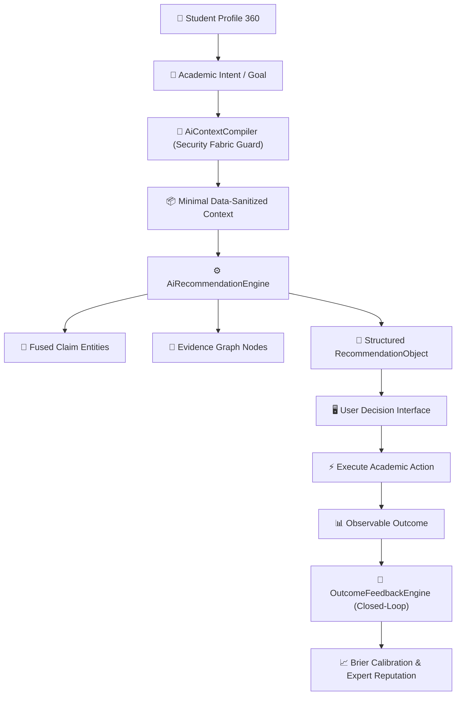

# 🤖 Grounded AI Recommendation Engine & Context Compiler V1

> **Document Version**: `1.0.0` | **Status**: `PRODUCTION-READY LOCKED`  
> **Core Principle**: *AI reasons over evidence graphs; AI does not manufacture authority or hallucinate prerequisites.*

---

## 1. Grounded Recommendation Pipeline

---

## 2. Recommendation Object Specification

Each recommendation produced contains:
- `recommendationId`: Canonical identifier.
- `action`: Specific suggested pathway (e.g. "Ưu tiên đăng ký môn Giải tích 1 trong HK1").
- `rationale`: Explainable "Why this?" rationale.
- `supportingClaimIds`: Traceable claim IDs.
- `supportingEvidenceIds`: Attached official evidence IDs.
- `confidenceBand`: `HIGH_CONFIDENCE`, `MODERATE_CONFIDENCE`, `LOW_CONFIDENCE`, `INSUFFICIENT_EVIDENCE`.
- `risk`: `LOW`, `MEDIUM`, `HIGH`.
- `uncertaintyExplanation`: Assumptions and cohort boundary conditions.
- `alternatives`: Viable fallback options (e.g. summer term, credit equivalencies).
- `expiresAt`: 30-day default expiration.

---

## 3. AI Context Compiler Security Boundaries

The `AiContextCompiler` enforces:
1. Strict purpose validation (`COMPILE_AI_CONTEXT`).
2. Automatic stripping of `passwordHash`, `otpSecret`, `internalRiskSignals`, and `administrativeNotes`.
3. Minimization of student courses and claim assertions before model ingestion.
