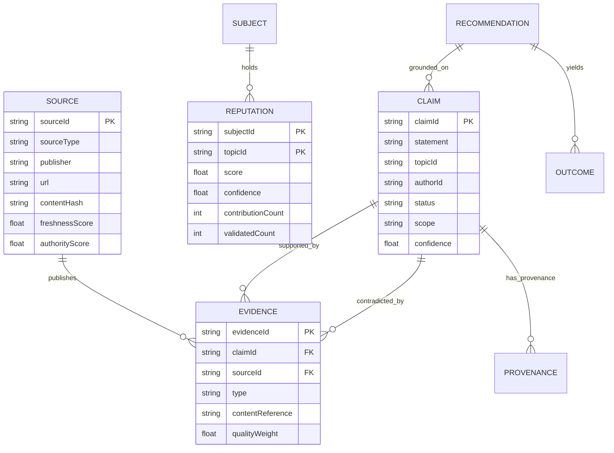

# 🧱 Intelligence Fabric Data Model & Entity Specifications V1

> **Document Version**: `1.0.0` | **Status**: `PRODUCTION-READY LOCKED`

---

## 1. Entity Relationship Graph

```mermaid
erDiagram
    SOURCE ||--o{ EVIDENCE : publishes
    CLAIM ||--o{ EVIDENCE : supported_by
    CLAIM ||--o{ EVIDENCE : contradicted_by
    CLAIM ||--o{ PROVENANCE : has_provenance
    SUBJECT ||--o{ REPUTATION : holds
    RECOMMENDATION ||--o{ CLAIM : grounded_on
    RECOMMENDATION ||--o{ OUTCOME : yields

    SOURCE {
        string sourceId PK
        string sourceType
        string publisher
        string url
        string contentHash
        float freshnessScore
        float authorityScore
    }

    CLAIM {
        string claimId PK
        string statement
        string topicId
        string authorId
        string status
        string scope
        float confidence
    }

    EVIDENCE {
        string evidenceId PK
        string claimId FK
        string sourceId FK
        string type
        string contentReference
        float qualityWeight
    }

    REPUTATION {
        string subjectId PK
        string topicId PK
        float score
        float confidence
        int contributionCount
        int validatedCount
    }
```
