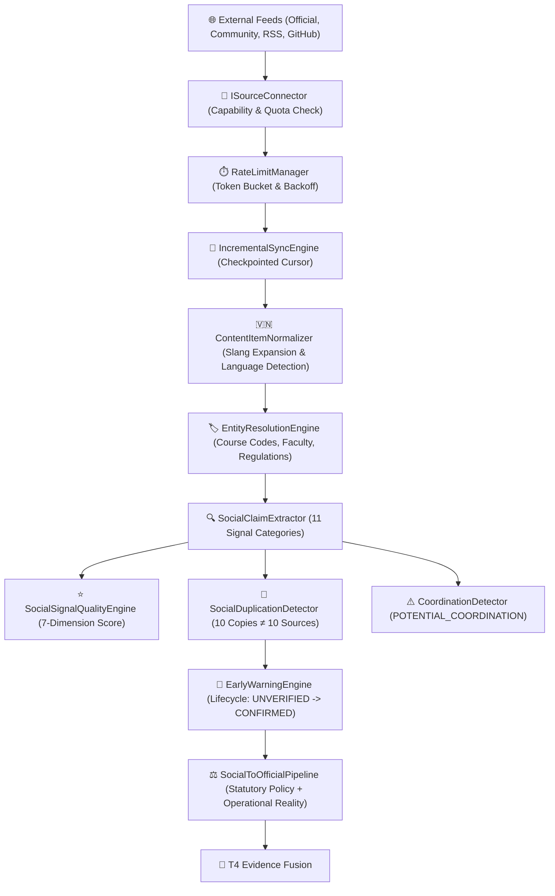

# 📡 Social Intelligence Fabric & Early Warning Architecture V1

> **Document Version**: `1.0.0` | **Status**: `PRODUCTION-READY LOCKED`  
> **Core Principle**: *Social Content is a SIGNAL, NEVER a FACT. Social data must be legitimately ingested, deduplicated, and evaluated by T4 Evidence Fusion.*

---

## 1. End-to-End Ingestion & Processing Pipeline

---

## 2. 11-Category Signal Taxonomy & Evidential Weights

| Signal Category | Description | Base Evidential Weight |
|---|---|---|
| `OFFICIAL_STATEMENT` | Promulgated university decision, rector circular | **0.95** |
| `ANNOUNCEMENT` | Departmental or faculty formal notice | **0.90** |
| `CORRECTION` | Explicit factual correction with counter-evidence | **0.70** |
| `OBSERVATION` | Direct verified observation | **0.65** |
| `WARNING` | System outage, incident report, schedule clash | **0.60** |
| `EXPERIENCE` | Course review, instructor feedback | **0.50** |
| `CLAIM` | Unverified proposition | **0.40** |
| `RECOMMENDATION` | Peer study advice or tip | **0.35** |
| `OPINION` | Subjective impression | **0.20** |
| `QUESTION` | Inquiry or help request | **0.15** |
| `RUMOR` | Unsubstantiated hearsay | **0.10** |

---

## 3. Social Duplication & Anti-Coordination Formulas

1. **Duplication Dampening**:
   $$\text{EffectiveIndependenceWeight} = \frac{1.0}{\sqrt{\text{ClusterSize}}}$$
2. **Coordination Heuristic**:
   If $\ge 3$ distinct accounts post near-identical statements within $\Delta t < 5\text{ minutes}$, flag as `POTENTIAL_COORDINATION` with confidence:
   $$C = \min(0.95, 0.50 + 0.10 \times N_{\text{authors}})$$
