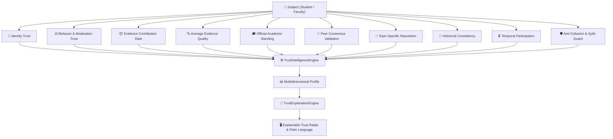

# 🛡️ T1 — Multidimensional Trust Intelligence Engine V2

> **Document Version**: `2.0.0` | **Status**: `PRODUCTION-READY LOCKED`  
> **Core Principle**: *Trust is multidimensional, dynamic, and explainable — not a collapsed single magic number.*

---

## 1. Executive Summary & Architecture

The T1 Trust Intelligence Engine transforms user trust from simple upvote counters into an explainable 10-dimensional epistemic profile:



---

## 2. The 10 Distinct Trust Dimensions

| Dimension | Metric Source | Range | Description |
|---|---|---|---|
| **Identity Trust** | StudentIdentityStore / Email verification | 0.0 - 1.0 | Higher for verified institutional emails (`@student.hcmute.edu.vn`). |
| **Behavior Trust** | Moderation logs / flag counts | 0.0 - 1.0 | Penalized by community standard violations and spam flags. |
| **Contribution Trust** | Claim submissions | 0.0 - 1.0 | Ratio of evidence-backed contributions to unevidenced posts. |
| **Evidence Trust** | Evidence quality weight | 0.0 - 1.0 | Average quality, directness, and authority of attached evidence. |
| **Academic Trust** | Authoritative Academic Records | 0.0 - 1.0 | Verified GPA, academic standing, and active enrollment. |
| **Community Trust** | Peer validations | 0.0 - 1.0 | Proportion of contributions confirmed by independent peers. |
| **Expertise Trust** | TopicReputation in ReputationGraph | 0.0 - 1.0 | Domain-bounded score (e.g. 0.87 in Computer Vision, 0.42 in Law). |
| **Consistency Trust** | Retraction history | 0.0 - 1.0 | Penalized when historical claims are subsequently retracted. |
| **Temporal Trust** | Activity recency | 0.0 - 1.0 | Decays gradually if inactive over multiple semesters. |
| **Integrity Signals** | Interaction Graph | 0.0 - 1.0 | Collusion detection against reciprocal mutual-voting loops. |

---

## 3. Explainability Rationale

Every trust query returns a structured rationale produced by `TrustExplanationEngine`:
```text
Chủ thể 'student:24110001' đạt mức độ tin cậy 'VERY_HIGH' (88.5/100).
Điểm mạnh then chốt:
• Xác thực danh tính chính quy qua email trường đại học (@student.hcmute.edu.vn).
• 12 đóng góp kèm minh chứng xác thực (tỷ lệ đính kèm minh chứng cao).
• 4 lần được chuyên gia và hội đồng kiểm chứng độ chính xác.
• Không có lịch sử vi phạm tiêu chuẩn cộng đồng hoặc hành vi thao túng.
```
