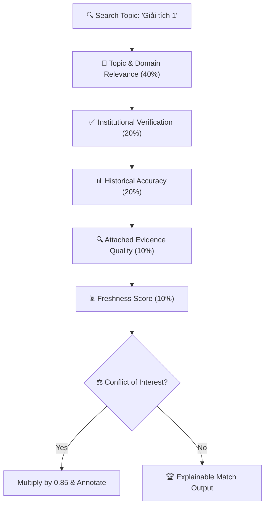

# 🎓 T2 — Expert Intelligence & Scope Boundaries V2

> **Document Version**: `2.0.0` | **Status**: `PRODUCTION-READY LOCKED`  
> **Core Invariants**:  
> 1. `EXPERTISE ≠ AUTHORITY` (Expert opinion does not equal statutory rector power).  
> 2. `EXPERTISE ≠ RELIABILITY` (Disciplinary knowledge is tracked separately from factual accuracy).  
> 3. `POPULARITY ≠ CREDIBILITY` (Followers/likes do not create academic authority).

---

## 1. Multi-Signal Expert Discovery & Ranking

Expert ranking is computed across 5 weighted signals by `ExpertDiscoveryEngine`:

$$\text{Composite Score} = \left( 0.40 \cdot S_{\text{domain}} + 0.20 \cdot S_{\text{verif}} + 0.20 \cdot S_{\text{hist}} + 0.10 \cdot S_{\text{evi}} + 0.10 \cdot S_{\text{fresh}} \right) \cdot F_{\text{conflict}}$$



---

## 2. Verification States Lifecycle

```text
UNVERIFIED_EXPERT (Self-claimed, missing official records)
       ↓
PARTIALLY_VERIFIED (Identity confirmed, peripheral credentials pending)
       ↓
VERIFIED_EXPERT (Confirmed by institutional registry / MOET / ORCID)
       ↓
EXPIRED / STALE (No active publications or roles verified in last 3+ years)
       ↓
REVOKED / DISPUTED (Credentials withdrawn by academic integrity board)
```

---

## 3. Historical Accuracy Tracking

The `ExpertReliabilityTracker` records every expert claim, peer validations, and retractions:
- **Confirmed Claim**: Verified by independent peers without contradiction.
- **Disputed Claim**: Contradicted by newer promulgated university statute.
- **Retracted Claim**: Formally corrected or withdrawn.
- **Historical Accuracy**: Dynamically calculated percentage separating domain scope from factual dependability.
