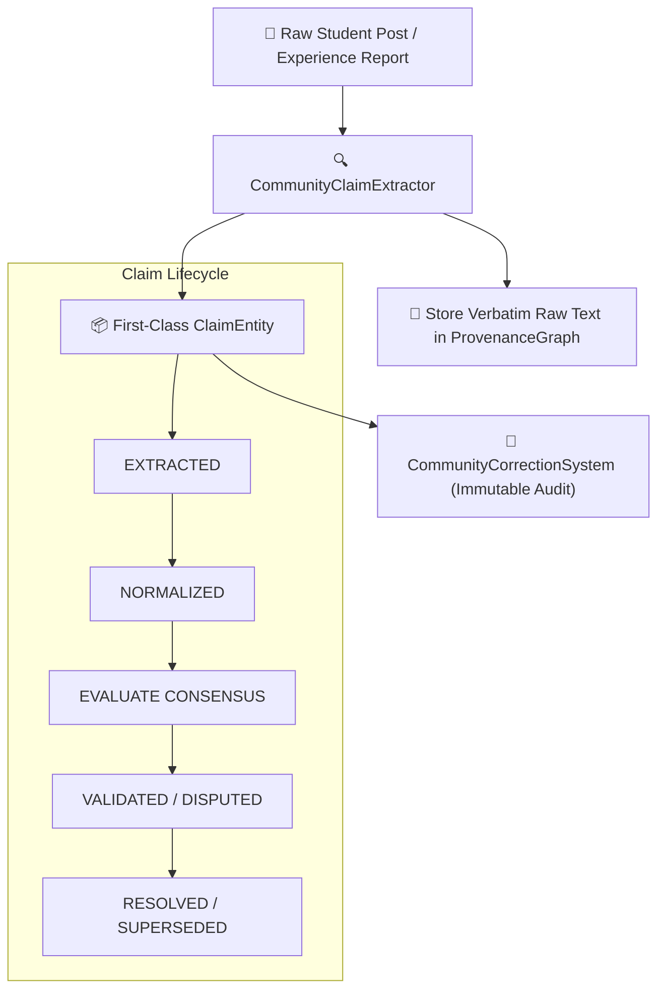

# 👥 T3 — Community Intelligence & Claim Governance V2

> **Document Version**: `2.0.0` | **Status**: `PRODUCTION-READY LOCKED`  
> **Core Invariants**:  
> 1. `LIKES ≠ EVIDENCE` (200 upvotes does not make a factual claim true).  
> 2. `COMMUNITY CONSENSUS ≠ FACT` (Empirical student reality provides operational nuance, not statutory policy).  
> 3. `NEVER SUPPRESS MINORITY SIGNALS` (Cohort-specific variances must be preserved).

---

## 1. First-Class Claim Extraction & Lifecycle

---

## 2. Evidence-Aware Consensus & Minority Opinion Preservation

The `CommunityConsensusEngine` groups observations by independent student IDs (preventing astroturfing) and computes evidence-weighted consensus:

$$\text{Weight} = \text{Reliability} \times (\text{Evidence Attached ? } 1.5 : 1.0)$$

### Minority Signal Preservation
When a cohort (e.g. `K22 CLC`) reports a different operational reality, the engine does NOT average it out. It explicitly surfaces:
- **Majority View**: `88%` confirm the general rule.
- **Minority View**: `12%` (`K22 CLC`) report an exemption under special dean guarantee.

---

## 3. Immutable Correction Workflows

`CommunityCorrectionSystem` maintains a permanent log of all corrections (`COMMUNITY`, `EXPERT`, `OFFICIAL`, `AUTHOR`, `SYSTEM`):
- Never overwrites or deletes historical assertions.
- Links correction to the new evidence source and reviewer identity.
