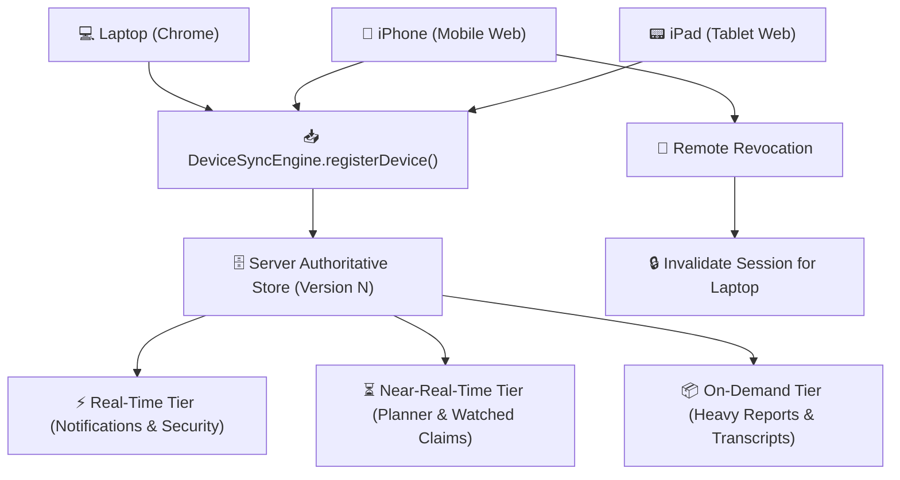

# 🔄 Cross-Device Continuity & Session Management V1

> **Document Version**: `1.0.0` | **Status**: `PRODUCTION-READY LOCKED`  
> **Core Principle**: *One Identity across Many Devices with Server-Authoritative Conflict Resolution.*

---

## 1. Multi-Device Registration & Lifecycle

---

## 2. Server-Authoritative Conflict Resolution

When a device commits a mutation with an outdated `clientVersion < serverVersion`:
- **User Preferences**: Non-destructive field-level merge (`CONFLICT_RESOLVED_MERGED`).
- **Official Records**: Server always wins (`SERVER_AUTHORITATIVE`).
- **Planner Items**: Version incremented with provenance tag (`_lastUpdatedByDevice`).
