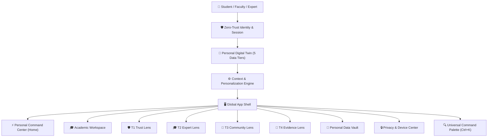

# ⚡ StudentHub AI — Product Reconstruction & Personal Academic OS V1

> **Document Version**: `1.0.0` | **Status**: `PRODUCTION-READY LOCKED`  
> **Core Principle**: *StudentHub is not a disconnected collection of cards — it is a personal, evidence-aware academic operating system.*

---

## 1. Unified Information Architecture

---

## 2. Migration Matrix

| Existing Feature | Decision | Target Location | Target Component | Backing Engine |
|---|---|---|---|---|
| `/` (Landing Page) | **IMPROVE** | `/` (Adaptive Landing / Command Center) | `PersonalCommandCenter.jsx` / `HomePage` | `PersonalizationEngine`, `PersonalDigitalTwin` |
| `/dashboard` | **MERGE** | `/` (Personal Command Center) | `PersonalCommandCenter.jsx` | `StudentProfile360Service`, `AiRecommendationEngine` |
| `/academic` | **REBUILD** | `/academic` (Academic Workspace) | `AcademicCommandCenter.jsx` | `StudentAcademicRecordsStore`, `AcademicEligibilityEngine` |
| `/intelligence/trust` | **REBUILD** | `/intelligence/trust` (T1 Trust Lens) | `TrustLensView.jsx` | `TrustIntelligenceEngine`, `ReputationGraph` |
| `/intelligence/experts`| **REBUILD** | `/intelligence/experts` (T2 Expert Lens) | `ExpertLensView.jsx` | `ExpertDiscoveryEngine`, `ExpertReliabilityTracker` |
| `/intelligence/community`| **REBUILD**| `/intelligence/community` (T3 Community Lens)| `CommunityLensView.jsx` | `CommunityConsensusEngine`, `CommunityCorrectionSystem` |
| `/intelligence/evidence` | **REBUILD**| `/intelligence/evidence` (T4 Evidence Lens) | `EvidenceLensView.jsx` | `ContradictionEngine`, `ConflictResolutionEngine` |
| `/settings/privacy` | **NEW** | `/settings/privacy` (Privacy & Devices) | `PrivacyAccessCenter.jsx` | `DeviceSyncEngine`, `SessionManager` |
| Static Mock Counters | **DELETE** | Purged across UI | Real API Skeletons | Server-Side Data Loaders |
