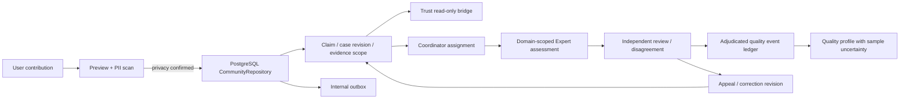

# StudentHub AI — Community × Expert Promax implementation report

**Ngày:** 09/09/2026  
**Phạm vi:** triển khai local trong worktree hiện tại; không commit, push, merge, deploy hoặc thay đổi secrets.  
**Trạng thái:** `STUDENTHUB_COMMUNITY_EXPERT_PROMAX_LOCAL_PARTIAL`

Tài liệu này ghi lại phần đã triển khai từ brief Promax và các bằng chứng có thể kiểm tra tại máy. Ảnh diễn đàn được dùng như đầu vào để phản biện sản phẩm; các quy tắc biến like/sao/điểm thành thẩm quyền đã không được đưa vào authority path. Không có cơ sở để tuyên bố sản phẩm production-ready, đạt WCAG, có dataset 360 ca đã khóa hoặc thắng cuộc thi.

## Baseline và điều kiện chạy

Baseline đã ghi trước khi sửa:

| Hạng mục | Giá trị |
| --- | --- |
| Branch | `design/academic-cinematic-product-evolution` |
| HEAD | `4b8f9fd12667bd727ebd59578902720c2e560c6` |
| Worktree | Đã dirty từ công việc của owner; giữ nguyên thay đổi ngoài phạm vi Promax |
| Node / npm | Node `24.16.0`, npm `11.13.0` |
| Baseline route/API inventory | 47 UI routes, 124 API handlers theo baseline đã ghi |
| Baseline migrations | 14 theo inventory phiên lập kế hoạch |
| Baseline environment | Không có PostgreSQL, Supabase service credentials hoặc Labbe staging credentials |

Các biến sau đều vắng trong phiên chạy cuối: `DATABASE_URL`, `STUDENTHUB_RLS_TEST_DATABASE_URL`, `SUPABASE_URL`, `SUPABASE_SERVICE_ROLE_KEY`, `NEXT_PUBLIC_SUPABASE_URL`, `NEXT_PUBLIC_SUPABASE_ANON_KEY`, `STUDENTHUB_LABBE_TEST_DATABASE_URL`. Vì vậy migration chỉ được kiểm tra tĩnh; không có claim read-after-commit, RLS cross-tenant hoặc staging flow đã chạy thật.

## Luồng dữ liệu sau nâng cấp

Community và Expert Promax đi qua PostgreSQL repositories khi live mode. JSON/in-memory stores còn lại chỉ được chọn ở các adapter demo/non-production có cờ rõ; chúng không được dùng làm Trust authority.

## Thay đổi kiến trúc và domain contract

`frontend/src/lib/communityExpert/promaxDomain.js` là contract storage-agnostic dùng chung cho repository và test. Contract tách độc lập:

- publication: `DRAFT`, `PRIVACY_SCAN_PENDING`, `PREVIEW_READY`, `PUBLISHED`, `EDITED`, `WITHDRAWN`, `MODERATED`, `BLOCKED`;
- evidence: `UNKNOWN`, `INSUFFICIENT`, `SUPPORTING`, `CONTRADICTORY`, `MIXED`, `STALE`, `SUPERSEDED`;
- review: `UNASSIGNED`, `ASSIGNED`, `IN_REVIEW`, `CONFLICT`, `NEEDS_THIRD_REVIEW`, `RESOLVED`, `APPEALED`, `SUPERSEDED`;
- qualification: `APPLICANT`, `IDENTITY_CHECKED`, `QUIZ_PASSED`, `PRACTICE_REVIEW`, `TRAINEE`, `DOMAIN_VERIFIED`, `SUSPENDED`, `EXPIRED`, `REVOKED`;
- contribution/reaction/role/disagreement được biểu diễn bằng enum riêng và state transition riêng.

Mọi đóng góp vật chất yêu cầu `caseId`, `caseRevision` và `claimId`; `CONTEXT`/`CRITIQUE` có thể là thảo luận không gắn claim. Assessment yêu cầu `assignmentId`, domain đã xác minh, case revision, claim, evidence revision IDs, COI declaration, reasoning, uncertainty, missing evidence và policy version.

`goldenCaseFixture.js` giữ một ca học bổng mô phỏng với hai claim độc lập: chương trình tồn tại và yêu cầu chuyển tiền có hợp pháp hay không. Fixture chỉ là dữ liệu demo/test, không phải nguồn thực.

## Migration và durable authority

Migration mới: `database/migrations/202609090001_community_expert_promax.sql`.

Migration bổ sung hoặc mở rộng:

- public Community source clusters, contributions, immutable contribution revisions, typed reactions, appeals và corrections;
- private file object metadata, reaction events, expert assignments, practice submissions/decisions, appeal reviews, review decisions và quality events;
- các cột revision/claim/evidence/assignment/COI/idempotency/digest/policy cho `public.expert_assessments`;
- qualification state, expiry/suspension và practice decisions trên nền qualification hiện hữu;
- internal outbox cho Community/Expert, RLS policies, grants/revokes và trigger chặn update/delete trên history.

Các write path mới dùng transaction, advisory lock theo aggregate/idempotency key, request digest và outbox insert trước commit. Retry cùng payload trả kết quả cũ; payload khác với cùng key trả conflict. Expected revision chặn stale edit/reaction. History assessment, reaction event, practice decision, appeal review, quality event và contribution revision là append-only; projection hiện hành có thể cập nhật theo workflow.

RLS contract đã kiểm tra `expert_assessments` được enable, revoke khỏi public/anon/authenticated và chỉ service role được cấp quyền. Kiểm tra live database chưa chạy vì thiếu `DATABASE_URL`.

## API và authority boundary

Đường live chính:

| Bề mặt | Endpoint/adapter | Quyết định authority |
| --- | --- | --- |
| Community post | `/api/intelligence/community/posts` | Preview trước; publish qua `CommunityRepository`; Trust chỉ đọc signal |
| Contribution revision | `/api/intelligence/community/contributions/[contributionId]` | Owner + expected revision + preview digest |
| File preview | `/api/intelligence/community/contributions/preview` | Binary validation và privacy result; không trả object gốc |
| Reaction | `/api/forum/vote` durable branch | `HELPFUL`, `ADD_EVIDENCE`, `CHALLENGE`, `INSUFFICIENT_INFORMATION`, `REPORT_ABUSE`; `trustMutation:false` |
| Trust bridge | `/api/v1/trust/cases/[caseId]/community-signals` | `NON_AUTHORITATIVE`, `trustVerdictMutation:false` |
| Expert qualification | `/api/expert/qualification/*` | Server-owned profile, quiz, practice và human activation |
| Assignment | `/api/expert/assignments` | Coordinator độc lập, domain/case revision/expiry/COI |
| Assessment | `/api/expert/assessments` | Verified domain + assignment + COI + exact revision |
| Independent review | `/api/expert/reviews` | Assignment thứ hai; conflict/third-review, `majorityApplied:false` |
| Quality | `/api/expert/quality` | Chỉ adjudicated event; không cộng điểm lúc submit assessment |
| Appeal | `/api/expert/appeals/review` | Admin độc lập, challenged expert/requester không tự xử |

Các route tương thích cũ vẫn tồn tại để không phá surface hiện hữu. Những route đó trả `sourceState`/`provenance` và chỉ chọn memory/JSON khi cờ demo/non-production được bật. Chúng chưa được xem là đường authority mới.

## Privacy và file safety

`detectPII` và `redactText` xử lý email, phone, student ID, identity document, bank account, QR data, địa chỉ chi tiết, image-visible identifier và location metadata. Text/OCR/QR/metadata được quét trước khi publish; practice/assessment/review reasoning cũng được sanitize hoặc redact trước lưu.

File preview kiểm tra declared MIME, magic bytes, extension, kích thước tối đa 8 MB, dimensions ảnh tối đa 12.000 px và metadata/OCR/QR flags. Khi chưa có worker OCR/redaction/object storage thực tế, response an toàn là `PRIVACY_SCAN_PENDING` hoặc `BLOCKED` với `originalStored:false`, `publicDerivative:null`; binary không được trả về, ghi log, đưa vào search hoặc public preview. Schema private file objects đã sẵn sàng cho bước storage worker sau này, nhưng golden upload → derivative → publish chưa được chứng minh.

Do đó verdict privacy là `PII_PROTECTION_PARTIAL`: có guard và safe failure contract, chưa có đo precision/recall trên ≥1.000 mẫu, chưa có derivative worker và chưa có live object isolation.

## Community

`CommunityRepository` giữ các method legacy nhưng thêm đường Promax cho preview, create, edit, list, detail, reactions, appeals và corrections. Contribution lưu public redacted statement, case/revision/claim, evidence revision IDs, source refs, source cluster, state và digest. List ranking version `community-ranking-v1` trả explanation thay vì chỉ điểm.

Ranking hypothesis được version hóa:

`0.45 relevance + 0.30 evidenceQuality + 0.10 temporalValidity + 0.10 independentHelpfulness + 0.05 authorDomainReliability`.

Evidence quality dựa trên quan hệ với claim, provenance, source type, freshness, independence và context. Không dùng số link, like, star hay global expert boost. Canonical URL, original source, syndication chain và content digest được gom cluster; cùng digest không được tính là nguồn độc lập. Strong fresh primary evidence có thể vượt contributor nổi tiếng trong contract test.

Một user chỉ có projection reaction hiện hành cho mỗi contribution/claim/revision/kind; event history giữ thay đổi. Reactions không chuyển evidence state hay Trust verdict. Minority contradictory evidence được lưu và đọc như signal.

## Expert qualification, assignment và assessment

`ExpertQualificationService` tái sử dụng profile/identity/quiz/human activation hiện có và bổ sung:

1. practice prompt/rubric có version;
2. practice response private, evidence refs bắt buộc, PII scan, idempotency và outbox;
3. admin practice decision `PASS`, `FAIL`, `REQUEST_REVISION`, không tự duyệt;
4. `ACTIVATE` chỉ thành công khi quiz đạt và mọi approved domain có practice pass;
5. status UI cho phép người dùng nộp practice theo domain và xem lịch sử trạng thái mà không lộ `reviewedBy`.

`ExpertRepository` kiểm tra verified domain còn hạn/không suspended, coordinator không tự assign, assignment khớp case revision/claim/domain và idempotency. Assessment submit khóa verification row, kiểm tra assignment/expiry/COI, ghi `NONE_ON_SUBMISSION` cho quality và append outbox. Reviewer phải có assignment riêng cùng case revision/domain, không phải subject, không có COI và không bị revoke.

Disagreement giữ reasoning/evidence của từng assessment, trạng thái `CONFLICT` hoặc `NEEDS_THIRD_REVIEW`, và không áp dụng majority. Appeal tạo quy trình và review history mới; requester/challenged expert bị chặn khỏi review. Quality events có actor độc lập, incident cluster, evidence refs, policy version, reversal target và idempotency; Bayesian score hiển thị `INSUFFICIENT_DATA` trước ngưỡng 20 independent units. Correlated incident cluster bị cap còn một weighted unit.

Reviewer queue và appeal history hiện có API/server contract; chưa có màn admin queue hoàn chỉnh trong UI. Đây là phần còn lại của P14.

## Trust, realtime và outbox

Trust giữ canonical claim/evidence/verification/uncertainty. Bridge chỉ thêm community signal và expert assessment metadata; không ghi đè verdict. Labbe vẫn là observer/assurance, không có code path để cấp quyền expert, moderate community hoặc đổi Trust truth.

Mỗi durable write mới ghi internal outbox cùng transaction. Realtime publish sau commit chỉ là notification; readback PostgreSQL mới là authority. Labbe contract 19/19 local pass, nhưng Labbe staging không chạy vì thiếu biến môi trường.

## UI và trải nghiệm

`CommunityIntelligenceView` có claim-level composer, contribution type, case/revision/claim scope, evidence refs, explicit non-authoritative label, source grouping và detail scope. `ExpertIntelligenceView` hiển thị domain-scoped directory, boundary copy, assessment surface và qualification panel. `ExpertQualificationPanel` hiện có profile → quiz → practice private form → practice history; reviewer activation vẫn server-only.

Responsive CSS và semantic labels được giữ theo shell hiện hữu. Chưa có manual keyboard/screen-reader/mobile audit đầy đủ, chưa thể gọi là WCAG 2.2 AA.

## Evaluation artifacts

Đã thêm:

- `frontend/tests/community_expert/fixtures/promax_starter_cases.json`: ba synthetic controlled cases (scholarship, internship, housing QR), claim/evidence UUID và expected signals;
- `docs/evaluation/COMMUNITY-EXPERT-PROMAX-EVALUATION-SPEC-2026-09-09.md`: protocol 360-case đề xuất, split 180/60/120, two independent annotators + third reviewer, A/B/C baseline và ablation, NDCG/PII/manipulation/reputation/user-value/performance metrics.

Trạng thái dataset là `DATASET_NOT_YET_LOCKED`. Không có accuracy, PII recall/precision, NDCG, user-value uplift, anti-collusion effectiveness hoặc expert reliability measurement nào được tuyên bố.

## Validation evidence

| Gate | Kết quả cuối | Evidence |
| --- | --- | --- |
| Promax/domain/route/migration/expert/security targeted contracts | **26/26 pass** | `artifacts/community-expert-promax-*` logs; `node --test ...` |
| Foundation backend/UI/architecture | **18/18, 4/4, 2/2 pass** | foundation logs trong `artifacts/` |
| `npm run lint` | **exit 0**, 0 errors, 442 warnings | `artifacts/community-expert-promax-lint-final3.log` |
| `npm run build` | **exit 0**; Next route manifest generated | `artifacts/community-expert-promax-build-final3.log` |
| API authorization inventory | **exit 0**, 169 handlers | `docs/security/API-Authorization-Inventory.md` |
| Bundle budget | **PASS**; `/` 129089 B, `/trust` 133510 B, `/community` 115440 B, `/expert` 115434 B, `/cases` 256410 B; budget 500000 B | `artifacts/community-expert-promax-bundle-final2.log` |
| Final hardening audit | **7/7 pass** | `artifacts/community-expert-promax-final-audit-final2.log` |
| Phase 3 migration/RLS contract | **5/5 pass** | `artifacts/community-expert-promax-phase3-contract-final2.log` |
| Labbe bridge/vectors/assurance contracts | **19/19 pass** | `artifacts/community-expert-promax-labbe-contract-final2.log` |
| Full discovered suite | **blocked** at `beta_user_database_proof`; four tests raise `DatabaseUnavailableError: DATABASE_URL is required` | `artifacts/community-expert-promax-all-tests-final-final.log` |
| Non-DB discovered suite | **6 files blocked** by live database/503 dependency; no new Promax logic failure observed | `artifacts/community-expert-promax-non-db-tests-final-final.log` |
| RLS live gate | **BLOCKED_BY_ENV**: `STUDENTHUB_RLS_TEST_DATABASE_URL` missing | `artifacts/community-expert-promax-phase3-live-final-rerun.log` |
| Labbe staging | **STAGING_BLOCKED_BY_ENV**: `STUDENTHUB_LABBE_BASE_URL`, `STUDENTHUB_LABBE_TOKEN`, `STUDENTHUB_LABBE_SCOPE`, `STUDENTHUB_LABBE_TEST_DATABASE_URL` missing; mode must be `STAGING` | `artifacts/community-expert-promax-labbe-staging-final-rerun.log` |

The scoped `git diff --check` passed. No deployment or remote write was attempted.

## Key files delivered

- `frontend/src/lib/communityExpert/promaxDomain.js`
- `frontend/src/lib/communityExpert/goldenCaseFixture.js`
- `frontend/src/lib/server/database/CommunityRepository.js`
- `frontend/src/lib/server/database/ExpertRepository.js`
- `frontend/src/lib/server/database/CommunityExpertScope.js`
- `frontend/src/lib/server/expert/ExpertQualificationService.js`
- `database/migrations/202609090001_community_expert_promax.sql`
- Promax Community/Expert/Trust routes under `frontend/src/app/api/`
- `frontend/src/components/community/CommunityIntelligenceView.jsx`
- `frontend/src/components/expert/ExpertIntelligenceView.jsx`
- `frontend/src/components/expert/ExpertQualificationPanel.jsx`
- `frontend/tests/community_expert/` and `frontend/tests/db/community_expert_promax_migration_contract.test.mjs`
- `docs/evaluation/COMMUNITY-EXPERT-PROMAX-EVALUATION-SPEC-2026-09-09.md`

## Release interpretation

The local contract, static security, build and UI integration work is usable as a reviewable implementation slice. The release cannot be promoted to production or presented as a fully proven competition-winning system until PostgreSQL/RLS readback, object storage/OCR derivative, reviewer/staging workflow, locked evaluation data, manual accessibility review and performance measurements are collected. Those gates are recorded in the principal audit below.
