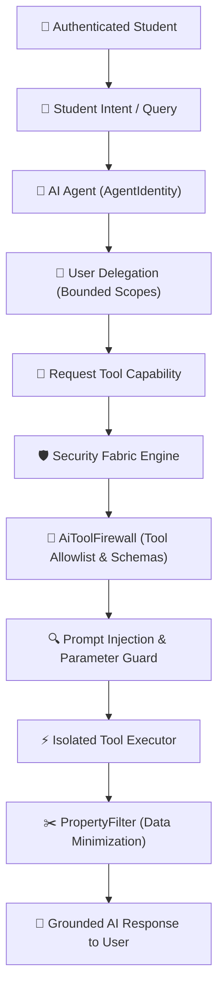

# 🤖 StudentHub AI — AI Security & Tool Firewall Model V1

> **Document Version**: `1.0.0` | **Status**: `PRODUCTION-READY LOCKED`  
> **Core Principle**: *AI can reason over authority. AI cannot create authority.*

---

## 1. AI Security Architecture & Delegation Chain

In StudentHub AI, AI models (LLMs, Copilot, Planner, Verifier) are never granted raw database, filesystem, or shell execution privileges.

---

## 2. AI Agent Identities & Allowed Tools

| Agent Name | Agent Type | Allowed Scopes | Allowlisted Tools | Prohibited Operations |
|---|---|---|---|---|
| **Academic Planner** | `ACADEMIC_PLANNER` | `academic:read`, `academic:plan` | `Academic.ReadTranscript`, `Academic.ReadSchedule`, `Academic.PlanSemester`, `Academic.SimulateWhatIf` | Direct record editing, transcript modification, cross-student queries |
| **Trust Verifier** | `TRUST_VERIFIER` | `trust:read`, `trust:evaluate` | `Trust.ReadGraph`, `Trust.EvaluateClaim`, `Trust.SearchOfficialSource` | Modifying official policy, granting verification tier |
| **Copilot Advisor** | `COPILOT_ADVISOR` | `academic:read`, `trust:read`, `community:read` | `Copilot.QueryEvidence`, `Community.ReadPosts` | Direct database writes, security changes |
| **Community Moderator**| `COMMUNITY_MODERATOR` | `community:read` | `Community.ReadPosts` | Auto-banning users without human confirmation |

---

## 3. Tool Allowlist & Schema Enforcement

Every AI tool execution is validated through `AiToolFirewall`:
1. **Tool Allowlist**: Only tools in `AI_TOOL_REGISTRY` can be called. Unknown tools throw `403 AI_TOOL_DENIED`.
2. **Parameter Inspection**: `AdversarialTrustGuard` inspects arguments for injection signatures (`ignore previous instructions`, `bypass_verification`, `<system>`).
3. **Cross-Tenant Guard**: Tools targeting `studentId` other than the delegating student are strictly blocked.
4. **Data Minimization Projection**: Raw database objects pass through `PropertyFilter` which removes password hashes, OTP secrets, administrative notes, and internal risk indicators before returning to the model context.
