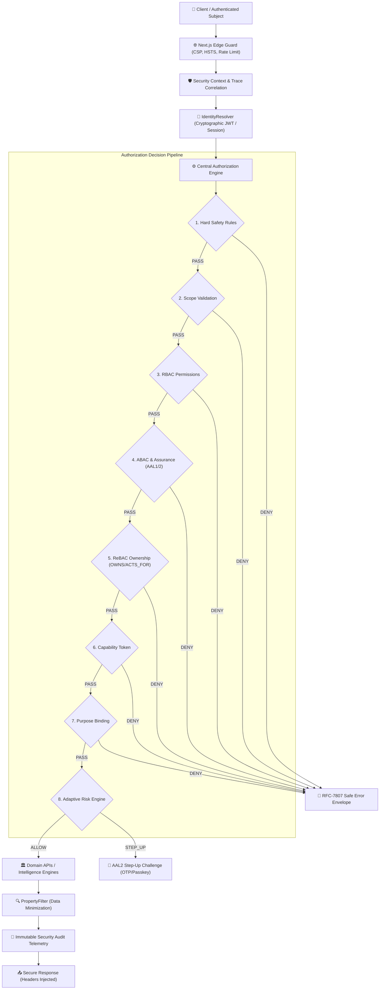

# 🛡️ StudentHub AI — Zero-Trust Security Fabric Architecture (Promax V1)

> **Document Version**: `1.0.0` | **Status**: `PRODUCTION-READY LOCKED`  
> **Security Governance**: Zero-Trust Identity, Authorization, Capability, Purpose, Risk & AI Tool Firewall

---

## 1. Executive Security Architecture

The StudentHub AI Zero-Trust Security Fabric transforms the backend security model from a naive `VALID TOKEN -> ALLOW` approach into an end-to-end multi-dimensional decision pipeline:



---

## 2. Core Security Invariants

| # | Invariant | Enforcement Mechanism | Failure Mode |
|---|---|---|---|
| **INV-1** | **Identity from Server Only** | Derived exclusively from cryptographically verified JWT / Session cookies. Client-provided `studentId` is never trusted. | `401 Unauthorized` |
| **INV-2** | **Object-Level Ownership (BOLA Defense)** | `ObjectAuthorizer` and `ReBACPolicy` evaluate ownership on every resource access. | `403 FORBIDDEN (OBJECT_NOT_OWNED)` |
| **INV-3** | **Hard Safety Immutability** | Students and AI agents can never modify official academic records or security policies. | `403 HARD_SAFETY_VIOLATION` |
| **INV-4** | **AI Never Becomes Authority** | AI agents receive dedicated identities and can only invoke allowlisted tools with user delegation and capability tokens. | `403 AI_TOOL_DENIED` |
| **INV-5** | **Data Minimization** | `PropertyFilter` strips administrative notes, internal risk signals, and security secrets before returning data. | Sanitized projection |
| **INV-6** | **Fail-Closed Default** | Any missing parameter, unknown tool, expired capability, or policy ambiguity defaults to `DENY`. | `403 FORBIDDEN` |

---

## 3. Layered Components Reference

### 3.1 Core
- `SecurityPrincipal`: Immutable evaluated principal containing `subjectId`, `roles`, `permissions`, `scopes`, `assuranceLevel`, and `agentIdentity`.
- `SecurityContext`: Request-scoped tracking holding `correlationId`, `clientIp`, `userAgent`, and `purpose`.
- `SecurityErrorEnvelope`: RFC-7807 compliant error format preventing internal stack/SQL disclosure.

### 3.2 Identity & Sessions
- `TokenValidator`: Strict JWT verification (`iss`, `aud`, `sub`, `exp`, `nbf`, HMAC/RSA signatures) with algorithm whitelist (`HS256`, `RS256`, `ES256`).
- `SessionManager`: Server-tracked sessions supporting absolute timeout (24h), idle timeout (30m), single revocation, and global logout.
- `IdentityResolver`: Resolves principal from authorization headers or cookies.

### 3.3 Authorization
- `AuthorizationEngine`: Central master evaluator enforcing the 11-step evaluation order.
- `RBACPolicy`: Role-to-permission mappings.
- `ABACPolicy`: Dynamic attribute and assurance gating.
- `ReBACPolicy`: Relational assertions (`student OWNS transcript`, `agent ACTS_FOR student`).
- `ObjectAuthorizer`: BOLA defense for resource endpoints.
- `FunctionAuthorizer`: BFLA defense for operation permissions.
- `PropertyFilter`: Property-level authorization & role projections.

### 3.4 Capabilities & Purpose
- `CapabilityManager`: Cryptographic, single-use, time-bound capability token issuance and consumption with replay attack detection.
- `PurposeValidator`: Strict business purpose validation (`ACADEMIC_PLANNING`, `TRUST_ANALYSIS`, `EXPORT_REQUEST`, `AI_ASSISTANCE`).

### 3.5 Risk & AI Tool Firewall
- `RiskEngine`: Deterministic multi-signal operational risk engine (`LOW`, `MEDIUM`, `HIGH`, `CRITICAL`).
- `AgentIdentity`: Dedicated identity descriptors for AI agents.
- `AiDelegationEngine`: User delegation boundary enforcement.
- `AiToolFirewall`: Tool allowlist, parameter injection checks, and data minimization.

---

## 4. Telemetry & Incident Response

All security decisions emit structured JSON logs via `SecurityAuditLogger`:
```json
{
  "eventId": "audit_1787810261401_h5ki69",
  "timestamp": "2026-08-27T05:57:41.401Z",
  "eventType": "AUTHZ_ALLOW",
  "subject": "student:24110001",
  "action": "READ_TRANSCRIPT",
  "resource": "UNKNOWN",
  "decision": "ALLOW",
  "correlationId": "sec_1787810261399_9b796zhp",
  "clientIp": "127.0.0.1",
  "details": {}
}
```
All PII, passwords, OTPs, and tokens are automatically redacted prior to emission.
