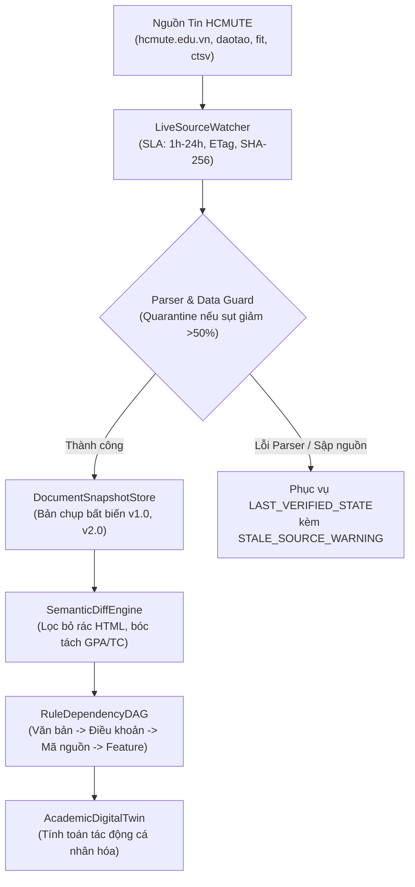

# 🔄 HCMUTE Live Academic Synchronization & Ingestion Pipeline
> **Document ID**: `UNI-SYNC-LIVE-001` | **Version**: 9.0.0 | **Zero-Stale Standard**  
> **Institution**: Trường Đại học Sư phạm Kỹ thuật TP. Hồ Chí Minh (HCMUTE)  

---

## 1. Kiến Trúc Đồng Bộ Thời Gian Thực (Live-Sync Architecture)

---

## 2. Phân Tầng SLA Độ Tươi Mới (Freshness SLA Policies)

| Phân Tầng SLA | Loại Nguồn & Nội Dung | Chu Kỳ Quét (Polling) | Giới Hạn Quá Hạn (Max Staleness) | Hành Động Khi Quá Hạn |
| :--- | :--- | :---: | :---: | :--- |
| **`CRITICAL_NOTICE`** | Lịch đăng ký tín chỉ, lịch thi, hạn nộp học phí | **30 phút** | **1 giờ** | Đổi trạng thái nguồn sang `STALE`, kích hoạt quét khẩn cấp. |
| **`ANNOUNCEMENT`** | Thông báo học bổng, sự kiện, thông tin chung | **2 giờ** | **6 giờ** | Quét lại theo hàng đợi bình thường. |
| **`CURRICULUM`** | Khung CTĐT các Khoa (FIT, FEEE, FME) | **12 giờ** | **24 giờ** | Quét kiểm tra đề cương học phần và môn tiên quyết. |
| **`REGULATION`** | Quy chế đào tạo, Quyết định của Hiệu trưởng | **24 giờ** | **168 giờ (1 tuần)** | Theo dõi mục Văn bản - Quy định Phòng Đào tạo. |

---

## 3. Chính Sách Thu Thập Lịch Sự (Polite Crawling & Rate Limiting)
- **Conditional HTTP Headers**: Luôn gửi `If-None-Match` (ETag) và `If-Modified-Since`. Nếu nhận HTTP 304, không tải lại nội dung body để tiết kiệm băng thông của máy chủ trường.
- **Exponential Backoff & Jitter**: Khi gặp lỗi HTTP 5xx hoặc timeout, áp dụng giãn cách tăng dần (5m, 10m, 20m, 40m, tối đa 6h) cộng với 0–5 phút ngẫu nhiên (jitter) để tránh nghẽn mạng đồng thời.
