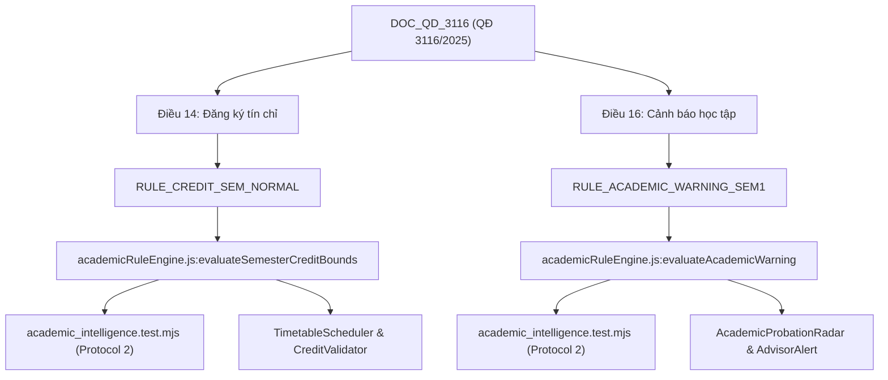

# 🕸️ HCMUTE Rule Dependency Directed Acyclic Graph (DAG)
> **Document ID**: `UNI-DAG-RULES-001` | **Version**: 9.0.0 | **Zero-Fabrication Standard**  
> **Institution**: Trường Đại học Sư phạm Kỹ thuật TP. Hồ Chí Minh (HCMUTE)  

---

## 1. Cấu Trúc Phụ Thuộc 6 Tầng (6-Tier Dependency Pipeline)

$$\text{DOCUMENT} \longrightarrow \text{CLAUSE} \longrightarrow \text{RULE} \longrightarrow \text{CODE} \longrightarrow \text{TEST} \longrightarrow \text{FEATURE}$$

---

## 2. Bảng Ánh Xạ Phụ Thuộc Chi Tiết

| Mã Văn Bản | Điều Khoản | Mã Quy Tắc (Rule ID) | File Code Triển Khai | Bộ Test Kiểm Chuẩn | Tính Năng Phía Người Dùng | Mức Độ Tác Động |
| :--- | :--- | :--- | :--- | :--- | :--- | :---: |
| `DOC_QD_3116` | Điều 14 (Khoản 2) | `RULE_CREDIT_SEM_NORMAL` | `academicRuleEngine.js` | `academic_intelligence.test.mjs` | Trình xếp TKB & Kiểm tra tín chỉ | `CAO` (High) |
| `DOC_QD_3116` | Điều 16 (Khoản 1a)| `RULE_ACADEMIC_WARNING_SEM1`| `academicRuleEngine.js` | `academic_intelligence.test.mjs` | Radar Cảnh Báo Học Vụ | `NGHIÊM TRỌNG` (Critical) |
| `DOC_FIT_CURRICULUM_SE`| Mục 4.2 | `RULE_THESIS_ELIGIBILITY_FIT` | `academicRuleEngine.js` | `academic_intelligence.test.mjs` | Radar Khóa Luận & Lộ Trình TN | `NGHIÊM TRỌNG` (Critical) |
| `DOC_FFL_ENGLISH_STANDARDS`| Mục 3.4 | `RULE_ENGLISH_EXIT_K26_SE` | `versionedCurricula.js` | `academic_intelligence.test.mjs` | Danh Sách Điều Kiện Tốt Nghiệp | `NGHIÊM TRỌNG` (Critical) |

---

## 3. Cổng Phê Duyệt Của Con Người (Human Review Gate)
Đối với các quy tắc có mức độ tác động **`NGHIÊM TRỌNG` (Critical)** hoặc **`CAO` (High)**:
- Khi phát hiện văn bản mới, hệ thống chuyển quy tắc cũ sang `SUPERSEDED` và tạo quy tắc mới ở trạng thái `CANDIDATE`.
- Quy tắc `CANDIDATE` không tự động ban hành trực tiếp vào hệ thống phán quyết điểm mà bắt buộc phải qua bước đối soát phê duyệt của quản trị viên học vụ và vượt qua 100% bài kiểm thử hồi quy (Regression Test).
