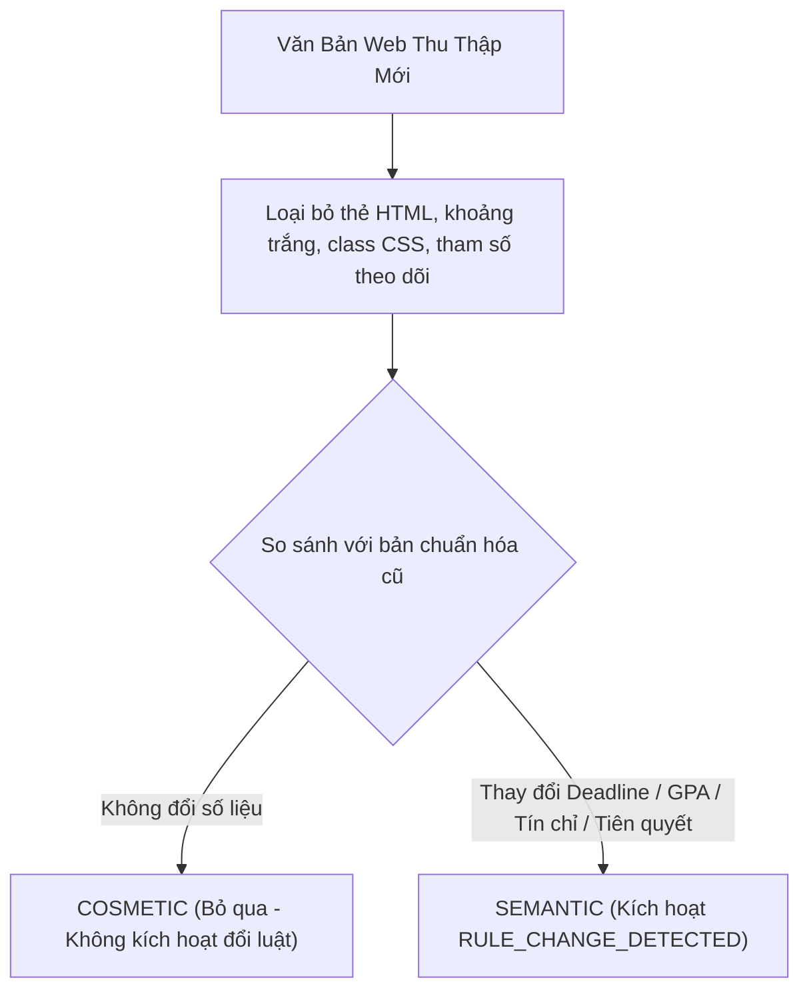

# 🔬 HCMUTE Semantic Diff & Cosmetic Noise Filtering
> **Document ID**: `UNI-DIFF-SEMANTIC-001` | **Version**: 9.0.0 | **Zero-Fabrication Standard**  
> **Institution**: Trường Đại học Sư phạm Kỹ thuật TP. Hồ Chí Minh (HCMUTE)  

---

## 1. Phân Biệt Biến Thiên Ngữ Nghĩa vs Nhiễu Định Dạng

---

## 2. Bảng Tiêu Chí Phân Loại Biến Thiên

| Loại Biến Thiên | Ví Dụ Cụ Thể | Phân Loại | Mức Độ Nghiêm Trọng | Hành Động Kích Hoạt |
| :--- | :--- | :---: | :---: | :--- |
| **Thay đổi thẻ HTML / CSS** | `
` $\rightarrow$ `
` | `COSMETIC` | `NONE` | Bỏ qua, giữ nguyên trạng thái quy tắc hiện hành. |
| **Thay đổi khoảng trắng / tab**| Thêm dấu xuống dòng hoặc khoảng trắng | `COSMETIC` | `NONE` | Bỏ qua. |
| **Thay đổi hạn chót (Deadline)**| $30/08/2026 \rightarrow 02/09/2026$ | `SEMANTIC` | `HIGH` | Kích hoạt `DEADLINE_CHANGED` ➔ Gửi thông báo tới sinh viên. |
| **Thay đổi ngưỡng cảnh báo GPA**| $\text{GPA} < 1.00 \rightarrow \text{GPA} < 0.80$ | `SEMANTIC` | `CRITICAL` | Kích hoạt `RULE_CHANGE_DETECTED` ➔ Chuyển qua Human Review Gate. |
| **Thay đổi chuẩn ngoại ngữ** | $\text{TOEIC } 450 \rightarrow \text{TOEIC } 550$ | `SEMANTIC` | `CRITICAL` | Kích hoạt `RULE_CHANGE_DETECTED` ➔ Tách biệt theo khóa K26. |
| **Bổ sung môn tiên quyết** | Thêm môn `SWEN330103` cho Khóa luận | `SEMANTIC` | `HIGH` | Kích hoạt `PREREQUISITE_CHANGED` ➔ Tính lại đồ thị nút thắt. |
