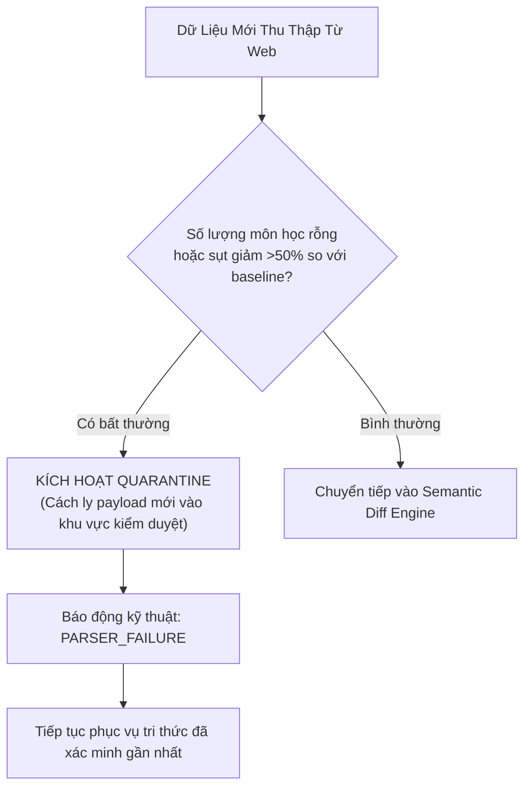

# 🩺 HCMUTE Source Health, Telemetry & Parser Quarantine Runbook
> **Document ID**: `UNI-HEALTH-SOURCE-001` | **Version**: 9.0.0 | **Zero-Corruption Standard**  
> **Institution**: Trường Đại học Sư phạm Kỹ thuật TP. Hồ Chí Minh (HCMUTE)  

---

## 1. 4 Trạng Thái Sức Khỏe Nguồn Thu Thập (Source Health States)

| Trạng Thái | Điều Kiện Kích Hoạt | Hành Động Phục Hồi Tự Động |
| :--- | :--- | :--- |
| **`HEALTHY`** | HTTP 200/304, phản hồi $< 1500$ms, trích xuất nguyên vẹn, không quá hạn SLA. | Tiếp tục chu kỳ giám sát bình thường. |
| **`DEGRADED`** | Gặp 1–2 lần lỗi mạng liên tiếp, hoặc độ trễ phản hồi $> 3000$ms. | Kích hoạt giãn cách Exponential Backoff (5–15 phút). |
| **`STALE`** | Thời gian từ lần quét thành công gần nhất vượt quá giới hạn SLA (ví dụ: $> 1$h cho thông báo khẩn). | Phục vụ `LAST_VERIFIED_SNAPSHOT` kèm cờ cảnh báo `STALE_SOURCE_WARNING`. |
| **`FAILED`** | Gặp $\ge 3$ lần lỗi liên tiếp hoặc phát hiện sập cấu trúc HTML (`PARSER_FAILURE`). | Dừng thu thập tự động (`STOP_INGESTION`), gửi cảnh báo kỹ thuật viên. |

---

## 2. Quy Trình Cách Ly Dữ Liệu Bất Thường (Quarantine Runbook)

