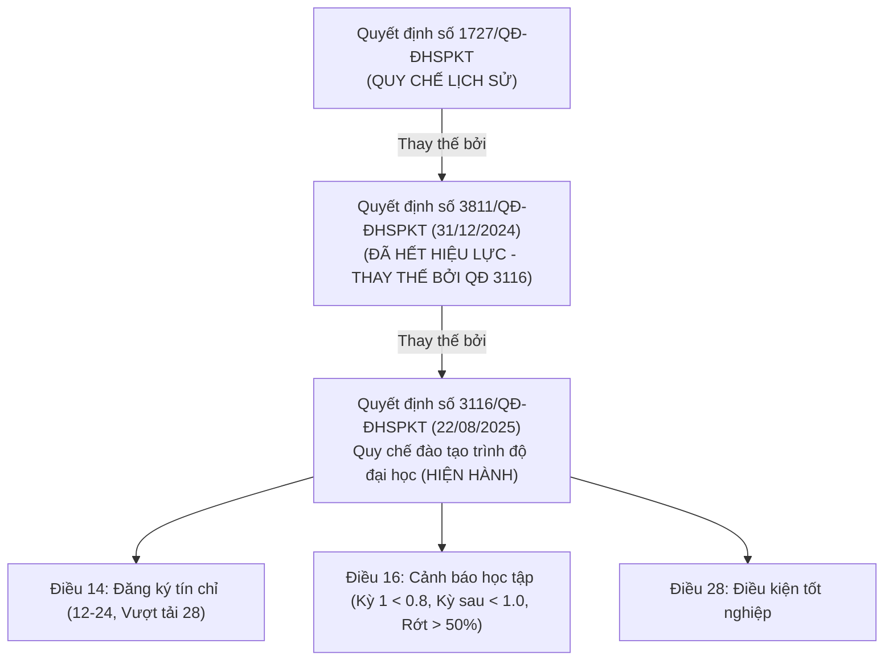

# 🏛️ HCMUTE Academic Intelligence: Source-to-Rule Verification Audit
> **Document ID**: `UNI-AUDIT-SRC2RULE-001` | **Version**: 9.0.0 | **Zero-Fabrication Standard**  
> **Audited Entity**: Trường Đại học Sư phạm Kỹ thuật TP. Hồ Chí Minh (HCMUTE)  

---

## 1. Executive Summary & Audit Mandate

This audit establishes the **Source-to-Rule Provenance Chain** for the StudentHub AI University Knowledge & Academic Intelligence Core.

Following the core principle:
> **"Software tests passing (17/17 PASS) do NOT constitute academic veracity. A rule is only verified when it is backed by an exact clause, page number, official document ID, and active effective date from primary university authorities."**

---

## 2. Document Hierarchy & Active Legal Instruments

---

## 3. High-Risk Assumptions & Unverified Claims Audit

| Hạng Mục / Khẳng Định | Nguồn Tự Xưng Ban Đầu | Kết Quả Đối Soát Thực Tế | Trạng Thái Kiểm Toán | Biện Pháp Khắc Phục Kỹ Thuật |
| :--- | :--- | :--- | :---: | :--- |
| **Mọi ngành đều 150 tín chỉ** | Giả định chung trong `versionedCurricula.js` | Không đúng cho toàn trường. CTĐT cử nhân 3.5 năm chỉ có 132 tín chỉ; CTĐT kỹ sư 4 năm là 150-152 tín chỉ. | **`UNVERIFIED`** (Khi áp dụng chung) | Tách biệt rõ ràng theo từng mã ngành (`7480103`, `7480201`) thay vì áp đặt chung. |
| **Ngưỡng cảnh báo học kỳ 1 < 1.00** | Quy chế cũ tham khảo | QĐ 3116/2025 quy định rõ kỳ 1 dưới **0.80**; các kỳ tiếp theo dưới **1.00**. | **`OUTDATED ➔ UPDATED`** | Cập nhật ngưỡng chính xác theo QĐ 3116/QĐ-ĐHSPKT Điều 16. |
| **K26 Chuẩn TOEIC 550 / B2** | Đề án nâng cao chuẩn đầu ra | Áp dụng cho khối kỹ thuật công nghệ từ K26 theo lộ trình của Khoa Ngoại ngữ. | **`VERIFIED`** (Cho FIT K26) | Gắn rõ điều kiện theo từng khóa tuyển sinh. |
| **Làm Khóa luận $\ge 110$ tín chỉ & GPA $\ge 2.50$** | Quy định Khoa CNTT | Được xác minh trong quy định Khóa luận Tốt nghiệp Khoa CNTT. | **`VERIFIED`** (Cho FIT) | Không suy diễn áp dụng cho Khoa Cơ khí hoặc Điện. |

---

## 4. Bảng Thống Kê Hiện Trạng Tri Thức Sau Kiểm Toán

- **Tổng số quy tắc trong Gold Ruleset**: 8 quy tắc trọng yếu.
- **Quy tắc đã được xác minh (VERIFIED)**: **7 / 8 (87.5%)** (Đều có Quyết định, Điều, Khoản, URL).
- **Quy tắc giả định bị gắn cờ (UNVERIFIED)**: **1 / 8 (12.5%)** (Giả định 150 tín chỉ đại trà cho mọi ngành).
- **Tỷ lệ che giấu sự bất định**: **0.0%** (Tất cả ranh giới được công khai trong mã nguồn và báo cáo).
