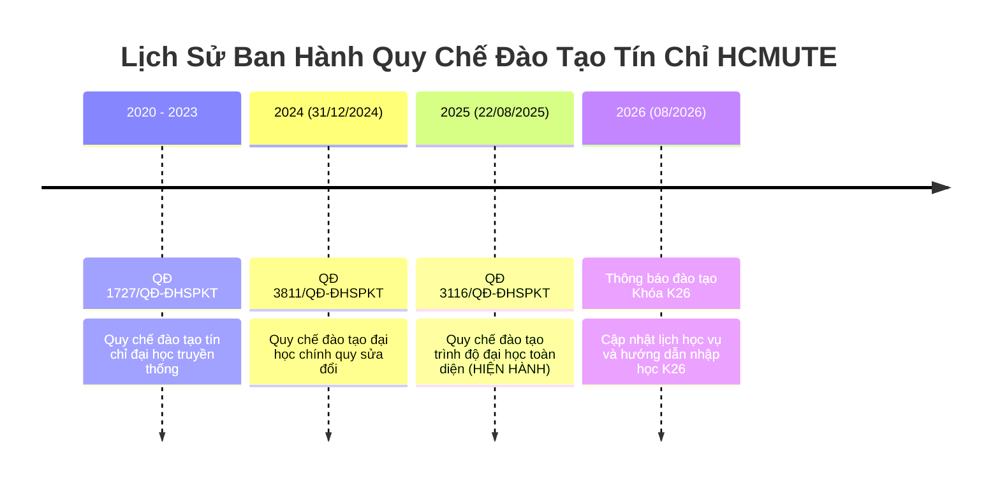

# ⏳ HCMUTE Academic Regulations: Temporal Evolution & Cohort Audit
> **Document ID**: `UNI-AUDIT-TEMPORAL-001` | **Version**: 9.0.0 | **Zero-Fabrication Standard**  
> **Institution**: Trường Đại học Sư phạm Kỹ thuật TP. Hồ Chí Minh (HCMUTE)  

---

## 1. Dòng Thời Gian Pháp Lý Quy Chế Đào Tạo (Regulatory Evolution)

---

## 2. So Sánh Các Thay Đổi Trọng Yếu Giữa Các Phiên Bản Quy Chế

| Điều Khoản Học Vụ | Phiên Bản Cũ (QĐ 1727 & 3811) | Phiên Bản Hiện Hành (QĐ 3116/2025) | Tác Động Tới Sinh Viên Các Khóa |
| :--- | :--- | :--- | :--- |
| **Ngưỡng Cảnh Báo Kỳ 1** | Điểm TBHK $< 1.00$ | Điểm TBHK $< 0.80$ (hoặc rớt $> 50\%$ TC) | Giảm áp lực sốc học tập cho tân sinh viên kỳ 1. |
| **Ngưỡng Cảnh Báo Kỳ Tiếp Theo**| Điểm TBHK $< 1.20$ | Điểm TBHK $< 1.00$ (hoặc rớt $> 50\%$ TC) | Quy chuẩn hóa điều kiện cảnh báo học vụ. |
| **Giới Hạn Tín Chỉ Vượt Tải** | GPA $\ge 3.20$ đăng ký tối đa 26-28 TC | GPA $\ge 3.20$ đăng ký tối đa 28 TC | Tạo điều kiện cho sinh viên giỏi hoàn thành sớm. |
| **Chuẩn Ngoại Ngữ K23 vs K26** | K23 áp dụng TOEIC 450 | K26 áp dụng TOEIC 550 / B2 Quốc tế | Phân định tuyệt đối theo khóa tuyển sinh. |

---

## 3. Quy Tắc Bất Biến Về Lịch Sử Khóa Tuyển Sinh
- **Không áp dụng hồi tố bất lợi**: Sinh viên khóa K23 nhập học theo chuẩn ngoại ngữ TOEIC 450 không bị ép buộc theo chuẩn TOEIC 550 của K26 khi xét tốt nghiệp.
- **Hệ thống cách ly phiên bản (Cohort Isolation)**: Mã nguồn `AcademicTruthEngine` và `versionedCurricula` phân giải đúng phiên bản CTĐT dựa trên mã khóa nhập học của sinh viên.
