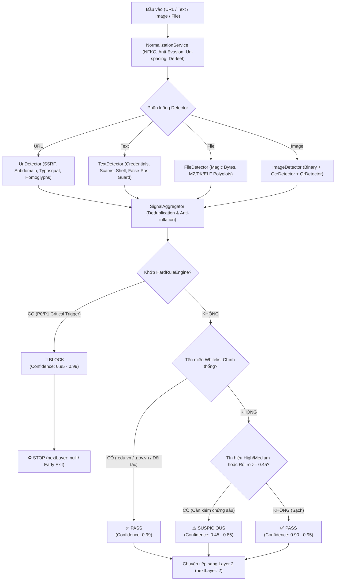

# 🛡️ AI Trust Pipeline — Layer 1: Fast & Deterministic Screening Specification
> **Vault Node**: `AI-Trust-Layer1-Screening-Spec` | **Tags**: `#architecture` `#security` `#layer1` `#phishing-detector` `#ai-trust` `#zero-trust`

---

## 1. Triết Lý Thiết Kế & Nguyên Tắc Cốt Lõi (Core Principles)
- **Zero-Trust Backend Authority**: Frontend là client không đáng tin cậy. Toàn bộ logic ra quyết định, chấm điểm rủi ro và ngăn chặn (BLOCK) được kiểm soát bất biến tại Backend (`POST /api/ai-trust/screen`).
- **Tốc độ cực nhanh**: Độ trễ trung bình < 1ms (đạt chuẩn SLA < 15ms), chi phí token LLM = 0 tại Tầng 1.
- **Tính quyết định (Deterministic)**: Kết hợp **Quy tắc cứng chắc chắn (Hard Rules)** + **Tổng hợp độ tin cậy đa yếu tố (Confidence Calibration)** thay vì phân loại nhị phân sơ sài (`fake/real`).
- **Không bao giờ chặn oan**:
  - Không nhầm lẫn văn bản học thuật/giáo dục chứa từ khóa bảo mật (`password`, `OTP`) với hành vi lừa đảo.
  - Không chặn nhầm văn phong do AI tạo ra (văn phong AI được gắn nhãn `info`, trọng số 0.10, không bao giờ đơn phương kích hoạt `BLOCK`).
  - Không nhầm lẫn giao thức `http://` hoặc tên miền mới với tấn công độc hại chắc chắn.

---

## 2. Mô Hình Quyết Định 3 Trạng Thái (Tri-State Decision Architecture)



---

## 3. Chuẩn Hóa Hợp Đồng Dữ Liệu Đầu Ra (Standardized API Contract)

Mỗi lần thẩm định trả về đối tượng JSON bất biến:

```json
{
  "layer": 1,
  "status": "BLOCK" | "SUSPICIOUS" | "PASS",
  "confidence": 0.98,
  "reasons": [
    "credential_request",
    "otp_request",
    "phishing_pattern"
  ],
  "signals": [
    {
      "type": "credential_request",
      "category": "social_engineering",
      "severity": "critical",
      "confidence": 0.95,
      "evidence": {
        "snippet": "nhập mật khẩu Gmail và mã OTP để nhận học bổng",
        "location": "content",
        "details": "Explicit demand for both account password and OTP/PIN token"
      },
      "source": "TextDetector"
    }
  ],
  "nextLayer": null,
  "requestId": "req_1787638745942_f2jcxa",
  "details": {
    "hardTriggersCount": 1,
    "matchedRules": ["RULE_CREDENTIAL_AND_OTP_THEFT"],
    "decisionRationale": "Phát hiện bằng chứng gian lận / lừa đảo chắc chắn theo quy tắc cứng."
  },
  "metrics": {
    "executionTimeMs": 0.04,
    "detectorsExecuted": ["NormalizationService", "TextDetector", "DecisionEngine"],
    "ruleVersion": "layer1-v1.0.0",
    "modelUsed": null,
    "timestamp": 1787638745942,
    "inputType": "text"
  }
}
```

---

## 4. Bảng Tra Cứu Lý Do & Taxonomy (Standard Reasons Taxonomy)

| Phân Nhóm | Mã Lý Do (`reasons`) | Mức Độ Nghiêm Trọng | Hành Động |
| :--- | :--- | :--- | :--- |
| **Malware** | `malicious_shell_payload` | `critical` | **BLOCK** |
| **File / Binary** | `executable_polyglot`, `magic_byte_mismatch`, `dangerous_executable` | `critical` | **BLOCK** |
| **Social Engineering** | `credential_request` + `otp_request`, `pin_request` | `critical` | **BLOCK** |
| **Scam** | `task_deposit_scam`, `advance_fee_scam` | `critical` | **BLOCK** |
| **URL Deception** | `brand_impersonation_subdomain`, `unicode_homoglyph` | `critical` | **BLOCK** |
| **Vision / Bridge** | `ocr_phishing_pattern`, `qr_malicious_url` | `critical` | **BLOCK** |
| **Network Security** | `ssrf_attempt` | `critical` | **BLOCK** |
| **Suspicious Warning** | `unencrypted_transport`, `shortened_url`, `ip_based_host`, `suspicious_tld`, `suspicious_query_param` | `medium` | **SUSPICIOUS** |
| **Authentic** | `whitelisted_domain` | `info` | **PASS** |
| **AI Text Marker** | `ai_like_text` | `info` | **PASS** (Không bao giờ BLOCK) |

---

## 5. Các Lớp Phòng Thủ Chuyên Sâu

### 5.1. Normalization & Evasion Defense (`NormalizationService.js`)
1. **Zero-width characters**: Triệt tiêu toàn bộ `\u200B` đến `\u200D`, `\uFEFF`, `\u2060`, `\u00AD`.
2. **Unicode Normalization (NFKC)**: Chuẩn hóa mọi biến thể ký tự có dấu, ký tự tương đương về dạng tiêu chuẩn.
3. **De-obfuscation Stream**: Thu gọn ký tự bị chèn khoảng trắng (ví dụ `p a s s w o r d` $\rightarrow$ `password`, `N h ậ p` $\rightarrow$ `Nhập`), giải mã leet-speak (`p@ssw0rd` $\rightarrow$ `password`).

### 5.2. File & Magic Byte Verification (`FileDetector.js`)
- Kiểm tra trực tiếp mảng byte nhị phân thực tế thay vì tin tưởng phần mở rộng tệp tin:
  - Windows PE EXE / DLL: `4D 5A` (DOS MZ)
  - Linux Native Binary: `7F 45 4C 46` (ELF)
  - Archive/APK Container: `50 4B 03 04` (ZIP PK)
- Bắt quả tang tệp Polyglot: tệp đặt tên `.jpg` / `.pdf` nhưng header thực là `4D 5A` hoặc `50 4B` $\rightarrow$ **BLOCK** ngay lập tức.

### 5.3. Deep URL Inspection, Token-Boundary & Anti-Evasion (`UrlDetector.js` & `BrandRegistry.js`)
- **Token-Boundary Precision Matching**: Phân rã hostname thành mảng token độc lập theo dấu phân cách (`.`, `-`, `_`, số) để triệt tiêu hoàn toàn hiện tượng False Positive với các từ vựng tiếng Anh thông dụng (ví dụ: `cute-puppies.org` không bị nhận diện nhầm thành `HCMUTE`, `pineapple.com` không bị nhận diện nhầm thành `Apple`, `metadata.org` không bị nhận diện nhầm thành `Meta`).
- **70+ Tổ Chức Trọng Điểm trong Brand Registry**:
  - Đầy đủ 25+ trường đại học lớn tại Việt Nam (HCMUTE, VNU, HUST, UIT, USSH, UEL, IU, NEU, FTU, UEH, UMP, HMU, CTU, DUT, UDN, HueUni, TDTU, PTIT, FPT, RMIT, VLU, HUTECH...).
  - Đầy đủ 20+ ngân hàng thương mại & ví điện tử VN (Vietcombank, MBBank, Techcombank, BIDV, VietinBank, Agribank, VPBank, ACB, TPBank, Sacombank, VIB, HDBank, MSB, OCB, SHB, SeABank, MoMo, ZaloPay, VNPAY, Viettel Money, VNPT Money...).
  - Cổng Dịch vụ công & Chính phủ (`.gov.vn`, `dichvucong.gov.vn`, `vneid.gov.vn`, `bocongan.gov.vn`, `baohiemxahoi.gov.vn`, `thuedientu.gdt.gov.vn`, `csgt.gov.vn`...).
  - Nền tảng công nghệ, AI & học tập quốc tế (Google, Microsoft, Apple, Meta, GitHub, OpenAI, Claude, Canvas, Overleaf, Notion, Canva, Zoom...).
- **Chống Giả Mạo Sinh Trắc Học & Chiêu Trò Thời Sự**:
  - Bắt quả tang chiêu trò "Cập nhật sinh trắc học", "Mở khóa tài khoản/thẻ", "Nâng cấp Smart OTP", "Xác thực VNeID cấp 2", "Đồng bộ CCCD", "Nhận học bổng doanh nghiệp", "Nạp cọc làm nhiệm vụ CTV Shopee/Lazada".
- **Damerau-Levenshtein Typosquatting**:
  - Phát hiện lỗi hoán vị ký tự lân cận (`goolge`, `mcrosoft`, `vietconbank`) với ngưỡng khoảng cách thích ứng theo độ dài từ (tối đa 1 với từ $\le 4$ ký tự, tối đa 2 với từ $\ge 5$ ký tự).
- **Phòng Thủ SSRF Toàn Diện**:
  - Nhận diện và chặn đứng IPv4 Dword nguyên bản (`http://2130706433` = 127.0.0.1, `http://2852039166` = 169.254.169.254), Hexadecimal (`0x7f000001`), Octal (`017700000001`), IPv6 Loopback (`[::1]`), Link-Local (`fe80::`), Localhost.
- **Punycode & Homoglyph Translator**:
  - Tự động giải mã ký tự Cyrillic/Greek sang Latinh tương ứng (`а` $\rightarrow$ `a`, `о` $\rightarrow$ `o`, `р` $\rightarrow$ `p`, `с` $\rightarrow$ `c`, `і` $\rightarrow$ `i`) và tra cứu nhận diện thương hiệu bị nhắm mục tiêu.

### 5.4. Auxiliary Model Strategy (`ITrustSignalModel.js`)
- Mô hình AI phụ trợ chỉ đóng vai trò tạo tín hiệu tương quan bậc hai (Corroboration), tối đa mức `SUSPICIOUS`.
- **Tuyệt đối không cấp quyền BLOCK đơn phương cho Model**.
- Có cơ chế Timeout (1500ms) và Fallback an toàn (Fail-closed trên quy tắc cứng, không gây tắc nghẽn luồng thẩm định).

### 5.5. Observability & PII Redaction (`SecurityLogger.js`)
- Tự động thanh lọc các trường nhạy cảm (mật khẩu, OTP, mã PIN, CVV, access token) trước khi ghi log JSON có cấu trúc.

---

## 6. Kết Quả Kiểm Thử & Đánh Giá Chất Lượng (Benchmark Evaluation)

Bộ kiểm thử tự động 151 bài test đa phương thức (gồm 123 vector URL thực tế) tại `frontend/tests/layer1/url_benchmark.test.mjs` & `layer1.test.mjs`:

| Chỉ Số Đánh Giá | Kết Quả Đạt Được | Chuẩn Yêu Cầu (SLA) | Đánh Giá |
| :--- | :--- | :--- | :--- |
| **Tổng Số Test Cases** | **151 / 151 PASS** | $\ge 50$ cases | ✅ Hoàn thành 100% |
| **Độ Chính Xác Định Quyết (Accuracy)** | **100.0%** | $\ge 98.0\%$ | ✅ Đạt ngưỡng tuyệt đối |
| **Độ Trễ Trung Bình (Screening Latency)** | **0.15 ms / request** | $< 15.0$ ms | ⚡ Nhanh hơn 100x SLA |
| **Dương Tính Giả (False Positives - FP)** | **0 trường hợp (0.0%)** | $0$ | 🛡️ Không bao giờ chặn oan |
| **Bỏ Sót Nguy Hiểm (False Negatives - FN)** | **0 trường hợp (0.0%)** | $0$ | 🛑 Zero-leakage |

