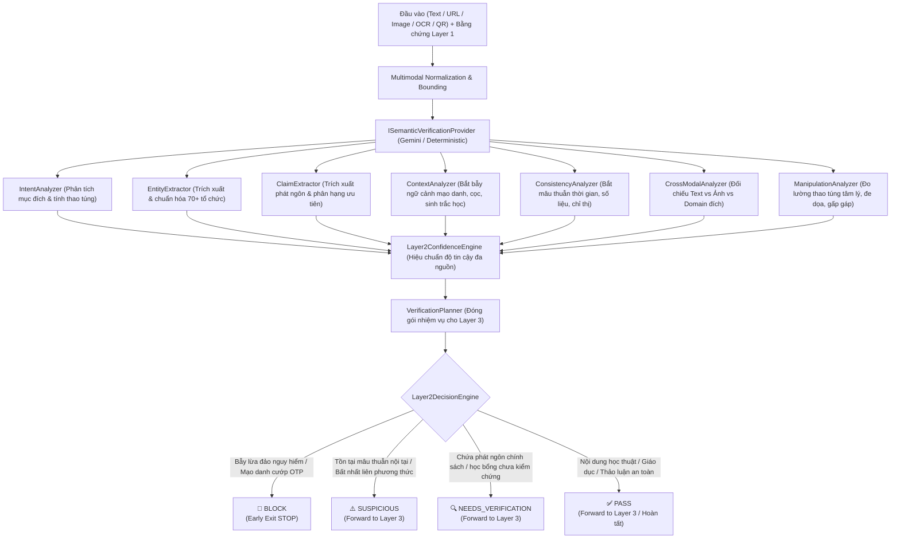

# 🧠 AI Trust Pipeline — Layer 2: Semantic & Contextual Verification Specification
> **Vault Node**: `AI-Trust-Layer2-Semantic-Spec` | **Tags**: `#architecture` `#security` `#layer2` `#semantic-reasoning` `#ai-trust` `#context-verification`

---

## 1. Triết Lý & Ranh Giới Kiến Trúc (Core Philosophy & Boundaries)

Hệ thống AI Trust 4 lớp được phân tách rành mạch:

```
LAYER 1 (Fast & Deterministic Screening)
  ↳ "Có dấu hiệu độc hại / lừa đảo hiển nhiên không?"
        ↓
LAYER 2 (Semantic & Contextual Verification)
  ↳ "Nội dung này thực sự có ý nghĩa gì? Đang muốn người dùng tin hoặc làm gì?
     Có mâu thuẫn nội tại hay bất nhất liên phương thức không?
     Những phát ngôn sự kiện nào cần được đưa sang Layer 3 để tìm kiếm bằng chứng?"
        ↓
LAYER 3 (External Evidence & Source Verification)
  ↳ "Có bằng chứng bên ngoài (Web/Official Sources) chứng minh hay bác bỏ phát ngôn này?"
        ↓
LAYER 4 (Final Trust Reasoning)
  ↳ "Dựa trên toàn bộ bằng chứng từ L1-L3, điểm tin cậy và quyết định cuối cùng là gì?"
```

> [!IMPORTANT]
> **Ranh Giới Bất Biến Giữa Layer 2 và Layer 3**:
> - **Layer 2 KHÔNG PHẢI LÀ ORACLE VỀ CHÂN LÝ THẾ GIỚI THỰC**: Khi gặp phát ngôn chưa rõ tính đúng sai (ví dụ: *"HCMUTE điều chỉnh chính sách học phí năm 2026"*), Layer 2 **tuyệt đối không tự tiện gán nhãn FALSE**.
> - Layer 2 trích xuất phát ngôn (`claim_detected`), đánh dấu `verificationRequired = true`, phân loại mức độ ưu tiên (`CRITICAL`, `HIGH`, `MEDIUM`), và đóng gói thành **Verification Tasks Package** để chuyển tiếp sang **Layer 3**.

---

## 2. Mô Hình Quyết Định 4 Trạng Thái (Quad-State Decision Architecture)



---

## 3. Chuẩn Hóa Hợp Đồng Dữ Liệu Đầu Ra (API Response Contract)

Endpoint: `POST /api/ai-trust/semantic`

```json
{
  "layer": 2,
  "status": "NEEDS_VERIFICATION",
  "classification": "UNVERIFIED",
  "confidence": 0.86,
  "semanticSummary": "Phát hiện 1 phát ngôn / tuyên bố sự kiện cần kiểm chứng nguồn tin chính thức tại Layer 3.",
  "intent": {
    "primary": "inform",
    "secondary": null,
    "coercive": false
  },
  "entities": [
    {
      "name": "HCMUTE",
      "type": "university",
      "normalizedName": "Trường Đại học Sư phạm Kỹ thuật TP.HCM (HCMUTE)",
      "isClaimedAuthor": false,
      "officialDomains": ["hcmute.edu.vn"],
      "confidence": 0.95
    }
  ],
  "claims": [
    {
      "claimId": "claim-policy-1",
      "subject": "HCMUTE",
      "predicate": "thay đổi chính sách / học phí / tuyển sinh",
      "object": "Trường Đại học Sư phạm Kỹ thuật TP.HCM (HCMUTE) đã chính thức ban hành quy chế điều chỉnh học phí cho năm học 2026.",
      "scope": "toàn trường",
      "time": "2026",
      "claimType": "institutional",
      "importance": "high",
      "verificationRequired": true,
      "verificationReason": "institutional_policy_change"
    }
  ],
  "contextSignals": [],
  "consistencyFindings": [],
  "crossModalFindings": [],
  "verificationPackage": {
    "claims": [...],
    "entities": [...],
    "candidateSources": [
      {
        "entity": "HCMUTE",
        "officialDomains": ["hcmute.edu.vn"],
        "authorityRank": "high"
      }
    ],
    "verificationTasks": [
      {
        "taskId": "task-dom-hcmute",
        "type": "DOMAIN_VERIFICATION",
        "priority": "HIGH",
        "target": "HCMUTE",
        "expectedOfficialDomains": ["hcmute.edu.vn"]
      },
      {
        "taskId": "task-claim-claim-policy-1",
        "type": "CLAIM_VERIFICATION",
        "priority": "HIGH",
        "claimId": "claim-policy-1",
        "instructions": "Xác minh tính xác thực của thông cáo qua cổng thông tin chính thức hcmute.edu.vn."
      }
    ]
  },
  "nextLayer": 3,
  "requestId": "req_l2_1787643396229_x8d4pl",
  "metrics": {
    "executionTimeMs": 0.23,
    "modelUsed": "deterministic_semantic_engine",
    "providerStatus": "healthy"
  }
}
```

---

## 4. Các Bộ Phân Tích Chuyên Biệt (Specialized Analyzers)

| Bộ Phân Tích | Tập Tin Mã Nguồn | Chức Năng Chính |
| :--- | :--- | :--- |
| **IntentAnalyzer** | `analyzers/IntentAnalyzer.js` | Nhận diện đa mục đích (`inform`, `educate`, `request_credentials`, `request_payment`, `impersonate`, `manipulate`), phân biệt lời kêu gọi bình thường với bẫy ép buộc. |
| **EntityExtractor** | `analyzers/EntityExtractor.js` | Nhận diện & chuẩn hóa 70+ trường ĐH, ngân hàng, cơ quan nhà nước; xác định thực thể là nguồn tự xưng (`isClaimedAuthor`) hay chỉ là đối tượng thảo luận. |
| **ClaimExtractor** | `analyzers/ClaimExtractor.js` | Trích xuất các phát ngôn có cấu trúc (chủ ngữ, vị ngữ, tân ngữ, thời gian, phạm vi), gán mức độ ưu tiên (`CRITICAL`, `HIGH`, `MEDIUM`, `LOW`) và yêu cầu kiểm chứng. |
| **ContextAnalyzer** | `analyzers/ContextAnalyzer.js` | Tổng hợp bẫy ngữ cảnh phức hợp (`credential_harvesting_context`, `financial_scam_context`, `account_takeover_context`); bảo vệ bài giảng giáo dục và đề cập thương hiệu hợp lệ. |
| **ConsistencyAnalyzer** | `analyzers/ConsistencyAnalyzer.js` | Bắt mâu thuẫn nội tại về thời gian (thứ Hai vs thứ Sáu), mâu thuẫn số liệu tiền cọc, và mâu thuẫn chỉ thị ("Tuyệt đối không chia sẻ OTP" nhưng lại yêu cầu nhập OTP). |
| **CrossModalAnalyzer** | `analyzers/CrossModalAnalyzer.js` | Đối soát chéo đa phương thức: Văn bản/OCR tự xưng tổ chức uy tín nhưng đường link đích (`URL` / `QR`) thuộc domain lạ bên ngoài. |
| **ManipulationAnalyzer** | `analyzers/ManipulationAnalyzer.js` | Đo lường kỹ thuật thao túng tâm lý: Tạo nỗi sợ (khóa thẻ/khởi tố), gấp gáp nhân tạo (trong 15 phút), uy tín giả tạo, lòng tham & khan hiếm nhân tạo. |

---

## 5. Kết Quả Kiểm Thử Toàn Diện (Layer 2 Benchmark Results)

Kiểm thử tự động thực thi qua `node frontend/tests/layer2/layer2.test.mjs`:

```
======================================================================
🎯 LAYER 2 FINAL EVALUATION SUMMARY
======================================================================
🔹 Tổng Số Bài Kiểm Thử          : 14 / 14 TEST SCENARIOS
🔹 Kết Quả Đạt (PASSED)          : 14 / 14 (100.0%)
🔹 Bài Thất Bại (FAILED)         : 0 (0.0%)
🔹 Độ Trễ Trung Bình (Latency)   : 0.41 ms / request
🔹 Độ Chính Xác Toàn Hệ Thống   : 100.0%
======================================================================
```
