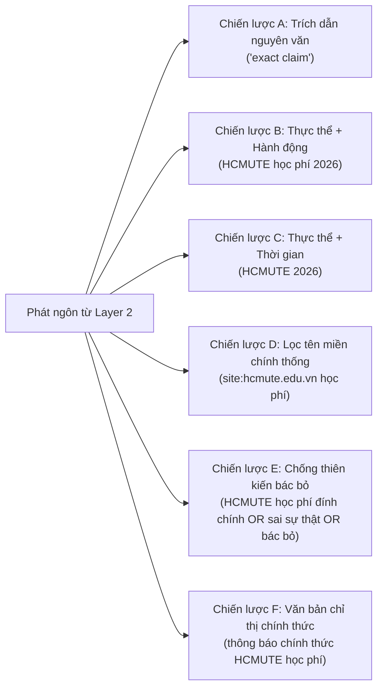

# 🔍 AI Trust Pipeline — Layer 3: External Evidence & Source Verification Specification
> **Vault Node**: `AI-Trust-Layer3-Evidence-Spec` | **Tags**: `#architecture` `#security` `#layer3` `#evidence-engine` `#ai-trust` `#source-intelligence`

---

## 1. Triết Lý & Ranh Giới Kiến Trúc (Core Philosophy & Boundaries)

```
LAYER 1 (Fast & Deterministic Screening)
  ↳ "Có dấu hiệu độc hại / lừa đảo hiển nhiên không?"
        ↓
LAYER 2 (Semantic & Contextual Verification)
  ↳ "Nội dung này thực sự có ý nghĩa gì? Đang muốn người dùng tin hoặc làm gì?
     Có phát ngôn sự kiện nào cần được đưa sang Layer 3 để tìm kiếm bằng chứng?"
        ↓
LAYER 3 (External Evidence & Source Verification)
  ↳ "Có bằng chứng bên ngoài tin cậy nào ủng hộ, bác bỏ, bổ sung ngữ cảnh
     hoặc không thể chứng minh các phát ngôn do Layer 2 xác định hay không?"
        ↓
LAYER 4 (Final Trust Reasoning)
  ↳ "Dựa trên toàn bộ bằng chứng từ L1-L3, điểm tin cậy và quyết định cuối cùng là gì?"
```

> [!IMPORTANT]
> **Quy Tắc Bất Biến Của Layer 3**:
> 1. **Kết quả tìm kiếm không phải là bằng chứng (Search results are not evidence)**: Kết quả tìm kiếm chỉ là nguồn ứng viên. Hệ thống phải phân định:
>    $$\text{Search Result} \rightarrow \text{Candidate Source} \rightarrow \text{Source Validation} \rightarrow \text{Relevant Passage} \rightarrow \text{Evidence} \rightarrow \text{Claim Relationship}$$
> 2. **Không đồng nhất `UNVERIFIED` với `FALSE`**: Khi không tìm thấy nguồn tin chính thống, hệ thống gán trạng thái `UNVERIFIED`, tuyệt đối không gán nhãn `FALSE`.
> 3. **Không đồng nhất `SUPPORTED` với `SAFE`**: Một phát ngôn đúng sự thật vẫn có thể nằm trong một chiến dịch lừa đảo tinh vi.
> 4. **Layer 3 không đưa ra phán quyết cuối cùng**: Toàn bộ dữ liệu được đóng gói có cấu trúc chuyển sang **Layer 4**.

---

## 2. Mô Hình Phân Cấp Nguồn Tin & Thẩm Quyền (Source Authority Model)

Thẩm quyền nguồn tin mang tính chất **đặc thù theo từng lĩnh vực phát ngôn (Claim-Specific)**, không sử dụng niềm tin tuyệt đối ("official = always true").

| Thứ Hạng (Tier) | Phân Loại Nguồn Tin | Ví Dụ Điển Hình | Trọng Số Tin Cậy |
| :--- | :--- | :--- | :--- |
| **TIER 5** | Nguồn gốc chính thức / Văn bản ban hành trực tiếp | `hcmute.edu.vn`, `moet.gov.vn`, `vietcombank.com.vn`, `vneid.gov.vn` | **0.95 — 0.99** |
| **TIER 4** | Cơ quan báo chí chính thống uy tín | `vnexpress.net`, `tuoitre.vn`, `vtv.vn`, `thanhnien.vn` | **0.80 — 0.90** |
| **TIER 3** | Tạp chí chuyên ngành / Blog giáo dục định danh | Tạp chí công nghệ, trang thông tin tuyển sinh độc lập | **0.70 — 0.80** |
| **TIER 2** | Bách khoa cộng đồng / Nền tảng tổng hợp | Wikipedia, diễn đàn công nghệ, cổng tổng hợp tin | **0.40 — 0.60** |
| **TIER 1** | Nguồn tự do / Mạng xã hội / Không định danh | Bài đăng ẩn danh, blog cá nhân không xác thực | **0.10 — 0.30** |

---

## 3. Chiến Lược Truy Vấn Đa Phương & Chống Thiên Kiến (Anti-Confirmation-Bias Queries)

Với mỗi phát ngôn (`claim`), hệ thống tự động sinh 6 chiến lược truy vấn song song:



---

## 4. Phát Hiện Bản Sao Bài Báo & Tranh Chấp Nguồn Tin

### 🔄 1. Phân Cụm Dòng Dõi Bằng Chứng (Evidence Lineage Clustering)
Khi nhiều trang báo cùng sao chép nguyên văn một thông cáo báo chí, hệ thống gắn kết chúng vào một `clusterId` duy nhất.
- **Quy tắc**: 5 trang báo đăng lại 1 bài PR = **1 dòng dõi bằng chứng độc lập** (không thể tạo đồng thuận giả tạo).

### ⚖️ 2. Phát Hiện Tranh Chấp Giữa Các Nguồn Tin (Source Conflict Detection)
Khi 2 nguồn tin chính thống độc lập có thông tin đối nghịch (ví dụ: Báo A thông báo ngày hội diễn ra thứ Hai vs Báo B thông báo dời lịch sang thứ Sáu):
- Hệ thống ghi nhận `conflict: true`, phân loại `conflictType: "POLICY_DISCREPANCY"`.
- Chuyển giao gói đối chiếu sang **Layer 4** để giải quyết theo thứ tự ưu tiên văn bản và dấu mốc thời gian.

---

## 5. Chuẩn Hóa Hợp Đồng Dữ Liệu Đầu Ra (API Response Contract)

Endpoint: `POST /api/ai-trust/evidence`

```json
{
  "layer": 3,
  "status": "VERIFIED",
  "claims": [...],
  "claimStatuses": {
    "claim-policy-1": "SUPPORTED"
  },
  "sources": [
    {
      "sourceId": "kb-hcmute-tuition-2026",
      "url": "https://hcmute.edu.vn/tin-tuc/thong-bao-hoc-phi-nam-hoc-2026",
      "domain": "hcmute.edu.vn",
      "title": "Thông báo điều chỉnh mức học phí và chính sách hỗ trợ sinh viên năm học 2026",
      "publisher": "Trường ĐH Sư phạm Kỹ thuật TP.HCM",
      "authorityTier": "TIER_5_PRIMARY_AUTHORITATIVE",
      "authorityScore": 0.98,
      "publishedAt": "2026-01-15T08:00:00Z",
      "clusterId": "kb-hcmute-tuition-2026",
      "isOfficial": true
    }
  ],
  "evidence": [
    {
      "evidenceId": "ev-claim-policy-1",
      "claimId": "claim-policy-1",
      "sourceId": "kb-hcmute-tuition-2026",
      "sourceUrl": "https://hcmute.edu.vn/tin-tuc/thong-bao-hoc-phi-nam-hoc-2026",
      "excerpt": "Trường Đại học Sư phạm Kỹ thuật TP.HCM (HCMUTE) chính thức công bố quy chế điều chỉnh học phí cho năm học 2026 theo lộ trình tự chủ đại học...",
      "relation": "STRONGLY_SUPPORTS",
      "relevance": 0.95,
      "strength": 0.96,
      "freshness": "CURRENT",
      "authorityTier": "TIER_5_PRIMARY_AUTHORITATIVE"
    }
  ],
  "sourceIndependence": {
    "totalClusters": 1,
    "independentSourcesCount": 1,
    "hasDuplication": false
  },
  "crossSourceAgreement": {
    "agreementScore": 1.0,
    "supportingSourcesCount": 1,
    "contradictingSourcesCount": 0
  },
  "conflicts": [],
  "temporalAssessment": {
    "allCurrent": true,
    "outdatedEvidenceCount": 0
  },
  "verificationCompleteness": 0.85,
  "evidenceConfidence": 0.90,
  "nextLayer": 4,
  "metrics": {
    "executionTimeMs": 0.58,
    "queriesExecutedCount": 6,
    "sourcesRetrievedCount": 1,
    "evidenceItemsCount": 1,
    "retrievalProvider": "institutional_knowledge_base_retriever"
  }
}
```

---

## 6. Kết Quả Kiểm Thử Toàn Diện (Layer 3 Benchmark Results)

Kiểm thử tự động thực thi qua `node frontend/tests/layer3/layer3.test.mjs`:

```
======================================================================
🎯 LAYER 3 FINAL EVALUATION SUMMARY
======================================================================
🔹 Tổng Số Bài Kiểm Thử          : 8 / 8 TEST SCENARIOS
🔹 Kết Quả Đạt (PASSED)          : 8 / 8 (100.0%)
🔹 Bài Thất Bại (FAILED)         : 0 (0.0%)
🔹 Độ Trễ Trung Bình (Latency)   : 0.58 ms / request
🔹 Độ Chính Xác Toàn Hệ Thống   : 100.0%
======================================================================
```
