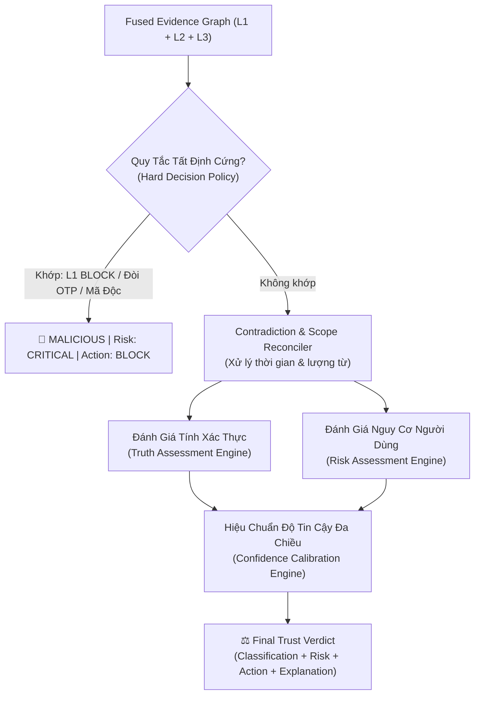

# ⚖️ AI Trust Pipeline — Layer 4: Final Trust Reasoning Specification
> **Vault Node**: `AI-Trust-Layer4-Reasoning-Spec` | **Tags**: `#architecture` `#security` `#layer4` `#final-trust` `#decision-science` `#ai-safety`

---

## 1. Triết Lý Cốt Lõi & Ranh Giới 4 Lớp (Core Philosophy & 4-Layer Architecture)

```
LAYER 1: SIGNAL DETECTION
  ↳ "Có dấu hiệu độc hại / lừa đảo hiển nhiên không?" (Hard Rules, Brands, Typosquatting, Magic Bytes)
        ↓
LAYER 2: MEANING & CONTEXT
  ↳ "Nội dung này thực sự có ý nghĩa gì? Có phát ngôn sự kiện nào cần kiểm chứng?"
        ↓
LAYER 3: EXTERNAL EVIDENCE
  ↳ "Có bằng chứng bên ngoài tin cậy nào ủng hộ hoặc bác bỏ các phát ngôn?"
        ↓
LAYER 4: FINAL TRUST REASONING
  ↳ "Dựa trên TOÀN BỘ bằng chứng từ Layers 1–3, hệ thống nên kết luận điều gì,
     mức độ rủi ro thế nào, và hành động vận hành tối ưu là gì?"
        ↓
FINAL VERDICT & AUDITABLE EXPLANATION
```

> [!IMPORTANT]
> **Các Quy Tắc Bất Biến Của Layer 4 (Inviolable Axioms)**:
> 1. **Tuyệt đối không dùng bộ phân loại nhị phân (No Simple Real/Fake Binary)**: Hệ thống phân định 9 trạng thái tinh vi (`VERIFIED_TRUE`, `LIKELY_TRUE`, `PARTIALLY_TRUE`, `MISLEADING`, `LIKELY_FALSE`, `CONTRADICTED`, `UNVERIFIED`, `INSUFFICIENT_EVIDENCE`, `MALICIOUS`).
> 2. **3 Chiều Độc Lập Bắt Buộc (3 Separate Fundamental Dimensions)**:
>    - **Tính Xác Thực (Truth Status)**
>    - **Rủi Ro Bảo Mật (Security Risk Level: `NONE`, `LOW`, `MEDIUM`, `HIGH`, `CRITICAL`)**
>    - **Hành Động Hệ Thống (Recommended Action: `ALLOW`, `ALLOW_WITH_WARNING`, `REQUIRE_VERIFICATION`, `RESTRICT`, `BLOCK`, `ESCALATE`)**
> 3. **Phân Biệt Rõ Ràng (Mandatory Disambiguations)**:
>    - $\text{TRUE} \neq \text{SAFE}$: Một thông báo tuyển sinh đúng sự thật bị chèn vào trang giả mạo đòi mã OTP $\rightarrow$ **Phán quyết là `MALICIOUS` (Security Override)**.
>    - $\text{UNVERIFIED} \neq \text{FALSE}$: Sự kiện mới chưa có bài báo kiểm chứng $\rightarrow$ **Phán quyết là `UNVERIFIED` (Cần đối soát thêm), tuyệt đối không gắn nhãn `FALSE`**.
>    - $\text{PARTIALLY\_TRUE} \neq \text{DECEPTIVE}$: Học bổng "tối đa 10 triệu cho 10% sinh viên Giỏi" bị viết thành "10 triệu cho mọi sinh viên" $\rightarrow$ **Phán quyết là `MISLEADING` (Phóng đại quy mô / Overgeneralization)**.
> 4. **Không Đếm Trùng Lặp (No Double-Counting)**: 10 bài báo sao chép 1 thông cáo báo chí chỉ được tính là **1 dòng dõi bằng chứng (Evidence Family)**.
> 5. **Không Trao Quyền Đơn Phương Cho LLM (No LLM Unilateral Authority)**: Quyết định tối hậu được ràng buộc chặt chẽ bởi các quy tắc tất định (`HardDecisionPolicy`), ma trận rủi ro và cây đối soát bằng chứng. Khi LLM gặp sự cố (timeout 504), hệ thống tự động fallback về động cơ tất định.

---

## 2. Ma Trận Phán Quyết 3 Chiều (3-Dimensional Decision Matrix)



---

## 3. Cấu Trúc Hợp Đồng Dữ Liệu Đầu Ra (API Response Contract)

Endpoint: `POST /api/ai-trust/reasoning`

```json
{
  "layer": 4,
  "classification": "MISLEADING",
  "status": "ALLOW_WITH_WARNING",
  "truthAssessment": {
    "status": "PARTIALLY_SUPPORTED",
    "confidence": 0.90
  },
  "riskAssessment": {
    "level": "MEDIUM",
    "confidence": 0.88,
    "primaryVectors": ["academic_misinformation"]
  },
  "decisionConfidence": 0.92,
  "verificationCompleteness": 0.95,
  "claims": [
    {
      "claimId": "c3",
      "subject": "HCMUTE",
      "predicate": "học bổng",
      "rawText": "HCMUTE trao học bổng 10 triệu cho mọi sinh viên",
      "truthStatus": "MISLEADING",
      "evidenceRefs": ["ev3"],
      "notes": "Phát ngôn phóng đại phạm vi ('toàn thể sinh viên') so với giới hạn thực tế trong chính sách ('tối đa theo hạn mức/đối tượng tuyển chọn')."
    }
  ],
  "keyReasons": [
    "Chính sách / chương trình có tồn tại nhưng thông tin trong bài viết bị phóng đại hoặc sai lệch phạm vi áp dụng."
  ],
  "evidenceRefs": ["ev3"],
  "conflicts": [],
  "limitations": [],
  "recommendedAction": "ALLOW_WITH_WARNING",
  "userExplanation": {
    "verdictTitle": "NỘI DUNG GÂY HIỂU LẦM / PHÓNG ĐẠI QUY MÔ",
    "why": "Chính sách / chương trình có tồn tại nhưng thông tin trong bài viết bị phóng đại hoặc sai lệch phạm vi áp dụng.",
    "keyEvidence": [
      {
        "sourceTitle": "https://hcmute.edu.vn/tin-tuc/hoc-bong-2026",
        "sourceUrl": "https://hcmute.edu.vn/tin-tuc/hoc-bong-2026",
        "excerpt": "Học bổng tối đa 10 triệu cho tối đa 10% sinh viên loại Giỏi",
        "relation": "PARTIALLY_SUPPORTS"
      }
    ],
    "uncertainties": [],
    "riskSummary": "Mức độ rủi ro: TRUNG BÌNH (MEDIUM) — Có thể gây nhầm lẫn về quyền lợi học bổng / quy chế đào tạo.",
    "recommendedActionNote": "Cần kiểm tra kỹ các điều kiện xét duyệt trên trang thông báo chính thức trước khi chia sẻ."
  },
  "auditTrail": {
    "requestId": "req_l4_1740000000000_abc123",
    "timestamp": "2026-08-25T14:56:00Z",
    "ruleVersion": "layer4-v1.0.0",
    "fusedEvidenceCount": 1,
    "hardRuleTriggered": null
  },
  "metrics": {
    "executionTimeMs": 0.14,
    "modelUsed": "deterministic_trust_policy_engine",
    "providerStatus": "healthy"
  }
}
```

---

## 4. Kết Quả Kiểm Thử Toàn Diện (Layer 4 Benchmark Results)

Kiểm thử tự động thực thi qua `node frontend/tests/layer4/layer4.test.mjs`:

```
======================================================================
🎯 LAYER 4 FINAL EVALUATION SUMMARY
======================================================================
🔹 Tổng Số Bài Kiểm Thử          : 8 / 8 TEST SCENARIOS
🔹 Kết Quả Đạt (PASSED)          : 8 / 8 (100.0%)
🔹 Bài Thất Bại (FAILED)         : 0 (0.0%)
🔹 Độ Trễ Trung Bình (Latency)   : 0.13 ms / request
🔹 Độ Chính Xác Toàn Hệ Thống   : 100.0%
======================================================================
```
