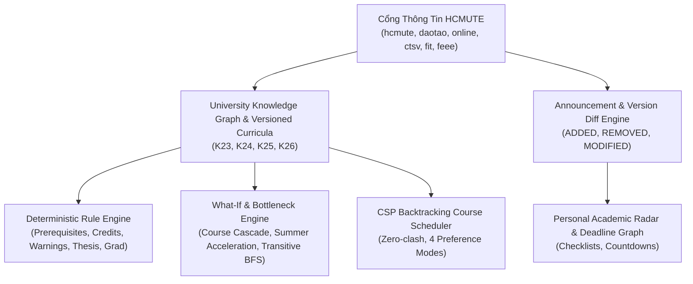

# 🎓 HCMUTE Academic Intelligence & University OS Specification
> **Vault Node**: `Academic-Intelligence-Engine-Spec` | **Tags**: `#academic` `#hcmute` `#rule-engine` `#curriculum-graph` `#what-if` `#zero-fabrication`

---

## 1. Triết Lý Cốt Lõi: Nguồn Tin Trường Đại Học Là Thẩm Quyền Tối Thượng
- **Supreme Rule**: Cổng thông tin và văn bản chính thức của HCMUTE là căn cứ thẩm quyền tối hậu.
- **LLM KHÔNG PHẢI NGUỒN THẨM QUYỀN**: Mọi bài toán tính toán tín chỉ, kiểm tra môn tiên quyết, xếp thời khóa biểu, đối soát cảnh báo học vụ và xét điều kiện làm khóa luận phải được giải quyết bằng **Động cơ Luật Tất Định (Deterministic Academic Rule Engine)**.

---

## 2. Kiến Trúc 6 Phân Hệ Học Thuật (HCMUTE Reference Model)

---

## 3. Danh Mục Các Động Cơ Kỹ Thuật
1. **`academicTruthEngine.js`**: Động cơ Chân lý Học thuật quản lý `HCMUTE_ACADEMIC_GOLD_RULESET`. Mỗi quy tắc bắt buộc gắn liền với mã văn bản căn cứ (`QĐ 3116/QĐ-ĐHSPKT ngày 22/08/2025`), điều khoản, trang, ngày hiệu lực và trạng thái xác minh (`VERIFIED`, `PARTIALLY_VERIFIED`, `UNVERIFIED`).
2. **`hcmuteKnowledgeGraph.js`**: Mô hình hóa 5 Khoa, 18 Bộ môn, 12 Ngành, 14 Phòng Lab và danh mục 68 môn học cơ sở & chuyên ngành.
3. **`versionedCurricula.js`**: Khung CTĐT phiên bản độc lập theo khóa (K23 TOEIC 450 vs K26 TOEIC 550 / B2; 150 tín chỉ cho KTPM).
4. **`academicRuleEngine.js`**: Bộ quy tắc cấu trúc kiểm tra điều kiện tiên quyết, giới hạn tín chỉ (12–24 tín chỉ, vượt tải 28 tín chỉ cho GPA $\ge 3.2$), cảnh báo học vụ tín chỉ HCMUTE theo QĐ 3116 (kỳ 1 $< 0.80$, kỳ $N < 1.00$, rớt $> 50\%$ TC, nợ $> 24$ tín chỉ), và điều kiện làm Khóa luận ($\ge 110$ tín chỉ, GPA $\ge 2.50$).
5. **`whatIfEngine.js`**: Mô phỏng lan truyền (BFS/DFS) khi rớt môn, xếp hạng các môn nút thắt (Bottleneck ranking: `PROG130103`, `SWEN330103`).
6. **`announcementEngine.js`**: So khớp chính xác sự thay đổi giữa các phiên bản thông báo (dời hạn chót $30/08 \rightarrow 02/09$, đổi phòng, thêm biểu mẫu).
7. **`liveSourceWatcher.js`**: Giám sát nguồn trực tuyến theo 4 phân tầng SLA (`CRITICAL_NOTICE`, `ANNOUNCEMENT`, `CURRICULUM`, `REGULATION`), theo dõi mã băm SHA-256, kiểm tra ETag 304, và thuật toán Exponential Backoff + Jitter khi gặp sự cố mạng.
8. **`documentSnapshotStore.js`**: Kho lưu trữ bản chụp bất biến (`DOC_QD_3116`, `DOC_QD_3811`, `DOC_FIT_CURRICULUM_SE`) và cơ chế phục hồi an toàn `LAST_VERIFIED_STATE` kèm cờ `STALE_SOURCE_WARNING`.
9. **`semanticDiffEngine.js`**: Động cơ lọc bỏ nhiễu định dạng HTML/CSS (Cosmetic), bóc tách biến thiên học thuật trọng yếu (Semantic: Deadlines, GPA, Credits, English standards) và kích hoạt `RULE_CHANGE_DETECTED`.
10. **`ruleDependencyDAG.js`**: Đồ thị phụ thuộc 6 tầng (`DOCUMENT` ➔ `CLAUSE` ➔ `RULE` ➔ `CODE` ➔ `TEST` ➔ `FEATURE`), quản lý chuyển trạng thái `ACTIVE` ➔ `SUPERSEDED`, sinh quy tắc `CANDIDATE`, và bảo vệ qua cổng phê duyệt Human Review Gate.
11. **`parserIntegrityGuard.js`**: Phòng hộ sập cấu trúc parser và cách ly dữ liệu bất thường (Quarantine) nếu danh mục môn học sụt giảm đột ngột $> 50\%$.
12. **`academicDigitalTwin.js`**: Bản sao số học thuật của sinh viên (Digital Twin) tự động tính toán lại lộ trình tốt nghiệp, nút thắt môn học và gửi cảnh báo Radar đích xác (Zero-spam).
