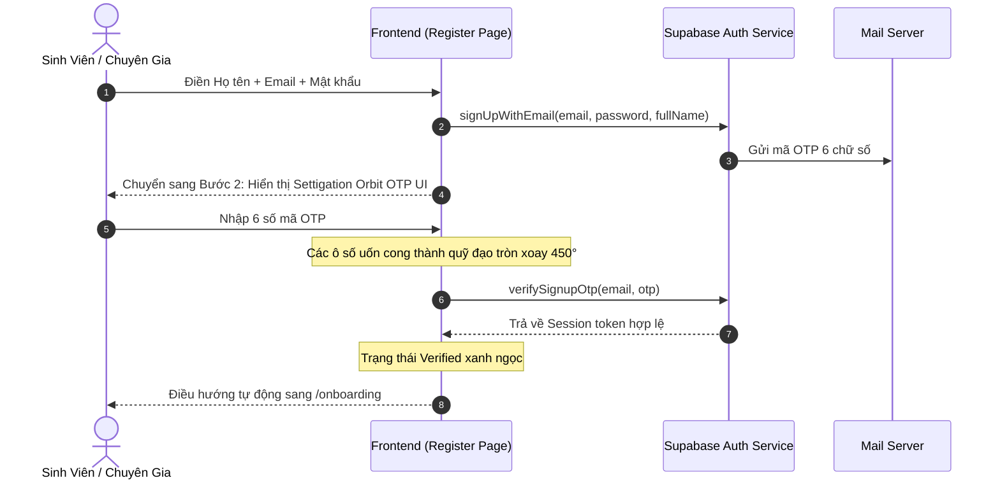

# 🔐 Luồng Xác Thực Hai Bước & Settigation OTP Orbit
> **Vault Node**: `Auth-Flow-OTP-Verification` | **Tags**: `#auth` `#otp` `#settigation` `#security`

---

## 1. Quy Trình Xác Thực (2-Step Registration Flow)

---

## 2. Settigation OTP Verification v3 Specs
- **Tệp nguồn**: `frontend/src/components/ui/otp-verification-orbit.jsx`
- **Mô phỏng**: Settigation Component 89 (*"4 boxes. One ring. Zero dependencies"*).
- **Hỗ trợ**:
  - Hỗ trợ cả mã 4 số và 6 số (mặc định 6 số cho Supabase).
  - Tự động bắt sự kiện `onComplete` để verify không cần bấm nút phụ.
  - Vòng đếm ngược gửi lại mã OTP (60s countdown).
  - Khử rung lắc và báo lỗi tinh tế khi mã không hợp lệ.
  - Hiệu ứng hoàn tất với ngọc lục bảo `#0caa8f` phát sáng.
