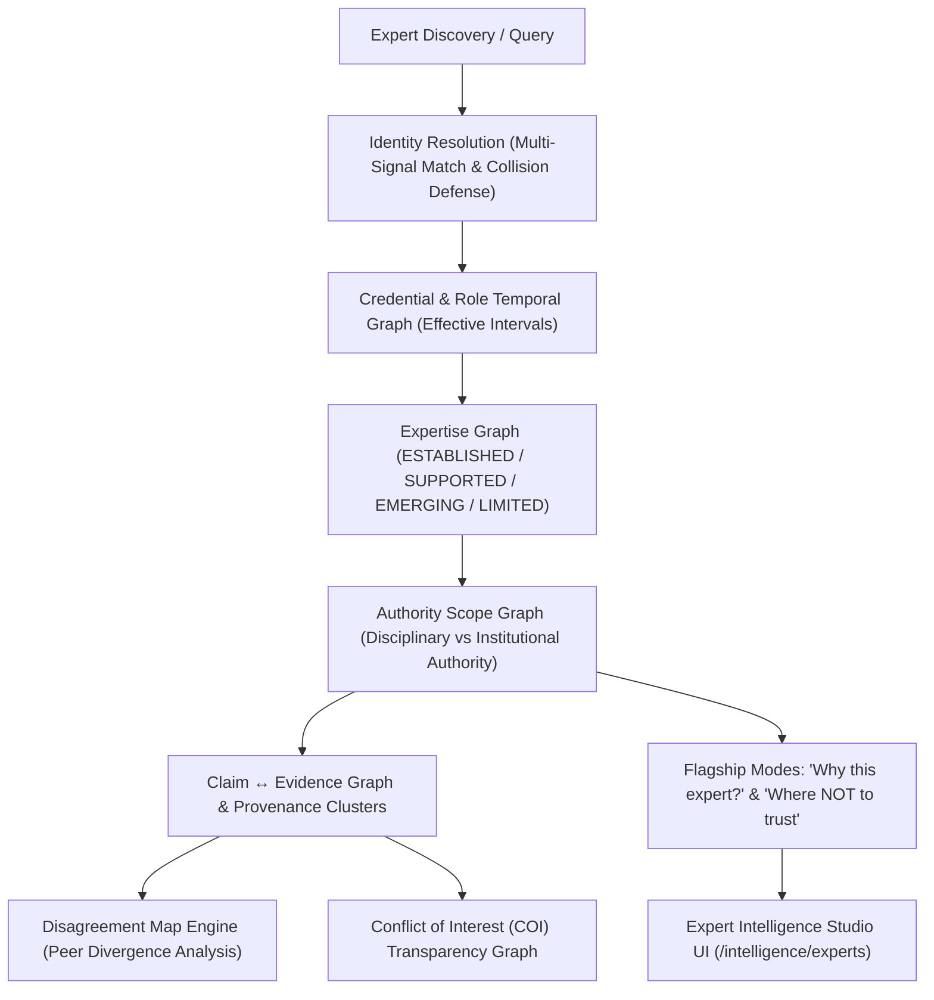

# 🎓 Expert Intelligence V2 — Verified Expert Knowledge Graph & Scope Boundaries
> **Vault Node**: `Expert-Intelligence-V2` | **Tags**: `#expert-intelligence` `#knowledge-graph` `#v9-reality-first` `#scope-boundaries`

---

## 1. Executive Overview

Expert Intelligence V2 moves beyond simplistic expert directories and arbitrary reputation scores to construct a **Verified Expert Knowledge Graph** grounded in empirical evidence, temporal intervals, strict non-authority invariants, and adversarial impersonation defenses.

---

## 2. Core Non-Negotiable Invariants

| Principle | Meaning & Enforcement |
| :--- | :--- |
| **`EXPERTISE ≠ AUTHORITY`** | High academic expertise in AI or Computer Science never confers administrative authority over university regulations or tuition policies. |
| **`IDENTITY ≠ EXPERTISE`** | Being a verified faculty member does not grant authority in fields outside verified research domains. |
| **`CREDENTIAL ≠ CURRENT ROLE`** | A verified historical position (e.g., Department Head in 2022) does not persist as a current role in 2026 without active renewal. |
| **`POPULARITY ≠ CREDIBILITY`** | Social follower counts, student ratings, or public visibility carry zero weight in scientific evaluation. |
| **`PUBLICATION COUNT ≠ TRUTH`** | Volume of papers does not make an ungrounded claim true; every claim requires explicit evidentiary backing. |
| **`SHARED EVIDENCE ≠ INDEPENDENT CONSENSUS`** | When 3 professors cite the same study, it represents **one provenance cluster**, not 3 independent confirmations. |
| **`UNKNOWN MUST REMAIN UNKNOWN`** | Missing credentials or unverified affiliations are never filled in by generative hallucinations or averaging. |

---

## 3. Key Components & Implementation

### A. Multi-Signal Identity Resolution (`expertEntityResolver.js`)
- **Strong Signals**: Official faculty directory (`fit.hcmute.edu.vn`), verified ORCID, institutional email (`@hcmute.edu.vn`), publication DOI.
- **Weak Signals**: Social handle, avatar, bio text, follower count.
- **Collision Defense**: Same-name queries across institutions produce `IDENTITY_AMBIGUOUS` (never merged without strong signals).
- **Impersonation Defense**: Detects fake institutional portals, copied professor profiles, and AI-generated CVs.

### B. Authority Scope & "Where NOT to Trust" Engine (`expertScopeEngine.js`)
- Evaluates claims against Disciplinary vs Institutional Authority.
- Explicitly outputs Scope Boundaries:
  - `ESTABLISHED`: Peer-reviewed domain mastery.
  - `SUPPORTED`: Related research experience.
  - `EMERGING`: Cross-disciplinary explorations.
  - `LIMITED`: Heuristic familiarity, lacking primary evidence.
  - `UNESTABLISHED / OUT_OF_SCOPE`: Areas outside competency (e.g. administrative regulations).

### C. Disagreement Map Engine (`expertDisagreementMap.js`)
- Compares claims across verified domain peers on open research questions.
- Identifies root causes of divergence:
  - `DIFFERENT_DATASETS`
  - `DIFFERENT_COHORTS`
  - `DIFFERENT_TIMEFRAMES`
  - `DIFFERENT_METHODOLOGIES`
- Completely eliminates subjective "winner-picking" based on fame.

### D. "Why This Expert?" & Claim Track Record (`expertContextEngine.js`)
- Generates structured evidentiary profiles:
  - Identity verification proof (ORCID, institutional domain)
  - Current role proof and effective interval
  - 3 most recent peer-reviewed publications
  - Explicit scope limitations

### E. Conflict of Interest (COI) Graph (`expertConflictEngine.js`)
- Tracks commercial sponsorships, consultancy agreements, and vendor ties.
- Labels affected statements with `POTENTIAL_CONFLICT` for transparency while avoiding moralistic accusations.

### F. Durable Store & Retraction Cascades (`expertStore.js`)
- Preserves historical claim versions (V1 $\rightarrow$ V2).
- When a cited paper is retracted, automatically transitions dependent claims to `NEEDS_REEVALUATION` or `RETRACTED`.
- Enforces private contact data redaction (`privateContact`).

---

## 4. API Endpoints

- `GET /api/intelligence/experts`: List and search verified experts with domain filtering.
- `GET /api/intelligence/experts/[expertId]`: Full profile, scopes, credentials, roles, limitations.
- `GET /api/intelligence/experts/[expertId]/claims`: Claim track record and revisions.
- `GET /api/intelligence/experts/[expertId]/evidence`: Publications, evidence spans, and provenance clusters.
- `POST /api/intelligence/experts/resolve`: Multi-signal entity resolution.
- `POST /api/intelligence/experts/verify-claim`: Claim-to-scope evaluation with "Where NOT to trust" output.
- `GET /api/intelligence/experts/disagreements`: Disagreement mappings across expert domains.

---

## 5. Verification & Test Metrics

- **Expert Suites**: **82 / 82 Tests PASS (100.0%) across 27 suites**.
- **Master Regression**: **692 / 692 Tests PASS (100.0%) across 230 suites**.
- **Production Build**: **81 / 81 Routes Compiled and Optimized (0 errors)**.
- **Repeatability**: 3 consecutive deterministic test cycles verified (100.0% PASS).
