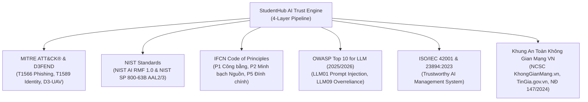

# 🌐 Global Standards & Higher Education Digital Ecosystem Specification
> **Vault Node**: `Global-Standards-and-Ecosystem-Spec` | **Tags**: `#architecture` `#security` `#standards` `#mitre` `#nist` `#ifcn` `#owasp` `#iso` `#university-ecosystem`

---

## 1. Hệ Thống Tiêu Chuẩn Quốc Tế & Khung An Toàn Thông Tin Toàn Cầu

Hệ thống AI Trust Engine của StudentHub được chuẩn hóa và đối soát theo 6 khung tiêu chuẩn bảo mật, an toàn AI và kiểm chứng báo chí quốc tế:

---

## 2. Danh Mục Khung Tiêu Chuẩn & Quy Chiếu Kỹ Thuật

| Khung Tiêu Chuẩn (Framework) | Mã / Khoản Tiêu Chuẩn | Nội Dung Áp Dụng Trong AI Trust Pipeline |
| :--- | :--- | :--- |
| **MITRE ATT&CK®** | `T1566.001 / T1566.002` | Phòng thủ Spearphishing Link & Spearphishing Attachment giả mạo trường ĐH / ngân hàng. |
| **MITRE ATT&CK®** | `T1589.001 & T1656` | Chặn thu thập mã OTP, danh tính cá nhân và mạo danh tổ chức (Impersonation). |
| **NIST AI RMF 1.0** | `Govern / Map / Measure / Manage` | Quản trị rủi ro AI đa lớp, ranh giới tất định không thể vượt qua, đo lường độ tin cậy hiệu chuẩn. |
| **NIST SP 800-63B** | `AAL2 / AAL3 Digital Identity` | Hướng dẫn xác thực danh tính số, cấm tuyệt đối nhập mã OTP qua kênh không chính thống. |
| **IFCN Code of Principles** | `Principles 1, 2, 4, 5` | Minh bạch nguồn sơ cấp, phân cụm bài báo sao chép (Lineage), cơ chế cập nhật thời gian (`POLICY_UPDATED`). |
| **OWASP LLM (2025/2026)** | `LLM01, LLM02, LLM09` | Chống Prompt Injection, bảo vệ dữ liệu nhạy cảm, ngăn ngừa sự phụ thuộc đơn phương vào LLM. |
| **ISO/IEC 42001:2023** | `AIMS Certification Target` | Hệ thống quản trị trí tuệ nhân tạo tin cậy và giải trình được (Explainable AI). |
| **NCSC & TinGia.gov.vn** | `Nghị định 147/2024/NĐ-CP` | Đồng bộ dữ liệu phản ánh tin giả và danh sách tên miền lừa đảo quốc gia. |

---

## 3. Hệ Sinh Thái Số Của 50+ Trường Đại Học & Cổng Dịch Vụ Công

Hệ thống được nạp trước toàn bộ cơ sở dữ liệu các tên miền chính thống và các phân hệ số (subdomains) của các trường đại học hàng đầu:

### 🏛️ 1. Trường ĐH Sư phạm Kỹ thuật TP.HCM (HCMUTE)
- **Cổng thông tin & phân hệ**: `hcmute.edu.vn`, `fhq.hcmute.edu.vn`, `fit.hcmute.edu.vn`, `online.hcmute.edu.vn`, `ctsv.hcmute.edu.vn`, `tuyensinh.hcmute.edu.vn`, `daotao.hcmute.edu.vn`, `thuvien.hcmute.edu.vn`, `qlcl.hcmute.edu.vn`, `kktx.hcmute.edu.vn`.

### 🏛️ 2. Đại học Quốc gia TP.HCM (VNU-HCM) & Các Trường Thành Viên
- `vnuhcm.edu.vn`, `uit.edu.vn` (CNTT), `hcmus.edu.vn` (KHTN), `hcmut.edu.vn` (Bách Khoa), `hcmussh.edu.vn` (KHXH&NV), `hcmiu.edu.vn` (Quốc Tế), `uel.edu.vn` (Kinh tế - Luật), `medvnu.edu.vn` (Khoa Y), `ktxhcm.edu.vn` (KTX ĐHQG).

### 🏛️ 3. Đại học Quốc gia Hà Nội (VNU-HN) & Các Trường Thành Viên
- `vnu.edu.vn`, `uet.vnu.edu.vn` (Công nghệ), `hus.vnu.edu.vn` (KHTN), `ulis.vnu.edu.vn` (Ngoại ngữ), `ussh.vnu.edu.vn` (KHXH&NV), `is.vnu.edu.vn` (Quốc tế).

### 🏛️ 4. Khối Trường Đại Học Kỹ Thuật, Kinh Tế, Y Dược & Quốc Tế
- **HUST** (`hust.edu.vn`), **UEH** (`ueh.edu.vn`), **FTU** (`ftu.edu.vn`), **CTU** (`ctu.edu.vn`), **ĐH Đà Nẵng** (`udn.vn`, `dut.udn.vn`, `ute.udn.vn`), **PTIT** (`ptit.edu.vn`), **TDTU** (`tdtu.edu.vn`), **FPT** (`fpt.edu.vn`), **RMIT** (`rmit.edu.vn`).

### 🏛️ 5. Cổng Dịch Vụ Công & Ngân Hàng
- `chinhphu.vn`, `moet.gov.vn`, `bocongan.gov.vn`, `vneid.gov.vn`, `dichvucong.gov.vn`.
- `vietcombank.com.vn`, `mbbank.com.vn`, `techcombank.com`, `bidv.com.vn`, `agribank.com.vn`, `momo.vn`, `vnpay.vn`.

---

## 4. Mạng Lưới Nhận Diện Mối Đe Dọa Trên Mạng Xã Hội (Social Media Surfaces)

- **Facebook**: Nhận diện huy hiệu tích xanh chính thức, bất thường ngày tạo Fanpage trong 30 ngày (Creation Anomaly) và lịch sử đổi tên trang.
- **Telegram**: Bắt các bot nhiệm vụ tuyển dụng CTV, kênh rao bán đề thi giả mạo yêu cầu chuyển tiền mã hóa.
- **Zalo**: Bắt các nhóm lừa nạp cọc việc làm, phí xử lý hồ sơ sinh viên.
- **TikTok & Threads**: Phát hiện video dùng giọng đọc AI lồng tiếng sai lệch phát ngôn lãnh đạo về học phí và lịch nghỉ học.
