# 🌌 StudentHub AI — Permanent Knowledge Vault & Second Brain
> **Central Map of Content (MOC)**
> Kho lưu trữ ngữ cảnh vĩnh viễn cho **AI Agents (Claude Code, Antigravity, Cursor)** và **Core Team**.

---

## 🗺️ Cấu trúc Mạng Lưới Tri Thức (Graph Nodes)

```mermaid
graph TD
    Index["🌌 Index (Central Hub)"] --> Meta["🧠 00 - AI Agent Permanent Context"]
    Index --> Arch["🏗️ 01 - System Architecture"]
    Index --> Design["🎨 02 - Design & Refero Systems"]
    Index --> Features["🚀 03 - Features & Modules"]
    Index --> Roadmap["📋 04 - Roadmap & Tasks"]

    Meta --> ActiveCtx["Active-Session-Context.md"]
    Meta --> Memory["00-Permanent-Memory.md"]

    Arch --> SysArch["System-Architecture.md"]
    Arch --> TechStack["Tech-Stack.md"]
    Arch --> AuthFlow["Auth-Flow-OTP-Verification.md"]
    Arch --> Schema["Database-Supabase-Schema.md"]

    Design --> Refero["DESIGN.md (Refero Styles)"]
    Design --> Settigation["Settigation-OTP-Verification-v3.md"]
    Design --> OpenHero["OpenHero-Cinematic-Aesthetics.md"]

    Features --> Mentor["AI-Mentor-Copilot.md"]
    Features --> Whiteboard["Interactive-Whiteboard-Tldraw.md"]
    Features --> Workspaces["Study-Workspaces-Realtime.md"]
```

---

## 📂 Các Phân Khu Tri Thức

### 1. [[00-Permanent-Memory|🧠 00 - AI Agent Permanent Context]]
- [[00-Permanent-Memory|Vĩnh Viễn Ngữ Cảnh]]: Quy chuẩn ghi nhớ bộ nhớ, quy tắc tiếp nhận nhiệm vụ.
- [[Active-Session-Context|Ngữ Cảnh Hiện Tại (Active Session)]]: Snapshot trạng thái phát triển, phiên làm việc gần nhất.
- [[Coding-Conventions|Quy Chuẩn Code & Next.js 16/React 19]]: Không viết code thừa, tuân thủ App Router.

### 2. [[System-Architecture|🏗️ 01 - System Architecture]]
- [[System-Architecture|Kiến Trúc Tổng Thể]]: Frontend Next.js 16 + Supabase Backend + Vercel AI SDK.
- [[Tech-Stack|Công Nghệ Cốt Lõi]]: Danh sách thư viện và vai trò từng module.
- [[Auth-Flow-OTP-Verification|Luồng Đăng Ký & Xác Thực OTP]]: Bảo mật 2 bước + Settigation Orbit Animation.
- [[Database-Supabase-Schema|Supabase DB Schema]]: Bảng `profiles`, `workspaces`, `whiteboards`, `messages`.

### 3. [[DESIGN|🎨 02 - Design & Refero Systems]]
- [[DESIGN|Refero Styles Design System]]: Token màu HSL, Dark Space Canvas, Frosted Glass.
- [[Settigation-OTP-Verification-v3|Settigation Orbit OTP v3]]: Component xoay quỹ đạo số chuyển động mượt mà.
- [[OpenHero-Cinematic-Aesthetics|OpenHero Cinematic Aesthetics]]: Hiệu ứng video/mesh glow aura.
- [[UI-Component-Registry|Danh Mục UI Components]]: Button, Spotlight, BorderBeam, Meteors, NumberTicker.

### 4. [[AI-Mentor-Copilot|🚀 03 - Features & Modules]]
- [[AI-Mentor-Copilot|AI Mentor & Copilot]]: Động cơ giải bài, tóm tắt tài liệu, phân tích đề thi.
- [[Interactive-Whiteboard-Tldraw|Whiteboard Tldraw]]: Bảng vẽ tư duy tương tác trực tiếp.
- [[Study-Workspaces-Realtime|Không Gian Học Tập Nhóm (Workspaces)]]: Chia sẻ tài liệu, chat thời gian thực.
- [[Student-Benefit-Program|Student Benefit Program]]: Nhận diện email `.edu` và cộng điểm uy tín.
- [[Creative-Engine-Showcases|Creative Web & 3D Engineering Showcases]]: Bộ sưu tập 4 tác phẩm Lumora, Soda 3D, Flow Wave và Cosmic Dust.

### 5. [[Sprint-Board|📋 04 - Roadmap & Tasks]]
- [[Sprint-Board|Sprint Tasks & Tiến Độ]]: Danh sách tính năng đang làm, hoàn tất, backlog.
- [[Architecture-Decisions-ADR|Architecture Decisions (ADR)]]: Ghi lại các quyết định kỹ thuật quan trọng.

---
*Cập nhật tự động bởi Antigravity & AI Agents.*
